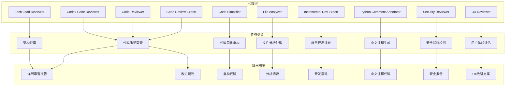
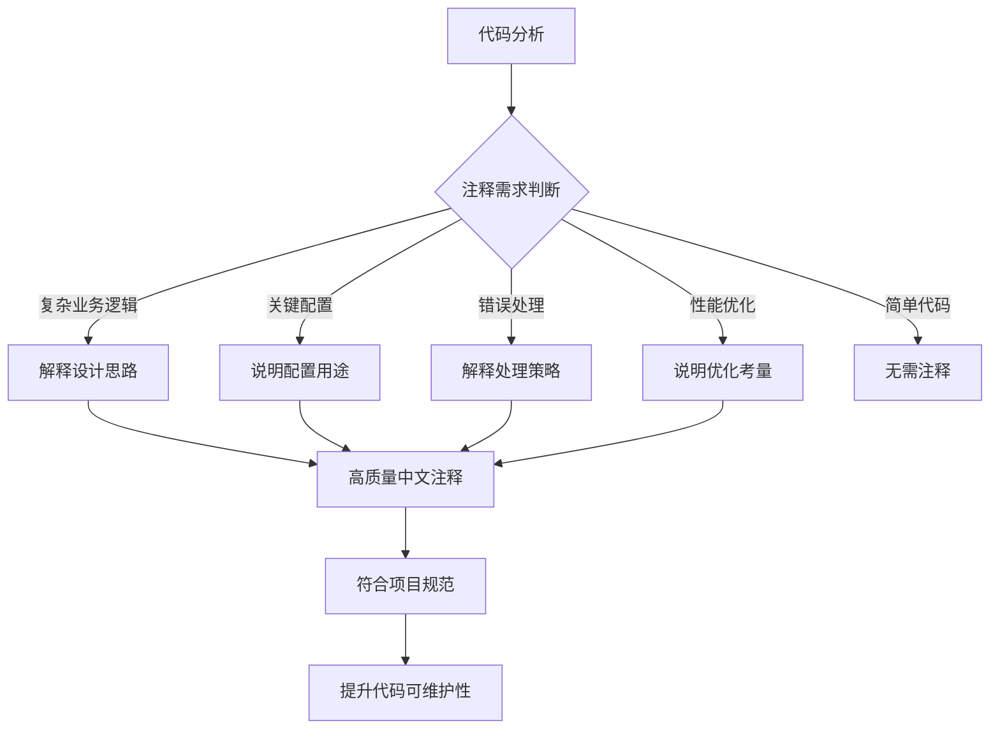
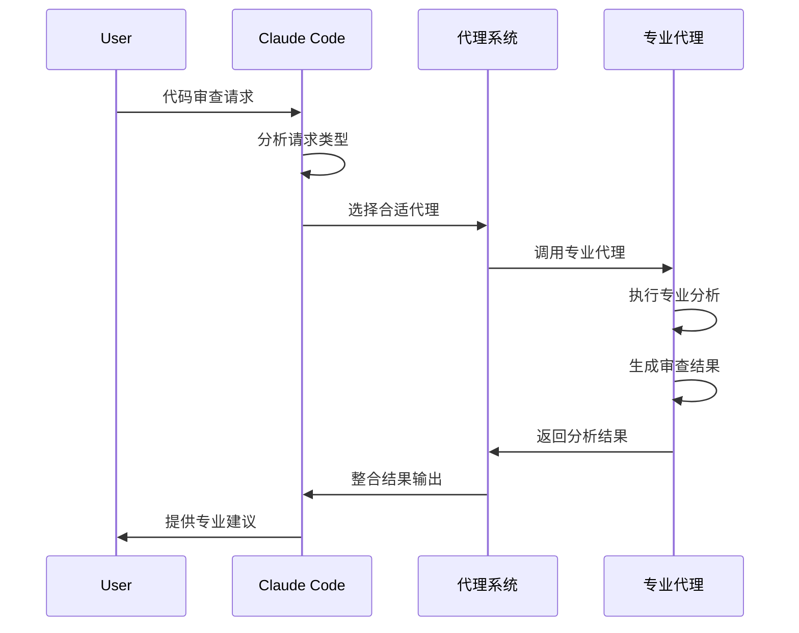
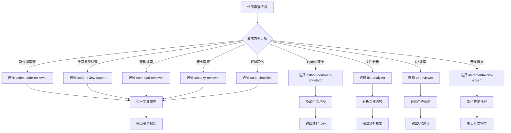
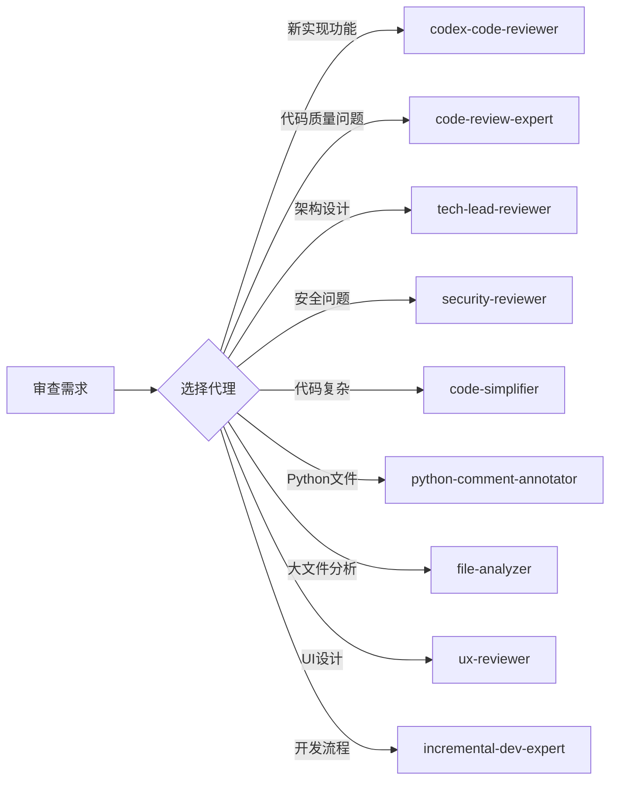
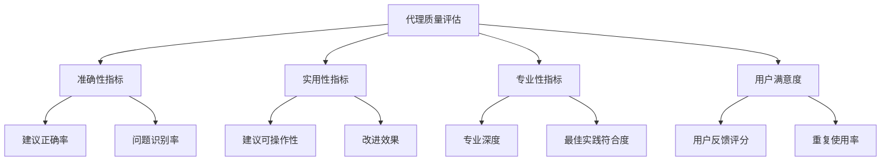
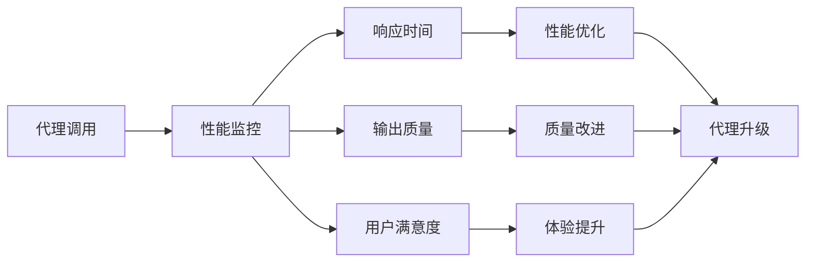
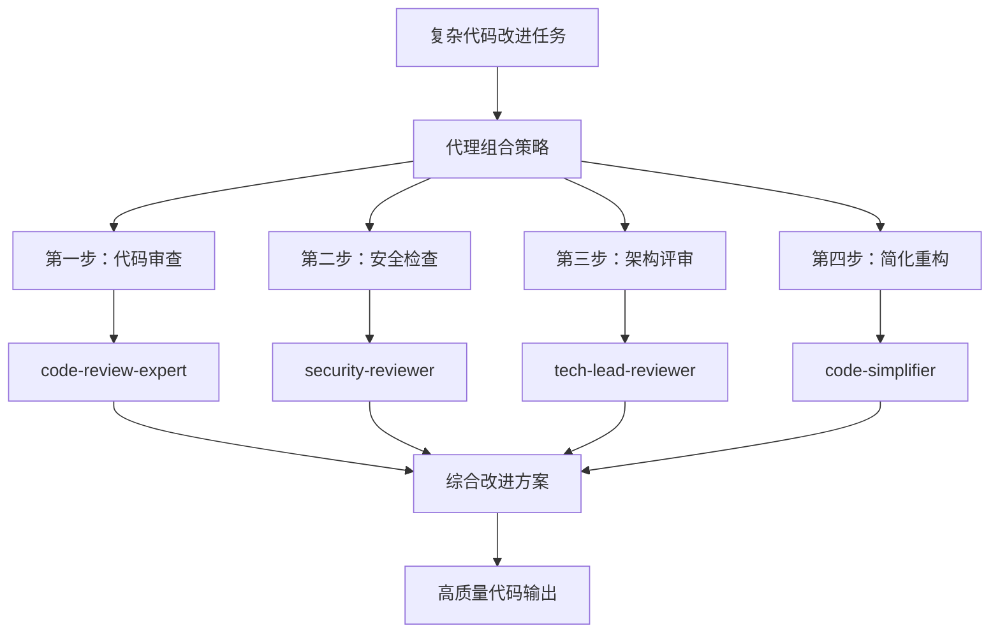
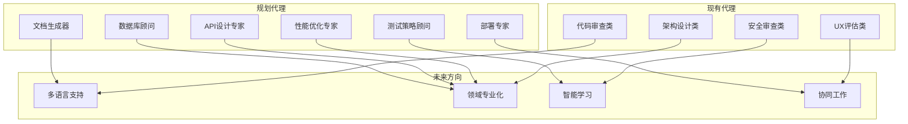

# Claude 代码审查代理系统

Claude Code 的专业代码审查代理集合，为不同类型的代码审查任务提供智能化的自动化支持。

## 🎯 系统概览

本目录包含了为 Claude Code 定制的专业代理，每个代理都专注于特定的代码审查和开发任务，确保高质量的代码交付和最佳实践的应用。

### 代理架构设计



## 📋 代理分类

### 🔍 代码质量审查类

| 代理名称 | 功能描述 | 适用场景 | 专业程度 |
|---------|---------|---------|---------|
| **code-review-expert** | 代码质量、最佳实践、潜在问题审查 | 全面代码质量检查 | ⭐⭐⭐⭐⭐ |
| **code-reviewer** | 代码质量、最佳实践、性能优化审查 | 代码质量改进建议 | ⭐⭐⭐⭐ |
| **codex-code-reviewer** | 新代码质量审查、bug检查、标准符合性 | 新代码质量把关 | ⭐⭐⭐⭐ |

### 🏗️ 架构设计类

| 代理名称 | 功能描述 | 适用场景 | 专业程度 |
|---------|---------|---------|---------|
| **tech-lead-reviewer** | 技术领导视角的架构决策、复杂问题评审 | 重大技术决策、架构设计 | ⭐⭐⭐⭐⭐ |

### 🔧 代码优化类

| 代理名称 | 功能描述 | 适用场景 | 专业程度 |
|---------|---------|---------|---------|
| **code-simplifier** | 代码简化、复杂度降低、可读性提升 | 复杂代码重构、可读性改善 | ⭐⭐⭐⭐ |

### 📊 分析处理类

| 代理名称 | 功能描述 | 适用场景 | 专业程度 |
|---------|---------|---------|---------|
| **file-analyzer** | 文件内容分析、日志处理、关键信息提取 | 大文件分析、日志解读 | ⭐⭐⭐⭐ |

### 🚀 开发流程类

| 代理名称 | 功能描述 | 适用场景 | 专业程度 |
|---------|---------|---------|---------|
| **incremental-dev-expert** | 增量开发、TDD、简单设计原则 | 功能开发、迭代改进 | ⭐⭐⭐⭐⭐ |

### 🌐 国际化支持类

| 代理名称 | 功能描述 | 适用场景 | 专业程度 |
|---------|---------|---------|---------|
| **python-comment-annotator** | Python代码中文注释自动生成 | 中文代码文档化 | ⭐⭐⭐⭐⭐ |

### 🔒 安全审查类

| 代理名称 | 功能描述 | 适用场景 | 专业程度 |
|---------|---------|---------|---------|
| **security-reviewer** | 安全漏洞检测、敏感数据处理、安全最佳实践 | 安全代码审查 | ⭐⭐⭐⭐⭐ |

### 🎨 用户体验类

| 代理名称 | 功能描述 | 适用场景 | 专业程度 |
|---------|---------|---------|---------|
| **ux-reviewer** | 用户界面可用性、无障碍访问、用户体验评估 | UI/UX设计评审 | ⭐⭐⭐⭐ |

## 🎯 核心代理详解

### 🐍 Python 注释代理 (Python Comment Annotator)

#### 代理特色

- **智能中文注释生成**：自动为 Python 代码添加符合项目标准的中文注释
- **上下文感知**：理解代码逻辑，生成有意义的注释而非简单描述
- **项目标准遵循**：严格按照 CLAUDE.md 中的注释指南执行
- **主动触发机制**：在 Python 代码变更后自动调用

#### 注释生成原则



#### 注释质量标准

| 注释类型 | 要求 | 示例 |
|---------|------|------|
| **功能解释** | 说明"为什么"而不是"是什么" | `# 跳过标题行，从正文开始处理` |
| **设计决策** | 解释技术选择的原因 | `# 使用生成器避免内存溢出` |
| **业务规则** | 说明业务逻辑的含义 | `# VIP用户享受8折优惠` |
| **错误处理** | 解释异常处理策略 | `# 捕获超时异常，保证系统稳定` |

#### 触发条件

```python
# 自动触发场景
1. 创建新的 Python 文件
2. 修改现有 Python 文件
3. 添加复杂业务逻辑
4. 更新配置常量
5. 实现错误处理逻辑
```

## 🔄 代理工作流程

### 统一代理调用流程



### 代理决策树



## 🛠️ 使用指南

### 代理调用方式

#### 1. 自动触发
某些代理会在特定条件下自动触发：
- `python-comment-annotator`：Python 代码修改后自动调用
- `codex-code-reviewer`：新代码实现后自动调用

#### 2. 手动调用
通过 Task 工具手动调用特定代理：

```python
# 调用代码审查专家
Task("代码质量审查", "请审查这段代码的质量和最佳实践", "code-review-expert")

# 调用代码简化器
Task("代码简化", "请简化这个复杂函数", "code-simplifier")

# 调用安全审查员
Task("安全审查", "请检查这段代码是否存在安全漏洞", "security-reviewer")
```

### 代理选择指南



## 📊 质量保证

### 代理输出标准

所有代理都遵循以下质量标准：

1. **准确性**：提供准确、可行的建议
2. **专业性**：基于行业最佳实践
3. **可操作性**：提供具体的改进步骤
4. **上下文相关**：考虑项目的具体需求
5. **持续改进**：根据反馈优化输出质量

### 质量评估指标



## 🔧 配置管理

### 代理配置结构

每个代理都包含以下配置：

```yaml
# 代理基本配置
name: 代理名称
description: 代理功能描述
model: 使用的AI模型

# 触发条件
triggers:
  - 触发条件1
  - 触发条件2

# 输出格式
output_format:
  - 格式要求1
  - 格式要求2

# 专业领域
expertise:
  - 专业领域1
  - 专业领域2
```

### 代理性能监控



## 🚀 最佳实践

### 代理使用建议

1. **选择合适的代理**：根据具体需求选择最专业的代理
2. **提供充分上下文**：给代理足够的背景信息
3. **明确需求目标**：清楚说明希望达成的目标
4. **迭代改进**：根据代理建议持续改进代码
5. **反馈学习**：从代理的建议中学习最佳实践

### 代理组合使用



## 📈 扩展发展

### 未来代理规划



### 代理能力增强

1. **学习能力**：从历史审查中学习项目特定的最佳实践
2. **上下文记忆**：记住项目的特定需求和约定
3. **协作能力**：多个代理协同工作解决复杂问题
4. **自定义配置**：支持项目特定的配置和规则

## 🎯 总结

Claude 代码审查代理系统为高质量的代码开发提供了全方位的专业支持。通过专业化的代理分工，确保每个代码审查任务都能得到最专业的处理，从而提升整体代码质量和开发效率。

### 核心价值

- **专业性**：每个代理都专注于特定领域的深度 expertise
- **自动化**：减少手动代码审查的工作量
- **一致性**：确保代码质量和标准的一致性
- **可扩展性**：支持新代理的添加和现有代理的升级
- **中文支持**：特别针对中文开发环境优化

通过这个代理系统，Claude Code 能够为开发者提供企业级的代码质量保障，让每一行代码都符合最高的专业标准。