# Spec-Task Workflow

## Overview

The `spec-task` command system implements a **Specification-Driven Development** workflow that ensures systematic feature development through structured phases of requirements, design, and task planning before implementation.

## 🎯 Purpose

- **Systematic Development**: Break down complex features into manageable, well-defined phases
- **Quality Assurance**: Ensure thorough planning before implementation
- **Approval Gates**: Interactive review and approval at each phase
- **Traceability**: Track progress from initial idea to implementation
- **Documentation**: Maintain comprehensive documentation throughout the lifecycle

## 🏗️ Workflow Architecture

```mermaid
graph LR
    A[项目描述] --> B[spec-task:init]
    B --> C[spec-task:prd]
    C --> D{PRD审批}
    D -->|批准| E[spec-task:requirements]  
    D -->|修改| C
    E --> F{需求审批}
    F -->|批准| G[spec-task:design]
    F -->|修改| E
    G --> H{设计审批}
    H -->|批准| I[spec-task:tasks]
    H -->|修改| G
    I --> J{任务审批}
    J -->|批准| K[spec-task:impl]
    J -->|修改| I
    K --> L[实施完成]
```



## 📁 Directory Structure

```
.tasks/{feature-name}/
├── spec.json           # Metadata and approval tracking
├── prd.md             # Product Requirements Document with user stories
├── requirements.md     # System requirements with EARS acceptance criteria
├── design.md          # Technical architecture and design  
├── tasks.md           # Implementation plan and task breakdown
└── impl.md            # Implementation tracking and progress
```

## 🔧 Available Commands

### 1. `/spec-task:init <project-description>`

**Purpose**: Initialize a new specification from project description

**What it does**:
- Generates unique feature name from description
- Creates `.tasks/{feature-name}/` directory structure  
- Creates template files with project context
- Initializes metadata tracking in `spec.json`

**Example**:
```bash
/spec-task:init "创建一个用户管理系统，支持注册、登录和权限管理"
```

**Output**: 
- Feature directory created
- Next command: `/spec-task:prd {feature-name}`

---

### 2. `/spec-task:prd <feature-name>`

**Purpose**: Generate Product Requirements Document with business value and user stories

**What it does**:
- Creates business-oriented requirements document
- Generates user stories using User Story or Job Story format
- Defines business goals, scope, and success metrics
- Establishes high-level acceptance criteria
- Creates unique Story IDs for traceability

**Story Formats**:
- **User Story**: `作为 <角色>，我想要 <能力>，以便 <收益>`
- **Job Story**: `当 <情境>，我想要 <动机>，从而 <预期结果>`

**Key Sections**:
- Background & Opportunity
- Business Goals & Non-Goals
- User Personas & Scenarios
- Scope (In/Out)
- User Stories with high-level acceptance criteria
- Milestones & Release Plan
- Risks & Trade-offs
- Success Metrics

**Example Output**:
```markdown
### STORY-001: 实时进度可见
**作为**读者，**我想要**在写作/评分进行时实时看到进度与阶段结果，**以便**及时决策是否等待或中止。

**高层验收标准：**
- 页面不刷新即可看到新的进度卡片
- 中断后刷新页面可恢复到最新进度视图
- 连接异常时有可理解的用户提示

**优先级：** P1
```

**Next Step**: Review PRD → `/spec-task:requirements {feature-name} -y`

---

### 3. `/spec-task:requirements <feature-name>`

**Purpose**: Generate system requirements from PRD using EARS format

**What it does**:
- Analyzes approved PRD and user stories
- Derives functional requirements (FR) from Story items
- Defines non-functional requirements (NFR) with measurable thresholds
- Creates testable acceptance criteria using EARS syntax
- Establishes traceability matrix linking Stories to FR/NFR
- Updates approval tracking metadata

**EARS Format** (Required):
- `WHEN [event/condition] THEN [system] SHALL [response]`
- `IF [precondition/state] THEN [system] SHALL [response]`  
- `WHILE [ongoing condition] THE [system] SHALL [continuous behavior]`
- `WHERE [location/context/trigger] THE [system] SHALL [contextual behavior]`

**Example Output**:
```markdown
### Requirement 1: User Authentication

**User Story:** As a 用户, I want 安全登录, so that 我可以访问个人数据

#### Acceptance Criteria
1. WHEN 用户输入有效凭证 THEN 系统 SHALL 创建会话并重定向到仪表板
2. WHEN 用户输入无效凭证 THEN 系统 SHALL 显示错误消息
3. IF 用户连续3次登录失败 THEN 系统 SHALL 锁定账户15分钟
```

**Next Step**: Review requirements → `/spec-task:design {feature-name} -y`

---

### 4. `/spec-task:design <feature-name>`

**Purpose**: Generate technical design based on approved requirements

**What it does**:
- Analyzes approved requirements
- Creates architectural design
- Defines components and interfaces
- Plans technical implementation approach
- Updates approval tracking

**Key Sections**:
- System Architecture
- Component Design  
- Data Models
- API Interfaces
- Integration Points
- Technology Stack

**Next Step**: Review design → `/spec-task:tasks {feature-name} -y`

---

### 5. `/spec-task:tasks <feature-name>`

**Purpose**: Generate detailed implementation tasks from approved design

**What it does**:
- Breaks down design into actionable tasks
- Creates prioritized task list
- Defines task dependencies  
- Estimates implementation effort
- Provides detailed implementation guidance

**Task Structure**:
- Clear, actionable task descriptions
- Priority levels (High/Medium/Low)
- Estimated effort
- Dependencies between tasks
- Acceptance criteria for each task

**Next Step**: Begin implementation → `/spec-task:impl {feature-name}`

---

### 6. `/spec-task:status <feature-name>`

**Purpose**: Show comprehensive status and progress tracking

**What it displays**:
- **Overview**: Feature name, dates, current phase, completion %
- **Phase Status**: Requirements, Design, Tasks completion
- **Implementation Progress**: Task completion tracking
- **Quality Metrics**: Coverage, completeness, dependencies
- **Recommendations**: Next actions and improvements needed

**Usage**: Check anytime during development for progress visibility

---

### 7. `/spec-task:impl <feature-name>`

**Purpose**: Support implementation phase with guidance and tracking

**What it provides**:
- Implementation guidance and best practices
- Code examples and patterns
- Progress tracking and completion status
- Integration testing support
- Quality assurance checkpoints

---

## 📊 Metadata Tracking

Each specification maintains state in `spec.json`:

```json
{
  "feature_name": "user-management",
  "created_at": "2024-08-30T10:30:00Z",
  "updated_at": "2024-08-30T11:45:00Z", 
  "language": "chinese",
  "phase": "requirements-generated",
  "documents": {
    "prd": {
      "generated": true,
      "approved": true,
      "story_count": 5
    }
  },
  "approvals": {
    "requirements": {
      "generated": true,
      "approved": false
    },
    "design": {
      "generated": false, 
      "approved": false
    },
    "tasks": {
      "generated": false,
      "approved": false
    }
  },
  "ready_for_implementation": false
}
```

## ✅ Quality Gates

### PRD Phase
- [ ] Business goals clearly defined
- [ ] User stories have unique IDs (STORY-xxx)
- [ ] High-level acceptance criteria are business-readable
- [ ] Scope (In/Out) clearly defined
- [ ] Success metrics are measurable

### Requirements Phase
- [ ] All Stories from PRD covered
- [ ] FR/NFR derived from user stories
- [ ] EARS format correctly applied
- [ ] Traceability to PRD stories established
- [ ] Measurable thresholds for NFRs defined

### Design Phase  
- [ ] Architecture addresses all requirements
- [ ] Technical feasibility validated
- [ ] Integration points defined
- [ ] Technology choices justified

### Tasks Phase
- [ ] All design components covered
- [ ] Tasks are appropriately sized
- [ ] Dependencies clearly defined
- [ ] Implementation guidance provided

### Implementation Phase
- [ ] All tasks completed
- [ ] Tests written and passing
- [ ] Code follows project standards
- [ ] Integration validated

## 🚀 Quick Start

1. **Initialize new feature**:
   ```bash
   /spec-task:init "Add real-time notification system for user activities"
   ```

2. **Generate PRD with user stories**:
   ```bash
   /spec-task:prd notification-system
   ```

3. **Review and approve PRD**, then generate requirements:
   ```bash
   /spec-task:requirements notification-system -y
   ```

4. **Review and approve requirements**, then generate design:
   ```bash
   /spec-task:design notification-system -y
   ```

5. **Review and approve design**, then generate tasks:
   ```bash
   /spec-task:tasks notification-system -y  
   ```

6. **Check status anytime**:
   ```bash
   /spec-task:status notification-system
   ```

7. **Begin implementation**:
   ```bash
   /spec-task:impl notification-system
   ```

## 💡 Best Practices

### 📋 PRD Writing
- Focus on business value and user needs
- Use consistent Story ID format (STORY-xxx)
- Keep high-level acceptance criteria business-readable
- Define clear scope boundaries (In/Out)
- Include measurable success metrics

### 🎯 Requirements Writing
- Derive FR/NFR from PRD stories systematically
- Maintain traceability to Story IDs
- Use EARS format for all acceptance criteria
- Define measurable thresholds for NFRs
- Include verification methods for each requirement

### 🏗️ Design Creation
- Ground design in approved requirements
- Consider existing system architecture
- Define clear component boundaries
- Plan for scalability and maintenance

### 📋 Task Planning
- Keep tasks focused and manageable (< 1 day work)
- Define clear acceptance criteria per task
- Consider testing and documentation tasks
- Plan integration and deployment tasks

### 🔄 Workflow Management
- Complete each phase before moving to next
- Use approval gates to ensure quality
- Update documentation as requirements evolve
- Track progress with status command

## 🛠️ Integration with Development

### With Existing Codebase
- Study existing patterns before design
- Follow established conventions
- Reuse existing utilities and components
- Maintain architectural consistency

### With Testing Strategy
- Plan tests at requirements phase
- Define test scenarios in design
- Include testing tasks in implementation plan
- Validate against acceptance criteria

### With Code Review
- Use specification as review criteria
- Ensure implementation matches approved design
- Verify all requirements are addressed
- Check code follows established patterns

## 🔧 Troubleshooting

### Common Issues

**Requirements too technical**
→ Focus on "what" not "how", use business language

**Design doesn't match requirements**  
→ Re-review requirements, update design accordingly

**Tasks too large/small**
→ Adjust granularity, aim for 4-8 hour tasks

**Scope creep during implementation**
→ Update specification, go through approval process

### Getting Help

- Check `spec.json` for current phase and approvals
- Use `/spec-task:status` for comprehensive overview  
- Review related files for context and guidance
- Follow established patterns in existing specifications

## 📈 Benefits

- **Reduced Rework**: Thorough planning prevents implementation issues
- **Clear Communication**: Shared understanding across team
- **Quality Assurance**: Built-in review and approval gates
- **Progress Visibility**: Clear tracking and status reporting
- **Knowledge Retention**: Comprehensive documentation maintained
- **Risk Mitigation**: Issues caught early in planning phase

---

*This workflow ensures systematic, high-quality feature development through structured specification phases with approval gates and comprehensive documentation.*