# Spec-Task Workflow

## Overview

The `spec-task` command system implements a **Specification-Driven Development** workflow that ensures systematic feature development through structured phases of requirements, design, and task planning before implementation.

## 🎯 Purpose

- **Systematic Development**: Break down complex features into manageable, well-defined phases
- **Quality Assurance**: Ensure thorough planning before implementation
- **Approval Gates**: Interactive review and approval at each phase
- **Traceability**: Track progress from initial idea to implementation
- **Documentation**: Maintain comprehensive documentation throughout the lifecycle

## 🏗️ Workflow Architecture

```mermaid
graph LR
    A[项目描述] --> B[spec-task:init]
    B --> C[spec-task:prd]
    C --> D{PRD审批}
    D -->|批准| E[spec-task:requirements]  
    D -->|修改| C
    E --> F[spec-task:adr-draft]
    F --> G[spec-task:adr-review]
    G --> H{ADR决策}
    H -->|接受| I[spec-task:design-hld]
    H -->|实验| J[Spike任务]
    J --> G
    I --> K{设计审批}
    K -->|批准| L[spec-task:tasks]
    K -->|修改| I
    L --> M{任务审批}
    M -->|批准| N[spec-task:impl]
    M -->|修改| L
    N --> O[实施完成]
    
    H -.->|可选同步| P[spec-task:sync-architecture]
    K -.->|可选同步| P
    P -.-> Q[(docs/architecture/)]
    
    style P fill:#f9f,stroke:#333,stroke-width:2px,stroke-dasharray: 5 5
    style Q fill:#ccf,stroke:#333,stroke-width:2px
```



## 📁 Directory Structure

```
.tasks/{feature-name}/
├── spec.json           # Metadata and approval tracking
├── prd.md             # Product Requirements Document with user stories
├── requirements.md     # System requirements with EARS acceptance criteria
├── adr/               # Architecture Decision Records
│   ├── README.md      # ADR index and relationships
│   └── *.md           # Individual ADR documents
├── design-hld.md      # High-Level Design (系统架构和边界)
├── design-lld.md      # Low-Level Design (详细实现设计)  
├── tasks.md           # Implementation plan and task breakdown
└── impl.md            # Implementation tracking and progress
```

## 🔧 Available Commands

### 1. `/spec-task:init <project-description>`

**Purpose**: Initialize a new specification from project description

**What it does**:
- Generates unique feature name from description
- Creates `.tasks/{feature-name}/` directory structure  
- Creates template files with project context
- Initializes metadata tracking in `spec.json`

**Example**:
```bash
/spec-task:init "创建一个用户管理系统，支持注册、登录和权限管理"
```

**Output**: 
- Feature directory created
- Next command: `/spec-task:prd {feature-name}`

---

### 2. `/spec-task:prd <feature-name>`

**Purpose**: Generate Product Requirements Document with business value and user stories

**What it does**:
- Creates business-oriented requirements document
- Generates user stories using User Story or Job Story format
- Defines business goals, scope, and success metrics
- Establishes high-level acceptance criteria
- Creates unique Story IDs for traceability

**Story Formats**:
- **User Story**: `作为 <角色>，我想要 <能力>，以便 <收益>`
- **Job Story**: `当 <情境>，我想要 <动机>，从而 <预期结果>`

**Key Sections**:
- Background & Opportunity
- Business Goals & Non-Goals
- User Personas & Scenarios
- Scope (In/Out)
- User Stories with high-level acceptance criteria
- Milestones & Release Plan
- Risks & Trade-offs
- Success Metrics

**Example Output**:
```markdown
### STORY-001: 实时进度可见
**作为**读者，**我想要**在写作/评分进行时实时看到进度与阶段结果，**以便**及时决策是否等待或中止。

**高层验收标准：**
- 页面不刷新即可看到新的进度卡片
- 中断后刷新页面可恢复到最新进度视图
- 连接异常时有可理解的用户提示

**优先级：** P1
```

**Next Step**: Review PRD → `/spec-task:requirements {feature-name} -y`

---

### 3. `/spec-task:requirements <feature-name>`

**Purpose**: Generate system requirements from PRD using EARS format

**What it does**:
- Analyzes approved PRD and user stories
- Derives functional requirements (FR) from Story items
- Defines non-functional requirements (NFR) with measurable thresholds
- Creates testable acceptance criteria using EARS syntax
- Establishes traceability matrix linking Stories to FR/NFR
- Updates approval tracking metadata

**EARS Format** (Required):
- `WHEN [event/condition] THEN [system] SHALL [response]`
- `IF [precondition/state] THEN [system] SHALL [response]`  
- `WHILE [ongoing condition] THE [system] SHALL [continuous behavior]`
- `WHERE [location/context/trigger] THE [system] SHALL [contextual behavior]`

**Example Output**:
```markdown
### Requirement 1: User Authentication

**User Story:** As a 用户, I want 安全登录, so that 我可以访问个人数据

#### Acceptance Criteria
1. WHEN 用户输入有效凭证 THEN 系统 SHALL 创建会话并重定向到仪表板
2. WHEN 用户输入无效凭证 THEN 系统 SHALL 显示错误消息
3. IF 用户连续3次登录失败 THEN 系统 SHALL 锁定账户15分钟
```

**Next Step**: Generate ADR drafts → `/spec-task:adr-draft {feature-name}`

---

### 4. `/spec-task:adr-draft <feature-name>`

**Purpose**: Identify architecture decision points and generate ADR drafts

**What it does**:
- Analyzes FR/NFR to identify Architecturally Significant Requirements (ASR)
- Creates ADR candidates list in requirements.md
- Generates ADR draft files for each decision point
- Creates ADR directory structure and index
- Establishes traceability between requirements and ADRs

**ADR Trigger Criteria**:
- External contracts/APIs
- System qualities (performance, reliability, security)
- Hard-to-reverse decisions
- Cross-team consistency needs
- Long-term architectural impact

**Key Outputs**:
- ADR candidates section in requirements.md
- Individual ADR draft files (status: Proposed)
- ADR index with relationships
- Updated metadata tracking

**Example ADR Candidates**:
```yaml
adr_candidates:
  - key: ADR-20250830-realtime-channel
    title: Real-time channel selection (SSE vs WebSocket)
    driven_by: [FR-001, NFR-001]
    status: Proposed
    priority: P1
```

**ADR Lifecycle**:
- **Proposed**: Initial draft, pending review
- **Accepted**: Approved, guides implementation
- **Superseded**: Replaced by newer decision
- **Amendment**: Minor adjustments to existing ADR

**Next Step**: Review and decide on ADRs → `/spec-task:adr-review {feature-name}`

---

### 5. `/spec-task:adr-review <feature-name> [adr-id]`

**Purpose**: Deep review of ADR with research and best practices collection

**What it does**:
- Performs deep research on technology options
- Searches for best practices and case studies
- Consults specialized Agents for expert opinions
- Updates ADR document with research findings
- Presents data-driven recommendations
- Facilitates interactive decision making with evidence

**Research Process**:
1. **Deep Research**: 
   - Web search for best practices and comparisons
   - Case study analysis (success/failure stories)
   - Performance benchmarks collection
   - Community consensus gathering
2. **Expert Consultation**:
   - tech-lead-reviewer for comprehensive technical analysis including architecture impact, security implications, and performance considerations
3. **Document Enhancement**:
   - Add research findings to ADR
   - Include real-world evidence
   - Update decision matrix with data

**Decision Options**:
- `accept`: Approve recommended option
- `modify`: Adjust the proposal
- `experiment`: Create spike task for validation
- `research`: Request more specific research
- `defer`: Postpone decision
- `reject`: Decline all options

**Usage Examples**:
```bash
# Review specific ADR
/spec-task:adr-review my-feature ADR-20250830-cache-strategy

# Review all proposed ADRs
/spec-task:adr-review my-feature
```

**Output**:
- Decision summary report
- Updated ADR files with decisions
- Spike task definitions (if needed)
- Risk mitigation plans

**Next Step**: After all critical ADRs accepted → `/spec-task:design-hld {feature-name} -y`

---

### 6. `/spec-task:design-hld <feature-name>` and `/spec-task:design-lld <feature-name>`

**Purpose**: Generate high-level and low-level technical design based on approved requirements and ADRs

**What it does**:
- Analyzes approved requirements and ADR decisions
- Creates architectural design aligned with ADRs
- Defines components and interfaces
- Plans technical implementation approach
- Updates approval tracking

**Key Sections**:
- System Architecture
- Component Design  
- Data Models
- API Interfaces
- Integration Points
- Technology Stack
- ADR Alignment

**Next Step**: Review HLD → `/spec-task:design-lld {feature-name} -y` → Review LLD → `/spec-task:tasks {feature-name} -y`

---

### 7. `/spec-task:tasks <feature-name>`

**Purpose**: Generate detailed implementation tasks from approved design

**What it does**:
- Breaks down design into actionable tasks
- Creates prioritized task list
- Defines task dependencies  
- Estimates implementation effort
- Provides detailed implementation guidance

**Task Structure**:
- Clear, actionable task descriptions
- Priority levels (High/Medium/Low)
- Estimated effort
- Dependencies between tasks
- Acceptance criteria for each task

**Next Step**: (Recommended) Preflight planning → `/spec-task:impl-plan {feature-name}` → Begin implementation → `/spec-task:impl {feature-name}`

---

### 8. `/spec-task:status <feature-name>`

**Purpose**: Show comprehensive status and progress tracking

**What it displays**:
- **Overview**: Feature name, dates, current phase, completion %
- **Phase Status**: PRD, Requirements, ADRs, Design, Tasks completion
- **ADR Status**: Proposed, Accepted, Experimenting, Deferred counts
- **Implementation Progress**: Task completion tracking
- **Quality Metrics**: Coverage, completeness, dependencies
- **Recommendations**: Next actions and improvements needed

**Usage**: Check anytime during development for progress visibility

---

### 9. `/spec-task:impl <feature-name>`

**Purpose**: Support implementation phase with guidance and tracking

**Preflight (Recommended)**:
- Run `/spec-task:impl-plan <feature-name>` to generate an implementation plan and research dossier (library APIs, signatures, examples). This reduces rework and ensures accurate interfaces during TDD.

**What it provides**:
- Implementation guidance and best practices
- Code examples and patterns
- Progress tracking and completion status
- Integration testing support
- Quality assurance checkpoints

**Notes**:
- If `.tasks/<feature-name>/impl-plan.md` exists and is approved in `spec.json`, use it and the cached references as authoritative sources during implementation. Otherwise, perform on-demand documentation lookups as needed.

---

### 10. `/spec-task:sync-architecture [--force] [--dry-run] [feature-name]`

**Purpose**: Update global architecture documentation with approved spec designs

**Context**:
- **Global Architecture**: `docs/architecture/` contains the system-wide architecture documentation
- **Spec Documents**: `.tasks/*/` contains feature-specific ADRs and HLD designs
- **Goal**: Merge approved spec designs into the global architecture documentation

**What it does**:
- Scans `.tasks/*/adr/` for approved Architecture Decision Records
- Scans `.tasks/*/design*.md` for approved High-Level Design documents
- Checks approval status in metadata (`spec.json`)
- **Updates existing files** in `docs/architecture/` with new content
- Performs incremental updates without deleting existing content
- Creates backups before modifying any files
- Adds source tracking comments for traceability

**Parameters**:
- `--force`: Optional, update even if specs are not fully approved
- `--dry-run`: Optional, preview changes without modifying files
- `feature-name`: Optional, update only from specific feature's specs

**Content Mapping**:
| Source (in .tasks/) | Target (in docs/architecture/) | Update Type |
|---------------------|--------------------------------|-------------|
| ADR tech decisions | tech-stack.md | Append to relevant sections |
| ADR architecture patterns | high-level-architecture.md | Add to patterns section |
| HLD system design | high-level-architecture.md | Update architecture diagrams |
| HLD data models | data-models.md | Add new domain models |
| HLD components | components.md | Add new component designs |
| HLD API design | rest-api-spec.md | Add new endpoints |

**Key Features**:
- **Incremental Updates**: Adds new content without removing existing documentation
- **Source Tracking**: Adds comments showing which spec the content came from
- **Conflict Avoidance**: Creates new sections for feature-specific content
- **Backup Safety**: Auto-creates timestamped backups before changes
- **Approval Gates**: Only updates from approved specs by default

**Usage Examples**:
```bash
# Update global docs with all approved specs
/spec-task:sync-architecture

# Preview what would be updated
/spec-task:sync-architecture --dry-run

# Force update including unapproved specs
/spec-task:sync-architecture --force

# Update from specific feature only  
/spec-task:sync-architecture user-management
```

**Output**:
- Update report showing which files were modified
- Content mapping summary
- Backup file locations
- Git commit suggestion
- Manual review recommendations

---

## 📊 Metadata Tracking

Each specification maintains state in `spec.json`:

```json
{
  "feature_name": "user-management",
  "created_at": "2024-08-30T10:30:00Z",
  "updated_at": "2024-08-30T11:45:00Z", 
  "language": "chinese",
  "phase": "requirements-generated",
  "documents": {
    "prd": {
      "generated": true,
      "approved": true,
      "story_count": 5
    }
  },
  "approvals": {
    "requirements": {
      "generated": true,
      "approved": false
    },
    "design": {
      "generated": false, 
      "approved": false
    },
    "tasks": {
      "generated": false,
      "approved": false
    }
  },
  "ready_for_implementation": false
}
```

## ✅ Quality Gates

### PRD Phase
- [ ] Business goals clearly defined
- [ ] User stories have unique IDs (STORY-xxx)
- [ ] High-level acceptance criteria are business-readable
- [ ] Scope (In/Out) clearly defined
- [ ] Success metrics are measurable

### Requirements Phase
- [ ] All Stories from PRD covered
- [ ] FR/NFR derived from user stories
- [ ] EARS format correctly applied
- [ ] Traceability to PRD stories established
- [ ] Measurable thresholds for NFRs defined

### ADR Phase
- [ ] All ASR (Architecturally Significant Requirements) identified
- [ ] ADR drafts created for critical decisions
- [ ] Each ADR linked to specific FR/NFR
- [ ] At least 2-3 options considered per ADR
- [ ] Measurable validation criteria defined
- [ ] Decision owners assigned
- [ ] ADR review completed
- [ ] Critical decisions accepted or have spike tasks
- [ ] Decision rationale documented
- [ ] Risk mitigation plans defined

### Design Phase  
- [ ] Architecture addresses all requirements
- [ ] Design aligns with accepted ADRs
- [ ] Technical feasibility validated
- [ ] Integration points defined
- [ ] Technology choices justified
- [ ] All ADR references included

### Tasks Phase
- [ ] All design components covered
- [ ] Tasks are appropriately sized
- [ ] Dependencies clearly defined
- [ ] Implementation guidance provided

### Implementation Phase
- [ ] All tasks completed
- [ ] Tests written and passing
- [ ] Code follows project standards
- [ ] Integration validated

## 🚀 Quick Start

1. **Initialize new feature**:
   ```bash
   /spec-task:init "Add real-time notification system for user activities"
   ```

2. **Generate PRD with user stories**:
   ```bash
   /spec-task:prd notification-system
   ```

3. **Review and approve PRD**, then generate requirements:
   ```bash
   /spec-task:requirements notification-system -y
   ```

4. **Generate ADR drafts from requirements**:
   ```bash
   /spec-task:adr-draft notification-system
   ```

5. **Review and make decisions on ADRs**:
   ```bash
   /spec-task:adr-review notification-system
   ```

6. **After ADR decisions**, generate design:
   ```bash
   /spec-task:design-hld notification-system -y
   /spec-task:design-lld notification-system -y
   ```

7. **Review and approve HLD and LLD**, then generate tasks:
   ```bash
   /spec-task:tasks notification-system -y  
   ```

8. **Check status anytime**:
   ```bash
   /spec-task:status notification-system
   ```

9. **(Optional) Implementation plan**:
   ```bash
   /spec-task:impl-plan notification-system -y
   ```

10. **Begin implementation**:
   ```bash
   /spec-task:impl notification-system
   ```

## 💡 Best Practices

### 📋 PRD Writing
- Focus on business value and user needs
- Use consistent Story ID format (STORY-xxx)
- Keep high-level acceptance criteria business-readable
- Define clear scope boundaries (In/Out)
- Include measurable success metrics

### 🎯 Requirements Writing
- Derive FR/NFR from PRD stories systematically
- Maintain traceability to Story IDs
- Use EARS format for all acceptance criteria
- Define measurable thresholds for NFRs
- Include verification methods for each requirement

### 📐 ADR Management
- Identify ADR candidates early (during requirements phase)
- Draft ADRs as Proposed before making decisions
- Include at least 2-3 options with pros/cons
- Define measurable validation criteria
- Update to Accepted only after HLD review
- Use Amendment for minor changes, Supersede for major changes

### 🏗️ Design Creation
- Ground HLD in approved requirements, LLD in approved HLD
- Consider existing system architecture
- Define clear component boundaries
- Plan for scalability and maintenance

### 📋 Task Planning
- Keep tasks focused and manageable (< 1 day work)
- Define clear acceptance criteria per task
- Consider testing and documentation tasks
- Plan integration and deployment tasks

### 🔄 Workflow Management
- Complete each phase before moving to next
- Use approval gates to ensure quality
- Update documentation as requirements evolve
- Track progress with status command

## 🛠️ Integration with Development

### With Existing Codebase
- Study existing patterns before HLD
- Follow established conventions
- Reuse existing utilities and components
- Maintain architectural consistency

### With Testing Strategy
- Plan tests at requirements phase
- Define test scenarios in LLD
- Include testing tasks in implementation plan
- Validate against acceptance criteria

### With Code Review
- Use specification as review criteria
- Ensure implementation matches approved design
- Verify all requirements are addressed
- Check code follows established patterns

## 🔧 Troubleshooting

### Common Issues

**Requirements too technical**
→ Focus on "what" not "how", use business language

**Design doesn't match requirements**  
→ Re-review requirements, update design accordingly

**Tasks too large/small**
→ Adjust granularity, aim for 4-8 hour tasks

**Scope creep during implementation**
→ Update specification, go through approval process

### Getting Help

- Check `spec.json` for current phase and approvals
- Use `/spec-task:status` for comprehensive overview  
- Review related files for context and guidance
- Follow established patterns in existing specifications

## 📈 Benefits

- **Reduced Rework**: Thorough planning prevents implementation issues
- **Clear Communication**: Shared understanding across team
- **Quality Assurance**: Built-in review and approval gates
- **Progress Visibility**: Clear tracking and status reporting
- **Knowledge Retention**: Comprehensive documentation maintained
- **Risk Mitigation**: Issues caught early in planning phase

---

*This workflow ensures systematic, high-quality feature development through structured specification phases with approval gates and comprehensive documentation.*
