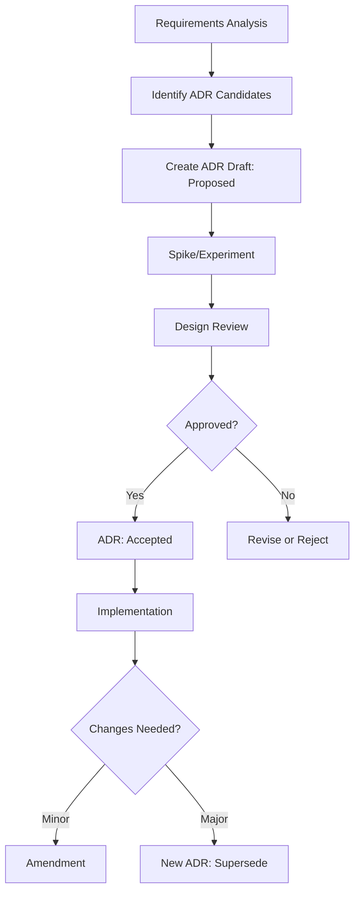

# ADR 草稿生成

为功能生成架构决策记录（ADR）草稿：**$ARGUMENTS**

## 上下文验证

### 现有规范上下文

- 当前规范目录：!`ls -la .tasks/$ARGUMENTS/`
- **产品需求文档**：@.tasks/$ARGUMENTS/prd.md
- **系统需求文档**：@.tasks/$ARGUMENTS/requirements.md
- 规范元数据：@.tasks/$ARGUMENTS/spec.json
- ADR 目录检查：!`ls -la .tasks/$ARGUMENTS/adr/ 2>/dev/null || echo "ADR directory not found"`

## 任务：识别 ADR 候选并生成草稿

基于已批准的 requirements.md 中的 FR/NFR，识别需要架构决策的点（ASR - Architecturally Significant Requirements），生成 ADR 草稿文件并在 requirements.md 中建立关联。

**重要**：首先验证 requirements.md 已经生成。如果尚未生成，提示用户先运行 `/spec-task:requirements {feature-name}`。

### ADR 触发条件（判定清单）

命中以下任一条件时，应创建 ADR：

1. **影响对外契约**：API 设计、协议选择、数据格式、版本策略
2. **系统性属性**：性能、可靠性、安全、成本、可扩展性
3. **难以回滚的决策**：数据库选型、核心架构模式、关键依赖
4. **跨团队一致性**：需要多个团队遵循的标准或约定
5. **长期影响**：会影响系统演化方向的技术选择

### 1. 分析需求识别 ADR 候选

从 requirements.md 中提取以下模式：

#### 性能相关（NFR）
- 延迟要求（P95 < Xs）→ 可能需要缓存策略、异步处理 ADR
- 吞吐量要求（>= X req/s）→ 可能需要扩展架构 ADR
- 并发要求（>= X 用户）→ 可能需要连接管理、资源池化 ADR

#### 可靠性相关（NFR）
- 可用性要求（>= X%）→ 可能需要高可用架构、容错策略 ADR
- 恢复时间要求（< X分钟）→ 可能需要备份恢复策略 ADR
- 数据一致性要求 → 可能需要事务策略、CAP 权衡 ADR

#### 功能相关（FR）
- 实时通信要求 → 需要通道选型 ADR（SSE/WebSocket/轮询）
- 多租户隔离 → 需要隔离策略 ADR
- 鉴权授权 → 需要安全架构 ADR
- 异步处理 → 需要消息队列/事件总线 ADR

#### 集成相关
- 第三方服务集成 → 需要集成模式 ADR
- 跨服务通信 → 需要 RPC/REST/事件驱动选择 ADR

### 2. 在 requirements.md 中添加 ADR 候选钩子

在 requirements.md 末尾添加：

```yaml
## ADR Candidates

基于以上需求分析，识别出以下需要架构决策的点：

adr_candidates:
  - key: ADR-XXX-[简短标题]
    title: [决策标题]
    driven_by: [FR-xxx, NFR-xxx]  # 关联的需求ID
    rationale: [为什么需要这个决策]
    owners: [负责人/团队]
    status: Proposed
    priority: [P1/P2/P3]
```

### 3. 创建 ADR 目录结构

```
.tasks/{feature-name}/adr/
├── README.md           # ADR 索引和关系图
├── YYYYMMDD-[title].md # 各个 ADR 文件
└── templates/          # ADR 模板
    └── adr-template.md
```

### 4. 生成 ADR 草稿模板

每个识别出的 ADR 候选，生成对应的草稿文件：

```markdown
---
id: ADR-{date}-{short-title}
title: {full-title}
status: Proposed
date: {current-date}
decision_makers: [{owners}]
related_requirements: [{FR/NFR IDs}]
supersedes: []
superseded_by: null
---

# {Title}

## Status
Proposed

## Context
[描述需要做决策的背景、约束条件、目标和非目标]

### Requirements Driving This Decision
- {FR-xxx}: [需求描述]
- {NFR-xxx}: [需求描述]

### Constraints
- [技术约束]
- [业务约束]
- [成本约束]

## Decision Drivers
- [关键考虑因素1]
- [关键考虑因素2]
- [关键考虑因素3]

## Considered Options
1. **Option 1: [选项名称]**
   - 描述：[简要描述]
   - 优点：[列出优点]
   - 缺点：[列出缺点]

2. **Option 2: [选项名称]**
   - 描述：[简要描述]
   - 优点：[列出优点]
   - 缺点：[列出缺点]

3. **Option 3: [选项名称]**
   - 描述：[简要描述]
   - 优点：[列出优点]
   - 缺点：[列出缺点]

## Decision
[待定 - 将在设计评审后填写]

## Consequences
### Positive
- [正面影响1]
- [正面影响2]

### Negative
- [负面影响1]
- [负面影响2]

### Risks
- [风险1及缓解措施]
- [风险2及缓解措施]

## Implementation Plan
[待定 - 将在决策接受后填写]

### Migration Strategy
- [如果需要迁移，描述策略]

### Rollback Plan
- [回滚条件和步骤]

## Validation
### Metrics
- [度量指标1]：[目标值]
- [度量指标2]：[目标值]

### Test Strategy
- [如何验证决策的有效性]

## References
- [相关文档链接]
- [参考资料]

## Changelog
- {date}: 初始草稿创建
```

### 5. 生成 ADR 索引文件

创建 `adr/README.md`：

```markdown
# Architecture Decision Records

## Overview
本目录包含所有架构决策记录（ADR），记录了项目中重要的架构决策及其理由。

## ADR Status
- **Proposed**: 提议中，待评审
- **Accepted**: 已接受，指导实施
- **Rejected**: 已拒绝
- **Superseded**: 已被替代
- **Deprecated**: 已废弃

## Active ADRs

| ID | Title | Status | Related Requirements | Date |
|----|-------|--------|---------------------|------|
| [ADR-xxx] | [Title] | [Status] | [FR/NFR] | [Date] |

## Decision Flow


## Relationships
[描述 ADR 之间的关系，如依赖、互斥、supersede 链等]
```

### 6. 常见 ADR 模式库

基于需求类型，提供常见的 ADR 模板：

#### 实时通信类
- 通道选型（SSE vs WebSocket vs 轮询）
- 消息投递语义（at-least-once vs at-most-once）
- 重连策略与退避算法
- 心跳与保活机制

#### 性能优化类
- 缓存策略（Redis vs Memcached vs 本地缓存）
- 数据库优化（索引策略、分区、读写分离）
- 异步处理（消息队列选型）
- 负载均衡策略

#### 安全相关
- 认证方案（JWT vs Session vs OAuth）
- 授权模型（RBAC vs ABAC）
- 数据加密策略
- API 限流策略

#### 架构模式
- 微服务 vs 单体
- 事件驱动 vs RPC
- CQRS 与事件溯源
- 领域驱动设计边界

### 7. 更新元数据

更新 spec.json：

```json
{
  "phase": "adr-drafted",
  "adr": {
    "total_count": [ADR数量],
    "proposed": [Proposed状态数量],
    "accepted": 0,
    "candidates": [
      {
        "key": "ADR-xxx",
        "status": "Proposed",
        "related_requirements": ["FR-xxx", "NFR-xxx"]
      }
    ]
  },
  "updated_at": "current_timestamp"
}
```

### 8. 质量检查清单

生成的 ADR 草稿应满足：
- [ ] 每个 ADR 都关联具体的 FR/NFR
- [ ] Context 部分清晰描述了决策背景
- [ ] 至少提供 2-3 个可选方案
- [ ] 包含可度量的验证指标
- [ ] 有明确的回滚计划
- [ ] 标注了决策负责人

### 9. 与后续流程的集成

1. **设计阶段**：HLD 必须引用相关 ADR
2. **评审通过**：将 ADR 状态从 Proposed → Accepted
3. **实施阶段**：PR 必须在 commit message 中引用 ADR
4. **变更管理**：
   - 参数微调 → Amendment
   - 方向改变 → 新 ADR + Supersede

## 示例输出

基于 SSE 实时通信需求，可能生成的 ADR 候选：

```yaml
adr_candidates:
  - key: ADR-20250830-realtime-channel
    title: 实时通道选型（SSE vs WebSocket vs 轮询）
    driven_by: [FR-001, NFR-001]
    rationale: 需要在单向推送、兼容性、成本之间权衡
    owners: [platform-arch, backend-lead]
    status: Proposed
    priority: P1
    
  - key: ADR-20250830-delivery-semantics
    title: 消息投递语义与重放策略
    driven_by: [FR-010, NFR-003]
    rationale: 确定断线重连后的消息恢复机制
    owners: [backend-lead]
    status: Proposed
    priority: P1
    
  - key: ADR-20250830-edge-proxy
    title: 边缘代理配置与长连接管理
    driven_by: [NFR-001, NFR-002]
    rationale: 确保长连接在各层代理的稳定性
    owners: [devops, platform-arch]
    status: Proposed
    priority: P2
```

## 执行流程

1. 读取并分析 requirements.md
2. 识别 ASR（架构重要需求）
3. 生成 ADR 候选列表
4. 更新 requirements.md，添加 adr_candidates
5. 创建 adr/ 目录结构
6. 为每个候选生成 ADR 草稿文件
7. 创建 ADR 索引文件
8. 更新 spec.json 元数据
9. 提供下一步指导

## 下一步

ADR 草稿生成后：
1. 进行 Spike/实验补充证据
2. 完善 Options 的对比分析
3. 设计评审时做出决策
4. 将 ADR 状态更新为 Accepted
5. 在实施中严格遵循 ADR 指导