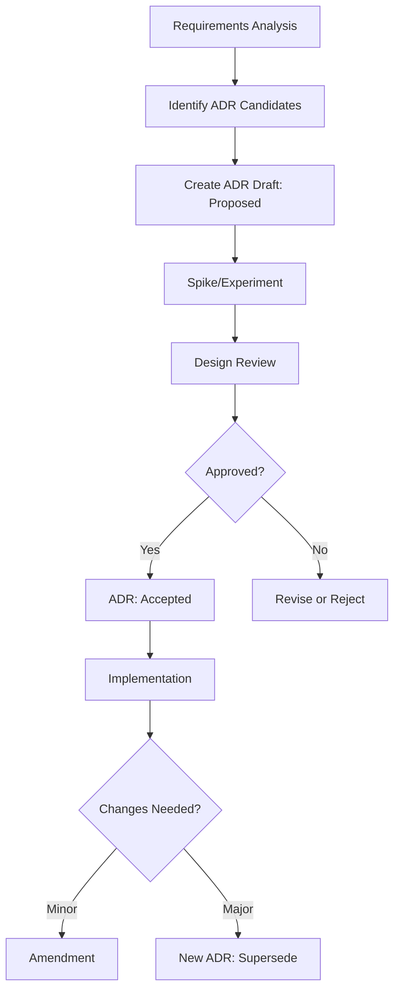

# ADR 草稿生成

为功能生成架构决策记录（ADR）草稿：**$ARGUMENTS**

## 上下文验证

### 现有规范上下文

- 当前规范目录：!`ls -la .tasks/$ARGUMENTS/`
- **产品需求文档**：@.tasks/$ARGUMENTS/prd.md
- **系统需求文档**：@.tasks/$ARGUMENTS/requirements.md
- 规范元数据：@.tasks/$ARGUMENTS/spec.json
- ADR 目录检查：!`ls -la .tasks/$ARGUMENTS/adr/ 2>/dev/null || echo "ADR directory not found"`

### 项目上下文收集

- **项目上下文**：!`ls -la .claude/context/ 2>/dev/null || echo "No context directory"`
- **架构文档**：!`ls -la docs/architecture/ 2>/dev/null || echo "No architecture docs"`
- **项目配置**：@package.json, @pyproject.toml, @requirements.txt（如存在）
- **主要文档**：@README.md, @CLAUDE.md

## 任务：分析项目并识别 ADR 候选

### 1. 项目分析阶段

在生成 ADR 草稿之前，必须深入理解现有项目：

#### 1.1 项目结构分析
- **目录结构**：理解项目的模块组织方式
  - 检查 `apps/`, `services/`, `libs/`, `packages/` 等目录
  - 识别单体还是微服务架构
  - 理解前后端分离还是全栈架构

#### 1.2 技术栈识别
- **后端技术**：
  - 语言和框架（Python/FastAPI, Node/Express, Go/Gin 等）
  - 数据库（PostgreSQL, MongoDB, Redis 等）
  - 消息队列（RabbitMQ, Kafka, Redis Pub/Sub 等）
  
- **前端技术**：
  - 框架（React, Vue, Angular, Next.js 等）
  - 状态管理（Redux, MobX, Zustand 等）
  - UI 库（Material-UI, Ant Design, Tailwind 等）

- **基础设施**：
  - 容器化（Docker, Kubernetes）
  - CI/CD（GitHub Actions, GitLab CI, Jenkins）
  - 云服务（AWS, GCP, Azure）

#### 1.3 架构模式识别
- **架构风格**：
  - 分层架构（Controller-Service-Repository）
  - 领域驱动设计（DDD）
  - 事件驱动架构（EDA）
  - 微服务架构
  - 六边形架构/端口适配器

- **设计模式**：
  - 依赖注入（DI）
  - 仓储模式（Repository）
  - 工厂模式（Factory）
  - 策略模式（Strategy）
  - 观察者模式（Observer）

#### 1.4 依赖关系分析
- **内部依赖**：模块间的依赖关系图
- **外部依赖**：第三方库和服务
- **版本约束**：锁定的版本和兼容性要求

#### 1.5 现有约定和模式
- **代码约定**：
  - 命名规范（camelCase, snake_case, PascalCase）
  - 文件组织（按功能还是按层级）
  - 测试策略（单元测试、集成测试、E2E）

- **API 约定**：
  - RESTful 还是 GraphQL
  - 版本管理策略
  - 错误处理规范
  - 认证授权方式

#### 1.6 业务域理解
- **核心领域**：识别核心业务实体和流程
- **数据模型**：
  - 实体关系（ER图）
  - 聚合根和值对象
  - 事件流和状态机

- **业务规则**：
  - 不变量（Invariants）
  - 业务约束
  - SLA/SLO 要求

### 2. 上下文信息源

优先级从高到低检查以下信息源：

1. **`.claude/context/` 目录**（如果存在）
   - 项目特定的上下文文件
   - 技术决策历史
   - 团队约定

2. **`docs/architecture/` 目录**（如果存在）
   - 架构决策记录（现有 ADR）
   - 系统设计文档
   - API 文档
   - 数据模型文档

3. **项目根目录文档**
   - `README.md`：项目概述和快速开始
   - `CLAUDE.md`：AI 辅助开发指南
   - `CONTRIBUTING.md`：贡献指南
   - `ARCHITECTURE.md`：架构概述

4. **配置文件**
   - `package.json`/`pyproject.toml`：依赖和脚本
   - `docker-compose.yml`：服务架构
   - `.env.example`：环境变量和配置
   - `*config*` 文件：各种配置

5. **代码探索**
   - 入口文件（`main.*`, `app.*`, `index.*`）
   - 路由定义
   - 数据模型定义
   - 服务层实现

### 3. ADR 候选识别增强

基于项目分析，增强 ADR 候选识别：

基于已批准的 requirements.md 中的 FR/NFR，结合项目分析结果，识别需要架构决策的点（ASR - Architecturally Significant Requirements），生成 ADR 草稿文件并在 requirements.md 中建立关联。

**重要**：首先验证 requirements.md 已经生成。如果尚未生成，提示用户先运行 `/spec-task:requirements {feature-name}`。

### 4. 增强的 ADR 候选识别

#### 4.1 与现有架构的对齐分析
- **一致性检查**：新需求是否与现有架构模式一致？
- **扩展点识别**：是否需要扩展现有架构？
- **冲突检测**：是否与现有决策冲突？

#### 4.2 技术栈影响评估
- **技术选型**：是否需要引入新技术？
- **版本兼容**：是否影响现有依赖版本？
- **性能影响**：对现有系统性能的影响？

#### 4.3 集成复杂度评估
- **内部集成**：与现有模块的集成方式
- **外部集成**：与第三方服务的集成
- **数据一致性**：跨服务/模块的数据一致性

### ADR 触发条件（增强版判定清单）

命中以下任一条件时，应创建 ADR：

1. **影响对外契约**：API 设计、协议选择、数据格式、版本策略
2. **系统性属性**：性能、可靠性、安全、成本、可扩展性
3. **难以回滚的决策**：数据库选型、核心架构模式、关键依赖
4. **跨团队一致性**：需要多个团队遵循的标准或约定
5. **长期影响**：会影响系统演化方向的技术选择

### 1. 分析需求识别 ADR 候选

从 requirements.md 中提取以下模式：

#### 性能相关（NFR）
- 延迟要求（P95 < Xs）→ 可能需要缓存策略、异步处理 ADR
- 吞吐量要求（>= X req/s）→ 可能需要扩展架构 ADR
- 并发要求（>= X 用户）→ 可能需要连接管理、资源池化 ADR

#### 可靠性相关（NFR）
- 可用性要求（>= X%）→ 可能需要高可用架构、容错策略 ADR
- 恢复时间要求（< X分钟）→ 可能需要备份恢复策略 ADR
- 数据一致性要求 → 可能需要事务策略、CAP 权衡 ADR

#### 功能相关（FR）
- 实时通信要求 → 需要通道选型 ADR（SSE/WebSocket/轮询）
- 多租户隔离 → 需要隔离策略 ADR
- 鉴权授权 → 需要安全架构 ADR
- 异步处理 → 需要消息队列/事件总线 ADR

#### 集成相关
- 第三方服务集成 → 需要集成模式 ADR
- 跨服务通信 → 需要 RPC/REST/事件驱动选择 ADR

### 2. 在 requirements.md 中添加 ADR 候选钩子

在 requirements.md 末尾添加：

```yaml
## ADR Candidates

基于以上需求分析，识别出以下需要架构决策的点：

adr_candidates:
  - key: ADR-XXX-[简短标题]
    title: [决策标题]
    driven_by: [FR-xxx, NFR-xxx]  # 关联的需求ID
    rationale: [为什么需要这个决策]
    owners: [负责人/团队]
    status: Proposed
    priority: [P1/P2/P3]
```

### 3. 创建 ADR 目录结构

```
.tasks/{feature-name}/adr/
├── README.md           # ADR 索引和关系图
├── YYYYMMDD-[title].md # 各个 ADR 文件
└── templates/          # ADR 模板
    └── adr-template.md
```

### 5. 生成增强的 ADR 草稿模板

每个识别出的 ADR 候选，生成包含项目上下文的草稿文件：

```markdown
---
id: ADR-{date}-{short-title}
title: {full-title}
status: Proposed
date: {current-date}
decision_makers: [{owners}]
related_requirements: [{FR/NFR IDs}]
related_stories: [{STORY IDs from PRD}]
supersedes: []
superseded_by: null
tags: [{architecture, security, performance, integration, etc}]
---

# {Title}

## Status
Proposed

## Context

### Business Context
[从 PRD 和业务分析中提取的业务背景]
- 相关用户故事：{STORY-xxx}
- 业务价值：[描述]
- 业务约束：[描述]

### Technical Context
[基于项目分析的技术背景]
- 当前架构：[描述现有架构模式]
- 现有技术栈：[列出相关技术]
- 现有约定：[描述相关的编码/架构约定]
- 集成点：[描述需要集成的系统/模块]

### Requirements Driving This Decision
- {FR-xxx}: [需求描述]
- {NFR-xxx}: [需求描述]

### Constraints
- [技术约束]
- [业务约束]
- [成本约束]

## Decision Drivers
- [关键考虑因素1]
- [关键考虑因素2]
- [关键考虑因素3]

## Considered Options

### Option 1: [选项名称 - 基于现有模式]
- **描述**：[延续现有架构模式的方案]
- **与现有架构的一致性**：[高/中/低]
- **实现复杂度**：[低/中/高]
- **优点**：
  - 与现有代码库一致
  - 团队熟悉度高
  - [其他优点]
- **缺点**：
  - [列出缺点]
- **风险**：[技术债务、性能瓶颈等]

### Option 2: [选项名称 - 引入新模式]
- **描述**：[引入新技术或模式的方案]
- **与现有架构的一致性**：[需要适配]
- **实现复杂度**：[中/高]
- **优点**：
  - [技术优势]
  - [长期收益]
- **缺点**：
  - 学习曲线
  - 迁移成本
  - [其他缺点]
- **风险**：[团队熟悉度、维护成本]

### Option 3: [选项名称 - 混合方案]
- **描述**：[结合现有和新方案]
- **与现有架构的一致性**：[部分一致]
- **实现复杂度**：[中]
- **优点**：
  - 平衡创新与稳定
  - [其他优点]
- **缺点**：
  - [列出缺点]
- **风险**：[复杂度增加]

## Decision
[待定 - 将在设计评审后填写]

## Consequences
### Positive
- [正面影响1]
- [正面影响2]

### Negative
- [负面影响1]
- [负面影响2]

### Risks
- [风险1及缓解措施]
- [风险2及缓解措施]

## Implementation Plan
[待定 - 将在决策接受后填写]

### Integration with Existing Architecture
- **代码位置**：[基于项目结构分析建议的代码位置]
- **模块边界**：[如何划分模块边界]
- **依赖管理**：[如何管理新增依赖]

### Migration Strategy
- **阶段1**：[准备阶段]
- **阶段2**：[实施阶段]
- **阶段3**：[验证阶段]
- **向后兼容**：[如何保证兼容性]

### Rollback Plan
- **触发条件**：[何时需要回滚]
- **回滚步骤**：
  1. [步骤1]
  2. [步骤2]
- **数据恢复**：[如何恢复数据]

## Validation

### Alignment with Existing Patterns
- **架构一致性检查**：[如何验证与现有架构的一致性]
- **代码审查重点**：[审查时需要关注的点]

### Metrics
- **性能指标**：
  - [指标1]：[当前值] → [目标值]
  - [指标2]：[当前值] → [目标值]
- **质量指标**：
  - 代码覆盖率：[目标]
  - 技术债务：[可接受范围]

### Test Strategy
- **单元测试**：[测试重点]
- **集成测试**：[与现有系统的集成测试]
- **性能测试**：[基准测试和负载测试]
- **回归测试**：[确保不影响现有功能]

## References
- [相关文档链接]
- [参考资料]

## Changelog
- {date}: 初始草稿创建
```

### 5. 生成 ADR 索引文件

创建 `adr/README.md`：

```markdown
# Architecture Decision Records

## Overview
本目录包含所有架构决策记录（ADR），记录了项目中重要的架构决策及其理由。

## ADR Status
- **Proposed**: 提议中，待评审
- **Accepted**: 已接受，指导实施
- **Rejected**: 已拒绝
- **Superseded**: 已被替代
- **Deprecated**: 已废弃

## Active ADRs

| ID | Title | Status | Related Requirements | Date |
|----|-------|--------|---------------------|------|
| [ADR-xxx] | [Title] | [Status] | [FR/NFR] | [Date] |

## Decision Flow


## Relationships
[描述 ADR 之间的关系，如依赖、互斥、supersede 链等]
```

### 6. 基于项目分析的 ADR 模式库

根据项目特征自动推荐相关的 ADR 模式：

#### 对于 FastAPI/Python 项目
- **异步处理策略**：asyncio vs Celery vs RQ
- **ORM 选择**：SQLAlchemy vs Tortoise-ORM vs Beanie
- **API 版本管理**：URL 路径 vs Header vs Query 参数
- **依赖注入模式**：FastAPI 内置 DI vs python-injector

#### 对于 React/TypeScript 项目
- **状态管理**：Redux vs Zustand vs Context API
- **数据获取**：SWR vs React Query vs Apollo Client
- **组件库**：Material-UI vs Ant Design vs 自定义
- **构建优化**：代码分割策略、懒加载边界

#### 对于微服务架构
- **服务发现**：Consul vs Eureka vs K8s Service
- **配置管理**：ConfigMap vs Consul KV vs Vault
- **服务通信**：gRPC vs REST vs GraphQL
- **分布式追踪**：Jaeger vs Zipkin vs AWS X-Ray

#### 对于事件驱动架构
- **消息队列**：Kafka vs RabbitMQ vs Redis Streams
- **事件存储**：EventStore vs Kafka vs PostgreSQL
- **事件模式**：Event Sourcing vs Event Notification
- **最终一致性策略**：Saga vs 两阶段提交

#### 通用架构决策
- **实时通信**：SSE vs WebSocket vs 长轮询
- **缓存策略**：多级缓存、缓存失效策略
- **安全架构**：零信任、JWT vs Session
- **监控策略**：指标收集、日志聚合、分布式追踪

#### 基于 NFR 的决策模式
- **高可用要求**：主从复制 vs 集群 vs 多活
- **高性能要求**：缓存层级、数据库优化、CDN
- **强一致性要求**：分布式事务 vs Saga 模式
- **低延迟要求**：边缘计算、预加载、连接池

### 7. 更新元数据

更新 spec.json：

```json
{
  "phase": "adr-drafted",
  "adr": {
    "total_count": [ADR数量],
    "proposed": [Proposed状态数量],
    "accepted": 0,
    "candidates": [
      {
        "key": "ADR-xxx",
        "status": "Proposed",
        "related_requirements": ["FR-xxx", "NFR-xxx"]
      }
    ]
  },
  "updated_at": "current_timestamp"
}
```

### 8. 质量检查清单

生成的 ADR 草稿应满足：

#### 基础要求
- [ ] 每个 ADR 都关联具体的 FR/NFR
- [ ] Context 部分清晰描述了决策背景
- [ ] 至少提供 2-3 个可选方案
- [ ] 包含可度量的验证指标
- [ ] 有明确的回滚计划
- [ ] 标注了决策负责人

#### 项目对齐
- [ ] 与现有架构模式的一致性已评估
- [ ] 对现有技术栈的影响已分析
- [ ] 与团队技能和经验的匹配度已考虑
- [ ] 与现有编码规范和约定的兼容性已检查

#### 业务对齐
- [ ] 关联到具体的用户故事（STORY-xxx）
- [ ] 业务价值清晰描述
- [ ] 业务约束已识别并考虑

#### 技术评估
- [ ] 集成复杂度已评估
- [ ] 迁移成本已估算
- [ ] 性能影响已分析
- [ ] 安全影响已评估

#### 风险管理
- [ ] 技术债务影响已评估
- [ ] 依赖风险已识别
- [ ] 回滚策略可行性已验证
- [ ] 监控和告警需求已定义

### 9. 与后续流程的集成

1. **设计阶段**：HLD 必须引用相关 ADR
2. **评审通过**：将 ADR 状态从 Proposed → Accepted
3. **实施阶段**：PR 必须在 commit message 中引用 ADR
4. **变更管理**：
   - 参数微调 → Amendment
   - 方向改变 → 新 ADR + Supersede

## 示例输出

基于 SSE 实时通信需求，可能生成的 ADR 候选：

```yaml
adr_candidates:
  - key: ADR-20250830-realtime-channel
    title: 实时通道选型（SSE vs WebSocket vs 轮询）
    driven_by: [FR-001, NFR-001]
    rationale: 需要在单向推送、兼容性、成本之间权衡
    owners: [platform-arch, backend-lead]
    status: Proposed
    priority: P1
    
  - key: ADR-20250830-delivery-semantics
    title: 消息投递语义与重放策略
    driven_by: [FR-010, NFR-003]
    rationale: 确定断线重连后的消息恢复机制
    owners: [backend-lead]
    status: Proposed
    priority: P1
    
  - key: ADR-20250830-edge-proxy
    title: 边缘代理配置与长连接管理
    driven_by: [NFR-001, NFR-002]
    rationale: 确保长连接在各层代理的稳定性
    owners: [devops, platform-arch]
    status: Proposed
    priority: P2
```

## 执行流程

### 阶段1：项目分析
1. **收集项目上下文**
   - 检查 `.claude/context/` 目录
   - 检查 `docs/architecture/` 目录
   - 读取项目配置文件（package.json, pyproject.toml 等）
   - 分析 README.md 和 CLAUDE.md

2. **分析现有架构**
   - 识别项目结构（单体/微服务）
   - 识别技术栈和框架
   - 理解架构模式和设计模式
   - 分析现有约定和标准

3. **理解业务域**
   - 从 PRD 提取业务上下文
   - 识别核心业务实体
   - 理解业务规则和约束

### 阶段2：需求分析
4. **读取并分析 requirements.md**
   - 提取所有 FR 和 NFR
   - 识别与 Story 的关联
   - 分析性能和质量要求

5. **识别 ASR（架构重要需求）**
   - 基于 ADR 触发条件判定
   - 评估与现有架构的影响
   - 识别集成和迁移需求

### 阶段3：ADR 生成
6. **生成 ADR 候选列表**
   - 为每个 ASR 创建 ADR 候选
   - 分配优先级和负责人
   - 建立与需求的追踪关系

7. **创建 ADR 草稿文件**
   - 使用增强模板生成草稿
   - 包含项目特定的上下文
   - 提供基于现有模式的选项

8. **更新项目文档**
   - 更新 requirements.md，添加 adr_candidates
   - 创建 ADR 索引文件
   - 更新 spec.json 元数据

### 阶段4：后续指导
9. **提供下一步指导**
   - 建议 Spike 实验
   - 提示设计评审流程
   - 说明 ADR 状态更新流程

## 下一步

ADR 草稿生成后：
1. 进行 Spike/实验补充证据
2. 完善 Options 的对比分析
3. 设计评审时做出决策
4. 将 ADR 状态更新为 Accepted
5. 在实施中严格遵循 ADR 指导