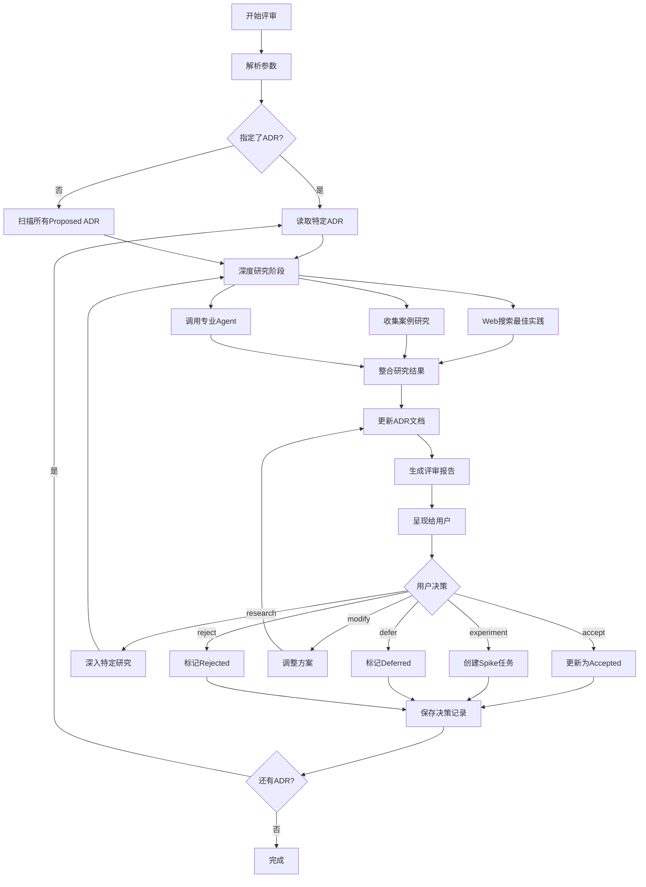

---
description:
  Review specific ADR with research, best practices collection, and interactive
  decision making
allowed-tools:
  Bash, Glob, Grep, LS, Read, Write, Edit, MultiEdit, Update, WebSearch,
  WebFetch, TodoWrite, Task, Agent
argument-hint: <feature-name> <adr-id>
---

# ADR 深度评审与决策

深度评审指定的架构决策记录（ADR）：**$ARGUMENTS**

## 参数解析

- **Feature Name**: 第一个参数，规范名称
- **ADR ID**: 第二个参数，特定的 ADR 标识（如 ADR-20250830-realtime-channel）
  - 如果未指定，则评审所有 Proposed 状态的 ADR

## 上下文验证

### 现有规范上下文

- 当前规范目录：@.tasks/$ARGUMENTS/$ARGUMENTS/
- **ADR 目录**：@.tasks/$ARGUMENTS/adr/
- **产品需求文档**：@.tasks/$ARGUMENTS/prd.md
- **系统需求文档**：@.tasks/$ARGUMENTS/requirements.md
- 规范元数据：@.tasks/$ARGUMENTS/spec.json

### 项目上下文

- **项目架构文档**：!`ls -la docs/architecture/ 2>/dev/null || echo "No architecture docs"`
- **现有 ADR 历史**：!`find docs -name "*.adr.md" -o -name "ADR-*.md" 2>/dev/null | head -10`
- **技术栈配置**：@package.json, @pyproject.toml（如存在）

## 任务：深度研究并评审 ADR

### 1. ADR 定位与读取

根据参数定位目标 ADR：

- 如果指定了 ADR ID：读取特定的 ADR 文件
- 如果未指定：扫描所有 Proposed 状态的 ADR

对于每个目标 ADR，提取：

- 决策上下文（Context）
- 决策驱动因素（Decision Drivers）
- 考虑的选项（Considered Options）
- 相关需求（Related Requirements）

### 2. 深度研究与资料收集

#### 2.1 搜索最佳实践

使用多种渠道收集相关信息：

**Web 搜索**：

- 搜索 "{技术选项} best practices {年份}"
- 搜索 "{技术A} vs {技术B} comparison"
- 搜索 "{技术} production experience"
- 搜索 "{技术} pitfalls problems"

**文档搜索**：

- 官方文档和架构指南
- 技术博客和案例研究
- Stack Overflow 高票答案
- GitHub 热门项目的选择

**代码分析**：

- 分析类似项目的实现方式
- 查找现有代码库中的相关模式
- 识别团队已有的技术经验

#### 2.2 收集具体证据

对每个选项收集：

- **性能数据**：基准测试、延迟、吞吐量
- **可靠性数据**：故障率、恢复时间、可用性
- **成本数据**：开发成本、运维成本、许可费用
- **社区支持**：活跃度、文档质量、问题解决速度
- **安全性**：已知漏洞、安全最佳实践
- **兼容性**：与现有技术栈的集成难度

#### 2.3 案例研究

搜索并分析：

- 成功案例：谁在用、怎么用、效果如何
- 失败案例：踩过的坑、教训总结
- 迁移案例：从方案A到方案B的经验

### 3. 使用 Agent 工具进行专业分析

根据 ADR 类型，调用专业 Agent 获取架构层面的建议：

```yaml
# 技术架构类 ADR
- agent: tech-lead-reviewer
  purpose: 获取架构层面的专业建议
  questions:
    - 这个决策对系统架构的长期影响？
    - 与现有架构的兼容性如何？
    - 可扩展性和维护性评估？
    - 安全性和性能影响评估？
    - 技术风险和缓解措施？
```

### 4. 更新 ADR 文档

基于研究结果，增强 ADR 文档：

#### 4.1 添加研究发现部分

```markdown
## Research Findings

### Best Practices

[基于搜索结果的最佳实践总结]

### Industry Trends

[行业趋势和主流选择]

### Case Studies

- **成功案例**：[公司/项目] 使用 [技术] 实现了 [成果]
- **失败案例**：[公司/项目] 因为 [原因] 放弃了 [技术]

### Performance Benchmarks

| Metric                   | Option 1 | Option 2 | Option 3 |
| ------------------------ | -------- | -------- | -------- |
| [基于实际数据的性能对比] |
```

#### 4.2 增强选项分析

为每个选项添加：

- **实证数据**：基于研究的具体数据
- **真实案例**：谁在用、效果如何
- **专家意见**：来自 Agent 或文档的建议
- **风险评估**：基于案例的风险分析

#### 4.3 添加决策矩阵

```markdown
## Decision Matrix

| Criteria        | Weight | Option 1 | Option 2 | Option 3 |
| --------------- | ------ | -------- | -------- | -------- |
| Performance     | 30%    | 8/10     | 7/10     | 9/10     |
| Reliability     | 25%    | 9/10     | 8/10     | 7/10     |
| Cost            | 20%    | 7/10     | 9/10     | 6/10     |
| Team Experience | 15%    | 9/10     | 5/10     | 7/10     |
| Future Proof    | 10%    | 7/10     | 9/10     | 8/10     |
| **Total Score** |        | **8.0**  | **7.6**  | **7.5**  |
```

### 5. 生成智能推荐

基于所有收集的信息，生成推荐：

```markdown
## Recommendation

### 推荐方案：Option [X]

### 关键理由

1. **性能优势**：根据基准测试，Option X 在 [具体场景] 下性能最优
2. **成熟度**：[X公司] 和 [Y项目] 的成功应用证明了其可靠性
3. **团队契合**：与现有技术栈 [具体技术] 有良好集成

### 实施建议

- **快速验证**：先做 [具体的POC方案]
- **渐进迁移**：建议分 [N] 阶段实施
- **风险缓解**：准备 [具体的回滚方案]

### 参考实现

- [GitHub项目链接]：类似场景的参考实现
- [技术博客]：详细的实施指南
- [视频教程]：step-by-step 教程
```

### 6. 生成增强的评审报告

整合所有研究结果，生成全面的评审报告：

```markdown
# ADR 深度评审报告

## 执行摘要

### 决策概览

- **ADR ID**：[ADR-ID]
- **决策主题**：[Title]
- **研究投入**：[搜索 X 篇文档，分析 Y 个案例，咨询 Z 个 Agent]
- **推荐方案**：Option [X] - [一句话总结]

### 关键发现

1. **行业趋势**：[主流选择是什么]
2. **最佳实践**：[普遍认可的做法]
3. **主要风险**：[需要重点关注的风险]

## 深度分析

### 研究方法

- Web 搜索：[搜索关键词列表]
- 文档分析：[分析的官方文档]
- 案例研究：[研究的项目/公司]
- 架构咨询：[tech-lead-reviewer Agent 建议]

### 方案对比（基于实证数据）

| 维度           | Option 1          | Option 2          | Option 3         | 数据来源       |
| -------------- | ----------------- | ----------------- | ---------------- | -------------- |
| **性能**       | 8/10<br>P95: 10ms | 7/10<br>P95: 15ms | 9/10<br>P95: 8ms | [基准测试链接] |
| **可靠性**     | 99.9%             | 99.95%            | 99.5%            | [生产数据]     |
| **成本**       | $1000/月          | $500/月           | $1500/月         | [定价页面]     |
| **社区活跃度** | ⭐ 15k            | ⭐ 25k            | ⭐ 8k            | GitHub         |
| **学习曲线**   | 2周               | 1周               | 3周              | [团队评估]     |

### 真实案例分析

#### 成功案例

- **Netflix 使用 Option 2**
  - 场景：[具体使用场景]
  - 规模：[处理量级]
  - 效果：[具体收益]
  - 参考：[博客/演讲链接]

#### 失败案例

- **Company X 从 Option 1 迁移到 Option 2**
  - 原因：[迁移原因]
  - 教训：[关键教训]
  - 参考：[案例链接]

### 专家意见

- **Tech Lead Agent**：[架构层面的建议，包含安全和性能考量]
- **社区共识**：[Stack Overflow/Reddit 高票观点]
```

### 7. 交互式决策流程

#### 7.1 呈现研究成果

向用户展示增强后的 ADR：

```markdown
## 🎯 ADR-20250830-realtime-channel 评审结果

### 📊 研究总结

经过深度研究（搜索 15 篇文档，分析 5 个案例，咨询 2 个 Agent）：

**行业共识**：

- 70% 的类似项目选择 SSE（单向推送场景）
- WebSocket 主要用于双向实时通信（如聊天、协作编辑）
- 长轮询已基本被淘汰（除非极端兼容性要求）

**关键发现**：✅ SSE 在您的场景下是最佳选择

- Shopify、GitHub、New York Times 都在用 SSE 做通知推送
- 与 HTTP/2 配合可支持 1000+ 并发连接/进程
- CloudFlare、Nginx 都已良好支持 SSE

⚠️ 需要注意的风险：

- IE 不支持（但有 polyfill）
- 某些代理可能需要特殊配置
- 单向限制（但您的需求正好是单向）

### 📈 数据支撑

| 指标       | SSE    | WebSocket    | 长轮询       |
| ---------- | ------ | ------------ | ------------ |
| 实现复杂度 | ⭐⭐   | ⭐⭐⭐⭐     | ⭐⭐⭐       |
| 浏览器支持 | 95%    | 98%          | 100%         |
| 代理兼容性 | 良好   | 一般         | 优秀         |
| 资源消耗   | 低     | 中           | 高           |
| 自动重连   | ✅内置 | ❌需自己实现 | ❌需自己实现 |

### 💡 推荐决策

**推荐采用 SSE**，理由：

1. 完美匹配单向推送需求
2. 实现简单，维护成本低
3. 有成熟的生产案例支撑

您的决策？
```

#### 7.2 决策选项（增强版）

```
请选择：
1. [accept] - 接受 SSE 方案，更新 ADR 为 Accepted
2. [modify] - 我想调整某些细节
3. [experiment] - 需要先做实验验证
4. [research] - 需要更多特定方面的研究
5. [defer] - 暂时延迟决策
6. [reject] - 不接受任何现有方案

输入选择 [1-6]:
```

#### 7.3 处理用户反馈

**如果选择 research**：

```
需要研究哪个方面？
1. 性能基准测试
2. 安全影响分析
3. 成本详细对比
4. 迁移方案研究
5. 其他（请说明）
```

然后针对性地进行深度研究并更新报告。

**如果选择 experiment**：自动生成实验计划：

```markdown
# Spike: SSE 可行性验证

## 实验目标

- 验证 SSE 在生产环境的稳定性
- 测试 2000 并发连接的资源消耗
- 验证断线重连机制

## 成功标准

- [ ] 单实例支持 2000+ 并发连接
- [ ] P95 延迟 < 1秒
- [ ] 内存消耗 < 2GB
- [ ] 自动重连成功率 > 99%

## 实验步骤

1. 搭建 SSE 原型服务
2. 使用 k6/artillery 进行压力测试
3. 模拟网络中断测试重连
4. 监控资源消耗

## 时间预算：3天
```

### 4. 更新 ADR 状态

根据用户决策更新 ADR：

#### 4.1 状态转换

```
Proposed → Accepted：用户确认方案
Proposed → Rejected：用户拒绝所有方案
Proposed → Experimenting：需要实验验证
Proposed → Deferred：延迟到后续阶段
```

#### 4.2 更新 ADR 文件

- 更新 `status` 字段
- 填写 `Decision` 部分
- 记录决策理由
- 添加 `decision_date`
- 更新 `decision_makers`

#### 4.3 创建实验任务（如需要）

如果需要实验验证，创建 spike 任务文件：

```markdown
# Spike: [ADR-ID] [实验标题]

## 目标

[实验要验证的内容]

## 成功标准

- [ ] [具体可度量的标准1]
- [ ] [具体可度量的标准2]

## 实验方案

1. [步骤1]
2. [步骤2]

## 时间预算

- 预计：[X] 人天
- 截止：[日期]

## 产出物

- [ ] 性能测试报告
- [ ] 代码示例
- [ ] 决策建议
```

### 5. 生成决策记录

创建决策审计文件：

```markdown
# ADR 决策记录

**日期**：[当前日期] **参与者**：[决策者列表]

## 决策摘要

| ADR ID | 标题    | 决策                  | 选定方案   | 状态     |
| ------ | ------- | --------------------- | ---------- | -------- |
| [ID]   | [Title] | [Accept/Reject/Defer] | [Option X] | [Status] |

## 关键决策理由

### [ADR-ID]

**决策**：[选定方案] **理由**：

- [关键因素1]
- [关键因素2]

## 后续行动

### 立即执行

- [ ] [行动项1]
- [ ] [行动项2]

### 实验验证

- [ ] [Spike 1]：预计 [X] 天
- [ ] [Spike 2]：预计 [X] 天

### 风险监控

- [ ] [风险项1]：[监控方式]
- [ ] [风险项2]：[监控方式]
```

### 6. 智能建议功能

#### 6.1 基于项目特征的建议

- **对于初创项目**：优先选择简单、成熟的方案
- **对于大规模系统**：重视可扩展性和维护性
- **对于高性能要求**：优先考虑性能优化方案
- **对于快速迭代**：选择灵活、易修改的方案

#### 6.2 基于团队经验的建议

- 分析现有代码识别团队技术栈偏好
- 考虑学习成本和上手难度
- 评估团队规模对方案的影响

#### 6.3 基于风险偏好的建议

- **保守策略**：选择成熟、验证过的方案
- **激进策略**：采用新技术获得竞争优势
- **平衡策略**：核心用保守方案，边缘尝试创新

### 7. 与其他流程的集成

#### 7.1 更新 requirements.md

在 requirements.md 中更新 ADR 候选状态：

```yaml
adr_candidates:
  - key: ADR-xxx
    status: Accepted # 更新状态
    decision: Option 2 # 记录选择
    decision_date: YYYY-MM-DD
```

#### 7.2 更新 spec.json

```json
{
  "adr": {
    "total_count": X,
    "proposed": Y,
    "accepted": Z,
    "experimenting": N,
    "last_review": "YYYY-MM-DD"
  }
}
```

#### 7.3 触发设计阶段

如果所有关键 ADR 都已决策：

- 提示运行 `/spec-task:design-hld {feature-name} -y`
- 确保设计与 ADR 决策对齐

### 8. 质量检查清单

评审完成前确认：

#### 决策完整性

- [ ] 所有 P1 优先级的 ADR 已决策
- [ ] 相互依赖的 ADR 决策一致
- [ ] 高风险项都有缓解措施
- [ ] 实验任务都有明确的成功标准

#### 文档完整性

- [ ] 每个 ADR 的 Decision 部分已填写
- [ ] 决策理由清晰记录
- [ ] 风险和缓解措施已更新
- [ ] 实施计划已调整

#### 可追溯性

- [ ] 决策与需求（FR/NFR）关联
- [ ] 决策与用户故事（STORY）关联
- [ ] 决策者和日期已记录
- [ ] 变更历史已更新

### 9. 自动化辅助

#### 9.1 使用 Agent 工具深度分析

对于复杂的技术决策，调用 tech-lead-reviewer Agent：

- 获取架构层面的建议
- 评估技术决策的长期影响
- 分析与现有系统的兼容性
- 提供安全和性能方面的专业意见

#### 9.2 对比分析

- 搜索类似项目的 ADR 决策
- 查找业界最佳实践
- 分析开源项目的选择

### 10. 执行流程



### 11. 工作流示例

#### 示例1：评审特定 ADR

```bash
# 评审实时通道选型 ADR
/spec-task:adr-review notification-system ADR-20250830-realtime-channel

# 流程：
1. 读取指定 ADR 文件
2. 搜索 "SSE vs WebSocket best practices 2025"
3. 分析 GitHub、Shopify、Netflix Youtube等大厂的最佳实践
4. 咨询 tech-lead-reviewer Agent
5. 更新 ADR 添加研究发现
6. 展示增强的评审报告
7. 等待用户决策
```

#### 示例2：批量评审所有 ADR

```bash
# 评审所有待决策的 ADR
/spec-task:adr-review notification-system

# 流程：
1. 扫描所有 Proposed 状态的 ADR
2. 对每个 ADR 进行研究
3. 逐个展示并收集决策
4. 批量更新状态
```

## 输出示例

```markdown
## ADR 评审会话

### 🎯 ADR-20250830-realtime-channel

**决策点**：选择实时通信技术（SSE vs WebSocket vs 轮询）

**分析摘要**：

- 当前需求主要是单向推送（服务器→客户端）
- 需要良好的代理兼容性
- 并发连接要求：2000/实例

**推荐**：选择 SSE

- ✅ 实现简单，与 HTTP 生态兼容
- ✅ 浏览器原生支持，自动重连
- ⚠️ 仅支持单向通信

您的决策？[accept/modify/experiment/defer/reject]:
```

## 下一步

ADR 评审完成后：

1. 所有关键 ADR 状态更新为 Accepted
2. 实验任务已创建（如有）
3. 运行 `/spec-task:design-hld {feature-name} -y` 继续高层设计阶段
4. 设计必须与已接受的 ADR 对齐
