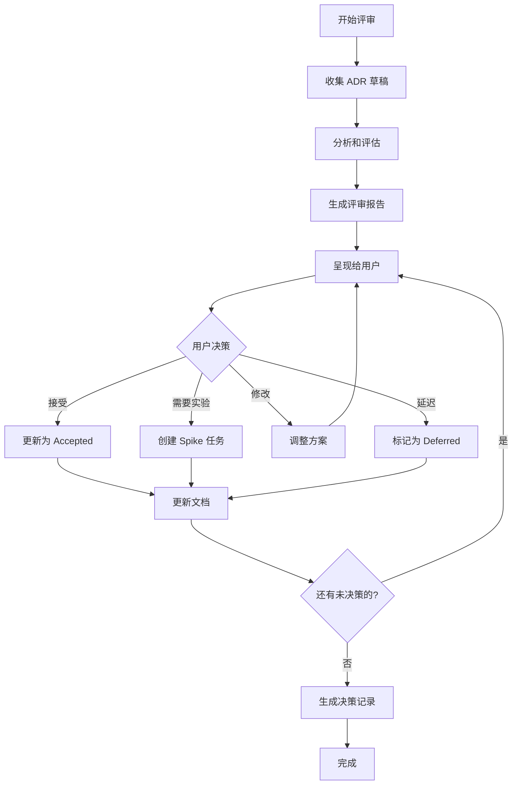

# ADR 评审与决策

评审并确认架构决策记录（ADR）：**$ARGUMENTS**

## 上下文验证

### 现有规范上下文

- 当前规范目录：!`ls -la .tasks/$ARGUMENTS/`
- **ADR 目录**：!`ls -la .tasks/$ARGUMENTS/adr/`
- **产品需求文档**：@.tasks/$ARGUMENTS/prd.md
- **系统需求文档**：@.tasks/$ARGUMENTS/requirements.md
- 规范元数据：@.tasks/$ARGUMENTS/spec.json

### 项目上下文

- **项目架构文档**：!`ls -la docs/architecture/ 2>/dev/null || echo "No architecture docs"`
- **现有 ADR 历史**：!`find docs -name "*.adr.md" -o -name "ADR-*.md" 2>/dev/null | head -10`
- **技术栈配置**：@package.json, @pyproject.toml（如存在）

## 任务：评审 ADR 并做出决策

### 1. 收集和分析 ADR 草稿

#### 1.1 扫描所有 Proposed 状态的 ADR
- 读取 `.tasks/$ARGUMENTS/adr/` 目录下所有 ADR 文件
- 筛选状态为 "Proposed" 的 ADR
- 提取关键信息：
  - 决策标题和 ID
  - 驱动因素（Decision Drivers）
  - 考虑的选项（Options）
  - 相关需求（FR/NFR）

#### 1.2 分析项目影响
对每个 ADR 评估：
- **架构一致性**：与现有架构的兼容性
- **技术债务**：可能引入的技术债务
- **团队能力**：团队对方案的熟悉度
- **实施成本**：时间、资源、学习曲线
- **风险等级**：低/中/高

### 2. 生成评审报告

为每个 ADR 生成结构化的评审报告：

```markdown
# ADR 评审报告

## 总览
- **待评审 ADR 数量**：[数量]
- **关键决策点**：[列表]
- **高风险项**：[如有]

## ADR 详细分析

### [ADR-ID]: [Title]

#### 决策背景
- **业务驱动**：[从 PRD 提取]
- **技术约束**：[从需求提取]
- **性能要求**：[NFR 要求]

#### 方案对比分析

| 维度 | Option 1 | Option 2 | Option 3 |
|------|----------|----------|----------|
| **架构一致性** | [评分] | [评分] | [评分] |
| **实施复杂度** | [低/中/高] | [低/中/高] | [低/中/高] |
| **团队熟悉度** | [评分] | [评分] | [评分] |
| **长期维护性** | [评分] | [评分] | [评分] |
| **性能影响** | [描述] | [描述] | [描述] |
| **成本估算** | [人天] | [人天] | [人天] |

#### 推荐方案
**推荐选择**：Option [X]

**理由**：
- [关键理由1]
- [关键理由2]
- [关键理由3]

#### 风险与缓解
- **风险1**：[描述] → **缓解**：[措施]
- **风险2**：[描述] → **缓解**：[措施]

#### 验证建议
- [ ] Spike 实验：[具体实验内容]
- [ ] POC 验证：[验证点]
- [ ] 性能基准测试：[测试方案]
```

### 3. 交互式决策流程

#### 3.1 呈现决策选项
对每个 ADR，向用户展示：
1. **快速总结**：一句话说明要决定什么
2. **关键权衡**：主要的 trade-off
3. **推荐方案**：基于分析的建议
4. **决策选项**：
   - `accept` - 接受推荐方案
   - `modify` - 调整方案
   - `experiment` - 需要实验验证
   - `defer` - 延迟决策
   - `reject` - 拒绝所有方案

#### 3.2 收集额外输入
如果用户选择 `modify` 或 `experiment`：
- **修改方案**：询问具体调整内容
- **实验验证**：
  - 定义实验目标
  - 设置成功标准
  - 估算实验时间
  - 创建实验任务

#### 3.3 处理依赖关系
- 识别 ADR 之间的依赖
- 确保决策顺序正确
- 处理冲突的决策

### 4. 更新 ADR 状态

根据用户决策更新 ADR：

#### 4.1 状态转换
```
Proposed → Accepted：用户确认方案
Proposed → Rejected：用户拒绝所有方案
Proposed → Experimenting：需要实验验证
Proposed → Deferred：延迟到后续阶段
```

#### 4.2 更新 ADR 文件
- 更新 `status` 字段
- 填写 `Decision` 部分
- 记录决策理由
- 添加 `decision_date`
- 更新 `decision_makers`

#### 4.3 创建实验任务（如需要）
如果需要实验验证，创建 spike 任务文件：

```markdown
# Spike: [ADR-ID] [实验标题]

## 目标
[实验要验证的内容]

## 成功标准
- [ ] [具体可度量的标准1]
- [ ] [具体可度量的标准2]

## 实验方案
1. [步骤1]
2. [步骤2]

## 时间预算
- 预计：[X] 人天
- 截止：[日期]

## 产出物
- [ ] 性能测试报告
- [ ] 代码示例
- [ ] 决策建议
```

### 5. 生成决策记录

创建决策审计文件：

```markdown
# ADR 决策记录

**日期**：[当前日期]
**参与者**：[决策者列表]

## 决策摘要

| ADR ID | 标题 | 决策 | 选定方案 | 状态 |
|--------|------|------|----------|------|
| [ID] | [Title] | [Accept/Reject/Defer] | [Option X] | [Status] |

## 关键决策理由

### [ADR-ID]
**决策**：[选定方案]
**理由**：
- [关键因素1]
- [关键因素2]

## 后续行动

### 立即执行
- [ ] [行动项1]
- [ ] [行动项2]

### 实验验证
- [ ] [Spike 1]：预计 [X] 天
- [ ] [Spike 2]：预计 [X] 天

### 风险监控
- [ ] [风险项1]：[监控方式]
- [ ] [风险项2]：[监控方式]
```

### 6. 智能建议功能

#### 6.1 基于项目特征的建议
- **对于初创项目**：优先选择简单、成熟的方案
- **对于大规模系统**：重视可扩展性和维护性
- **对于高性能要求**：优先考虑性能优化方案
- **对于快速迭代**：选择灵活、易修改的方案

#### 6.2 基于团队经验的建议
- 分析现有代码识别团队技术栈偏好
- 考虑学习成本和上手难度
- 评估团队规模对方案的影响

#### 6.3 基于风险偏好的建议
- **保守策略**：选择成熟、验证过的方案
- **激进策略**：采用新技术获得竞争优势
- **平衡策略**：核心用保守方案，边缘尝试创新

### 7. 与其他流程的集成

#### 7.1 更新 requirements.md
在 requirements.md 中更新 ADR 候选状态：

```yaml
adr_candidates:
  - key: ADR-xxx
    status: Accepted  # 更新状态
    decision: Option 2  # 记录选择
    decision_date: YYYY-MM-DD
```

#### 7.2 更新 spec.json
```json
{
  "adr": {
    "total_count": X,
    "proposed": Y,
    "accepted": Z,
    "experimenting": N,
    "last_review": "YYYY-MM-DD"
  }
}
```

#### 7.3 触发设计阶段
如果所有关键 ADR 都已决策：
- 提示运行 `/spec-task:design {feature-name} -y`
- 确保设计与 ADR 决策对齐

### 8. 质量检查清单

评审完成前确认：

#### 决策完整性
- [ ] 所有 P1 优先级的 ADR 已决策
- [ ] 相互依赖的 ADR 决策一致
- [ ] 高风险项都有缓解措施
- [ ] 实验任务都有明确的成功标准

#### 文档完整性  
- [ ] 每个 ADR 的 Decision 部分已填写
- [ ] 决策理由清晰记录
- [ ] 风险和缓解措施已更新
- [ ] 实施计划已调整

#### 可追溯性
- [ ] 决策与需求（FR/NFR）关联
- [ ] 决策与用户故事（STORY）关联
- [ ] 决策者和日期已记录
- [ ] 变更历史已更新

### 9. 自动化辅助

#### 9.1 使用 Agent 工具深度分析
对于复杂的技术决策，可调用专门的 Agent：
- `code-analyzer`：分析现有代码模式
- `tech-lead-reviewer`：获取架构层面的建议
- `security-reviewer`：评估安全影响

#### 9.2 对比分析
- 搜索类似项目的 ADR 决策
- 查找业界最佳实践
- 分析开源项目的选择

### 10. 执行流程



## 输出示例

```markdown
## ADR 评审会话

### 🎯 ADR-20250830-realtime-channel
**决策点**：选择实时通信技术（SSE vs WebSocket vs 轮询）

**分析摘要**：
- 当前需求主要是单向推送（服务器→客户端）
- 需要良好的代理兼容性
- 并发连接要求：2000/实例

**推荐**：选择 SSE
- ✅ 实现简单，与 HTTP 生态兼容
- ✅ 浏览器原生支持，自动重连
- ⚠️ 仅支持单向通信

您的决策？[accept/modify/experiment/defer/reject]: 
```

## 下一步

ADR 评审完成后：
1. 所有关键 ADR 状态更新为 Accepted
2. 实验任务已创建（如有）
3. 运行 `/spec-task:design {feature-name} -y` 继续设计阶段
4. 设计必须与已接受的 ADR 对齐