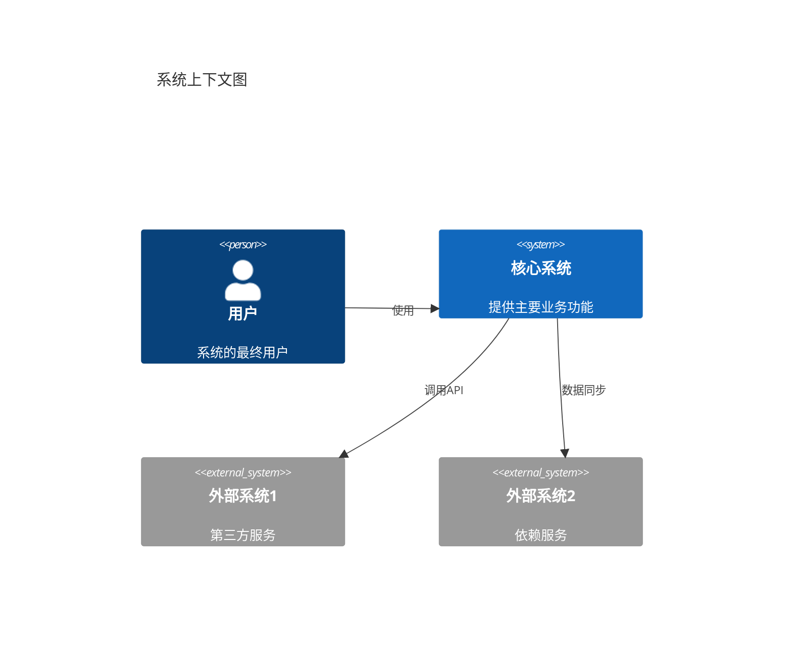
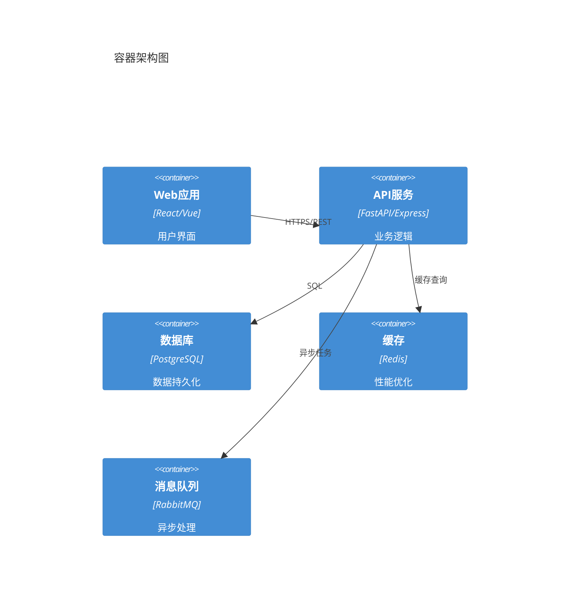
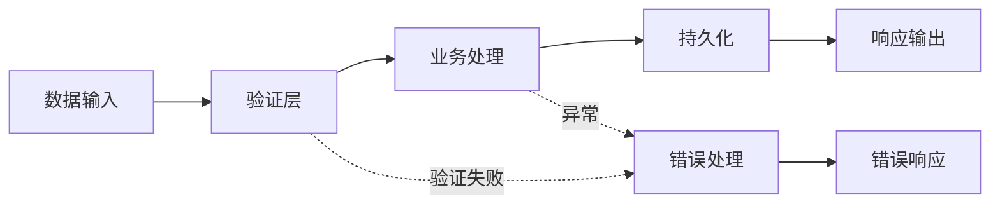
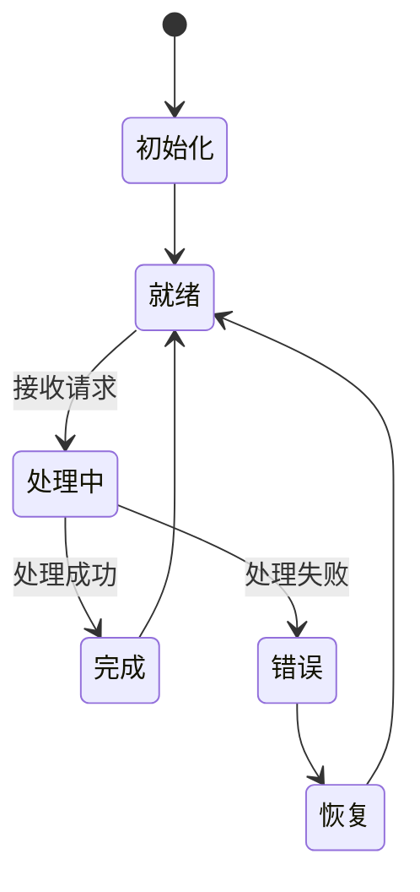
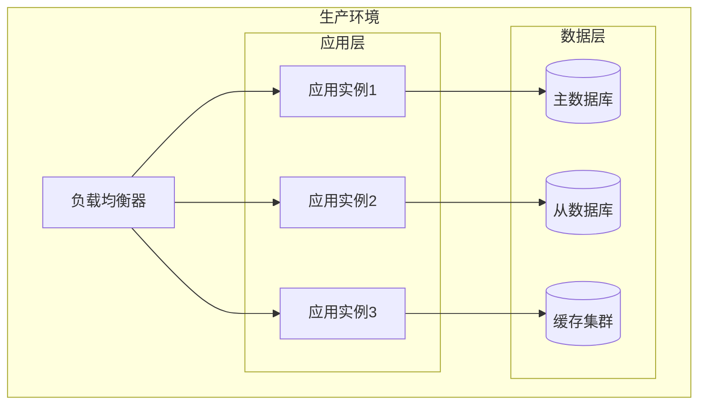

# 高层设计 (HLD)

为功能创建高层架构设计：**$ARGUMENTS**

## 需求批准要求

**重要提示**：只有在需求审核并批准后才能生成设计。

- 需求文档：@.tasks/$ARGUMENTS/requirements.md
- 规范元数据：@.tasks/$ARGUMENTS/spec.json

## 上下文分析

### 需求基础

**重要提示**：HLD 必须建立在已批准的需求文档之上。

- **产品需求文档**：@.tasks/$ARGUMENTS/prd.md
- **系统需求文档**：@.tasks/$ARGUMENTS/requirements.md
- **EARS 格式需求**：每个需求都有验收标准
- **架构决策记录**：@.tasks/$ARGUMENTS/adr/

## 任务：创建高层设计

### HLD 文档结构

生成包含系统边界、数据流和架构决策的高层设计文档：

````markdown
# 高层设计 (High-Level Design)

## 系统概览

[系统的总体架构概述，明确系统边界和主要组件]

## 需求映射

### 功能需求覆盖 (FR)

逐条引用功能需求，说明系统如何满足：

| 需求ID | 需求描述   | 设计方案   | 相关组件   |
| ------ | ---------- | ---------- | ---------- |
| FR-1.1 | [需求内容] | [解决方案] | [组件列表] |
| FR-1.2 | [需求内容] | [解决方案] | [组件列表] |

### 非功能需求满足 (NFR)

逐条引用非功能需求，说明设计如何达标：

| 需求ID | 性能/安全/可用性要求 | 设计保障   | 验证方法   |
| ------ | -------------------- | ---------- | ---------- |
| NFR-1  | [具体指标]           | [设计措施] | [验证手段] |
| NFR-2  | [具体指标]           | [设计措施] | [验证手段] |

### 架构决策引用 (ADR)

引用关键架构决策记录：

| ADR编号 | 决策主题 | 选择方案     | 影响范围       |
| ------- | -------- | ------------ | -------------- |
| ADR-001 | [主题]   | [选择的方案] | [受影响的组件] |
| ADR-002 | [主题]   | [选择的方案] | [受影响的组件] |

## 系统架构

### 系统边界



### 容器视图



## 数据流设计

### 主要数据流



### 控制流设计



## 接口设计（高层）

### 外部接口

| 接口类型  | 协议   | 用途       | SLA要求        |
| --------- | ------ | ---------- | -------------- |
| REST API  | HTTPS  | 客户端交互 | 99.9% 可用性   |
| WebSocket | WSS    | 实时通信   | 低延迟 < 100ms |
| gRPC      | HTTP/2 | 服务间通信 | 高吞吐量       |

### 内部接口

| 组件间接口 | 通信方式 | 数据格式 | 频率估算   |
| ---------- | -------- | -------- | ---------- |
| API→DB     | 同步调用 | SQL      | 1000 QPS   |
| API→Cache  | 同步调用 | Binary   | 5000 QPS   |
| API→Queue  | 异步发送 | JSON     | 500 msgs/s |

## 容量规划

### 容量估算

| 指标     | 当前需求 | 峰值需求 | 增长预测 |
| -------- | -------- | -------- | -------- |
| 用户数   | 10K      | 50K      | 每月20%  |
| 并发连接 | 1K       | 5K       | -        |
| 数据存储 | 100GB    | 500GB    | 每月10GB |
| 带宽需求 | 100Mbps  | 500Mbps  | -        |

### 扩展策略

- **水平扩展**：API服务支持无状态横向扩展
- **垂直扩展**：数据库通过读写分离和分片
- **弹性伸缩**：基于CPU/内存使用率自动扩缩容

## 性能与可扩展性

### 性能目标

| 指标             | 目标           | 测量     |
| ---------------- | -------------- | -------- |
| 响应时间 (p95)   | < 200ms        | API 端点 |
| 响应时间 (p99)   | < 500ms        | API 端点 |
| 吞吐量           | > 1000 req/sec | 负载测试 |
| 数据库查询 (p99) | < 50ms         | 查询监控 |
| 并发用户         | > 10,000       | 系统容量 |

### 缓存策略

- **浏览器缓存**：静态资源、API 响应
- **CDN**：媒体文件、静态内容
- **应用缓存**：Redis/Memcached 用于会话数据
- **数据库缓存**：查询结果缓存

### 可扩展性方法

- 应用服务器的水平扩展
- 数据库读副本
- 异步处理的后台作业队列
- 基于负载指标的自动扩展

## 技术栈选择

### 核心技术决策

基于ADR的技术选择理由：

| 层级   | 技术选择 | 选择理由 | ADR引用 |
| ------ | -------- | -------- | ------- |
| 前端   | [框架]   | [理由]   | ADR-XXX |
| 后端   | [框架]   | [理由]   | ADR-XXX |
| 数据库 | [类型]   | [理由]   | ADR-XXX |
| 缓存   | [方案]   | [理由]   | ADR-XXX |

### 架构决策依据

[基于研究记录关键技术选择背后的原因]

- **为什么选择 [前端框架]**：[基于研究的理由]
- **为什么选择 [后端技术]**：[性能、可扩展性、团队专业知识考虑]
- **为什么选择 [数据库]**：[数据模型需求、一致性需求、扩展模式]
- **为什么选择 [认证方法]**：[安全需求、集成能力、用户体验]

### 核心库文档（必需）

**强制要求**：对于技术栈中的核心库，必须包含从 context7 获取的高层信息：

- **[核心框架]** ([版本])
  - 主要特性和能力
  - 架构模式支持
  - 生态系统和社区
  - 与其他组件的集成方式

- **[关键库]** ([版本])
  - 核心功能概述
  - 性能特征
  - 扩展性支持
  - 最佳实践指导

## 安全考虑

### 安全架构

[高层安全架构和策略]

- **认证与授权**：基于 JWT 的认证，基于角色的访问控制（RBAC）
- **数据保护**：传输加密（TLS）、静态数据加密、敏感数据脱敏
- **网络安全**：防火墙、VPN、网络隔离
- **应用安全**：OWASP 最佳实践、输入验证、输出编码

### 安全合规

- **合规标准**：[GDPR/HIPAA/PCI-DSS等相关标准]
- **安全审计**：定期安全评估和渗透测试
- **事件响应**：安全事件响应计划和流程

## 风险评估

### 技术风险

| 风险项         | 影响等级 | 概率 | 缓解措施                |
| -------------- | -------- | ---- | ----------------------- |
| 数据库单点故障 | 高       | 中   | 主从复制+自动故障转移   |
| API限流不当    | 中       | 高   | 分级限流+熔断机制       |
| 缓存雪崩       | 高       | 低   | 缓存预热+过期时间随机化 |

### 业务风险

| 风险项   | 影响     | 应对策略            |
| -------- | -------- | ------------------- |
| 需求变更 | 架构调整 | 模块化设计+接口抽象 |
| 流量激增 | 服务降级 | 优雅降级方案        |

## 部署架构

### 部署拓扑



### 环境规划

| 环境   | 用途     | 配置规格     | 高可用要求 |
| ------ | -------- | ------------ | ---------- |
| 开发   | 开发测试 | 最小配置     | 无         |
| 测试   | 集成测试 | 生产环境50%  | 基本       |
| 预生产 | 验证发布 | 生产环境100% | 同生产     |
| 生产   | 线上服务 | 按容量规划   | 99.9%      |

## 回滚策略

### 回滚触发条件

- 关键指标异常（错误率 > 5%）
- 性能严重下降（响应时间 > 2倍基线）
- 数据一致性问题
- 安全漏洞发现

### 回滚方案

1. **应用层回滚**：通过CI/CD快速回滚到上一版本
2. **数据库回滚**：准备回滚脚本，支持DDL和DML回滚
3. **配置回滚**：配置中心支持版本管理和快速切换
4. **灰度回滚**：按流量比例逐步回滚

## 监控与可观测性

### 关键指标

| 层级 | 监控指标      | 告警阈值 | 响应级别 |
| ---- | ------------- | -------- | -------- |
| 系统 | CPU/内存/磁盘 | >80%     | P2       |
| 应用 | 响应时间      | >1s      | P1       |
| 业务 | 成功率        | <99%     | P0       |

### 观测体系

- **日志**：结构化日志 + 集中收集
- **指标**：Prometheus + Grafana
- **追踪**：分布式追踪链路
- **告警**：分级告警 + 自动升级
````

### 文档生成要求

1. **明确系统边界**：清晰定义系统内外部边界
2. **需求可追溯**：每个设计决策都要引用具体的FR/NFR/ADR
3. **容量有依据**：基于业务预测进行容量估算
4. **风险可控**：识别关键风险并提供缓解措施
5. **回滚可行**：提供明确的回滚策略和触发条件

### ADR 对齐要求

**重要**：HLD必须与已识别的ADR对齐：

1. 检查 `@.tasks/$ARGUMENTS/adr/` 中的现有ADR草稿
2. 在HLD中明确引用相关ADR的决策
3. 技术选择必须与ADR分析结果一致
4. 如有冲突，需要更新ADR或调整设计

### 研究与调查要求

在HLD设计过程中进行研究：

1. **架构模式研究**
   - 研究业界类似系统的架构模式
   - 调查微服务、SOA、分层等架构风格的适用性
   - 评估不同部署模式的优劣

2. **技术选型研究**
   - 使用 context7 获取候选技术栈的信息
   - 比较不同技术方案的成熟度和社区支持
   - 评估与现有系统的集成复杂度

3. **容量基准研究**
   - 调研类似规模系统的容量数据
   - 获取技术栈的性能基准
   - 评估不同配置下的吞吐量和延迟

## 交付物

生成的HLD文档应包含：

- 系统架构图（C4模型）
- 数据流和控制流图
- 需求映射矩阵
- 容量规划表
- 风险评估矩阵
- 部署拓扑图
- 回滚策略说明

## 审批流程

HLD完成后需要：

1. 架构师审核技术方案
2. 产品负责人确认需求覆盖
3. 运维团队评估部署可行性
4. 安全团队审核安全设计

### 文档生成

仅生成设计文档内容。不要在实际文档文件中包含任何审查或批准说明。

### 更新元数据

更新 spec.json：

```json
{
  "phase": "hld-generated",
  "approvals": {
    "requirements": {
      "generated": true,
      "approved": true
    },
    "hld": {
      "generated": true,
      "approved": false
    }
  },
  "updated_at": "current_timestamp"
}
```

---

## 交互式批准实施（不包含在文档中）

以下内容仅用于 Claude Code 对话 - 不用于生成的文档：

### 交互式批准流程

## 下一阶段：交互式批准

生成 design-hld.md 后，审查高层设计并选择：

**如果HLD看起来不错：** 运行 `/spec-task:design-lld $ARGUMENTS -y`
继续进入低层设计阶段

**如果HLD需要修改：** 请求更改，然后在修改后重新运行此命令

`-y` 标志自动批准HLD并直接生成LLD，在保持审查强制的同时简化工作流程。

### 审查清单（供用户参考）：

- [ ] 系统边界定义清晰
- [ ] 需求映射完整（FR/NFR/ADR）
- [ ] 架构决策有理有据
- [ ] 容量规划合理
- [ ] 风险评估全面
- [ ] 回滚策略可行
- [ ] 部署架构清晰

## 说明

1. **验证需求基础** - 确保 requirements.md 存在并已批准
2. **检查 spec.json 中的语言** - 使用元数据中指定的语言
3. **进行架构研究**：
   - 研究业界类似系统的架构模式
   - 调查微服务、SOA、分层等架构风格
   - 评估不同部署模式的优劣
   - 使用 context7 获取候选技术栈信息
4. **需求映射分析**：
   - 逐条引用功能需求（FR）
   - 逐条引用非功能需求（NFR）
   - 引用架构决策记录（ADR）
   - 确保所有需求都有对应的设计方案
5. **遵循C4架构模型**：
   - Context（系统上下文）
   - Container（容器架构）
   - Component（组件设计留给LLD）
   - Code（代码实现留给LLD）
6. **按逻辑顺序构建文档**：
   - 系统概览 → 需求映射 → 系统架构 → 数据流 → 接口设计 → 容量规划 → 风险评估 → 部署架构
7. **定义系统边界和接口**
8. **规划容量和扩展策略**
9. **识别风险并制定缓解措施**
10. **设计监控和可观测性体系**
11. **完成后更新跟踪元数据**

生成的HLD应为系统提供清晰的架构蓝图，明确系统边界、组件交互、容量规划和风险控制，为后续的LLD提供指导框架。ultrathink
