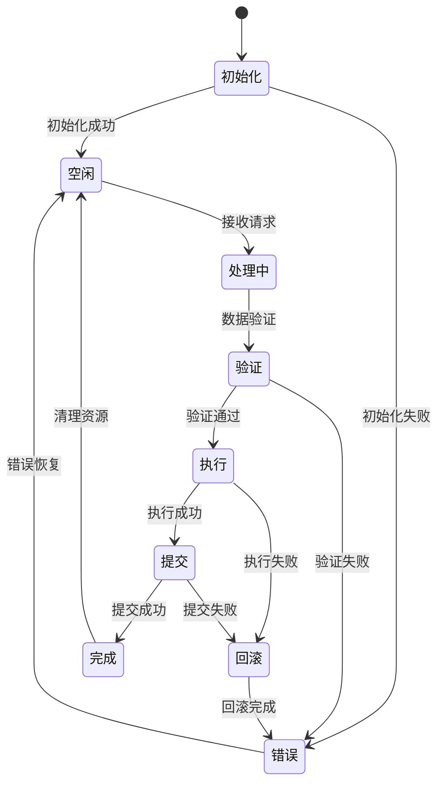
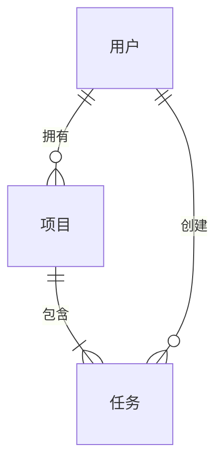

# 低层设计 (LLD)

为功能创建详细实现设计：**$ARGUMENTS**

## 前置条件

**重要提示**：LLD 必须在 HLD 批准后生成。

- 高层设计：@.tasks/$ARGUMENTS/design-hld.md
- 需求文档：@.tasks/$ARGUMENTS/requirements.md
- 规范元数据：@.tasks/$ARGUMENTS/spec.json

## 任务：创建低层设计

### LLD 文档结构

生成包含实现细节、接口签名和异常处理的低层设计文档：

````markdown
# 低层设计 (Low-Level Design)

## 概述

[基于HLD的具体实现方案概述]

## 组件详细设计

### 组件1：[组件名称]

#### 接口签名

```typescript
// TypeScript 接口定义
interface ComponentAPI {
  // 方法签名
  methodName(param1: Type1, param2: Type2): Promise<ReturnType>

  // 事件
  onEvent(callback: (data: EventData) => void): void
}
```

```python
# Python 接口定义
class ComponentAPI:
    def method_name(self, param1: Type1, param2: Type2) -> ReturnType:
        """
        方法描述
        :param param1: 参数1说明
        :param param2: 参数2说明
        :return: 返回值说明
        :raises: 可能抛出的异常
        """
        pass
```

#### 状态机设计



#### 内部数据结构

```typescript
// 核心数据结构
interface InternalState {
  id: string
  status: 'idle' | 'processing' | 'error'
  metadata: {
    createdAt: Date
    updatedAt: Date
    version: number
  }
  data: {
    // 业务数据字段
  }
}

// 请求/响应结构
interface Request {
  requestId: string
  timestamp: number
  payload: any
  headers: Map<string, string>
}

interface Response {
  requestId: string
  status: number
  data?: any
  error?: ErrorDetail
}
```

```python
# Python 数据结构
from dataclasses import dataclass
from typing import Optional, Dict, Any
from enum import Enum

class Status(Enum):
    IDLE = "idle"
    PROCESSING = "processing"
    ERROR = "error"

@dataclass
class InternalState:
    id: str
    status: Status
    metadata: Dict[str, Any]
    data: Dict[str, Any]

@dataclass
class Request:
    request_id: str
    timestamp: float
    payload: Any
    headers: Dict[str, str]

@dataclass
class Response:
    request_id: str
    status: int
    data: Optional[Any] = None
    error: Optional[Dict[str, Any]] = None
```

### 前端组件设计

#### 组件表格

| 组件名称 | 职责           | Props/状态摘要     |
| -------- | -------------- | ------------------ |
| [组件1]  | [主要功能描述] | [关键props和state] |
| [组件2]  | [主要功能描述] | [关键props和state] |
| [组件3]  | [主要功能描述] | [关键props和state] |

#### API 端点设计

提供详细的 API 端点表：

| 方法   | 路由            | 目的     | 认证 | 状态码                  |
| ------ | --------------- | -------- | ---- | ----------------------- |
| GET    | /api/[资源]     | 列出资源 | 需要 | 200, 401, 500           |
| POST   | /api/[资源]     | 创建资源 | 需要 | 201, 400, 401, 500      |
| PUT    | /api/[资源]/:id | 更新资源 | 需要 | 200, 400, 401, 404, 500 |
| DELETE | /api/[资源]/:id | 删除资源 | 需要 | 204, 401, 404, 500      |

### 数据模型设计

#### 领域实体

1. **[实体1]**：[简要描述]
2. **[实体2]**：[简要描述]
3. **[实体3]**：[简要描述]

#### 实体关系



#### 数据模型定义

提供特定语言的模型（TypeScript 接口和/或 Python 数据类）：

```typescript
interface [模型名称] {
  id: string;
  // 根据需求添加相关字段
  createdAt: Date;
  updatedAt: Date;
}
```

```python
@dataclass
class [模型名称]:
    id: str
    # 根据需求添加相关字段
    created_at: datetime
    updated_at: datetime
```

### 组件2：[数据访问层]

#### 数据库模式设计

```sql
-- 核心表结构
CREATE TABLE entity_table (
    id UUID PRIMARY KEY DEFAULT gen_random_uuid(),
    status VARCHAR(50) NOT NULL,
    data JSONB NOT NULL,
    created_at TIMESTAMP WITH TIME ZONE DEFAULT CURRENT_TIMESTAMP,
    updated_at TIMESTAMP WITH TIME ZONE DEFAULT CURRENT_TIMESTAMP,
    version INTEGER DEFAULT 1,

    -- 索引
    INDEX idx_status (status),
    INDEX idx_created_at (created_at),
    INDEX idx_data_gin (data) USING GIN
);

-- 添加外键和其他约束
ALTER TABLE entity_table
ADD CONSTRAINT fk_user_id FOREIGN KEY (user_id) REFERENCES users(id);

-- 存储过程示例
CREATE OR REPLACE FUNCTION update_entity_with_version_check(
    p_id UUID,
    p_data JSONB,
    p_version INTEGER
) RETURNS BOOLEAN AS $$
BEGIN
    UPDATE entity_table
    SET data = p_data,
        version = version + 1,
        updated_at = CURRENT_TIMESTAMP
    WHERE id = p_id AND version = p_version;

    RETURN FOUND;
END;
$$ LANGUAGE plpgsql;
```

#### 迁移策略

- **模式更改的迁移方法**：使用版本化迁移脚本（如 Flyway/Liquibase）
- **向后兼容性考虑**：新字段使用默认值，避免破坏性变更
- **数据转换需求**：批量数据迁移使用后台任务
- **性能索引策略**：基于查询模式创建覆盖索引

#### 缓存策略

```typescript
// 缓存接口
interface CacheStrategy {
  // 缓存键生成
  generateKey(params: any): string

  // TTL策略
  getTTL(key: string): number

  // 缓存失效策略
  invalidate(pattern: string): Promise<void>

  // 缓存预热
  warmup(keys: string[]): Promise<void>
}

// 实现示例
class EntityCache implements CacheStrategy {
  private readonly DEFAULT_TTL = 3600 // 1小时
  private readonly MAX_TTL = 86400 // 24小时

  generateKey(params: any): string {
    return `entity:${params.id}:v${params.version}`
  }

  getTTL(key: string): number {
    // 基于key类型返回不同的TTL
    if (key.includes(':list:')) {
      return 300 // 列表缓存5分钟
    }
    return this.DEFAULT_TTL
  }
}
```

## 异常处理与重试机制

### 异常分类

| 异常类型   | 错误码 | 处理策略         | 重试策略          |
| ---------- | ------ | ---------------- | ----------------- |
| 验证失败   | 400    | 返回详细错误信息 | 不重试            |
| 认证失败   | 401    | 刷新token后重试  | 最多1次           |
| 权限不足   | 403    | 记录并返回错误   | 不重试            |
| 资源不存在 | 404    | 返回错误信息     | 不重试            |
| 并发冲突   | 409    | 延迟后重试       | 指数退避，最多3次 |
| 限流       | 429    | 等待后重试       | 根据Retry-After头 |
| 服务器错误 | 500    | 降级处理         | 指数退避，最多3次 |
| 网关超时   | 504    | 快速失败         | 最多1次           |

### 重试实现

```typescript
// 重试装饰器
function retryable(options: RetryOptions) {
  return function (
    target: any,
    propertyKey: string,
    descriptor: PropertyDescriptor,
  ) {
    const originalMethod = descriptor.value

    descriptor.value = async function (...args: any[]) {
      let lastError: Error

      for (let attempt = 0; attempt <= options.maxRetries; attempt++) {
        try {
          return await originalMethod.apply(this, args)
        } catch (error) {
          lastError = error

          if (!shouldRetry(error, options)) {
            throw error
          }

          if (attempt < options.maxRetries) {
            const delay = calculateBackoff(attempt, options)
            await sleep(delay)
          }
        }
      }

      throw lastError
    }
  }
}

// 使用示例
class Service {
  @retryable({
    maxRetries: 3,
    retryableErrors: [NetworkError, TimeoutError],
    backoffMultiplier: 2,
    initialDelay: 1000,
  })
  async fetchData(id: string): Promise<Data> {
    // 实现逻辑
  }
}
```

## 回滚步骤详细设计

### 数据回滚

```sql
-- 回滚脚本模板
-- Rollback Script: feature_xxx_rollback.sql

-- 1. 备份当前数据
CREATE TABLE entity_table_backup_YYYYMMDD AS
SELECT * FROM entity_table;

-- 2. 回滚DDL变更
ALTER TABLE entity_table DROP COLUMN IF EXISTS new_column;

-- 3. 回滚数据变更
UPDATE entity_table
SET status = 'previous_status'
WHERE status = 'new_status'
  AND created_at >= '2024-01-01'::timestamp;

-- 4. 恢复约束
ALTER TABLE entity_table
ADD CONSTRAINT original_constraint CHECK (condition);

-- 5. 验证回滚
SELECT COUNT(*) as affected_rows,
       status,
       COUNT(DISTINCT id) as unique_ids
FROM entity_table
WHERE updated_at >= '2024-01-01'::timestamp
GROUP BY status;
```

### 应用回滚

```yaml
# 回滚配置
rollback:
  strategy: blue-green # 或 canary, rolling

  steps:
    - name: 健康检查
      command: health-check.sh
      timeout: 30s

    - name: 流量切换
      command: switch-traffic.sh --to previous
      validate: check-traffic.sh

    - name: 验证回滚
      command: validate-rollback.sh
      success_criteria:
        - error_rate < 0.01
        - latency_p99 < 1000ms

    - name: 清理资源
      command: cleanup.sh
      when: success
```

## 容量参数配置

### 资源限制

```yaml
# 容量配置
capacity:
  # CPU和内存限制
  resources:
    requests:
      cpu: '500m'
      memory: '512Mi'
    limits:
      cpu: '2000m'
      memory: '2Gi'

  # 并发限制
  concurrency:
    max_connections: 1000
    max_requests_per_second: 500
    max_concurrent_requests: 100

  # 队列配置
  queues:
    task_queue:
      max_size: 10000
      max_delay: 60s
      batch_size: 100

  # 连接池配置
  pools:
    database:
      min_size: 10
      max_size: 100
      max_idle_time: 300s
    redis:
      min_size: 5
      max_size: 50

  # 限流配置
  rate_limits:
    - key: 'user_id'
      limit: 100
      window: 60s
    - key: 'ip_address'
      limit: 1000
      window: 60s
```

### 自动伸缩参数

```yaml
# HPA配置
autoscaling:
  minReplicas: 2
  maxReplicas: 10

  metrics:
    - type: Resource
      resource:
        name: cpu
        target:
          type: Utilization
          averageUtilization: 70

    - type: Resource
      resource:
        name: memory
        target:
          type: Utilization
          averageUtilization: 80

    - type: Pods
      pods:
        metric:
          name: requests_per_second
        target:
          type: AverageValue
          averageValue: '100'

  behavior:
    scaleUp:
      stabilizationWindowSeconds: 60
      policies:
        - type: Percent
          value: 100
          periodSeconds: 60
    scaleDown:
      stabilizationWindowSeconds: 300
      policies:
        - type: Percent
          value: 10
          periodSeconds: 60
```

## 测试策略

### 测试目标

- 目的/范围：[质量风险降低 / 回归预防 / 客观验收]
- 使用：仅保留适用的行；删除其他行（不要标记 N/A）

### 风险矩阵

| 区域         | 风险       | 必须            | 可选      | 参考         |
| ------------ | ---------- | --------------- | --------- | ------------ |
| 认证/授权    | [高/中/低] | 单元、契约、E2E | 安全      | [X.X]        |
| 外部 API     | [高/中/低] | 契约、集成      | 弹性      | [X.X]        |
| 数据完整性   | [高/中/低] | 单元、属性      | 集成      | [X.X]        |
| 关键 UX 流程 | [高/中/低] | E2E (≤3)        | 可访问性  | [X.X]        |
| 性能         | [高/中/低] | 性能冒烟测试    | 负载/压力 | [SLO/性能表] |

### 按层最小化

- 单元：核心业务逻辑的边界/异常情况
- 契约（API）：提供者/消费者契约固定
- 集成：数据库/外部依赖集成
- E2E（≤3）：主要用户流程，正常 + 边缘

### CI 门控

| 阶段         | 运行        | 门控        | SLA |
| ------------ | ----------- | ----------- | --- |
| PR           | 单元 + 契约 | 失败 = 阻止 | ≤Xm |
| 暂存         | 集成 + E2E  | 失败 = 阻止 | ≤Ym |
| 夜间（如果） | 性能/弹性   | 回归 → 问题 | -   |

### 退出标准

- Sev1/Sev2 = 0
- 所有门控通过
- 满足非功能目标（例外需要记录批准）

## 测试点设计

### 单元测试

```typescript
// 测试用例示例
describe('ComponentAPI', () => {
  describe('methodName', () => {
    it('应该成功处理有效输入', async () => {
      // Arrange
      const input = { id: '123', data: 'test' }
      const expected = { success: true, result: 'processed' }

      // Act
      const result = await component.methodName(input)

      // Assert
      expect(result).toEqual(expected)
    })

    it('应该拒绝无效输入', async () => {
      // Arrange
      const invalidInput = { id: null }

      // Act & Assert
      await expect(component.methodName(invalidInput)).rejects.toThrow(
        ValidationError,
      )
    })

    it('应该正确处理并发请求', async () => {
      // Arrange
      const requests = Array(10)
        .fill(null)
        .map((_, i) => ({
          id: `id_${i}`,
          data: `data_${i}`,
        }))

      // Act
      const results = await Promise.all(
        requests.map((req) => component.methodName(req)),
      )

      // Assert
      expect(results).toHaveLength(10)
      results.forEach((result, index) => {
        expect(result.id).toBe(`id_${index}`)
      })
    })
  })
})
```

### 集成测试

```python
# 集成测试示例
import pytest
from unittest.mock import Mock, patch

class TestIntegration:
    @pytest.fixture
    def setup_test_env(self):
        """测试环境准备"""
        # 设置测试数据库
        test_db = create_test_database()

        # 初始化测试数据
        seed_test_data(test_db)

        yield test_db

        # 清理
        cleanup_test_database(test_db)

    def test_end_to_end_flow(self, setup_test_env):
        """端到端流程测试"""
        # 1. 创建请求
        request = create_request(data="test_data")

        # 2. 处理请求
        response = api_client.post("/api/process", json=request)
        assert response.status_code == 200

        # 3. 验证数据持久化
        stored_data = db.query(f"SELECT * FROM entities WHERE id = '{response.json()['id']}'")
        assert stored_data is not None

        # 4. 验证缓存
        cached_data = cache.get(f"entity:{response.json()['id']}")
        assert cached_data is not None

        # 5. 验证异步任务
        task_status = queue.get_task_status(response.json()['task_id'])
        assert task_status == 'completed'
```

### 性能测试

```yaml
# 性能测试场景
performance_tests:
  - name: 负载测试
    tool: k6
    config:
      vus: 100 # 虚拟用户数
      duration: 5m
      thresholds:
        http_req_duration: ['p(95)<500']
        http_req_failed: ['rate<0.1']

  - name: 压力测试
    tool: locust
    config:
      users: 1000
      spawn_rate: 10
      run_time: 10m

  - name: 容量测试
    tool: jmeter
    config:
      threads: 500
      ramp_up: 60s
      loops: 100
```

## 监控指标

### 应用指标

```typescript
// 指标收集
interface Metrics {
  // 计数器
  requestCount: Counter
  errorCount: Counter

  // 直方图
  responseTime: Histogram
  requestSize: Histogram

  // 测量仪
  activeConnections: Gauge
  queueSize: Gauge
}

// Prometheus指标定义
const metrics = {
  requestCount: new Counter({
    name: 'app_requests_total',
    help: 'Total number of requests',
    labelNames: ['method', 'endpoint', 'status'],
  }),

  responseTime: new Histogram({
    name: 'app_response_time_seconds',
    help: 'Response time in seconds',
    labelNames: ['method', 'endpoint'],
    buckets: [0.1, 0.5, 1, 2, 5],
  }),

  activeConnections: new Gauge({
    name: 'app_active_connections',
    help: 'Number of active connections',
    labelNames: ['type'],
  }),
}
```

### 日志规范

```json
{
  "timestamp": "2024-01-01T12:00:00Z",
  "level": "INFO",
  "service": "api-service",
  "trace_id": "abc123",
  "span_id": "def456",
  "user_id": "user_123",
  "method": "POST",
  "path": "/api/resource",
  "status": 200,
  "duration_ms": 123,
  "message": "Request processed successfully",
  "metadata": {
    "request_size": 1024,
    "response_size": 2048,
    "cache_hit": true
  }
}
```

## 安全实现

### 认证与授权

```typescript
// JWT认证中间件
class AuthMiddleware {
  async authenticate(request: Request): Promise<User> {
    const token = this.extractToken(request)

    if (!token) {
      throw new UnauthorizedError('Missing token')
    }

    try {
      const payload = jwt.verify(token, this.secret)
      const user = await this.userService.findById(payload.userId)

      if (!user || user.status !== 'active') {
        throw new UnauthorizedError('Invalid user')
      }

      return user
    } catch (error) {
      if (error instanceof jwt.TokenExpiredError) {
        throw new UnauthorizedError('Token expired')
      }
      throw new UnauthorizedError('Invalid token')
    }
  }

  async authorize(
    user: User,
    resource: string,
    action: string,
  ): Promise<boolean> {
    const permissions = await this.permissionService.getUserPermissions(user.id)
    return permissions.some(
      (p) => p.resource === resource && p.actions.includes(action),
    )
  }
}
```

### 输入验证

```typescript
// 验证schema
const validationSchemas = {
  createEntity: Joi.object({
    name: Joi.string().min(3).max(100).required(),
    type: Joi.string().valid('type1', 'type2', 'type3').required(),
    data: Joi.object().required(),
    tags: Joi.array().items(Joi.string()).max(10).optional(),
  }),

  updateEntity: Joi.object({
    name: Joi.string().min(3).max(100).optional(),
    data: Joi.object().optional(),
    version: Joi.number().integer().min(1).required(),
  }),
}

// 验证中间件
function validate(schema: Joi.Schema) {
  return (req: Request, res: Response, next: NextFunction) => {
    const { error, value } = schema.validate(req.body, {
      abortEarly: false,
      stripUnknown: true,
    })

    if (error) {
      const errors = error.details.map((detail) => ({
        field: detail.path.join('.'),
        message: detail.message,
      }))

      return res.status(400).json({
        error: 'Validation failed',
        details: errors,
      })
    }

    req.body = value
    next()
  }
}
```

## 部署细节

### CI/CD Pipeline

```yaml
# 部署流水线
stages:
  - build
  - test
  - deploy

build:
  stage: build
  script:
    - docker build -t $IMAGE_NAME:$CI_COMMIT_SHA .
    - docker push $IMAGE_NAME:$CI_COMMIT_SHA

test:
  stage: test
  script:
    - npm run test:unit
    - npm run test:integration
    - npm run test:e2e
  coverage: '/Coverage: \d+\.\d+%/'

deploy:
  stage: deploy
  script:
    - kubectl set image deployment/app app=$IMAGE_NAME:$CI_COMMIT_SHA
    - kubectl rollout status deployment/app
    - ./scripts/smoke-test.sh
  only:
    - main
```

## 依赖管理

### 外部依赖

| 依赖名称      | 版本 | 用途       | 降级方案 |
| ------------- | ---- | ---------- | -------- |
| Database      | v14+ | 数据持久化 | 本地缓存 |
| Redis         | v6+  | 缓存和会话 | 内存缓存 |
| Message Queue | v3+  | 异步处理   | 同步处理 |
| Auth Service  | v2+  | 认证服务   | 本地认证 |

### 版本兼容性

```json
{
  "engines": {
    "node": ">=18.0.0",
    "npm": ">=9.0.0"
  },
  "dependencies": {
    "express": "^4.18.0",
    "typescript": "^5.0.0",
    "@types/node": "^20.0.0"
  },
  "peerDependencies": {
    "react": "^18.0.0",
    "react-dom": "^18.0.0"
  }
}
```
````

### 文档生成要求

1. **接口签名完整**：包含所有参数类型、返回值、异常
2. **状态机清晰**：明确所有状态转换和触发条件
3. **数据结构详细**：定义所有内部数据结构
4. **异常处理全面**：覆盖所有异常场景和重试策略
5. **测试点明确**：定义具体的测试用例和验证标准
6. **容量参数具体**：提供可配置的容量参数
7. **回滚步骤可执行**：提供详细的回滚脚本和步骤

### 与HLD的关系

LLD必须：

1. 基于HLD的架构设计
2. 实现HLD中定义的所有接口
3. 满足HLD中的性能和容量要求
4. 遵循HLD中的技术选型决策

## 交付物

生成的LLD文档应包含：

- 完整的接口签名（多语言）
- 状态机图
- 数据结构定义
- 异常处理矩阵
- 重试策略实现
- 回滚脚本
- 容量配置参数
- 测试用例设计
- 监控指标定义

## 审批流程

LLD完成后需要：

1. 技术负责人审核实现方案
2. 测试负责人确认测试覆盖
3. 运维团队评估部署和回滚方案
4. 开发团队确认可实施性

### 文档生成

仅生成设计文档内容。不要在实际文档文件中包含任何审查或批准说明。

### 更新元数据

更新 spec.json：

```json
{
  "phase": "lld-generated",
  "approvals": {
    "requirements": {
      "generated": true,
      "approved": true
    },
    "hld": {
      "generated": true,
      "approved": true
    },
    "lld": {
      "generated": true,
      "approved": false
    }
  },
  "updated_at": "current_timestamp"
}
```

---

## 交互式批准实施（不包含在文档中）

以下内容仅用于 Claude Code 对话 - 不用于生成的文档：

### 交互式批准流程

## 下一阶段：交互式批准

生成 design-lld.md 后，审查低层设计并选择：

**如果LLD看起来不错：** 运行 `/spec-task:tasks $ARGUMENTS -y` 继续进入任务阶段

**如果LLD需要修改：** 请求更改，然后在修改后重新运行此命令

`-y` 标志自动批准LLD并直接生成任务，在保持审查强制的同时简化工作流程。

### 审查清单（供用户参考）：

- [ ] 接口签名完整明确
- [ ] 状态机设计合理
- [ ] 数据结构定义清晰
- [ ] 异常处理策略全面
- [ ] 重试机制设计合理
- [ ] 测试用例覆盖充分
- [ ] 容量参数可配置
- [ ] 回滚步骤可执行
- [ ] 监控指标定义完整

## 说明

1. **验证HLD基础** - 确保 design-hld.md 存在并已批准
2. **检查 spec.json 中的语言** - 使用元数据中指定的语言
3. **进行实现研究**：
   - 研究和分析库的详细接口和方法签名
   - 研究最佳实践和代码示例
   - 调查性能优化技巧
   - 评估测试策略和工具
4. **组件详细设计**：
   - 定义完整的接口签名（多语言）
   - 设计状态机和状态转换
   - 定义内部数据结构
   - 设计缓存策略
5. **异常和重试设计**：
   - 分类所有可能的异常
   - 定义每种异常的处理策略
   - 设计重试机制和退避策略
   - 实现熔断和降级方案
6. **测试策略设计**：
   - 单元测试用例设计
   - 集成测试场景
   - 性能测试基准
   - 端到端测试流程
7. **容量和监控设计**：
   - 定义可配置的容量参数
   - 设计自动伸缩策略
   - 定义监控指标
   - 规范日志格式
8. **安全实现细节**：
   - 认证和授权实现
   - 输入验证规则
   - 加密和数据保护
9. **部署和回滚细节**：
   - CI/CD流水线配置
   - 回滚脚本和步骤
   - 依赖管理策略
10. **完成后更新跟踪元数据**

生成的LLD应为实施提供详细的技术规范，包含所有接口定义、数据结构、异常处理、测试策略和部署细节，开发人员可以直接根据LLD进行编码实现。ultrathink
