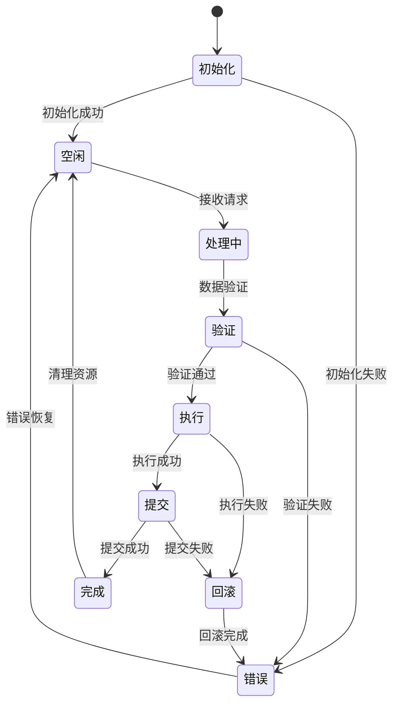
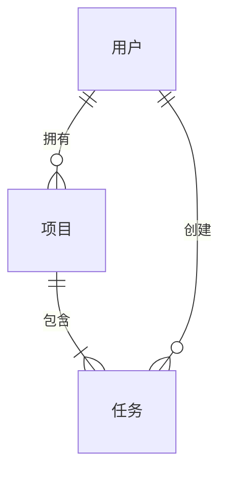

# 低层设计 (LLD)

为功能创建详细实现设计：**$ARGUMENTS**

## 前置条件

**重要提示**：LLD 必须在 HLD 批准后生成。

- 高层设计：@.tasks/$ARGUMENTS/design-hld.md
- 需求文档：@.tasks/$ARGUMENTS/requirements.md
- 规范元数据：@.tasks/$ARGUMENTS/spec.json

## 任务：创建低层设计

### LLD 目录结构

生成包含实现细节、接口签名和异常处理的低层设计文档集，按逻辑模块分割为多个独立文档：

#### 目录结构
```
.tasks/$ARGUMENTS/lld/
├── README.md                # 文档集概述和导航
├── overview.md              # 项目概述和文档关系说明  
├── components.md            # 组件详细设计（接口签名、状态机、数据结构）
├── frontend.md              # 前端组件设计和API端点
├── data-models.md           # 数据模型设计和数据库设计
├── error-handling.md        # 异常处理与重试机制
├── rollback.md              # 回滚步骤详细设计
├── capacity.md              # 容量参数配置
├── testing.md               # 测试策略和测试点设计
├── monitoring.md            # 监控指标和日志规范
├── security.md              # 安全实现
├── deployment.md            # 部署细节和依赖管理
├── [可选文档]
├── business-logic.md        # 业务逻辑实现（复杂业务逻辑时需要）
├── events.md                # 事件设计和消息处理（事件驱动架构时需要）
├── versioning.md            # 版本控制策略（有版本化需求时需要）
├── sse.md                   # SSE实现细节（有实时通信需求时需要）
├── workflows.md             # 工作流程设计（有工作流编排时需要）
└── integrations.md          # 外部集成设计（有复杂集成时需要）
```

#### README.md 模板

```markdown
# [功能名称] - 低层设计文档集

本目录包含 [功能描述] 的详细低层设计文档，已从原始的 `design-lld.md` 文件按逻辑模块分割为多个独立文档。

## 文档结构

### 核心设计文档

1. **[概述](overview.md)** - 项目概述和文档关系说明
2. **[组件详细设计](components.md)** - 接口签名、状态机设计、内部数据结构
3. **[前端组件](frontend.md)** - 前端组件设计和API端点设计
4. **[数据模型](data-models.md)** - 数据模型设计和数据库设计

### 可靠性与运维

5. **[异常处理](error-handling.md)** - 异常处理与重试机制
6. **[回滚设计](rollback.md)** - 回滚步骤详细设计
7. **[容量配置](capacity.md)** - 容量参数配置
8. **[测试设计](testing.md)** - 测试策略和测试点设计

### 运维与安全

9. **[监控指标](monitoring.md)** - 监控指标和日志规范
10. **[安全实现](security.md)** - 安全实现
11. **[部署运维](deployment.md)** - 部署细节和依赖管理

### 可选专项文档（根据项目需求添加）

- **[业务逻辑](business-logic.md)** - 复杂业务逻辑实现（当业务规则复杂时）
- **[事件设计](events.md)** - 事件设计和消息处理（事件驱动架构时）
- **[版本控制](versioning.md)** - 版本控制策略（有版本化需求时）
- **[SSE实现](sse.md)** - SSE实现细节（有实时通信需求时）
- **[工作流程](workflows.md)** - 工作流程设计（有工作流编排时）
- **[外部集成](integrations.md)** - 外部集成设计（有复杂集成时）

## 实现阶段

[如适用，描述分阶段实现计划]

## 技术栈

[列出主要技术选型]

## 关键特性

[列出核心特性]

## 使用指南

1. 从 [概述](overview.md) 开始了解整体架构
2. 查看 [组件详细设计](components.md) 了解核心组件
3. 根据实现需求查看相应的专项文档

## 文档维护

- 文档版本: 1.0
- 生成日期: [当前日期]
- 对应 HLD: [design-hld.md](../design-hld.md)

各文档保持相互引用和一致性，如有更新请同步修改相关文档。
```

#### overview.md 模板

```markdown
# LLD 概述 — [功能名称]

文档版本: 1.0  
生成日期: [当前日期]  
对应 HLD: [design-hld.md](../design-hld.md)

## 概述

本 LLD 基于已批准的 [HLD](../design-hld.md)，细化 [功能描述] 的实现细节。

**文档关系说明**：

- **HLD ([design-hld.md](../design-hld.md))** - 架构决策、组件交互、数据流设计
- **LLD (本系列文档)** - 具体实现、代码规范、数据库模式、API细节

## 文档结构

- [概述](overview.md) - 本文档
- [组件详细设计](components.md) - 接口签名、状态机设计、内部数据结构
- [前端组件](frontend.md) - 前端组件设计和API端点设计
- [数据模型](data-models.md) - 数据模型设计和数据库设计
- [异常处理](error-handling.md) - 异常处理与重试机制
- [回滚设计](rollback.md) - 回滚步骤详细设计
- [容量配置](capacity.md) - 容量参数配置
- [测试设计](testing.md) - 测试策略和测试点设计
- [监控指标](monitoring.md) - 监控指标和日志规范
- [安全实现](security.md) - 安全实现
- [部署运维](deployment.md) - 部署细节和依赖管理

## 技术栈概览

[基于HLD的技术栈说明]

## 架构原则

[基于HLD的架构原则]
```

### 文档模板

#### components.md 模板

```markdown
# 组件详细设计 — [功能名称]

文档版本: 1.0  
对应 HLD: [design-hld.md](../design-hld.md)

## 组件详细设计

### 组件1：[组件名称]

#### 接口签名

```typescript
// TypeScript 接口定义
interface ComponentAPI {
  methodName(param1: Type1, param2: Type2): Promise<ReturnType>
  onEvent(callback: (data: EventData) => void): void
}
```

```python
# Python 接口定义
class ComponentAPI:
    def method_name(self, param1: Type1, param2: Type2) -> ReturnType:
        """
        方法描述
        :param param1: 参数1说明
        :param param2: 参数2说明
        :return: 返回值说明
        :raises: 可能抛出的异常
        """
        pass
```

#### 状态机设计



#### 内部数据结构

```typescript
// 核心数据结构
interface InternalState {
  id: string
  status: 'idle' | 'processing' | 'error'
  metadata: {
    createdAt: Date
    updatedAt: Date
    version: number
  }
  data: {
    // 业务数据字段
  }
}

// 请求/响应结构
interface Request {
  requestId: string
  timestamp: number
  payload: any
  headers: Map<string, string>
}

interface Response {
  requestId: string
  status: number
  data?: any
  error?: ErrorDetail
}
```

```python
# Python 数据结构
from dataclasses import dataclass
from typing import Optional, Dict, Any
from enum import Enum

class Status(Enum):
    IDLE = "idle"
    PROCESSING = "processing"
    ERROR = "error"

@dataclass
class InternalState:
    id: str
    status: Status
    metadata: Dict[str, Any]
    data: Dict[str, Any]

@dataclass
class Request:
    request_id: str
    timestamp: float
    payload: Any
    headers: Dict[str, str]

@dataclass
class Response:
    request_id: str
    status: int
    data: Optional[Any] = None
    error: Optional[Dict[str, Any]] = None
```
```

#### frontend.md 模板

```markdown
# 前端组件设计 — [功能名称]

文档版本: 1.0  
对应 HLD: [design-hld.md](../design-hld.md)

## 前端组件设计

### 组件表格

| 组件名称 | 职责           | Props/状态摘要     |
| -------- | -------------- | ------------------ |
| [组件1]  | [主要功能描述] | [关键props和state] |
| [组件2]  | [主要功能描述] | [关键props和state] |
| [组件3]  | [主要功能描述] | [关键props和state] |

### API 端点设计

提供详细的 API 端点表：

| 方法   | 路由            | 目的     | 认证 | 状态码                  |
| ------ | --------------- | -------- | ---- | ----------------------- |
| GET    | /api/[资源]     | 列出资源 | 需要 | 200, 401, 500           |
| POST   | /api/[资源]     | 创建资源 | 需要 | 201, 400, 401, 500      |
| PUT    | /api/[资源]/:id | 更新资源 | 需要 | 200, 400, 401, 404, 500 |
| DELETE | /api/[资源]/:id | 删除资源 | 需要 | 204, 401, 404, 500      |
```

#### data-models.md 模板

```markdown
# 数据模型设计 — [功能名称]

文档版本: 1.0  
对应 HLD: [design-hld.md](../design-hld.md)

## 数据模型设计

### 领域实体

1. **[实体1]**：[简要描述]
2. **[实体2]**：[简要描述]
3. **[实体3]**：[简要描述]

### 实体关系



### 数据模型定义

提供特定语言的模型（TypeScript 接口和/或 Python 数据类）：

```typescript
interface [模型名称] {
  id: string;
  // 根据需求添加相关字段
  createdAt: Date;
  updatedAt: Date;
}
```

```python
@dataclass
class [模型名称]:
    id: str
    # 根据需求添加相关字段
    created_at: datetime
    updated_at: datetime
```

## 数据库设计

### 数据库模式设计

```sql
-- 核心表结构
CREATE TABLE entity_table (
    id UUID PRIMARY KEY DEFAULT gen_random_uuid(),
    status VARCHAR(50) NOT NULL,
    data JSONB NOT NULL,
    created_at TIMESTAMP WITH TIME ZONE DEFAULT CURRENT_TIMESTAMP,
    updated_at TIMESTAMP WITH TIME ZONE DEFAULT CURRENT_TIMESTAMP,
    version INTEGER DEFAULT 1,

    -- 索引
    INDEX idx_status (status),
    INDEX idx_created_at (created_at),
    INDEX idx_data_gin (data) USING GIN
);

-- 添加外键和其他约束
ALTER TABLE entity_table
ADD CONSTRAINT fk_user_id FOREIGN KEY (user_id) REFERENCES users(id);
```

### 迁移策略

- **模式更改的迁移方法**：使用版本化迁移脚本（如 Flyway/Liquibase）
- **向后兼容性考虑**：新字段使用默认值，避免破坏性变更
- **数据转换需求**：批量数据迁移使用后台任务
- **性能索引策略**：基于查询模式创建覆盖索引

### 缓存策略

```typescript
// 缓存接口
interface CacheStrategy {
  // 缓存键生成
  generateKey(params: any): string

  // TTL策略
  getTTL(key: string): number

  // 缓存失效策略
  invalidate(pattern: string): Promise<void>

  // 缓存预热
  warmup(keys: string[]): Promise<void>
}
```
```

#### error-handling.md 模板

```markdown
# 异常处理与重试机制 — [功能名称]

文档版本: 1.0  
对应 HLD: [design-hld.md](../design-hld.md)

## 异常处理与重试机制

### 异常分类

| 异常类型   | 错误码 | 处理策略         | 重试策略          |
| ---------- | ------ | ---------------- | ----------------- |
| 验证失败   | 400    | 返回详细错误信息 | 不重试            |
| 认证失败   | 401    | 刷新token后重试  | 最多1次           |
| 权限不足   | 403    | 记录并返回错误   | 不重试            |
| 资源不存在 | 404    | 返回错误信息     | 不重试            |
| 并发冲突   | 409    | 延迟后重试       | 指数退避，最多3次 |
| 限流       | 429    | 等待后重试       | 根据Retry-After头 |
| 服务器错误 | 500    | 降级处理         | 指数退避，最多3次 |
| 网关超时   | 504    | 快速失败         | 最多1次           |

### 重试实现

```typescript
// 重试装饰器
function retryable(options: RetryOptions) {
  return function (
    target: any,
    propertyKey: string,
    descriptor: PropertyDescriptor,
  ) {
    const originalMethod = descriptor.value

    descriptor.value = async function (...args: any[]) {
      let lastError: Error

      for (let attempt = 0; attempt <= options.maxRetries; attempt++) {
        try {
          return await originalMethod.apply(this, args)
        } catch (error) {
          lastError = error

          if (!shouldRetry(error, options)) {
            throw error
          }

          if (attempt < options.maxRetries) {
            const delay = calculateBackoff(attempt, options)
            await sleep(delay)
          }
        }
      }

      throw lastError
    }
  }
}

// 使用示例
class Service {
  @retryable({
    maxRetries: 3,
    retryableErrors: [NetworkError, TimeoutError],
    backoffMultiplier: 2,
    initialDelay: 1000,
  })
  async fetchData(id: string): Promise<Data> {
    // 实现逻辑
  }
}
```
```

#### rollback.md 模板

```markdown
# 回滚步骤详细设计 — [功能名称]

文档版本: 1.0  
对应 HLD: [design-hld.md](../design-hld.md)

## 回滚步骤详细设计

### 数据回滚

```sql
-- 回滚脚本模板
-- Rollback Script: feature_xxx_rollback.sql

-- 1. 备份当前数据
CREATE TABLE entity_table_backup_YYYYMMDD AS
SELECT * FROM entity_table;

-- 2. 回滚 DDL 变更
ALTER TABLE entity_table DROP COLUMN IF EXISTS new_column;

-- 3. 回滚数据变更
UPDATE entity_table
SET status = 'previous_status'
WHERE status = 'new_status'
  AND created_at >= '2024-01-01'::timestamp;

-- 4. 恢复约束
ALTER TABLE entity_table
ADD CONSTRAINT original_constraint CHECK (condition);

-- 5. 验证回滚
SELECT COUNT(*) as affected_rows,
       status,
       COUNT(DISTINCT id) as unique_ids
FROM entity_table
WHERE updated_at >= '2024-01-01'::timestamp
GROUP BY status;
```

### 应用回滚

```yaml
# 回滚配置
rollback:
  strategy: blue-green # 或 canary, rolling

  steps:
    - name: 健康检查
      command: health-check.sh
      timeout: 30s

    - name: 流量切换
      command: switch-traffic.sh --to previous
      validate: check-traffic.sh

    - name: 验证回滚
      command: validate-rollback.sh
      success_criteria:
        - error_rate < 0.01
        - latency_p99 < 1000ms

    - name: 清理资源
      command: cleanup.sh
      when: success
```

## 文档选择指南

根据项目特点选择需要的文档：

- **所有项目必需**：README.md, overview.md, components.md, data-models.md, error-handling.md, testing.md, deployment.md
- **有前端界面**：frontend.md
- **需要回滚机制**：rollback.md
- **高并发/大规模**：capacity.md, monitoring.md
- **安全要求高**：security.md
- **事件驱动架构**：events.md
- **复杂业务规则**：business-logic.md
- **版本化需求**：versioning.md
- **实时通信**：sse.md
- **工作流编排**：workflows.md
- **外部系统集成**：integrations.md

### 继续添加模板

#### capacity.md 模板

```markdown
# 容量参数配置 — [功能名称]

文档版本: 1.0  
对应 HLD: [design-hld.md](../design-hld.md)

## 容量参数配置

### 资源限制

```yaml
# 容量配置
capacity:
  # CPU和内存限制
  resources:
    requests:
      cpu: '500m'
      memory: '512Mi'
    limits:
      cpu: '2000m'
      memory: '2Gi'

  # 并发限制
  concurrency:
    max_connections: 1000
    max_requests_per_second: 500
    max_concurrent_requests: 100

  # 队列配置
  queues:
    task_queue:
      max_size: 10000
      max_delay: 60s
      batch_size: 100

  # 连接池配置
  pools:
    database:
      min_size: 10
      max_size: 100
      max_idle_time: 300s
    redis:
      min_size: 5
      max_size: 50

  # 限流配置
  rate_limits:
    - key: 'user_id'
      limit: 100
      window: 60s
    - key: 'ip_address'
      limit: 1000
      window: 60s
```

### 自动伸缩参数

```yaml
# HPA配置
autoscaling:
  minReplicas: 2
  maxReplicas: 10

  metrics:
    - type: Resource
      resource:
        name: cpu
        target:
          type: Utilization
          averageUtilization: 70

    - type: Resource
      resource:
        name: memory
        target:
          type: Utilization
          averageUtilization: 80

  behavior:
    scaleUp:
      stabilizationWindowSeconds: 60
      policies:
        - type: Percent
          value: 100
          periodSeconds: 60
    scaleDown:
      stabilizationWindowSeconds: 300
      policies:
        - type: Percent
          value: 10
          periodSeconds: 60
```
```

#### testing.md 模板

```markdown
# 测试策略和测试点设计 — [功能名称]

文档版本: 1.0  
对应 HLD: [design-hld.md](../design-hld.md)

## 测试策略

### 测试目标

- 目的/范围：[质量风险降低 / 回归预防 / 客观验收]
- 使用：仅保留适用的行；删除其他行（不要标记 N/A）

### 风险矩阵

| 区域         | 风险       | 必须            | 可选      | 参考         |
| ------------ | ---------- | --------------- | --------- | ------------ |
| 认证/授权    | [高/中/低] | 单元、契约、E2E | 安全      | [X.X]        |
| 外部 API     | [高/中/低] | 契约、集成      | 弹性      | [X.X]        |
| 数据完整性   | [高/中/低] | 单元、属性      | 集成      | [X.X]        |
| 关键 UX 流程 | [高/中/低] | E2E (≤3)        | 可访问性  | [X.X]        |
| 性能         | [高/中/低] | 性能冒烟测试    | 负载/压力 | [SLO/性能表] |

### 按层最小化

- 单元：核心业务逻辑的边界/异常情况
- 契约（API）：提供者/消费者契约固定
- 集成：数据库/外部依赖集成
- E2E（≤3）：主要用户流程，正常 + 边缘

### CI 门控

| 阶段         | 运行        | 门控        | SLA |
| ------------ | ----------- | ----------- | --- |
| PR           | 单元 + 契约 | 失败 = 阻止 | ≤Xm |
| 暂存         | 集成 + E2E  | 失败 = 阻止 | ≤Ym |
| 夜间（如果） | 性能/弹性   | 回归 → 问题 | -   |

### 退出标准

- Sev1/Sev2 = 0
- 所有门控通过
- 满足非功能目标（例外需要记录批准）

## 测试点设计

### 单元测试

```typescript
// 测试用例示例
describe('ComponentAPI', () => {
  describe('methodName', () => {
    it('应该成功处理有效输入', async () => {
      // Arrange
      const input = { id: '123', data: 'test' }
      const expected = { success: true, result: 'processed' }

      // Act
      const result = await component.methodName(input)

      // Assert
      expect(result).toEqual(expected)
    })

    it('应该拒绝无效输入', async () => {
      // Arrange
      const invalidInput = { id: null }

      // Act & Assert
      await expect(component.methodName(invalidInput)).rejects.toThrow(
        ValidationError,
      )
    })
  })
})
```

### 集成测试

```python
# 集成测试示例
import pytest
from unittest.mock import Mock, patch

class TestIntegration:
    @pytest.fixture
    def setup_test_env(self):
        """测试环境准备"""
        # 设置测试数据库
        test_db = create_test_database()
        # 初始化测试数据
        seed_test_data(test_db)
        yield test_db
        # 清理
        cleanup_test_database(test_db)

    def test_end_to_end_flow(self, setup_test_env):
        """端到端流程测试"""
        # 1. 创建请求
        request = create_request(data="test_data")

        # 2. 处理请求
        response = api_client.post("/api/process", json=request)
        assert response.status_code == 200

        # 3. 验证数据持久化
        stored_data = db.query(f"SELECT * FROM entities WHERE id = '{response.json()['id']}'")
        assert stored_data is not None
```

### 性能测试

```yaml
# 性能测试场景
performance_tests:
  - name: 负载测试
    tool: k6
    config:
      vus: 100 # 虚拟用户数
      duration: 5m
      thresholds:
        http_req_duration: ['p(95)<500']
        http_req_failed: ['rate<0.1']

  - name: 压力测试
    tool: locust
    config:
      users: 1000
      spawn_rate: 10
      run_time: 10m
```

### 说明

1. **验证HLD基础** - 确保 design-hld.md 存在并已批准
2. **检查 spec.json 中的语言** - 使用元数据中指定的语言
3. **根据HLD创建LLD目录** - 在 `.tasks/$ARGUMENTS/lld/` 创建目录结构
4. **生成核心文档**：
   - README.md - 文档集导航
   - overview.md - 项目概述
   - components.md - 组件详细设计
   - data-models.md - 数据模型和数据库设计
   - error-handling.md - 异常处理机制
   - testing.md - 测试策略
   - deployment.md - 部署细节
5. **根据项目特点生成专项文档**：
   - frontend.md（如有前端界面）
   - capacity.md（高并发/大规模系统）
   - monitoring.md（生产环境部署）
   - security.md（安全要求高）
   - rollback.md（需要回滚机制）
   - events.md（事件驱动架构）
   - business-logic.md（复杂业务规则）
   - versioning.md（版本化需求）
   - sse.md（实时通信需求）
   - workflows.md（工作流编排）
   - integrations.md（外部系统集成）
6. **完成后更新跟踪元数据**

生成的LLD应为实施提供详细的技术规范，包含所有接口定义、数据结构、异常处理、测试策略和部署细节，开发人员可以直接根据LLD进行编码实现。

### 文档生成

仅生成设计文档内容。不要在实际文档文件中包含任何审查或批准说明。

### 更新元数据

更新 spec.json：

```json
{
  "phase": "lld-generated",
  "approvals": {
    "requirements": {
      "generated": true,
      "approved": true
    },
    "hld": {
      "generated": true,
      "approved": true
    },
    "lld": {
      "generated": true,
      "approved": false
    }
  },
  "updated_at": "current_timestamp"
}
```

---

## 交互式批准实施（不包含在文档中）

以下内容仅用于 Claude Code 对话 - 不用于生成的文档：

### 交互式批准流程

## 下一阶段：交互式批准

生成 lld/ 目录后，审查低层设计并选择：

**如果LLD看起来不错：** 运行 `/spec-task:tasks $ARGUMENTS -y` 继续进入任务阶段

**如果LLD需要修改：** 请求更改，然后在修改后重新运行此命令

`-y` 标志自动批准LLD并直接生成任务，在保持审查强制的同时简化工作流程。

### 审查清单（供用户参考）：

- [ ] 接口签名完整明确
- [ ] 状态机设计合理
- [ ] 数据结构定义清晰
- [ ] 异常处理策略全面
- [ ] 重试机制设计合理
- [ ] 测试用例覆盖充分
- [ ] 容量参数可配置
- [ ] 回滚步骤可执行
- [ ] 监控指标定义完整

