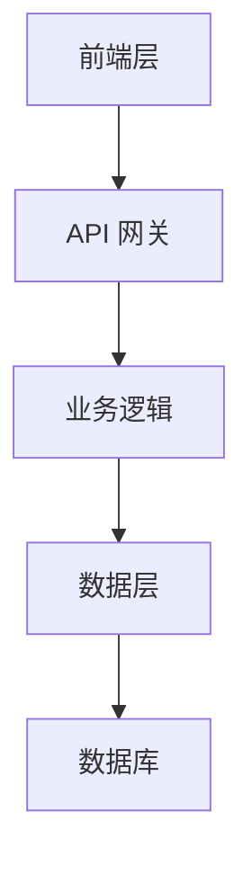
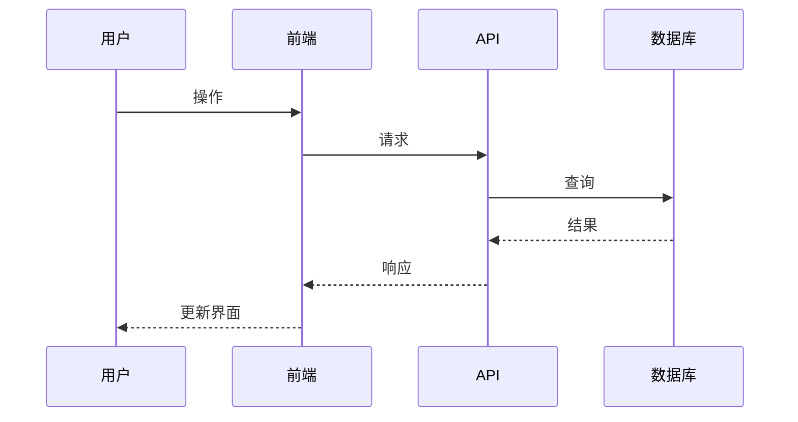
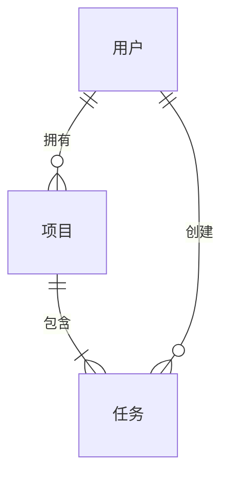

# 技术设计

为功能创建全面的技术设计：**$ARGUMENTS**

## 需求批准要求

**重要提示**：只有在需求审核并批准后才能生成设计。

- 需求文档：@.tasks/$ARGUMENTS/requirements.md
- 规范元数据：@.tasks/$ARGUMENTS/spec.json

**注意**：如果此命令使用 `-y` 标志调用，需求将自动批准（spec.json 更新为设置 requirements.approved=true）。否则，必须先通过 `/spec-task:requirements $ARGUMENTS` 批准需求，然后使用 `/spec-task:design $ARGUMENTS -y`。

## 上下文分析

### 需求基础

**重要提示**：设计必须建立在已批准的需求文档之上。

- **需求文档**：@.tasks/$ARGUMENTS/requirements.md
- **EARS 格式需求**：每个需求都有验收标准
- **用户故事映射**：设计组件必须针对特定的用户故事
- **约束和验收标准**：必须反映在技术决策中

**验证要求**：在继续之前确保 requirements.md 存在并已批准。

### 当前规范上下文

- 当前设计：@.tasks/$ARGUMENTS/design.md
- 规范元数据：@.tasks/$ARGUMENTS/spec.json

## 任务：创建技术设计

**先决条件已验证**：需求已批准并准备进入设计阶段。

### 研究与调查流程

**强制要求**：在设计过程中进行研究和调查：

1. **技术研究**
   - 研究技术栈的当前最佳实践
   - 调查安全考虑因素和最新标准
   - 审查性能基准和扩展方法
   - 检查与现有架构的集成模式

2. **构建上下文**
   - 在对话线程中构建研究上下文
   - 记录影响设计决策的关键发现
   - 引用来源并包含相关参考链接
   - 总结影响架构选择的洞察

3. **需求分析**
   - 将每个设计组件映射到特定的 EARS 需求
   - 确保所有用户故事都在技术设计中得到解决
   - 验证所提出的解决方案能够满足验收标准
   - 识别需求与技术可行性之间的任何差距

### 设计文档生成

生成包含研究发现的综合设计文档（使用 spec.json 中指定的语言）：

### 1. 设计文档结构

以 spec.json 中指定的语言创建 design.md（检查 `@.tasks/$ARGUMENTS/spec.json` 的"language"字段）：

````markdown
# 技术设计

## 概览

[实施方法的技术概述，引用 requirements.md 中的关键需求]

## 需求映射

### 设计组件可追溯性

每个设计组件都对应特定的需求：

- **[组件 1]** → X.X: [EARS 需求参考]
- **[组件 2]** → Y.Y: [EARS 需求参考]
- **[集成层]** → Z.Z: [EARS 需求参考]

### 用户故事覆盖

[确保 requirements.md 中的所有用户故事都得到解决]

- 用户故事 1：[设计如何解决此故事]
- 用户故事 2：[此故事的技术方法]

## 架构


````

### 技术栈

[基于研究发现和需求分析]

- **前端**：[React/Vue/Next.js] + [TypeScript]
- **后端**：[FastAPI/Express/Django] + [语言]
- **数据库**：[PostgreSQL/MySQL/MongoDB]
- **认证**：[JWT/OAuth/Auth0]
- **测试**：[Jest/pytest] + [Testing Library/Playwright]
- **部署**：[Docker/Vercel/AWS/GCP]

### 架构决策依据

[基于研究记录关键技术选择背后的原因]

- **为什么选择 [前端框架]**：[基于研究的理由]
- **为什么选择 [后端技术]**：[性能、可扩展性、团队专业知识考虑]
- **为什么选择 [数据库]**：[数据模型需求、一致性需求、扩展模式]
- **为什么选择 [认证方法]**：[安全需求、集成能力、用户体验]

### 界面过渡（如适用）

[使用图表展示主要导航和状态转换]

### 数据流

[描述数据如何在系统中流动]

#### 主要用户流程

包含前 1-3 个用户流程的序列图：



## 组件和接口

生成全面的组件分解。

### 后端服务和方法签名

对于需求中识别的每个服务，列出带有简洁文档字符串的公共方法。示例（Python）：

```python
class InvoiceService:
    def create_invoice(self, data: InvoiceData) -> Invoice:  # 创建并持久化
    def send_invoice(self, invoice_id: str) -> None          # 邮件/发送
```

### 前端组件

提供表格：组件名称 │ 职责 │ Props/状态摘要

### API 端点

提供详细的 API 端点表：

| 方法   | 路由            | 目的     | 认证 | 状态码                  |
| ------ | --------------- | -------- | ---- | ----------------------- |
| GET    | /api/[资源]     | 列出资源 | 需要 | 200, 401, 500           |
| POST   | /api/[资源]     | 创建资源 | 需要 | 201, 400, 401, 500      |
| PUT    | /api/[资源]/:id | 更新资源 | 需要 | 200, 400, 401, 404, 500 |
| DELETE | /api/[资源]/:id | 删除资源 | 需要 | 204, 401, 404, 500      |

## 数据模型

### 领域实体

1. **[实体1]**：[简要描述]
2. **[实体2]**：[简要描述]
3. **[实体3]**：[简要描述]

### 实体关系



### 数据模型定义

提供特定语言的模型（TypeScript 接口和/或 Python 数据类）：

```typescript
interface [模型名称] {
  id: string;
  // 根据需求添加相关字段
  createdAt: Date;
  updatedAt: Date;
}
```

```python
@dataclass
class [模型名称]:
    id: str
    # 根据需求添加相关字段
    created_at: datetime
    updated_at: datetime
```

### 数据库模式

[SQL 模式或 NoSQL 文档结构]

如果使用关系型（SQL）数据库，包含最小的模式片段作为起点：

```sql
CREATE TABLE users (
  id VARCHAR(36) PRIMARY KEY,
  email VARCHAR(255) NOT NULL UNIQUE,
  created_at TIMESTAMP NOT NULL DEFAULT CURRENT_TIMESTAMP,
  updated_at TIMESTAMP NULL
);
```

- 根据需要添加外键和其他约束/索引。

### 迁移策略（如适用）

- 模式更改的迁移方法
- 向后兼容性考虑
- 数据转换需求
- 性能索引策略

## 错误处理

[全面的错误处理策略]

## 安全考虑（如适用）

[安全考虑简述]

- 实施基于 JWT 的认证，包括基于角色的授权和输入验证
- 应用 OWASP 安全实践，包括速率限制、CORS 和数据加密

## 性能与可扩展性（如适用）

### 性能目标

| 指标             | 目标           | 测量     |
| ---------------- | -------------- | -------- |
| 响应时间 (p95)   | < 200ms        | API 端点 |
| 响应时间 (p99)   | < 500ms        | API 端点 |
| 吞吐量           | > 1000 req/sec | 负载测试 |
| 数据库查询 (p99) | < 50ms         | 查询监控 |
| 并发用户         | > 10,000       | 系统容量 |

### 缓存策略

- **浏览器缓存**：静态资源、API 响应
- **CDN**：媒体文件、静态内容
- **应用缓存**：Redis/Memcached 用于会话数据
- **数据库缓存**：查询结果缓存

### 可扩展性方法

- 应用服务器的水平扩展
- 数据库读副本
- 异步处理的后台作业队列
- 基于负载指标的自动扩展

## 测试策略

- 目的/范围：[质量风险降低 / 回归预防 / 客观验收]
- 使用：仅保留适用的行；删除其他行（不要标记 N/A）

### 风险矩阵

| 区域         | 风险       | 必须            | 可选      | 参考         |
| ------------ | ---------- | --------------- | --------- | ------------ |
| 认证/授权    | [高/中/低] | 单元、契约、E2E | 安全      | [X.X]        |
| 外部 API     | [高/中/低] | 契约、集成      | 弹性      | [X.X]        |
| 数据完整性   | [高/中/低] | 单元、属性      | 集成      | [X.X]        |
| 关键 UX 流程 | [高/中/低] | E2E (≤3)        | 可访问性  | [X.X]        |
| 性能         | [高/中/低] | 性能冒烟测试    | 负载/压力 | [SLO/性能表] |

### 按层最小化

- 单元：核心业务逻辑的边界/异常情况
- 契约（API）：提供者/消费者契约固定
- 集成：数据库/外部依赖集成
- E2E（≤3）：主要用户流程，正常 + 边缘

### CI 门控

| 阶段         | 运行        | 门控        | SLA |
| ------------ | ----------- | ----------- | --- |
| PR           | 单元 + 契约 | 失败 = 阻止 | ≤Xm |
| 暂存         | 集成 + E2E  | 失败 = 阻止 | ≤Ym |
| 夜间（如果） | 性能/弹性   | 回归 → 问题 | -   |

### 退出标准

- Sev1/Sev2 = 0
- 所有门控通过
- 满足非功能目标（例外需要记录批准）

````

### 2. 文档生成
仅生成设计文档内容。不要在实际文档文件中包含任何审查或批准说明。

### 3. 更新元数据
更新 spec.json：
```json
{
  "phase": "design-generated",
  "approvals": {
    "requirements": {
      "generated": true,
      "approved": true
    },
    "design": {
      "generated": true,
      "approved": false
    }
  },
  "updated_at": "current_timestamp"
}
````

---

## 交互式批准实施（不包含在文档中）

以下内容仅用于 Claude Code 对话 - 不用于生成的文档：

### 交互式批准流程

## 下一阶段：交互式批准

生成 design.md 后，审查设计并选择：

**如果设计看起来不错：**
运行 `/spec-task:tasks $ARGUMENTS -y` 继续进入任务阶段

**如果设计需要修改：**
请求更改，然后在修改后重新运行此命令

`-y` 标志自动批准设计并直接生成任务，在保持审查强制的同时简化工作流程。

### 审查清单（供用户参考）：

- [ ] 技术设计全面清晰
- [ ] 架构与现有系统一致
- [ ] 技术选择适当
- [ ] 组件和接口定义良好
- [ ] 数据模型定义良好
- [ ] 错误处理定义良好
- [ ] 测试策略定义良好

## 说明

1. **验证需求基础** - 确保 requirements.md 存在并已批准
2. **检查 spec.json 中的语言** - 使用元数据中指定的语言
3. **进行全面研究**：
   - 研究技术最佳实践和最新标准
   - 调查安全、性能和集成考虑因素
   - 通过对话线程中的研究发现构建上下文
   - 记录影响设计决策的来源和关键洞察
4. **彻底分析需求**：
   - 将每个设计组件映射到特定的 EARS 需求
   - 确保所有用户故事都在技术设计中得到解决
   - 验证所提出的解决方案能够满足验收标准
5. **遵循指导上下文中的现有架构模式**
6. **按逻辑顺序构建文档**：
   - 概览 → 研究与上下文 → 需求映射 → 架构 → 组件和接口 → 数据模型 → 错误处理 → 测试策略
7. **创建详细的组件设计**，包含清晰的接口和 API 规范
8. **包含全面的图表**，使用 mermaid 展示架构、界面过渡、数据流和 ER 图
9. **记录设计依据** - 解释关键技术决策背后的原因
10. **定义具体的性能目标**和测试策略
11. **完成后更新跟踪元数据**

生成的设计应为实施阶段提供清晰的蓝图，适当考虑可扩展性、安全性和可维护性，所有这些都基于全面的研究和明确的需求可追溯性。ultrathink
