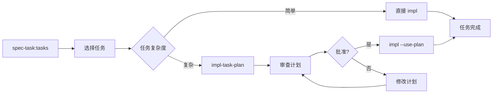

# 任务级实施计划

为特定任务生成详细的实施计划：**$ARGUMENTS**

## 说明

此命令为单个任务生成详细的实施计划，包括：

- 具体的实施步骤分解
- TDD测试策略
- 需要调用的API和方法
- 潜在的技术难点
- 验收标准

## 参数解析

- **feature-name**: 功能名称
- **task-number**: 任务编号（如 1.1, 2.3）

## 先决条件验证

### 必需文件检查

功能名称：!`echo "$ARGUMENTS" | awk '{print $1}' | head -1`
任务编号：!`echo "$ARGUMENTS" | awk '{print $2}' | head -1`

- 任务文档：!`ls -la .tasks/$FEATURE/tasks.md 2>/dev/null || echo "Tasks not found - run spec-task:tasks first"`
- 低层设计：!`ls -la .tasks/$FEATURE/lld/ 2>/dev/null || echo "LLD directory not found"`
- 规范元数据：!`cat .tasks/$FEATURE/spec.json 2>/dev/null | grep "tasks_approved" || echo "Tasks not approved"`

## 任务：生成单任务实施计划

### 1. 加载上下文

从以下文件加载相关信息：

- `.tasks/{feature-name}/requirements.md` - 相关需求
- `.tasks/$ARGUMENTS/design-hld.md` - 高层设计
- `.tasks/{feature-name}/lld/` - 详细设计文档集
- `.tasks/{feature-name}/tasks.md` - 提取特定任务描述
- `.tasks/$ARGUMENTS/adr/` - adr 决策

### 2. 任务分析

#### 2.1 提取任务信息

从 tasks.md 中找到指定编号的任务：

- 任务描述
- 关联的需求编号
- 依赖的前置任务

#### 2.2 技术依赖分析

识别该任务需要的：

- 具体的库和框架
- API接口和方法
- 数据模型
- 配置要求

### 3. 生成任务计划文档

创建 `.tasks/{feature-name}/task-plans/{task-number}.md`：

````markdown
# 任务 {task-number} 实施计划

生成时间：{timestamp} 任务描述：{task-description} 关联需求：{requirements} 预计工时：{estimated-hours}

## 执行概要

### 目标

{明确的任务目标}

### 范围

- **包含**：{具体要实现的功能}
- **不包含**：{明确不在此任务范围内的内容}

### 前置条件

- {需要完成的前置任务}
- {需要的环境或配置}

## 技术准备

### 需要的API/库

| 库/模块 | 方法/类  | 用途    | 文档链接 |
| ------- | -------- | ------- | -------- |
| {lib}   | {method} | {usage} | {docs}   |

### 代码位置

- **需要创建的文件**：
  - `{file-path}` - {purpose}
- **需要修改的文件**：
  - `{file-path}` - {changes}

## TDD实施步骤

### 步骤1：{步骤名称}

**测试先行（RED）**：

```{language}
// 测试文件：{test-file}
test('{test-description}', () => {
  // 准备
  {setup-code}

  // 执行
  {action-code}

  // 断言
  {assertion-code}
})
```
````

**最小实现（GREEN）**：

```{language}
// 实现文件：{impl-file}
{minimal-implementation}
```

**重构优化（REFACTOR）**：

- {refactor-point-1}
- {refactor-point-2}

### 步骤2：{步骤名称}

[继续其他步骤...]

## 边界情况处理

### 错误场景

1. **{error-scenario}**
   - 触发条件：{condition}
   - 处理方式：{handling}
   - 测试用例：{test-case}

### 性能考虑

- {performance-consideration}

## 验收标准

### 功能验收

- [ ] {functional-criterion-1}
- [ ] {functional-criterion-2}

### 技术验收

- [ ] 所有测试通过
- [ ] 代码覆盖率 > 80%
- [ ] 无 linting 错误
- [ ] 代码复杂度符合标准

### 集成验收

- [ ] 与前置任务输出正确对接
- [ ] 为后续任务提供必要接口

## 风险与缓解

| 风险   | 概率          | 影响     | 缓解措施     |
| ------ | ------------- | -------- | ------------ |
| {risk} | {probability} | {impact} | {mitigation} |

## 实施检查清单

### 开始前

- [ ] 确认所有前置任务完成
- [ ] 确认开发环境配置正确
- [ ] 理解任务需求和设计

### 实施中

- [ ] 遵循TDD流程
- [ ] 每个步骤后运行测试
- [ ] 及时提交代码

### 完成后

- [ ] 运行完整测试套件
- [ ] 代码审查（code-review-expert）
- [ ] 代码简化（code-simplifier）
- [ ] 更新任务状态

## 时间估算

| 阶段      | 预计时间 |
| --------- | -------- |
| 技术准备  | 15分钟   |
| 步骤1实施 | {time}   |
| 步骤2实施 | {time}   |
| 测试完善  | 30分钟   |
| 代码优化  | 20分钟   |
| **总计**  | {total}  |

## 审批状态

- [ ] 计划已审阅
- [ ] 技术方案已确认
- [ ] 准备开始实施

---

_此文档由 spec-task:impl-task-plan 生成，作为单任务实施的详细指导_

````

### 4. 更新元数据

在 spec.json 中添加任务计划状态：

```json
{
  "task_plans": {
    "{task-number}": {
      "planned": true,
      "approved": false,
      "planned_at": "{timestamp}"
    }
  }
}
````

### 5. 输出摘要

```
✅ 任务计划已生成

📊 计划概要：
- 任务编号：{task-number}
- 实施步骤：{n} 个
- 预计工时：{hours} 小时
- 测试用例：{m} 个
- 风险点：{r} 个

📁 生成的文件：
- task-plans/{task-number}.md

🎯 下一步：
1. 审查计划：查看生成的详细计划
2. 如需调整：编辑计划文件
3. 批准执行：/spec-task:impl {feature} {task-number} --use-plan

💡 提示：
- 计划通过审核后，impl 命令会自动使用此计划
- 可以并行规划多个任务
- 复杂任务建议先做计划再实施
```

## 与 impl 命令的集成

修改 impl.md，增加对任务计划的支持：

```bash
# 如果存在已批准的任务计划
if [ -f ".tasks/{feature}/task-plans/{task-number}.md" ]; then
  # 加载任务计划作为实施指导
  # 按计划的步骤执行
fi
```

## 使用流程



## 最佳实践

1. **简单任务**（< 1小时）：直接使用 impl
2. **中等任务**（1-3小时）：可选使用 impl-task-plan
3. **复杂任务**（> 3小时）：强烈建议先 impl-task-plan
4. **高风险任务**：必须先 impl-task-plan

## 优势

- **精确控制**：每个任务都有详细的实施步骤
- **降低风险**：实施前可以审查和调整方案
- **提高效率**：避免实施时的试错和返工
- **知识沉淀**：任务计划可作为团队知识库
- **灵活使用**：可选择性地对复杂任务使用
