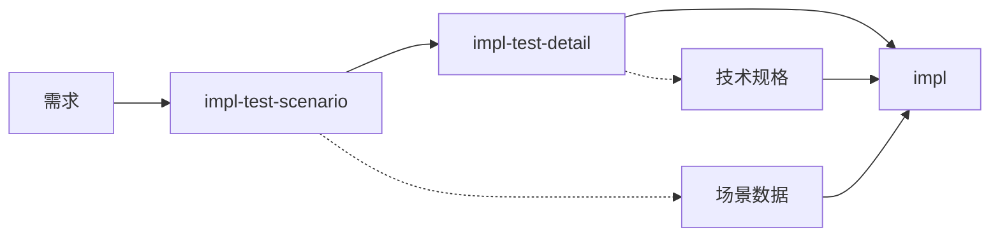

# TDD 测试细节生成

基于需求与测试场景，补齐被测对象与断言细节：**$ARGUMENTS**

## 说明

此命令在已有「需求 + 测试场景」的基础上，确定被测对象（SUT）、核心方法、入参与返回、验证方式等测试细节，为 impl 命令的最终实现提供明确的技术规格。

## 参数解析

- **feature-name**：功能名称
- **--task <id>**：可选，指定任务编号（如 1.1）
- **-y**：可选，自动批准生成的测试细节

## 先决条件验证

功能名称：!`echo "$ARGUMENTS" | awk '{print $1}' | head -1`

- 需求文档：!`ls -la .tasks/$FEATURE/requirements.md 2>/dev/null || echo "Requirements not found"`
- 测试场景：!`ls -la .tasks/$FEATURE/task-plans/test-scenarios*.md 2>/dev/null || echo "Test scenarios not found - run impl-test-scenario first"`

## 任务：生成测试细节

### 1. 加载上下文

从以下文件加载信息：
- `.tasks/{feature-name}/requirements.md` - 功能需求
- `.tasks/{feature-name}/design-lld.md` - 技术设计（如存在）
- `.tasks/{feature-name}/task-plans/test-scenarios*.md` - 测试场景

### 2. 分析测试需求

#### 2.1 识别被测系统
- 核心类/模块名称
- 主要职责
- 依赖关系

#### 2.2 确定接口规格
- 方法签名
- 参数类型
- 返回值类型
- 异常类型

### 3. 生成测试细节文档

创建 `.tasks/{feature-name}/task-plans/test-details-{task-number}.md`：

```markdown
# 任务 {task-number} 测试细节

生成时间：{timestamp}
任务描述：{task-description}
关联场景：test-scenarios-{task-number}.md

## 被测对象（SUT）

- **被测试的类叫** `{ClassName}`。它的构造函数接受 `{dependency1}, {dependency2}` 作为依赖；
- **{ClassName}** 的 `{methodName}` 方法返回 `{ReturnType}` 作为结果，接受 `{paramType} {paramName}` 作为参数；
- **验证时**，通过 `{validationMethod}`，完成验证

## 详细规格

### 类定义
```{language}
class {ClassName} {
    constructor({dependencies}) { }
    
    {methodName}({parameters}): {returnType} { }
}
```

### 依赖注入
| 依赖名称 | 类型 | 用途 | Mock策略 |
|---------|------|------|----------|
| {depName} | {depType} | {purpose} | {mockStrategy} |

### 方法规格

#### {methodName}
- **参数**：
  - `{paramName}: {paramType}` - {description}
- **返回值**：`{returnType}` - {description}
- **异常**：
  - `{ExceptionType}` - {when thrown}

## 测试实现模板

### 测试结构
```{language}
describe('{ClassName}', () => {
    let sut: {ClassName};
    let {mockDep1}: Mock<{DepType1}>;
    
    beforeEach(() => {
        {mockDep1} = createMock<{DepType1}>();
        sut = new {ClassName}({mockDep1});
    });
    
    describe('{methodName}', () => {
        // Test cases here
    });
});
```

### 场景到测试的映射

#### 场景1：{scenario-name}
```{language}
test('{test-description}', () => {
    // Arrange
    const input = {test-data};
    const expected = {expected-result};
    
    // Act
    const result = sut.{methodName}(input);
    
    // Assert
    expect(result).{assertion-method}(expected);
});
```

## 断言策略

### 基本断言
- **相等性**：`expect(result).toEqual(expected)`
- **真值性**：`expect(result).toBeTruthy()`
- **包含性**：`expect(result).toContain(value)`

### 复杂对象断言
- **部分匹配**：`expect(result).toMatchObject(partial)`
- **数组长度**：`expect(result).toHaveLength(n)`
- **属性存在**：`expect(result).toHaveProperty(key, value)`

### Mock验证
- **调用次数**：`expect(mock).toHaveBeenCalledTimes(n)`
- **调用参数**：`expect(mock).toHaveBeenCalledWith(args)`

## 测试数据工厂

### 有效数据生成
```{language}
function createValid{DataType}(): {DataType} {
    return {
        {field1}: {value1},
        {field2}: {value2}
    };
}
```

### 无效数据生成
```{language}
function createInvalid{DataType}(): {DataType} {
    return {
        {field1}: {invalidValue}
    };
}
```

## 验证清单

- [ ] 所有场景都有对应的测试细节
- [ ] SUT 的构造函数参数明确
- [ ] 核心方法签名完整
- [ ] 断言方式具体可执行
- [ ] Mock 策略清晰

---
*此文档由 spec-task:impl-test-detail 生成，作为测试实现的技术规格*
```

### 4. 具体示例生成

#### 示例：命令行解析器

```markdown
## 被测对象（SUT）

- **被测试的类叫** `ArgumentParser`。它的构造函数接受 `Map<string, ArgConfig>` 作为参数配置；
- **ArgumentParser** 的 `parse` 方法返回 `Map<string, any>` 作为解析结果，接受 `string[] args` 作为参数；
- **验证时**，通过从 `Map` 中获取对应参数值，完成验证

## 详细规格

### 类定义
```typescript
class ArgumentParser {
    constructor(config: Map<string, ArgConfig>) { }
    
    parse(args: string[]): Map<string, any> { }
}
```

### 测试实现模板
```typescript
test('布尔标志测试', () => {
    // Arrange
    const config = new Map([['l', { type: 'boolean' }]]);
    const parser = new ArgumentParser(config);
    
    // Act
    const result = parser.parse(['-l', '-p', '8080']);
    
    // Assert
    expect(result.get('l')).toBe(true);
});
```
```

#### 示例：用户认证

```markdown
## 被测对象（SUT）

- **被测试的类叫** `AuthService`。它的构造函数接受 `UserRepository, PasswordHasher, TokenGenerator` 作为依赖；
- **AuthService** 的 `login` 方法返回 `AuthResult` 作为结果，接受 `LoginCredentials` 作为参数；
- **验证时**，通过检查 `AuthResult.token` 存在性和 `AuthResult.user` 属性，完成验证

## 详细规格

### 类定义
```typescript
class AuthService {
    constructor(
        private userRepo: UserRepository,
        private hasher: PasswordHasher,
        private tokenGen: TokenGenerator
    ) { }
    
    async login(credentials: LoginCredentials): Promise<AuthResult> { }
}
```

### 测试实现模板
```typescript
test('成功登录测试', async () => {
    // Arrange
    const credentials = { email: 'john@example.com', password: 'ValidPass123' };
    const user = { id: 1, email: 'john@example.com', passwordHash: 'hash123' };
    const token = 'jwt.token.here';
    
    mockUserRepo.findByEmail.mockResolvedValue(user);
    mockHasher.verify.mockReturnValue(true);
    mockTokenGen.generate.mockReturnValue(token);
    
    // Act
    const result = await sut.login(credentials);
    
    // Assert
    expect(result.token).toBe(token);
    expect(result.user.email).toBe(user.email);
});
```
```

### 5. 更新元数据

在 spec.json 中记录：

```json
{
  "test_details": {
    "{task-number}": {
      "generated": true,
      "approved": false,
      "generated_at": "{timestamp}",
      "sut_class": "{ClassName}",
      "core_methods": ["{methodName}"]
    }
  }
}
```

### 6. 输出摘要

```
✅ 测试细节已生成

📊 细节统计：
- 任务编号：{task-number}
- 被测类：{ClassName}
- 核心方法：{n} 个
- 依赖项：{m} 个
- 测试场景：{s} 个

📁 生成的文件：
- task-plans/test-details-{task-number}.md

🎯 下一步：
1. 审查细节：确认技术规格正确
2. 调整细节：必要时编辑文档
3. 开始实施：/spec-task:impl {feature} {task-number}

💡 提示：
- impl 命令会使用这些细节生成测试代码
- 确保方法签名与设计文档一致
- Mock 策略应与项目测试框架匹配
```

## 与其他命令的协作

### 执行顺序



### impl 命令集成

impl 命令执行时的优先级：

1. 检查 `test-details-{task-number}.md` - 使用技术规格
2. 检查 `test-scenarios-{task-number}.md` - 使用测试场景
3. 如果都存在，结合使用：
   - 场景提供测试数据
   - 细节提供实现规格

## 使用流程

```bash
# 1. 生成测试场景
/spec-task:impl-test-scenario user-auth --task 1.1

# 2. 生成测试细节
/spec-task:impl-test-detail user-auth --task 1.1

# 3. 审查并调整
cat .tasks/user-auth/task-plans/test-details-1.1.md

# 4. 实施
/spec-task:impl user-auth 1.1
```

## 最佳实践

### 何时使用

- **新API设计**：明确接口契约
- **复杂逻辑**：确定测试边界
- **团队协作**：统一测试规格
- **重构前**：锁定行为规格

### 细节粒度

- **刚好够用**：不要过度设计
- **聚焦核心**：关注主要路径
- **保持灵活**：允许实现调整
- **版本演进**：随需求更新

### 质量标准

- 每个场景都有对应的测试方法
- SUT 定义清晰完整
- 依赖关系明确
- 断言策略具体可执行

## 注意事项

1. **依赖真实设计**：细节应与 design-lld.md 一致
2. **框架适配**：使用项目实际的测试框架语法
3. **Mock策略统一**：遵循项目的 Mock 约定
4. **命名规范**：遵循项目的命名约定