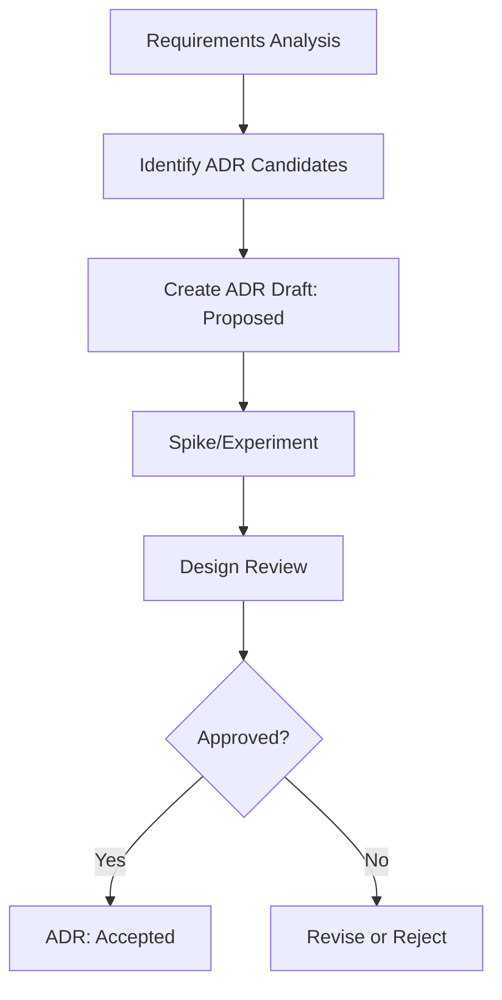

# 规范初始化

基于提供的项目描述初始化新规范：

**项目描述**: `$ARGUMENTS`

## 任务：初始化规范结构

**范围**：此命令基于提供的详细项目描述初始化目录结构和元数据。

### 1. 生成功能名称

从项目描述（`$ARGUMENTS`）创建一个简洁、描述性的功能名称。

**检查现有的 `.tasks/` 目录以确保生成的功能名称是唯一的。如果存在冲突，添加数字后缀（例如：feature-name-2）。**

### 2. 创建规范目录

创建 `.tasks/{generated-feature-name}/` 目录，包含模板文件和子目录：

**文件**：
- `prd.md` - 产品需求文档的空模板
- `requirements.md` - 系统需求的空模板
- `design-hld.md` - 高层设计的空模板
- `design-lld.md` - 低层设计的空模板
- `tasks.md` - 实施任务的空模板
- `spec.json` - 元数据和审批追踪

**子目录**：
- `adr/` - 架构决策记录目录
  - `README.md` - ADR 索引和说明
  - `templates/` - ADR 模板目录
    - `adr-template.md` - ADR 通用模板

### 3. 初始化 spec.json 元数据

创建包含审批追踪的初始元数据：

```json
{
  "feature_name": "{generated-feature-name}",
  "created_at": "current_timestamp",
  "updated_at": "current_timestamp",
  "language": "chinese",
  "phase": "initialized",
  "documents": {
    "prd": {
      "generated": false,
      "approved": false,
      "story_count": 0
    }
  },
  "approvals": {
    "requirements": {
      "generated": false,
      "approved": false
    },
    "hld": {
      "generated": false,
      "approved": false
    },
    "lld": {
      "generated": false,
      "approved": false
    },
    "tasks": {
      "generated": false,
      "approved": false
    }
  },
  "adr": {
    "total_count": 0,
    "proposed": 0,
    "accepted": 0,
    "superseded": 0,
    "candidates": []
  },
  "ready_for_implementation": false
}
```

### 4. 创建包含项目上下文的模板文件

#### prd.md（模板）

```markdown
# Product Requirements Document (PRD)

## Project Description (User Input)

$ARGUMENTS

## Content

<!-- PRD 内容将在 /spec-task:prd 阶段生成 -->
<!-- 将包含：背景与机会、目标与非目标、用户故事、里程碑等 -->
```

#### requirements.md（模板）

```markdown
# Requirements Document

## Overview

<!-- 系统需求将在 /spec-task:requirements 阶段生成 -->
<!-- 将基于 PRD 的用户故事推导出 FR/NFR -->

## Project Description (User Input)

$ARGUMENTS

## Requirements

<!-- 详细的 EARS 格式需求将在 /spec-task:requirements 阶段生成 -->
```

#### design-hld.md（空模板）

```markdown
# High-Level Design Document

## Overview

<!-- 高层设计将在需求审批后生成 -->
```

#### design-lld.md（空模板）

```markdown
# Low-Level Design Document

## Overview

<!-- 低层设计将在HLD审批后生成 -->
```

#### tasks.md（空模板）

```markdown
# Implementation Plan

<!-- 实施任务将在设计审批后生成 -->
```

#### adr/README.md（ADR 索引模板）

```markdown
# Architecture Decision Records

## Overview
本目录包含 {feature-name} 功能的所有架构决策记录（ADR）。

## Status Definition
- **Proposed**: 提议中，待评审
- **Accepted**: 已接受，指导实施
- **Rejected**: 已拒绝
- **Superseded**: 已被替代
- **Deprecated**: 已废弃

## ADR Index

| ID | Title | Status | Date | Related Requirements |
|----|-------|--------|------|---------------------|
| <!-- ADR 将在 /spec-task:adr-draft 阶段生成 --> |

## Decision Flow


## Related Documents
- [PRD](../prd.md)
- [Requirements](../requirements.md)
- [High-Level Design](../design-hld.md)
- [Low-Level Design](../design-lld.md)
```

#### adr/templates/adr-template.md（ADR 模板）

```markdown
---
id: ADR-YYYYMMDD-short-title
title: [Full Title]
status: Proposed
date: YYYY-MM-DD
decision_makers: []
related_requirements: []
related_stories: []
supersedes: []
superseded_by: null
tags: []
---

# [Title]

## Status
Proposed

## Context
[描述需要做决策的背景、约束条件、目标]

## Decision Drivers
[列出影响决策的关键因素]

## Considered Options
[列出考虑过的选项及其优缺点]

## Decision
[描述最终决策]

## Consequences
[描述决策的影响，包括正面和负面]

## Implementation Plan
[描述实施计划]

## Validation
[描述如何验证决策的有效性]
```

### 5. 更新 CLAUDE.md 引用

将新规范添加到活动规范列表中，包含生成的功能名称和简要描述。

## 初始化后的下一步

遵循规范驱动的开发工作流：

1. `/spec-task:prd {feature-name}` - 生成产品需求文档
2. `/spec-task:requirements {feature-name}` - 生成系统需求（基于 PRD）
3. `/spec-task:adr-draft {feature-name}` - 识别架构决策点并生成 ADR 草稿
4. `/spec-task:adr-review {feature-name}` - 评审 ADR 并做出决策
5. `/spec-task:design-hld {feature-name}` - 生成高层设计（与已接受的 ADR 对齐）
6. `/spec-task:design-lld {feature-name}` - 生成低层设计（基于 HLD）
7. `/spec-task:tasks {feature-name}` - 生成任务（交互式审批）

## 输出格式

初始化后，提供：

1. 生成的功能名称及其理由
2. 简要的项目摘要
3. 创建的文件路径
4. 下一条命令：`/spec-task:prd {feature-name}`

---

## 工作流程图示

```
初始化 → PRD生成 → 需求生成 → ADR草稿 → ADR评审 → HLD生成 → LLD生成 → 任务生成 → 实施准备
          ↓          ↓          ↓         ↓          ↓         ↓          ↓
       [审批]      [审批]    [识别]    [决策]     [审批]     [审批]     [审批]
```

## 注意事项

- **唯一性检查**：确保功能名称在系统中是唯一的
- **模板结构**：所有模板文件都遵循标准化格式
- **审批流程**：每个阶段都需要明确的审批才能继续
- **元数据追踪**：`spec.json` 文件追踪整个生命周期的状态

---

## 规范生命周期

### 阶段 1：初始化（Initialization）

- 创建目录结构
- 生成模板文件
- 初始化元数据

### 阶段 2：产品需求（Product Requirements）

- 生成用户故事
- 定义业务目标
- 明确范围边界

### 阶段 3：系统需求（System Requirements）

- 基于 PRD 推导 FR/NFR
- 定义验收标准（EARS 格式）
- 建立追踪矩阵

### 阶段 4：架构决策（Architecture Decisions）

- 识别架构重要需求（ASR）
- 生成 ADR 草稿
- 分析技术选项
- 评估与现有架构的对齐

### 阶段 5：高层设计（High-Level Design）

- 系统架构设计（与 ADR 对齐）
- 容器和组件划分
- 系统边界定义
- 容量规划

### 阶段 6：低层设计（Low-Level Design）

- 详细组件设计
- 接口签名定义
- 数据结构设计
- 异常处理策略

### 阶段 7：任务分解（Task Breakdown）

- 实施计划
- 任务优先级
- 依赖关系
- 工作量估算

### 阶段 8：实施就绪（Ready for Implementation）

- 所有文档已审批
- 任务已分配
- 开发环境准备完成

---

## 命令示例

### 初始化新规范

```bash
/spec-task:init "创建一个用户管理系统，支持注册、登录和权限管理"
```

### 生成产品需求文档

```bash
/spec-task:prd user-management
```

### 生成系统需求文档

```bash
/spec-task:requirements user-management
```

### 生成 ADR 草稿

```bash
/spec-task:adr-draft user-management
```

### 生成高层设计

```bash
/spec-task:design-hld user-management -y
```

### 生成低层设计

```bash
/spec-task:design-lld user-management -y
```

### 生成实施任务

```bash
/spec-task:tasks user-management -y
```

---

## 文件结构示例

```
.
└── .tasks/
    └── user-management/
        ├── prd.md           # 产品需求文档
        ├── requirements.md  # 系统需求文档
        ├── design-hld.md    # 高层设计文档
        ├── design-lld.md    # 低层设计文档
        ├── tasks.md         # 任务计划
        ├── spec.json        # 元数据和状态追踪
        └── adr/             # 架构决策记录
            ├── README.md    # ADR 索引
            ├── templates/   # ADR 模板
            └── *.md         # 具体的 ADR 文件
```

---

## 最佳实践

1. **清晰的功能命名**
   - 使用描述性名称
   - 避免使用特殊字符
   - 保持简洁明了

2. **渐进式审批**
   - 每个阶段完成后进行审批
   - 确保前置条件满足
   - 记录审批决策

3. **文档维护**
   - 保持文档同步更新
   - 记录变更历史
   - 维护版本控制

4. **团队协作**
   - 明确责任分工
   - 定期评审进度
   - 及时沟通问题

---

## 常见问题（FAQ）

### Q: 如何处理功能名称冲突？

A: 系统会自动检测冲突并添加数字后缀（如 feature-name-2）。

### Q: 可以修改已生成的文档吗？

A: 可以，但建议在相应的审批阶段之前完成修改。

### Q: 如何撤销初始化？

A: 可以手动删除 `.tasks/{feature-name}/` 目录。

### Q: 支持哪些语言？

A: 默认支持中文（Chinese），可以在 spec.json 中修改。
