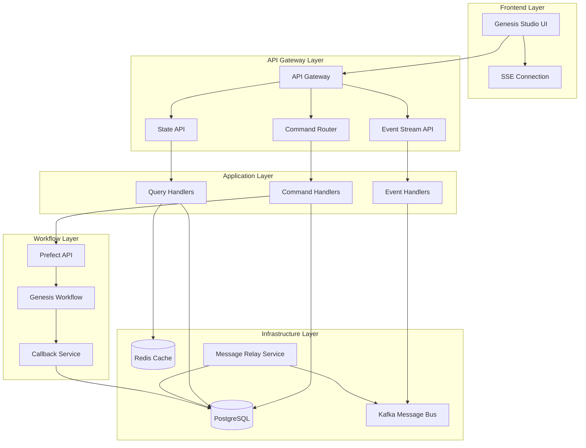

# Design Document

## Overview

The AI-Driven Genesis Studio is a sophisticated event-driven system that orchestrates novel creation workflows through AI assistance and user supervision. The system implements a Command Query Responsibility Segregation (CQRS) pattern with event sourcing, utilizing Prefect for workflow orchestration and providing real-time user interaction through Server-Sent Events (SSE).

The architecture supports dual-entry modes (guided and free-form), maintains session state persistence, and ensures reliable event processing through transactional outbox patterns. The system is designed to handle interruptions gracefully while providing a seamless user experience.

## Architecture

### High-Level Architecture



### Event-Driven Architecture

The system follows an event-driven architecture with the following key patterns:

1. **Command Pattern**: All user actions are converted to commands
2. **Event Sourcing**: All state changes are captured as domain events
3. **Transactional Outbox**: Ensures reliable event publishing
4. **Saga Pattern**: Manages complex workflows across multiple services

## Components and Interfaces

### 1. Database Schema

#### Core Tables

**domain_events**
```sql
CREATE TABLE domain_events (
    id BIGSERIAL PRIMARY KEY,
    event_id UUID UNIQUE NOT NULL,
    correlation_id UUID,
    causation_id UUID,
    event_type TEXT NOT NULL,
    event_version INTEGER NOT NULL DEFAULT 1,
    aggregate_type TEXT NOT NULL,
    aggregate_id TEXT NOT NULL,
    payload JSONB,
    metadata JSONB,
    created_at TIMESTAMPTZ NOT NULL DEFAULT NOW()
);
```

**command_inbox**
```sql
CREATE TABLE command_inbox (
    id UUID PRIMARY KEY DEFAULT gen_random_uuid(),
    session_id UUID NOT NULL,
    command_type TEXT NOT NULL,
    command_payload JSONB NOT NULL,
    status TEXT NOT NULL DEFAULT 'RECEIVED',
    correlation_id UUID,
    received_at TIMESTAMPTZ NOT NULL DEFAULT NOW(),
    processed_at TIMESTAMPTZ,
    error_details JSONB,
    CONSTRAINT unique_active_command UNIQUE (session_id, command_type) 
        WHERE status IN ('RECEIVED', 'PROCESSING')
);
```

**event_outbox**
```sql
CREATE TABLE event_outbox (
    id UUID PRIMARY KEY DEFAULT gen_random_uuid(),
    event_id UUID NOT NULL,
    topic TEXT NOT NULL,
    partition_key TEXT,
    payload JSONB NOT NULL,
    headers JSONB,
    status TEXT NOT NULL DEFAULT 'PENDING',
    created_at TIMESTAMPTZ NOT NULL DEFAULT NOW(),
    published_at TIMESTAMPTZ,
    retry_count INTEGER NOT NULL DEFAULT 0,
    max_retries INTEGER NOT NULL DEFAULT 3,
    next_retry_at TIMESTAMPTZ
);
```

**flow_resume_handles**
```sql
CREATE TABLE flow_resume_handles (
    id UUID PRIMARY KEY DEFAULT gen_random_uuid(),
    correlation_id UUID NOT NULL,
    flow_run_id UUID NOT NULL,
    task_run_id UUID NOT NULL,
    status TEXT NOT NULL DEFAULT 'PENDING_PAUSE',
    resume_payload JSONB,
    created_at TIMESTAMPTZ NOT NULL DEFAULT NOW(),
    paused_at TIMESTAMPTZ,
    resumed_at TIMESTAMPTZ,
    expires_at TIMESTAMPTZ,
    CONSTRAINT unique_waiting_correlation UNIQUE (correlation_id) 
        WHERE status = 'WAITING'
);
```

**genesis_sessions**
```sql
CREATE TABLE genesis_sessions (
    id UUID PRIMARY KEY DEFAULT gen_random_uuid(),
    user_id UUID,
    novel_id UUID REFERENCES novels(id) ON DELETE SET NULL,
    status TEXT NOT NULL DEFAULT 'IN_PROGRESS',
    current_stage TEXT NOT NULL DEFAULT 'CONCEPT_SELECTION',
    confirmed_data JSONB,
    session_metadata JSONB,
    version INTEGER NOT NULL DEFAULT 1,
    created_at TIMESTAMPTZ NOT NULL DEFAULT NOW(),
    updated_at TIMESTAMPTZ NOT NULL DEFAULT NOW()
);
```

**async_tasks**
```sql
CREATE TABLE async_tasks (
    id UUID PRIMARY KEY DEFAULT gen_random_uuid(),
    task_type TEXT NOT NULL,
    correlation_id UUID,
    status TEXT NOT NULL DEFAULT 'PENDING',
    input_data JSONB NOT NULL,
    result_data JSONB,
    error_details JSONB,
    created_at TIMESTAMPTZ NOT NULL DEFAULT NOW(),
    started_at TIMESTAMPTZ,
    completed_at TIMESTAMPTZ,
    retry_count INTEGER NOT NULL DEFAULT 0,
    max_retries INTEGER NOT NULL DEFAULT 3
);
```

### 2. API Layer

#### Command API
```python
@router.post("/genesis/commands")
async def handle_command(
    command: GenesisCommand,
    session: AsyncSession = Depends(get_db_session)
) -> CommandResponse:
    """
    Unified command handler that routes commands based on type.
    Implements idempotency through command_inbox table.
    """
    pass
```

#### State Query API
```python
@router.get("/genesis/{session_id}/state")
async def get_genesis_state(
    session_id: UUID,
    session: AsyncSession = Depends(get_db_session)
) -> GenesisStateResponse:
    """
    Returns current state of genesis session including:
    - current_stage
    - is_pending
    - confirmed_data
    - available_actions
    """
    pass
```

#### Event Stream API
```python
@router.get("/genesis/{session_id}/events/stream")
async def stream_events(
    session_id: UUID,
    request: Request
) -> StreamingResponse:
    """
    Server-Sent Events endpoint for real-time updates.
    Streams progress updates, state changes, and AI responses.
    """
    pass
```

### 3. Command Handlers

#### Command Types
```python
class GenesisCommandType(str, Enum):
    START_GENESIS = "START_GENESIS"
    SELECT_CONCEPT = "SELECT_CONCEPT"
    GENERATE_INSPIRATION = "GENERATE_INSPIRATION"
    PROVIDE_FEEDBACK = "PROVIDE_FEEDBACK"
    CONFIRM_STAGE = "CONFIRM_STAGE"
    NAVIGATE_TO_STAGE = "NAVIGATE_TO_STAGE"
    FINISH_GENESIS = "FINISH_GENESIS"
    ABANDON_GENESIS = "ABANDON_GENESIS"
```

#### Command Handler Interface
```python
class CommandHandler(ABC):
    @abstractmethod
    async def handle(
        self, 
        command: GenesisCommand, 
        session: AsyncSession
    ) -> CommandResult:
        """Process command and return result with events."""
        pass
    
    @abstractmethod
    async def validate(self, command: GenesisCommand) -> ValidationResult:
        """Validate command before processing."""
        pass
```

### 4. Prefect Workflow Integration

#### Genesis Workflow
```python
@flow(name="genesis-workflow")
async def genesis_workflow(session_id: UUID, mode: str = "guided"):
    """
    Main genesis workflow that orchestrates the entire process.
    Supports both guided and free-form modes.
    """
    
    # Initialize session
    session_state = await initialize_genesis_session(session_id)
    
    if mode == "guided":
        # Sequential guided flow
        concept = await concept_selection_stage(session_id)
        theme = await theme_development_stage(session_id, concept)
        characters = await character_creation_stage(session_id, theme)
        world = await world_building_stage(session_id, characters)
        plot = await plot_outline_stage(session_id, world)
    else:
        # Free-form parallel flow
        await free_form_creation_flow(session_id)
    
    # Finalize and create novel
    novel = await finalize_genesis(session_id)
    return novel
```

#### Pause/Resume Tasks
```python
@task
async def wait_for_user_input(
    correlation_id: UUID,
    timeout_minutes: int = 30
) -> dict:
    """
    Pauses workflow execution and waits for user input.
    Creates resume handle and suspends task.
    """
    
    # Create resume handle
    await create_resume_handle(correlation_id)
    
    # Request pause from Prefect
    await request_task_pause()
    
    # This will be resumed by callback service
    return await wait_for_resume_signal(correlation_id, timeout_minutes)
```

### 5. Callback Service

```python
class PrefectCallbackService:
    """
    Service responsible for resuming paused Prefect tasks
    when user input is received.
    """
    
    async def handle_user_response(
        self, 
        correlation_id: UUID, 
        response_data: dict
    ):
        """Resume paused task with user response data."""
        
        # Find resume handle
        handle = await self.get_resume_handle(correlation_id)
        
        if handle.status == "PAUSED":
            # Resume task with data
            await self.resume_prefect_task(
                handle.flow_run_id,
                handle.task_run_id,
                response_data
            )
        elif handle.status == "PENDING_PAUSE":
            # Handle race condition - store data for later
            await self.store_resume_payload(correlation_id, response_data)
```

### 6. Message Relay Service

```python
class MessageRelayService:
    """
    Polls event_outbox table and publishes events to Kafka.
    Ensures reliable event delivery with retry logic.
    """
    
    async def poll_and_publish(self):
        """Main polling loop for outbox events."""
        
        while True:
            pending_events = await self.get_pending_events()
            
            for event in pending_events:
                try:
                    await self.publish_to_kafka(event)
                    await self.mark_as_sent(event.id)
                except Exception as e:
                    await self.handle_publish_error(event, e)
            
            await asyncio.sleep(self.poll_interval)
```

## Data Models

### Shared Types Package

```python
# packages/shared-types/src/genesis_types.py

class GenesisSessionModel(BaseModel):
    id: UUID
    user_id: Optional[UUID]
    novel_id: Optional[UUID]
    status: GenesisStatus
    current_stage: GenesisStage
    confirmed_data: Optional[Dict[str, Any]]
    session_metadata: Optional[Dict[str, Any]]
    version: int
    created_at: datetime
    updated_at: datetime

class DomainEventModel(BaseModel):
    id: int
    event_id: UUID
    correlation_id: Optional[UUID]
    causation_id: Optional[UUID]
    event_type: str
    event_version: int
    aggregate_type: str
    aggregate_id: str
    payload: Optional[Dict[str, Any]]
    metadata: Optional[Dict[str, Any]]
    created_at: datetime

class CommandInboxModel(BaseModel):
    id: UUID
    session_id: UUID
    command_type: str
    command_payload: Dict[str, Any]
    status: CommandStatus
    correlation_id: Optional[UUID]
    received_at: datetime
    processed_at: Optional[datetime]
    error_details: Optional[Dict[str, Any]]
```

### Genesis Stages and States

```python
class GenesisStage(str, Enum):
    CONCEPT_SELECTION = "CONCEPT_SELECTION"
    STORY_CONCEPTION = "STORY_CONCEPTION"
    WORLDVIEW = "WORLDVIEW"
    CHARACTERS = "CHARACTERS"
    PLOT_OUTLINE = "PLOT_OUTLINE"
    FINISHED = "FINISHED"

class GenesisStatus(str, Enum):
    IN_PROGRESS = "IN_PROGRESS"
    COMPLETED = "COMPLETED"
    ABANDONED = "ABANDONED"
    PAUSED = "PAUSED"

class CommandStatus(str, Enum):
    RECEIVED = "RECEIVED"
    PROCESSING = "PROCESSING"
    COMPLETED = "COMPLETED"
    FAILED = "FAILED"
```

## Error Handling

### Command Processing Errors

1. **Idempotency Violations**: Return 409 Conflict for duplicate active commands
2. **Validation Errors**: Return 400 Bad Request with detailed error messages
3. **Workflow Errors**: Capture in async_tasks table with retry logic
4. **Timeout Errors**: Handle gracefully with user notification

### Event Processing Errors

1. **Outbox Publishing Failures**: Implement exponential backoff retry
2. **Dead Letter Queue**: Move failed events after max retries
3. **Callback Timeouts**: Clean up stale resume handles
4. **Race Conditions**: Handle through status checks and payload storage

### Session Management Errors

1. **Concurrent Access**: Use optimistic locking with version field
2. **Session Expiration**: Implement cleanup jobs for abandoned sessions
3. **State Corruption**: Validate state transitions before updates

## Testing Strategy

### Unit Testing

1. **Command Handlers**: Test each command type with various inputs
2. **Event Handlers**: Verify event processing and side effects
3. **Workflow Tasks**: Test individual Prefect tasks in isolation
4. **Data Models**: Validate serialization and business rules

### Integration Testing

1. **Database Transactions**: Test ACID properties across tables
2. **Event Publishing**: Verify outbox pattern reliability
3. **Prefect Integration**: Test pause/resume mechanisms
4. **API Endpoints**: Test complete request/response cycles

### End-to-End Testing

1. **Complete Genesis Flow**: Test full guided mode workflow
2. **Free-form Mode**: Test non-linear creation process
3. **Interruption Recovery**: Test session restoration after failures
4. **Real-time Updates**: Test SSE event streaming

### Performance Testing

1. **Concurrent Sessions**: Test multiple simultaneous genesis sessions
2. **Event Throughput**: Test high-volume event processing
3. **Database Performance**: Test query performance under load
4. **Memory Usage**: Monitor Prefect workflow memory consumption

### Chaos Testing

1. **Network Partitions**: Test behavior during connectivity issues
2. **Service Failures**: Test graceful degradation
3. **Database Failures**: Test recovery mechanisms
4. **Race Conditions**: Test concurrent command processing

## Security Considerations

### Authentication and Authorization

1. **Session Validation**: Verify user ownership of genesis sessions
2. **Command Authorization**: Ensure users can only modify their sessions
3. **API Rate Limiting**: Prevent abuse of AI generation endpoints

### Data Protection

1. **PII Handling**: Ensure user data is properly anonymized in logs
2. **Session Isolation**: Prevent cross-session data leakage
3. **Event Encryption**: Consider encrypting sensitive event payloads

### Infrastructure Security

1. **Database Security**: Use connection pooling and prepared statements
2. **Message Queue Security**: Secure Kafka topics and consumer groups
3. **Service Communication**: Use internal network for service-to-service calls

## Scalability Considerations

### Horizontal Scaling

1. **Stateless Services**: Design all services to be horizontally scalable
2. **Database Sharding**: Consider partitioning by user_id for large scale
3. **Event Partitioning**: Use session_id as Kafka partition key

### Performance Optimization

1. **Caching Strategy**: Cache frequently accessed session states in Redis
2. **Database Indexing**: Optimize queries with appropriate indexes
3. **Connection Pooling**: Use efficient database connection management
4. **Async Processing**: Leverage async/await for I/O operations

### Resource Management

1. **Prefect Worker Scaling**: Auto-scale workers based on queue depth
2. **Memory Management**: Monitor and limit workflow memory usage
3. **Storage Optimization**: Implement data archival for completed sessions