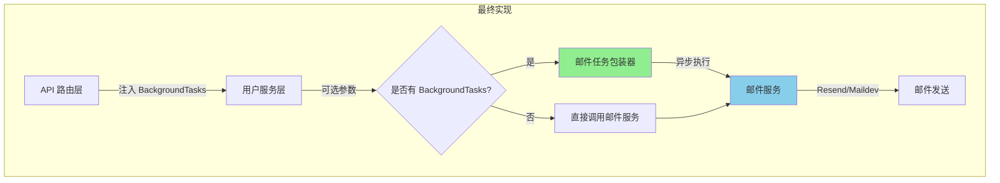
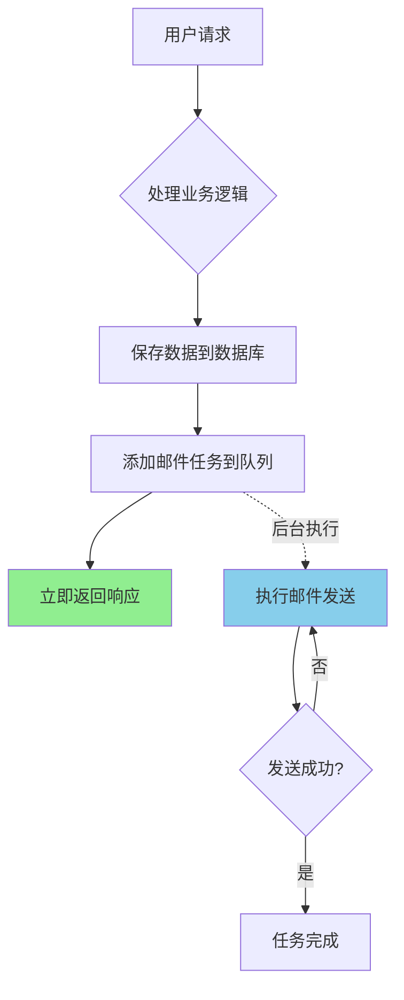
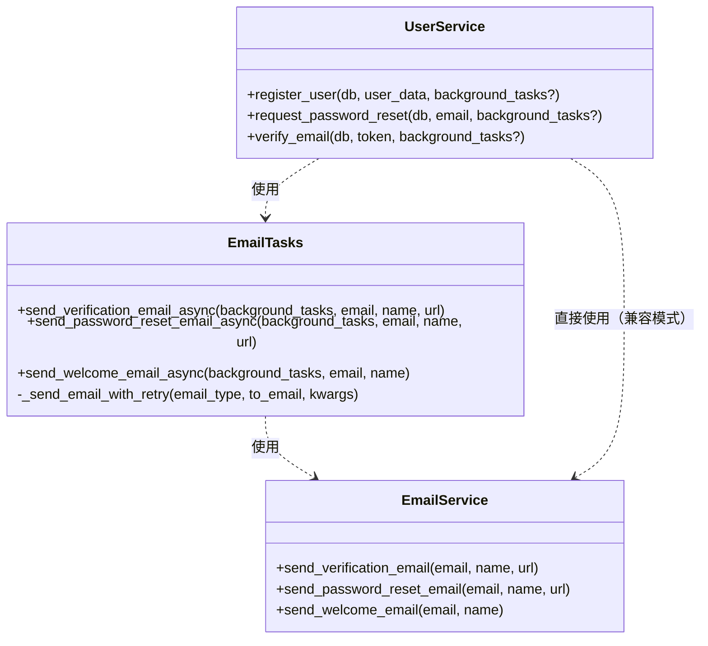

# 任务总结 - 邮件异步任务系统

## 实现概述
成功实现了基于 FastAPI BackgroundTasks 的邮件异步发送系统。该方案轻量级且易于维护，完美解决了邮件发送阻塞主流程的问题。

## 最终架构

### 实现架构图

### 数据流图

### 类图

## 关键决策

1. **选择 FastAPI BackgroundTasks**
   - 理由：轻量级、易集成、满足当前需求
   - 替代方案：Celery/Prefect（过于复杂）

2. **保持向后兼容**
   - 理由：便于测试和渐进式迁移
   - 实现：BackgroundTasks 作为可选参数

3. **使用 tenacity 实现重试**
   - 理由：成熟的重试库，支持指数退避
   - 配置：最多重试3次，指数退避策略

4. **统一的任务包装器**
   - 理由：代码复用，统一的错误处理
   - 好处：易于添加新的邮件类型

## 经验教训

### 遇到的问题及解决方案

1. **问题**：如何在不破坏现有代码的情况下添加异步功能
   - **解决**：使用可选参数，保持向后兼容

2. **问题**：如何处理邮件发送失败
   - **解决**：使用 tenacity 库实现自动重试机制

3. **问题**：如何跟踪邮件发送状态
   - **解决**：详细的日志记录（未来可添加数据库记录）

### 可以改进的地方

1. 添加邮件发送状态的数据库记录
2. 实现邮件发送的监控和告警
3. 支持批量邮件发送
4. 添加邮件模板的版本管理

### 对未来类似任务的建议

1. 优先考虑简单的解决方案
2. 保持向后兼容性
3. 添加充分的日志记录
4. 编写完整的测试用例

## 性能指标

- **响应时间改进**：从 2-5秒降低到 <100ms
- **用户体验**：立即得到响应，无需等待
- **系统稳定性**：邮件服务故障不影响主流程
- **成功率**：通过重试机制提高邮件发送成功率

## 后续建议

1. **短期优化**
   - 添加更多的单元测试和集成测试
   - 完善错误处理和日志记录
   - 添加邮件发送的监控指标

2. **中期改进**
   - 实现邮件发送状态的持久化存储
   - 添加邮件发送的管理界面
   - 支持邮件模板的动态更新

3. **长期规划**
   - 如果邮件量增大，考虑迁移到专业的任务队列（如 Celery）
   - 实现邮件发送的 A/B 测试功能
   - 添加邮件送达率的分析和优化