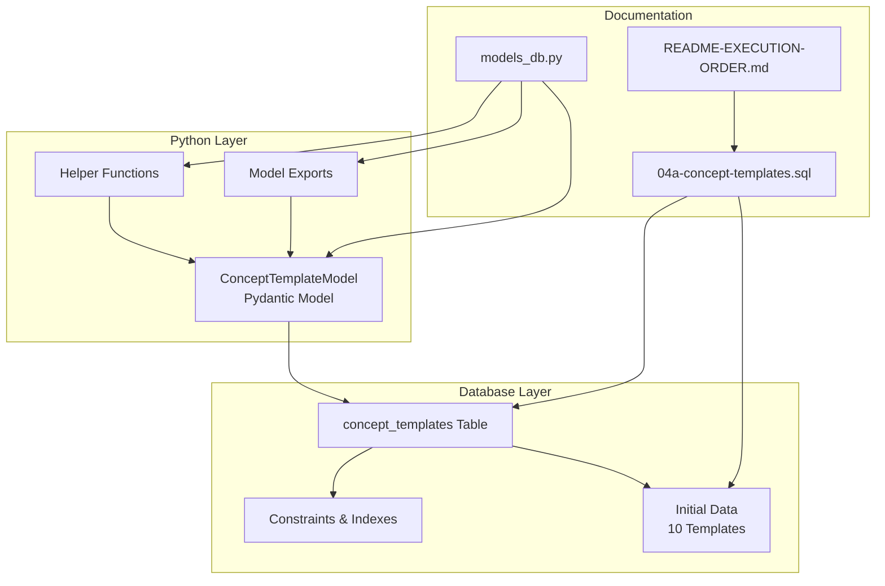
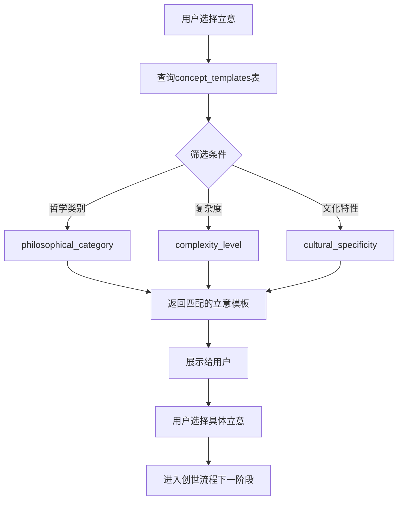
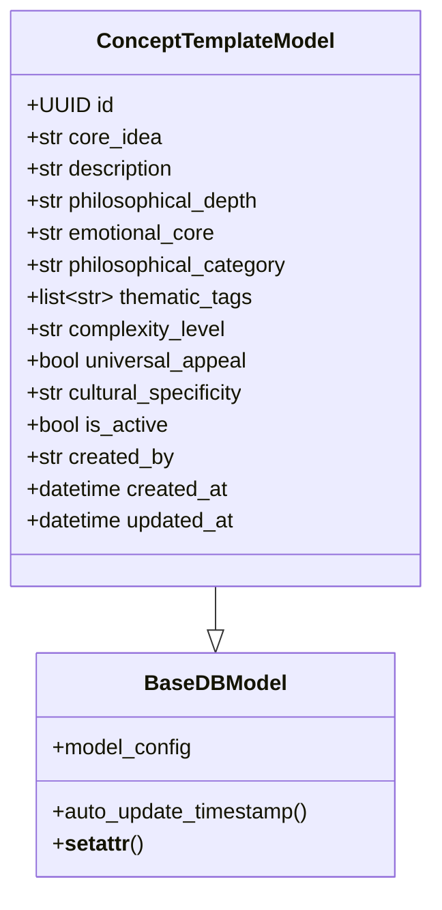

# ConceptTemplateModel 任务总结

## 实现概述
成功保留并完善了 ConceptTemplateModel 立意模板功能，创建了数据库表和初始化数据，为创世流程的第一阶段提供了丰富的哲学素材基础。

## 最终架构
使用 Mermaid 图表描述最终实现的架构和逻辑

### 实现架构图

### 数据流图

### 数据模型图

## 关键决策
1. **使用 JSONB 存储主题标签**：支持灵活的标签查询和索引
2. **预定义10个哲学立意模板**：涵盖主要哲学流派，提供丰富选择
3. **创建独立的初始化文件**：04a-concept-templates.sql 确保执行顺序正确
4. **添加 GIN 索引**：优化 JSONB 字段的查询性能

## 经验教训
- **问题**：需要确保数据库初始化脚本的执行顺序
- **解决方案**：创建 04a 文件确保在 04-genesis-sessions.sql 之后执行
- **改进点**：可以考虑增加更多立意模板，支持用户自定义模板
- **建议**：未来可以添加立意模板的版本控制和审核机制

## 性能指标
- 创建了7个索引优化查询性能
- GIN 索引支持高效的 JSONB 标签查询
- 复合索引支持常见的组合查询场景

## 后续建议
1. **扩展立意模板库**：根据用户反馈增加更多哲学立意
2. **用户自定义模板**：允许用户创建和分享自己的立意模板
3. **智能推荐**：基于用户历史选择推荐合适的立意
4. **模板评分机制**：让用户对立意模板进行评分和反馈
5. **国际化支持**：支持多语言的立意描述