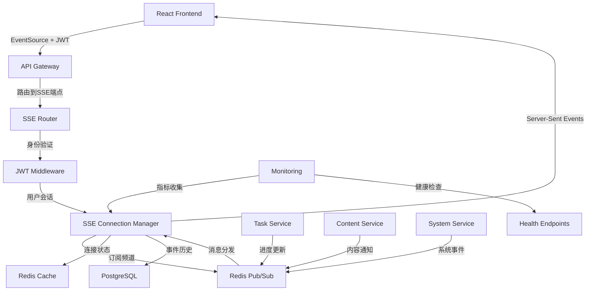
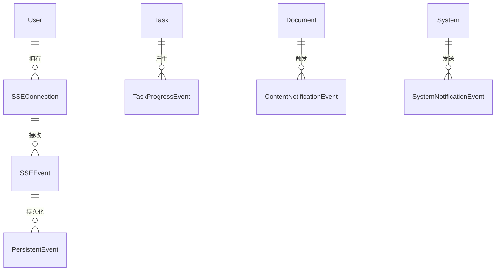
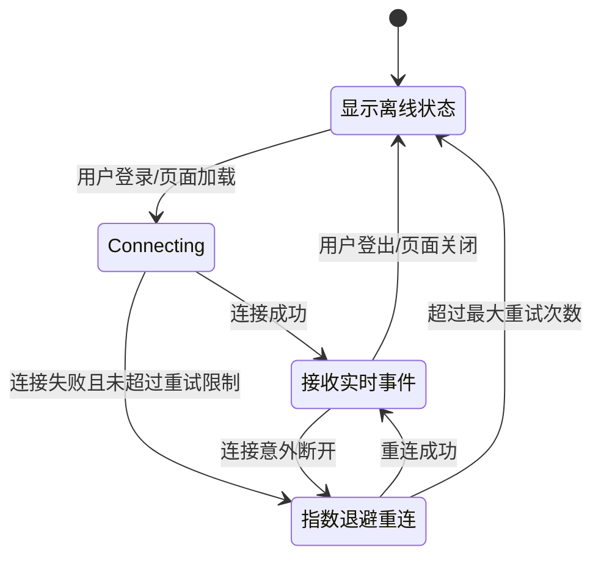
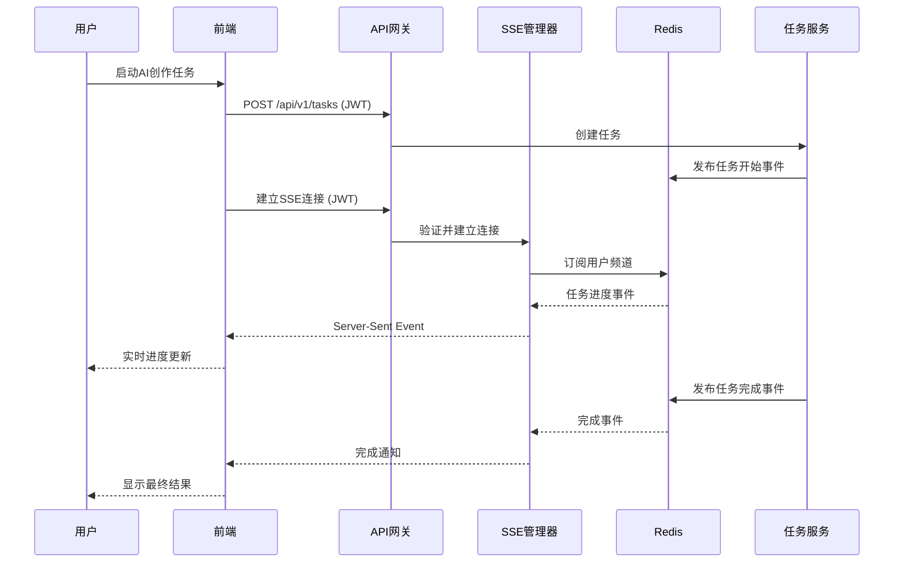
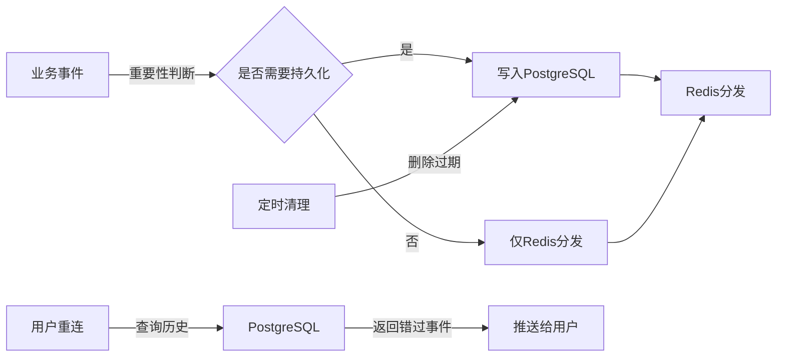

# 技术设计

## 概览

基于现有基础架构，本设计实现Server-Sent Events (SSE)功能，为InfiniteScribe平台提供实时事件推送能力。设计充分利用现有的FastAPI后端、Redis缓存层、PostgreSQL数据库和React TypeScript前端，在已定义的SSE模式基础上实现完整的实时通信解决方案。

SSE实现将替代现有的30秒轮询机制，为AI驱动的小说创作过程提供即时反馈，显著改善用户体验和系统性能。系统支持任务进度更新、内容变更通知、系统状态推送等核心实时功能。

## 需求映射

### 设计组件可追溯性

每个设计组件都对应特定的需求：

- **SSE端点实现** → 1.1-1.7: 后端SSE服务端点实现需求
- **连接管理器和事件分发** → 2.1-2.7: SSE连接管理和事件分发需求
- **任务进度服务** → 3.1-3.7: 任务进度实时更新需求
- **内容通知系统** → 4.1-4.7: 系统状态和内容变更通知需求
- **前端SSE客户端** → 5.1-5.7: 前端SSE客户端实现需求
- **轮询替换层** → 6.1-6.7: 轮询机制替换和兼容性需求
- **事件持久化层** → 7.1-7.7: 事件持久化和可靠性需求
- **监控和性能层** → 8.1-8.7: 监控和性能优化需求

### 用户故事覆盖

- **系统管理员故事**: 通过SSE端点和连接管理器实现服务端点部署和管理
- **开发者故事**: 通过事件分发系统和持久化层实现可靠的消息处理
- **终端用户故事**: 通过前端客户端和实时更新系统获得无缝的实时体验
- **运维人员故事**: 通过监控层和性能优化获得系统可观测性

## 架构

### 系统架构图



### 技术栈选择依据

基于研究发现和现有代码库分析：

- **后端框架**: FastAPI + `fastapi-sse` - 利用现有异步架构，原生支持SSE流式响应
- **认证机制**: JWT Bearer Token - 继承现有认证系统，使用EventSource Polyfill支持认证头
- **消息代理**: Redis Pub/Sub - 利用现有Redis基础设施，支持多实例扩展
- **数据持久化**: PostgreSQL + SQLAlchemy - 继承现有数据层模式
- **前端实现**: React + TypeScript + TanStack Query - 基于现有状态管理模式
- **监控系统**: Prometheus + 自定义健康检查 - 扩展现有监控基础设施

### 架构决策依据

**为什么选择FastAPI SSE**: 
- 与现有异步架构无缝集成
- 原生支持流式响应和背压处理
- 保持现有中间件和依赖注入模式

**为什么选择Redis Pub/Sub**:
- 利用现有Redis基础设施(`apps/backend/src/common/services/redis_service.py`)
- 支持多实例部署的消息分发
- 低延迟和高吞吐量满足实时需求

**为什么选择EventSource Polyfill**:
- 解决原生EventSource API无法发送认证头的限制
- 保持与现有JWT认证系统的兼容性
- 提供更好的错误处理和重连机制

## 组件和接口

### 后端服务和方法签名

#### SSE连接管理器

```python
class SSEConnectionManager:
    def __init__(self, redis_service: RedisService):  # 利用现有Redis服务
        """初始化SSE连接管理器"""
    
    async def add_connection(self, user_id: str, connection: SSEConnection) -> str:
        """添加新的SSE连接并返回连接ID"""
    
    async def remove_connection(self, connection_id: str) -> None:
        """移除SSE连接并清理资源"""
    
    async def send_to_user(self, user_id: str, event: SSEEvent) -> bool:
        """向指定用户发送事件"""
    
    async def broadcast_system_event(self, event: SSESystemEvent) -> int:
        """广播系统事件并返回接收者数量"""
    
    async def get_connection_stats(self) -> Dict[str, Any]:
        """获取连接统计信息用于监控"""
```

#### 事件持久化服务

```python
class SSEEventStore:
    def __init__(self, db_service: DatabaseService):  # 利用现有数据库服务
        """初始化事件存储服务"""
    
    async def store_event(self, event: SSEPersistentEvent) -> str:
        """存储重要事件并返回事件ID"""
    
    async def get_missed_events(self, user_id: str, last_event_id: str) -> List[SSEEvent]:
        """获取用户错过的事件列表"""
    
    async def cleanup_old_events(self, days_old: int = 7) -> int:
        """清理过期事件并返回删除数量"""
```

#### 任务进度SSE集成

```python
class TaskProgressService:  # 扩展现有TaskService
    async def send_progress_update(self, task_id: str, progress: TaskProgress) -> None:
        """发送任务进度更新事件"""
    
    async def send_completion_event(self, task_id: str, result: TaskResult) -> None:
        """发送任务完成事件"""
    
    async def send_error_event(self, task_id: str, error: TaskError) -> None:
        """发送任务错误事件"""
```

### 前端组件

| 组件名称 | 职责 | Props/状态摘要 |
|---------|------|----------------|
| `useSSEConnection` | 管理SSE连接生命周期 | `url, token, onMessage, onError` |
| `useTaskProgress` | 订阅任务进度更新 | `taskId` → `progress, status, error` |
| `useContentNotifications` | 处理内容变更通知 | `documentId` → `notifications[]` |
| `SSEConnectionStatus` | 显示连接状态指示器 | `connectionState, retryCount` |
| `useSystemNotifications` | 处理系统级通知 | `→ systemEvents[], unreadCount` |

### API端点

| 方法 | 路由 | 目的 | 认证 | 状态码 |
|------|------|------|------|--------|
| GET | `/api/v1/events/stream` | 建立SSE连接 | JWT必需 | 200, 401, 429 |
| GET | `/api/v1/events/stream/{user_id}` | 用户专属事件流 | JWT必需 | 200, 401, 403, 429 |
| GET | `/api/v1/events/history` | 获取历史事件 | JWT必需 | 200, 401, 404 |
| GET | `/api/v1/events/health` | SSE健康检查 | 无 | 200, 503 |
| POST | `/api/v1/auth/sse-token` | 获取SSE专用token | JWT必需 | 200, 401 |

## 数据模型

### 领域实体

1. **SSEConnection**: SSE连接会话信息
2. **SSEEvent**: 基础事件消息结构  
3. **TaskProgressEvent**: 任务进度事件
4. **ContentNotificationEvent**: 内容通知事件
5. **SystemNotificationEvent**: 系统通知事件
6. **PersistentEvent**: 需要持久化的重要事件

### 实体关系



### 数据模型定义

基于现有代码库的SSE模式(`apps/backend/src/schemas/sse.py`):

```python
# 扩展现有SSE模式
@dataclass
class SSEConnection:
    connection_id: str
    user_id: str
    session_id: str
    connected_at: datetime
    last_heartbeat: datetime
    channel_subscriptions: List[str]

@dataclass  
class TaskProgressEvent(SSEEvent):
    task_id: str
    progress_percent: int
    current_step: str
    estimated_completion: Optional[datetime]
    partial_result: Optional[str]
```

```typescript
// 前端TypeScript接口
interface SSEConnectionState {
  status: 'connecting' | 'connected' | 'reconnecting' | 'disconnected';
  retryCount: number;
  lastError?: string;
  connectionId?: string;
}

interface TaskProgressPayload {
  taskId: string;
  progress: number;
  status: TaskStatus;
  message: string;
  estimatedCompletion?: string;
}
```

### 数据库模式

扩展现有数据库模式以支持事件持久化:

```sql
-- SSE连接跟踪表
CREATE TABLE sse_connections (
    id VARCHAR(36) PRIMARY KEY,
    user_id VARCHAR(36) NOT NULL REFERENCES users(id) ON DELETE CASCADE,
    session_id VARCHAR(255),
    connected_at TIMESTAMP NOT NULL DEFAULT CURRENT_TIMESTAMP,
    last_heartbeat TIMESTAMP NOT NULL DEFAULT CURRENT_TIMESTAMP,
    channel_subscriptions JSONB DEFAULT '[]'::jsonb,
    INDEX idx_sse_user_id (user_id),
    INDEX idx_sse_last_heartbeat (last_heartbeat)
);

-- 持久化事件表
CREATE TABLE persistent_events (
    id VARCHAR(36) PRIMARY KEY,
    user_id VARCHAR(36) NOT NULL REFERENCES users(id) ON DELETE CASCADE,
    event_type VARCHAR(50) NOT NULL,
    event_data JSONB NOT NULL,
    priority INTEGER DEFAULT 0,
    created_at TIMESTAMP NOT NULL DEFAULT CURRENT_TIMESTAMP,
    delivered_at TIMESTAMP NULL,
    expires_at TIMESTAMP NOT NULL,
    INDEX idx_events_user_priority (user_id, priority DESC, created_at DESC),
    INDEX idx_events_expires (expires_at)
);
```

### 迁移策略

- **阶段1**: 创建SSE基础表结构，与现有表结构保持兼容
- **阶段2**: 在现有任务表添加SSE事件追踪字段
- **阶段3**: 实施事件清理机制，避免历史数据积累
- **性能索引**: 基于查询模式优化用户ID和时间戳索引

## 错误处理

### 服务器端错误处理策略

```python
# 分层错误处理
class SSEErrorHandler:
    async def handle_connection_error(self, connection_id: str, error: Exception):
        """连接级错误处理 - 记录并优雅关闭"""
        await self.log_error(connection_id, error)
        await self.cleanup_connection(connection_id)
    
    async def handle_event_delivery_error(self, event: SSEEvent, error: Exception):
        """事件传递错误 - 重试或持久化"""
        if isinstance(error, ConnectionClosed):
            await self.mark_event_for_retry(event)
        elif isinstance(error, ValidationError):
            await self.log_invalid_event(event, error)
        else:
            await self.persist_failed_event(event, error)
```

### 客户端错误处理策略

```typescript
// 指数退避重连机制
class SSEReconnectionManager {
  private retryCount = 0;
  private maxRetries = 5;
  private baseDelay = 1000;
  
  async reconnect(): Promise<void> {
    if (this.retryCount >= this.maxRetries) {
      throw new Error('Max reconnection attempts exceeded');
    }
    
    const delay = Math.min(this.baseDelay * Math.pow(2, this.retryCount), 30000);
    await new Promise(resolve => setTimeout(resolve, delay));
    
    this.retryCount++;
    // 重新建立连接逻辑
  }
}
```

## 安全考虑

### 认证和授权策略

- **短期SSE Token**: 为SSE连接生成60秒TTL的专用token，降低token泄露风险
- **请求级验证**: 每个SSE事件推送前验证用户权限和数据访问范围
- **连接限制**: 每用户最多3个并发SSE连接，防止资源滥用
- **频率限制**: 实施事件推送频率限制，防止消息洪水攻击

### 数据保护措施

- **敏感信息过滤**: SSE事件中的敏感数据加密传输，客户端解密显示
- **跨域限制**: CORS策略限制SSE连接来源，只允许授权域名
- **IP白名单**: 支持IP白名单功能，限制SSE连接来源
- **事件加密**: 重要事件在Redis中加密存储

## 性能与可扩展性

### 性能目标

| 指标 | 目标 | 测量方法 |
|------|------|----------|
| SSE连接建立时间 | < 500ms | 连接握手耗时 |
| 事件推送延迟 (p95) | < 100ms | 从事件产生到客户端接收 |
| 事件推送延迟 (p99) | < 200ms | 高负载下推送延迟 |
| 并发连接数 | > 10,000 | 单实例支持连接数 |
| 事件吞吐量 | > 50,000 events/sec | Redis Pub/Sub处理能力 |
| 内存使用率 | < 80% | SSE连接内存占用 |

### 缓存策略

- **连接状态缓存**: Redis存储活跃SSE连接信息，TTL 5分钟
- **事件历史缓存**: Redis ZSET存储最近1小时事件，支持断线重连恢复
- **用户订阅缓存**: Redis Hash存储用户频道订阅信息
- **频率限制缓存**: Redis sliding window实现事件推送频率控制

### 可扩展性方案

- **水平扩展**: 多API Gateway实例通过Redis Pub/Sub共享事件分发
- **连接负载均衡**: 使用一致性哈希将用户连接分配到特定实例
- **事件分片**: 按用户ID对事件进行分片，避免单点瓶颈
- **异步处理**: 所有SSE事件处理异步化，避免阻塞HTTP请求

## 测试策略

### 风险矩阵

| 区域 | 风险 | 必须 | 可选 | 参考 |
|------|------|------|------|------|
| SSE连接管理 | 高 | 单元、集成、E2E | 负载 | 1.1-1.7, 2.1-2.7 |
| 事件持久化 | 高 | 单元、属性 | 故障恢复 | 7.1-7.7 |
| 身份验证 | 高 | 单元、契约、安全 | 渗透 | 1.3-1.4 |
| 任务进度推送 | 中 | 单元、集成 | 性能 | 3.1-3.7 |
| 前端重连逻辑 | 中 | 单元、E2E (≤2) | 网络模拟 | 5.3, 5.5 |
| Redis Pub/Sub | 中 | 集成 | 分区测试 | 2.7, 8.4 |
| 监控指标 | 低 | 单元 | 可观测性 | 8.1-8.7 |

### 测试分层策略

#### 单元测试
- **SSE连接管理器**: 连接生命周期、事件路由、错误处理边界条件
- **事件序列化**: 各类事件模式的序列化/反序列化正确性
- **认证逻辑**: Token验证、权限检查、会话管理
- **重连算法**: 指数退避逻辑、最大重试限制

#### 集成测试  
- **Redis集成**: Pub/Sub消息分发、连接状态同步
- **数据库集成**: 事件持久化、历史查询、清理机制
- **跨服务通信**: Task Service → SSE Manager → Frontend 完整链路

#### E2E测试
- **任务进度订阅**: 创建AI生成任务 → 接收实时进度 → 完成通知
- **连接恢复**: 断网模拟 → 自动重连 → 事件历史同步
- **多用户场景**: 并发用户连接 → 事件广播 → 用户隔离验证

### CI门控策略

| 阶段 | 运行测试 | 门控条件 | SLA |
|------|----------|----------|-----|
| PR检查 | 单元 + 契约 | 失败=阻止合并 | ≤3分钟 |
| 集成测试 | 集成 + 性能烟测 | 失败=阻止部署 | ≤5分钟 |
| 预生产 | E2E + 负载测试 | 性能回归=告警 | ≤10分钟 |

### 性能测试

```python
# 负载测试用例示例
async def test_concurrent_sse_connections():
    """测试1万并发SSE连接性能"""
    connections = []
    for i in range(10000):
        conn = await create_sse_connection(f"user_{i}")
        connections.append(conn)
    
    # 发送广播事件并测量延迟分布
    start_time = time.time()
    await broadcast_system_event("test_event")
    
    # 验证p95延迟 < 200ms
    latencies = await collect_delivery_latencies(connections)
    assert percentile(latencies, 95) < 0.2
```

### 退出标准

- **功能**: 所有EARS需求验收标准通过
- **性能**: P95延迟 < 200ms，并发连接 > 10,000
- **可靠性**: 连接恢复成功率 > 99.9%
- **安全**: 通过安全扫描，无高危漏洞
- **监控**: 关键指标完整暴露，告警规则生效

## 界面流转

### SSE连接状态流转图



### 主要用户流程

#### 任务进度订阅流程



## 数据流

### 事件生产到消费完整流程

1. **事件产生**: 业务服务(Task/Content/System Service)产生事件
2. **事件发布**: 通过Redis Pub/Sub发布到相应频道
3. **事件分发**: SSE管理器从Redis接收事件，路由到目标连接
4. **持久化**: 重要事件写入PostgreSQL，支持离线恢复  
5. **客户端接收**: 前端EventSource接收并处理事件
6. **状态更新**: 触发React状态更新，更新用户界面

### 事件持久化和恢复机制



通过这个全面的技术设计，SSE功能将无缝集成到现有的InfiniteScribe平台架构中，提供高性能、可靠的实时事件推送服务，显著改善用户在AI小说创作过程中的交互体验。