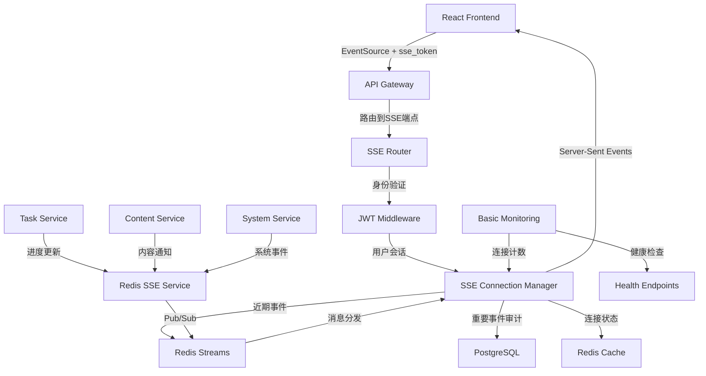
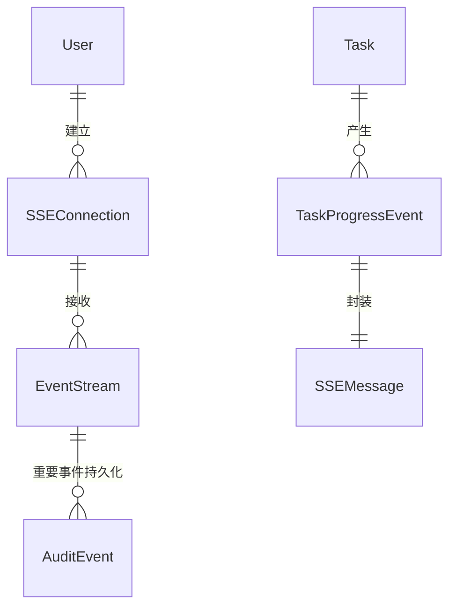
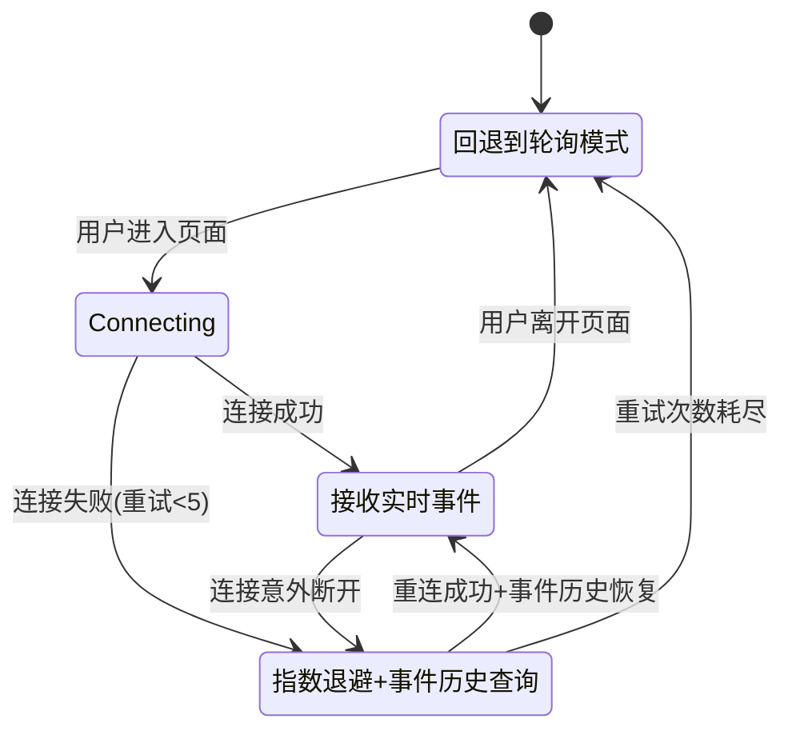
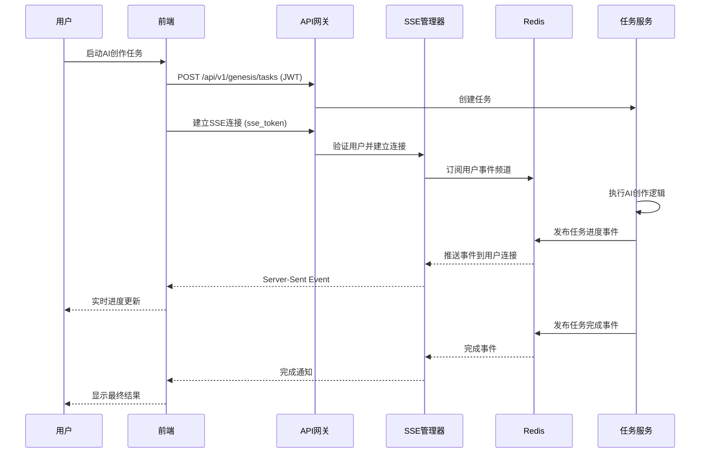
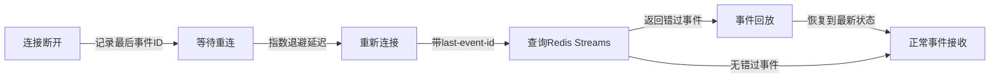

# 技术设计 (修订版)

## 概览

基于技术评审反馈，本设计实现Server-Sent Events (SSE)功能的**现实可行版本**，为InfiniteScribe平台提供实时事件推送能力。设计采用分阶段实施策略，优先验证核心功能，再逐步扩展规模。

设计充分利用现有的FastAPI后端、基础Redis服务、PostgreSQL数据库和React TypeScript前端，基于已定义的SSE模式(`apps/backend/src/schemas/sse.py`)实现完整的实时通信解决方案。

**关键修订**: 基于架构评审将初始目标调整为**1,000-2,000并发连接**，采用**3个月分阶段交付**策略，确保技术风险可控。

**文档路径约定**: 本设计中的所有文件路径均为仓库相对路径，如`apps/backend/src/schemas/sse.py`、`apps/backend/src/common/services/redis_service.py`等。

## 需求映射

### 设计组件可追溯性

每个设计组件都对应特定的需求：

- **Redis SSE服务** → 1.1-1.4: 消息发布订阅基础设施需求
- **SSE端点实现** → 1.5-1.7: FastAPI服务端点实现需求
- **连接管理器** → 2.1-2.4: SSE连接管理需求 (降级规模)
- **事件分发系统** → 2.5-2.7: 事件分发需求 (使用Redis Streams优化)
- **任务进度服务** → 3.1-3.7: 任务进度实时更新需求
- **内容通知系统** → 4.1-4.7: 系统状态和内容变更通知需求
- **前端SSE客户端** → 5.1-5.7: 前端SSE客户端实现需求
- **轮询替换层** → 6.1-6.4: 轮询机制替换需求 (渐进式)
- **事件持久化层** → 7.1-7.4: 事件持久化需求 (简化架构)
- **监控和性能层** → 8.1-8.4: 基础监控需求 (第三阶段)

### 用户故事覆盖

- **系统管理员故事**: 通过分阶段SSE端点部署实现逐步上线
- **开发者故事**: 通过Redis Streams和简化持久化实现可靠消息处理
- **终端用户故事**: 通过前端客户端获得基本实时体验 (AI创作进度)
- **运维人员故事**: 通过基础监控获得系统可观测性

## 架构

### 系统架构图



### 技术栈选择 (修订版)

基于技术评审和现有架构对齐：

- 后端框架: FastAPI + fastapi-sse（`EventSourceResponse` 提供标准 SSE 输出）
- 认证机制: 短期 SSE Token 查询参数 `?sse_token=...`（避免 EventSource 头限制）
- 消息架构: 扩展现有 RedisService 增加 Pub/Sub 支持 + Redis Streams
- 数据持久化: Redis Streams（24 小时保留，定时清理）+ SQLAlchemy 模型 + Alembic 迁移
- 前端实现: React + TypeScript + 原生 EventSource（无需 polyfill）
- 监控系统: 基础连接统计 + FastAPI 内置指标

### 架构决策依据 (修订)

**为什么选择 fastapi-sse**:
- 提供标准的 `EventSourceResponse`，可直接产出符合规范的 SSE 流
- 支持以 dict 形式（`{"event","data","id","retry"}`）yield，简化输出逻辑
- 易于与自定义队列聚合、心跳与补发流程组合

**最小 SSE 端点示例（队列聚合 + 统一 dict 输出）**:
```python
from fastapi import FastAPI, Request
from fastapi_sse import EventSourceResponse
import asyncio

app = FastAPI()

@app.get("/api/v1/events/stream")
async def stream_events(request: Request, sse_token: str, since_id: str | None = None):
    user_id = verify_and_get_user(sse_token)  # 伪代码

    queue: asyncio.Queue[dict] = asyncio.Queue(maxsize=100)

    async def push_heartbeats():
        while True:
            await queue.put({"event": "heartbeat", "data": {"ping": True}})
            await asyncio.sleep(30)

    async def push_realtime_events():
        async for sse in redis_sse_service.subscribe_user_events(user_id):
            await queue.put({"event": sse.event, "data": sse.data, "id": sse.id})

    async def push_missed_events():
        last_id = since_id or request.headers.get("Last-Event-ID")
        if last_id:
            events = await redis_sse_service.get_recent_events(user_id, since_id=last_id)
            for evt in events:
                await queue.put({"event": evt.event, "data": evt.data, "id": evt.id})

    async def event_stream():
        tasks = [
            asyncio.create_task(push_missed_events()),
            asyncio.create_task(push_heartbeats()),
            asyncio.create_task(push_realtime_events()),
        ]
        try:
            while True:
                yield await queue.get()
        finally:
            for t in tasks:
                t.cancel()

    return EventSourceResponse(event_stream())
```

**依赖配置**（`apps/backend/pyproject.toml`）:
```toml
[project]
dependencies = [
  # ... 现有依赖
  "fastapi-sse>=2.1.0",
]
```

**为什么使用查询参数认证**:
- 原生EventSource无法设置Authorization头
- 避免复杂的polyfill和跨浏览器兼容性问题
- 短期token降低安全风险

**为什么扩展现有RedisService**:
- 利用现有Redis基础设施(`apps/backend/src/common/services/redis_service.py`)
- 保持与现有速率限制服务的兼容性
- 避免多个Redis客户端实例的资源浪费

**为什么采用SQLAlchemy + Alembic**:
- 与现有数据层架构一致(`apps/backend/src/models/`, `apps/backend/src/db/sql/`)
- 利用现有迁移工具链和开发流程
- 类型安全和ORM集成优势

## 分阶段实施策略

### 阶段1: MVP基础设施 (4-5周)
**目标**: 500并发连接，基本任务进度推送

**交付内容**:
- Redis SSE服务 (Pub/Sub + 基础Streams)
- FastAPI SSE端点 (单一事件流)
- SSE连接管理器 (基础版)
- TaskService SSE集成
- 前端SSE客户端 (基础重连)

**成功标准**:
- AI创作任务进度实时更新
- 连接建立 < 1s, 事件延迟 P95 < 300ms
- 基础错误处理和重连机制

### 阶段2: 功能完善 (4-5周)
**目标**: 1,000-1,500并发连接，完整事件类型支持

**交付内容**:
- 完整事件类型支持 (基于现有`sse.py`模式)
- Redis Streams事件历史
- 改进的连接管理 (用户会话隔离)
- 系统通知和内容变更推送
- 前端事件类型化处理

**成功标准**:
- 支持所有定义的事件类型
- 断线重连后事件历史恢复
- 连接稳定性 > 99%

### 阶段3: 性能优化和监控 (3-4周)
**目标**: 2,000并发连接，完整监控体系

**交付内容**:
- 连接池优化和负载均衡准备
- 完整监控指标和告警
- 性能调优 (Redis配置、连接参数)
- 事件清理和容量管理
- 负载测试验证

**成功标准**:
- 2,000并发连接稳定运行
- P95延迟 < 200ms, P99 < 500ms
- 完整的可观测性

## 组件和接口

### 后端服务和方法签名

#### Redis SSE服务 (扩展现有RedisService)

```python
# src/common/services/redis_sse_service.py
from src.common.services.redis_service import RedisService
from src.schemas.sse import SSEMessage, EventScope
import redis.asyncio as redis

class RedisSSEService:
    def __init__(self, redis_service: RedisService):
        """扩展现有RedisService，添加Pub/Sub和Streams能力"""
        self.redis_service = redis_service
        self._pubsub_client: redis.Redis | None = None
    
    async def init_pubsub_client(self) -> None:
        """初始化Pub/Sub专用客户端 (避免与现有RateLimitService混用)"""
        self._pubsub_client = redis.from_url(
            settings.database.redis_url,
            decode_responses=True
        )
    
    async def publish_event(self, user_id: str, event: SSEMessage) -> str:
        """发布事件到用户频道 (先Streams后Pub/Sub，保证ID一致性)"""
        stream_key = f"events:user:{user_id}"      # Streams存储
        channel = f"sse:user:{user_id}"            # Pub/Sub通道 (分离键名)
        
        # 1) 先XADD获取stream_id
        import json
        stream_id = await self._pubsub_client.xadd(
            stream_key,
            {
                "event": event.event, 
                "data": json.dumps(event.data, ensure_ascii=False, default=str)
            },
            maxlen=1000,
            approximate=True
        )
        
        # 2) 设置SSE id为stream_id，确保Last-Event-ID一致性
        event.id = stream_id
        
        # 3) 发布指针消息，指向刚写入的Stream条目
        await self._pubsub_client.publish(
            channel, 
            json.dumps({"stream_key": stream_key, "stream_id": stream_id})
        )
        
        return stream_id
    
    async def subscribe_user_events(self, user_id: str) -> AsyncIterator[SSEMessage]:
        """订阅用户事件频道，从指针获取完整事件（SSEMessage）"""
        channel = f"sse:user:{user_id}"
        pubsub = self._pubsub_client.pubsub()
        await pubsub.subscribe(channel)
        
        async for message in pubsub.listen():
            if message["type"] != "message":
                continue
                
            # 解析指针消息
            import json
            try:
                pointer = json.loads(message["data"])
                stream_key = pointer["stream_key"]
                stream_id = pointer["stream_id"]
                
                # XREAD获取对应条目，统一封装为SSE
                entries = await self._pubsub_client.xread({stream_key: stream_id}, count=1)
                if not entries:
                    continue
                    
                (_key, items) = entries[0]
                (actual_stream_id, fields) = items[0]
                
                # 重构SSE消息为统一模型（由上层统一格式化为SSE）
                sse_event = SSEMessage(
                    event=fields["event"],
                    data=json.loads(fields["data"]),
                    id=actual_stream_id,
                    scope=EventScope.USER
                )
                yield sse_event
                
            except (json.JSONDecodeError, KeyError) as e:
                logger.warning(f"Invalid pointer message: {e}")
                continue
        # 结束时释放资源
        try:
            await pubsub.unsubscribe(channel)
        finally:
            await pubsub.close()
    
    async def get_recent_events(self, user_id: str, since_id: str = "-") -> list[SSEMessage]:
        """从Redis Streams获取历史事件，统一封装为SSEMessage"""
        stream_key = f"events:user:{user_id}"
        entries = await self._pubsub_client.xread({stream_key: since_id}, count=100)
        
        if not entries:
            return []
            
        import json
        events = []
        (_key, items) = entries[0]
        
        for stream_id, fields in items:
            try:
                sse_event = SSEMessage(
                    event=fields["event"],
                    data=json.loads(fields["data"]),
                    id=stream_id,
                    scope=EventScope.USER
                )
                events.append(sse_event)
            except (json.JSONDecodeError, KeyError):
                continue  # 跳过损坏的条目
                
        return events
```

#### SSE连接管理器 (队列聚合 + 心跳 + GC)

```python
from fastapi_sse import EventSourceResponse

class SSEConnectionManager:
    def __init__(self, redis_sse_service: RedisSSEService):
        """初始化连接管理器"""
        self.connections: dict[str, SSEConnectionState] = {}
        self.redis_sse = redis_sse_service
        self.heartbeat_interval = 30  # 30秒心跳

    async def add_connection(self, user_id: str) -> EventSourceResponse:
        """添加SSE连接，检查并发限制并返回EventSourceResponse"""
        # 1) 并发连接限制（不为负的计数）
        conn_key = f"user:{user_id}:sse_conns"
        current_conns = await self.redis_sse._pubsub_client.incr(conn_key)
        await self.redis_sse._pubsub_client.expire(conn_key, 300)
        if current_conns > 2:
            # 回退计数，确保不为负
            val = await self.redis_sse._pubsub_client.decr(conn_key)
            if val < 0:
                await self.redis_sse._pubsub_client.set(conn_key, 0)
            raise HTTPException(429, "Too many concurrent SSE connections")

        connection_id = str(uuid4())
        self.connections[connection_id] = SSEConnectionState(
            connection_id=connection_id,
            user_id=user_id,
            connected_at=datetime.utcnow(),
            last_heartbeat=datetime.utcnow(),
        )

        queue: asyncio.Queue[dict] = asyncio.Queue(maxsize=100)

        async def push_heartbeats():
            while connection_id in self.connections:
                await queue.put({"event": "heartbeat", "data": {"ping": True}})
                # 更新心跳
                self.connections[connection_id].last_heartbeat = datetime.utcnow()
                await asyncio.sleep(self.heartbeat_interval)

        async def push_realtime():
            async for sse in self.redis_sse.subscribe_user_events(user_id):
                if connection_id not in self.connections:
                    break
                await queue.put({"event": sse.event, "data": sse.data, "id": sse.id})

        async def event_stream():
            tasks = [
                asyncio.create_task(push_heartbeats()),
                asyncio.create_task(push_realtime()),
            ]
            try:
                while connection_id in self.connections:
                    item = await queue.get()
                    yield item
            finally:
                for t in tasks:
                    t.cancel()
                await self._cleanup_connection(connection_id, user_id)

        return EventSourceResponse(event_stream())
    
    async def _cleanup_connection(self, connection_id: str, user_id: str):
        """清理连接资源和Redis计数"""
        # 清理内存连接记录
        self.connections.pop(connection_id, None)
        
        # 减少Redis并发连接计数（不为负）
        conn_key = f"user:{user_id}:sse_conns"
        val = await self.redis_sse._pubsub_client.decr(conn_key)
        if val < 0:
            await self.redis_sse._pubsub_client.set(conn_key, 0)
        
        # 清理心跳记录
        heartbeat_key = f"sse_conn:{connection_id}:heartbeat"  
        await self.redis_sse._pubsub_client.delete(heartbeat_key)
    
    async def cleanup_stale_connections(self) -> int:
        """定时GC：清理僵尸连接 (心跳超时)"""
        stale_count = 0
        cutoff_time = int(time.time()) - 90  # 90秒无心跳视为僵尸
        
        # 扫描所有心跳键
        pattern = "sse_conn:*:heartbeat"
        async for key in self.redis_sse._pubsub_client.scan_iter(match=pattern):
            try:
                last_heartbeat = await self.redis_sse._pubsub_client.get(key)
                if last_heartbeat and int(last_heartbeat) < cutoff_time:
                    # 提取connection_id并清理
                    connection_id = key.split(":")[1]
                    await self._cleanup_connection(connection_id, "unknown")
                    stale_count += 1
            except Exception as e:
                logger.warning(f"Failed to cleanup stale connection {key}: {e}")
        
        return stale_count
    
    async def get_connection_count(self) -> dict[str, int]:
        """获取连接统计 (监控用)"""
        active_conns = len(self.connections)
        
        # 统计Redis中的用户并发连接
        total_redis_conns = 0
        pattern = "user:*:sse_conns"
        async for key in self.redis_sse._pubsub_client.scan_iter(match=pattern):
            count = await self.redis_sse._pubsub_client.get(key)
            if count:
                total_redis_conns += int(count)
        
        return {
            "active_connections": active_conns,
            "redis_connection_counters": total_redis_conns
        }
```

#### 任务进度SSE集成 (扩展现有TaskService)

```python
class TaskService:  # 扩展现有类
    def __init__(self, ..., redis_sse_service: RedisSSEService):
        """添加SSE服务依赖"""
    
    async def update_progress(self, task_id: UUID, progress: int, message: str = None) -> None:
        """更新任务进度并发送SSE事件"""
    
    async def complete_task(self, task_id: UUID, result: dict[str, Any]) -> None:
        """完成任务并发送完成事件"""
    
    async def fail_task(self, task_id: UUID, error: str) -> None:
        """标记任务失败并发送错误事件"""
```

### 前端组件

| 组件名称 | 职责 | Props/状态摘要 | 阶段 |
|---------|------|----------------|------|
| `useSSEConnection` | 管理基础SSE连接生命周期 | `url, token, onMessage, onError` | 1 |
| `useTaskProgress` | 订阅任务进度更新 | `taskId` → `progress, status, error` | 1 |
| `useSSEReconnection` | 处理断线重连和事件历史 | `lastEventId` → `connectionState` | 2 |
| `useContentNotifications` | 处理内容变更通知 | `filters` → `notifications[]` | 2 |
| `SSEConnectionStatus` | 显示连接状态指示器 | `connectionState, retryCount` | 2 |
| `useSystemNotifications` | 处理系统级通知 | `→ systemEvents[], unreadCount` | 3 |

### API端点 (安全优化)

| 方法 | 路由 | 目的 | 阶段 | 认证方式 | 状态码 |
|------|------|------|------|----------|--------|
| GET | `/api/v1/events/stream?sse_token=...` | 建立SSE连接 | 1 | 查询参数token | 200, 401, 429 |
| POST | `/api/v1/auth/sse-token` | 生成短期SSE token | 1 | JWT Bearer | 200, 401 |
| GET | `/api/v1/events/history?since_id=...` | 获取事件历史 | 2 | 查询参数token | 200, 401, 404 |
| GET | `/api/v1/events/health` | SSE服务健康检查 | 1 | 无 | 200, 503 |
| GET | `/api/v1/events/stats` | 连接统计信息 | 3 | JWT管理员 | 200, 401, 403 |

**路由安全优化**:
- 移除 `/stream/{user_id}` 路由，避免ACL复杂性
- 统一使用 `?sse_token=...` 查询参数认证
- 用户身份从token中解析，不从URL路径暴露

## 数据模型

### 领域实体 (基于现有`sse.py`)

1. **SSEConnection**: SSE连接会话信息 (内存中，Redis缓存)
2. **SSEMessage**: 基础事件消息 (已定义)
3. **TaskProgressEvent**: 任务进度事件 (已定义)
4. **SystemNotificationEvent**: 系统通知事件 (已定义)
5. **EventStream**: Redis Streams事件流记录 (新增)

### 实体关系



### 数据模型定义

基于现有`schemas/sse.py`，扩展连接管理和事件历史模型：

```python
# 扩展现有SSE模式 (复用 src/schemas/sse.py)
from src.schemas.sse import SSEMessage, TaskProgressEvent, EventScope
from pydantic import BaseModel, Field
from datetime import datetime
from typing import Optional

class SSEConnectionState(BaseModel):
    """SSE连接状态模型"""
    connection_id: str
    user_id: str  
    connected_at: datetime
    last_heartbeat: datetime
    last_event_id: Optional[str] = None  # Last-Event-ID重连支持
    channel_subscriptions: list[str] = Field(default_factory=list)

class EventHistoryRecord(BaseModel):
    """事件历史记录 (Redis Streams)"""
    stream_id: str
    user_id: str
    event: str  # 统一使用event字段 (如 "task.progress-updated")
    data: dict  # 事件数据payload
    timestamp: datetime
    delivered: bool = False

class SSETokenPayload(BaseModel):
    """SSE认证Token载荷"""
    user_id: str
    session_id: str
    channels: list[str] = Field(default_factory=list)
    expires_at: datetime
```

```typescript
// 前端TypeScript接口 (与后端Pydantic保持一致)
interface SSEConnectionState {
  status: 'connecting' | 'connected' | 'reconnecting' | 'disconnected';
  retryCount: number;
  lastError?: string;
  lastEventId?: string;  // Last-Event-ID支持
}

// 统一事件格式 (映射SSE的event字段到event_type)
interface SSEEventMessage {
  event: string;  // SSE规范字段，如 "task.progress-updated"
  data: any;      // 事件数据
  id?: string;    // 事件ID
  retry?: number; // 重连延迟
}

interface TaskProgressData {
  task_id: string;
  progress: number;
  message?: string;
  estimated_remaining?: number;  // 秒
}
```

### 数据存储策略 (修订)

**Redis Streams** (24小时定时清理):
```redis
# 用户事件流 (限制长度+定时清理)
XADD events:user:{user_id} MAXLEN ~ 1000 * event task.progress-updated data {...}

# 定时清理策略 (清理24小时前数据)
XTRIM events:user:{user_id} MINID {timestamp_24h_ago}

# 系统事件流  
XADD events:system MAXLEN ~ 500 * event system.notification data {...}
```

**清理策略实现（使用 SCAN 替代 KEYS）**:
```python
async def cleanup_old_events(self, max_age_hours: int = 24) -> int:
    """定时清理过期事件 (XTRIM MINID策略)"""
    import time, asyncio
    cutoff_timestamp = int((time.time() - max_age_hours * 3600) * 1000)  # 毫秒

    pattern = "events:user:*"
    cleaned = 0

    # 使用 SCAN 避免 KEYS 带来的阻塞
    cursor = 0
    while True:
        cursor, keys = await self._pubsub_client.scan(cursor=cursor, match=pattern, count=100)
        for stream_key in keys:
            try:
                result = await self._pubsub_client.xtrim(
                    stream_key,
                    minid=f"{cutoff_timestamp}-0",
                    approximate=True,
                )
                cleaned += result
            except Exception as e:
                logger.warning(f"Failed to trim stream {stream_key}: {e}")
        if cursor == 0:
            break

    return cleaned
```

**SQLAlchemy模型定义** (重要事件审计，阶段3):
```python
# src/models/sse.py (新增文件)
from datetime import datetime
from sqlalchemy import Column, String, DateTime, Text, JSON, Index
from sqlalchemy.orm import Mapped, mapped_column
from src.models.base import BaseModel

class SSEEventAudit(BaseModel):
    """SSE事件审计表"""
    __tablename__ = "sse_event_audit"
    
    # 字段定义
    user_id: Mapped[str] = mapped_column(String(36), nullable=False, index=True)
    event_type: Mapped[str] = mapped_column(String(100), nullable=False)
    event_data: Mapped[dict] = mapped_column(JSON, nullable=False)  
    stream_id: Mapped[str] = mapped_column(String(255), nullable=True)  # Redis Stream ID
    
    # 索引定义 (优化查询性能)
    __table_args__ = (
        Index('idx_sse_audit_user_time', 'user_id', 'created_at'),
        Index('idx_sse_audit_event_type', 'event_type'),
    )
```

**Alembic迁移** (与现有迁移工具链集成):
```python
# alembic/versions/xxxx_add_sse_event_audit.py
"""Add SSE event audit table

Revision ID: sse_audit_001
Revises: previous_migration  
Create Date: 2025-08-28 17:00:00.000000

"""
from alembic import op
import sqlalchemy as sa

# revision identifiers
revision = 'sse_audit_001'
down_revision = 'previous_migration'
branch_labels = None
depends_on = None

def upgrade():
    op.create_table(
        'sse_event_audit',
        sa.Column('id', sa.String(36), primary_key=True),
        sa.Column('user_id', sa.String(36), nullable=False),
        sa.Column('event_type', sa.String(100), nullable=False),
        sa.Column('event_data', sa.JSON(), nullable=False),
        sa.Column('stream_id', sa.String(255), nullable=True),
        sa.Column('created_at', sa.DateTime(), nullable=False),
        sa.Column('updated_at', sa.DateTime(), nullable=False),
    )
    # 专门创建索引，op.create_table中的index=True无效
    op.create_index('idx_sse_audit_user_time', 'sse_event_audit', ['user_id', 'created_at'])
    op.create_index('idx_sse_audit_event_type', 'sse_event_audit', ['event_type'])

def downgrade():
    op.drop_table('sse_event_audit')
```

### 数据迁移策略 (与现有工具链对齐)

- **阶段1**: 仅Redis内存存储，无持久化表
- **阶段2**: 添加Redis Streams，24小时事件历史
- **阶段3**: 
  - 创建SQLAlchemy模型: `src/models/sse.py`
  - 生成Alembic迁移: `alembic revision --autogenerate -m "add sse audit table"`
  - 应用迁移: `alembic upgrade head`
  - 重要事件写入PostgreSQL审计表

## 错误处理

### 服务器端错误处理 (分层简化)

```python
class SSEErrorHandler:
    async def handle_connection_lost(self, connection_id: str):
        """连接丢失处理 - 清理资源"""
        await self.cleanup_connection(connection_id)
    
    async def handle_event_delivery_failure(self, event: SSEMessage, user_id: str):
        """事件传递失败 - 记录到Redis Streams供重连恢复"""
        await self.redis_sse.store_failed_event(user_id, event)
    
    async def handle_redis_unavailable(self):
        """Redis不可用 - 服务降级到轮询模式"""
        # 通知前端切换到轮询备用方案
        pass
```

### 客户端错误处理 (指数退避)

```typescript
class SSEReconnectionManager {
  private retryCount = 0;
  private maxRetries = 5;
  private baseDelay = 1000;
  
  async reconnect(lastEventId?: string): Promise<void> {
    if (this.retryCount >= this.maxRetries) {
      throw new Error('Max reconnection attempts exceeded');
    }
    
    const delay = Math.min(this.baseDelay * Math.pow(2, this.retryCount), 30000);
    await new Promise(resolve => setTimeout(resolve, delay));
    
    // 使用lastEventId重新建立连接，恢复错过的事件
    this.retryCount++;
  }
}
```

## 安全考虑 (简化)

### 认证和授权策略

- **连接时认证**: 建立SSE连接时验证`sse_token`(JWT派生)并解析`user_id`，避免每事件验证开销
- **用户隔离**: 严格的用户事件隔离，防止跨用户数据泄露
- **连接限制**: 每用户最多2个并发连接，Redis计数器原子控制(`INCRBY user:{id}:sse_conns + EXPIRE`)
- **握手频率限制**: 连接建立频率限制，Redis滑动窗口实现

### 数据保护措施

- **事件数据验证**: 发送前验证事件数据完整性
- **用户权限检查**: 确保用户只接收有权限的事件
- **敏感信息过滤**: 过滤敏感字段 (密码、tokens等)

## 性能与可扩展性 (现实目标)

### 性能目标 (修订)

| 指标 | 阶段1目标 | 阶段2目标 | 阶段3目标 | 测量方法 |
|------|-----------|-----------|-----------|----------|
| SSE连接建立时间 | < 1000ms | < 800ms | < 500ms | 连接握手耗时 |
| 事件推送延迟 (p95) | < 300ms | < 250ms | < 200ms | 端到端延迟 |
| 事件推送延迟 (p99) | < 800ms | < 600ms | < 500ms | 高负载延迟 |
| 并发连接数 | 500 | 1,500 | 2,000 | 系统容量 |
| 事件吞吐量 | 1,000/sec | 5,000/sec | 10,000/sec | Redis处理能力 |
| 内存使用率 | < 90% | < 85% | < 80% | 系统监控 |

### 缓存策略 (简化)

- **连接状态**: Redis Hash存储活跃连接，TTL 300秒
- **事件历史**: Redis Streams，24小时定时清理(XTRIM)
- **用户会话**: 复用现有会话缓存机制

### 可扩展性方案 (第3阶段准备)

- **连接负载均衡**: 准备sticky session支持
- **Redis集群准备**: 设计分片策略 (按用户ID)
- **水平扩展就绪**: API Gateway多实例部署准备

## 测试策略

### 风险矩阵 (修订)

| 区域 | 风险 | 必须 | 可选 | 参考 | 阶段 |
|------|------|------|------|------|------|
| SSE连接管理 | 高 | 单元、集成 | 负载 | 1.1-1.7, 2.1-2.7 | 1-3 |
| 事件分发 | 高 | 单元、E2E | 故障模拟 | 2.5-2.7, 3.1-3.7 | 1-2 |
| 身份验证 | 中 | 单元、契约 | 安全 | 1.5-1.7 | 1 |
| 任务进度推送 | 中 | 集成、E2E | - | 3.1-3.7 | 1 |
| 前端重连逻辑 | 中 | 单元、E2E | 网络模拟 | 5.3, 5.5 | 2 |
| Redis集成 | 中 | 集成 | 分区测试 | 2.1-2.4 | 1-2 |
| 性能目标 | 低 | 基础负载 | 压力测试 | 性能表 | 3 |

### 测试分层策略

#### 单元测试
- **Redis SSE服务**: Pub/Sub消息发布、Streams读写操作
- **连接管理器**: 连接生命周期、状态追踪、清理机制  
- **事件序列化**: SSE格式转换正确性
- **重连逻辑**: 指数退避算法、事件历史恢复

#### 集成测试
- **Redis集成**: 完整事件发布-订阅链路
- **TaskService集成**: 任务进度 → SSE事件 → 前端接收
- **断线重连**: 连接中断 → 自动重连 → 事件历史同步

#### E2E测试 (最小集合)
- **任务进度订阅**: 创建AI任务 → 实时进度 → 完成通知
- **多用户隔离**: 并发用户 → 事件隔离验证
- **连接稳定性**: 长时间连接 → 心跳保持 → 优雅断开

#### 负载测试 (阶段3)

```python
# 渐进式负载测试
async def test_sse_load_gradual():
    """分阶段负载测试: 100 → 500 → 1000 → 2000连接"""
    for target_connections in [100, 500, 1000, 2000]:
        connections = await create_sse_connections(target_connections)
        
        # 测量性能指标
        latencies = await measure_event_latencies(connections)
        memory_usage = await get_memory_usage()
        
        # 验证性能目标
        assert percentile(latencies, 95) < 0.2  # 200ms
        assert memory_usage < 0.8  # 80%
```

### CI门控策略 (渐进)

| 阶段 | 运行测试 | 门控条件 | SLA |
|------|----------|----------|-----|
| PR检查 | 单元 + 快速集成 | 失败=阻止合并 | ≤3分钟 |
| 阶段部署 | 集成 + E2E | 失败=阻止部署 | ≤8分钟 |
| 生产发布 | 负载 + 安全 | 性能回归=回滚 | ≤15分钟 |

### 退出标准

**阶段1退出标准**:
- [ ] 500并发连接稳定运行
- [ ] 任务进度事件实时推送成功率 > 95%
- [ ] 连接建立时间 < 1s
- [ ] 基础错误处理和重连验证通过

**阶段2退出标准**:
- [ ] 1,500并发连接稳定运行  
- [ ] 断线重连事件历史恢复成功率 > 99%
- [ ] 所有事件类型支持完整
- [ ] P95延迟 < 250ms

**阶段3退出标准**:
- [ ] 2,000并发连接稳定运行
- [ ] P95延迟 < 200ms, P99 < 500ms
- [ ] 完整监控指标和告警生效
- [ ] 负载测试验证通过

## 界面流转

### SSE连接状态流转图



### 主要用户流程 (阶段1)



## 数据流

### 事件生产到消费流程 (简化版)

1. **事件产生**: 业务服务(TaskService)产生事件
2. **事件发布**: 通过Redis SSE Service发布到用户频道  
3. **事件分发**: SSE管理器接收并路由到用户连接
4. **事件历史**: 重要事件存储到Redis Streams (24小时)
5. **客户端接收**: 前端EventSource处理事件
6. **状态更新**: React状态更新，UI响应变化

### 断线重连机制（服务端处理 Last-Event-ID）



## 前端与TanStack Query集成策略

基于技术评审建议，SSE与TanStack Query的集成遵循"**推送为信号，拉取为数据源**"的架构模式：

### Hook内部状态为主的设计原因

**模型不匹配问题**:
- TanStack Query擅长"请求-响应"拉取模式，SSE是持续推送流
- 高频事件直接写入Query缓存会与失效/重试模型冲突
- 推送事件多为增量/临时态，直接patch缓存易导致数据漂移

**性能考虑**:
- 高频事件写入Query触发大范围重渲染和内存压力
- Hook内部状态可做节流/去抖/背压控制
- 生命周期边界清晰，便于组件卸载时清理

### 推荐集成模式

```typescript
// 1. Hook内部状态 + 精准失效模式
function useSSEConnection(url: string, token: string) {
  const queryClient = useQueryClient()
  const [connectionState, setConnectionState] = useState<SSEConnectionState>({
    status: 'disconnected',
    retryCount: 0
  })
  
  useEffect(() => {
    const eventSource = new EventSource(`${url}?sse_token=${token}`)
    
    // 任务进度事件 - Hook内部状态显示
    eventSource.addEventListener('task.progress-updated', (e) => {
      const data: TaskProgressData = JSON.parse(e.data)
      setTaskProgress(prev => ({ ...prev, [data.task_id]: data }))
    })
    
    // 任务完成事件 - 触发精准数据重新拉取  
    eventSource.addEventListener('task.completed', (e) => {
      const { task_id, novel_id } = JSON.parse(e.data)
      // 精准失效相关queries
      queryClient.invalidateQueries({ queryKey: ['task', task_id] })
      queryClient.invalidateQueries({ queryKey: ['novelChapters', novel_id] })
    })
    
    // 内容更新事件 - 条件性失效
    eventSource.addEventListener('chapter.updated', (e) => {
      const { chapter_id, novel_id, version } = JSON.parse(e.data)
      // 仅当事件版本更新时才失效
      const currentData = queryClient.getQueryData(['chapter', chapter_id])
      if (!currentData || currentData.version < version) {
        queryClient.invalidateQueries({ queryKey: ['chapter', chapter_id] })
      }
    })
    
    return () => eventSource.close()
  }, [url, token, queryClient])
  
  return { connectionState }
}

// 2. 任务进度专用Hook (高频事件本地状态)
function useTaskProgress(taskId: string) {
  const [progress, setProgress] = useState<TaskProgressData | null>(null)
  
  useEffect(() => {
    const eventSource = new EventSource(`/api/v1/events/stream?sse_token=${token}`)
    
    eventSource.addEventListener('task.progress-updated', (e) => {
      const data: TaskProgressData = JSON.parse(e.data)
      if (data.task_id === taskId) {
        // 节流更新，避免过度渲染
        throttledSetProgress(data)
      }
    })
    
    return () => eventSource.close()
  }, [taskId])
  
  return progress
}

// 3. 权威数据快照更新 (少量场景)
eventSource.addEventListener('user.settings-updated', (e) => {
  const userData = JSON.parse(e.data)
  // 事件包含完整数据且有版本控制时，可直接更新缓存
  queryClient.setQueryData(['user', userData.id], (old) => {
    return old?.version < userData.version ? userData : old
  })
})
```

### Token 过期与重连
- SSE 短期 token 仅用于握手；连接期间无需续签。
- 若断线后 401/403，前端应先刷新 `sse_token`（调用 `/api/v1/auth/sse-token`）再重建 `EventSource`。

### 集成收益

- **数据一致性**: 以权威拉取收敛推送增量，避免缓存漂移
- **性能优化**: 高频事件限制在局部状态，减少全局重渲染  
- **职责分离**: 推送层负责事件感知，Query层负责数据缓存
- **测试友好**: 事件处理逻辑集中在Hook，便于单元测试

### 实施策略

- **阶段1**: 仅任务进度Hook内部状态，完成时触发Query失效
- **阶段2**: 扩展到内容通知，支持精准失效和条件更新
- **阶段3**: 优化高频事件节流和批处理，完善边界情况处理

通过这个基于技术评审反馈修订的设计，SSE功能将以现实可行的方式集成到InfiniteScribe平台中，提供可靠的实时事件推送服务，优先保证功能正确性和系统稳定性，再逐步优化性能和扩展规模。
