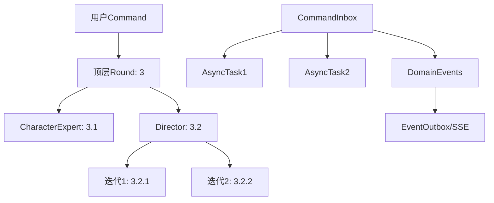

# 多Agent协作追踪设计方案

## 结论摘要

**现有系统已经足够支撑多agent协作和迭代追踪，无需新增核心表。**

使用"分层round（round_path）+ correlation_id + 命令/任务表"就能把"一个command触发多agent协作且可多次迭代"的全过程串起来。

## 系统架构优势

### 三层架构清晰分工

1. **对话层**: `conversation_sessions/rounds` - 用户可见的对话轨迹
2. **工作流层**: `command_inbox/async_tasks/event_outbox` - 任务与状态追踪
3. **事件层**: `domain_events` - 事件流转和SSE实时更新

### 核心设计模式

- **分层round_path**: 天然支持树状结构（1, 1.1, 1.2, 1.2.1...）
- **correlation_id**: 横向链路追踪，串联同一command的所有round
- **原子操作**: CommandInbox + ConversationRound + DomainEvent 同时创建
- **事件驱动**: 通过EventOutbox + SSE实现实时进度更新

## 数据模型分析

### 现有表结构充分支撑

| 表名 | 作用 | 关键字段 |
|------|------|----------|
| `conversation_rounds` | 分层对话轨迹 | `round_path`, `correlation_id` |
| `command_inbox` | 命令生命周期 | `id`, `command_type`, `status` |
| `async_tasks` | Agent任务执行 | `triggered_by_command_id`, `progress` |
| `domain_events` | 事件流转 | `correlation_id`, `causation_id` |
| `event_outbox` | 实时通知 | `topic`, `payload`, `headers` |

### 关键约束保证数据一致性

```sql
-- round_path分层唯一性
UniqueConstraint("session_id", "round_path")

-- correlation_id幂等性
Index("uq_conversation_round_correlation", "session_id", "correlation_id", unique=True)
```

## 工作流建模示例

### 场景：用户命令触发多Agent协作

**用户输入**: "分析角色心理并生成对话"



### 数据流转细节

#### 1. 顶层Round（用户发起）
```json
{
  "session_id": "session_uuid",
  "round_path": "3",
  "role": "user",
  "correlation_id": "cmd_uuid_123",
  "input": {
    "command_type": "analyze_and_generate",
    "command_id": "cmd_uuid_123",
    "payload": {"character_id": "char_001"}
  }
}
```

#### 2. 子Round（Agent协作）
```json
// CharacterExpert分析
{
  "round_path": "3.1",
  "role": "assistant",
  "correlation_id": "cmd_uuid_123",
  "output": {
    "agent_type": "character_expert",
    "agent_id": "expert_001",
    "analysis_result": {...}
  }
}

// Director生成对话
{
  "round_path": "3.2",
  "role": "assistant",
  "correlation_id": "cmd_uuid_123",
  "output": {
    "agent_type": "director",
    "agent_id": "director_001",
    "dialogue_content": {...}
  }
}
```

#### 3. 迭代优化
```json
// 第一次迭代
{
  "round_path": "3.2.1",
  "role": "assistant",
  "correlation_id": "cmd_uuid_123",
  "output": {
    "agent_type": "director",
    "iteration_number": 1,
    "refined_dialogue": {...}
  }
}
```

#### 4. 工作流追踪（后台）
```json
// AsyncTask记录
{
  "triggered_by_command_id": "cmd_uuid_123",
  "task_type": "character_analysis",
  "status": "COMPLETED",
  "progress": 100,
  "result": {...}
}

// DomainEvent链路
{
  "event_type": "Genesis.Session.Agent.Completed",
  "correlation_id": "cmd_uuid_123",
  "causation_id": "parent_event_id",
  "payload": {...}
}
```

## 优势分析

### ✅ 数据一致性
- 原子操作确保Command和Round同时创建
- correlation_id保证链路完整性
- 分层round_path天然支持父子关系

### ✅ 实时性能
- EventOutbox + SSE实现毫秒级状态更新
- correlation_id聚合同一command的所有进展
- 前端按round_path展示协作树状结构

### ✅ 可扩展性
- JSONB字段支持灵活的agent元数据
- round_path支持任意深度的分层
- 事件驱动架构易于添加新的agent类型

### ✅ 可观测性
- correlation_id串联整条链路追踪
- AsyncTask记录详细执行状态
- DomainEvent提供完整事件流

## 与过度设计方案的对比

| 维度 | 现有方案 | 过度设计方案 |
|------|----------|-------------|
| 复杂度 | 简单，复用现有结构 | 复杂，新增多张表 |
| 维护性 | 高，模式统一 | 低，增加维护负担 |
| 性能 | 优，索引优化充分 | 差，多表JOIN查询 |
| 扩展性 | 强，JSONB灵活配置 | 弱，schema变更成本高 |

## 总结

现有的分层round + correlation_id设计是一个**简单而强大**的方案：

1. **足够表达**: 支持任意复杂的多agent协作模式
2. **性能优越**: 单表查询为主，避免复杂JOIN
3. **实时响应**: 事件驱动架构支持毫秒级更新
4. **易于维护**: 复用现有机制，无需引入新概念

**建议**: 专注于规范化使用现有机制，而非重新设计数据模型。