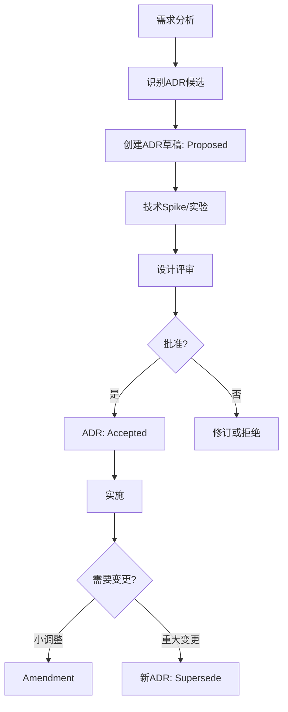
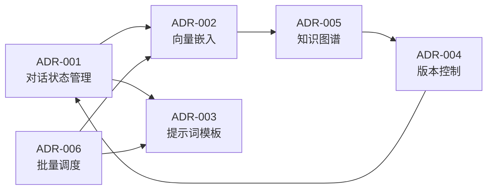

# Architecture Decision Records (ADR) - 小说创世阶段

## 概述

本目录包含小说创世阶段功能的所有架构决策记录（ADR）。这些ADR记录了项目中重要的架构决策、理由、以及实施方案。

## ADR 状态说明

- **Proposed**: 提议中，待评审
- **Accepted**: 已接受，指导实施
- **Rejected**: 已拒绝
- **Superseded**: 已被替代
- **Deprecated**: 已废弃

## Active ADRs

| ID | 标题 | 状态 | 相关需求 | 决策要点 | 更新日期 |
|----|------|------|----------|----------|----------|
| [ADR-001](./20250904-dialogue-state-management.md) | 对话状态管理方案 | Proposed | FR-001/002/003/004/005/009, NFR-001/002 | Redis Session + PostgreSQL持久化 | 2025-09-04 |
| [ADR-002](./20250904-vector-embedding-model.md) | 向量嵌入模型选择 | Proposed | FR-008, NFR-001/003/005 | BGE-M3本地部署方案 | 2025-09-04 |
| [ADR-003](./20250904-prompt-template-management.md) | 提示词模板管理 | Proposed | FR-001至006, NFR-005 | 集中式模板仓库+版本化 | 2025-09-04 |
| [ADR-004](./20250904-content-version-control.md) | 内容版本控制实现 | Proposed | FR-007/009, NFR-002/004 | 快照+增量混合方案 | 2025-09-04 |
| [ADR-005](./20250904-knowledge-graph-schema.md) | 知识图谱Schema设计 | Proposed | FR-003/004/008, NFR-003 | 层级+网状混合模型 | 2025-09-04 |
| [ADR-006](./20250904-batch-task-scheduling.md) | 批量任务调度策略 | Proposed | FR-006, NFR-001/003 | Prefect+Kafka+优先级队列 | 2025-09-04 |

## 决策流程

## ADR 关系图

## 技术栈总览

基于这些ADR，项目的技术选型如下：

### 核心基础设施（已确定）
- **前端**: React + Vite + TypeScript
- **后端**: Python + FastAPI
- **数据库**: PostgreSQL + Redis + Neo4j + Milvus
- **消息队列**: Kafka
- **工作流**: Prefect
- **对象存储**: MinIO
- **AI接口**: LiteLLM

### ADR确定的方案
1. **对话状态**: Redis（快速访问） + PostgreSQL（持久化）
2. **向量模型**: BGE-M3（中文优化，本地部署）
3. **提示词管理**: Git仓库 + Jinja2模板 + 热更新
4. **版本控制**: 快照 + 增量差异存储
5. **知识图谱**: Neo4j混合模型（层级+网状）
6. **批量调度**: Prefect编排 + Kafka分发 + Redis优先级队列

## 实施优先级

### Phase 1: MVP核心（Week 1）
- ✅ ADR-001: 对话状态管理 - **必需**，支撑多轮对话
- ✅ ADR-003: 提示词模板管理 - **必需**，管理AI交互
- ✅ ADR-006: 批量任务调度 - **必需**，支持批量生成

### Phase 2: 质量提升（Week 2）
- ⏳ ADR-002: 向量嵌入模型 - 提升检索质量
- ⏳ ADR-005: 知识图谱Schema - 管理复杂关系

### Phase 3: 完善功能（Week 3+）
- ⏳ ADR-004: 内容版本控制 - 支持历史回溯

## 风险与缓解

| ADR | 主要风险 | 缓解措施 | 优先级 |
|-----|----------|----------|--------|
| ADR-001 | Redis故障导致会话丢失 | PostgreSQL备份，定期同步 | P0 |
| ADR-002 | GPU资源不足 | 支持CPU推理，使用量化模型 | P1 |
| ADR-003 | 模板更新延迟 | Webhook自动同步，缓存失效 | P1 |
| ADR-004 | 存储成本增长 | 快照压缩，冷热分离 | P2 |
| ADR-005 | 图查询性能下降 | 分层查询，定期优化索引 | P1 |
| ADR-006 | 任务堆积 | 背压控制，自动扩容 | P0 |

## 评审与更新

### 评审周期
- 每周技术会议评审Proposed状态的ADR
- 每月回顾Accepted ADR的实施情况
- 季度评估是否需要Supersede现有ADR

### 更新流程
1. 创建新ADR或修订现有ADR
2. 提交PR进行团队评审
3. 至少2名架构师批准
4. 更新状态和本索引文件
5. 通知相关团队实施

## 相关文档

- [需求文档](../requirements.md)
- [产品需求文档(PRD)](../prd.md)
- [高层设计(HLD)](../design-hld.md)（待生成）
- [详细设计(LLD)](../design-lld.md)（待生成）

## ADR 模板

新ADR请使用[模板文件](./adr-template.md)创建。

## 联系方式

- **架构组**: platform-arch@infinite-scribe.com
- **技术负责人**: backend-lead@infinite-scribe.com
- **AI负责人**: ai-lead@infinite-scribe.com

---

**最后更新**: 2025-09-04
**版本**: 1.0.0