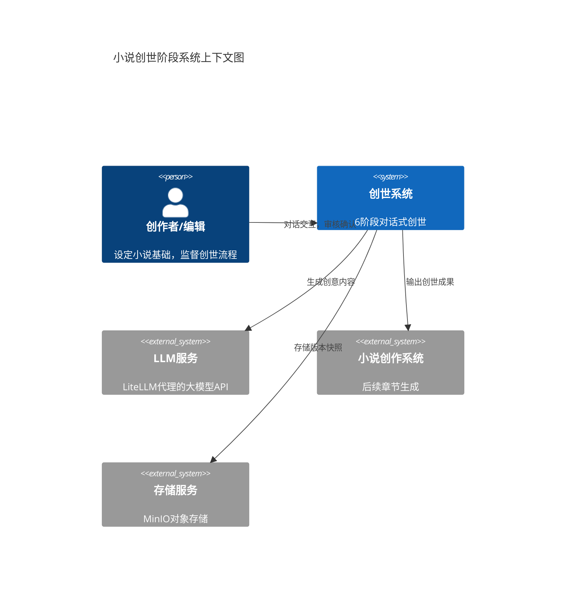
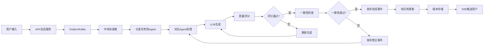
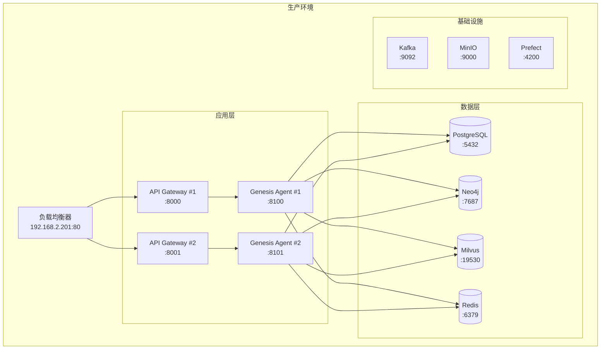

# 高层设计 (High-Level Design)

## 系统概览

小说创世阶段系统是InfiniteScribe平台的核心功能模块，采用**对话式AI协作**模式，通过6个渐进式阶段（Stage 0-5）完成小说创作前的世界观构建。系统基于**事件驱动的微服务架构**，由专门的创世Agent服务处理对话交互，通过Kafka事件总线与其他系统组件协作，使用PostgreSQL持久化对话状态，Neo4j管理知识图谱，Milvus存储向量嵌入，实现"AI主导生成、人类审核微调"的创世流程。

## 需求映射

### 功能需求覆盖 (FR)

| 需求ID | 需求描述 | 设计方案 | 相关组件 |
| ------ | -------- | -------- | -------- |
| FR-001 | 创意种子生成与选择 | 通过Outliner Agent提供多种创作起点，生成3-6个高概念方案，支持方案融合与锁定 | Outliner Agent, Orchestrator, API Gateway, PostgreSQL |
| FR-002 | 立意主题对话系统 | 基于ADR-001通用会话架构，实现3-5轮主题深化对话，支持多种用户操作模式 | API Conversation Service, Orchestrator, Redis缓存 |
| FR-003 | 世界观对话式构建 | 分5个维度构建世界观，支持魔法/科技体系定义，实时一致性校验 | World Builder Agent, Neo4j图数据库 |
| FR-004 | 人物对话式设计 | 8维度人物设定模板，自动生成关系网络，支持对白生成 | Character Expert Agent, Neo4j |
| FR-005 | 情节框架对话构建 | 生成10-20个节点卡，支持三幕/五幕/英雄之旅结构 | Plot Master Agent, Outliner Agent |
| FR-006 | AI批量细节生成 | 批量生成地名、人名等细节，支持风格控制，单批10-50个 | Detail Generator Service, Prefect编排 |
| FR-007 | 内容审核与编辑界面 | 三键操作（接受/修改/重新生成），支持影响分析和版本管理 | React前端, Version Control Service |
| FR-008 | 创世内容知识库 | 自动整理分类，支持全文和向量搜索，多格式导出 | Knowledge Base Service, Milvus, Neo4j |
| FR-009 | 对话历史与版本管理 | 基于ADR-004实现分支管理和时间线回溯 | Version Control Service, MinIO |
| FR-010 | 创作方法论学习系统 | 提供≥10种创作方法论，智能推荐匹配 | Learning Module, Recommendation Engine |

### 非功能需求满足 (NFR)

| 需求ID | 性能/安全/可用性要求 | 设计保障 | 验证方法 |
| ------ | -------------------- | -------- | -------- |
| NFR-001 | 首token响应<3秒，批量生成<5秒 | SSE推送，滑动窗口限流（P2：Token Bucket），Redis缓存 | 负载测试，监控P95延迟 |
| NFR-002 | 月度可用性≥99.5% | 服务冗余，自动重启，故障转移 | 监控告警，定期演练 |
| NFR-003 | 水平扩展，2分钟内完成 | 容器化部署，Kubernetes编排 | 自动扩缩容测试 |
| NFR-004 | JWT认证，TLS加密 | RBAC权限控制，字段级加密 | 安全审计，渗透测试 |
| NFR-005 | AI采纳率≥70% | 质量评分系统，Qwen3-Embedding相似度 | A/B测试，用户反馈 |
| NFR-006 | FCP<1.5秒，TTI<3秒 | React代码分割，CDN加速 | Lighthouse性能测试 |
| NFR-007 | 监控100%覆盖 | Langfuse观测，结构化日志 | 监控大盘，日志分析 |
| NFR-008 | GDPR/CCPA合规 | 数据脱敏，审计追踪 | 合规审查，定期审计 |

### 架构决策引用 (ADR)

| ADR编号 | 决策主题 | 选择方案 | 影响范围 |
| ------- | -------- | -------- | -------- |
| ADR-001 | 对话状态管理 | 通用会话架构+Redis缓存 | 对话引擎，状态持久化 |
| ADR-002 | 向量嵌入模型 | Qwen3-Embedding 0.6B | 相似度搜索，质量评分 |
| ADR-004 | 内容版本控制 | 快照+增量混合方案 | 版本管理，分支合并 |
| ADR-005 | 知识图谱Schema | 层级+网状混合模型 | 世界观管理，人物关系 |
| ADR-006 | 批量任务调度 | Prefect+Outbox模式 | 细节生成，任务编排 |

## 系统架构

### 系统边界



### 容器视图

```mermaid
C4Container
    title 创世系统容器架构图 (事件驱动架构)

    Container(web, "Web应用", "React/Vite", "对话界面，内容审核")
    Container(api, "API + Conversation Service", "FastAPI", "请求路由，SSE推送，会话管理")
    Container(orchestrator, "中央协调者", "Python", "事件路由，任务分发")
    
    Container_Boundary(agents, "Agent服务群") {
        Container(outliner, "Outliner Agent", "Python", "大纲生成")
        Container(worldbuilder, "Worldbuilder Agent", "Python", "世界观构建")
        Container(character, "Character Agent", "Python", "人物设计")
        Container(plot, "Plot Master Agent", "Python", "情节框架")
        Container(writer, "Writer Agent", "Python", "内容生成")
        Container(reviewer, "Review Agent", "Python", "质量评审")
        Container(rewriter, "Rewriter Agent", "Python", "内容重写")
        Container(detail_gen, "Detail Generator", "Python", "批量细节生成")
    }
    
    Container(knowledge, "知识库服务", "Python", "内容组织检索")
    Container(version, "版本控制", "Python", "分支管理，快照存储")

    ContainerDb(postgres, "PostgreSQL", "关系数据库", "会话、元数据、Outbox")
    ContainerDb(neo4j, "Neo4j", "图数据库", "知识图谱")
    ContainerDb(milvus, "Milvus", "向量数据库", "语义搜索")
    ContainerDb(redis, "Redis", "缓存", "会话缓存")
    ContainerQueue(kafka, "Kafka", "事件总线", "异步消息传递")
    Container(prefect, "Prefect", "工作流引擎", "任务编排调度")
    Container(storage, "对象存储", "MinIO/S3", "快照与大文件存储")  

    Rel(web, api, "HTTPS/REST, SSE")
    Rel(api, redis, "缓存读写")
    Rel(api, postgres, "持久化+Outbox")
    
    Rel(postgres, kafka, "Outbox发送")
    Rel(orchestrator, kafka, "消费领域事件")
    Rel(orchestrator, prefect, "任务调度")
    Rel(prefect, kafka, "发布能力任务")
    
    Rel(outliner, kafka, "消费/发布事件")
    Rel(worldbuilder, kafka, "消费/发布事件")
    Rel(character, kafka, "消费/发布事件")
    Rel(plot, kafka, "消费/发布事件")
    Rel(writer, kafka, "消费/发布事件")
    Rel(reviewer, kafka, "消费/发布事件")
    Rel(rewriter, kafka, "消费/发布事件")
    Rel(detail_gen, kafka, "消费/发布事件")
    
    Rel(agents, knowledge, "查询知识")
    Rel(knowledge, neo4j, "图查询")
    Rel(knowledge, milvus, "向量检索")
    Rel(version, postgres, "元数据")
    Rel(version, storage, "快照存储")
    Rel(kafka, api, "事件订阅(SSE)")

```

### 事件驱动架构说明

系统采用事件驱动的微服务架构，核心组件包括：

1. **中央协调者（Orchestrator）**：
   - 消费领域事件（`genesis.session.events`）
   - 根据业务规则和当前阶段决定需要调用的Agent
   - 通过Prefect编排复杂工作流
   - 发布任务事件到对应Agent的task topic

2. **专门化Agent服务**：
   - **Outliner Agent**：负责大纲和高概念生成（Stage 0, 4）
   - **Worldbuilder Agent**：构建世界观设定（Stage 2）
   - **Character Agent**：设计人物和关系网络（Stage 3）
   - **Plot Master Agent**：情节框架和节点卡（Stage 4）
   - **Writer Agent**：内容生成和润色
   - **Review Agent**：质量评审和一致性检查
   - **Rewriter Agent**：内容重写和优化
   - **Detail Generator**：批量细节生成（Stage 5）

3. **事件流转机制**：
   ```
   用户请求 → API网关(含会话服务) → PostgreSQL(Outbox)
   → Kafka(领域事件) → 中央协调者 → Prefect任务编排
   → Kafka(能力任务) → 专门Agent → Kafka(结果事件)
   → 中央协调者 → Kafka(领域事件) → API(SSE) → 用户
   ```

4. **优势**：
   - 各Agent独立部署和扩展
   - 失败隔离，单个Agent故障不影响其他服务
   - 灵活的工作流编排
   - 完整的事件追踪和审计

## 数据流设计

### 主要数据流



说明（对齐 core-workflows 与 ADR）：
- 创世开始（Genesis.Session.Started）即创建 Novel 记录（status=GENESIS）以获取 novel_id；conversation_sessions.scope_type=GENESIS，scope_id=novel_id。
- 所有领域事件（请求/结果）统一落地 Outbox 并发布到 Kafka，由 Prefect 编排暂停/恢复驱动后续步骤（详见 docs/architecture/core-workflows.md）。
- Agent 处理遵循“至少一次 + 指数退避 + DLT”策略；分区 key 统一使用 `session_id` 保序。

### 控制流设计

```mermaid
stateDiagram-v2
    [*] --> 未开始
    未开始 --> Stage0_进行中: 开始创世

    Stage0_进行中 --> Stage0_待审核: 生成高概念
    Stage0_待审核 --> Stage0_已锁定: 用户确认
    Stage0_待审核 --> Stage0_进行中: 用户修改

    Stage0_已锁定 --> Stage1_进行中: 进入主题阶段
    Stage1_进行中 --> Stage1_待审核: 主题生成
    Stage1_待审核 --> Stage1_已锁定: 确认主题

    Stage1_已锁定 --> Stage2_进行中: 构建世界观
    Stage2_进行中 --> Stage2_待审核: 世界观完成
    Stage2_待审核 --> Stage2_已锁定: 确认世界观

    Stage2_已锁定 --> Stage3_进行中: 设计人物
    Stage3_进行中 --> Stage3_待审核: 人物完成
    Stage3_待审核 --> Stage3_已锁定: 确认人物

    Stage3_已锁定 --> Stage4_进行中: 构建情节
    Stage4_进行中 --> Stage4_待审核: 情节完成
    Stage4_待审核 --> Stage4_已锁定: 确认情节

    Stage4_已锁定 --> Stage5_进行中: 完善细节
    Stage5_进行中 --> Stage5_待审核: 细节完成
    Stage5_待审核 --> Stage5_已锁定: 确认细节

    Stage5_已锁定 --> 创世完成
    创世完成 --> [*]
```



## 接口设计（高层）

### 外部接口

| 接口类型 | 协议 | 用途 | SLA要求 |
| -------- | ---- | ---- | ------- |
| REST API | HTTPS | 客户端交互 | 99.9% 可用性 |
| SSE | HTTPS | 事件推送 | 首token < 3秒 |

说明：当前阶段（P1）仅支持 REST + SSE；WebSocket 与 gRPC 暂未使用（如需双向低延迟或强契约跨服务通信，P2 再评估）。

### 内部接口

| 组件间接口 | 通信方式 | 数据格式 | 频率估算 |
| ---------- | -------- | -------- | -------- |
| API→Redis | 同步调用 | JSON | 500 QPS |
| API→PostgreSQL | 事务写入 | JSON | 100 QPS |
| Orchestrator→Kafka | 事件消费/发布 | JSON Envelope | 200 msgs/s |
| Agents→Kafka | 事件消费/发布 | JSON Envelope | 50 msgs/s per agent |
| Agents→LLM | HTTPS | JSON | 50 QPS total |
| Agents→Knowledge | 同步调用 | JSON | 200 QPS |
| Prefect→Kafka | 任务编排 | JSON | 100 msgs/s |

### SSE 细节（实现对齐）

- 并发限制：每用户最多 2 条连接（超限返回 429，`Retry-After` 按配置）。
- 心跳与超时：`ping` 间隔 15s，发送超时 30s；自动检测客户端断连并清理。
- 重连语义：支持 `Last-Event-ID` 续传近期事件（Redis 历史 + 实时聚合队列）。
- 健康检查：`/api/v1/events/health` 返回 Redis 状态与连接统计；异常时 503。
- 响应头：`Cache-Control: no-cache`、`Connection: keep-alive`。
- 鉴权：`POST /api/v1/auth/sse-token` 获取短时效 `sse_token`（默认 60s），`GET /api/v1/events/stream?sse_token=...` 建立连接。
- SLO 口径：重连场景不计入“首 Token”延迟；新会话从事件生成时刻开始计时。

以上与当前 sse-starlette + Redis 实现一致。

## 容量规划

### 容量估算

| 指标 | 当前需求 | 峰值需求 | 增长预测 |
| ---- | -------- | -------- | -------- |
| 并发会话 | 100 | 500 | 每月30% |
| 对话轮次/会话 | 20 | 50 | - |
| 存储容量 | 10GB | 100GB | 每月5GB |
| 向量数据 | 100万条 | 1000万条 | 每月10万条 |
| 图节点 | 10万个 | 100万个 | 每月1万个 |

### 扩展策略

- **水平扩展**：所有Agent服务无状态设计，支持Kubernetes HPA独立扩展
- **缓存策略**：Redis写透缓存，30天TTL
- **数据分片**：按novel_id分片，支持多租户隔离
- **异步处理**：批量任务通过Prefect+Kafka解耦
- **Agent扩展**：每个Agent可根据负载独立扩展副本数

## 性能与可扩展性

### 性能目标

| 指标 | 目标 | 测量方法 |
| ---- | ---- | -------- |
| 首token延迟 (p95) | < 3秒 | SSE事件监控 |
| 完整响应 (p95) | < 30秒 | API端点监控 |
| 批量生成 | < 5秒 | Prefect任务监控 |
| 向量检索 | < 400ms | Milvus查询监控 |
| 图查询 | < 200ms | Neo4j查询监控 |

### 缓存策略

- **会话缓存**：Redis存储活跃会话，写透更新
- **结果缓存**：LRU缓存最近生成内容
- **向量缓存**：热点embedding本地缓存
- **查询缓存**：频繁查询结果缓存

### 可扩展性方法

- 所有Agent服务水平扩展（无状态）
  - Outliner/Worldbuilder/Character/Plot等Agent独立扩展
  - 基于Kafka消费组实现负载均衡
- PostgreSQL读写分离
- Neo4j集群部署
- Milvus分片索引
- Kafka分区并行消费
- Orchestrator多实例部署，分区消费

## 技术栈选择

### 核心技术决策

| 层级 | 技术选择 | 选择理由 | ADR引用 |
| ---- | -------- | -------- | ------- |
| 前端 | React + Vite | 快速开发，丰富生态 | 已确定 |
| 后端 | Python + FastAPI | 异步性能，AI生态 | 已确定 |
| 对话管理 | Redis + PostgreSQL(conversation_sessions/rounds) + Outbox | 缓存+写通持久化 | ADR-001 |
| 向量搜索 | Milvus + Qwen3 | 自托管，低成本 | ADR-002 |
| 知识图谱 | Neo4j | 复杂关系管理 | ADR-005 |
| 版本控制 | MinIO + PostgreSQL | 快照+增量 | ADR-004 |
| 任务调度 | Prefect + Kafka | 可靠编排 | ADR-006 |
| 事件总线 | Kafka | 高吞吐，持久化 | 已确定 |

### 架构决策依据

- **为什么选择SSE而非WebSocket**：创世对话主要是单向推送，SSE更简单可靠
- **为什么选择Qwen3-Embedding**：本地部署，无API费用，768维足够表达语义
- **为什么选择Neo4j**：原生图数据库，支持复杂关系查询和约束
- **为什么选择Prefect**：Python原生，支持动态工作流，易于调试

### 核心库文档（必需）

- **LiteLLM** (v1.0+)
  - 统一的LLM接口，支持多模型切换
  - 自动重试和负载均衡
  - 成本追踪和限流
  - 与FastAPI无缝集成

- **Pydantic** (v2.0+)
  - 数据验证和序列化
  - OpenAPI schema生成
  - 类型安全保证
  - 与SQLAlchemy集成

- **Redis-py** (v5.0+)
  - 异步支持
  - 连接池管理
  - Lua脚本支持（Token Bucket，P2）
  - 发布订阅功能

- **Neo4j Python Driver** (v5.0+)
  - 异步查询支持
  - 事务管理
  - 连接池优化
  - Cypher查询构建器

## 安全考虑

### 安全架构

- **认证与授权**：JWT令牌（24小时）+ 刷新令牌（30天），RBAC权限模型
- **数据保护**：
  - 传输加密：TLS 1.3
  - 存储加密：字段级加密（敏感数据）
  - 服务端解密：受控域内处理
- **内容安全**（P1 基线，P2 强化）：
  - 违法与风险内容拦截（高覆盖率策略 + 人审闭环；不承诺 100%）
  - 暴力/色情标记（模型 + 规则）
  - 版权相似度检测（向量相似度 + 阈值，示例阈值 <30% 视业务调整）
- **API安全**：
  - 速率限制（P1：滑动窗口；P2：Redis Lua Token Bucket）
  - API密钥管理（LiteLLM）
  - 请求签名验证（P2）

### 安全合规

- **合规标准**：GDPR（欧盟）、CCPA（加州）、个人信息保护法（中国）
- **数据权利**：访问权、更正权、删除权、导出权
- **审计追踪**：所有关键操作记录，90天保留期
- **安全审计**：定期渗透测试，漏洞扫描

## 风险评估

### 技术风险

| 风险项 | 影响等级 | 概率 | 缓解措施 |
| ------ | -------- | ---- | -------- |
| LLM API不稳定 | 高 | 中 | 多模型备份，本地缓存，降级策略 |
| 上下文超限 | 中 | 高 | 自动摘要，分段处理，滑动窗口 |
| 一致性冲突 | 高 | 中 | 实时校验，图约束，版本回滚 |
| Redis故障 | 中 | 低 | 主从复制，持久化，降级到DB |

### 业务风险

| 风险项 | 影响 | 应对策略 |
| ------ | ---- | -------- |
| 生成质量低 | 用户流失 | 质量评分，人工审核，持续优化 |
| 对话疲劳 | 完成率低 | 智能跳过，预设模板，批量操作 |
| 成本失控 | 利润下降 | Token限额，成本监控，模型选择 |

## 部署架构

### 部署拓扑



### 环境规划

| 环境 | 用途 | 配置规格 | 高可用要求 |
| ---- | ---- | -------- | ---------- |
| 开发 | 本地开发 | Docker Compose | 无 |
| 测试 | 集成测试 | 192.168.2.202 | 基本 |
| 预生产 | 验证发布 | 192.168.2.201 | 同生产 |
| 生产 | 线上服务 | Kubernetes集群 | 99.9% |

## 回滚策略

### 回滚触发条件

- 质量评分急剧下降（<6分持续10分钟）
- 一致性错误率>10%
- API响应时间>10秒（P95）
- 内存/CPU使用率>90%持续5分钟

### 回滚方案

1. **应用层回滚**：
   - Blue-Green部署，快速切换
   - 保留最近3个版本镜像
   - 回滚时间<2分钟

2. **数据库回滚**：
   - 基于ADR-004版本控制
   - 支持分支切换和合并
   - 保留30天历史快照

3. **配置回滚**：
   - 环境变量版本化
   - ConfigMap版本管理
   - 即时生效无需重启

4. **内容回滚**：
   - 支持阶段级回滚
   - 保留所有对话历史
   - 分支管理避免数据丢失

## 监控与可观测性

### 关键指标（含 SSE/Kafka/Outbox）

| 层级 | 监控指标 | 告警阈值 | 响应级别 |
| ---- | -------- | -------- | -------- |
| 系统 | CPU/内存/磁盘 | >80% | P2 |
| 应用 | 响应时间 (P95) | >5秒 | P1 |
| SSE  | 活跃连接数/重连次数/历史补发量 | 异常跃迁 | P1 |
| Kafka | 消费/生产速率、分区滞后 | 滞后持续上升 | P1 |
| Outbox | 待发送队列深度、失败重试率 | 深度>阈值 | P1 |
| 业务 | 生成成功率 | <90% | P0 |
| 质量 | AI采纳率 | <60% | P1 |

### 观测体系

- **日志**：
  - 结构化JSON日志
  - ELK Stack收集分析
  - 日志级别动态调整

- **指标**：
  - Prometheus采集
  - Grafana可视化
  - 自定义业务指标（首 Token/完整响应时延、Kafka 滞后、Outbox 深度、Neo4j/Milvus 查询分位）

- **追踪**：
  - Langfuse LLM观测
  - 分布式追踪（Jaeger，P2）
  - 会话级追踪（请求级 trace_id + Envelope.correlation_id 透传）

- **告警**：
  - 分级告警策略
  - PagerDuty集成
  - 自动升级机制

## 事件设计（基于事件命名规范）

### 核心领域事件

遵循 `docs/architecture/event-naming-conventions.md` 规范：
`<Domain>.<AggregateRoot>.<OptionalSubAggregate>.<ActionInPastTense>`。
创世阶段以 `Genesis.Session` 为聚合根，动作动词严格使用受控词表（Requested/Proposed/Confirmed/Updated/Completed/Finished/Failed/Branched 等）。

主要事件列表：

```yaml
# Stage 0 - 创意种子
Genesis.Session.Started                    # 创世会话开始（此时即创建 Novel 记录，status=GENESIS）
Genesis.Session.SeedRequested              # 请求生成创意种子
Genesis.Session.ConceptProposed            # AI提出高概念方案
Genesis.Session.ConceptConfirmed           # 用户确认高概念
Genesis.Session.StageCompleted             # 阶段完成

# Stage 1 - 立意主题
Genesis.Session.Theme.Requested            # 请求生成主题
Genesis.Session.Theme.Proposed             # AI提出主题方案
Genesis.Session.Theme.Revised              # 主题被修订
Genesis.Session.Theme.Confirmed            # 主题确认

# Stage 2 - 世界观
Genesis.Session.World.Created              # 世界观创建
Genesis.Session.World.Updated              # 世界观更新
Genesis.Session.World.ValidationCompleted  # 一致性验证完成

# Stage 3 - 人物
Genesis.Session.Character.Created          # 人物创建
Genesis.Session.Character.Updated          # 人物更新
Genesis.Session.CharacterNetwork.Created   # 关系网络生成

# Stage 4 - 情节
Genesis.Session.Plot.Created               # 情节框架创建
Genesis.Session.Plot.NodeCreated           # 节点卡创建

# Stage 5 - 细节
Genesis.Session.Details.Requested          # 请求批量生成
Genesis.Session.Details.Completed          # 细节生成完成

# 通用事件
Genesis.Session.Finished                   # 创世完成
Genesis.Session.Failed                     # 创世失败
Genesis.Session.BranchCreated              # 版本分支创建
```

### 事件负载结构

```python
{
    "event_id": "uuid",
    "aggregate_id": "session_id",
    "aggregate_type": "GenesisSession",
    "correlation_id": "flow_id",
    "causation_id": "previous_event_id",
    "payload": {
        "session_id": "uuid",
        "novel_id": "uuid",          # 创世开始即创建并返回 novel_id
        "stage": "Stage_0",
        "user_id": "uuid",
        "content": {},  # 具体内容
        "quality_score": 8.5,
        "timestamp": "ISO-8601"
    },
    "metadata": {
        "version": 1,
        "source": "genesis-agent",
        "trace_id": "uuid"
    }
}
```

### 事件与 Topic 映射（领域总线 + 能力总线）

- 类型命名：事件类型遵循 `docs/architecture/event-naming-conventions.md`，作为 Envelope/DomainEvent 的 `event_type`（例如：`Genesis.Session.Theme.Proposed`）。
- 传输格式：统一使用 JSON Envelope（已在 Agents 落地），Avro 作为 P2 选项。

领域总线（Facts，对外暴露）：
- `genesis.session.events`（仅承载 Genesis.Session.* 等领域事实；UI/SSE/审计只订阅此总线）

能力总线（Capabilities，内部）：
- Outliner：`genesis.outline.tasks` / `genesis.outline.events`
- Writer：`genesis.writer.tasks` / `genesis.writer.events`
- Review（评论家）：`genesis.review.tasks` / `genesis.review.events`
- Worldbuilder：`genesis.world.tasks` / `genesis.world.events`
- Character：`genesis.character.tasks` / `genesis.character.events`
- Plot：`genesis.plot.tasks` / `genesis.plot.events`
- FactCheck：`genesis.factcheck.tasks` / `genesis.factcheck.events`
- Rewriter：`genesis.rewriter.tasks` / `genesis.rewriter.events`
- Worldsmith：`genesis.worldsmith.tasks` / `genesis.worldsmith.events`

路由职责（中央协调者/Orchestrator）：
- 消费 `genesis.session.events`（领域事实），按业务决策派发能力“请求事实”（`*.Requested`）到对应 `*.tasks`。
- 消费各 `*.events` 的能力结果（`*.Created/Updated/Completed/...`），合成领域事实并写回 `genesis.session.events`。

示例映射：

```
# 领域请求 → 能力任务
Envelope.type: Genesis.Session.Theme.Requested       -> topic: genesis.outline.tasks (Chapter.Outline.GenerationRequested)

# 能力结果 → 领域事实
Envelope.type: Chapter.Outline.Created               -> topic: genesis.outline.events
Orchestrator 合成: Genesis.Session.Plot.Created      -> topic: genesis.session.events
```

注意：DLT 使用统一后缀 `.DLT`（如 `genesis.writer.events.DLT`）。分区键：会话级事件用 `session_id`，章节类能力用 `chapter_id` 保序。

## 数据模型设计

### PostgreSQL表结构（对齐 ADR-001）

采用通用对话表 conversation_sessions + conversation_rounds（PostgreSQL 持久化）与 Redis 写通缓存；并保留事务性 Outbox。

```sql
-- 会话表（conversation_sessions）
CREATE TABLE conversation_sessions (
    id UUID PRIMARY KEY,
    scope_type TEXT NOT NULL,                 -- GENESIS/CHAPTER/REVIEW/...
    scope_id TEXT NOT NULL,                   -- 绑定业务实体ID（创世阶段=novel_id）
    status TEXT NOT NULL DEFAULT 'ACTIVE',    -- ACTIVE/COMPLETED/ABANDONED/PAUSED
    stage TEXT,                               -- 当前业务阶段（可选）
    state JSONB,                              -- 会话聚合/摘要
    version INTEGER NOT NULL DEFAULT 0,       -- 乐观锁版本（OCC）
    created_at TIMESTAMPTZ NOT NULL DEFAULT NOW(),
    updated_at TIMESTAMPTZ NOT NULL DEFAULT NOW()
);
CREATE INDEX IF NOT EXISTS idx_conv_sessions_scope ON conversation_sessions (scope_type, scope_id);
CREATE INDEX IF NOT EXISTS idx_conv_sessions_updated_at ON conversation_sessions (updated_at DESC);

-- 轮次表（conversation_rounds）
CREATE TABLE conversation_rounds (
    session_id UUID NOT NULL REFERENCES conversation_sessions(id) ON DELETE CASCADE,
    round_path TEXT NOT NULL,                 -- '1','2','2.1','2.1.1'
    role TEXT NOT NULL,                       -- user/assistant/system/tool
    input JSONB,
    output JSONB,
    tool_calls JSONB,
    model TEXT,
    tokens_in INTEGER,
    tokens_out INTEGER,
    latency_ms INTEGER,
    cost NUMERIC,
    correlation_id TEXT,
    created_at TIMESTAMPTZ NOT NULL DEFAULT NOW(),
    PRIMARY KEY (session_id, round_path)
);
CREATE INDEX IF NOT EXISTS idx_conv_rounds_session_created ON conversation_rounds (session_id, created_at);
CREATE INDEX IF NOT EXISTS idx_conv_rounds_correlation ON conversation_rounds (correlation_id);

-- 事件发件箱（Outbox，事务性可靠投递）
CREATE TABLE event_outbox (
    id UUID PRIMARY KEY DEFAULT gen_random_uuid(),
    topic TEXT NOT NULL,                         -- 主题（Kafka / 逻辑主题）
    key TEXT,                                   -- key（顺序/分区控制）
    partition_key TEXT,                         -- 分区键（可选）
    payload JSONB NOT NULL,                     -- 事件载荷
    headers JSONB,                              -- 元信息（event_type、version、trace 等）
    status outbox_status NOT NULL DEFAULT 'PENDING',
    retry_count INT NOT NULL DEFAULT 0,
    max_retries INT NOT NULL DEFAULT 5,
    last_error TEXT,
    scheduled_at TIMESTAMPTZ,                   -- 延迟发送（可选）
    sent_at TIMESTAMPTZ,                        -- 成功发送时间
    created_at TIMESTAMPTZ NOT NULL DEFAULT now()
);
CREATE INDEX idx_event_outbox_status ON event_outbox(status);
CREATE INDEX idx_event_outbox_topic ON event_outbox(topic);
CREATE INDEX idx_event_outbox_created_at ON event_outbox(created_at);
CREATE INDEX idx_event_outbox_pending_scheduled ON event_outbox(status, scheduled_at);
CREATE INDEX idx_event_outbox_retry_count ON event_outbox(retry_count);
CREATE INDEX idx_event_outbox_topic_status ON event_outbox(topic, status);
CREATE INDEX idx_event_outbox_status_created ON event_outbox(status, created_at);
CREATE INDEX idx_event_outbox_key ON event_outbox(key);
CREATE INDEX idx_event_outbox_partition_key ON event_outbox(partition_key);
```

说明：
- conversation_sessions/rounds 为通用对话持久化表；Redis 作为缓存，采用“写通 PG→回填 Redis、读优先 Redis”的策略（详见 ADR-001）。
- 已删除未使用的 `genesis_sessions` 表与模型；创世阶段改以 conversation_sessions 聚合，并以 novel_id 作为 scope_id 绑定。
- 章节内容版本采用现有 `chapter_versions`（含 MinIO URL），不再使用通用 `content_versions`。
- Outbox：沿用 `EventOutbox`（字段与索引如上）作为唯一真相源，通过 DB 函数批处理发送与重试。

### Neo4j图模型（ADR-005）

```cypher
// 小说节点
CREATE (n:Novel {
    id: 'uuid',
    app_id: 'infinite-scribe',
    title: 'string',
    created_at: datetime()
})

// 角色节点（8维度）
CREATE (c:Character {
    id: 'uuid',
    novel_id: 'uuid',
    name: 'string',
    appearance: 'text',      // 外貌
    personality: 'text',     // 性格
    background: 'text',      // 背景
    motivation: 'text',      // 动机
    goals: 'text',          // 目标
    obstacles: 'text',      // 障碍
    arc: 'text',            // 转折
    wounds: 'text'          // 心结
})

// 世界规则节点
CREATE (w:WorldRule {
    id: 'uuid',
    novel_id: 'uuid',
    dimension: 'string',    // 地理/历史/文化/规则/社会
    rule: 'text',
    examples: 'json',
    constraints: 'json'
})

// 关系定义
CREATE (c1:Character)-[:RELATES_TO {strength: 8}]->(c2:Character)
CREATE (c:Character)-[:BELONGS_TO]->(n:Novel)
CREATE (w:WorldRule)-[:GOVERNS]->(n:Novel)
CREATE (w1:WorldRule)-[:CONFLICTS_WITH]->(w2:WorldRule)
```

### Milvus向量集合（ADR-002）

```python
collection_schema = {
    "name": "novel_embeddings",
    "fields": [
        {"name": "id", "type": DataType.INT64, "is_primary": True},
        {"name": "novel_id", "type": DataType.VARCHAR, "max_length": 36},
        {"name": "content_type", "type": DataType.VARCHAR, "max_length": 50},
        {"name": "content", "type": DataType.VARCHAR, "max_length": 8192},
        {"name": "embedding", "type": DataType.FLOAT_VECTOR, "dim": 768}
    ],
    "index": {
        "type": "HNSW",
        "metric": "COSINE",
        "params": {"M": 32, "efConstruction": 200}
    }
}
```

## 批量任务调度（基于ADR-006）

### Prefect工作流定义

```python
from prefect import flow, task
from prefect.tasks import task_input_hash
from datetime import timedelta

@task(
    retries=3,
    retry_delay_seconds=60,
    cache_key_fn=task_input_hash,
    cache_expiration=timedelta(hours=1)
)
async def generate_batch_details(
    category: str, 
    count: int, 
    style: str
) -> List[str]:
    """批量生成细节任务"""
    pass

@flow(name="genesis-detail-generation")
async def detail_generation_flow(
    novel_id: str,
    categories: List[str],
    style: str
):
    """细节生成工作流"""
    # 发布到Outbox
    await publish_to_outbox({
        "event_type": "Genesis.Session.Details.Requested",
        "novel_id": novel_id
    })
    
    # 并行生成各类细节
    futures = []
    for category in categories:
        future = await generate_batch_details.submit(
            category=category,
            count=get_count_for_category(category),
            style=style
        )
        futures.append(future)
    
    # 等待所有任务完成
    results = await gather(*futures)
    
    # 发布完成事件
    await publish_to_outbox({
        "event_type": "Genesis.Session.Details.Completed",
        "novel_id": novel_id,
        "results": results
    })
```

### 限流实现

- 当前（P1）：滑动窗口限流（Redis 存储请求时间戳窗口），已通过中间件应用于关键端点。
- 规划（P2）：迁移至 Redis Lua 令牌桶（Token Bucket）以获得更平滑的限速与更好的峰值控制。

## 交付物

生成的HLD文档包含：

- ✅ 系统架构图（C4模型）
- ✅ 数据流和控制流图
- ✅ 需求映射矩阵（FR/NFR/ADR）
- ✅ 容量规划表
- ✅ 风险评估矩阵
- ✅ 部署拓扑图
- ✅ 回滚策略说明
- ✅ 事件设计规范
- ✅ 数据模型定义
- ✅ 监控指标体系

## 审批流程

HLD完成后需要：

1. **架构师审核**：验证技术方案可行性
2. **产品负责人**：确认需求覆盖完整性
3. **运维团队**：评估部署和运维复杂度
4. **安全团队**：审核安全设计和合规性

---

**文档版本**: 1.0  
**创建日期**: 2025-09-05  
**状态**: 待审批  
**下一步**: 生成低层设计（LLD）

## 近期行动项（两周内）

- 对齐接口与通道：HLD 明确 P1=REST+SSE，移除 WebSocket/gRPC（标 P2）。
- 事件规范：采用 JSON Envelope + 命名规范，补充“事件类型→Topic”映射清单并与 `AGENT_TOPICS` 同步。
- SSE 文档化：并发/心跳/重连/健康接口/429 Retry-After 与 Last-Event-ID 重连语义。
- Outbox Sender：实现基于 `event_outbox` 的发送器与重试回退，补集成/e2e 验证。
- 指标与 SLO：首 Token/完整响应埋点；SSE/Kafka/Outbox 指标入 Prometheus。
- 限流计划：P1 滑动窗口已启用；评估 P2 Redis Lua Token Bucket 迁移可行性。
