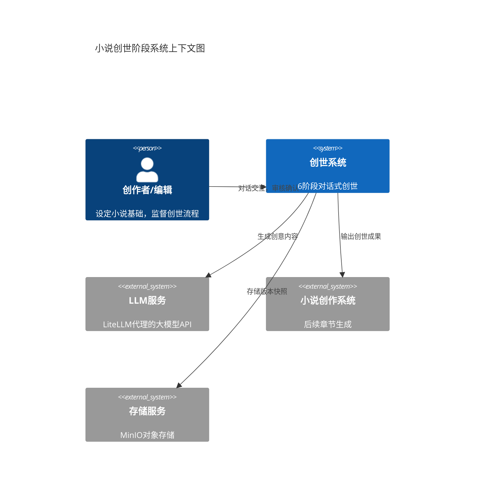
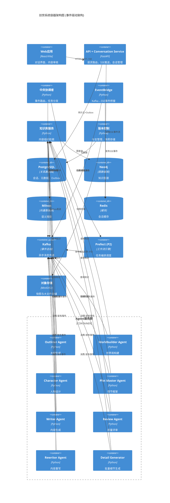
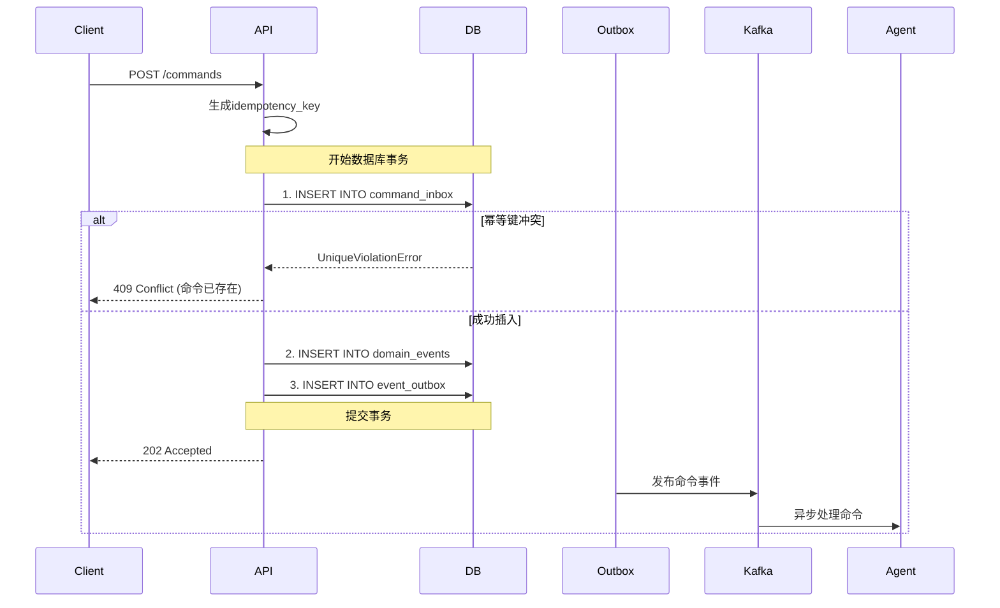
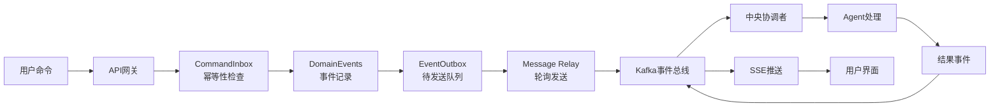
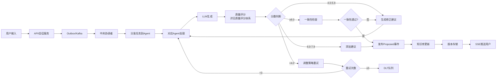
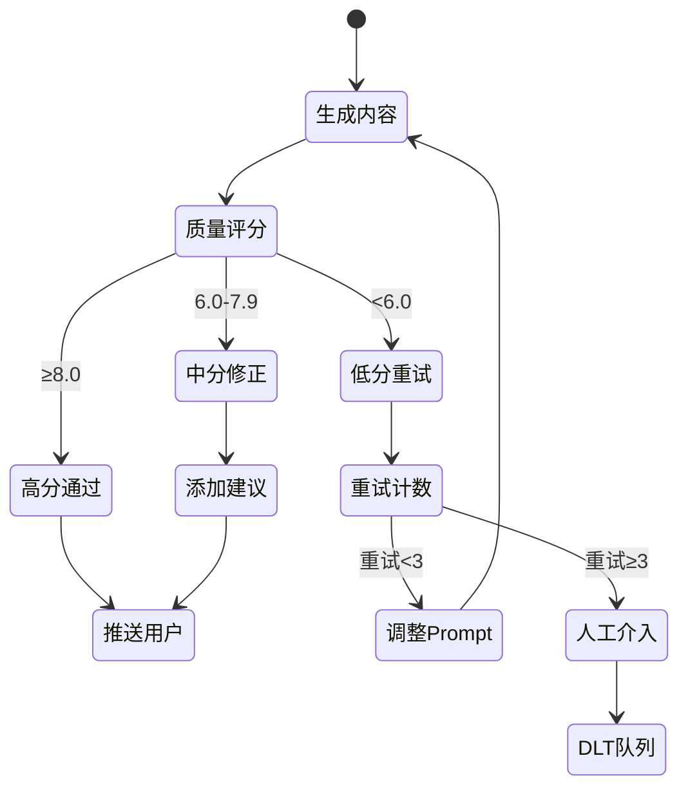

# 高层设计 (High-Level Design)

## 系统概览

小说创世阶段系统是InfiniteScribe平台的核心功能模块，采用**对话式AI协作**模式，通过6个渐进式阶段（Stage
0-5）完成小说创作前的世界观构建。系统基于**事件驱动的微服务架构**，由专门的创世Agent服务处理对话交互，通过Kafka事件总线与其他系统组件协作，使用PostgreSQL持久化对话状态，Neo4j管理知识图谱，Milvus存储向量嵌入，实现"AI主导生成、人类审核微调"的创世流程。

## 需求映射

### 功能需求覆盖 (FR)

| 需求ID | 需求描述           | 设计方案                                                                    | 相关组件                                              |
| ------ | ------------------ | --------------------------------------------------------------------------- | ----------------------------------------------------- |
| FR-001 | 创意种子生成与选择 | 通过Outliner Agent提供多种创作起点，生成3-6个高概念方案，支持方案融合与锁定 | Outliner Agent, Orchestrator, API Gateway, PostgreSQL |
| FR-002 | 立意主题对话系统   | 基于ADR-001通用会话架构，实现3-5轮主题深化对话，支持多种用户操作模式        | API Conversation Service, Orchestrator, Redis缓存     |
| FR-003 | 世界观对话式构建   | 分5个维度构建世界观，支持魔法/科技体系定义，实时一致性校验                  | World Builder Agent, Neo4j图数据库                    |
| FR-004 | 人物对话式设计     | 8维度人物设定模板，自动生成关系网络，支持对白生成                           | Character Expert Agent, Neo4j                         |
| FR-005 | 情节框架对话构建   | 生成10-20个节点卡，支持三幕/五幕/英雄之旅结构                               | Plot Master Agent, Outliner Agent                     |
| FR-006 | AI批量细节生成     | 批量生成地名、人名等细节，支持风格控制，单批10-50个                         | P1: Outbox模式; P2: Prefect编排                      |
| FR-007 | 内容审核与编辑界面 | 三键操作（接受/修改/重新生成），支持影响分析和版本管理                      | React前端, Version Control Service                    |
| FR-008 | 创世内容知识库     | 自动整理分类，支持全文和向量搜索，多格式导出                                | Knowledge Base Service, Milvus, Neo4j                 |
| FR-009 | 对话历史与版本管理 | 基于ADR-004实现分支管理和时间线回溯                                         | Version Control Service, MinIO                        |
| FR-010 | 创作方法论学习系统 | 提供≥10种创作方法论，智能推荐匹配                                           | Learning Module, Recommendation Engine                |

### 非功能需求满足 (NFR)

| 需求ID  | 性能/安全/可用性要求          | 设计保障                                             | 验证方法              |
| ------- | ----------------------------- | ---------------------------------------------------- | --------------------- |
| NFR-001 | 首token响应<3秒，批量生成<5秒 | SSE推送，滑动窗口限流（P2：Token Bucket），Redis缓存 | 负载测试，监控P95延迟 |
| NFR-002 | 月度可用性≥99.5%              | 服务冗余，自动重启，故障转移                         | 监控告警，定期演练    |
| NFR-003 | 水平扩展，2分钟内完成         | 容器化部署，Kubernetes编排                           | 自动扩缩容测试        |
| NFR-004 | JWT认证，TLS加密              | P1: 基础JWT+管理员检查; P2: 完整RBAC权限控制         | 安全审计，渗透测试    |
| NFR-005 | AI采纳率≥70%                  | 多维质量评分系统（详见质量评分体系章节），阶段差异化阈值 | 实时监控，事件分析   |
| NFR-006 | FCP<1.5秒，TTI<3秒            | React代码分割，CDN加速                               | Lighthouse性能测试    |
| NFR-007 | 监控100%覆盖                  | Langfuse观测，结构化日志                             | 监控大盘，日志分析    |
| NFR-008 | GDPR/CCPA合规                 | 数据脱敏，审计追踪                                   | 合规审查，定期审计    |

### 架构决策引用 (ADR)

| ADR编号 | 决策主题       | 选择方案               | 影响范围             |
| ------- | -------------- | ---------------------- | -------------------- |
| ADR-001 | 对话状态管理   | 通用会话架构+Redis缓存 | 对话引擎，状态持久化 |
| ADR-002 | 向量嵌入模型   | Qwen3-Embedding 0.6B   | 相似度搜索，质量评分 |
| ADR-003 | 架构模式       | CQRS+事件溯源+Outbox   | 命令处理，事件发布   |
| ADR-004 | 内容版本控制   | 快照+增量混合方案      | 版本管理，分支合并   |
| ADR-005 | 知识图谱Schema | 层级+网状混合模型      | 世界观管理，人物关系 |
| ADR-006 | 批量任务调度   | P1: Outbox模式; P2: Prefect编排 | 细节生成，任务编排   |

## 系统架构

### 系统边界



### 容器视图



### 事件驱动架构说明

系统采用事件驱动的微服务架构，核心组件包括：

1. **API网关与会话服务**：
   - API网关内集成会话管理服务层（Conversation Service）
   - 处理HTTP请求路由和SSE事件推送
   - 管理对话状态的持久化（PostgreSQL）和缓存（Redis）
   - 通过Outbox模式发布领域事件到Kafka

2. **中央协调者（Orchestrator）**：
   - 消费领域事件（`genesis.session.events`）
   - 根据业务规则和当前阶段决定需要调用的Agent
   - P1: 直接发布任务事件到Agent的task topic
   - P2: 通过Prefect编排复杂工作流（暂停/恢复/分支/回调）

3. **EventBridge（Kafka→SSE桥接）**：
   - 消费 `genesis.session.events` 领域事件
   - 过滤需要推送给用户的事件（仅Facts）
   - 按 user_id/session_id 维度路由事件
   - 调用 `RedisSSEService.publish_event` 推送到Redis
   - 维护 Last-Event-ID 序列保证事件顺序
   
   **回压与故障语义**：
   - **Redis不可用时的策略**：
     - 首选：继续消费Kafka但丢弃SSE推送（仅影响UI实时性）
     - 记录丢弃计数到Prometheus指标
     - 触发告警（阈值：连续失败超过100条或持续1分钟）
   - **熔断条件**：
     - Redis连接失败率 > 50%（10秒窗口）时触发熔断
     - 熔断期间：暂停Kafka消费，避免消息堆积
     - 半开状态：每30秒尝试恢复一次
   - **重要说明**：
     - **EventBridge仅影响UI实时性，不影响事务一致性**
     - 所有业务事实已通过Outbox持久化到PostgreSQL
     - SSE推送失败不会导致数据丢失或状态不一致

4. **专门化Agent服务**：
   - **Outliner Agent**：负责大纲和高概念生成（Stage 0, 4）
   - **Worldbuilder Agent**：构建世界观设定（Stage 2）
   - **Character Agent**：设计人物和关系网络（Stage 3）
   - **Plot Master Agent**：情节框架和节点卡（Stage 4）
   - **Writer Agent**：内容生成和润色
   - **Review Agent**：质量评审和一致性检查
   - **Rewriter Agent**：内容重写和优化
   - **Detail Generator**：批量细节生成（Stage 5）

5. **事件流转机制**：

   **P1实现（当前）**：
   ```
   用户请求 → API网关(含会话服务) → PostgreSQL(Outbox)
   → Kafka(领域事件) → 中央协调者 → Kafka(能力任务)
   → 专门Agent → Kafka(结果事件) → 中央协调者 
   → Kafka(领域事件) → EventBridge → Redis(SSE事件) 
   → API(SSE推送) → 用户
   ```

   **P2扩展（规划）**：
   ```
   在P1基础上，中央协调者通过Prefect实现：
   - 复杂工作流编排
   - 任务暂停/恢复
   - 条件分支处理
   - 失败补偿回调
   ```

6. **优势**：
   - 各Agent独立部署和扩展
   - 失败隔离，单个Agent故障不影响其他服务
   - 灵活的工作流编排
   - 完整的事件追踪和审计

## CQRS架构模式

系统采用CQRS（命令查询责任分离）模式，严格分离写操作和读操作，优化性能和复杂性管理。

### 命令侧（Command Side）

#### CommandInbox机制

**目的**：提供可靠的命令接收和幂等性保证，防止重复处理。

```sql
-- command_inbox表结构
CREATE TABLE command_inbox (
    id UUID PRIMARY KEY DEFAULT gen_random_uuid(),
    session_id UUID NOT NULL,                    -- 会话标识
    command_type TEXT NOT NULL,                  -- 命令类型
    idempotency_key TEXT UNIQUE NOT NULL,        -- 幂等键
    payload JSONB,                                -- 命令载荷
    status command_status NOT NULL DEFAULT 'RECEIVED',  -- 状态
    error_message TEXT,                          -- 错误信息
    retry_count INT DEFAULT 0,                   -- 重试次数
    created_at TIMESTAMPTZ DEFAULT NOW(),
    updated_at TIMESTAMPTZ DEFAULT NOW()
);

-- 唯一约束保证幂等性
CREATE UNIQUE INDEX idx_command_inbox_unique_pending 
ON command_inbox(session_id, command_type) 
WHERE status IN ('RECEIVED', 'PROCESSING');
```

#### 命令处理流程



### 查询侧（Query Side）

#### 读模型设计

```yaml
查询模式:
  直接查询:
    - 来源: PostgreSQL读模型表
    - 内容: conversation_sessions, conversation_rounds, novels
    - 特点: 强一致性读取
    
  缓存查询:
    - 来源: Redis缓存层
    - 内容: 活跃会话状态、热点数据
    - 特点: 高性能、最终一致性
    
  向量搜索:
    - 来源: Milvus向量数据库
    - 内容: 语义相似内容
    - 特点: AI驱动的智能检索
    
  图查询:
    - 来源: Neo4j图数据库
    - 内容: 关系网络、知识图谱
    - 特点: 复杂关系遍历
```

### 命令与查询分离的优势

1. **性能优化**：
   - 写操作通过命令异步处理，不阻塞用户
   - 读操作可以独立优化，使用缓存和专门的读模型
   
2. **扩展性**：
   - 命令处理和查询处理可以独立扩展
   - 不同的读模型可以针对特定查询模式优化
   
3. **复杂性管理**：
   - 业务逻辑集中在命令处理
   - 查询侧专注于数据展示和检索

### 事务性保证

通过CommandInbox + DomainEvents + EventOutbox的原子写入，确保：
- **幂等性**：相同命令不会被重复处理
- **可靠性**：命令与事件的原子性保证
- **可追溯性**：完整的命令处理历史

## 数据流设计

### 主要数据流

#### 命令处理数据流



#### AI生成处理流



说明（对齐 core-workflows 与 ADR）：

- 创世开始（Genesis.Session.Started）即创建 Novel 记录（status=GENESIS）以获取 novel_id；conversation_sessions.scope_type=GENESIS，scope_id=novel_id。
- 所有领域事件（请求/结果）统一落地 Outbox 并发布到 Kafka。
- P1阶段：Orchestrator直接消费事件并分发任务，无需Prefect。
- P2阶段：引入Prefect编排暂停/恢复驱动后续步骤（详见 docs/architecture/core-workflows.md）。
- Agent 处理遵循"至少一次 + 指数退避 + DLT"策略；分区 key 统一使用 `session_id`
  保序。

### 控制流设计

```mermaid
stateDiagram-v2
    [*] --> 未开始
    未开始 --> Stage0_进行中: 开始创世

    Stage0_进行中 --> Stage0_待审核: 生成高概念
    Stage0_待审核 --> Stage0_已锁定: 用户确认
    Stage0_待审核 --> Stage0_进行中: 用户修改

    Stage0_已锁定 --> Stage1_进行中: 进入主题阶段
    Stage1_进行中 --> Stage1_待审核: 主题生成
    Stage1_待审核 --> Stage1_已锁定: 确认主题

    Stage1_已锁定 --> Stage2_进行中: 构建世界观
    Stage2_进行中 --> Stage2_待审核: 世界观完成
    Stage2_待审核 --> Stage2_已锁定: 确认世界观

    Stage2_已锁定 --> Stage3_进行中: 设计人物
    Stage3_进行中 --> Stage3_待审核: 人物完成
    Stage3_待审核 --> Stage3_已锁定: 确认人物

    Stage3_已锁定 --> Stage4_进行中: 构建情节
    Stage4_进行中 --> Stage4_待审核: 情节完成
    Stage4_待审核 --> Stage4_已锁定: 确认情节

    Stage4_已锁定 --> Stage5_进行中: 完善细节
    Stage5_进行中 --> Stage5_待审核: 细节完成
    Stage5_待审核 --> Stage5_已锁定: 确认细节

    Stage5_已锁定 --> 创世完成
    创世完成 --> [*]
```



## 接口设计（高层）

### 外部接口

| 接口类型 | 协议  | 用途       | SLA要求       |
| -------- | ----- | ---------- | ------------- |
| REST API | HTTPS | 客户端交互 | 99.9% 可用性  |
| SSE      | HTTPS | 事件推送   | 首token < 3秒 |

说明：当前阶段（P1）仅支持 REST +
SSE；WebSocket 与 gRPC 暂未使用（如需双向低延迟或强契约跨服务通信，P2 再评估）。

### 内部接口

| 组件间接口         | 通信方式      | 数据格式      | 频率估算            |
| ------------------ | ------------- | ------------- | ------------------- |
| API→Redis          | 同步调用      | JSON          | 500 QPS             |
| API→PostgreSQL     | 事务写入      | JSON          | 100 QPS             |
| Orchestrator→Kafka | 事件消费/发布 | JSON Envelope | 200 msgs/s          |
| EventBridge→Kafka  | 事件消费      | JSON Envelope | 100 msgs/s          |
| EventBridge→Redis  | SSE发布       | JSON          | 100 msgs/s          |
| Agents→Kafka       | 事件消费/发布 | JSON Envelope | 50 msgs/s per agent |
| Agents→LLM         | HTTPS         | JSON          | 50 QPS total        |
| Agents→Knowledge   | 同步调用      | JSON          | 200 QPS             |
| Prefect→Kafka (P2) | 任务编排      | JSON          | 100 msgs/s          |

### SSE 细节（实现对齐）

#### 连接管理
- **并发限制**：每用户最多 2 条连接（超限返回 429，`Retry-After` 按配置）。
- **心跳与超时**：`ping` 间隔 15s，发送超时 30s；自动检测客户端断连并清理。
- **重连语义**：支持 `Last-Event-ID` 续传近期事件（Redis 历史 + 实时聚合队列）。
- **健康检查**：`/api/v1/events/health` 返回 Redis 状态与连接统计；异常时 503。
- **响应头**：`Cache-Control: no-cache`、`Connection: keep-alive`。
- **鉴权**：`POST /api/v1/auth/sse-token` 获取短时效 `sse_token`（**默认 TTL=60秒**），`GET /api/v1/events/stream?sse_token=...` 建立连接。
- **SLO 口径**：重连场景不计入"首 Token"延迟；新会话从事件生成时刻开始计时。

#### SSE历史窗口与保留策略

##### Redis Stream配置
```yaml
历史事件保留:
  stream_maxlen: 1000           # XADD maxlen ≈ 1000（默认值）
  stream_ttl: 3600              # 1小时后自动清理
  user_history_limit: 100       # 每用户保留最近100条
  
回放策略:
  初次连接:
    max_events: 20              # 仅回放最近20条
    time_window: 300            # 或最近5分钟内的事件
  
  重连场景:
    from_last_event_id: true    # 从Last-Event-ID开始全量补发
    batch_size: 50              # 每批发送50条
    max_backfill: 500           # 最多补发500条
    timeout_ms: 5000            # 补发超时时间
```

##### 裁剪策略
- **Stream裁剪**：使用 `XADD ... MAXLEN ~` 近似裁剪，避免精确裁剪的性能开销
- **定期清理**：每小时清理超过TTL的历史记录
- **用户隔离**：按 `user_id:session_id` 维度独立管理历史

#### SSE Token管理与续签策略

##### Token生命周期
```yaml
token_config:
  default_ttl: 60           # 默认60秒有效期
  max_ttl: 300             # 最长5分钟（用于长连接）
  refresh_window: 15       # 过期前15秒可续签
  
签发流程:
  1. POST /api/v1/auth/sse-token
     - 验证JWT主令牌有效性
     - 生成短时效SSE令牌
     - 返回: {token, expires_in: 60}
  
  2. GET /api/v1/events/stream?sse_token=xxx
     - 验证SSE令牌
     - 建立SSE连接
     - 开始推送事件流
```

##### 客户端续签策略
```javascript
// 前端续签示例时序
class SSETokenManager {
  constructor() {
    this.token = null;
    this.expiresAt = null;
    this.refreshTimer = null;
  }
  
  async connect() {
    // 1. 获取初始token
    const tokenData = await fetch('/api/v1/auth/sse-token', {
      method: 'POST',
      headers: {'Authorization': `Bearer ${mainJWT}`}
    }).then(r => r.json());
    
    this.token = tokenData.token;
    this.expiresAt = Date.now() + (tokenData.expires_in * 1000);
    
    // 2. 建立SSE连接
    this.eventSource = new EventSource(
      `/api/v1/events/stream?sse_token=${this.token}`
    );
    
    // 3. 设置自动续签（提前15秒）
    this.scheduleRefresh();
  }
  
  scheduleRefresh() {
    const refreshTime = this.expiresAt - Date.now() - 15000; // 提前15秒
    this.refreshTimer = setTimeout(() => this.refresh(), refreshTime);
  }
  
  async refresh() {
    try {
      // 4. 获取新token
      const newTokenData = await fetch('/api/v1/auth/sse-token', {
        method: 'POST',
        headers: {'Authorization': `Bearer ${mainJWT}`}
      }).then(r => r.json());
      
      // 5. 无缝切换连接
      const oldEventSource = this.eventSource;
      this.token = newTokenData.token;
      this.expiresAt = Date.now() + (newTokenData.expires_in * 1000);
      
      // 6. 创建新连接（带Last-Event-ID）
      this.eventSource = new EventSource(
        `/api/v1/events/stream?sse_token=${this.token}`,
        {headers: {'Last-Event-ID': this.lastEventId}}
      );
      
      // 7. 关闭旧连接
      setTimeout(() => oldEventSource.close(), 1000);
      
      // 8. 递归设置下次续签
      this.scheduleRefresh();
    } catch (error) {
      console.error('Token refresh failed:', error);
      // 触发重连逻辑
      this.reconnect();
    }
  }
}
```

##### 服务端验证流程
```python
async def validate_sse_token(token: str) -> dict:
    """验证SSE令牌"""
    # 1. 从Redis获取token信息
    token_data = await redis.get(f"sse_token:{token}")
    if not token_data:
        raise HTTPException(401, "Invalid or expired SSE token")
    
    # 2. 检查过期时间
    if datetime.now() > token_data["expires_at"]:
        await redis.delete(f"sse_token:{token}")
        raise HTTPException(401, "SSE token expired")
    
    # 3. 可选：检查主JWT是否仍有效
    if not await is_main_jwt_valid(token_data["user_id"]):
        raise HTTPException(401, "Main session expired")
    
    return token_data
```

#### SSE 事件格式

推送到SSE的事件（仅领域Facts）：
```json
{
  "id": "event-123",                           // Last-Event-ID
  "event": "Genesis.Session.Theme.Proposed",   // 事件类型（点式命名）
  "data": {
    "event_id": "uuid",                        // 事件唯一ID
    "event_type": "Genesis.Session.Theme.Proposed",
    "session_id": "uuid",                       // 会话ID
    "novel_id": "uuid",                         // 小说ID
    "correlation_id": "uuid",                   // 关联ID（跟踪整个流程）
    "trace_id": "uuid",                         // 追踪ID（分布式追踪）
    "timestamp": "ISO-8601",                    // 事件时间戳
    "payload": {                                // 业务数据（最小集）
      "stage": "Stage_1",
      "content": {                              // 仅必要的展示数据
        "theme": "...",
        "summary": "..."
      }
    }
  }
}
```

#### 可推送事件白名单

仅以下领域事件会推送到SSE（都来自 `genesis.session.events`）：
- `Genesis.Session.Started` - 会话开始
- `Genesis.Session.*.Proposed` - AI提议（需用户审核）
- `Genesis.Session.*.Confirmed` - 用户确认
- `Genesis.Session.*.Updated` - 内容更新
- `Genesis.Session.StageCompleted` - 阶段完成
- `Genesis.Session.Finished` - 创世完成
- `Genesis.Session.Failed` - 处理失败

注意：能力事件（`*.tasks/events`）不推送到SSE，仅用于内部协调。

以上与当前 sse-starlette + Redis 实现一致。

## 容量规划

### 容量估算

| 指标          | 当前需求 | 峰值需求 | 增长预测   |
| ------------- | -------- | -------- | ---------- |
| 并发会话      | 100      | 500      | 每月30%    |
| 对话轮次/会话 | 20       | 50       | -          |
| 存储容量      | 10GB     | 100GB    | 每月5GB    |
| 向量数据      | 100万条  | 1000万条 | 每月10万条 |
| 图节点        | 10万个   | 100万个  | 每月1万个  |

### 扩展策略

- **水平扩展**：所有Agent服务无状态设计，支持Kubernetes HPA独立扩展
- **缓存策略**：Redis写透缓存，30天TTL
- **数据分片**：按novel_id分片，支持多租户隔离
- **异步处理**：
  - P1: 通过Outbox+Kafka解耦
  - P2: 增加Prefect编排复杂工作流
- **Agent扩展**：每个Agent可根据负载独立扩展副本数

## 质量评分体系

### 评分框架（P1版本）

#### 评分维度与权重

| 维度 | 权重 | 评分方法 | 阈值范围 |
| ---- | ---- | -------- | -------- |
| LLM自评分 | 30% | GPT-4评估相关性、创意性、完整性 | 0-10分 |
| 规则校验 | 20% | 长度、格式、必填字段验证 | 0/1二值 |
| 语义相似度 | 25% | Qwen3-Embedding与上下文对比 | 0.6-1.0 |
| 一致性检查 | 25% | Neo4j五维校验（详见一致性校验规则集） | 0-10分 |

#### 阶段特定权重调整

```yaml
Stage_0_创意种子:
  创意性: +10%    # 提高创意权重
  一致性: -10%    # 降低一致性要求

Stage_1_立意主题:
  语义相似度: +15%  # 强调与种子的关联
  规则校验: -15%    # 放宽格式要求

Stage_2_世界观:
  一致性: +20%      # 强调内部一致性
  创意性: -20%      # 降低创意要求

Stage_3_人物:
  完整性: +15%      # 8维度完整性
  一致性: +10%      # 与世界观一致

Stage_4_情节:
  结构性: +20%      # 情节逻辑
  相似度: -20%      # 允许创新

Stage_5_细节:
  规则校验: +30%    # 格式规范性
  创意性: -30%      # 批量生成规范化
```

#### 评分计算公式

```python
def calculate_quality_score(stage: str, content: dict) -> float:
    """计算质量评分"""
    # 获取一致性校验器
    validator = ConsistencyValidator()
    consistency_result = await validator.validate_all(novel_id)
    
    base_scores = {
        'llm_score': llm_evaluate(content),           # 0-10
        'rule_check': validate_rules(content),        # 0或1
        'similarity': calculate_similarity(content),   # 0-1
        'consistency': consistency_result.score       # 0-10（来自Neo4j校验）
    }
    
    # 归一化到0-10
    normalized = {
        'llm_score': base_scores['llm_score'],
        'rule_check': base_scores['rule_check'] * 10,
        'similarity': base_scores['similarity'] * 10,
        'consistency': base_scores['consistency']     # 已经是0-10
    }
    
    # 应用权重
    weights = get_stage_weights(stage)
    final_score = sum(
        normalized[key] * weights[key] 
        for key in normalized
    )
    
    return final_score
```

### 评分阈值与处理策略

#### 通用阈值

| 分数区间 | 处理策略 | 事件类型 |
| -------- | -------- | -------- |
| ≥ 8.0 | 直接通过，推送用户确认 | `*.Proposed` |
| 6.0-7.9 | 带建议通过，标记可优化点 | `*.Proposed` + 建议 |
| 4.0-5.9 | 需要修正，生成改进建议 | `*.RevisionRequested` |
| < 4.0 | 重新生成，调整prompt | `*.RegenerationRequested` |

#### 失败处理流程



### 重试与DLT策略

```python
class QualityRetryPolicy:
    """质量重试策略"""
    
    MAX_RETRIES = 3
    RETRY_DELAYS = [5, 15, 30]  # 秒
    
    def should_retry(self, score: float, attempt: int) -> bool:
        """判断是否重试"""
        if attempt >= self.MAX_RETRIES:
            return False
        
        # 分数过低直接DLT
        if score < 2.0:
            return False
            
        # 逐次提高阈值
        threshold = 4.0 + (attempt * 1.0)
        return score < threshold
    
    def get_retry_strategy(self, attempt: int) -> dict:
        """获取重试策略"""
        strategies = {
            1: {
                'temperature': 0.9,      # 提高创造性
                'prompt_adjust': 'creative'
            },
            2: {
                'temperature': 0.7,      # 平衡模式
                'prompt_adjust': 'detailed',
                'examples': True         # 添加示例
            },
            3: {
                'temperature': 0.5,      # 保守模式
                'prompt_adjust': 'structured',
                'model': 'gpt-4'        # 切换模型
            }
        }
        return strategies.get(attempt, strategies[3])
```

### 采纳率监控

```yaml
metrics:
  # 实时指标
  acceptance_rate:
    formula: confirmed_events / proposed_events
    window: 1_hour
    alert_threshold: < 0.6
  
  # 阶段指标
  stage_acceptance:
    stage_0: 0.75  # 创意阶段容忍度高
    stage_1: 0.70  # 主题阶段标准
    stage_2: 0.65  # 世界观复杂度高
    stage_3: 0.70  # 人物设计标准
    stage_4: 0.60  # 情节框架挑战大
    stage_5: 0.80  # 细节生成规范化
  
  # 改进触发
  improvement_triggers:
    - acceptance_rate < 0.5 for 30_minutes
    - stage_failures > 5 in 1_hour
    - user_rejections > 3 consecutive
```

### 质量反馈循环

1. **即时反馈**：每次生成后立即评分
2. **用户反馈**：记录接受/拒绝/修改行为
3. **模型调优**：基于历史数据调整prompt模板
4. **知识库更新**：高分内容入库作为示例

## 一致性校验规则集（Neo4j）

### 校验框架

#### 1. 角色关系闭包校验

**规则**：角色关系必须满足传递性和对称性约束

```cypher
// 检测关系不一致：A→B→C 但 A与C无关系定义
MATCH (a:Character)-[:RELATES_TO]->(b:Character)-[:RELATES_TO]->(c:Character)
WHERE a.novel_id = $novel_id 
  AND NOT EXISTS((a)-[:RELATES_TO]-(c))
  AND a <> c
RETURN a.name as character1, b.name as mediator, c.name as character2,
       "Missing transitive relationship" as violation

// 示例违例：
// 张三是李四的朋友，李四是王五的朋友，但张三与王五完全陌生
// 违反了社交网络的基本传递性
```

**修正策略**：
- 自动推断：生成弱关系（strength < 3）
- 提示用户：明确定义A-C关系
- 标记警告：潜在的剧情漏洞

#### 2. 世界规则冲突检测

**规则**：CONFLICTS_WITH 和 GOVERNS 不能同时存在

```cypher
// 检测矛盾的世界规则
MATCH (r1:WorldRule)-[:CONFLICTS_WITH]-(r2:WorldRule)
WHERE r1.novel_id = $novel_id
  AND EXISTS((r1)-[:GOVERNS]->(:Novel)<-[:GOVERNS]-(r2))
RETURN r1.rule as rule1, r2.rule as rule2,
       "Conflicting rules both govern the same novel" as violation

// 示例违例：
// Rule1: "魔法不存在于这个世界" CONFLICTS_WITH 
// Rule2: "所有人都能使用基础魔法"
// 但两者都 GOVERNS 同一个小说
```

**修正策略**：
- 优先级判定：保留创建时间早的规则
- 范围限定：添加适用条件（地域、时间）
- 合并处理：创建新的综合规则

#### 3. 时间线一致性校验

**规则**：事件时间必须符合因果关系

```cypher
// 检测时间悖论：因在果之后
MATCH (e1:Event)-[:CAUSES]->(e2:Event)
WHERE e1.novel_id = $novel_id
  AND e1.timestamp > e2.timestamp
RETURN e1.description as cause_event, e1.timestamp as cause_time,
       e2.description as effect_event, e2.timestamp as effect_time,
       "Cause happens after effect" as violation

// 示例违例：
// Event1: "主角出生" at 1850年 CAUSES
// Event2: "主角父母相遇" at 1860年
```

**修正策略**：
- 自动调整：重新计算合理时间线
- 分支处理：创建平行时间线
- 标记修改：要求用户确认时序

#### 4. 人物属性一致性校验

**规则**：人物属性变化必须有合理解释

```cypher
// 检测不合理的属性突变
MATCH (c:Character)-[:HAS_STATE]->(s1:CharacterState),
      (c)-[:HAS_STATE]->(s2:CharacterState)
WHERE c.novel_id = $novel_id
  AND s2.chapter = s1.chapter + 1
  AND abs(s2.age - s1.age) > 10  // 年龄突变超过10岁
  AND NOT EXISTS((e:Event {type: 'time_skip'}))
RETURN c.name as character, s1.chapter as chapter1, s1.age as age1,
       s2.chapter as chapter2, s2.age as age2,
       "Unreasonable age change" as violation

// 示例违例：
// 第3章：李明 25岁
// 第4章：李明 45岁（无时间跳跃说明）
```

**修正策略**：
- 插入解释：自动生成时间跳跃事件
- 修正数值：调整为合理变化范围
- 用户确认：特殊设定需要标注

#### 5. 地理空间一致性校验

**规则**：位置移动必须符合物理限制

```cypher
// 检测不可能的移动速度
MATCH (c:Character)-[:LOCATED_AT]->(l1:Location),
      (c)-[:LOCATED_AT]->(l2:Location)
WHERE c.novel_id = $novel_id
  AND l2.timestamp - l1.timestamp < 3600  // 1小时内
  AND distance(point({x: l1.x, y: l1.y}), 
               point({x: l2.x, y: l2.y})) > 500  // 超过500公里
  AND NOT EXISTS((c)-[:USES]->(:Transportation {type: 'teleport'}))
RETURN c.name as character, l1.name as from_location, l2.name as to_location,
       duration((l2.timestamp - l1.timestamp)) as travel_time,
       distance(point({x: l1.x, y: l1.y}), point({x: l2.x, y: l2.y})) as distance,
       "Impossible travel speed" as violation

// 示例违例：
// 10:00 张三在北京
// 10:30 张三在上海（无传送能力）
```

**修正策略**：
- 时间调整：延长移动时间
- 添加能力：赋予快速移动能力
- 插入中转：添加交通工具使用记录

### 批量校验执行

```python
class ConsistencyValidator:
    """一致性校验器"""
    
    VALIDATION_RULES = {
        'relationship_closure': {
            'query': RELATIONSHIP_CLOSURE_QUERY,
            'severity': 'warning',
            'auto_fix': True
        },
        'world_rule_conflict': {
            'query': WORLD_RULE_CONFLICT_QUERY,
            'severity': 'error',
            'auto_fix': False
        },
        'timeline_consistency': {
            'query': TIMELINE_CONSISTENCY_QUERY,
            'severity': 'error',
            'auto_fix': True
        },
        'character_continuity': {
            'query': CHARACTER_CONTINUITY_QUERY,
            'severity': 'warning',
            'auto_fix': True
        },
        'spatial_consistency': {
            'query': SPATIAL_CONSISTENCY_QUERY,
            'severity': 'warning',
            'auto_fix': True
        }
    }
    
    async def validate_all(self, novel_id: str) -> ValidationResult:
        """执行所有校验规则"""
        violations = []
        
        for rule_name, rule_config in self.VALIDATION_RULES.items():
            result = await self.neo4j.run(
                rule_config['query'],
                {'novel_id': novel_id}
            )
            
            if result:
                violations.append({
                    'rule': rule_name,
                    'severity': rule_config['severity'],
                    'violations': result,
                    'auto_fix_available': rule_config['auto_fix']
                })
        
        return ValidationResult(
            is_valid=len(violations) == 0,
            violations=violations,
            score=self.calculate_consistency_score(violations)
        )
    
    def calculate_consistency_score(self, violations: List) -> float:
        """计算一致性分数（0-10）"""
        if not violations:
            return 10.0
        
        penalties = {
            'error': 3.0,
            'warning': 1.0,
            'info': 0.3
        }
        
        total_penalty = sum(
            penalties[v['severity']] * len(v['violations'])
            for v in violations
        )
        
        return max(0, 10.0 - total_penalty)
```

### 自动修复策略

```yaml
auto_fix_strategies:
  relationship_closure:
    action: "infer_weak_relationship"
    parameters:
      default_strength: 2
      relationship_type: "knows_of"
  
  timeline_consistency:
    action: "adjust_timestamps"
    parameters:
      method: "shift_forward"
      maintain_relative_order: true
  
  character_continuity:
    action: "interpolate_states"
    parameters:
      method: "linear"
      add_explanation: true
  
  spatial_consistency:
    action: "add_transportation"
    parameters:
      infer_type: true
      calculate_min_time: true
```

### 一致性报告示例

```json
{
  "novel_id": "uuid",
  "validation_time": "2025-01-15T10:30:00Z",
  "overall_score": 7.5,
  "violations": [
    {
      "rule": "relationship_closure",
      "severity": "warning",
      "count": 3,
      "examples": [
        {
          "character1": "张三",
          "character2": "王五",
          "issue": "Missing transitive relationship via 李四",
          "suggested_fix": "Add 'knows_of' relationship with strength=2"
        }
      ]
    },
    {
      "rule": "timeline_consistency",
      "severity": "error",
      "count": 1,
      "examples": [
        {
          "event1": "Battle of Dawn",
          "event2": "King's coronation",
          "issue": "Cause happens 10 years after effect",
          "suggested_fix": "Move Battle of Dawn to year 1020"
        }
      ]
    }
  ],
  "auto_fixes_applied": 2,
  "manual_review_required": 1
}
```

## 性能与可扩展性

### 性能目标

| 指标              | 目标    | 测量方法        |
| ----------------- | ------- | --------------- |
| 首token延迟 (p95) | < 3秒   | SSE事件监控     |
| 完整响应 (p95)    | < 30秒  | API端点监控     |
| 批量生成          | < 5秒   | Prefect任务监控 |
| 向量检索          | < 400ms | Milvus查询监控  |
| 图查询            | < 200ms | Neo4j查询监控   |

### 缓存策略

- **会话缓存**：Redis存储活跃会话，写透更新
- **结果缓存**：LRU缓存最近生成内容
- **向量缓存**：热点embedding本地缓存
- **查询缓存**：频繁查询结果缓存

### 可扩展性方法

- 所有Agent服务水平扩展（无状态）
  - Outliner/Worldbuilder/Character/Plot等Agent独立扩展
  - 基于Kafka消费组实现负载均衡
- EventBridge水平扩展
  - 多实例消费同一消费组
  - 按session_id分区保证顺序
  - Redis发布无状态操作
- PostgreSQL读写分离
- Neo4j集群部署
- Milvus分片索引
- Kafka分区并行消费
- Orchestrator多实例部署，分区消费

## 技术栈选择

### 核心技术决策

| 层级     | 技术选择                                                  | 选择理由           | ADR引用 |
| -------- | --------------------------------------------------------- | ------------------ | ------- |
| 前端     | React + Vite                                              | 快速开发，丰富生态 | 已确定  |
| 后端     | Python + FastAPI                                          | 异步性能，AI生态   | 已确定  |
| 对话管理 | Redis + PostgreSQL(conversation_sessions/rounds) + Outbox | 缓存+写通持久化    | ADR-001 |
| 向量搜索 | Milvus + Qwen3                                            | 自托管，低成本     | ADR-002 |
| 知识图谱 | Neo4j                                                     | 复杂关系管理       | ADR-005 |
| 版本控制 | MinIO + PostgreSQL                                        | 快照+增量          | ADR-004 |
| 任务调度 | P1: Outbox+Kafka; P2: Prefect                            | 可靠编排           | ADR-006 |
| 事件总线 | Kafka                                                     | 高吞吐，持久化     | 已确定  |

### 架构决策依据

- **为什么选择SSE而非WebSocket**：创世对话主要是单向推送，SSE更简单可靠
- **为什么选择Qwen3-Embedding**：本地部署，无API费用，768维足够表达语义
- **为什么选择Neo4j**：原生图数据库，支持复杂关系查询和约束
- **为什么选择Prefect**：Python原生，支持动态工作流，易于调试

### 核心库文档（必需）

- **LiteLLM** (v1.0+)
  - 统一的LLM接口，支持多模型切换
  - 自动重试和负载均衡
  - 成本追踪和限流
  - 与FastAPI无缝集成

- **Pydantic** (v2.0+)
  - 数据验证和序列化
  - OpenAPI schema生成
  - 类型安全保证
  - 与SQLAlchemy集成

- **Redis-py** (v5.0+)
  - 异步支持
  - 连接池管理
  - Lua脚本支持（Token Bucket，P2）
  - 发布订阅功能

- **Neo4j Python Driver** (v5.0+)
  - 异步查询支持
  - 事务管理
  - 连接池优化
  - Cypher查询构建器

## 安全考虑

### 安全架构

- **认证与授权**：
  - P1：基础JWT令牌（24小时）+ 管理员检查
  - P2：完整RBAC权限模型 + 刷新令牌（30天）
- **数据保护**：
  - 传输加密：TLS 1.3
  - 存储加密：字段级加密（敏感数据）
  - 服务端解密：受控域内处理
- **内容安全**（P1 基线，P2 强化）：
  - 违法与风险内容拦截（高覆盖率策略 + 人审闭环；不承诺 100%）
  - 暴力/色情标记（模型 + 规则）
  - 版权相似度检测（向量相似度 + 阈值，示例阈值 <30% 视业务调整）
- **API安全**：
  - 速率限制（P1：滑动窗口；P2：Redis Lua Token Bucket）
  - API密钥管理（LiteLLM）
  - 请求签名验证（P2）

### 安全合规

- **合规标准**：GDPR（欧盟）、CCPA（加州）、个人信息保护法（中国）
- **数据权利**：访问权、更正权、删除权、导出权
- **审计追踪**：所有关键操作记录，90天保留期
- **安全审计**：定期渗透测试，漏洞扫描

## 风险评估

### 技术风险

| 风险项        | 影响等级 | 概率 | 缓解措施                       |
| ------------- | -------- | ---- | ------------------------------ |
| LLM API不稳定 | 高       | 中   | 多模型备份，本地缓存，降级策略 |
| 上下文超限    | 中       | 高   | 自动摘要，分段处理，滑动窗口   |
| 一致性冲突    | 高       | 中   | 实时校验，图约束，版本回滚     |
| 质量评分偏差 | 高       | 中   | 多维评分，动态权重，人工复核   |
| 重试风暴      | 中       | 中   | 指数退避，DLT队列，熔断机制   |
| Redis故障     | 中       | 低   | 主从复制，持久化，降级到DB     |

### 业务风险

| 风险项     | 影响     | 应对策略                      |
| ---------- | -------- | ----------------------------- |
| 生成质量低 | 用户流失 | 质量评分，人工审核，持续优化  |
| 对话疲劳   | 完成率低 | 智能跳过，预设模板，批量操作  |
| 成本失控   | 利润下降 | Token限额，成本监控，模型选择 |

## 部署架构

### 部署拓扑

```mermaid
graph TB
    subgraph "生产环境"
        LB[负载均衡器<br/>192.168.2.201:80]

        subgraph "应用层"
            API1[API Gateway #1<br/>:8000]
            API2[API Gateway #2<br/>:8001]
            EB[EventBridge<br/>:8050]
            ORC[Orchestrator<br/>:8090]
        end
        
        subgraph "Agent服务"
            OUTLINER[Outliner<br/>:8100]
            WORLD[Worldbuilder<br/>:8101]
            CHAR[Character<br/>:8102]
            PLOT[Plot<br/>:8103]
            WRITER[Writer<br/>:8104]
            REVIEW[Review<br/>:8105]
        end

        subgraph "数据层"
            PG[(PostgreSQL<br/>:5432)]
            NEO4J[(Neo4j<br/>:7687)]
            MILVUS[(Milvus<br/>:19530)]
            REDIS[(Redis<br/>:6379)]
        end

        subgraph "基础设施"
            KAFKA[Kafka<br/>:9092]
            MINIO[MinIO<br/>:9000]
            PREFECT[Prefect (P2)<br/>:4200]
        end
    end

    LB --> API1
    LB --> API2
    API1 --> REDIS
    API2 --> REDIS
    EB --> KAFKA
    EB --> REDIS
    ORC --> KAFKA
    ORC --> PREFECT
    OUTLINER --> KAFKA
    WORLD --> KAFKA
    CHAR --> KAFKA
    PLOT --> KAFKA
    WRITER --> KAFKA
    REVIEW --> KAFKA
    OUTLINER --> NEO4J
    WORLD --> NEO4J
    CHAR --> NEO4J
    PLOT --> MILVUS
```

### 环境规划

| 环境   | 用途     | 配置规格       | 高可用要求 |
| ------ | -------- | -------------- | ---------- |
| 开发   | 本地开发 | Docker Compose | 无         |
| 测试   | 集成测试 | 192.168.2.202  | 基本       |
| 预生产 | 验证发布 | 192.168.2.201  | 同生产     |
| 生产   | 线上服务 | Kubernetes集群 | 99.9%      |

## 回滚策略

### 回滚触发条件

- 质量评分急剧下降（<6分持续10分钟）
- 一致性错误率>10%
- API响应时间>10秒（P95）
- 内存/CPU使用率>90%持续5分钟

### 回滚方案

1. **应用层回滚**：
   - Blue-Green部署，快速切换
   - 保留最近3个版本镜像
   - 回滚时间<2分钟

2. **数据库回滚**：
   - 基于ADR-004版本控制
   - 支持分支切换和合并
   - 保留30天历史快照

3. **配置回滚**：
   - 环境变量版本化
   - ConfigMap版本管理
   - 即时生效无需重启

4. **内容回滚**：
   - 支持阶段级回滚
   - 保留所有对话历史
   - 分支管理避免数据丢失

## 监控与可观测性

### 关键指标（含 SSE/Kafka/Outbox）

| 层级   | 监控指标                       | 告警阈值     | 响应级别 |
| ------ | ------------------------------ | ------------ | -------- |
| 系统   | CPU/内存/磁盘                  | >80%         | P2       |
| 应用   | 响应时间 (P95)                 | >5秒         | P1       |
| SSE    | 活跃连接数/重连次数/历史补发量 | 异常跃迁     | P1       |
| Kafka  | 消费/生产速率、分区滞后        | 滞后持续上升 | P1       |
| Outbox | 待发送队列深度、失败重试率     | 深度>阈值    | P1       |
| 业务   | 生成成功率                     | <90%         | P0       |
| 质量   | AI采纳率                       | <60%         | P1       |

### 观测体系

- **日志**：
  - 结构化JSON日志
  - ELK Stack收集分析
  - 日志级别动态调整

- **指标**：
  - Prometheus采集
  - Grafana可视化
  - 自定义业务指标（首 Token/完整响应时延、Kafka 滞后、Outbox 深度、Neo4j/Milvus 查询分位）

- **追踪**：
  - Langfuse LLM观测
  - 分布式追踪（Jaeger，P2）
  - 会话级追踪（请求级 trace_id + Envelope.correlation_id 透传）

- **告警**：
  - 分级告警策略
  - PagerDuty集成
  - 自动升级机制

## 事件设计（基于事件命名规范）

### 事件命名契约

**统一标准**：所有事件名称使用点式命名（dot notation），遵循
`docs/architecture/event-naming-conventions.md` 规范。

#### 命名格式

```
<Domain>.<AggregateRoot>.<OptionalSubAggregate>.<ActionInPastTense>
```

#### 实施要求

1. **Kafka Envelope**：`event_type` 字段必须使用点式命名
   - ✅ 正确：`Genesis.Session.Theme.Proposed`
   - ❌ 错误：`GENESIS_SESSION_THEME_PROPOSED`

2. **数据库存储**：
   - `domain_events` 表的 `event_type` 字段使用点式命名
   - `event_outbox` 表的 headers 中 `event_type` 使用点式命名

3. **代码实现**：
   - 枚举定义可保留大写下划线风格（Python 惯例）
   - 必须提供双向映射函数：

   ```python
   from enum import Enum

   class GenesisEventType(Enum):
       # 枚举名使用大写下划线，value 使用点式命名
       GENESIS_SESSION_STARTED = "Genesis.Session.Started"
       GENESIS_SESSION_THEME_PROPOSED = "Genesis.Session.Theme.Proposed"
       GENESIS_SESSION_THEME_CONFIRMED = "Genesis.Session.Theme.Confirmed"

   # 枚举 → 点式字符串
   def to_event_type(enum_value: GenesisEventType) -> str:
       return enum_value.value  # "Genesis.Session.Started"

   # 点式字符串 → 枚举
   def from_event_type(event_type: str) -> GenesisEventType:
       for event in GenesisEventType:
           if event.value == event_type:
               return event
       raise ValueError(f"Unknown event type: {event_type}")
   ```

4. **序列化层**：
   - 对外（Kafka、数据库）：始终使用点式命名
   - 对内（代码）：可使用枚举，但 value 必须是点式字符串

#### 枚举与点式命名映射说明

**重要说明**：内部代码仍保留历史枚举（如 `GENESIS_SESSION_STARTED`）用于类型判断和业务逻辑，但在序列化层统一处理映射关系。

```python
# 序列化层统一映射示例
class EventSerializer:
    """事件序列化器，负责枚举与点式命名的双向映射"""
    
    @staticmethod
    def serialize_for_storage(event: DomainEvent) -> dict:
        """序列化到数据库/Kafka时，转换为点式命名"""
        return {
            "event_type": event.event_type.value,  # 枚举的value是点式字符串
            "payload": event.payload,
            # ... 其他字段
        }
    
    @staticmethod
    def deserialize_from_storage(data: dict) -> DomainEvent:
        """从数据库/Kafka反序列化时，转换回枚举"""
        event_type = GenesisEventType.from_event_type(data["event_type"])
        return DomainEvent(
            event_type=event_type,  # 内部使用枚举
            payload=data["payload"],
            # ... 其他字段
        )
```

**映射原则**：
- **内部处理**：使用枚举便于类型检查和IDE支持
- **外部存储**：统一使用点式命名作为标准格式
- **边界转换**：在序列化/反序列化层自动处理映射
- **向后兼容**：支持历史枚举名称，避免破坏性变更

### 核心领域事件

创世阶段以 `Genesis.Session`
为聚合根，动作动词严格使用受控词表（Requested/Proposed/Confirmed/Updated/Completed/Finished/Failed/Branched 等）。

#### 领域事件列表（Genesis.Session.*）

```yaml
# Stage 0 - 创意种子
Genesis.Session.Started                    # 创世会话开始（此时即创建 Novel 记录，status=GENESIS）
Genesis.Session.SeedRequested              # 请求生成创意种子
Genesis.Session.ConceptProposed            # AI提出高概念方案
Genesis.Session.ConceptConfirmed           # 用户确认高概念
Genesis.Session.StageCompleted             # 阶段完成

# Stage 1 - 立意主题
Genesis.Session.Theme.Requested            # 请求生成主题
Genesis.Session.Theme.Proposed             # AI提出主题方案
Genesis.Session.Theme.Revised              # 主题被修订
Genesis.Session.Theme.Confirmed            # 主题确认

# Stage 2 - 世界观
Genesis.Session.World.Requested            # 请求构建世界观
Genesis.Session.World.Proposed             # AI提出世界观设定
Genesis.Session.World.Updated              # 世界观更新
Genesis.Session.World.Confirmed            # 世界观确认

# Stage 3 - 人物
Genesis.Session.Character.Requested        # 请求设计人物
Genesis.Session.Character.Proposed         # AI提出人物设定
Genesis.Session.Character.Updated          # 人物更新
Genesis.Session.Character.Confirmed        # 人物确认
Genesis.Session.CharacterNetwork.Created   # 关系网络生成

# Stage 4 - 情节
Genesis.Session.Plot.Requested             # 请求构建情节
Genesis.Session.Plot.Proposed              # AI提出情节框架
Genesis.Session.Plot.Updated               # 情节更新
Genesis.Session.Plot.Confirmed             # 情节确认

# Stage 5 - 细节
Genesis.Session.Details.Requested          # 请求批量生成
Genesis.Session.Details.Generated          # 细节生成完成
Genesis.Session.Details.Confirmed          # 细节确认

# 通用事件
Genesis.Session.Finished                   # 创世完成
Genesis.Session.Failed                     # 创世失败
Genesis.Session.BranchCreated              # 版本分支创建
```

#### 能力事件命名规范（内部使用）

各能力Agent使用独立命名空间，格式：`<Capability>.<Entity>.<Action>`

```yaml
# Outliner Agent
Outliner.Theme.GenerationRequested
Outliner.Theme.Generated
Outliner.Concept.GenerationRequested
Outliner.Concept.Generated

# Worldbuilder Agent
Worldbuilder.World.GenerationRequested
Worldbuilder.World.Generated
Worldbuilder.Rule.ValidationRequested
Worldbuilder.Rule.Validated

# Character Agent
Character.Design.GenerationRequested
Character.Design.Generated
Character.Relationship.AnalysisRequested
Character.Relationship.Generated

# Plot Agent
Plot.Structure.GenerationRequested
Plot.Structure.Generated
Plot.Node.GenerationRequested
Plot.Node.Generated

# Writer Agent
Writer.Content.GenerationRequested
Writer.Content.Generated
Writer.Content.RevisionRequested
Writer.Content.Revised

# Review Agent
Review.Quality.EvaluationRequested
Review.Quality.Evaluated
Review.Consistency.CheckRequested
Review.Consistency.Checked
```

### 事件负载结构

```python
{
    "event_id": "uuid",
    "event_type": "Genesis.Session.Theme.Proposed",  # 点式命名
    "aggregate_id": "session_id",
    "aggregate_type": "GenesisSession",
    "correlation_id": "flow_id",
    "causation_id": "previous_event_id",
    "payload": {
        "session_id": "uuid",
        "novel_id": "uuid",          # 创世开始即创建并返回 novel_id
        "stage": "Stage_0",
        "user_id": "uuid",
        "content": {},  # 具体内容
        "quality_score": 8.5,
        "timestamp": "ISO-8601"
    },
    "metadata": {
        "version": 1,
        "source": "genesis-agent",
        "trace_id": "uuid"
    }
}
```

### 事件与 Topic 映射（领域总线 + 能力总线）

#### 命名一致性保证

- **事件类型**：始终使用点式命名，作为 Envelope/DomainEvent 的 `event_type` 字段
- **传输格式**：统一使用 JSON Envelope（已在 Agents 落地），Avro 作为 P2 选项
- **唯一真相源**：点式命名是事件类型的唯一标准格式
- **命名空间分离**：
  - 领域事件：`Genesis.Session.*` - 表示业务事实，对外可见
  - 能力事件：`Outliner.*`, `Worldbuilder.*`, `Character.*` 等 - 内部处理，不对外暴露

#### Topic 架构

领域总线（Facts，对外暴露）：

- `genesis.session.events`（仅承载 Genesis.Session.\* 等领域事实；UI/SSE/审计只订阅此总线）

能力总线（Capabilities，内部）：

- Outliner：`genesis.outline.tasks` / `genesis.outline.events`
- Writer：`genesis.writer.tasks` / `genesis.writer.events`
- Review（评论家）：`genesis.review.tasks` / `genesis.review.events`
- Worldbuilder：`genesis.world.tasks` / `genesis.world.events`
- Character：`genesis.character.tasks` / `genesis.character.events`
- Plot：`genesis.plot.tasks` / `genesis.plot.events`
- FactCheck：`genesis.factcheck.tasks` / `genesis.factcheck.events`
- Rewriter：`genesis.rewriter.tasks` / `genesis.rewriter.events`
- Worldsmith：`genesis.worldsmith.tasks` / `genesis.worldsmith.events`

#### 路由职责（中央协调者/Orchestrator）

**映射原则**：
- 领域事件（Facts）：始终使用 `Genesis.Session.*` 命名空间，表示业务事实
- 能力事件（Capabilities）：使用各能力的命名空间（`Outliner.*`, `Worldbuilder.*`, `Character.*` 等），表示内部处理

**Orchestrator职责**：
1. **领域→能力映射**：
   - 消费 `genesis.session.events` 中的领域请求（如 `Genesis.Session.Theme.Requested`）
   - 转换为能力任务（如 `Outliner.Theme.GenerationRequested`）
   - 发布到对应能力的 `*.tasks` topic

2. **能力→领域归并**：
   - 消费各 `*.events` 的能力结果（如 `Outliner.Theme.Generated`）
   - 转换为领域事实（如 `Genesis.Session.Theme.Proposed`）
   - 发布回 `genesis.session.events`

3. **关联维护**：
   - 通过 `correlation_id` 关联领域事件与能力事件
   - 确保事件链路完整可追踪

#### 示例映射（注意点式命名）

##### 领域事件 → 能力任务（Orchestrator负责映射）
```json
// 输入：领域请求事件
{
  "event_type": "Genesis.Session.Theme.Requested",    // 领域事件
  "topic": "genesis.session.events"
}

// Orchestrator映射输出：能力任务
{
  "event_type": "Outliner.Theme.GenerationRequested",  // 能力任务
  "topic": "genesis.outline.tasks",
  "correlation_id": "xxx"                              // 关联领域请求
}
```

##### 能力结果 → 领域事实（Orchestrator负责归并）
```json
// 输入：能力完成事件
{
  "event_type": "Outliner.Theme.Generated",            // 能力结果
  "topic": "genesis.outline.events"
}

// Orchestrator归并输出：领域事实
{
  "event_type": "Genesis.Session.Theme.Proposed",     // 领域事实
  "topic": "genesis.session.events"
}
```

##### 完整映射表

```yaml
# Stage 0: 创意种子
Genesis.Session.SeedRequested → Outliner.Concept.GenerationRequested
Outliner.Concept.Generated → Genesis.Session.ConceptProposed

# Stage 1: 立意主题  
Genesis.Session.Theme.Requested → Outliner.Theme.GenerationRequested
Outliner.Theme.Generated → Genesis.Session.Theme.Proposed

# Stage 2: 世界观构建
Genesis.Session.World.Requested → Worldbuilder.World.GenerationRequested
Worldbuilder.World.Generated → Genesis.Session.World.Proposed
Worldbuilder.Rule.Validated → Genesis.Session.World.Updated

# Stage 3: 人物设计
Genesis.Session.Character.Requested → Character.Design.GenerationRequested
Character.Design.Generated → Genesis.Session.Character.Proposed
Character.Relationship.Generated → Genesis.Session.CharacterNetwork.Created

# Stage 4: 情节框架
Genesis.Session.Plot.Requested → Plot.Structure.GenerationRequested
Plot.Structure.Generated → Genesis.Session.Plot.Proposed
Plot.Node.Generated → Genesis.Session.Plot.Updated

# Stage 5: 细节生成
Genesis.Session.Details.Requested → Writer.Content.GenerationRequested
Writer.Content.Generated → Genesis.Session.Details.Generated

# 质量控制（跨阶段）
Review.Quality.Evaluated → Genesis.Session.*.Updated (根据上下文)
Review.Consistency.Checked → Genesis.Session.*.ValidationCompleted
```

**注意事项**：
1. 所有 `Genesis.Session.*` 事件仅在 `genesis.session.events` topic
2. 所有能力事件分布在各自的 topic（如 `genesis.outline.tasks/events`）
3. Orchestrator维护映射表，确保双向转换的一致性
4. correlation_id贯穿整个事件链，保证可追踪性

注意：DLT 使用统一后缀 `.DLT`（如
`genesis.writer.events.DLT`）。分区键：会话级事件用 `session_id`，章节类能力用
`chapter_id` 保序。

## 数据模型设计

### PostgreSQL表结构（对齐 ADR-001）

采用通用对话表 conversation_sessions +
conversation_rounds（PostgreSQL 持久化）与 Redis 写通缓存；并保留事务性 Outbox。

```sql
-- 会话表（conversation_sessions）
CREATE TABLE conversation_sessions (
    id UUID PRIMARY KEY,
    scope_type TEXT NOT NULL,                 -- GENESIS/CHAPTER/REVIEW/...
    scope_id TEXT NOT NULL,                   -- 绑定业务实体ID（创世阶段=novel_id）
    status TEXT NOT NULL DEFAULT 'ACTIVE',    -- ACTIVE/COMPLETED/ABANDONED/PAUSED
    stage TEXT,                               -- 当前业务阶段（可选）
    state JSONB,                              -- 会话聚合/摘要
    version INTEGER NOT NULL DEFAULT 0,       -- 乐观锁版本（OCC）
    created_at TIMESTAMPTZ NOT NULL DEFAULT NOW(),
    updated_at TIMESTAMPTZ NOT NULL DEFAULT NOW()
);
CREATE INDEX IF NOT EXISTS idx_conv_sessions_scope ON conversation_sessions (scope_type, scope_id);
CREATE INDEX IF NOT EXISTS idx_conv_sessions_updated_at ON conversation_sessions (updated_at DESC);

-- 轮次表（conversation_rounds）
CREATE TABLE conversation_rounds (
    session_id UUID NOT NULL REFERENCES conversation_sessions(id) ON DELETE CASCADE,
    round_path TEXT NOT NULL,                 -- '1','2','2.1','2.1.1'
    role TEXT NOT NULL,                       -- user/assistant/system/tool
    input JSONB,
    output JSONB,
    tool_calls JSONB,
    model TEXT,
    tokens_in INTEGER,
    tokens_out INTEGER,
    latency_ms INTEGER,
    cost NUMERIC,
    correlation_id TEXT,
    created_at TIMESTAMPTZ NOT NULL DEFAULT NOW(),
    PRIMARY KEY (session_id, round_path)
);
CREATE INDEX IF NOT EXISTS idx_conv_rounds_session_created ON conversation_rounds (session_id, created_at);
CREATE INDEX IF NOT EXISTS idx_conv_rounds_correlation ON conversation_rounds (correlation_id);

-- 命令收件箱（CommandInbox，CQRS命令侧）
CREATE TABLE command_inbox (
    id UUID PRIMARY KEY DEFAULT gen_random_uuid(),
    session_id UUID NOT NULL,                         -- 会话标识
    command_type TEXT NOT NULL,                       -- 命令类型（如 ConfirmStoryConception, GenerateWorldview）
    idempotency_key TEXT UNIQUE NOT NULL,             -- 幂等键，确保同一命令不会被重复处理
    payload JSONB,                                     -- 命令载荷，包含命令执行所需的所有数据
    status command_status NOT NULL DEFAULT 'RECEIVED', -- 命令状态（RECEIVED/PROCESSING/COMPLETED/FAILED）
    error_message TEXT,                               -- 错误信息（当状态为FAILED时必填）
    retry_count INTEGER NOT NULL DEFAULT 0,           -- 重试次数，用于失败重试机制
    created_at TIMESTAMPTZ NOT NULL DEFAULT NOW(),
    updated_at TIMESTAMPTZ NOT NULL DEFAULT NOW()
);
-- 核心索引：支持幂等性和高效查询
CREATE UNIQUE INDEX idx_command_inbox_unique_pending_command 
    ON command_inbox(session_id, command_type) 
    WHERE status IN ('RECEIVED', 'PROCESSING');
CREATE INDEX idx_command_inbox_session_id ON command_inbox(session_id);
CREATE INDEX idx_command_inbox_status ON command_inbox(status);
CREATE INDEX idx_command_inbox_command_type ON command_inbox(command_type);
CREATE INDEX idx_command_inbox_created_at ON command_inbox(created_at);
CREATE INDEX idx_command_inbox_session_status ON command_inbox(session_id, status);
CREATE INDEX idx_command_inbox_status_created ON command_inbox(status, created_at);

-- 领域事件表（Event Sourcing事件存储）
CREATE TABLE domain_events (
    sequence_id BIGSERIAL PRIMARY KEY,                -- 自增主键，确保严格顺序
    event_id UUID NOT NULL DEFAULT gen_random_uuid(), -- 事件唯一标识
    correlation_id UUID,                              -- 关联ID（跟踪整个流程）
    causation_id UUID,                                -- 因果ID（触发此事件的前一个事件）
    event_type TEXT NOT NULL,                         -- 事件类型（点式命名）
    event_version INTEGER NOT NULL DEFAULT 1,         -- 事件版本
    aggregate_type TEXT NOT NULL,                     -- 聚合类型
    aggregate_id TEXT NOT NULL,                       -- 聚合根ID
    payload JSONB NOT NULL,                           -- 事件数据
    metadata JSONB,                                   -- 元数据
    created_at TIMESTAMPTZ NOT NULL DEFAULT NOW()
);
CREATE INDEX idx_domain_events_event_id ON domain_events(event_id);
CREATE INDEX idx_domain_events_aggregate ON domain_events(aggregate_type, aggregate_id);
CREATE INDEX idx_domain_events_correlation ON domain_events(correlation_id);
CREATE INDEX idx_domain_events_event_type ON domain_events(event_type);
CREATE INDEX idx_domain_events_created_at ON domain_events(created_at);

-- 事件发件箱（Outbox，事务性可靠投递）
CREATE TABLE event_outbox (
    id UUID PRIMARY KEY DEFAULT gen_random_uuid(),
    topic TEXT NOT NULL,                         -- 主题（Kafka / 逻辑主题）
    key TEXT,                                   -- key（顺序/分区控制）
    partition_key TEXT,                         -- 分区键（可选）
    payload JSONB NOT NULL,                     -- 事件载荷
    headers JSONB,                              -- 元信息（event_type使用点式命名、version、trace等）
    status outbox_status NOT NULL DEFAULT 'PENDING',
    retry_count INT NOT NULL DEFAULT 0,
    max_retries INT NOT NULL DEFAULT 5,
    last_error TEXT,
    scheduled_at TIMESTAMPTZ,                   -- 延迟发送（可选）
    sent_at TIMESTAMPTZ,                        -- 成功发送时间
    created_at TIMESTAMPTZ NOT NULL DEFAULT now()
);
CREATE INDEX idx_event_outbox_status ON event_outbox(status);
CREATE INDEX idx_event_outbox_topic ON event_outbox(topic);
CREATE INDEX idx_event_outbox_created_at ON event_outbox(created_at);
CREATE INDEX idx_event_outbox_pending_scheduled ON event_outbox(status, scheduled_at);
CREATE INDEX idx_event_outbox_retry_count ON event_outbox(retry_count);
CREATE INDEX idx_event_outbox_topic_status ON event_outbox(topic, status);
CREATE INDEX idx_event_outbox_status_created ON event_outbox(status, created_at);
CREATE INDEX idx_event_outbox_key ON event_outbox(key);
CREATE INDEX idx_event_outbox_partition_key ON event_outbox(partition_key);
```

说明：

- **conversation_sessions/rounds**：通用对话持久化表；Redis 作为缓存，采用"写通 PG→回填 Redis、读优先 Redis"的策略（详见 ADR-001）。
- **command_inbox**：CQRS架构的命令侧实现，通过唯一约束保证命令幂等性，防止重复处理。所有需要异步处理的用户命令都通过此表接收。
- **domain_events**：事件溯源的核心存储，记录系统中所有业务事实的不可变历史。采用自增主键确保严格的事件顺序。
- **event_outbox**：事务性发件箱模式实现，保证数据库状态变更与事件发布的原子性。通过Message Relay服务轮询并发布到Kafka。
- 已删除未使用的 `genesis_sessions` 表与模型；创世阶段改以 conversation_sessions 聚合，并以 novel_id 作为 scope_id 绑定。
- 章节内容版本采用现有 `chapter_versions`（含 MinIO URL），不再使用通用 `content_versions`。
- headers 示例：`{"event_type": "Genesis.Session.Theme.Proposed", "version": 1, "trace_id": "uuid"}`，注意 event_type 使用点式命名。

### Neo4j图模型（ADR-005）

```cypher
-- Neo4j 5.x 标准语法
-- 注意：所有节点的主键统一为 novel_id（Novel节点）或 id（其他节点）

-- 小说节点
MERGE (n:Novel {
    novel_id: 'uuid',        -- 统一使用 novel_id 作为主键
    app_id: 'infinite-scribe',
    title: 'string',
    created_at: datetime()
})

-- 角色节点（8维度）
MERGE (c:Character {
    id: 'uuid',
    novel_id: 'uuid',        -- 关联到小说
    name: 'string',
    appearance: 'text',      -- 外貌
    personality: 'text',     -- 性格
    background: 'text',      -- 背景
    motivation: 'text',      -- 动机
    goals: 'text',          -- 目标
    obstacles: 'text',      -- 障碍
    arc: 'text',            -- 转折
    wounds: 'text'          -- 心结
})

-- 角色状态节点（支持连续性校验）
MERGE (cs:CharacterState {
    id: 'uuid',
    character_id: 'uuid',
    chapter: 0,             -- 章节号
    age: 0,                 -- 年龄
    status: 'string',
    attributes: '{}'        -- JSON 字符串
})

-- 世界规则节点
MERGE (w:WorldRule {
    id: 'uuid',
    novel_id: 'uuid',
    dimension: 'string',    -- 地理/历史/文化/规则/社会
    rule: 'text',
    priority: 0,            -- 优先级（冲突时使用）
    scope: '{}',            -- 适用范围（地域/时间）
    examples: '{}',
    constraints: '{}',
    created_at: datetime()  -- 创建时间（冲突判定）
})

-- 事件节点（支持时间线校验）
MERGE (e:Event {
    id: 'uuid',
    novel_id: 'uuid',
    description: 'text',
    timestamp: datetime(),
    type: 'string'          -- normal/time_skip/battle等
})

-- 位置节点（支持空间校验）
MERGE (l:Location {
    id: 'uuid',
    novel_id: 'uuid',
    name: 'string',
    x: 0.0,                 -- 坐标X
    y: 0.0,                 -- 坐标Y
    timestamp: datetime()   -- 时间戳
})

-- 交通工具节点
MERGE (t:Transportation {
    id: 'uuid',
    type: 'string',         -- walk/horse/car/teleport等
    speed: 0.0              -- km/h
})

-- 关系定义（支持一致性校验）
MATCH (c1:Character {id: 'uuid1'}), (c2:Character {id: 'uuid2'})
MERGE (c1)-[:RELATES_TO {
    strength: 8,            -- 关系强度1-10
    type: 'friend',         -- friend/enemy/knows_of等
    symmetric: true         -- 是否对称关系
}]->(c2)

-- 角色与小说关系
MATCH (c:Character {id: 'uuid'}), (n:Novel {novel_id: 'uuid'})
MERGE (c)-[:BELONGS_TO]->(n)

-- 角色与状态关系
MATCH (c:Character {id: 'uuid'}), (cs:CharacterState {character_id: 'uuid'})
MERGE (c)-[:HAS_STATE]->(cs)

-- 角色位置关系
MATCH (c:Character {id: 'uuid'}), (l:Location {id: 'uuid'})
MERGE (c)-[:LOCATED_AT {timestamp: datetime()}]->(l)

-- 角色使用工具关系
MATCH (c:Character {id: 'uuid'}), (t:Transportation {id: 'uuid'})
MERGE (c)-[:USES]->(t)

-- 世界规则管理关系
MATCH (w:WorldRule {id: 'uuid'}), (n:Novel {novel_id: 'uuid'})
MERGE (w)-[:GOVERNS]->(n)

-- 规则冲突关系
MATCH (w1:WorldRule {id: 'uuid1'}), (w2:WorldRule {id: 'uuid2'})
MERGE (w1)-[:CONFLICTS_WITH {
    severity: 'major'       -- critical/major/minor
}]->(w2)

-- 事件因果关系
MATCH (e1:Event {id: 'uuid1'}), (e2:Event {id: 'uuid2'})
MERGE (e1)-[:CAUSES]->(e2)

-- 事件涉及角色
MATCH (e:Event {id: 'uuid'}), (c:Character {id: 'uuid'})
MERGE (e)-[:INVOLVES]->(c)

-- 事件发生地点
MATCH (e:Event {id: 'uuid'}), (l:Location {id: 'uuid'})
MERGE (e)-[:OCCURS_AT]->(l)

-- ==================== Neo4j 5.x 约束定义 ====================
-- 唯一性约束（使用 Neo4j 5.x 语法）
CREATE CONSTRAINT unique_novel_novel_id IF NOT EXISTS 
FOR (n:Novel) REQUIRE n.novel_id IS UNIQUE;

CREATE CONSTRAINT unique_character_id IF NOT EXISTS 
FOR (c:Character) REQUIRE c.id IS UNIQUE;

CREATE CONSTRAINT unique_world_rule_id IF NOT EXISTS 
FOR (w:WorldRule) REQUIRE w.id IS UNIQUE;

CREATE CONSTRAINT unique_event_id IF NOT EXISTS 
FOR (e:Event) REQUIRE e.id IS UNIQUE;

CREATE CONSTRAINT unique_location_id IF NOT EXISTS 
FOR (l:Location) REQUIRE l.id IS UNIQUE;

-- Node Key 约束（Neo4j 5.x 支持）
CREATE CONSTRAINT character_state_key IF NOT EXISTS
FOR (cs:CharacterState) REQUIRE (cs.character_id, cs.chapter) IS NODE KEY;

-- ==================== Neo4j 5.x 索引定义 ====================
-- 性能优化索引（使用 Neo4j 5.x 语法）
CREATE INDEX novel_app_id_index IF NOT EXISTS 
FOR (n:Novel) ON (n.app_id);

CREATE INDEX character_novel_index IF NOT EXISTS 
FOR (c:Character) ON (c.novel_id);

CREATE INDEX worldrule_novel_index IF NOT EXISTS 
FOR (w:WorldRule) ON (w.novel_id);

CREATE INDEX event_novel_index IF NOT EXISTS 
FOR (e:Event) ON (e.novel_id);

CREATE INDEX event_timestamp_index IF NOT EXISTS 
FOR (e:Event) ON (e.timestamp);

CREATE INDEX location_novel_index IF NOT EXISTS 
FOR (l:Location) ON (l.novel_id);

CREATE INDEX location_coords_index IF NOT EXISTS 
FOR (l:Location) ON (l.x, l.y);

CREATE INDEX character_state_chapter_index IF NOT EXISTS
FOR (cs:CharacterState) ON (cs.chapter);
```

### Milvus向量集合（ADR-002）

#### 集合Schema定义

```python
collection_schema = {
    "name": "novel_embeddings_v1",  # 版本化命名
    "fields": [
        {"name": "id", "type": DataType.INT64, "is_primary": True},
        {"name": "novel_id", "type": DataType.VARCHAR, "max_length": 36},
        {"name": "content_type", "type": DataType.VARCHAR, "max_length": 50},
        {"name": "content", "type": DataType.VARCHAR, "max_length": 8192},
        {"name": "embedding", "type": DataType.FLOAT_VECTOR, "dim": 768},
        {"name": "created_at", "type": DataType.INT64},  # 时间戳
        {"name": "version", "type": DataType.INT32},      # 内容版本
        {"name": "metadata", "type": DataType.JSON}       # 扩展元数据
    ],
    "index": {
        "type": "HNSW",
        "metric": "COSINE",
        "params": {"M": 32, "efConstruction": 200}
    },
    "partition": {
        "key": "novel_id",  # 按小说分区
        "ttl": 90 * 24 * 3600  # 90天TTL
    }
}
```

#### VectorService封装层

```python
from typing import List, Dict, Optional
import numpy as np
from dataclasses import dataclass
from pymilvus import Collection, utility

@dataclass
class VectorConfig:
    """向量配置"""
    model_name: str = "qwen3-embedding-0.6b"
    dimension: int = 768
    metric_type: str = "COSINE"
    index_type: str = "HNSW"
    collection_version: int = 1

class VectorService:
    """向量服务封装层"""
    
    def __init__(self, config: VectorConfig):
        self.config = config
        self.collection_name = f"novel_embeddings_v{config.collection_version}"
        self._init_collection()
    
    async def create_collection(self, force: bool = False):
        """创建集合"""
        if utility.has_collection(self.collection_name) and not force:
            return
        
        # 创建集合schema
        schema = self._build_schema()
        collection = Collection(
            name=self.collection_name,
            schema=schema,
            using='default'
        )
        
        # 创建索引
        await self._create_index(collection)
        
        # 设置TTL
        await self._set_ttl(collection)
        
        return collection
    
    async def upsert_embeddings(
        self, 
        novel_id: str,
        contents: List[str],
        embeddings: List[np.ndarray],
        content_types: List[str],
        versions: Optional[List[int]] = None
    ):
        """批量插入/更新向量"""
        collection = Collection(self.collection_name)
        
        # 准备数据
        entities = []
        for i, (content, embedding, content_type) in enumerate(
            zip(contents, embeddings, content_types)
        ):
            entity = {
                "novel_id": novel_id,
                "content": content[:8192],  # 截断超长文本
                "content_type": content_type,
                "embedding": embedding.tolist(),
                "created_at": int(time.time()),
                "version": versions[i] if versions else 1,
                "metadata": {}
            }
            entities.append(entity)
        
        # 批量插入
        collection.insert(entities)
        collection.flush()
        
        return len(entities)
    
    async def search_similar(
        self,
        novel_id: str,
        query_embedding: np.ndarray,
        content_type: Optional[str] = None,
        top_k: int = 10,
        min_score: float = 0.6
    ) -> List[Dict]:
        """相似度搜索"""
        collection = Collection(self.collection_name)
        collection.load()
        
        # 构建搜索参数
        search_params = {
            "metric_type": self.config.metric_type,
            "params": {"ef": 200}
        }
        
        # 构建过滤表达式
        expr = f'novel_id == "{novel_id}"'
        if content_type:
            expr += f' and content_type == "{content_type}"'
        
        # 执行搜索
        results = collection.search(
            data=[query_embedding.tolist()],
            anns_field="embedding",
            param=search_params,
            limit=top_k,
            expr=expr,
            output_fields=["content", "content_type", "version", "metadata"]
        )
        
        # 过滤低分结果
        filtered_results = []
        for hit in results[0]:
            if hit.score >= min_score:
                filtered_results.append({
                    "id": hit.id,
                    "content": hit.entity.get("content"),
                    "content_type": hit.entity.get("content_type"),
                    "version": hit.entity.get("version"),
                    "score": hit.score,
                    "metadata": hit.entity.get("metadata")
                })
        
        return filtered_results
    
    async def migrate_to_new_model(
        self,
        new_config: VectorConfig,
        batch_size: int = 1000
    ):
        """模型变更迁移"""
        old_collection = Collection(self.collection_name)
        new_service = VectorService(new_config)
        
        # 创建新集合
        await new_service.create_collection()
        
        # 批量迁移数据
        offset = 0
        while True:
            # 读取旧数据
            old_data = old_collection.query(
                expr="",
                offset=offset,
                limit=batch_size,
                output_fields=["novel_id", "content", "content_type", "version"]
            )
            
            if not old_data:
                break
            
            # 使用新模型重新生成embedding
            contents = [item["content"] for item in old_data]
            new_embeddings = await self._generate_embeddings(
                contents, 
                new_config.model_name
            )
            
            # 插入新集合
            await new_service.upsert_embeddings(
                novel_id=old_data[0]["novel_id"],
                contents=contents,
                embeddings=new_embeddings,
                content_types=[item["content_type"] for item in old_data],
                versions=[item["version"] for item in old_data]
            )
            
            offset += batch_size
        
        # 切换别名
        utility.do_bulk_insert(
            collection_name=new_service.collection_name,
            alias="novel_embeddings_active"
        )
        
        return new_service
    
    async def setup_cold_hot_partitions(self):
        """冷热数据分层"""
        collection = Collection(self.collection_name)
        
        # 创建热数据分区（最近30天）
        hot_partition = collection.create_partition("hot_data")
        
        # 创建温数据分区（30-60天）
        warm_partition = collection.create_partition("warm_data")
        
        # 创建冷数据分区（60天以上）
        cold_partition = collection.create_partition("cold_data")
        
        # 设置不同的索引参数
        hot_index = {
            "index_type": "IVF_FLAT",  # 热数据用精确索引
            "metric_type": "COSINE",
            "params": {"nlist": 128}
        }
        
        cold_index = {
            "index_type": "HNSW",  # 冷数据用近似索引
            "metric_type": "COSINE",
            "params": {"M": 16, "efConstruction": 100}
        }
        
        return {
            "hot": hot_partition,
            "warm": warm_partition,
            "cold": cold_partition
        }
    
    async def cleanup_expired_data(self, days: int = 90):
        """清理过期数据"""
        collection = Collection(self.collection_name)
        
        # 计算过期时间戳
        expire_time = int(time.time()) - (days * 24 * 3600)
        
        # 删除过期数据
        expr = f"created_at < {expire_time}"
        collection.delete(expr)
        collection.flush()
        
        # 压缩集合
        collection.compact()
        
        return True
```

#### 模型变更策略

```yaml
model_migration_strategy:
  trigger:
    - dimension_change  # 维度变化（如768→1024）
    - metric_change     # 度量变化（如COSINE→L2）
    - model_upgrade     # 模型升级（如qwen3→qwen4）
  
  process:
    1_preparation:
      - create_new_collection  # 创建新版本集合
      - setup_dual_write      # 设置双写模式
    
    2_migration:
      - batch_reindex         # 批量重建索引
      - validate_quality      # 验证搜索质量
      - gradual_traffic       # 逐步切换流量
    
    3_cleanup:
      - switch_alias          # 切换活跃别名
      - archive_old           # 归档旧集合
      - delete_after_30d      # 30天后删除

cold_hot_strategy:
  hot_tier:
    retention: 30_days
    index_type: IVF_FLAT
    cache: enabled
    
  warm_tier:
    retention: 60_days
    index_type: IVF_SQ8
    cache: disabled
    
  cold_tier:
    retention: 90_days
    index_type: HNSW
    compression: enabled
```

## 批量任务调度（基于ADR-006）

### P1实现：基于Outbox的简单调度

```python
class BatchDetailGenerator:
    """P1: 批量细节生成（无Prefect）"""
    
    async def generate_details(self, novel_id: str, categories: List[str], style: str):
        """通过Agent直接处理批量任务"""
        # 发布到Outbox
        await self.publish_to_outbox({
            "event_type": "Genesis.Session.Details.Requested",
            "novel_id": novel_id,
            "categories": categories,
            "style": style
        })
        
        # Detail Generator Agent会消费任务并处理
        # 完成后发布 Genesis.Session.Details.Generated 事件
```

### P2扩展：Prefect工作流编排

```python
from prefect import flow, task
from prefect.tasks import task_input_hash
from datetime import timedelta

@task(
    retries=3,
    retry_delay_seconds=60,
    cache_key_fn=task_input_hash,
    cache_expiration=timedelta(hours=1)
)
async def generate_batch_details(
    category: str,
    count: int,
    style: str
) -> List[str]:
    """批量生成细节任务"""
    pass

@flow(name="genesis-detail-generation")
async def detail_generation_flow(
    novel_id: str,
    categories: List[str],
    style: str
):
    """P2: 复杂工作流编排
    - 支持暂停/恢复
    - 支持条件分支
    - 支持并行处理
    - 支持失败补偿
    """

    # 并行生成各类细节
    futures = []
    for category in categories:
        future = await generate_batch_details.submit(
            category=category,
            count=get_count_for_category(category),
            style=style
        )
        futures.append(future)

    # 等待所有任务完成
    results = await gather(*futures)

    # 发布完成事件
    await publish_to_outbox({
        "event_type": "Genesis.Session.Details.Completed",
        "novel_id": novel_id,
        "results": results
    })
```

### 限流实现

- 当前（P1）：滑动窗口限流（Redis 存储请求时间戳窗口），已通过中间件应用于关键端点。
- 规划（P2）：迁移至 Redis Lua 令牌桶（Token
  Bucket）以获得更平滑的限速与更好的峰值控制。

## 版本控制策略

### 版本化范围定义

#### 已版本化内容（已实现）

```yaml
chapter_versions:
  storage: PostgreSQL + MinIO
  tracking:
    - content: MinIO URL引用
    - metadata: 创建时间、作者、版本号
    - status: draft/published/archived
  operations:
    - create_version  # 创建新版本
    - restore_version # 恢复历史版本
    - compare_versions # 版本对比
```

#### 创世内容版本化（新增）

```python
class GenesisVersioning:
    """创世内容版本控制"""
    
    # 世界规则版本化
    async def version_world_rules(self, novel_id: str, rule_id: str):
        """世界规则版本化（Neo4j属性版本）"""
        query = """
        MATCH (r:WorldRule {id: $rule_id, novel_id: $novel_id})
        CREATE (v:WorldRuleVersion {
            id: apoc.create.uuid(),
            rule_id: $rule_id,
            version: r.version + 1,
            content: r.rule,
            dimension: r.dimension,
            priority: r.priority,
            scope: r.scope,
            created_at: datetime(),
            is_active: false
        })
        CREATE (r)-[:HAS_VERSION]->(v)
        SET r.version = r.version + 1
        RETURN v
        """
        return await self.neo4j.execute(query, {
            "novel_id": novel_id,
            "rule_id": rule_id
        })
    
    # 角色卡版本化
    async def version_character_card(self, novel_id: str, character_id: str):
        """角色卡版本化（Neo4j关系建模）"""
        query = """
        MATCH (c:Character {id: $character_id, novel_id: $novel_id})
        
        // 创建角色版本节点
        CREATE (cv:CharacterVersion {
            id: apoc.create.uuid(),
            character_id: $character_id,
            version: c.version + 1,
            created_at: datetime(),
            
            // 8维度数据快照
            name: c.name,
            appearance: c.appearance,
            personality: c.personality,
            background: c.background,
            motivation: c.motivation,
            goals: c.goals,
            obstacles: c.obstacles,
            arc: c.arc,
            wounds: c.wounds
        })
        
        // 建立版本关系
        CREATE (c)-[:HAS_VERSION {
            version_number: c.version + 1,
            is_active: false
        }]->(cv)
        
        // 更新当前版本号
        SET c.version = c.version + 1
        
        // 标记活跃版本
        WITH c, cv
        MATCH (c)-[r:HAS_VERSION]->(old_cv:CharacterVersion)
        WHERE r.is_active = true
        SET r.is_active = false
        
        WITH c, cv
        MATCH (c)-[r:HAS_VERSION]->(cv)
        SET r.is_active = true
        
        RETURN cv
        """
        return await self.neo4j.execute(query, {
            "novel_id": novel_id,
            "character_id": character_id
        })
    
    # 情节节点版本化
    async def version_plot_node(self, novel_id: str, node_id: str):
        """情节节点版本化"""
        # 序列化为JSON
        plot_node = await self.get_plot_node(node_id)
        
        # 存储到MinIO
        version_key = f"novels/{novel_id}/plot_nodes/{node_id}/v{plot_node.version}.json"
        await self.minio.put_object(
            bucket="genesis-versions",
            key=version_key,
            data=json.dumps(plot_node.to_dict()),
            metadata={
                "novel_id": novel_id,
                "node_id": node_id,
                "version": str(plot_node.version),
                "created_at": datetime.now().isoformat()
            }
        )
        
        # 更新Neo4j引用
        query = """
        MATCH (p:PlotNode {id: $node_id, novel_id: $novel_id})
        SET p.version = p.version + 1,
            p.minio_url = $minio_url,
            p.updated_at = datetime()
        RETURN p
        """
        return await self.neo4j.execute(query, {
            "novel_id": novel_id,
            "node_id": node_id,
            "minio_url": version_key
        })

class VersionBoundaries:
    """版本控制边界定义"""
    
    # Neo4j版本化（图内管理）
    NEO4J_VERSIONED = [
        "WorldRule",       # 世界规则：属性版本
        "Character",       # 角色卡：关系版本
        "CharacterState",  # 角色状态：时间序列版本
        "Event"           # 事件：不可变记录
    ]
    
    # MinIO版本化（对象存储）
    MINIO_VERSIONED = [
        "ChapterContent",  # 章节内容：完整快照
        "PlotNode",       # 情节节点：JSON序列化
        "DialogueTree",   # 对话树：结构化数据
        "DetailBatch"     # 批量细节：压缩归档
    ]
    
    # 混合版本化（Neo4j元数据+MinIO内容）
    HYBRID_VERSIONED = [
        "Novel",          # 小说：Neo4j索引+MinIO快照
        "Outline",        # 大纲：Neo4j结构+MinIO详情
        "WorldSettings"   # 世界设定：Neo4j规则+MinIO文档
    ]
```

### 版本合并策略

```python
class VersionMergeStrategy:
    """版本合并策略"""
    
    async def merge_world_rules(
        self, 
        base_version: str,
        current_version: str,
        incoming_version: str
    ):
        """三路合并世界规则"""
        # 获取三个版本
        base = await self.get_rule_version(base_version)
        current = await self.get_rule_version(current_version)
        incoming = await self.get_rule_version(incoming_version)
        
        # 冲突检测
        conflicts = []
        
        # 规则文本冲突
        if current.rule != base.rule and incoming.rule != base.rule:
            if current.rule != incoming.rule:
                conflicts.append({
                    "type": "rule_conflict",
                    "current": current.rule,
                    "incoming": incoming.rule
                })
        
        # 优先级冲突
        if current.priority != incoming.priority:
            conflicts.append({
                "type": "priority_conflict",
                "current": current.priority,
                "incoming": incoming.priority
            })
        
        # 范围冲突
        if not self._is_scope_compatible(current.scope, incoming.scope):
            conflicts.append({
                "type": "scope_conflict",
                "current": current.scope,
                "incoming": incoming.scope
            })
        
        if conflicts:
            return {
                "status": "conflict",
                "conflicts": conflicts,
                "resolution_required": True
            }
        
        # 自动合并
        merged = WorldRuleVersion(
            rule=incoming.rule if incoming.rule != base.rule else current.rule,
            priority=max(current.priority, incoming.priority),
            scope=self._merge_scopes(current.scope, incoming.scope)
        )
        
        return {
            "status": "merged",
            "result": merged,
            "auto_merged": True
        }
```

### 版本化边界总结

| 内容类型 | 存储位置 | 版本化策略 | 快照频率 |
| -------- | -------- | ---------- | -------- |
| 章节内容 | MinIO | 完整快照 | 每次保存 |
| 世界规则 | Neo4j | 属性版本 | 规则变更时 |
| 角色卡 | Neo4j | 关系版本 | 8维度变更时 |
| 角色状态 | Neo4j | 时间序列 | 章节边界 |
| 情节节点 | MinIO | JSON序列化 | 节点修改时 |
| 对话历史 | PostgreSQL | 增量记录 | 实时 |
| 向量嵌入 | Milvus | 版本字段 | 内容更新时 |

### 版本保留策略

```yaml
retention_policy:
  chapters:
    draft: 30_days      # 草稿保留30天
    published: forever  # 发布版永久保留
    
  world_rules:
    active: forever     # 活跃版本永久
    historical: 90_days # 历史版本90天
    
  characters:
    current: forever    # 当前版本永久
    snapshots: 10       # 保留最近10个快照
    
  plot_nodes:
    working: 60_days    # 工作版本60天
    milestone: forever  # 里程碑版本永久
```

## P1/P2实施边界说明

### P1阶段（当前实施）
- **核心功能**：API + Agents + Kafka + Outbox
- **认证授权**：基础JWT + 管理员检查
- **任务调度**：Outbox + Kafka直接分发
- **限流策略**：滑动窗口
- **事件流程**：Orchestrator直接消费和分发

### P2阶段（规划扩展）
- **工作流编排**：引入Prefect（暂停/恢复/分支/回调）
- **认证授权**：完整RBAC权限模型
- **任务调度**：Prefect复杂工作流
- **限流策略**：Redis Lua Token Bucket
- **请求签名**：API请求签名验证

### 实施优先级
1. **立即实施（P1）**：
   - 基于Outbox的事件驱动
   - Agent直接消费Kafka任务
   - 基础JWT认证
   - 滑动窗口限流

2. **后续扩展（P2）**：
   - Prefect工作流编排
   - RBAC权限体系
   - Token Bucket限流
   - 复杂的失败补偿机制

## 交付物

生成的HLD文档包含：

- ✅ 系统架构图（C4模型）
- ✅ 数据流和控制流图
- ✅ 需求映射矩阵（FR/NFR/ADR）
- ✅ 容量规划表
- ✅ 风险评估矩阵
- ✅ 部署拓扑图
- ✅ 回滚策略说明
- ✅ 事件设计规范
- ✅ 数据模型定义
- ✅ 监控指标体系

## 审批流程

HLD完成后需要：

1. **架构师审核**：验证技术方案可行性
2. **产品负责人**：确认需求覆盖完整性
3. **运维团队**：评估部署和运维复杂度
4. **安全团队**：审核安全设计和合规性

---

**文档版本**: 1.0  
**创建日期**: 2025-09-05  
**状态**: 待审批  
**下一步**: 生成低层设计（LLD）

## 近期行动项（两周内）

### P1优先实施

- **质量评分体系**：
  - 实现多维评分器（LLM自评+规则+相似度+一致性）
  - 配置阶段特定权重矩阵
  - 设置分数阈值（8.0/6.0/4.0）和处理策略
  - 实现3次重试机制和DLT队列
  - 部署采纳率监控指标（目标≥70%）

- **Neo4j一致性校验**：
  - 实现5个核心校验规则
  - 部署ConsistencyValidator类
  - 集成到质量评分系统（25%权重）

- **事件系统完善**：
  - 实施点式命名标准
  - 实现Orchestrator事件映射
  - EventBridge Kafka→SSE桥接
  - Outbox发送器实现

- **基础安全**：
  - 基础JWT认证优化
  - 滑动窗口限流实施
  - SSE连接管理完善

- **Milvus向量服务**：
  - 实现VectorService封装层
  - 配置冷热数据分层（30/60/90天）
  - 实现模型迁移策略
  - 设置TTL自动清理

- **版本控制扩展**：
  - 实现世界规则版本化（Neo4j属性版本）
  - 实现角色卡版本化（Neo4j关系建模）
  - 配置版本保留策略
  - 实现三路合并算法

### P2后续规划

- **工作流编排**：
  - 引入Prefect编排引擎
  - 实现暂停/恢复机制
  - 条件分支和失败补偿

- **高级安全**：
  - 完整RBAC权限模型
  - Redis Lua Token Bucket限流
  - API请求签名验证

- **扩展功能**：
  - WebSocket双向通信
  - gRPC高性能接口
  - 复杂的自动修复策略
