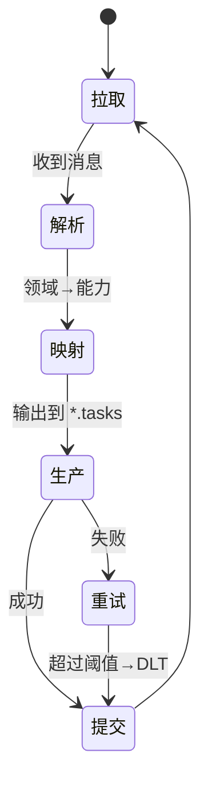
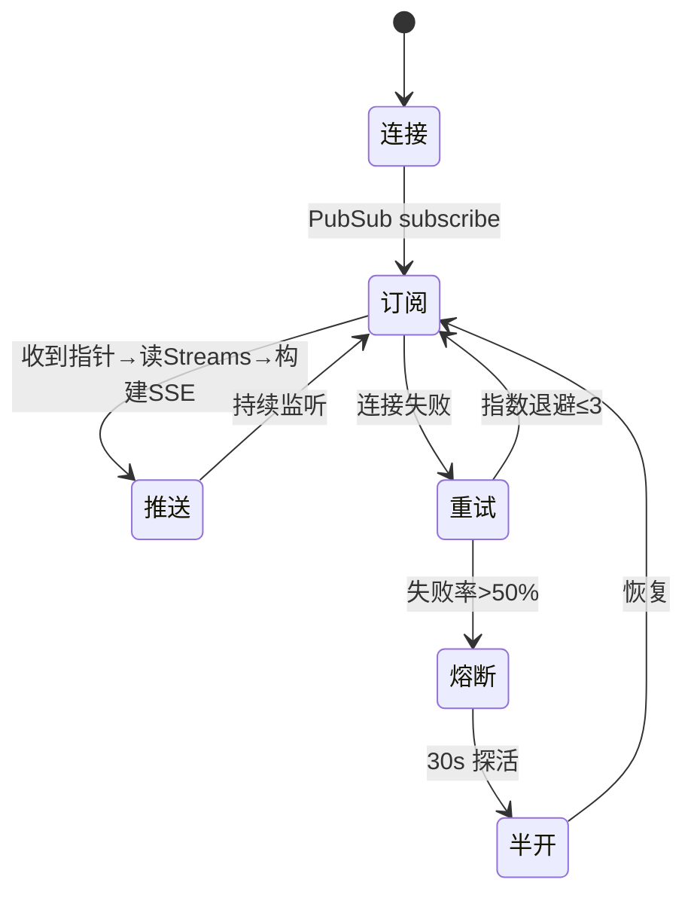
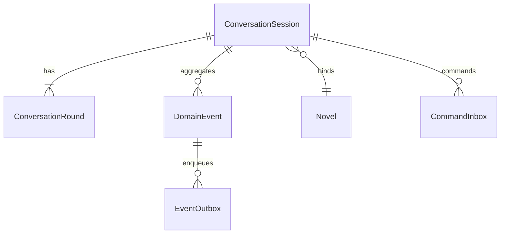

# 低层设计 (Low-Level Design) — 小说创世阶段

文档版本: 1.0  
生成日期: 2025-09-05  
对应 HLD: .tasks/novel-genesis-stage/design-hld.md

## 概述

本 LLD 基于已批准的 HLD，细化“小说创世阶段（Stage 0–5）”的实现细节，覆盖 API/会话服务、事件与 Outbox、Orchestrator、专门化 Agents、EventBridge（Kafka→Redis SSE）、数据模型（PostgreSQL/Neo4j/Milvus）、异常与重试、测试与容量、部署与回滚等。P1 聚焦“至少一次 + 事务性 Outbox + Kafka”链路与基础安全；P2 预留 Prefect 编排与 RBAC。

## 组件详细设计

### 组件1：API + Conversation Service（FastAPI）

职责：
- 路由聚合、JWT 鉴权、SSE 推送；写通缓存（Redis）+ 持久化（PostgreSQL）
- 同一事务内写入 `conversation_rounds`、`domain_events`、`event_outbox`

#### 接口签名

```typescript
// API Client（前端）接口草案
export interface GenesisApi {
  createSession(body: {
    title?: string
    seed?: string
    methodology?: string
    user_context?: Record<string, any>
  }): Promise<{ session_id: string; novel_id: string; status: string; stage: string }>

  getSession(sessionId: string): Promise<ConversationSession>
  listRounds(sessionId: string, params?: { after?: string; limit?: number }): Promise<ConversationRound[]>

  postMessage(sessionId: string, body: UserMessage): Promise<{ accepted: true; correlation_id: string }>
  postCommand(
    sessionId: string,
    commandType: string,
    body?: Record<string, any>,
    idempotencyKey?: string,
  ): Promise<{ accepted: true; command_id: string }>
}
```

```python
# Python 服务端签名（简化），位于 FastAPI 路由层
from typing import Any
from uuid import UUID

class ConversationAPI:
    async def create_session(self, body: dict) -> dict: ...
    async def get_session(self, session_id: UUID) -> dict: ...
    async def list_rounds(self, session_id: UUID, after: str | None, limit: int = 50) -> list[dict]: ...

    async def post_message(self, session_id: UUID, body: dict) -> dict:
        """
        事务内：INSERT conversation_rounds + domain_events + event_outbox
        :raises: ValueError(校验失败), ConflictError(幂等冲突), DatabaseError
        """
        ...

    async def post_command(self, session_id: UUID, command_type: str, body: dict, idem_key: str | None) -> dict:
        """
        事务内：UPSERT command_inbox + domain_events + event_outbox
        :raises: ConflictError(命令唯一约束), DatabaseError
        """
        ...
```

#### 状态机设计（会话推进/命令处理）

```mermaid
stateDiagram-v2
    [*] --> 未开始
    未开始 --> STAGE0_进行中: create_session
    STAGE0_进行中 --> STAGE0_待审核: Outliner 生成高概念
    STAGE0_待审核 --> STAGE0_已锁定: ConfirmConception
    STAGE0_已锁定 --> STAGE1_进行中: RequestTheme
    STAGE1_进行中 --> STAGE1_待审核: Theme Proposed
    STAGE1_待审核 --> STAGE1_已锁定: ConfirmTheme
    STAGE1_已锁定 --> STAGE2_进行中: BuildWorldview
    STAGE2_进行中 --> STAGE2_待审核: World Completed
    STAGE2_待审核 --> STAGE2_已锁定: ConfirmWorld
    STAGE2_已锁定 --> STAGE3_进行中: DesignCharacters
    STAGE3_进行中 --> STAGE3_待审核: Characters Completed
    STAGE3_待审核 --> STAGE3_已锁定: ConfirmCharacters
    STAGE3_已锁定 --> STAGE4_进行中: BuildPlot
    STAGE4_进行中 --> STAGE4_待审核: Plot Completed
    STAGE4_待审核 --> STAGE4_已锁定: ConfirmPlot
    STAGE4_已锁定 --> STAGE5_进行中: GenerateDetails
    STAGE5_进行中 --> STAGE5_待审核: Details Completed
    STAGE5_待审核 --> STAGE5_已锁定: ConfirmDetails
    STAGE5_已锁定 --> 完成
```



#### 内部数据结构

```typescript
export interface ConversationSession {
  id: string
  scope_type: 'GENESIS'
  scope_id: string // novel_id
  status: 'ACTIVE' | 'COMPLETED' | 'ABANDONED' | 'PAUSED'
  stage?: string
  state?: Record<string, any>
  version: number
  created_at: string
  updated_at: string
}

export interface ConversationRound {
  session_id: string
  round_path: string
  role: 'user' | 'assistant' | 'system' | 'tool'
  input?: any
  output?: any
  correlation_id?: string
  created_at: string
}

export interface UserMessage {
  content: string
  attachments?: Array<{ type: string; url: string }>
  metadata?: Record<string, any>
}
```

```python
from dataclasses import dataclass
from datetime import datetime
from enum import Enum
from typing import Any, Optional

class SessionStatus(str, Enum):
    ACTIVE = "ACTIVE"
    COMPLETED = "COMPLETED"
    ABANDONED = "ABANDONED"
    PAUSED = "PAUSED"

@dataclass
class ConversationSessionModel:
    id: str
    scope_type: str
    scope_id: str
    status: SessionStatus
    stage: Optional[str]
    state: dict[str, Any] | None
    version: int
    created_at: datetime
    updated_at: datetime

@dataclass
class ConversationRoundModel:
    session_id: str
    round_path: str
    role: str
    input: Any | None
    output: Any | None
    correlation_id: str | None
    created_at: datetime
```

---

### 组件2：Orchestrator（业务协调者）

职责：消费 `genesis.session.events`；将 `Genesis.Session.*.Requested` 映射到对应能力 `*.tasks`；将能力完成事件回流为 `Genesis.Session.*.Proposed/Completed`。

#### 接口签名

```typescript
export interface OrchestratorMapper {
  mapDomainToCapability(event: DomainEvent): CapabilityTask | null
  mapCapabilityToDomain(event: CapabilityEvent): DomainEvent | null
}
```

```python
class OrchestratorService:
    async def start(self) -> None: ...
    async def stop(self) -> None: ...

    def map_domain_to_capability(self, evt: dict) -> dict | None: ...
    def map_capability_to_domain(self, evt: dict) -> dict | None: ...
```

#### 状态机（消费循环）



#### 内部数据结构

```typescript
export interface DomainEventEnvelope {
  event_id: string
  event_type: string // Genesis.Session.*
  aggregate_type: string
  aggregate_id: string
  correlation_id?: string
  payload: any
  metadata?: Record<string, any>
}

export interface CapabilityTask {
  topic: string
  key?: string
  payload: any
  headers?: Record<string, any>
}
```

---

### 组件3：EventBridge（Kafka→Redis SSE）

职责：消费 `genesis.session.events`，筛选可见 Facts，发布到 Redis Streams（持久化）+ PubSub（实时）。

#### 接口签名

```typescript
export interface SSEClient {
  connect(sseToken: string): EventSource
  onEvent(handler: (evt: SSEMessage) => void): void
}

export interface SSEMessage {
  event: string
  id: string
  data: any
  version: '1.0'
  scope: 'USER'
}
```

```python
class RedisSSEService:
    async def init_pubsub_client(self) -> None: ...
    async def publish_event(self, user_id: str, event: SSEMessage) -> str: ...
    async def subscribe_user_events(self, user_id: str):  # -> AsyncIterator[SSEMessage]
        ...
```

#### 状态机（连接与推送）



---

### 组件4：Agents（Outliner/Worldbuilder/Character/Plot/Detail ...）

职责：消费各自 `*.tasks`，处理后产出到 `*.events`；错误分类→重试/ DLT；可携带 `_topic/_key` 覆盖默认路由。

#### 接口签名

```typescript
export interface AgentMessage {
  type: string
  payload: any
  _topic?: string
  _key?: string
}
```

```python
class BaseAgent:
    async def process_message(self, message: dict) -> dict: ...
    def classify_error(self, error: Exception, message: dict) -> str:  # 'retriable' | 'non_retriable'
        ...
```

#### 内部数据结构

```python
class DLTEnvelope(TypedDict):
    id: str
    ts: str
    correlation_id: str | None
    retries: int
    payload: dict
    original_topic: str
    original_partition: int
    original_offset: int
```

## 前端组件设计

#### 组件表格

| 组件名称            | 职责                               | Props/状态摘要                                     |
| ------------------- | ---------------------------------- | -------------------------------------------------- |
| GenesisFlow         | 创世阶段总控与阶段面板切换         | sessionId, stage, onCommand, onAccept, onRegenerate |
| SessionSidebar      | 会话历史/轮次/版本概览             | sessionId, rounds, onSelectRound                   |
| EventStream         | 订阅 SSE 并分发到 UI               | sseToken, onEvent, lastEventId                     |
| StagePanel          | 各阶段详情（主题/世界/人物/情节/细节） | stage, data, onEdit, onConfirm                     |

#### API 端点设计

| 方法 | 路由                                        | 目的                 | 认证 | 状态码                               |
| ---- | ------------------------------------------- | -------------------- | ---- | ------------------------------------ |
| POST | /api/v1/genesis/sessions                    | 创建创世会话         | 需要 | 201, 400, 401, 500                   |
| GET  | /api/v1/genesis/sessions/{id}               | 查询会话             | 需要 | 200, 401, 404, 500                   |
| GET  | /api/v1/genesis/sessions/{id}/rounds        | 列出会话轮次         | 需要 | 200, 401, 404, 500                   |
| POST | /api/v1/genesis/sessions/{id}/messages      | 提交用户消息         | 需要 | 202, 400, 401, 409, 422, 500         |
| POST | /api/v1/genesis/sessions/{id}/commands/{ct} | 提交幂等命令         | 需要 | 202, 400, 401, 409, 422, 500         |
| GET  | /api/v1/events/stream?sse_token=...         | SSE 事件流（下行）   | 需要 | 200, 401, 403, 500（网络断连重连策略） |

## 数据模型设计

#### 领域实体

1. ConversationSession：对话会话（scope=GENESIS，scope_id=novel_id）
2. ConversationRound：对话轮次（分层 round_path）
3. DomainEvent：领域事件（事件溯源）
4. EventOutbox：事务性发件箱（可靠投递）
5. CommandInbox：命令收件箱（幂等 + 重试）
6. Novel/WorldRule/Character/...：图模型（Neo4j）

#### 实体关系



#### 数据模型定义

```typescript
export interface DomainEvent {
  event_id: string
  event_type: string
  aggregate_type: string
  aggregate_id: string
  payload: any
  metadata?: Record<string, any>
  created_at: string
}
```

```python
from dataclasses import dataclass
from datetime import datetime

@dataclass
class EventOutboxRow:
    id: str
    topic: str
    key: str | None
    partition_key: str | None
    payload: dict
    headers: dict | None
    status: str
    retry_count: int
    max_retries: int
    created_at: datetime
```

### 组件2：[数据访问层]

#### 数据库模式设计（PostgreSQL 完整实现）

```sql
-- 枚举类型定义
CREATE TYPE command_status AS ENUM ('RECEIVED','PROCESSING','COMPLETED','FAILED');
CREATE TYPE outbox_status   AS ENUM ('PENDING','SENDING','SENT','FAILED');

-- 会话表（conversation_sessions）
CREATE TABLE conversation_sessions (
    id UUID PRIMARY KEY,
    scope_type TEXT NOT NULL,                 -- GENESIS/CHAPTER/REVIEW/...
    scope_id TEXT NOT NULL,                   -- 绑定业务实体ID（创世阶段=novel_id）
    status TEXT NOT NULL DEFAULT 'ACTIVE',    -- ACTIVE/COMPLETED/ABANDONED/PAUSED
    stage TEXT,                               -- 当前业务阶段（可选）
    state JSONB,                              -- 会话聚合/摘要
    version INTEGER NOT NULL DEFAULT 0,       -- 乐观锁版本（OCC）
    created_at TIMESTAMPTZ NOT NULL DEFAULT NOW(),
    updated_at TIMESTAMPTZ NOT NULL DEFAULT NOW()
);
CREATE INDEX IF NOT EXISTS idx_conv_sessions_scope ON conversation_sessions (scope_type, scope_id);
CREATE INDEX IF NOT EXISTS idx_conv_sessions_updated_at ON conversation_sessions (updated_at DESC);

-- 轮次表（conversation_rounds）
CREATE TABLE conversation_rounds (
    session_id UUID NOT NULL REFERENCES conversation_sessions(id) ON DELETE CASCADE,
    round_path TEXT NOT NULL,                 -- '1','2','2.1','2.1.1'
    role TEXT NOT NULL,                       -- user/assistant/system/tool
    input JSONB,
    output JSONB,
    tool_calls JSONB,
    model TEXT,
    tokens_in INTEGER,
    tokens_out INTEGER,
    latency_ms INTEGER,
    cost NUMERIC,
    correlation_id TEXT,
    created_at TIMESTAMPTZ NOT NULL DEFAULT NOW(),
    PRIMARY KEY (session_id, round_path)
);
CREATE INDEX IF NOT EXISTS idx_conv_rounds_session_created ON conversation_rounds (session_id, created_at);
CREATE INDEX IF NOT EXISTS idx_conv_rounds_correlation ON conversation_rounds (correlation_id);

-- 命令收件箱（CommandInbox，CQRS命令侧）
CREATE TABLE command_inbox (
    id UUID PRIMARY KEY DEFAULT gen_random_uuid(),
    session_id UUID NOT NULL,                         -- 会话标识
    command_type TEXT NOT NULL,                       -- 命令类型（如 ConfirmStoryConception, GenerateWorldview）
    idempotency_key TEXT UNIQUE NOT NULL,             -- 幂等键，确保同一命令不会被重复处理
    payload JSONB,                                     -- 命令载荷，包含命令执行所需的所有数据
    status command_status NOT NULL DEFAULT 'RECEIVED', -- 命令状态（RECEIVED/PROCESSING/COMPLETED/FAILED）
    error_message TEXT,                               -- 错误信息（当状态为FAILED时必填）
    retry_count INTEGER NOT NULL DEFAULT 0,           -- 重试次数，用于失败重试机制
    created_at TIMESTAMPTZ NOT NULL DEFAULT NOW(),
    updated_at TIMESTAMPTZ NOT NULL DEFAULT NOW()
);
-- 核心索引：支持幂等性和高效查询
CREATE UNIQUE INDEX idx_command_inbox_unique_pending_command 
    ON command_inbox(session_id, command_type) 
    WHERE status IN ('RECEIVED', 'PROCESSING');
CREATE INDEX idx_command_inbox_session_id ON command_inbox(session_id);
CREATE INDEX idx_command_inbox_status ON command_inbox(status);
CREATE INDEX idx_command_inbox_command_type ON command_inbox(command_type);
CREATE INDEX idx_command_inbox_created_at ON command_inbox(created_at);
CREATE INDEX idx_command_inbox_session_status ON command_inbox(session_id, status);
CREATE INDEX idx_command_inbox_status_created ON command_inbox(status, created_at);

-- 领域事件表（Event Sourcing事件存储）
CREATE TABLE domain_events (
    sequence_id BIGSERIAL PRIMARY KEY,                -- 自增主键，确保严格顺序
    event_id UUID NOT NULL DEFAULT gen_random_uuid(), -- 事件唯一标识
    correlation_id UUID,                              -- 关联ID（跟踪整个流程）
    causation_id UUID,                                -- 因果ID（触发此事件的前一个事件）
    event_type TEXT NOT NULL,                         -- 事件类型（点式命名）
    event_version INTEGER NOT NULL DEFAULT 1,         -- 事件版本
    aggregate_type TEXT NOT NULL,                     -- 聚合类型
    aggregate_id TEXT NOT NULL,                       -- 聚合根ID
    payload JSONB NOT NULL,                           -- 事件数据
    metadata JSONB,                                   -- 元数据
    created_at TIMESTAMPTZ NOT NULL DEFAULT NOW()
);
CREATE INDEX idx_domain_events_event_id ON domain_events(event_id);
CREATE INDEX idx_domain_events_aggregate ON domain_events(aggregate_type, aggregate_id);
CREATE INDEX idx_domain_events_correlation ON domain_events(correlation_id);
CREATE INDEX idx_domain_events_event_type ON domain_events(event_type);
CREATE INDEX idx_domain_events_created_at ON domain_events(created_at);

-- 事件发件箱（Outbox，事务性可靠投递）
CREATE TABLE event_outbox (
    id UUID PRIMARY KEY DEFAULT gen_random_uuid(),
    topic TEXT NOT NULL,                         -- 主题（Kafka / 逻辑主题）
    key TEXT,                                   -- key（顺序/分区控制）
    partition_key TEXT,                         -- 分区键（可选）
    payload JSONB NOT NULL,                     -- 事件载荷
    headers JSONB,                              -- 元信息（event_type使用点式命名、version、trace等）
    status outbox_status NOT NULL DEFAULT 'PENDING',
    retry_count INT NOT NULL DEFAULT 0,
    max_retries INT NOT NULL DEFAULT 5,
    last_error TEXT,
    scheduled_at TIMESTAMPTZ,                   -- 延迟发送（可选）
    sent_at TIMESTAMPTZ,                        -- 成功发送时间
    created_at TIMESTAMPTZ NOT NULL DEFAULT now()
);
CREATE INDEX idx_event_outbox_status ON event_outbox(status);
CREATE INDEX idx_event_outbox_topic ON event_outbox(topic);
CREATE INDEX idx_event_outbox_created_at ON event_outbox(created_at);
CREATE INDEX idx_event_outbox_pending_scheduled ON event_outbox(status, scheduled_at);
CREATE INDEX idx_event_outbox_retry_count ON event_outbox(retry_count);
CREATE INDEX idx_event_outbox_topic_status ON event_outbox(topic, status);
CREATE INDEX idx_event_outbox_status_created ON event_outbox(status, created_at);
CREATE INDEX idx_event_outbox_key ON event_outbox(key);
CREATE INDEX idx_event_outbox_partition_key ON event_outbox(partition_key);
```

#### Neo4j 图模型数据库实现

```cypher
-- Neo4j 5.x 标准语法
-- 注意：所有节点的主键统一为 novel_id（Novel节点）或 id（其他节点）

-- 小说节点
MERGE (n:Novel {
    novel_id: 'uuid',        -- 统一使用 novel_id 作为主键
    app_id: 'infinite-scribe',
    title: 'string',
    created_at: datetime()
})

-- 角色节点（8维度）
MERGE (c:Character {
    id: 'uuid',
    novel_id: 'uuid',        -- 关联到小说
    name: 'string',
    appearance: 'text',      -- 外貌
    personality: 'text',     -- 性格
    background: 'text',      -- 背景
    motivation: 'text',      -- 动机
    goals: 'text',          -- 目标
    obstacles: 'text',      -- 障碍
    arc: 'text',            -- 转折
    wounds: 'text'          -- 心结
})

-- 角色状态节点（支持连续性校验）
MERGE (cs:CharacterState {
    id: 'uuid',
    character_id: 'uuid',
    chapter: 0,             -- 章节号
    age: 0,                 -- 年龄
    status: 'string',
    attributes: '{}'        -- JSON 字符串
})

-- 世界规则节点
MERGE (w:WorldRule {
    id: 'uuid',
    novel_id: 'uuid',
    dimension: 'string',    -- 地理/历史/文化/规则/社会
    rule: 'text',
    priority: 0,            -- 优先级（冲突时使用）
    scope: '{}',            -- 适用范围（地域/时间）
    examples: '{}',
    constraints: '{}',
    created_at: datetime()  -- 创建时间（冲突判定）
})

-- 事件节点（支持时间线校验）
MERGE (e:Event {
    id: 'uuid',
    novel_id: 'uuid',
    description: 'text',
    timestamp: datetime(),
    type: 'string'          -- normal/time_skip/battle等
})

-- 位置节点（支持空间校验）
MERGE (l:Location {
    id: 'uuid',
    novel_id: 'uuid',
    name: 'string',
    x: 0.0,                 -- 坐标X
    y: 0.0,                 -- 坐标Y
    timestamp: datetime()   -- 时间戳
})

-- 交通工具节点
MERGE (t:Transportation {
    id: 'uuid',
    type: 'string',         -- walk/horse/car/teleport等
    speed: 0.0              -- km/h
})

-- 关系定义（支持一致性校验）
MATCH (c1:Character {id: 'uuid1'}), (c2:Character {id: 'uuid2'})
MERGE (c1)-[:RELATES_TO {
    strength: 8,            -- 关系强度1-10
    type: 'friend',         -- friend/enemy/knows_of等
    symmetric: true         -- 是否对称关系
}]->(c2)

-- 角色与小说关系
MATCH (c:Character {id: 'uuid'}), (n:Novel {novel_id: 'uuid'})
MERGE (c)-[:BELONGS_TO]->(n)

-- 角色与状态关系
MATCH (c:Character {id: 'uuid'}), (cs:CharacterState {character_id: 'uuid'})
MERGE (c)-[:HAS_STATE]->(cs)

-- 角色位置关系
MATCH (c:Character {id: 'uuid'}), (l:Location {id: 'uuid'})
MERGE (c)-[:LOCATED_AT {timestamp: datetime()}]->(l)

-- 角色使用工具关系
MATCH (c:Character {id: 'uuid'}), (t:Transportation {id: 'uuid'})
MERGE (c)-[:USES]->(t)

-- 世界规则管理关系
MATCH (w:WorldRule {id: 'uuid'}), (n:Novel {novel_id: 'uuid'})
MERGE (w)-[:GOVERNS]->(n)

-- 规则冲突关系
MATCH (w1:WorldRule {id: 'uuid1'}), (w2:WorldRule {id: 'uuid2'})
MERGE (w1)-[:CONFLICTS_WITH {
    severity: 'major'       -- critical/major/minor
}]->(w2)

-- 事件因果关系
MATCH (e1:Event {id: 'uuid1'}), (e2:Event {id: 'uuid2'})
MERGE (e1)-[:CAUSES]->(e2)

-- 事件涉及角色
MATCH (e:Event {id: 'uuid'}), (c:Character {id: 'uuid'})
MERGE (e)-[:INVOLVES]->(c)

-- 事件发生地点
MATCH (e:Event {id: 'uuid'}), (l:Location {id: 'uuid'})
MERGE (e)-[:OCCURS_AT]->(l)

-- ==================== Neo4j 5.x 约束定义 ====================
-- 唯一性约束（使用 Neo4j 5.x 语法）
CREATE CONSTRAINT unique_novel_novel_id IF NOT EXISTS 
FOR (n:Novel) REQUIRE n.novel_id IS UNIQUE;

CREATE CONSTRAINT unique_character_id IF NOT EXISTS 
FOR (c:Character) REQUIRE c.id IS UNIQUE;

CREATE CONSTRAINT unique_world_rule_id IF NOT EXISTS 
FOR (w:WorldRule) REQUIRE w.id IS UNIQUE;

CREATE CONSTRAINT unique_event_id IF NOT EXISTS 
FOR (e:Event) REQUIRE e.id IS UNIQUE;

CREATE CONSTRAINT unique_location_id IF NOT EXISTS 
FOR (l:Location) REQUIRE l.id IS UNIQUE;

-- Node Key 约束（Neo4j 5.x 支持）
CREATE CONSTRAINT character_state_key IF NOT EXISTS
FOR (cs:CharacterState) REQUIRE (cs.character_id, cs.chapter) IS NODE KEY;

-- ==================== Neo4j 5.x 索引定义 ====================
-- 性能优化索引（使用 Neo4j 5.x 语法）
CREATE INDEX novel_app_id_index IF NOT EXISTS 
FOR (n:Novel) ON (n.app_id);

CREATE INDEX character_novel_index IF NOT EXISTS 
FOR (c:Character) ON (c.novel_id);

CREATE INDEX worldrule_novel_index IF NOT EXISTS 
FOR (w:WorldRule) ON (w.novel_id);

CREATE INDEX event_novel_index IF NOT EXISTS 
FOR (e:Event) ON (e.novel_id);

CREATE INDEX event_timestamp_index IF NOT EXISTS 
FOR (e:Event) ON (e.timestamp);

CREATE INDEX location_novel_index IF NOT EXISTS 
FOR (l:Location) ON (l.novel_id);

CREATE INDEX location_coords_index IF NOT EXISTS 
FOR (l:Location) ON (l.x, l.y);

CREATE INDEX character_state_chapter_index IF NOT EXISTS
FOR (cs:CharacterState) ON (cs.chapter);
```

#### Milvus 向量数据库实现

##### 集合Schema定义

```python
collection_schema = {
    "name": "novel_embeddings_v1",  # 版本化命名
    "fields": [
        {"name": "id", "type": DataType.INT64, "is_primary": True},
        {"name": "novel_id", "type": DataType.VARCHAR, "max_length": 36},
        {"name": "content_type", "type": DataType.VARCHAR, "max_length": 50},
        {"name": "content", "type": DataType.VARCHAR, "max_length": 8192},
        {"name": "embedding", "type": DataType.FLOAT_VECTOR, "dim": 768},
        {"name": "created_at", "type": DataType.INT64},  # 时间戳
        {"name": "version", "type": DataType.INT32},      # 内容版本
        {"name": "metadata", "type": DataType.JSON}       # 扩展元数据
    ],
    "index": {
        "type": "HNSW",
        "metric": "COSINE",
        "params": {"M": 32, "efConstruction": 200}
    },
    "partition": {
        "key": "novel_id",  # 按小说分区
        "ttl": 90 * 24 * 3600  # 90天TTL
    }
}
```

##### VectorService封装层实现

```python
from typing import List, Dict, Optional
import numpy as np
from dataclasses import dataclass
from pymilvus import Collection, utility

@dataclass
class VectorConfig:
    """向量配置"""
    model_name: str = "qwen3-embedding-0.6b"
    dimension: int = 768
    metric_type: str = "COSINE"
    index_type: str = "HNSW"
    collection_version: int = 1

class VectorService:
    """向量服务封装层"""
    
    def __init__(self, config: VectorConfig):
        self.config = config
        self.collection_name = f"novel_embeddings_v{config.collection_version}"
        self._init_collection()
    
    async def create_collection(self, force: bool = False):
        """创建集合"""
        if utility.has_collection(self.collection_name) and not force:
            return
        
        # 创建集合schema
        schema = self._build_schema()
        collection = Collection(
            name=self.collection_name,
            schema=schema,
            using='default'
        )
        
        # 创建索引
        await self._create_index(collection)
        
        # 设置TTL
        await self._set_ttl(collection)
        
        return collection
    
    async def upsert_embeddings(
        self, 
        novel_id: str,
        contents: List[str],
        embeddings: List[np.ndarray],
        content_types: List[str],
        versions: Optional[List[int]] = None
    ):
        """批量插入/更新向量"""
        collection = Collection(self.collection_name)
        
        # 准备数据
        entities = []
        for i, (content, embedding, content_type) in enumerate(
            zip(contents, embeddings, content_types)
        ):
            entity = {
                "novel_id": novel_id,
                "content": content[:8192],  # 截断超长文本
                "content_type": content_type,
                "embedding": embedding.tolist(),
                "created_at": int(time.time()),
                "version": versions[i] if versions else 1,
                "metadata": {}
            }
            entities.append(entity)
        
        # 批量插入
        collection.insert(entities)
        collection.flush()
        
        return len(entities)
    
    async def search_similar(
        self,
        novel_id: str,
        query_embedding: np.ndarray,
        content_type: Optional[str] = None,
        top_k: int = 10,
        min_score: float = 0.6
    ) -> List[Dict]:
        """相似度搜索"""
        collection = Collection(self.collection_name)
        collection.load()
        
        # 构建搜索参数
        search_params = {
            "metric_type": self.config.metric_type,
            "params": {"ef": 200}
        }
        
        # 构建过滤表达式
        expr = f'novel_id == "{novel_id}"'
        if content_type:
            expr += f' and content_type == "{content_type}"'
        
        # 执行搜索
        results = collection.search(
            data=[query_embedding.tolist()],
            anns_field="embedding",
            param=search_params,
            limit=top_k,
            expr=expr,
            output_fields=["content", "content_type", "version", "metadata"]
        )
        
        # 过滤低分结果
        filtered_results = []
        for hit in results[0]:
            if hit.score >= min_score:
                filtered_results.append({
                    "id": hit.id,
                    "content": hit.entity.get("content"),
                    "content_type": hit.entity.get("content_type"),
                    "version": hit.entity.get("version"),
                    "score": hit.score,
                    "metadata": hit.entity.get("metadata")
                })
        
        return filtered_results
    
    async def migrate_to_new_model(
        self,
        new_config: VectorConfig,
        batch_size: int = 1000
    ):
        """模型变更迁移"""
        old_collection = Collection(self.collection_name)
        new_service = VectorService(new_config)
        
        # 创建新集合
        await new_service.create_collection()
        
        # 批量迁移数据
        offset = 0
        while True:
            # 读取旧数据
            old_data = old_collection.query(
                expr="",
                offset=offset,
                limit=batch_size,
                output_fields=["novel_id", "content", "content_type", "version"]
            )
            
            if not old_data:
                break
            
            # 使用新模型重新生成embedding
            contents = [item["content"] for item in old_data]
            new_embeddings = await self._generate_embeddings(
                contents, 
                new_config.model_name
            )
            
            # 插入新集合
            await new_service.upsert_embeddings(
                novel_id=old_data[0]["novel_id"],
                contents=contents,
                embeddings=new_embeddings,
                content_types=[item["content_type"] for item in old_data],
                versions=[item["version"] for item in old_data]
            )
            
            offset += batch_size
        
        # 切换别名
        utility.do_bulk_insert(
            collection_name=new_service.collection_name,
            alias="novel_embeddings_active"
        )
        
        return new_service
    
    async def setup_cold_hot_partitions(self):
        """冷热数据分层"""
        collection = Collection(self.collection_name)
        
        # 创建热数据分区（最近30天）
        hot_partition = collection.create_partition("hot_data")
        
        # 创建温数据分区（30-60天）
        warm_partition = collection.create_partition("warm_data")
        
        # 创建冷数据分区（60天以上）
        cold_partition = collection.create_partition("cold_data")
        
        # 设置不同的索引参数
        hot_index = {
            "index_type": "IVF_FLAT",  # 热数据用精确索引
            "metric_type": "COSINE",
            "params": {"nlist": 128}
        }
        
        cold_index = {
            "index_type": "HNSW",  # 冷数据用近似索引
            "metric_type": "COSINE",
            "params": {"M": 16, "efConstruction": 100}
        }
        
        return {
            "hot": hot_partition,
            "warm": warm_partition,
            "cold": cold_partition
        }
    
    async def cleanup_expired_data(self, days: int = 90):
        """清理过期数据"""
        collection = Collection(self.collection_name)
        
        # 计算过期时间戳
        expire_time = int(time.time()) - (days * 24 * 3600)
        
        # 删除过期数据
        expr = f"created_at < {expire_time}"
        collection.delete(expr)
        collection.flush()
        
        # 压缩集合
        collection.compact()
```

#### 迁移策略

- 使用 Alembic 版本化迁移脚本；顺序：新建表→数据迁移→切换读写→删除旧表
- 回滚脚本配套：每个升级脚本必须包含 downgrade 分支
- 热点索引基于查询模式建立（会话按更新时间、事件按 event_type/correlation）

#### 缓存策略

```typescript
export interface CacheStrategy {
  generateKey(params: any): string
  getTTL(key: string): number
  invalidate(pattern: string): Promise<void>
  warmup(keys: string[]): Promise<void>
}

export class SessionCache implements CacheStrategy {
  private readonly DEFAULT_TTL = 60 * 60 // 1h
  generateKey(params: any) { return `dialogue:session:${params.sessionId}` }
  getTTL(_key: string) { return this.DEFAULT_TTL }
  async invalidate(pattern: string) { /* redis scan+del */ }
  async warmup(keys: string[]) { /* batch mget */ }
}
```

## 异常处理与重试机制

### 异常分类

| 异常类型       | 错误码 | 处理策略                 | 重试策略                  |
| -------------- | ------ | ------------------------ | ------------------------- |
| 参数校验失败   | 400    | 返回详细错误             | 不重试                    |
| 未认证/未授权  | 401/403| 返回错误，提示登录/权限  | 不重试                    |
| 幂等冲突       | 409    | 返回冲突信息             | 1 次（短退避）            |
| 语义校验失败   | 422    | 返回错误，标注字段       | 不重试                    |
| 限流/超时      | 429/504| 等待后重试               | 指数退避 ≤3               |
| 服务器错误     | 500    | 降级/记录/告警           | 指数退避 ≤3               |
| Agent 不可重试 | -      | 写入 DLT                 | 不重试                    |

### 重试实现（前端/服务示例）

```typescript
function retryable<T>(fn: () => Promise<T>, max = 3, base = 500) {
  return (async () => {
    let attempt = 0
    while (true) {
      try { return await fn() } catch (e) {
        if (attempt++ >= max) throw e
        await new Promise(r => setTimeout(r, Math.min(30_000, base * 2 ** attempt)))
      }
    }
  })()
}
```

## 回滚步骤详细设计

```yaml
rollback:
  steps:
    - name: 停止流量
      command: kubectl scale deploy/api --replicas=0
    - name: 回滚数据库
      command: alembic downgrade -1
    - name: 回滚应用镜像
      command: kubectl rollout undo deploy/api
    - name: 恢复流量并验证
      command: |
        kubectl scale deploy/api --replicas=2
        ./scripts/smoke-test.sh
      success_criteria:
        - http_2xx_rate > 0.99
        - p95_latency_ms < 3000
```

## 容量参数配置

```yaml
capacity:
  resources:
    requests: { cpu: '500m', memory: '512Mi' }
    limits:   { cpu: '2000m', memory: '2Gi' }
  concurrency:
    max_connections: 1000
    max_requests_per_second: 500
    max_concurrent_requests: 100
  queues:
    outbox_sender: { max_size: 20000, batch: 100, max_delay: 60s }
  pools:
    database: { min_size: 10, max_size: 100, max_idle_time: 300s }
    redis:    { min_size: 5, max_size: 50 }
  rate_limits:
    - key: 'user_id'
      limit: 60
      window: 60s
```

### 自动伸缩参数

```yaml
autoscaling:
  minReplicas: 2
  maxReplicas: 10
  metrics:
    - type: Resource
      resource: { name: cpu, target: { type: Utilization, averageUtilization: 70 } }
    - type: Resource
      resource: { name: memory, target: { type: Utilization, averageUtilization: 80 } }
```

## 测试策略

### 测试目标

- 降低质量风险；保障对话与事件链路端到端稳定；满足 NFR 延迟目标

### 风险矩阵（摘要）

| 区域       | 风险 | 必须                 | 可选   |
| ---------- | ---- | -------------------- | ------ |
| 会话一致性 | 高   | 单元、集成、E2E      | -      |
| 事件可靠性 | 高   | 契约、集成           | 弹性   |
| 图一致性   | 中   | 集成、属性           | -      |
| 向量检索   | 中   | 集成                 | 性能   |

### 按层最小化

- 单元：Outbox 序列化、命令幂等、映射函数、错误分类
- 契约：API OpenAPI 契约、事件 Envelope 契约
- 集成：Kafka/Redis/Neo4j/Milvus 依赖的最小可用路径
- E2E（≤3）：创世主流程；断线重连 SSE；低分重试到 DLT

### CI 门控与退出标准

- PR：单元+契约 必须通过；暂存：集成+E2E 必须通过；Sev1/Sev2=0

## 测试点设计

### 单元测试（示例）

```typescript
describe('orchestrator.mapDomainToCapability', () => {
  it('将 Theme.Requested 映射到 Outliner 任务', () => {
    // Arrange / Act / Assert
  })
})
```

### 集成测试（示例）

```python
def test_end_to_end_flow(client, kafka, redis):
    # 1. 创建会话 → 2. 提交消息 → 3. 消费任务 → 4. 回流领域事件 → 5. SSE 下行
    ...
```

## 部署细节

### CI/CD Pipeline（建议）

```yaml
stages: [build, test, deploy]
build:
  stage: build
  script:
    - pnpm install
    - pnpm backend lint && pnpm frontend lint
    - docker build -t $IMAGE:$CI_COMMIT_SHA apps/backend
test:
  stage: test
  script:
    - pnpm backend test
    - pnpm frontend test
deploy:
  stage: deploy
  script:
    - kubectl set image deploy/api api=$IMAGE:$CI_COMMIT_SHA
    - kubectl rollout status deploy/api
    - ./scripts/smoke-test.sh
```

## 依赖管理

### 外部依赖

| 依赖       | 版本   | 用途           | 降级方案    |
| ---------- | ------ | -------------- | ----------- |
| PostgreSQL | 14+    | 会话/事件表    | 只读降级    |
| Redis      | 7+     | 缓存与 SSE     | 降级为无 SSE |
| Kafka      | 3.x+   | 事件总线       | 暂存 Outbox |
| Neo4j      | 5.x+   | 知识图谱与校验 | 关闭校验    |
| Milvus     | 2.4+   | 嵌入检索       | 关闭向量检索 |

### 版本兼容性（运行环境）

```json
{
  "python": ">=3.11",
  "node": ">=20",
  "pnpm": ">=9"
}
```

## 与HLD的关系

- 统一遵循 HLD 的架构与事件命名；表结构与 Topic 映射完全对齐
- NFR：首 token < 3s、能力生成 < 5s；指标与容量配置已在本 LLD 细化

## 交付物

- 完整接口签名（API/Orchestrator/Agents/SSE）
- 状态机与 ER 图
- 数据结构定义与 DDL 摘要
- 异常矩阵与重试实现
- 回滚步骤与容量配置
- 测试策略与关键测试点
- 部署与依赖矩阵

