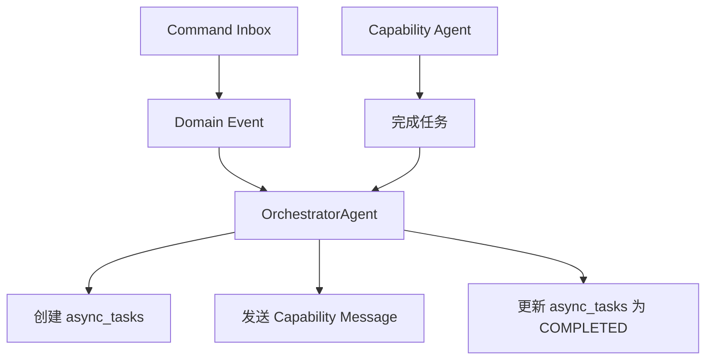

# 异步任务创建与更新责任分工

基于现有代码库的实际实现，`async_tasks` 表的创建和更新责任分工如下：

## 职责概览



## 核心发现

**重要**: 一个 command 可能对应**多个**异步任务，因为：
- 一个 command 可能触发多个不同的 capability 任务
- 每个 capability 任务都会创建独立的 `async_tasks` 记录
- 通过 `triggered_by_command_id` 字段关联

## 1. 创建责任 (OrchestratorAgent)

### 创建时机

**前置流程**:
1. **API 侧入库**: 写入 `command_inbox`，产生领域事件 + outbox
   - 位置: `apps/backend/src/common/services/conversation/conversation_event_handler.py:225, 235`

2. **Orchestrator 消费**: 收到 `...Command.Received` 领域事件后处理
   - 位置: `apps/backend/src/agents/orchestrator/agent.py`

**实际创建流程**:

```python
# apps/backend/src/agents/orchestrator/agent.py
class OrchestratorAgent:
    async def _handle_domain_event(self, evt: dict[str, Any]):
        """处理 Command.Received 领域事件"""

        # 1. 先投影为领域事实 (如 *.Requested)
        # 位置: orchestrator/agent.py:87
        await self._persist_domain_event(
            scope_type=scope_type,
            session_id=aggregate_id,
            event_action=mapping.requested_action,  # 如 "Theme.Requested"
            payload={"session_id": aggregate_id, "input": payload.get("payload", {})},
            correlation_id=correlation_id,
        )

        # 2. 创建异步任务跟踪能力执行
        # 位置: orchestrator/agent.py:96, 156
        await self._create_async_task(
            correlation_id=correlation_id,
            session_id=aggregate_id,
            task_type=self._normalize_task_type(mapping.capability_message.get("type", "")),
            input_data=mapping.capability_message.get("input") or {},
        )

        # 3. 返回能力消息发送给相应Agent
        return mapping.capability_message

    async def _create_async_task(
        self, *, correlation_id: str | None, session_id: str, task_type: str, input_data: dict[str, Any]
    ):
        """创建异步任务记录 (orchestrator/agent.py:171)"""
        from datetime import UTC, datetime

        trig_cmd_id = None
        if correlation_id:
            try:
                trig_cmd_id = UUID(str(correlation_id))
            except Exception:
                trig_cmd_id = None

        async with create_sql_session() as db:
            task = AsyncTask(
                task_type=task_type,
                triggered_by_command_id=trig_cmd_id,  # FK→command_inbox.id
                status=TaskStatus.RUNNING,            # 直接创建为 RUNNING 状态
                started_at=datetime.now(UTC),         # 设置开始时间
                input_data={"session_id": session_id, **(input_data or {})},  # 包含 session_id
            )
            db.add(task)
            await db.flush()
```

### 任务类型标准化

```python
# orchestrator/agent.py:221
def _normalize_task_type(self, event_type: str) -> str:
    """规范化任务类型为基础类型前缀，便于匹配统计"""
    # 去掉 Requested/Generated/Completed 等后缀
    # 例子:
    # "Character.Design.GenerationRequested" -> "Character.Design.Generation"
    # "Outliner.Theme.Generated" -> "Outliner.Theme.Generation"

    if not event_type:
        return ""
    parts = event_type.split(".")
    suffixes = {"Requested", "Generated", "Started", "Completed", "Result", "Checked"}
    if parts[-1] in suffixes and len(parts) >= 2:
        return ".".join(parts[:-1])
    return event_type
```

## 2. 任务执行 (Capability Agents)

### 执行流程
- **执行者**: 各种 Capability Agents (Writer, Character, Plot 等)
- **位置**: `apps/backend/src/agents/*/agent.py`
- **职责**: 执行具体的AI任务，但**不直接更新** `async_tasks` 表

### 执行流程说明

```python
# 例: Character Agent 处理角色生成
class CharacterAgent(BaseAgent):
    async def process_message(self, message: dict[str, Any]):
        """处理角色生成请求"""

        # 1. 执行AI生成任务
        character_data = await self.generate_character(message["input"])

        # 2. 发送完成消息回到 Orchestrator
        # (不直接更新 async_tasks，而是发送能力完成消息)
        return {
            "type": "Character.Design.Generated",
            "data": {
                "session_id": message["session_id"],
                "result": character_data,
                "correlation_id": message.get("correlation_id")
            }
        }
```

### 重要架构原则

**Capability Agents 不直接操作 `async_tasks` 表**，而是：
1. 接收来自 Orchestrator 的任务消息
2. 执行 AI 生成任务
3. 发送完成消息回 Orchestrator
4. 由 Orchestrator 负责更新 `async_tasks` 状态

## 3. 任务完成 (OrchestratorAgent)

### 状态流转与更新

**完成流程** (orchestrator/agent.py:181):
- **执行者**: `OrchestratorAgent._complete_async_task()` 方法
- **触发**: Orchestrator 处理能力结果事件时
- **匹配**: 按 `correlation_id` 和任务类型前缀匹配最近的 RUNNING/PENDING 任务

**失败处理**:
- **约束**: 按模型约束需要设置 `error_data` 并置 `FAILED` 状态
- **预留**: 失败落库的通用入口预留，具体失败打点由实际处理处更新

### 实际完成流程

```python
# apps/backend/src/agents/orchestrator/agent.py:181
class OrchestratorAgent:
    async def _complete_async_task(
        self, *, correlation_id: str | None, expect_task_prefix: str, result_data: dict[str, Any]
    ):
        """按 correlation_id 和任务类型前缀匹配最近的 RUNNING/PENDING 任务，标记为 COMPLETED"""
        from src.common.utils.datetime_utils import utc_now

        if not correlation_id:
            return

        try:
            trig_cmd_id = UUID(str(correlation_id))
        except Exception:
            return

        async with create_sql_session() as db:
            # 查找最近的运行中/待执行任务
            stmt = (
                select(AsyncTask)
                .where(
                    and_(
                        AsyncTask.triggered_by_command_id == trig_cmd_id,
                        AsyncTask.status.in_([TaskStatus.RUNNING, TaskStatus.PENDING]),
                        AsyncTask.task_type.like(f"{expect_task_prefix}%"),  # 前缀匹配
                    )
                )
                .order_by(AsyncTask.created_at.desc())  # 最近创建的优先
            )
            task = await db.scalar(stmt)

            if task:
                task.status = TaskStatus.COMPLETED
                task.completed_at = utc_now()
                task.result_data = result_data or {}  # 写入成功结果
                db.add(task)
```

### 统计与监控

**统计视图** (scripts/create_db_functions.sql:193):
- 提供 `async_task_statistics` 视图
- 按 `task_type/status` 聚合与耗时统计
- 用于监控任务执行情况和性能分析

### 一个命令对应多个任务的例子

```python
# 例子: 一个角色生成命令可能触发多个任务
correlation_id = "cmd-123"

# 任务1: 角色基础设计
await self._create_async_task(
    correlation_id=correlation_id,
    task_type="Character.Design.Generation",
    input_data={"character_type": "protagonist"}
)

# 任务2: 角色关系分析
await self._create_async_task(
    correlation_id=correlation_id,
    task_type="Character.Relationship.Analysis",
    input_data={"existing_characters": [...]}
)

# 任务3: 角色弧线设计
await self._create_async_task(
    correlation_id=correlation_id,
    task_type="Character.Arc.Design",
    input_data={"character_id": "char-456"}
)

# 所有任务都通过 triggered_by_command_id 关联到同一个命令
```

## 4. 数据结构对应关系

### 现有表结构 (基于实际代码)

```sql
-- 完整结构定义: apps/backend/src/models/workflow.py:114
-- 状态枚举定义: apps/backend/src/schemas/enums.py:59
CREATE TABLE async_tasks (
    id UUID PRIMARY KEY,
    task_type TEXT NOT NULL,                           -- 如 "Character.Design.Generation"
    triggered_by_command_id UUID,                      -- 外键到 command_inbox.id (workflow.py:118)
    status task_status NOT NULL DEFAULT 'PENDING',     -- PENDING|RUNNING|COMPLETED|FAILED|CANCELLED
    progress NUMERIC(5,2) NOT NULL DEFAULT 0.00,       -- 进度 0.00-100.00
    input_data JSONB,                                   -- 任务输入参数/上下文 (workflow.py:129)
    result_data JSONB,                                  -- 任务执行成功结果
    error_data JSONB,                                   -- 任务执行失败详情
    execution_node TEXT,                                -- 执行节点标识
    retry_count INTEGER NOT NULL DEFAULT 0,            -- 当前重试次数
    max_retries INTEGER NOT NULL DEFAULT 3,            -- 最大重试次数
    started_at TIMESTAMP WITH TIME ZONE,               -- 开始执行时间
    completed_at TIMESTAMP WITH TIME ZONE,             -- 完成时间
    created_at TIMESTAMP WITH TIME ZONE DEFAULT NOW(),
    updated_at TIMESTAMP WITH TIME ZONE DEFAULT NOW(),

    -- 约束规则 (workflow.py:86)
    CONSTRAINT check_progress_range CHECK (progress >= 0.0 AND progress <= 100.0),
    CONSTRAINT check_retry_count_valid CHECK (retry_count >= 0 AND retry_count <= max_retries),
    CONSTRAINT check_max_retries_non_negative CHECK (max_retries >= 0),
    CONSTRAINT check_running_has_started CHECK (
        (status != 'RUNNING') OR (status = 'RUNNING' AND started_at IS NOT NULL)
    ),
    CONSTRAINT check_completed_has_timestamp CHECK (
        (status NOT IN ('COMPLETED', 'FAILED')) OR
        (status IN ('COMPLETED', 'FAILED') AND completed_at IS NOT NULL)
    ),
    CONSTRAINT check_completed_has_result CHECK (
        (status != 'COMPLETED') OR (status = 'COMPLETED' AND result_data IS NOT NULL)
    ),
    CONSTRAINT check_failed_has_error CHECK (
        (status != 'FAILED') OR (status = 'FAILED' AND error_data IS NOT NULL)
    )
);
```

### 与 Command 的关联

```python
# 通过 triggered_by_command_id 关联
# 一个 command 可以触发多个 async_tasks

# 示例查询：查找命令触发的所有任务
SELECT * FROM async_tasks
WHERE triggered_by_command_id = 'cmd-uuid-123'
ORDER BY created_at;

# 可能的结果：
# - Character.Design.Generation
# - Character.Relationship.Analysis
# - Character.Arc.Design
# - Review.Quality.Evaluation
```

## 总结：基于实际代码的职责分工

### 🎯 核心角色

1. **OrchestratorAgent** (唯一的 `async_tasks` 操作者)
   - **创建**: 处理领域事件时创建任务记录
   - **完成**: 接收 Capability Agent 完成消息时更新状态
   - **位置**: `apps/backend/src/agents/orchestrator/agent.py`

2. **Capability Agents** (任务执行者)
   - **执行**: 接收任务消息，执行AI生成
   - **通知**: 发送完成消息回 Orchestrator
   - **不直接操作**: 不直接修改 `async_tasks` 表

3. **Command → Task 关系**
   - **一对多**: 一个命令可能触发多个异步任务
   - **关联方式**: 通过 `triggered_by_command_id` 字段
   - **追踪**: 通过 `correlation_id` 跨系统追踪

### 🔄 完整数据流

```
1. API 请求 → command_inbox + 领域事件
   (conversation_event_handler.py:225,235)
    ↓
2. OrchestratorAgent 消费 Command.Received 事件
   (orchestrator/agent.py)
    ↓
3. 投影领域事实 (*.Requested) + 创建 async_tasks (RUNNING)
   (orchestrator/agent.py:87, 96, 156, 171)
    ↓
4. 发送能力任务消息到 Capability Agent
    ↓
5. Capability Agent 执行 AI 任务 → 返回完成消息
    ↓
6. OrchestratorAgent 接收完成消息 → 更新 async_tasks (COMPLETED)
   (orchestrator/agent.py:181)
```

### 📊 状态管理与约束

**状态枚举** (enums.py:59):
- `PENDING` - 待执行
- `RUNNING` - 执行中
- `COMPLETED` - 已完成
- `FAILED` - 已失败
- `CANCELLED` - 已取消

**约束规则** (workflow.py:86):
- ✅ `progress` 范围: 0.00-100.00
- ✅ `RUNNING` 状态必须有 `started_at`
- ✅ `COMPLETED/FAILED` 状态必须有 `completed_at`
- ✅ `COMPLETED` 状态必须有 `result_data`
- ✅ `FAILED` 状态必须有 `error_data`
- ✅ `retry_count <= max_retries`

**统计监控** (create_db_functions.sql:193):
- `async_task_statistics` 视图提供按类型/状态聚合统计
- 耗时分析和性能监控支持

### 🎯 设计优势

这种设计确保了：
- **集中管理**: 只有 OrchestratorAgent 操作 `async_tasks` 表
- **责任分离**: Capability Agents 专注于AI任务执行
- **灵活扩展**: 一个命令可以触发多种不同的AI任务
- **状态一致性**: 统一的任务状态管理和追踪
- **数据完整性**: 严格的约束规则确保数据质量
- **可观测性**: 完整的统计视图支持监控和分析