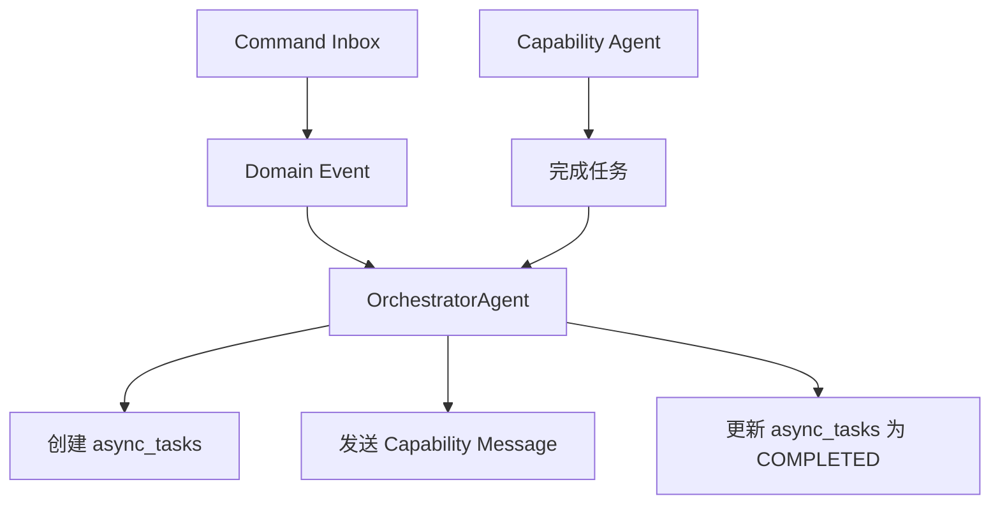

# 异步任务创建与更新责任分工

基于现有代码库的实际实现，`async_tasks` 表的创建和更新责任分工如下：

## 职责概览



## 核心发现

**重要**: 一个 command 可能对应**多个**异步任务，因为：
- 一个 command 可能触发多个不同的 capability 任务
- 每个 capability 任务都会创建独立的 `async_tasks` 记录
- 通过 `triggered_by_command_id` 字段关联

## 1. 创建责任 (OrchestratorAgent)

### 创建时机
- **触发点**: `OrchestratorAgent` 处理领域事件时
- **执行者**: `OrchestratorAgent._create_async_task()` 方法
- **创建位置**: `apps/backend/src/agents/orchestrator/agent.py:155-178`

### 实际创建流程

```python
# apps/backend/src/agents/orchestrator/agent.py
class OrchestratorAgent:
    async def _handle_domain_event(self, evt: dict[str, Any]):
        """处理领域事件，创建异步任务"""

        # 1. 映射命令到能力任务
        mapping = command_registry.process_command(...)

        # 2. 发布领域事实事件
        await self._persist_domain_event(...)

        # 3. 创建异步任务跟踪能力执行
        await self._create_async_task(
            correlation_id=correlation_id,
            session_id=aggregate_id,
            task_type=self._normalize_task_type(mapping.capability_message.get("type", "")),
            input_data=mapping.capability_message.get("input") or {},
        )

        # 4. 返回能力消息发送给相应Agent
        return mapping.capability_message

    async def _create_async_task(
        self, *, correlation_id: str | None, session_id: str, task_type: str, input_data: dict[str, Any]
    ):
        """创建异步任务记录"""
        from datetime import UTC, datetime

        trig_cmd_id = None
        if correlation_id:
            try:
                trig_cmd_id = UUID(str(correlation_id))
            except Exception:
                trig_cmd_id = None

        async with create_sql_session() as db:
            task = AsyncTask(
                task_type=task_type,
                triggered_by_command_id=trig_cmd_id,  # 关联到命令
                status=TaskStatus.RUNNING,
                started_at=datetime.now(UTC),
                input_data={"session_id": session_id, **(input_data or {})},
            )
            db.add(task)
            await db.flush()
```

### 任务类型标准化

```python
def _normalize_task_type(self, event_type: str) -> str:
    """标准化任务类型"""
    # 例子:
    # "Character.Design.GenerationRequested" -> "Character.Design.Generation"
    # "Outliner.Theme.Generated" -> "Outliner.Theme.Generation"

    parts = event_type.split(".")
    suffixes = {"Requested", "Generated", "Started", "Completed", "Result", "Checked"}
    if parts[-1] in suffixes and len(parts) >= 2:
        return ".".join(parts[:-1])
    return event_type
```

## 2. 任务执行 (Capability Agents)

### 执行流程
- **执行者**: 各种 Capability Agents (Writer, Character, Plot 等)
- **位置**: `apps/backend/src/agents/*/agent.py`
- **职责**: 执行具体的AI任务，但**不直接更新** `async_tasks` 表

### 执行流程说明

```python
# 例: Character Agent 处理角色生成
class CharacterAgent(BaseAgent):
    async def process_message(self, message: dict[str, Any]):
        """处理角色生成请求"""

        # 1. 执行AI生成任务
        character_data = await self.generate_character(message["input"])

        # 2. 发送完成消息回到 Orchestrator
        # (不直接更新 async_tasks，而是发送能力完成消息)
        return {
            "type": "Character.Design.Generated",
            "data": {
                "session_id": message["session_id"],
                "result": character_data,
                "correlation_id": message.get("correlation_id")
            }
        }
```

### 重要架构原则

**Capability Agents 不直接操作 `async_tasks` 表**，而是：
1. 接收来自 Orchestrator 的任务消息
2. 执行 AI 生成任务
3. 发送完成消息回 Orchestrator
4. 由 Orchestrator 负责更新 `async_tasks` 状态

## 3. 任务完成 (OrchestratorAgent)

### 完成责任
- **执行者**: `OrchestratorAgent._complete_async_task()` 方法
- **位置**: `apps/backend/src/agents/orchestrator/agent.py:180-218`
- **职责**: 接收 Capability Agent 完成消息，更新 `async_tasks` 状态

### 实际完成流程

```python
# apps/backend/src/agents/orchestrator/agent.py
class OrchestratorAgent:
    async def _handle_capability_event(self, msg_type: str, message: dict, context: dict):
        """处理能力完成事件"""

        # 解析完成消息
        data = message.get("data") or message
        correlation_id = context.get("meta", {}).get("correlation_id") or data.get("correlation_id")

        # 处理生成完成事件
        action = CapabilityEventHandlers.handle_generation_completed(
            msg_type, session_id, data, correlation_id, scope_type, scope_prefix
        )

        if action and action.task_completion:
            # 完成异步任务
            await self._complete_async_task(**action.task_completion)

        return action.capability_message if action else None

    async def _complete_async_task(
        self, *, correlation_id: str | None, expect_task_prefix: str, result_data: dict[str, Any]
    ):
        """标记异步任务为完成状态"""
        from src.common.utils.datetime_utils import utc_now

        if not correlation_id:
            return

        try:
            trig_cmd_id = UUID(str(correlation_id))
        except Exception:
            return

        async with create_sql_session() as db:
            # 查找最近的运行中任务
            stmt = (
                select(AsyncTask)
                .where(
                    and_(
                        AsyncTask.triggered_by_command_id == trig_cmd_id,
                        AsyncTask.status.in_([TaskStatus.RUNNING, TaskStatus.PENDING]),
                        AsyncTask.task_type.like(f"{expect_task_prefix}%"),
                    )
                )
                .order_by(AsyncTask.created_at.desc())
            )
            task = await db.scalar(stmt)

            if task:
                task.status = TaskStatus.COMPLETED
                task.completed_at = utc_now()
                task.result_data = result_data or {}
                db.add(task)
```

### 一个命令对应多个任务的例子

```python
# 例子: 一个角色生成命令可能触发多个任务
correlation_id = "cmd-123"

# 任务1: 角色基础设计
await self._create_async_task(
    correlation_id=correlation_id,
    task_type="Character.Design.Generation",
    input_data={"character_type": "protagonist"}
)

# 任务2: 角色关系分析
await self._create_async_task(
    correlation_id=correlation_id,
    task_type="Character.Relationship.Analysis",
    input_data={"existing_characters": [...]}
)

# 任务3: 角色弧线设计
await self._create_async_task(
    correlation_id=correlation_id,
    task_type="Character.Arc.Design",
    input_data={"character_id": "char-456"}
)

# 所有任务都通过 triggered_by_command_id 关联到同一个命令
```

## 4. 数据结构对应关系

### 现有表结构 (基于实际代码)

```sql
-- apps/backend/src/models/workflow.py
CREATE TABLE async_tasks (
    id UUID PRIMARY KEY,
    task_type TEXT NOT NULL,                           -- 如 "Character.Design.Generation"
    triggered_by_command_id UUID,                      -- 外键到 command_inbox.id
    status task_status NOT NULL DEFAULT 'PENDING',     -- PENDING/RUNNING/COMPLETED/FAILED
    progress NUMERIC(5,2) NOT NULL DEFAULT 0.00,       -- 进度 0.00-100.00
    input_data JSONB,                                   -- 任务输入参数
    result_data JSONB,                                  -- 任务执行结果
    error_data JSONB,                                   -- 错误信息详情
    execution_node TEXT,                                -- 执行节点标识
    retry_count INTEGER NOT NULL DEFAULT 0,            -- 当前重试次数
    max_retries INTEGER NOT NULL DEFAULT 3,            -- 最大重试次数
    started_at TIMESTAMP WITH TIME ZONE,               -- 开始执行时间
    completed_at TIMESTAMP WITH TIME ZONE,             -- 完成时间
    created_at TIMESTAMP WITH TIME ZONE DEFAULT NOW(),
    updated_at TIMESTAMP WITH TIME ZONE DEFAULT NOW()
);
```

### 与 Command 的关联

```python
# 通过 triggered_by_command_id 关联
# 一个 command 可以触发多个 async_tasks

# 示例查询：查找命令触发的所有任务
SELECT * FROM async_tasks
WHERE triggered_by_command_id = 'cmd-uuid-123'
ORDER BY created_at;

# 可能的结果：
# - Character.Design.Generation
# - Character.Relationship.Analysis
# - Character.Arc.Design
# - Review.Quality.Evaluation
```

## 总结：基于实际代码的职责分工

### 🎯 核心角色

1. **OrchestratorAgent** (唯一的 `async_tasks` 操作者)
   - **创建**: 处理领域事件时创建任务记录
   - **完成**: 接收 Capability Agent 完成消息时更新状态
   - **位置**: `apps/backend/src/agents/orchestrator/agent.py`

2. **Capability Agents** (任务执行者)
   - **执行**: 接收任务消息，执行AI生成
   - **通知**: 发送完成消息回 Orchestrator
   - **不直接操作**: 不直接修改 `async_tasks` 表

3. **Command → Task 关系**
   - **一对多**: 一个命令可能触发多个异步任务
   - **关联方式**: 通过 `triggered_by_command_id` 字段
   - **追踪**: 通过 `correlation_id` 跨系统追踪

### 🔄 数据流

```
Command Inbox → Domain Event → OrchestratorAgent
    ↓
Create async_tasks (RUNNING)
    ↓
Send to Capability Agent → Execute AI Task
    ↓
Send completion message → OrchestratorAgent
    ↓
Update async_tasks (COMPLETED)
```

这种设计确保了：
- **集中管理**: 只有 OrchestratorAgent 操作 `async_tasks` 表
- **责任分离**: Capability Agents 专注于AI任务执行
- **灵活扩展**: 一个命令可以触发多种不同的AI任务
- **状态一致性**: 统一的任务状态管理和追踪