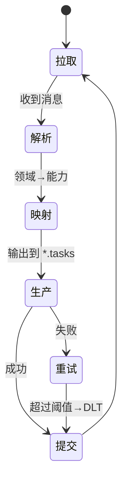
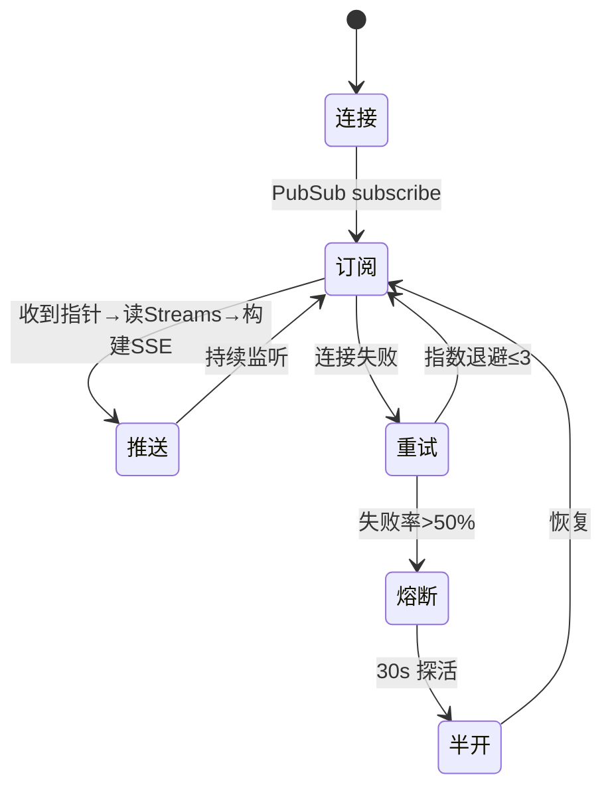

# 组件详细设计

## 组件1：API + Conversation Service（FastAPI）

职责：

- 路由聚合、JWT 鉴权、SSE 推送；写通缓存（Redis）+ 持久化（PostgreSQL）
- 同一事务内写入 `conversation_rounds`、`domain_events`、`event_outbox`

### 接口签名

```typescript
// API Client（前端）接口草案
export interface GenesisApi {
  createSession(body: {
    title?: string
    seed?: string
    methodology?: string
    user_context?: Record<string, any>
  }): Promise<{
    session_id: string
    novel_id: string
    status: string
    stage: string
  }>

  getSession(sessionId: string): Promise<ConversationSession>
  listRounds(
    sessionId: string,
    params?: { after?: string; limit?: number },
  ): Promise<ConversationRound[]>

  postMessage(
    sessionId: string,
    body: UserMessage,
  ): Promise<{ accepted: true; correlation_id: string }>
  postCommand(
    sessionId: string,
    commandType: string,
    body?: Record<string, any>,
    idempotencyKey?: string,
  ): Promise<{ accepted: true; command_id: string }>
}
```

```python
# Python 服务端签名（简化），位于 FastAPI 路由层
from typing import Any
from uuid import UUID

class ConversationAPI:
    async def create_session(self, body: dict) -> dict: ...
    async def get_session(self, session_id: UUID) -> dict: ...
    async def list_rounds(self, session_id: UUID, after: str | None, limit: int = 50) -> list[dict]: ...

    async def post_message(self, session_id: UUID, body: dict) -> dict:
        """
        事务内：INSERT conversation_rounds + domain_events + event_outbox
        :raises: ValueError(校验失败), ConflictError(幂等冲突), DatabaseError
        """
        ...

    async def post_command(self, session_id: UUID, command_type: str, body: dict, idem_key: str | None) -> dict:
        """
        事务内：UPSERT command_inbox + domain_events + event_outbox
        :raises: ConflictError(命令唯一约束), DatabaseError
        """
        ...
```

### 状态机设计（会话推进/命令处理）

```mermaid
stateDiagram-v2
    [*] --> 未开始
    未开始 --> STAGE0_进行中: create_session
    STAGE0_进行中 --> STAGE0_待审核: Outliner 生成高概念
    STAGE0_待审核 --> STAGE0_已锁定: ConfirmConception
    STAGE0_已锁定 --> STAGE1_进行中: RequestTheme
    STAGE1_进行中 --> STAGE1_待审核: Theme Proposed
    STAGE1_待审核 --> STAGE1_已锁定: ConfirmTheme
    STAGE1_已锁定 --> STAGE2_进行中: BuildWorldview
    STAGE2_进行中 --> STAGE2_待审核: World Completed
    STAGE2_待审核 --> STAGE2_已锁定: ConfirmWorld
    STAGE2_已锁定 --> STAGE3_进行中: DesignCharacters
    STAGE3_进行中 --> STAGE3_待审核: Characters Completed
    STAGE3_待审核 --> STAGE3_已锁定: ConfirmCharacters
    STAGE3_已锁定 --> STAGE4_进行中: BuildPlot
    STAGE4_进行中 --> STAGE4_待审核: Plot Completed
    STAGE4_待审核 --> STAGE4_已锁定: ConfirmPlot
    STAGE4_已锁定 --> STAGE5_进行中: GenerateDetails
    STAGE5_进行中 --> STAGE5_待审核: Details Completed
    STAGE5_待审核 --> STAGE5_已锁定: ConfirmDetails
    STAGE5_已锁定 --> 完成
```



### 内部数据结构

```typescript
export interface ConversationSession {
  id: string
  scope_type: 'GENESIS'
  scope_id: string // novel_id
  status: 'ACTIVE' | 'COMPLETED' | 'ABANDONED' | 'PAUSED'
  stage?: string
  state?: Record<string, any>
  version: number
  created_at: string
  updated_at: string
}

export interface ConversationRound {
  session_id: string
  round_path: string
  role: 'user' | 'assistant' | 'system' | 'tool'
  input?: any
  output?: any
  correlation_id?: string
  created_at: string
}

export interface UserMessage {
  content: string
  attachments?: Array<{ type: string; url: string }>
  metadata?: Record<string, any>
}
```

```python
from dataclasses import dataclass
from datetime import datetime
from enum import Enum
from typing import Any, Optional

class SessionStatus(str, Enum):
    ACTIVE = "ACTIVE"
    COMPLETED = "COMPLETED"
    ABANDONED = "ABANDONED"
    PAUSED = "PAUSED"

@dataclass
class ConversationSessionModel:
    id: str
    scope_type: str
    scope_id: str
    status: SessionStatus
    stage: Optional[str]
    state: dict[str, Any] | None
    version: int
    created_at: datetime
    updated_at: datetime

@dataclass
class ConversationRoundModel:
    session_id: str
    round_path: str
    role: str
    input: Any | None
    output: Any | None
    correlation_id: str | None
    created_at: datetime
```

---

## 组件2：Orchestrator（业务协调者）

职责：消费 `genesis.session.events`；将 `Genesis.Session.*.Requested` 映射到对应能力 `*.tasks`；将能力完成事件回流为 `Genesis.Session.*.Proposed/Completed`。

### 接口签名

```typescript
export interface OrchestratorMapper {
  mapDomainToCapability(event: DomainEvent): CapabilityTask | null
  mapCapabilityToDomain(event: CapabilityEvent): DomainEvent | null
}
```

```python
class OrchestratorService:
    async def start(self) -> None: ...
    async def stop(self) -> None: ...

    def map_domain_to_capability(self, evt: dict) -> dict | None: ...
    def map_capability_to_domain(self, evt: dict) -> dict | None: ...
```

### 状态机（消费循环）



### 内部数据结构

```typescript
export interface DomainEventEnvelope {
  event_id: string
  event_type: string // Genesis.Session.*
  aggregate_type: string
  aggregate_id: string
  correlation_id?: string
  payload: any
  metadata?: Record<string, any>
}

export interface CapabilityTask {
  topic: string
  key?: string
  payload: any
  headers?: Record<string, any>
}
```

---

## 组件3：EventBridge（Kafka→Redis SSE）

职责：消费 `genesis.session.events`，筛选可见 Facts，发布到 Redis Streams（持久化）+ PubSub（实时）。

### 接口签名

```typescript
export interface SSEClient {
  connect(sseToken: string): EventSource
  onEvent(handler: (evt: SSEMessage) => void): void
}

export interface SSEMessage {
  event: string
  id: string
  data: any
  version: '1.0'
  scope: 'USER'
}
```

```python
class RedisSSEService:
    async def init_pubsub_client(self) -> None: ...
    async def publish_event(self, user_id: str, event: SSEMessage) -> str: ...
    async def subscribe_user_events(self, user_id: str):  # -> AsyncIterator[SSEMessage]
        ...
```

### 状态机（连接与推送）



---

## 组件4：Agents（Outliner/Worldbuilder/Character/Plot/Detail ...）

职责：消费各自 `*.tasks`，处理后产出到 `*.events`；错误分类→重试/ DLT；可携带 `_topic/_key` 覆盖默认路由。

### 接口签名

```typescript
export interface AgentMessage {
  type: string
  payload: any
  _topic?: string
  _key?: string
}
```

```python
class BaseAgent:
    async def process_message(self, message: dict) -> dict: ...
    def classify_error(self, error: Exception, message: dict) -> str:  # 'retriable' | 'non_retriable'
        ...
```

### 内部数据结构

```python
class DLTEnvelope(TypedDict):
    id: str
    ts: str
    correlation_id: str | None
    retries: int
    payload: dict
    original_topic: str
    original_partition: int
    original_offset: int
```