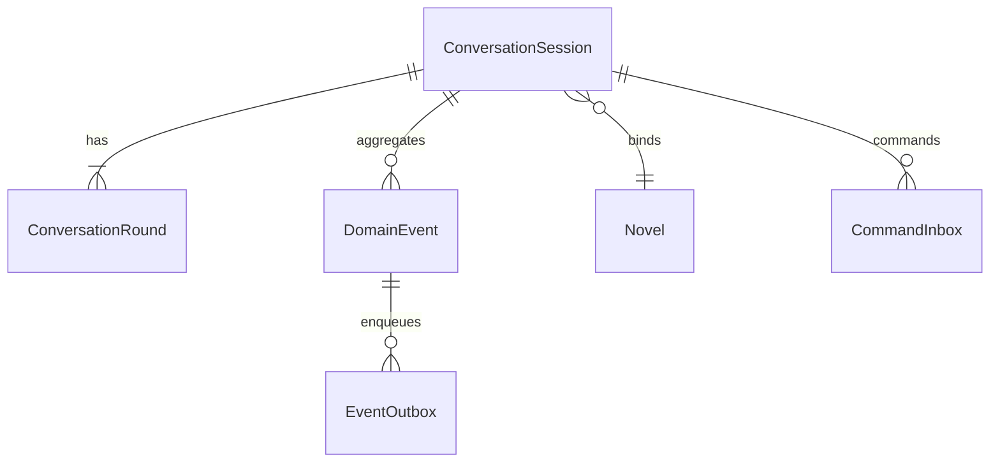

# 数据模型设计

## 领域实体

1. ConversationSession：对话会话（scope=GENESIS，scope_id=novel_id）
2. ConversationRound：对话轮次（分层 round_path）
3. DomainEvent：领域事件（事件溯源）
4. EventOutbox：事务性发件箱（可靠投递）
5. CommandInbox：命令收件箱（幂等 + 重试）
6. Novel/WorldRule/Character/...：图模型（Neo4j）

## 实体关系



## 数据模型定义

```typescript
export interface DomainEvent {
  event_id: string
  event_type: string
  aggregate_type: string
  aggregate_id: string
  payload: any
  metadata?: Record<string, any>
  created_at: string
}
```

```python
from dataclasses import dataclass
from datetime import datetime

@dataclass
class EventOutboxRow:
    id: str
    topic: str
    key: str | None
    partition_key: str | None
    payload: dict
    headers: dict | None
    status: str
    retry_count: int
    max_retries: int
    created_at: datetime
```

## 数据访问层

### 数据库模式设计（PostgreSQL 完整实现）

```sql
-- 枚举类型定义
CREATE TYPE command_status AS ENUM ('RECEIVED','PROCESSING','COMPLETED','FAILED');
CREATE TYPE outbox_status   AS ENUM ('PENDING','SENDING','SENT','FAILED');

-- 会话表（conversation_sessions）
CREATE TABLE conversation_sessions (
    id UUID PRIMARY KEY,
    scope_type TEXT NOT NULL,                 -- GENESIS/CHAPTER/REVIEW/...
    scope_id TEXT NOT NULL,                   -- 绑定业务实体ID（创世阶段=novel_id）
    status TEXT NOT NULL DEFAULT 'ACTIVE',    -- ACTIVE/COMPLETED/ABANDONED/PAUSED
    stage TEXT,                               -- 当前业务阶段（可选）
    state JSONB,                              -- 会话聚合/摘要
    version INTEGER NOT NULL DEFAULT 0,       -- 乐观锁版本（OCC）
    created_at TIMESTAMPTZ NOT NULL DEFAULT NOW(),
    updated_at TIMESTAMPTZ NOT NULL DEFAULT NOW()
);
CREATE INDEX IF NOT EXISTS idx_conv_sessions_scope ON conversation_sessions (scope_type, scope_id);
CREATE INDEX IF NOT EXISTS idx_conv_sessions_updated_at ON conversation_sessions (updated_at DESC);

-- 轮次表（conversation_rounds）
CREATE TABLE conversation_rounds (
    session_id UUID NOT NULL REFERENCES conversation_sessions(id) ON DELETE CASCADE,
    round_path TEXT NOT NULL,                 -- '1','2','2.1','2.1.1'
    role TEXT NOT NULL,                       -- user/assistant/system/tool
    input JSONB,
    output JSONB,
    tool_calls JSONB,
    model TEXT,
    tokens_in INTEGER,
    tokens_out INTEGER,
    latency_ms INTEGER,
    cost NUMERIC,
    correlation_id TEXT,
    created_at TIMESTAMPTZ NOT NULL DEFAULT NOW(),
    PRIMARY KEY (session_id, round_path)
);
CREATE INDEX IF NOT EXISTS idx_conv_rounds_session_created ON conversation_rounds (session_id, created_at);
CREATE INDEX IF NOT EXISTS idx_conv_rounds_correlation ON conversation_rounds (correlation_id);

-- 命令收件箱（CommandInbox，CQRS命令侧）
CREATE TABLE command_inbox (
    id UUID PRIMARY KEY DEFAULT gen_random_uuid(),
    session_id UUID NOT NULL,                         -- 会话标识
    command_type TEXT NOT NULL,                       -- 命令类型（如 ConfirmStoryConception, GenerateWorldview）
    idempotency_key TEXT UNIQUE NOT NULL,             -- 幂等键，确保同一命令不会被重复处理
    payload JSONB,                                     -- 命令载荷，包含命令执行所需的所有数据
    status command_status NOT NULL DEFAULT 'RECEIVED', -- 命令状态（RECEIVED/PROCESSING/COMPLETED/FAILED）
    error_message TEXT,                               -- 错误信息（当状态为FAILED时必填）
    retry_count INTEGER NOT NULL DEFAULT 0,           -- 重试次数，用于失败重试机制
    created_at TIMESTAMPTZ NOT NULL DEFAULT NOW(),
    updated_at TIMESTAMPTZ NOT NULL DEFAULT NOW()
);
-- 核心索引：支持幂等性和高效查询
CREATE UNIQUE INDEX idx_command_inbox_unique_pending_command
    ON command_inbox(session_id, command_type)
    WHERE status IN ('RECEIVED', 'PROCESSING');
CREATE INDEX idx_command_inbox_session_id ON command_inbox(session_id);
CREATE INDEX idx_command_inbox_status ON command_inbox(status);
CREATE INDEX idx_command_inbox_command_type ON command_inbox(command_type);
CREATE INDEX idx_command_inbox_created_at ON command_inbox(created_at);
CREATE INDEX idx_command_inbox_session_status ON command_inbox(session_id, status);
CREATE INDEX idx_command_inbox_status_created ON command_inbox(status, created_at);

-- 领域事件表（Event Sourcing事件存储）
CREATE TABLE domain_events (
    sequence_id BIGSERIAL PRIMARY KEY,                -- 自增主键，确保严格顺序
    event_id UUID NOT NULL DEFAULT gen_random_uuid(), -- 事件唯一标识
    correlation_id UUID,                              -- 关联ID（跟踪整个流程）
    causation_id UUID,                                -- 因果ID（触发此事件的前一个事件）
    event_type TEXT NOT NULL,                         -- 事件类型（点式命名）
    event_version INTEGER NOT NULL DEFAULT 1,         -- 事件版本
    aggregate_type TEXT NOT NULL,                     -- 聚合类型
    aggregate_id TEXT NOT NULL,                       -- 聚合根ID
    payload JSONB NOT NULL,                           -- 事件数据
    metadata JSONB,                                   -- 元数据
    created_at TIMESTAMPTZ NOT NULL DEFAULT NOW()
);
CREATE INDEX idx_domain_events_event_id ON domain_events(event_id);
CREATE INDEX idx_domain_events_aggregate ON domain_events(aggregate_type, aggregate_id);
CREATE INDEX idx_domain_events_correlation ON domain_events(correlation_id);
CREATE INDEX idx_domain_events_event_type ON domain_events(event_type);
CREATE INDEX idx_domain_events_created_at ON domain_events(created_at);

-- 事件发件箱（Outbox，事务性可靠投递）
CREATE TABLE event_outbox (
    id UUID PRIMARY KEY DEFAULT gen_random_uuid(),
    topic TEXT NOT NULL,                         -- 主题（Kafka / 逻辑主题）
    key TEXT,                                   -- key（顺序/分区控制）
    partition_key TEXT,                         -- 分区键（可选）
    payload JSONB NOT NULL,                     -- 事件载荷
    headers JSONB,                              -- 元信息（event_type使用点式命名、version、trace等）
    status outbox_status NOT NULL DEFAULT 'PENDING',
    retry_count INT NOT NULL DEFAULT 0,
    max_retries INT NOT NULL DEFAULT 5,
    last_error TEXT,
    scheduled_at TIMESTAMPTZ,                   -- 延迟发送（可选）
    sent_at TIMESTAMPTZ,                        -- 成功发送时间
    created_at TIMESTAMPTZ NOT NULL DEFAULT now()
);
CREATE INDEX idx_event_outbox_status ON event_outbox(status);
CREATE INDEX idx_event_outbox_topic ON event_outbox(topic);
CREATE INDEX idx_event_outbox_created_at ON event_outbox(created_at);
CREATE INDEX idx_event_outbox_pending_scheduled ON event_outbox(status, scheduled_at);
CREATE INDEX idx_event_outbox_retry_count ON event_outbox(retry_count);
CREATE INDEX idx_event_outbox_topic_status ON event_outbox(topic, status);
CREATE INDEX idx_event_outbox_status_created ON event_outbox(status, created_at);
CREATE INDEX idx_event_outbox_key ON event_outbox(key);
CREATE INDEX idx_event_outbox_partition_key ON event_outbox(partition_key);
```

## Neo4j 图模型数据库实现

```cypher
-- Neo4j 5.x 标准语法
-- 注意：所有节点的主键统一为 novel_id（Novel节点）或 id（其他节点）

-- 小说节点
MERGE (n:Novel {
    novel_id: 'uuid',        -- 统一使用 novel_id 作为主键
    app_id: 'infinite-scribe',
    title: 'string',
    created_at: datetime()
})

-- 角色节点（8维度）
MERGE (c:Character {
    id: 'uuid',
    novel_id: 'uuid',        -- 关联到小说
    name: 'string',
    appearance: 'text',      -- 外貌
    personality: 'text',     -- 性格
    background: 'text',      -- 背景
    motivation: 'text',      -- 动机
    goals: 'text',          -- 目标
    obstacles: 'text',      -- 障碍
    arc: 'text',            -- 转折
    wounds: 'text'          -- 心结
})

-- 角色状态节点（支持连续性校验）
MERGE (cs:CharacterState {
    id: 'uuid',
    character_id: 'uuid',
    chapter: 0,             -- 章节号
    age: 0,                 -- 年龄
    status: 'string',
    attributes: '{}'        -- JSON 字符串
})

-- 世界规则节点
MERGE (w:WorldRule {
    id: 'uuid',
    novel_id: 'uuid',
    dimension: 'string',    -- 地理/历史/文化/规则/社会
    rule: 'text',
    priority: 0,            -- 优先级（冲突时使用）
    scope: '{}',            -- 适用范围（地域/时间）
    examples: '{}',
    constraints: '{}',
    created_at: datetime()  -- 创建时间（冲突判定）
})

-- 事件节点（支持时间线校验）
MERGE (e:Event {
    id: 'uuid',
    novel_id: 'uuid',
    description: 'text',
    timestamp: datetime(),
    type: 'string'          -- normal/time_skip/battle等
})

-- 位置节点（支持空间校验）
MERGE (l:Location {
    id: 'uuid',
    novel_id: 'uuid',
    name: 'string',
    x: 0.0,                 -- 坐标X
    y: 0.0,                 -- 坐标Y
    timestamp: datetime()   -- 时间戳
})

-- 交通工具节点
MERGE (t:Transportation {
    id: 'uuid',
    type: 'string',         -- walk/horse/car/teleport等
    speed: 0.0              -- km/h
})

-- 关系定义（支持一致性校验）
MATCH (c1:Character {id: 'uuid1'}), (c2:Character {id: 'uuid2'})
MERGE (c1)-[:RELATES_TO {
    strength: 8,            -- 关系强度1-10
    type: 'friend',         -- friend/enemy/knows_of等
    symmetric: true         -- 是否对称关系
}]->(c2)

-- 角色与小说关系
MATCH (c:Character {id: 'uuid'}), (n:Novel {novel_id: 'uuid'})
MERGE (c)-[:BELONGS_TO]->(n)

-- 角色与状态关系
MATCH (c:Character {id: 'uuid'}), (cs:CharacterState {character_id: 'uuid'})
MERGE (c)-[:HAS_STATE]->(cs)

-- 角色位置关系
MATCH (c:Character {id: 'uuid'}), (l:Location {id: 'uuid'})
MERGE (c)-[:LOCATED_AT {timestamp: datetime()}]->(l)

-- 角色使用工具关系
MATCH (c:Character {id: 'uuid'}), (t:Transportation {id: 'uuid'})
MERGE (c)-[:USES]->(t)

-- 世界规则管理关系
MATCH (w:WorldRule {id: 'uuid'}), (n:Novel {novel_id: 'uuid'})
MERGE (w)-[:GOVERNS]->(n)

-- 规则冲突关系
MATCH (w1:WorldRule {id: 'uuid1'}), (w2:WorldRule {id: 'uuid2'})
MERGE (w1)-[:CONFLICTS_WITH {
    severity: 'major'       -- critical/major/minor
}]->(w2)

-- 事件因果关系
MATCH (e1:Event {id: 'uuid1'}), (e2:Event {id: 'uuid2'})
MERGE (e1)-[:CAUSES]->(e2)

-- 事件涉及角色
MATCH (e:Event {id: 'uuid'}), (c:Character {id: 'uuid'})
MERGE (e)-[:INVOLVES]->(c)

-- 事件发生地点
MATCH (e:Event {id: 'uuid'}), (l:Location {id: 'uuid'})
MERGE (e)-[:OCCURS_AT]->(l)

-- ==================== Neo4j 5.x 约束定义 ====================
-- 唯一性约束（使用 Neo4j 5.x 语法）
CREATE CONSTRAINT unique_novel_novel_id IF NOT EXISTS
FOR (n:Novel) REQUIRE n.novel_id IS UNIQUE;

CREATE CONSTRAINT unique_character_id IF NOT EXISTS
FOR (c:Character) REQUIRE c.id IS UNIQUE;

CREATE CONSTRAINT unique_world_rule_id IF NOT EXISTS
FOR (w:WorldRule) REQUIRE w.id IS UNIQUE;

CREATE CONSTRAINT unique_event_id IF NOT EXISTS
FOR (e:Event) REQUIRE e.id IS UNIQUE;

CREATE CONSTRAINT unique_location_id IF NOT EXISTS
FOR (l:Location) REQUIRE l.id IS UNIQUE;

-- Node Key 约束（Neo4j 5.x 支持）
CREATE CONSTRAINT character_state_key IF NOT EXISTS
FOR (cs:CharacterState) REQUIRE (cs.character_id, cs.chapter) IS NODE KEY;

-- ==================== Neo4j 5.x 索引定义 ====================
-- 性能优化索引（使用 Neo4j 5.x 语法）
CREATE INDEX novel_app_id_index IF NOT EXISTS
FOR (n:Novel) ON (n.app_id);

CREATE INDEX character_novel_index IF NOT EXISTS
FOR (c:Character) ON (c.novel_id);

CREATE INDEX worldrule_novel_index IF NOT EXISTS
FOR (w:WorldRule) ON (w.novel_id);

CREATE INDEX event_novel_index IF NOT EXISTS
FOR (e:Event) ON (e.novel_id);

CREATE INDEX event_timestamp_index IF NOT EXISTS
FOR (e:Event) ON (e.timestamp);

CREATE INDEX location_novel_index IF NOT EXISTS
FOR (l:Location) ON (l.novel_id);

CREATE INDEX location_coords_index IF NOT EXISTS
FOR (l:Location) ON (l.x, l.y);

CREATE INDEX character_state_chapter_index IF NOT EXISTS
FOR (cs:CharacterState) ON (cs.chapter);
```

## Milvus 向量数据库实现

### 集合Schema定义

```python
collection_schema = {
    "name": "novel_embeddings_v1",  # 版本化命名
    "fields": [
        {"name": "id", "type": DataType.INT64, "is_primary": True},
        {"name": "novel_id", "type": DataType.VARCHAR, "max_length": 36},
        {"name": "content_type", "type": DataType.VARCHAR, "max_length": 50},
        {"name": "content", "type": DataType.VARCHAR, "max_length": 8192},
        {"name": "embedding", "type": DataType.FLOAT_VECTOR, "dim": 768},
        {"name": "created_at", "type": DataType.INT64},  # 时间戳
        {"name": "version", "type": DataType.INT32},      # 内容版本
        {"name": "metadata", "type": DataType.JSON}       # 扩展元数据
    ],
    "index": {
        "type": "HNSW",
        "metric": "COSINE",
        "params": {"M": 32, "efConstruction": 200}
    },
    "partition": {
        "key": "novel_id",  # 按小说分区
        "ttl": 90 * 24 * 3600  # 90天TTL
    }
}
```

### VectorService封装层实现

```python
from typing import List, Dict, Optional
import numpy as np
from dataclasses import dataclass
from pymilvus import Collection, utility

@dataclass
class VectorConfig:
    """向量配置"""
    model_name: str = "qwen3-embedding-0.6b"
    dimension: int = 768
    metric_type: str = "COSINE"
    index_type: str = "HNSW"
    collection_version: int = 1

class VectorService:
    """向量服务封装层"""

    def __init__(self, config: VectorConfig):
        self.config = config
        self.collection_name = f"novel_embeddings_v{config.collection_version}"
        self._init_collection()

    async def create_collection(self, force: bool = False):
        """创建集合"""
        if utility.has_collection(self.collection_name) and not force:
            return

        # 创建集合schema
        schema = self._build_schema()
        collection = Collection(
            name=self.collection_name,
            schema=schema,
            using='default'
        )

        # 创建索引
        await self._create_index(collection)

        # 设置TTL
        await self._set_ttl(collection)

        return collection

    async def upsert_embeddings(
        self,
        novel_id: str,
        contents: List[str],
        embeddings: List[np.ndarray],
        content_types: List[str],
        versions: Optional[List[int]] = None
    ):
        """批量插入/更新向量"""
        collection = Collection(self.collection_name)

        # 准备数据
        entities = []
        for i, (content, embedding, content_type) in enumerate(
            zip(contents, embeddings, content_types)
        ):
            entity = {
                "novel_id": novel_id,
                "content": content[:8192],  # 截断超长文本
                "content_type": content_type,
                "embedding": embedding.tolist(),
                "created_at": int(time.time()),
                "version": versions[i] if versions else 1,
                "metadata": {}
            }
            entities.append(entity)

        # 批量插入
        collection.insert(entities)
        collection.flush()

        return len(entities)

    async def search_similar(
        self,
        novel_id: str,
        query_embedding: np.ndarray,
        content_type: Optional[str] = None,
        top_k: int = 10,
        min_score: float = 0.6
    ) -> List[Dict]:
        """相似度搜索"""
        collection = Collection(self.collection_name)
        collection.load()

        # 构建搜索参数
        search_params = {
            "metric_type": self.config.metric_type,
            "params": {"ef": 200}
        }

        # 构建过滤表达式
        expr = f'novel_id == "{novel_id}"'
        if content_type:
            expr += f' and content_type == "{content_type}"'

        # 执行搜索
        results = collection.search(
            data=[query_embedding.tolist()],
            anns_field="embedding",
            param=search_params,
            limit=top_k,
            expr=expr,
            output_fields=["content", "content_type", "version", "metadata"]
        )

        # 过滤低分结果
        filtered_results = []
        for hit in results[0]:
            if hit.score >= min_score:
                filtered_results.append({
                    "id": hit.id,
                    "content": hit.entity.get("content"),
                    "content_type": hit.entity.get("content_type"),
                    "version": hit.entity.get("version"),
                    "score": hit.score,
                    "metadata": hit.entity.get("metadata")
                })

        return filtered_results

    async def migrate_to_new_model(
        self,
        new_config: VectorConfig,
        batch_size: int = 1000
    ):
        """模型变更迁移"""
        old_collection = Collection(self.collection_name)
        new_service = VectorService(new_config)

        # 创建新集合
        await new_service.create_collection()

        # 批量迁移数据
        offset = 0
        while True:
            # 读取旧数据
            old_data = old_collection.query(
                expr="",
                offset=offset,
                limit=batch_size,
                output_fields=["novel_id", "content", "content_type", "version"]
            )

            if not old_data:
                break

            # 使用新模型重新生成embedding
            contents = [item["content"] for item in old_data]
            new_embeddings = await self._generate_embeddings(
                contents,
                new_config.model_name
            )

            # 插入新集合
            await new_service.upsert_embeddings(
                novel_id=old_data[0]["novel_id"],
                contents=contents,
                embeddings=new_embeddings,
                content_types=[item["content_type"] for item in old_data],
                versions=[item["version"] for item in old_data]
            )

            offset += batch_size

        # 切换别名
        utility.do_bulk_insert(
            collection_name=new_service.collection_name,
            alias="novel_embeddings_active"
        )

        return new_service

## 模型变更策略

```yaml
model_migration_strategy:
  trigger:
    - dimension_change # 维度变化（如768→1024）
    - metric_change # 度量变化（如COSINE→L2）
    - model_upgrade # 模型升级（如qwen3→qwen4）

  process:
    1_preparation:
      - create_new_collection # 创建新版本集合
      - setup_dual_write # 设置双写模式

    2_migration:
      - batch_reindex # 批量重建索引
      - validate_quality # 验证搜索质量
      - gradual_traffic # 逐步切换流量

    3_cleanup:
      - switch_alias # 切换活跃别名
      - archive_old # 归档旧集合
      - delete_after_30d # 30天后删除
```