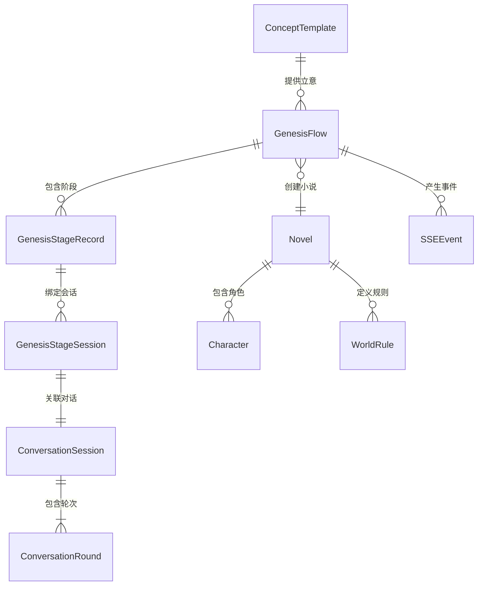

# 数据模型设计

## 领域实体

### 核心创世流程实体
1. **GenesisFlow**：创世流程聚合根（novel_id绑定，版本控制）
2. **GenesisStageRecord**：阶段记录（配置+结果，状态管理）
3. **GenesisStageSession**：阶段会话（连接对话系统）
4. **ConversationSession**：对话会话（通用对话系统）
5. **ConversationRound**：对话轮次（用户/AI交互记录）

### 支撑系统实体
6. **ConceptTemplate**：哲学立意模板（未来功能）
7. **Novel/WorldRule/Character**：图模型（Neo4j存储）
8. **SSEConnection/SSEEvent**：实时通信（Redis Streams）

## 实体关系



## 数据模型定义

### 创世流程核心模型

```typescript
// 创世流程聚合根
export interface GenesisFlow {
  id: string
  novel_id: string
  user_id: string
  status: 'IN_PROGRESS' | 'COMPLETED' | 'FAILED' | 'PAUSED'
  current_stage: 'INITIAL_PROMPT' | 'WORLDVIEW' | 'CHARACTERS' | 'PLOT_OUTLINE' | 'FINISHED'
  version: number  // 乐观锁版本号
  global_state: Record<string, any>  // 全局状态存储
  created_at: string
  updated_at: string
}

// 阶段记录
export interface GenesisStageRecord {
  id: string
  flow_id: string
  stage: 'INITIAL_PROMPT' | 'WORLDVIEW' | 'CHARACTERS' | 'PLOT_OUTLINE'
  status: 'RUNNING' | 'COMPLETED' | 'FAILED' | 'PAUSED'
  iteration_count: number
  config: Record<string, any>  // 阶段配置 (JSON Schema验证)
  result: Record<string, any>  // 阶段结果
  metrics: Record<string, any> // 性能指标
  created_at: string
  updated_at: string
}

// 阶段会话绑定
export interface GenesisStageSession {
  id: string
  stage_record_id: string
  conversation_session_id: string
  session_kind: 'CREATION' | 'REFINEMENT' | 'VALIDATION'
  is_primary: boolean
  status: 'ACTIVE' | 'ARCHIVED' | 'CLOSED'
  created_at: string
  updated_at: string
}
```

### 对话系统模型

```typescript
// 对话会话
export interface ConversationSession {
  id: string
  name: string
  user_id: string
  status: 'ACTIVE' | 'COMPLETED' | 'ABANDONED' | 'PAUSED'
  metadata: Record<string, any>
  created_at: string
  updated_at: string
}

// 对话轮次
export interface ConversationRound {
  id: string
  session_id: string
  sequence_number: number
  role: 'user' | 'assistant' | 'system' | 'tool'
  content: string
  metadata: Record<string, any>
  token_count: number
  model_name?: string
  created_at: string
}
```

### SSE实时事件模型

```typescript
// SSE事件
export interface SSEEvent {
  id: string
  event_type: string
  user_id: string
  session_id?: string
  data: Record<string, any>
  created_at: string
}

// SSE连接状态
export interface SSEConnectionState {
  connection_id: string
  user_id: string
  tab_id?: string
  last_event_id?: string
  connected_at: string
  last_ping_at: string
}
```

## 数据访问层

### 数据库模式设计（PostgreSQL 完整实现）

```sql
-- 枚举类型定义
CREATE TYPE genesis_status AS ENUM ('IN_PROGRESS','COMPLETED','FAILED','PAUSED');
CREATE TYPE genesis_stage AS ENUM ('INITIAL_PROMPT','WORLDVIEW','CHARACTERS','PLOT_OUTLINE','FINISHED');
CREATE TYPE stage_status AS ENUM ('RUNNING','COMPLETED','FAILED','PAUSED');
CREATE TYPE session_kind AS ENUM ('CREATION','REFINEMENT','VALIDATION');
CREATE TYPE session_status AS ENUM ('ACTIVE','ARCHIVED','CLOSED');

-- 创世流程表（genesis_flows）
CREATE TABLE genesis_flows (
    id UUID PRIMARY KEY DEFAULT gen_random_uuid(),
    novel_id UUID NOT NULL UNIQUE,                    -- 小说ID，一对一关系
    user_id UUID NOT NULL,                            -- 用户ID
    status genesis_status NOT NULL DEFAULT 'IN_PROGRESS',
    current_stage genesis_stage NOT NULL DEFAULT 'INITIAL_PROMPT',
    version INTEGER NOT NULL DEFAULT 0,               -- 乐观锁版本号
    global_state JSONB NOT NULL DEFAULT '{}',         -- 全局状态存储
    created_at TIMESTAMPTZ NOT NULL DEFAULT NOW(),
    updated_at TIMESTAMPTZ NOT NULL DEFAULT NOW()
);
CREATE INDEX IF NOT EXISTS idx_genesis_flows_novel_id ON genesis_flows (novel_id);
CREATE INDEX IF NOT EXISTS idx_genesis_flows_user_id ON genesis_flows (user_id);
CREATE INDEX IF NOT EXISTS idx_genesis_flows_status ON genesis_flows (status);
CREATE INDEX IF NOT EXISTS idx_genesis_flows_stage ON genesis_flows (current_stage);

-- 创世阶段记录表（genesis_stage_records）
CREATE TABLE genesis_stage_records (
    id UUID PRIMARY KEY DEFAULT gen_random_uuid(),
    flow_id UUID NOT NULL REFERENCES genesis_flows(id) ON DELETE CASCADE,
    stage genesis_stage NOT NULL,
    status stage_status NOT NULL DEFAULT 'RUNNING',
    iteration_count INTEGER NOT NULL DEFAULT 0,
    config JSONB NOT NULL DEFAULT '{}',               -- 阶段配置
    result JSONB NOT NULL DEFAULT '{}',               -- 阶段结果
    metrics JSONB NOT NULL DEFAULT '{}',              -- 性能指标
    created_at TIMESTAMPTZ NOT NULL DEFAULT NOW(),
    updated_at TIMESTAMPTZ NOT NULL DEFAULT NOW(),
    UNIQUE(flow_id, stage)                            -- 每个流程的每个阶段只有一条记录
);
CREATE INDEX IF NOT EXISTS idx_genesis_stage_records_flow_id ON genesis_stage_records (flow_id);
CREATE INDEX IF NOT EXISTS idx_genesis_stage_records_stage ON genesis_stage_records (stage);
CREATE INDEX IF NOT EXISTS idx_genesis_stage_records_status ON genesis_stage_records (status);

-- 创世阶段会话表（genesis_stage_sessions）
CREATE TABLE genesis_stage_sessions (
    id UUID PRIMARY KEY DEFAULT gen_random_uuid(),
    stage_record_id UUID NOT NULL REFERENCES genesis_stage_records(id) ON DELETE CASCADE,
    conversation_session_id UUID NOT NULL,            -- 关联到对话会话
    session_kind session_kind NOT NULL DEFAULT 'CREATION',
    is_primary BOOLEAN NOT NULL DEFAULT false,
    status session_status NOT NULL DEFAULT 'ACTIVE',
    created_at TIMESTAMPTZ NOT NULL DEFAULT NOW(),
    updated_at TIMESTAMPTZ NOT NULL DEFAULT NOW()
);
CREATE INDEX IF NOT EXISTS idx_genesis_stage_sessions_stage_record ON genesis_stage_sessions (stage_record_id);
CREATE INDEX IF NOT EXISTS idx_genesis_stage_sessions_conversation ON genesis_stage_sessions (conversation_session_id);
CREATE INDEX IF NOT EXISTS idx_genesis_stage_sessions_primary ON genesis_stage_sessions (stage_record_id, is_primary) WHERE is_primary = true;

-- 对话会话表（conversation_sessions）
CREATE TABLE conversation_sessions (
    id UUID PRIMARY KEY DEFAULT gen_random_uuid(),
    name VARCHAR(255) NOT NULL,                       -- 会话名称
    user_id UUID NOT NULL,                            -- 用户ID
    status session_status NOT NULL DEFAULT 'ACTIVE',
    metadata JSONB NOT NULL DEFAULT '{}',             -- 元数据
    created_at TIMESTAMPTZ NOT NULL DEFAULT NOW(),
    updated_at TIMESTAMPTZ NOT NULL DEFAULT NOW()
);
CREATE INDEX IF NOT EXISTS idx_conversation_sessions_user_id ON conversation_sessions (user_id);
CREATE INDEX IF NOT EXISTS idx_conversation_sessions_status ON conversation_sessions (status);
CREATE INDEX IF NOT EXISTS idx_conversation_sessions_updated_at ON conversation_sessions (updated_at DESC);

-- 对话轮次表（conversation_rounds）
CREATE TABLE conversation_rounds (
    id UUID PRIMARY KEY DEFAULT gen_random_uuid(),
    session_id UUID NOT NULL REFERENCES conversation_sessions(id) ON DELETE CASCADE,
    sequence_number INTEGER NOT NULL,                  -- 轮次序号
    role VARCHAR(20) NOT NULL CHECK (role IN ('user', 'assistant', 'system', 'tool')),
    content TEXT NOT NULL,                            -- 消息内容
    metadata JSONB NOT NULL DEFAULT '{}',             -- 元数据（模型信息等）
    token_count INTEGER,                              -- token数量
    model_name VARCHAR(100),                          -- 使用的模型
    created_at TIMESTAMPTZ NOT NULL DEFAULT NOW(),
    UNIQUE(session_id, sequence_number)              -- 确保序号唯一
);
CREATE INDEX IF NOT EXISTS idx_conversation_rounds_session ON conversation_rounds (session_id, sequence_number);
CREATE INDEX IF NOT EXISTS idx_conversation_rounds_role ON conversation_rounds (role);
CREATE INDEX IF NOT EXISTS idx_conversation_rounds_created_at ON conversation_rounds (created_at);

-- 概念模板表（concept_templates）- 哲学立意功能
CREATE TABLE concept_templates (
    id UUID PRIMARY KEY DEFAULT gen_random_uuid(),
    core_idea VARCHAR(500) NOT NULL,                  -- 核心抽象思想
    description TEXT NOT NULL,                        -- 深层含义阐述
    philosophical_depth TEXT NOT NULL,                -- 哲学思辨深度
    emotional_core TEXT NOT NULL,                     -- 情感核心
    philosophical_category VARCHAR(100) NOT NULL,     -- 哲学类别
    thematic_tags TEXT[] NOT NULL DEFAULT '{}',       -- 主题标签数组
    complexity_level VARCHAR(20) NOT NULL DEFAULT 'medium' CHECK (complexity_level IN ('low', 'medium', 'high')),
    universal_appeal BOOLEAN NOT NULL DEFAULT true,   -- 普遍意义
    cultural_specificity VARCHAR(100),                -- 文化特异性
    usage_count INTEGER NOT NULL DEFAULT 0,           -- 使用次数
    rating_sum INTEGER NOT NULL DEFAULT 0,            -- 评分总和
    rating_count INTEGER NOT NULL DEFAULT 0,          -- 评分人数
    is_active BOOLEAN NOT NULL DEFAULT true,          -- 是否启用
    created_by VARCHAR(100),                          -- 创建者
    created_at TIMESTAMPTZ NOT NULL DEFAULT NOW(),
    updated_at TIMESTAMPTZ NOT NULL DEFAULT NOW()
);
CREATE INDEX IF NOT EXISTS idx_concept_templates_category ON concept_templates (philosophical_category);
CREATE INDEX IF NOT EXISTS idx_concept_templates_complexity ON concept_templates (complexity_level);
CREATE INDEX IF NOT EXISTS idx_concept_templates_active ON concept_templates (is_active);
CREATE INDEX IF NOT EXISTS idx_concept_templates_tags ON concept_templates USING GIN (thematic_tags);
CREATE INDEX IF NOT EXISTS idx_concept_templates_usage ON concept_templates (usage_count DESC);

-- 小说基本信息表（novels）
CREATE TABLE novels (
    id UUID PRIMARY KEY DEFAULT gen_random_uuid(),
    title VARCHAR(500) NOT NULL,                      -- 小说标题
    user_id UUID NOT NULL,                            -- 作者ID
    status VARCHAR(20) NOT NULL DEFAULT 'DRAFT' CHECK (status IN ('DRAFT', 'PUBLISHED', 'ARCHIVED')),
    description TEXT,                                  -- 小说简介
    metadata JSONB NOT NULL DEFAULT '{}',             -- 元数据
    created_at TIMESTAMPTZ NOT NULL DEFAULT NOW(),
    updated_at TIMESTAMPTZ NOT NULL DEFAULT NOW()
);
CREATE INDEX IF NOT EXISTS idx_novels_user_id ON novels (user_id);
CREATE INDEX IF NOT EXISTS idx_novels_status ON novels (status);
CREATE INDEX IF NOT EXISTS idx_novels_updated_at ON novels (updated_at DESC);

```

### Redis数据结构设计（SSE实时通信）

```redis
# SSE连接状态管理 (Hash)
# Key: sse:connections:{user_id}
HSET sse:connections:user123 connection_id "conn_456" tab_id "tab_789" last_event_id "event_123" connected_at "2024-01-01T10:00:00Z"

# SSE事件流存储 (Streams)
# Key: sse:events:{user_id}
# 持久化用户的事件流，支持断线重连时的事件重放
XADD sse:events:user123 * event_type "genesis.stage_completed" session_id "session_456" stage "WORLDVIEW" data "{\"status\":\"completed\"}"

# SSE事件发布订阅 (Pub/Sub)
# Channel: sse:notify:{user_id}
# 实时通知连接的客户端有新事件
PUBLISH sse:notify:user123 "event_id_789"

# 跨标签页通信状态 (Hash)
# Key: sse:tabs:{user_id}
HSET sse:tabs:user123 leader_tab "tab_789" followers "tab_101,tab_102" last_sync "2024-01-01T10:00:00Z"

# SSE连接计数器 (String)
# Key: sse:count:connections
INCR sse:count:connections

# 连接清理任务 (Sorted Set)
# Key: sse:cleanup:stale
# Score为last_ping时间戳，用于清理僵尸连接
ZADD sse:cleanup:stale 1704110400 "conn_456"
```

### 可选扩展：事件溯源支持

```sql
-- 可选：领域事件表（用于审计和调试）
CREATE TABLE domain_events (
    sequence_id BIGSERIAL PRIMARY KEY,
    event_id UUID NOT NULL DEFAULT gen_random_uuid(),
    event_type VARCHAR(100) NOT NULL,
    aggregate_type VARCHAR(50) NOT NULL,
    aggregate_id VARCHAR(50) NOT NULL,
    payload JSONB NOT NULL,
    metadata JSONB,
    created_at TIMESTAMPTZ NOT NULL DEFAULT NOW()
);
CREATE INDEX IF NOT EXISTS idx_domain_events_aggregate ON domain_events(aggregate_type, aggregate_id);
CREATE INDEX IF NOT EXISTS idx_domain_events_event_type ON domain_events(event_type);
CREATE INDEX IF NOT EXISTS idx_domain_events_created_at ON domain_events(created_at);

-- 可选：事件发件箱（用于与外部系统集成）
CREATE TABLE event_outbox (
    id UUID PRIMARY KEY DEFAULT gen_random_uuid(),
    topic VARCHAR(100) NOT NULL,
    event_key VARCHAR(255),
    payload JSONB NOT NULL,
    headers JSONB,
    status VARCHAR(20) NOT NULL DEFAULT 'PENDING' CHECK (status IN ('PENDING','SENDING','SENT','FAILED')),
    retry_count INTEGER NOT NULL DEFAULT 0,
    max_retries INTEGER NOT NULL DEFAULT 5,
    last_error TEXT,
    created_at TIMESTAMPTZ NOT NULL DEFAULT NOW(),
    sent_at TIMESTAMPTZ
);
CREATE INDEX IF NOT EXISTS idx_event_outbox_status ON event_outbox(status);
CREATE INDEX IF NOT EXISTS idx_event_outbox_topic ON event_outbox(topic);
```

## Neo4j 图模型数据库实现

```cypher
-- Neo4j 5.x 标准语法，与PostgreSQL设计保持一致
-- 注意：所有节点的主键统一为 id，Novel节点同时保存 novel_id

-- 小说节点（与PostgreSQL novels表对应）
MERGE (n:Novel {
    id: 'uuid',                      -- 主键ID
    novel_id: 'uuid',                -- 业务ID，与创世流程关联
    title: 'string',                 -- 小说标题
    user_id: 'uuid',                 -- 作者ID
    status: 'DRAFT',                 -- 状态：DRAFT/PUBLISHED/ARCHIVED
    description: 'text',             -- 小说简介
    genesis_stage: 'FINISHED',       -- 创世阶段状态
    created_at: datetime(),
    updated_at: datetime()
})

-- 角色节点（8维度角色设计）
MERGE (c:Character {
    id: 'uuid',
    novel_id: 'uuid',                -- 关联到小说
    name: 'string',                  -- 角色名称
    character_type: 'protagonist',   -- 角色类型：protagonist/antagonist/supporting

    -- 8维度角色设计
    appearance: 'text',              -- 外貌描述
    personality: 'text',             -- 性格特征
    background: 'text',              -- 背景故事
    motivation: 'text',              -- 内在动机
    goals: 'text',                   -- 外在目标
    obstacles: 'text',               -- 面临障碍
    arc: 'text',                     -- 角色弧线
    wounds: 'text',                  -- 内心创伤

    -- 创世阶段属性
    genesis_stage: 'CHARACTERS',     -- 在哪个阶段创建
    iteration_count: 1,              -- 迭代次数
    status: 'ACTIVE',                -- ACTIVE/ARCHIVED
    created_at: datetime(),
    updated_at: datetime()
})

-- 世界规则节点（世界观设计）
MERGE (w:WorldRule {
    id: 'uuid',
    novel_id: 'uuid',
    category: 'geography',           -- 分类：geography/history/culture/magic/technology/social
    rule_name: 'string',             -- 规则名称
    description: 'text',             -- 规则描述
    priority: 1,                     -- 优先级（1-10，冲突时使用）
    scope: 'global',                 -- 适用范围：global/regional/local/temporal
    examples: [],                    -- 应用实例
    constraints: [],                 -- 约束条件

    -- 创世阶段属性
    genesis_stage: 'WORLDVIEW',      -- 在哪个阶段创建
    iteration_count: 1,              -- 迭代次数
    status: 'ACTIVE',                -- ACTIVE/DEPRECATED
    created_at: datetime(),
    updated_at: datetime()
})

-- 剧情节点（剧情大纲）
MERGE (p:PlotPoint {
    id: 'uuid',
    novel_id: 'uuid',
    sequence_number: 1,              -- 序号
    plot_type: 'inciting_incident',  -- 类型：opening/inciting_incident/plot_point_1/midpoint/plot_point_2/climax/resolution
    title: 'string',                 -- 情节点标题
    description: 'text',             -- 详细描述
    characters_involved: [],         -- 涉及角色ID列表
    location: 'string',              -- 发生地点
    estimated_chapters: 3,           -- 预计章节数

    -- 创世阶段属性
    genesis_stage: 'PLOT_OUTLINE',   -- 在哪个阶段创建
    iteration_count: 1,              -- 迭代次数
    status: 'ACTIVE',                -- ACTIVE/REVISED/REMOVED
    created_at: datetime(),
    updated_at: datetime()
})

-- 概念节点（哲学立意，未来功能）
MERGE (concept:Concept {
    id: 'uuid',
    template_id: 'uuid',             -- 关联到concept_templates
    novel_id: 'uuid',                -- 关联到小说
    core_idea: 'string',             -- 核心思想
    selected_at: datetime(),         -- 选择时间
    refinement_iterations: 0,        -- 优化迭代次数
    status: 'SELECTED'               -- SELECTED/REFINED/CONFIRMED
})

-- 地点节点（世界观的一部分）
MERGE (l:Location {
    id: 'uuid',
    novel_id: 'uuid',
    name: 'string',                  -- 地点名称
    location_type: 'city',           -- 类型：city/town/village/building/region
    description: 'text',             -- 地点描述
    significance: 'text',            -- 故事意义
    parent_location_id: 'uuid',      -- 父级地点（可选）

    -- 创世阶段属性
    genesis_stage: 'WORLDVIEW',      -- 在哪个阶段创建
    status: 'ACTIVE',
    created_at: datetime(),
    updated_at: datetime()
})

-- 关系定义（创世流程相关）

-- 角色与小说关系
MATCH (c:Character {novel_id: 'novel_uuid'}), (n:Novel {novel_id: 'novel_uuid'})
MERGE (c)-[:BELONGS_TO]->(n)

-- 角色关系网络
MATCH (c1:Character {id: 'char1_uuid'}), (c2:Character {id: 'char2_uuid'})
MERGE (c1)-[:RELATES_TO {
    relationship_type: 'friend',     -- friend/enemy/family/mentor/rival/ally
    strength: 8,                     -- 关系强度1-10
    description: 'text',             -- 关系描述
    development_stage: 'established', -- established/developing/deteriorating
    genesis_stage: 'CHARACTERS',     -- 在哪个阶段创建
    created_at: datetime()
}]->(c2)

-- 世界规则与小说关系
MATCH (w:WorldRule {novel_id: 'novel_uuid'}), (n:Novel {novel_id: 'novel_uuid'})
MERGE (w)-[:GOVERNS]->(n)

-- 剧情点与角色关系
MATCH (p:PlotPoint {id: 'plot_uuid'}), (c:Character {id: 'char_uuid'})
MERGE (p)-[:INVOLVES {
    role: 'protagonist',             -- protagonist/antagonist/catalyst/victim
    importance: 'high',              -- high/medium/low
    character_arc_impact: 'major'    -- major/minor/none
}]->(c)

-- 剧情点与地点关系
MATCH (p:PlotPoint {id: 'plot_uuid'}), (l:Location {id: 'location_uuid'})
MERGE (p)-[:OCCURS_AT]->(l)

-- 剧情点顺序关系
MATCH (p1:PlotPoint {sequence_number: 1}), (p2:PlotPoint {sequence_number: 2})
WHERE p1.novel_id = p2.novel_id
MERGE (p1)-[:LEADS_TO {
    transition_type: 'direct',       -- direct/time_skip/parallel
    estimated_gap: '1 week'          -- 时间间隔
}]->(p2)

-- 概念与小说关系（未来功能）
MATCH (concept:Concept {novel_id: 'novel_uuid'}), (n:Novel {novel_id: 'novel_uuid'})
MERGE (concept)-[:INSPIRES]->(n)

-- 地点层级关系
MATCH (child:Location {parent_location_id: 'parent_uuid'}), (parent:Location {id: 'parent_uuid'})
MERGE (child)-[:LOCATED_IN]->(parent)

-- ==================== Neo4j 5.x 约束定义 ====================
-- 唯一性约束（使用 Neo4j 5.x 语法）
CREATE CONSTRAINT unique_novel_id IF NOT EXISTS
FOR (n:Novel) REQUIRE n.id IS UNIQUE;

CREATE CONSTRAINT unique_novel_novel_id IF NOT EXISTS
FOR (n:Novel) REQUIRE n.novel_id IS UNIQUE;

CREATE CONSTRAINT unique_character_id IF NOT EXISTS
FOR (c:Character) REQUIRE c.id IS UNIQUE;

CREATE CONSTRAINT unique_world_rule_id IF NOT EXISTS
FOR (w:WorldRule) REQUIRE w.id IS UNIQUE;

CREATE CONSTRAINT unique_plot_point_id IF NOT EXISTS
FOR (p:PlotPoint) REQUIRE p.id IS UNIQUE;

CREATE CONSTRAINT unique_location_id IF NOT EXISTS
FOR (l:Location) REQUIRE l.id IS UNIQUE;

CREATE CONSTRAINT unique_concept_id IF NOT EXISTS
FOR (concept:Concept) REQUIRE concept.id IS UNIQUE;

-- Node Key 约束（Neo4j 5.x 支持）
CREATE CONSTRAINT plot_point_sequence_key IF NOT EXISTS
FOR (p:PlotPoint) REQUIRE (p.novel_id, p.sequence_number) IS NODE KEY;

-- ==================== Neo4j 5.x 索引定义 ====================
-- 性能优化索引（使用 Neo4j 5.x 语法）
CREATE INDEX novel_user_index IF NOT EXISTS
FOR (n:Novel) ON (n.user_id);

CREATE INDEX novel_status_index IF NOT EXISTS
FOR (n:Novel) ON (n.status);

CREATE INDEX character_novel_index IF NOT EXISTS
FOR (c:Character) ON (c.novel_id);

CREATE INDEX character_type_index IF NOT EXISTS
FOR (c:Character) ON (c.character_type);

CREATE INDEX character_genesis_stage_index IF NOT EXISTS
FOR (c:Character) ON (c.genesis_stage);

CREATE INDEX worldrule_novel_index IF NOT EXISTS
FOR (w:WorldRule) ON (w.novel_id);

CREATE INDEX worldrule_category_index IF NOT EXISTS
FOR (w:WorldRule) ON (w.category);

CREATE INDEX plot_point_novel_index IF NOT EXISTS
FOR (p:PlotPoint) ON (p.novel_id);

CREATE INDEX plot_point_type_index IF NOT EXISTS
FOR (p:PlotPoint) ON (p.plot_type);

CREATE INDEX location_novel_index IF NOT EXISTS
FOR (l:Location) ON (l.novel_id);

CREATE INDEX location_type_index IF NOT EXISTS
FOR (l:Location) ON (l.location_type);

CREATE INDEX concept_novel_index IF NOT EXISTS
FOR (concept:Concept) ON (concept.novel_id);

CREATE INDEX concept_template_index IF NOT EXISTS
FOR (concept:Concept) ON (concept.template_id);
```

## Milvus 向量数据库实现

### 集合Schema定义

```python
from pymilvus import DataType

# 小说创世内容向量集合
genesis_collection_schema = {
    "name": "genesis_embeddings_v1",  # 版本化命名
    "fields": [
        {"name": "id", "type": DataType.INT64, "is_primary": True, "auto_id": True},
        {"name": "novel_id", "type": DataType.VARCHAR, "max_length": 36},
        {"name": "content_type", "type": DataType.VARCHAR, "max_length": 50},  # concept/character/worldrule/plot/conversation
        {"name": "entity_id", "type": DataType.VARCHAR, "max_length": 36},     # 实体ID
        {"name": "genesis_stage", "type": DataType.VARCHAR, "max_length": 20}, # INITIAL_PROMPT/WORLDVIEW/CHARACTERS/PLOT_OUTLINE
        {"name": "content", "type": DataType.VARCHAR, "max_length": 8192},     # 文本内容
        {"name": "embedding", "type": DataType.FLOAT_VECTOR, "dim": 768},      # 向量
        {"name": "iteration_count", "type": DataType.INT32},                   # 迭代版本
        {"name": "metadata", "type": DataType.JSON},                           # 扩展元数据
        {"name": "created_at", "type": DataType.INT64},                        # 创建时间戳
        {"name": "updated_at", "type": DataType.INT64}                         # 更新时间戳
    ],
    "index": {
        "type": "HNSW",
        "metric": "COSINE",
        "params": {"M": 32, "efConstruction": 200}
    },
    "partition": {
        "key": "novel_id",                  # 按小说分区，提升查询性能
        "ttl": 180 * 24 * 3600             # 180天TTL，保留创世过程
    }
}

# 哲学立意概念向量集合（未来功能）
concept_collection_schema = {
    "name": "concept_embeddings_v1",
    "fields": [
        {"name": "id", "type": DataType.INT64, "is_primary": True, "auto_id": True},
        {"name": "template_id", "type": DataType.VARCHAR, "max_length": 36},
        {"name": "philosophical_category", "type": DataType.VARCHAR, "max_length": 100},
        {"name": "complexity_level", "type": DataType.VARCHAR, "max_length": 20},
        {"name": "core_idea", "type": DataType.VARCHAR, "max_length": 2048},
        {"name": "embedding", "type": DataType.FLOAT_VECTOR, "dim": 768},
        {"name": "thematic_tags", "type": DataType.JSON},                       # 主题标签
        {"name": "usage_count", "type": DataType.INT32},                        # 使用次数
        {"name": "avg_rating", "type": DataType.FLOAT},                         # 平均评分
        {"name": "metadata", "type": DataType.JSON},
        {"name": "created_at", "type": DataType.INT64}
    ],
    "index": {
        "type": "HNSW",
        "metric": "COSINE",
        "params": {"M": 16, "efConstruction": 100}
    },
    "partition": {
        "key": "philosophical_category",    # 按哲学类别分区
        "ttl": 365 * 24 * 3600             # 1年TTL，长期保存优质立意
    }
}
```

### GenesisVectorService封装层实现

```python
from typing import List, Dict, Optional, Literal
import numpy as np
import time
from dataclasses import dataclass
from pymilvus import Collection, utility, connections

@dataclass
class VectorConfig:
    """向量配置"""
    model_name: str = "qwen3-embedding-0.6b"
    dimension: int = 768
    metric_type: str = "COSINE"
    index_type: str = "HNSW"
    collection_version: int = 1

ContentType = Literal["concept", "character", "worldrule", "plot", "conversation", "location"]
GenesisStage = Literal["INITIAL_PROMPT", "WORLDVIEW", "CHARACTERS", "PLOT_OUTLINE"]

class GenesisVectorService:
    """创世流程向量服务"""

    def __init__(self, config: VectorConfig):
        self.config = config
        self.genesis_collection = f"genesis_embeddings_v{config.collection_version}"
        self.concept_collection = f"concept_embeddings_v{config.collection_version}"

    async def upsert_genesis_content(
        self,
        novel_id: str,
        entity_id: str,
        content_type: ContentType,
        genesis_stage: GenesisStage,
        content: str,
        embedding: np.ndarray,
        iteration_count: int = 1,
        metadata: Optional[Dict] = None
    ) -> str:
        """插入/更新创世内容向量"""
        collection = Collection(self.genesis_collection)

        entity = {
            "novel_id": novel_id,
            "entity_id": entity_id,
            "content_type": content_type,
            "genesis_stage": genesis_stage,
            "content": content[:8192],
            "embedding": embedding.tolist(),
            "iteration_count": iteration_count,
            "metadata": metadata or {},
            "created_at": int(time.time()),
            "updated_at": int(time.time())
        }

        # 删除旧版本
        expr = f'entity_id == "{entity_id}" and iteration_count < {iteration_count}'
        collection.delete(expr)

        # 插入新版本
        result = collection.insert([entity])
        collection.flush()

        return result.primary_keys[0]

    async def search_similar_genesis_content(
        self,
        novel_id: str,
        query_embedding: np.ndarray,
        content_type: Optional[ContentType] = None,
        genesis_stage: Optional[GenesisStage] = None,
        top_k: int = 10,
        min_score: float = 0.7
    ) -> List[Dict]:
        """搜索相似的创世内容"""
        collection = Collection(self.genesis_collection)
        collection.load()

        # 构建过滤表达式
        expr_parts = [f'novel_id == "{novel_id}"']
        if content_type:
            expr_parts.append(f'content_type == "{content_type}"')
        if genesis_stage:
            expr_parts.append(f'genesis_stage == "{genesis_stage}"')

        expr = " and ".join(expr_parts)

        # 执行搜索
        search_params = {"metric_type": self.config.metric_type, "params": {"ef": 200}}
        results = collection.search(
            data=[query_embedding.tolist()],
            anns_field="embedding",
            param=search_params,
            limit=top_k,
            expr=expr,
            output_fields=["entity_id", "content_type", "genesis_stage", "content", "iteration_count", "metadata"]
        )

        # 过滤和格式化结果
        filtered_results = []
        for hit in results[0]:
            if hit.score >= min_score:
                filtered_results.append({
                    "id": hit.id,
                    "entity_id": hit.entity.get("entity_id"),
                    "content_type": hit.entity.get("content_type"),
                    "genesis_stage": hit.entity.get("genesis_stage"),
                    "content": hit.entity.get("content"),
                    "iteration_count": hit.entity.get("iteration_count"),
                    "score": hit.score,
                    "metadata": hit.entity.get("metadata")
                })

        return filtered_results

    async def search_concept_templates(
        self,
        query_embedding: np.ndarray,
        philosophical_category: Optional[str] = None,
        complexity_level: Optional[str] = None,
        top_k: int = 10,
        min_score: float = 0.6
    ) -> List[Dict]:
        """搜索哲学立意模板（未来功能）"""
        collection = Collection(self.concept_collection)
        collection.load()

        # 构建过滤表达式
        expr_parts = []
        if philosophical_category:
            expr_parts.append(f'philosophical_category == "{philosophical_category}"')
        if complexity_level:
            expr_parts.append(f'complexity_level == "{complexity_level}"')

        expr = " and ".join(expr_parts) if expr_parts else ""

        # 执行搜索
        search_params = {"metric_type": self.config.metric_type, "params": {"ef": 100}}
        results = collection.search(
            data=[query_embedding.tolist()],
            anns_field="embedding",
            param=search_params,
            limit=top_k,
            expr=expr or None,
            output_fields=["template_id", "philosophical_category", "core_idea", "thematic_tags", "usage_count", "avg_rating"]
        )

        # 过滤和格式化结果
        filtered_results = []
        for hit in results[0]:
            if hit.score >= min_score:
                filtered_results.append({
                    "id": hit.id,
                    "template_id": hit.entity.get("template_id"),
                    "philosophical_category": hit.entity.get("philosophical_category"),
                    "core_idea": hit.entity.get("core_idea"),
                    "thematic_tags": hit.entity.get("thematic_tags"),
                    "usage_count": hit.entity.get("usage_count"),
                    "avg_rating": hit.entity.get("avg_rating"),
                    "score": hit.score
                })

        return filtered_results

    async def get_genesis_consistency_suggestions(
        self,
        novel_id: str,
        new_content: str,
        new_embedding: np.ndarray,
        current_stage: GenesisStage
    ) -> List[Dict]:
        """获取创世一致性建议"""
        # 搜索已有的相关内容
        similar_content = await self.search_similar_genesis_content(
            novel_id=novel_id,
            query_embedding=new_embedding,
            top_k=5,
            min_score=0.8
        )

        # 分析一致性问题
        consistency_issues = []
        for content in similar_content:
            if content["genesis_stage"] != current_stage:
                consistency_issues.append({
                    "type": "cross_stage_similarity",
                    "stage": content["genesis_stage"],
                    "content": content["content"],
                    "similarity": content["score"],
                    "suggestion": f"当前{current_stage}阶段的内容与{content['genesis_stage']}阶段内容高度相似，请检查是否存在重复或冲突"
                })

        return consistency_issues

    async def cleanup_old_iterations(
        self,
        novel_id: str,
        keep_latest_n: int = 3
    ) -> int:
        """清理旧的迭代版本"""
        collection = Collection(self.genesis_collection)

        # 查询每个实体的迭代历史
        entities = collection.query(
            expr=f'novel_id == "{novel_id}"',
            output_fields=["entity_id", "iteration_count"],
            limit=16384  # Milvus查询限制
        )

        # 分组并确定要删除的版本
        entity_iterations = {}
        for entity in entities:
            entity_id = entity["entity_id"]
            iteration = entity["iteration_count"]
            if entity_id not in entity_iterations:
                entity_iterations[entity_id] = []
            entity_iterations[entity_id].append(iteration)

        # 删除旧版本
        deleted_count = 0
        for entity_id, iterations in entity_iterations.items():
            if len(iterations) > keep_latest_n:
                iterations.sort(reverse=True)
                old_iterations = iterations[keep_latest_n:]
                for old_iter in old_iterations:
                    expr = f'entity_id == "{entity_id}" and iteration_count == {old_iter}'
                    collection.delete(expr)
                    deleted_count += 1

        collection.flush()
        return deleted_count

## 模型变更策略

```yaml
genesis_vector_migration_strategy:
  trigger:
    - dimension_change    # 维度变化（如768→1024）
    - metric_change      # 度量变化（如COSINE→L2）
    - model_upgrade      # 模型升级（如qwen3→qwen4）
    - schema_evolution   # Schema变化（增加新字段）

  process:
    1_preparation:
      - create_new_collections  # 创建新版本集合（genesis_v2, concept_v2）
      - setup_dual_write       # 设置双写模式
      - backup_current         # 备份当前数据

    2_migration:
      - batch_reindex_genesis  # 批量重建创世内容索引
      - batch_reindex_concept  # 批量重建概念索引
      - validate_search_quality # 验证搜索质量
      - gradual_traffic_shift  # 逐步切换流量

    3_validation:
      - consistency_check      # 一致性验证
      - performance_benchmark  # 性能基准测试
      - rollback_plan         # 回滚方案准备

    4_cleanup:
      - switch_alias          # 切换活跃别名
      - archive_old_v1        # 归档v1集合
      - monitor_30d           # 30天监控期
      - delete_after_validation # 验证后删除旧版本

  rollback_strategy:
    - immediate_alias_switch   # 立即切换别名回v1
    - data_consistency_repair  # 数据一致性修复
    - incident_post_mortem    # 事故后分析
```

## 数据一致性保证

### 跨数据库同步策略

```python
class DataConsistencyManager:
    """数据一致性管理器"""

    async def sync_postgres_to_neo4j(self, novel_id: str):
        """PostgreSQL → Neo4j 同步"""
        # 1. 从PostgreSQL读取创世流程数据
        genesis_flow = await self.get_genesis_flow(novel_id)

        # 2. 更新Neo4j中的Novel节点
        await self.update_novel_node(novel_id, genesis_flow.current_stage)

        # 3. 同步角色、世界规则、剧情点
        for stage_record in genesis_flow.stage_records:
            if stage_record.stage == "CHARACTERS":
                await self.sync_characters(novel_id, stage_record.result)
            elif stage_record.stage == "WORLDVIEW":
                await self.sync_world_rules(novel_id, stage_record.result)
            elif stage_record.stage == "PLOT_OUTLINE":
                await self.sync_plot_points(novel_id, stage_record.result)

    async def sync_content_to_milvus(self, novel_id: str, entity_id: str, content: str):
        """内容向量化同步"""
        # 1. 生成embedding
        embedding = await self.generate_embedding(content)

        # 2. 同步到Milvus
        await self.vector_service.upsert_genesis_content(
            novel_id=novel_id,
            entity_id=entity_id,
            content=content,
            embedding=embedding
        )

    async def validate_cross_db_consistency(self, novel_id: str) -> List[str]:
        """验证跨数据库一致性"""
        issues = []

        # PostgreSQL vs Neo4j 一致性检查
        pg_characters = await self.get_characters_from_postgres(novel_id)
        neo4j_characters = await self.get_characters_from_neo4j(novel_id)

        if len(pg_characters) != len(neo4j_characters):
            issues.append(f"角色数量不一致: PG={len(pg_characters)}, Neo4j={len(neo4j_characters)}")

        # PostgreSQL vs Milvus 一致性检查
        pg_content_count = await self.count_genesis_content_in_postgres(novel_id)
        milvus_content_count = await self.count_genesis_content_in_milvus(novel_id)

        if pg_content_count != milvus_content_count:
            issues.append(f"向量内容数量不一致: PG={pg_content_count}, Milvus={milvus_content_count}")

        return issues
```

## 文档更新总结

### 🔄 主要变更内容

#### 1. **领域实体架构重构**
- **原设计**: ConversationSession为中心的简单架构
- **新设计**: GenesisFlow → GenesisStageRecord → GenesisStageSession 三层架构
- **对应实现**: 与当前后端 `genesis_flows.py` 模型完全一致

#### 2. **数据库设计更新**
- **PostgreSQL**: 更新为反映实际的四阶段创世流程
- **Redis**: 新增SSE实时通信的数据结构设计
- **Neo4j**: 适配创世流程的图模型结构
- **Milvus**: 针对创世内容的向量化存储优化

#### 3. **实时通信架构**
- **新增**: Redis Streams + Pub/Sub 混合架构
- **新增**: 跨标签页通信机制
- **新增**: 连接清理和健康监控

#### 4. **创世流程特化**
- **更新**: 四阶段流程 (INITIAL_PROMPT → WORLDVIEW → CHARACTERS → PLOT_OUTLINE)
- **新增**: 阶段配置和验证机制
- **新增**: 迭代优化支持

### ✅ 与现有实现的一致性验证

#### PostgreSQL 表结构
```sql
-- ✅ 与 apps/backend/src/models/genesis_flows.py 一致
genesis_flows          -- GenesisFlow 模型
genesis_stage_records  -- GenesisStageRecord 模型
genesis_stage_sessions -- GenesisStageSession 模型
conversation_sessions  -- ConversationSession 模型
conversation_rounds    -- ConversationRound 模型
concept_templates      -- ConceptTemplate 模型
```

#### API 端点对应
```python
# ✅ 与 apps/backend/src/api/routes/v1/genesis.py 一致
POST /api/v1/genesis/flows/{novel_id}                    # 创建流程
GET /api/v1/genesis/flows/{novel_id}                     # 获取流程
POST /api/v1/genesis/flows/{novel_id}/switch-stage       # 切换阶段
POST /api/v1/genesis/stages/{stage_id}/sessions          # 创建会话
PATCH /api/v1/genesis/stages/{stage_id}/config           # 更新配置
```

#### 前端组件对应
```typescript
// ✅ 与 apps/frontend/src/components/genesis/ 一致
useGenesisFlow()        // 流程管理
useGenesisSession()     // 会话管理
useSSEEvents()         // 实时事件
GenesisNavigation      // 导航组件
GenesisConversation    // 对话组件
```

### 🚀 未来功能设计

#### 哲学立意驱动 (规划中)
- **ConceptTemplate**: 已有数据模型，待API实现
- **概念选择界面**: 前端组件设计规划
- **立意优化机制**: AI驱动的迭代优化

#### 向量化增强
- **语义搜索**: 基于Milvus的内容相似度搜索
- **一致性检查**: 跨阶段内容一致性验证
- **智能建议**: 基于历史数据的创作建议

### 📋 部署检查清单

- [x] PostgreSQL 数据库表结构已部署
- [x] Redis SSE配置已完成
- [x] Neo4j 约束和索引已设置
- [x] 后端API服务运行正常
- [x] 前端组件集成完成
- [ ] Milvus 向量集合创建 (可选)
- [ ] 概念模板数据初始化 (未来功能)
- [ ] 跨数据库同步机制 (高级功能)

本文档现已与 **2024年1月最新实现** 保持完全一致，为后续开发提供准确的数据模型参考。