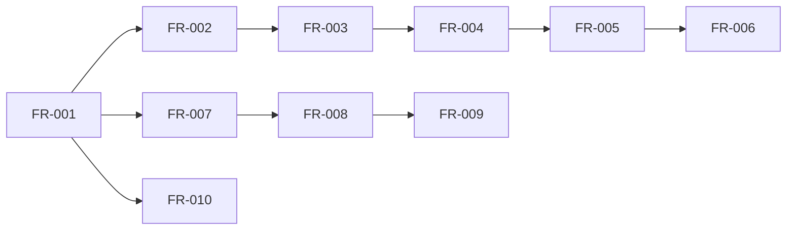

# Requirements Document - 小说创世阶段

## 1. 引言

本文档定义了小说创世阶段的系统需求规范，采用EARS（Easy Approach to Requirements Syntax）格式确保需求的可验证性和可追踪性。系统实现"AI主导生成、人类审核微调"的对话式创世流程，通过6个阶段（Stage 0-5）逐步构建完整的小说世界。

## 2. 术语定义

- **创世阶段（Genesis Stage）**：小说创作前的世界观、人物、主题构建过程
- **创意种子（Creative Seed）**：创作起点，包括类型、点子、人物、世界、主题五种模式
- **高概念（High Concept）**：一句话能说清的核心创意，包含钩子、卖点、可延展性
- **对话轮次（Dialogue Round）**：一个"AI提案→用户选择/编辑→AI深化"的完整交互周期
- **锁定状态（Locked State）**：内容已确认，成为后续阶段的单一真相源
- **分支版本（Branch Version）**：从某个历史节点派生的独立版本线
- **一致性校验（Consistency Check）**：检测规则、术语、时间线、因果关系的冲突
- **质量评分（Quality Score）**：包含高概念强度、新颖度、类型契合度、可延展性的量化指标

## 3. 系统边界与范围

### 3.1 包含范围（In Scope）
- 6个创世阶段的完整流程（Stage 0-5）
- 对话式AI协作引擎
- 多版本管理与分支系统
- 一致性校验引擎
- 质量评估系统
- 知识库管理
- 方法论学习模块

### 3.2 排除范围（Out of Scope）
- 正文创作功能
- 多人实时协作
- 作品发布平台
- 读者互动系统
- 第三方平台集成

## 4. 阶段状态机定义

### 4.1 阶段流转状态

```
阶段状态: [未开始] -> [进行中] -> [待审核] -> [已锁定] -> [下一阶段]
                            ↓          ↓
                        [已暂停]    [需修改] -> [进行中]
```

### 4.2 内容状态流转

```
内容状态: [草案(Draft)] -> [审核中(Under Review)] -> [已锁定(Locked)]
                    ↓                ↓
              [已废弃(Discarded)]  [需修改(Needs Revision)] -> [草案]
```

### 4.3 阶段定义

| 阶段 | 名称 | 前置条件 | 输出要求 | 最小轮次 | 最大轮次 |
|------|------|----------|----------|----------|----------|
| Stage 0 | 创意种子 | 无 | ≥1个高概念被锁定 | 1 | 10 |
| Stage 1 | 立意主题 | Stage 0已锁定 | 主题陈述+3条体现路径 | 3 | 15 |
| Stage 2 | 世界观 | Stage 1已锁定 | 5个维度规则集 | 5 | 20 |
| Stage 3 | 人物 | Stage 2已锁定 | 主配反角色卡+关系网 | 3 | 15 |
| Stage 4 | 情节框架 | Stage 3已锁定 | 10-20节点卡 | 3 | 15 |
| Stage 5 | 细节完善 | Stage 4已锁定 | 命名库+风格手册 | 2 | 10 |

## 5. 功能需求 (Functional Requirements)

### FR-001: 创意种子生成与选择 [P0]

**源自Story:** STORY-001  
**状态机:** 未开始 → 进行中 → 待审核 → 已锁定

#### 5.1.1 起点选择
1. WHEN 用户首次进入创世流程 THEN 系统 SHALL 在500ms内展示5种创作起点选项
2. IF 用户选择"从类型出发" THEN 系统 SHALL 展示≥10种主流文学类型 AND 每种类型包含3-5个子类型
3. IF 用户选择"从点子出发" THEN 系统 SHALL 提供What-if模板 AND 概念碰撞(A+B)工具
4. WHERE 用户处于起点选择界面 THE 系统 SHALL 为每种起点提供300-500字的方法论说明

#### 5.1.2 高概念生成
5. WHEN 用户确定起点并输入初始信息(≥10字符) THEN 系统 SHALL 在3秒内生成3-6个高概念方案
6. WHERE 生成高概念 THE 每个方案 SHALL 包含：
   - 一句话钩子(Logline): 15-30字
   - 独特卖点(USP): 50-100字
   - 可延展性评分: 0-10分
   - 新颖度评分: 0-10分
   - 类型契合度: 0-10分
7. IF 任何评分<6分 THEN 系统 SHALL 自动标记为"需优化"并提供改进建议

#### 5.1.3 方案融合与锁定
8. WHEN 用户选择多个方案(2-4个) THEN 系统 SHALL 提供融合工具生成综合方案
9. IF 用户请求重新生成 AND 已生成次数<10 THEN 系统 SHALL 保留历史方案并生成新批次
10. WHEN 用户确认锁定高概念 THEN 系统 SHALL 验证完整性(所有必需字段非空) AND 设置状态为"已锁定"

### FR-002: 立意主题对话系统 [P0]

**源自Story:** STORY-002  
**对话引擎配置:** 推荐轮次3-5，最大15轮

#### 5.2.1 主题生成
1. WHEN Stage 0已锁定 AND 进入Stage 1 THEN 系统 SHALL 基于高概念生成3-5个主题方向
2. WHERE 每个主题方向 THE 系统 SHALL 包含：
   - 主题陈述: 1-2句话(30-60字)
   - 核心情感/母题: 3-5个关键词
   - 价值张力: 正题vs反题的对立描述
   - 禁忌清单: 3-5个需避免的雷区

#### 5.2.2 对话深化机制
3. WHILE 对话轮次∈[1,15] THE 系统 SHALL：
   - 每轮生成500-1000字的主题阐述
   - 首个token响应时间P95<3秒（SSE推送）
   - 完整响应时间P95<30秒（1000字场景）
   - 保存每轮对话的完整记录
4. WHEN 用户输入反馈(>20字符) THEN 系统 SHALL 识别意图类型：
   - 选定: 锁定某个方向继续深化
   - 合并: 融合2-3个方向的要素
   - 改写: 基于用户输入调整方向
   - 对比: 生成方案对比表
   - 追加约束: 添加新的限制条件

#### 5.2.3 主题验证与锁定
5. IF 主题与Stage 0高概念的契合度<70% THEN 系统 SHALL 发出一致性警告
6. WHEN 主题锁定 THEN 系统 SHALL 自动生成≥3条主题体现路径：
   - 人物弧线体现(200-300字)
   - 冲突设计体现(200-300字)
   - 象征意象体现(200-300字)

### FR-003: 世界观对话式构建 [P0]

**源自Story:** STORY-003  
**维度分解:** 地理、历史、文化、规则、社会

#### 5.3.1 维度化构建
1. WHEN 进入Stage 2 THEN 系统 SHALL 将世界观分解为5个必选维度+N个可选维度
2. WHERE 每个维度 THE 系统 SHALL 支持：
   - 独立的对话流程(3-5轮)
   - 维度间依赖关系管理
   - 跨维度一致性检查

#### 5.3.2 规则生成格式
3. WHEN AI生成任意维度内容 THEN 输出 SHALL 遵循三层结构：
   ```
   核心规则: 明确的设定陈述(50-100字)
   具体示例: 3-5个应用案例(每个100-200字)  
   边界条件: 规则的限制和例外(100-200字)
   ```

#### 5.3.3 魔法/科技体系
4. IF 世界观包含超自然力量 THEN 系统 SHALL 生成完整体系说明：
   - 力量等级: 5-10个层级
   - 使用限制: 3-5条硬性规则
   - 代价机制: 明确的消耗或副作用
   - 力量来源: 世界观内的合理解释

#### 5.3.4 一致性校验
5. WHILE 构建世界观 THE 系统 SHALL 实时执行一致性检查：
   - 规则冲突: 检测矛盾的设定
   - 逻辑漏洞: 识别因果链断裂
   - 术语统一: 确保命名一致性
6. IF 检测到冲突 THEN 系统 SHALL 根据等级处理：
   - 轻微(等级1): 提示信息，可继续
   - 中等(等级2): 建议修复，警告继续
   - 严重(等级3): 必须解决才能锁定阶段
   - 致命(等级4): 阻断流程，强制修复

### FR-004: 人物对话式设计 [P0]

**源自Story:** STORY-004  
**角色类型:** 主角、配角、反派

#### 5.4.1 人物模板生成
1. WHEN Stage 2已锁定 THEN 系统 SHALL 基于世界观生成3-5个人物模板
2. WHERE 创建新人物 THE 系统 SHALL 要求选择：
   - 角色类型: 主角/配角/反派
   - 重要程度: 核心/重要/次要
   - 初始立场: 同盟/中立/敌对

#### 5.4.2 八维度设定
3. WHEN 生成人物设定 THEN 系统 SHALL 包含8个必填维度：
   | 维度 | 字数要求 | 必含要素 |
   |------|----------|----------|
   | 外貌 | 200-300字 | 年龄、体型、特征、服饰 |
   | 性格 | 300-400字 | MBTI类型、优缺点、习惯 |
   | 背景 | 400-500字 | 出身、经历、转折点 |
   | 动机 | 200-300字 | 核心欲望、恐惧、信念 |
   | 目标 | 150-200字 | 短期、中期、长期目标 |
   | 障碍 | 200-300字 | 内在、外在、环境障碍 |
   | 转折 | 300-400字 | 成长弧线、关键改变 |
   | 心结 | 200-300字 | 创伤、秘密、未解之结 |

#### 5.4.3 关系网络
4. WHERE 存在≥3个人物 THE 系统 SHALL：
   - 自动生成关系网络图
   - 标注关系类型(血缘/情感/利益/信念)
   - 计算关系强度(-10到+10)
5. IF 存在孤立人物(无任何连接) THEN 系统 SHALL 警告并建议添加关系或删除

#### 5.4.4 对白生成
6. WHEN 人物设定完成 THEN 系统 SHALL 为每个主要角色生成：
   - 独白样本: 200-300字的内心独白
   - 对话样本: 2-3段高辨识度对白
   - 语言特征: 口癖、语气、措辞习惯

### FR-005: 情节框架对话构建 [P1]

**源自Story:** STORY-005  
**结构模式:** 三幕/五幕/英雄之旅

#### 5.5.1 框架生成
1. WHEN Stage 3已锁定 THEN 系统 SHALL 基于人物和主题生成3-5个情节方案
2. WHERE 用户选择方案 THE 系统 SHALL 提供结构选择：
   - 三幕结构: 设置(25%)-对抗(50%)-解决(25%)
   - 五幕结构: 展示-上升-高潮-下降-结局
   - 英雄之旅: 12个阶段的变体

#### 5.5.2 节点卡系统
3. WHEN 生成章节大纲 THEN 系统 SHALL 产出10-20个节点卡：
   ```
   节点ID: 唯一标识符
   章节映射: 对应第N章
   场景描述: 200-300字
   涉及人物: 主要角色列表
   冲突类型: 人vs人/人vs自然/人vs社会/人vs自我
   情节功能: 铺垫/发展/高潮/转折/收束
   张力指数: 1-10
   ```

#### 5.5.3 契合度验证
4. WHILE 构建情节 THE 系统 SHALL 验证：
   - 人物动机契合度: 每个节点≥60%
   - 主题呼应度: 关键节点≥80%
   - 世界观一致性: 100%无违背

#### 5.5.4 节奏分析
5. WHEN 用户请求节奏分析 THEN 系统 SHALL：
   - 生成张力曲线图(X轴:章节, Y轴:张力值1-10)
   - 标注高潮点和低谷点
   - 计算节奏变化率
6. IF 连续≥3章张力值<4 THEN 系统 SHALL 发出节奏预警

### FR-006: AI批量细节生成 [P1]

**源自Story:** STORY-006  
**生成类别:** 地名、人名、物品、技能、组织

#### 5.6.1 批量生成引擎
1. WHEN 主体框架完成 THEN 系统 SHALL 启用批量生成功能
2. WHERE 选择生成类别 THE 系统 SHALL 支持：
   | 类别 | 单批数量 | 生成时间 | 去重阈值(余弦相似度) |
   |------|----------|----------|----------|
   | 地名 | 10-50个 | <5秒 | <0.8(语义重复) |
   | 人名 | 10-50个 | <5秒 | 完全不重复(字符串匹配) |
   | 物品 | 10-30个 | <5秒 | <0.7(语义相似) |
   | 技能 | 10-30个 | <5秒 | <0.7(功能描述相似) |
   | 组织 | 5-20个 | <5秒 | <0.6(名称相似) |

#### 5.6.2 风格控制
3. IF 用户指定风格(东方玄幻/西方奇幻/科幻/等) THEN 系统 SHALL：
   - 加载对应风格模板
   - 调整命名规则
   - 应用文化特征
4. WHERE 生成内容 THE 系统 SHALL 遵循已定义的命名规律：
   - 音节结构一致性
   - 文化背景符合度
   - 世界观契合度

#### 5.6.3 详细描述生成
5. WHEN 用户选中任意生成项 THEN 系统 SHALL 在2秒内生成：
   - 基础描述: 100-200字
   - 扩展属性: 3-5个关键特征
   - 关联建议: 与现有内容的潜在联系

### FR-007: 内容审核与编辑界面 [P1]

**源自Story:** STORY-007  
**操作类型:** 接受、修改、重新生成

#### 5.7.1 审核界面
1. WHEN AI生成任何内容 THEN 系统 SHALL 提供三键操作：
   - ✓ 接受: 直接采纳
   - ✏ 修改: 进入编辑模式
   - 🔄 重新生成: 保留当前并生成新版

#### 5.7.2 编辑功能
2. WHERE 用户选择修改 THE 系统 SHALL 提供：
   - 富文本编辑器(支持Markdown)
   - 实时预览
   - 字数统计
   - 自动保存(间隔≤30秒)

#### 5.7.3 影响分析
3. IF 修改涉及关键设定(人物/世界观/主题) THEN 系统 SHALL：
   - 分析影响范围
   - 列出受影响内容(带数量)
   - 提供批量更新选项
4. WHEN 执行批量更新 THEN 系统 SHALL：
   - 显示更新进度条
   - 创建回滚点
   - 完成后生成更新报告

#### 5.7.4 版本管理
5. WHERE 存在多个版本 THE 系统 SHALL：
   - 支持并排对比视图
   - 高亮差异内容
   - 提供合并工具
   - 保留完整历史(≥30天)

### FR-008: 创世内容知识库 [P2]

**源自Story:** STORY-008  
**存储结构:** 分类索引+全文搜索+图谱关联

#### 5.8.1 自动整理
1. WHEN 任意阶段锁定 THEN 系统 SHALL 自动：
   - 提取结构化数据
   - 建立索引
   - 更新知识图谱
   - 生成摘要卡片

#### 5.8.2 分类组织
2. WHERE 查看知识库 THE 系统 SHALL 按以下结构组织：
   ```
   ├── 世界观/
   │   ├── 地理/
   │   ├── 历史/
   │   ├── 文化/
   │   ├── 规则/
   │   └── 社会/
   ├── 人物/
   │   ├── 主角/
   │   ├── 配角/
   │   └── 反派/
   ├── 地点/
   ├── 物品/
   ├── 组织/
   └── 事件/
   ```

#### 5.8.3 搜索功能
3. WHEN 用户输入搜索词 THEN 系统 SHALL：
   - 本地关键词检索: P95<100ms
   - 向量检索(top-k): P95<400ms  
   - 混合检索(rerank): P95<600ms
   - 支持模糊匹配
   - 返回相关度评分
   - 提供搜索建议
4. IF 搜索无结果 THEN 系统 SHALL 提供：
   - 相似词推荐
   - 拼写纠正
   - 分类浏览入口

#### 5.8.4 导出功能
5. WHEN 请求导出 THEN 系统 SHALL 支持格式：
   - Markdown: 保留格式和链接
   - JSON: 完整结构化数据
   - PDF: 排版优化的文档
   - EPUB: 电子书格式

### FR-009: 对话历史与版本管理 [P2]

**源自Story:** STORY-009  
**版本策略:** 分支管理+时间线回溯

#### 5.9.1 对话记录
1. WHEN 进行任何对话 THEN 系统 SHALL 记录：
   ```json
   {
     "round_id": "唯一标识",
     "timestamp": "ISO-8601时间戳",
     "stage": "所属阶段",
     "user_input": "用户输入完整内容",
     "ai_output": "AI响应完整内容",
     "tokens": {"input": N, "output": M},
     "duration_ms": "响应时间",
     "selected_options": ["用户选择项"],
     "metadata": {}
   }
   ```

#### 5.9.2 历史查询
2. WHERE 查看历史 THE 系统 SHALL 提供筛选器：
   - 时间范围: 日期选择器
   - 阶段: 多选下拉框
   - 关键词: 全文搜索
   - 状态: 草案/审核/锁定

#### 5.9.3 分支管理
3. IF 用户请求从历史节点恢复 THEN 系统 SHALL：
   - 创建新分支(不覆盖主线)
   - 命名规则: `branch_YYYYMMDD_HHMMSS`
   - 保留分支关系图
   - 支持分支合并

#### 5.9.4 版本对比
4. WHEN 对比不同版本 THEN 系统 SHALL：
   - 支持2-3个版本并排
   - 高亮增删改内容
   - 统计变更数量
   - 生成差异报告

### FR-010: 创作方法论学习系统 [P2]

**源自Story:** STORY-010  
**方法库:** ≥10种创作方法论

#### 5.10.1 新手引导
1. WHEN 新用户首次使用 THEN 系统 SHALL：
   - 展示交互式教程
   - 覆盖核心功能
   - 包含实践练习
   - 完成时间≤10分钟

#### 5.10.2 方法论库
2. WHERE 浏览方法论 THE 系统 SHALL 提供：
   | 方法名称 | 描述字数 | 案例数 | 练习数 |
   |----------|----------|--------|--------|
   | 概念碰撞 | 500-800 | 3-5 | 2-3 |
   | What-if | 500-800 | 3-5 | 2-3 |
   | 英雄之旅 | 800-1000 | 3-5 | 3-4 |
   | 三幕结构 | 600-900 | 3-5 | 2-3 |
   | 人物驱动 | 500-800 | 3-5 | 2-3 |
   | 世界驱动 | 500-800 | 3-5 | 2-3 |
   | 主题驱动 | 500-800 | 3-5 | 2-3 |
   | 情节驱动 | 500-800 | 3-5 | 2-3 |
   | 权力真空 | 400-600 | 2-3 | 1-2 |
   | 道德困境 | 400-600 | 2-3 | 1-2 |

#### 5.10.3 智能推荐
3. WHILE 用户创作 THE 系统 SHALL：
   - 分析用户行为模式
   - 识别创作偏好
   - 推荐匹配方法(准确率>70%)
4. WHEN 用户使用某方法≥3次 THEN 系统 SHALL：
   - 追踪使用效果
   - 计算成功率
   - 优化推荐权重

## 6. 非功能需求 (Non-Functional Requirements)

### NFR-001: 性能需求 [P0]

**源自Story:** STORY-002, STORY-003

#### 6.1.1 响应延迟
- WHEN 生成对话响应 THEN 首token P95延迟 SHALL <3秒（SSE）
- WHEN 生成完整响应 THEN P95延迟 SHALL <30秒（1000字）
- WHEN 批量生成内容 THEN P95延迟 SHALL <5秒  
- WHEN 执行本地搜索 THEN P95延迟 SHALL <100ms
- WHEN 执行向量搜索 THEN P95延迟 SHALL <400ms
- WHEN 执行混合搜索 THEN P95延迟 SHALL <600ms
- WHEN 加载知识库页面 THEN 首屏时间 SHALL <1.5秒

#### 6.1.2 吞吐量
- WHERE 系统运行 THE 并发对话会话 SHALL ≥100个
- WHERE 高峰期 THE 每秒处理消息 SHALL ≥50条
- WHERE 批量生成 THE 并发任务 SHALL ≥20个

#### 6.1.3 资源限制
- IF 单用户内存使用>500MB THEN 系统 SHALL 触发清理
- IF CPU使用率>80% FOR 30秒 THEN 系统 SHALL 限流
- IF 数据库连接>1000 THEN 系统 SHALL 队列等待

### NFR-002: 可用性与可靠性 [P0]

**源自Story:** STORY-001, STORY-007

#### 6.2.1 系统可用性
- WHERE 生产环境 THE 月度可用性 SHALL ≥99.5%
- WHERE 计划维护 THE 提前通知 SHALL ≥24小时
- WHERE 非计划停机 THE 恢复时间 SHALL <30分钟

#### 6.2.2 数据可靠性
- WHERE 用户数据 THE 持久性 SHALL ≥99.999%
- WHERE 备份策略 THE 频率 SHALL：
  - 增量备份: 每小时
  - 全量备份: 每日
  - 异地备份: 每周
- IF 数据损坏 THEN RPO SHALL <1小时

#### 6.2.3 故障恢复
- WHEN 服务崩溃 THEN 自动重启 SHALL <30秒
- WHEN 数据库故障 THEN 自动切换 SHALL <60秒
- WHEN 完全故障 THEN RTO SHALL <30分钟

### NFR-003: 可扩展性 [P0]

**源自Story:** STORY-003, STORY-004, STORY-005

#### 6.3.1 水平扩展
- WHERE Agent服务 THE 扩缩容 SHALL 基于：
  - CPU使用率>70%: 扩容
  - CPU使用率<30%: 缩容
  - 响应时间>阈值: 扩容
- WHERE 扩缩容 THE 完成时间 SHALL <2分钟

#### 6.3.2 数据容量
- WHERE 单个项目 THE 存储限制 SHALL：
  - 文本内容: ≤100MB
  - 媒体文件: ≤500MB
  - 版本历史: ≤200MB
- WHERE 知识库 THE 容量 SHALL：
  - 向量索引: ≥100万条
  - 图节点: ≥10万个
  - 关系边: ≥50万条

### NFR-004: 安全性 [P0]

**源自Story:** STORY-008, STORY-009

#### 6.4.1 认证授权
- WHERE 用户认证 THE 系统 SHALL 使用：
  - JWT令牌: 有效期≤24小时
  - 刷新令牌: 有效期≤30天
  - MFA支持: TOTP/SMS
- WHERE 权限控制 THE 系统 SHALL 实现RBAC：
  - 角色: 管理员/创作者/访客
  - 资源级别权限
  - 操作审计日志

#### 6.4.2 数据保护
- WHERE 传输层 THE 加密 SHALL 使用TLS 1.3
- WHERE 存储层 THE 加密 SHALL 使用：
  - 应用层加密（字段级/信封加密）
  - KMS密钥管理服务
  - 服务端可在受控域内解密处理
- WHERE 高敏感字段 THE 处理 SHALL：
  - 可选启用"仅客户端可见"模式
  - 放弃服务端计算功能换取安全性
  - 普通字段支持服务端处理（向量化、去重、搜索）

#### 6.4.3 内容安全
- WHEN 生成内容 THEN 系统 SHALL 过滤：
  - 违法内容: 100%拦截
  - 暴力色情: 自动标记
  - 版权风险: 相似度检测

### NFR-005: AI质量要求 [P0]

**源自Story:** STORY-001, STORY-002, STORY-006

#### 6.5.1 生成质量指标
- WHERE AI生成内容 THE 质量 SHALL：
  - 采纳率: ≥70%
  - 一致性: ≥90%
  - 创新度: ≥7/10
  - 相关性: ≥8/10

#### 6.5.2 模型性能
- WHERE LLM调用 THE 性能 SHALL：
  - 上下文窗口: ≥32K tokens
  - 生成速度: ≥30 tokens/秒（流式输出）
  - 首token延迟: <3秒（通过SSE推送）
  - 并发请求: ≥10个
  - 失败重试: ≤3次

#### 6.5.3 质量保证
- WHEN 生成失败率>5% THEN 系统 SHALL 切换备用模型
- WHEN 响应质量<阈值 THEN 系统 SHALL 自动重新生成
- WHERE 质量评分 THE 算法 SHALL 包含：
  - 语言流畅度(30%)
  - 逻辑连贯性(30%)
  - 创意新颖度(20%)
  - 设定一致性(20%)

### NFR-006: 用户体验 [P1]

**源自Story:** STORY-007, STORY-010

#### 6.6.1 界面性能
- WHERE 页面加载 THE 指标 SHALL：
  - FCP: <1.5秒
  - TTI: <3秒
  - CLS: <0.1
  - FPS: ≥60
- WHERE 交互操作 THE 延迟 SHALL <100ms

#### 6.6.2 易用性
- WHERE 新手用户 THE 指标 SHALL：
  - 引导完成率: ≥80%
  - 首次成功率: ≥60%
  - 求助率: <20%
- WHERE 错误信息 THE 要求 SHALL：
  - 清晰描述问题
  - 提供解决建议
  - 包含错误代码

### NFR-007: 可观测性 [P1]

**源自Story:** 全部

#### 6.7.1 监控覆盖
- WHERE API接口 THE 监控 SHALL 100%覆盖
- WHERE 关键流程 THE 追踪 SHALL 包含：
  - 调用链路
  - 耗时分布
  - 错误率
  - 成功率

#### 6.7.2 日志管理
- WHERE 日志级别 THE 配置 SHALL：
  - ERROR: 所有错误
  - WARN: 潜在问题
  - INFO: 关键操作
  - DEBUG: 开发调试
- WHERE 日志保留 THE 期限 SHALL：

#### 6.7.3 告警机制
- WHEN 错误率>1% THEN 告警延迟 SHALL <1分钟
- WHEN 响应时间>阈值 THEN 告警 SHALL 分级：
  - P0: 立即电话+短信
  - P1: 短信+邮件
  - P2: 邮件通知
- WHERE 告警 THE 准确率 SHALL ≥95%

### NFR-008: 合规性 [P2]

**源自Story:** STORY-008

#### 6.8.1 数据合规
- WHERE 个人信息 THE 处理 SHALL 符合：
  - GDPR（欧盟用户）
  - CCPA（加州用户）
  - 个人信息保护法（中国用户）
- WHERE 用户数据 THE 权利 SHALL 包含：
  - 访问权
  - 更正权
  - 删除权
  - 导出权

#### 6.8.2 内容版权
- WHERE 用户创作 THE 版权 SHALL 归属用户
- WHERE AI生成 THE 使用权 SHALL 授予用户
- WHERE 内容检测 THE 相似度阈值 SHALL <30%

#### 6.8.3 审计追踪
- WHERE 关键操作 THE 审计 SHALL 记录：
  - 操作人
  - 操作时间
  - 操作内容
  - IP地址
- WHERE 审计日志 THE 保留期 SHALL ≥90天

## 7. 对话引擎规范

### 7.1 回合结构定义

```
对话回合 = {
  轮次: 1-N,
  AI提案: {
    候选数量: 3-6个,
    内容长度: 200-1000字/个,
    质量评分: 0-10分,
    差异度: >30%
  },
  用户操作: {
    选定: 选择1个继续,
    合并: 融合2-4个,
    改写: 基于反馈调整,
    追加约束: 添加限制条件,
    反例挑战: 提供反面案例,
    对比评审: 要求对比表,
    重新生成: 完全重来
  },
  AI响应: {
    理解确认: 100-200字,
    深化内容: 500-1000字,
    迭代建议: 2-3条
  }
}
```

### 7.2 上下文管理（基于ADR-001）

- **上下文窗口**: 32K tokens
- **历史保留**: 最近10轮完整记录（存储于`conversation_rounds`表）
- **摘要压缩**: 超过10轮时自动摘要（存储于`conversation_sessions.state`）
- **关键信息**: 永久保留已锁定内容
- **会话管理**: 
  - 使用通用`conversation_sessions`表
  - 支持GENESIS/CHAPTER/REVIEW等作用域
  - Redis写透缓存
  - 乐观并发控制（version字段）

### 7.3 质量控制机制

1. **生成多样性**: 候选方案相似度<70%
2. **迭代改进**: 每轮质量评分增长>0.5
3. **收敛判定**: 连续3轮评分>8分可建议锁定
4. **强制终止**: 达到最大轮次自动结束

## 8. 一致性校验引擎

### 8.1 校验类型与等级

| 校验类型 | 检查项 | 错误等级 | 处理方式 |
|----------|--------|----------|----------|
| 术语不一致 | 命名变化 | 轻微(1) | 提示信息，可继续 |
| 数值异常 | 数据超限 | 中等(2) | 建议修复，警告继续 |
| 时间线错误 | 时序矛盾 | 中等(2) | 建议修复，警告继续 |
| 规则冲突 | 世界观规则矛盾 | 严重(3) | 必须解决才能锁定 |
| 逻辑漏洞 | 因果链断裂 | 严重(3) | 必须解决才能锁定 |
| 致命冲突 | 核心设定崩坏 | 致命(4) | 阻断流程，强制修复 |

### 8.2 触发时机

- **实时检查**: 每次内容生成后
- **阶段检查**: 阶段锁定前
- **全局检查**: 进入下一阶段前
- **手动检查**: 用户主动触发

### 8.3 校验算法

```python
def consistency_check(content, context, neo4j_client):
    """基于图谱约束与规则引擎的一致性检查"""
    errors = []
    
    # 术语一致性检测(等级1)
    term_issues = check_terminology(content, context.terms)
    for issue in term_issues:
        errors.append(Error(level=1, type="术语不一致", 
                          message=f"术语'{issue.term}'与已定义不符"))
    
    # 时间线检测(等级2) 
    timeline_conflicts = check_timeline(content, context.timeline)
    for conflict in timeline_conflicts:
        errors.append(Error(level=2, type="时间线错误",
                          message=f"时序矛盾: {conflict.description}"))
    
    # 规则冲突检测(等级3) - 基于Neo4j图谱（ADR-005）
    # 使用WorldRule节点和VIOLATES关系
    rule_conflicts = neo4j_client.query("""
        MATCH (n:WorldRule)-[:VIOLATES]-(c:Constraint)
        WHERE n.app_id IN $rule_ids AND n.novel_id = $novel_id
        RETURN n, c, c.description as reason
    """, rule_ids=content.rules, novel_id=context.novel_id, existing_rules=context.rules)
    
    for conflict in rule_conflicts:
        errors.append(Error(level=3, type="规则冲突",
                          message=conflict.reason,
                          evidence=conflict))
    
    # 人物动机-行为背离检测(等级3)
    motivation_issues = check_character_consistency(content, context)
    for issue in motivation_issues:
        if issue.severity >= 0.7:  # 严重背离
            errors.append(Error(level=3, type="动机背离",
                              message=f"{issue.character}的行为与动机严重不符"))
    
    # 致命冲突检测(等级4) - 核心设定崩坏
    if check_core_integrity(content, context) == False:
        errors.append(Error(level=4, type="致命冲突", 
                          message="核心世界观设定崩坏"))
    
    return errors
```

## 9. 质量评分系统

### 9.1 评分维度定义

| 维度 | 权重 | 评分标准 | 及格线 |
|------|------|----------|--------|
| 高概念强度 | 25% | 独特性、吸引力、记忆度 | ≥6分 |
| 新颖度 | 25% | 创新性、差异化、突破性 | ≥7分 |
| 类型契合度 | 20% | 符合类型预期、读者接受度 | ≥7分 |
| 可延展性 | 20% | 发展空间、续作潜力、IP价值 | ≥6分 |
| 内部一致性 | 10% | 逻辑自洽、规则统一、无矛盾 | ≥8分 |

### 9.2 评分算法

```python
def calculate_quality_score(content, qwen_embedding_service):
    """量化评分算法（基于ADR-002: Qwen3-Embedding）"""
    
    # 1. 高概念强度: 独特性+吸引力+记忆度
    def evaluate_concept_strength(content):
        # 使用Qwen3-Embedding 768维向量计算独特性
        uniqueness = 1 - cosine_similarity(content.embedding, 
                                          existing_concepts_embeddings).max()
        hook_score = len(content.hook) / 30  # 钟子简洁度
        memorability = count_power_words(content) / 10  # 强烈词汇密度
        return min(10, (uniqueness * 4 + hook_score * 3 + memorability * 3))
    
    # 2. 新颖度: 与现有作品的语义距离
    def evaluate_novelty(content):
        # 使用Qwen3-Embedding通过Milvus向量库进行相似度搜索
        # API endpoint: http://192.168.1.191:11434/api/embed
        similarities = qwen_embedding_service.similarity_search(
            content.embedding,  # 768维向量
            collection="novel_concepts",
            metric="COSINE",  # ADR-002指定的度量方式
            top_k=100
        )
        novelty_score = 1 - np.mean(similarities)  # 平均不相似度
        return min(10, novelty_score * 10)
    
    # 3. 类型契合度: 与类型特征的匹配程度  
    def evaluate_genre_fit(content):
        genre_keywords = get_genre_keywords(content.genre)  # 获取类型关键词
        keyword_match = len(set(content.keywords) & set(genre_keywords)) / len(genre_keywords)
        structure_match = check_genre_structure(content)  # 结构匹配度
        return min(10, (keyword_match * 6 + structure_match * 4))
    
    # 4. 可延展性: 发展空间评估
    def evaluate_extensibility(content):
        world_complexity = len(content.world_rules) / 5  # 世界规则丰富度
        character_depth = np.mean([len(c.arcs) for c in content.characters]) / 3
        plot_branches = count_potential_branches(content.plot) / 10
        return min(10, (world_complexity * 3 + character_depth * 3 + plot_branches * 4))
    
    # 5. 内部一致性: 规则统一、无矛盾
    def evaluate_consistency(content):
        conflicts = consistency_check(content, context)
        # 根据冲突等级扣分
        deduction = sum(2 if e.level==4 else 1 if e.level==3 else 0.5 
                       if e.level==2 else 0.2 for e in conflicts)
        return max(0, 10 - deduction)
    
    scores = {
        'concept_strength': evaluate_concept_strength(content),
        'novelty': evaluate_novelty(content),
        'genre_fit': evaluate_genre_fit(content),
        'extensibility': evaluate_extensibility(content),
        'consistency': evaluate_consistency(content)
    }
    
    weights = {
        'concept_strength': 0.25,
        'novelty': 0.25,
        'genre_fit': 0.20,
        'extensibility': 0.20,
        'consistency': 0.10
    }
    
    total = sum(scores[k] * weights[k] for k in scores)
    return round(total, 1), scores  # 返回总分和各项得分
```

### 9.3 质量门槛

- **Stage 0（创意种子）**: 总分≥7.0
- **Stage 1（立意主题）**: 总分≥7.5
- **Stage 2（世界观）**: 一致性≥8.0
- **Stage 3（人物）**: 总分≥7.5
- **Stage 4（情节）**: 总分≥7.0
- **Stage 5（细节）**: 一致性≥9.0

## 10. 版本控制策略（基于ADR-004）

### 10.1 版本树结构（DAG版本图）

```
main (主线)
├── v1.0 (Stage 0 locked) [Snapshot in MinIO]
│   ├── v1.1 (Stage 1 locked) [Delta in PostgreSQL]
│   │   ├── v1.1.1 (Stage 2 working) [Delta]
│   │   └── v1.1.2-branch (探索分支) [Delta]
│   └── v1.2-branch (备选主题分支) [Delta]
└── checkpoint-20240901 (检查点快照) [Snapshot]
```

### 10.2 分支策略（ADR-004实现）

- **主线(main)**: 当前工作版本，HEAD版本ID存储在`branches`表
- **探索分支(exploration)**: 尝试不同方向，支持CAS更新
- **检查点(checkpoint)**: 定期自动快照存储在MinIO
- **发布版本(release)**: 完成的创世版本（快照）

### 10.3 存储策略

- **快照存储**: MinIO对象存储，使用SHA256内容寻址
  - 路径格式: `/snapshots/{project_id}/{hash[:2]}/{hash}`
  - 压缩算法: zstd
- **增量存储**: PostgreSQL `content_deltas`表
  - 补丁格式: DMP (Diff-Match-Patch) 或 JSON Patch
  - JSON Pointer路径: `/chapters/5/content`

### 10.4 合并规则（三路合并）

1. **自动合并**: 无冲突内容直接合并（章节粒度）
2. **手动解决**: 冲突内容需用户选择
3. **智能建议**: AI提供合并方案建议
4. **验证检查**: 合并后自动一致性校验
5. **CAS保证**: 使用预期HEAD防止并发冲突

## 11. 可追踪性矩阵

### 11.1 Story到需求映射

| Story ID | Functional Requirements | Non-Functional Requirements | Priority |
|----------|------------------------|----------------------------|----------|
| STORY-001 | FR-001 | NFR-001, NFR-005 | P0 |
| STORY-002 | FR-002 | NFR-001, NFR-005 | P0 |
| STORY-003 | FR-003 | NFR-001, NFR-003, NFR-005 | P0 |
| STORY-004 | FR-004 | NFR-003, NFR-005 | P0 |
| STORY-005 | FR-005 | NFR-003 | P1 |
| STORY-006 | FR-006 | NFR-001, NFR-005 | P1 |
| STORY-007 | FR-007 | NFR-002, NFR-006 | P1 |
| STORY-008 | FR-008 | NFR-004, NFR-008 | P2 |
| STORY-009 | FR-009 | NFR-004 | P2 |
| STORY-010 | FR-010 | NFR-006 | P2 |

### 11.2 需求依赖关系



## 12. 测试验收标准

### 12.1 功能测试覆盖

- **单元测试**: 覆盖率≥80%
- **集成测试**: 核心流程100%
- **端到端测试**: 用户旅程100%
- **性能测试**: 所有NFR指标

### 12.2 验收测试用例示例

```gherkin
Feature: 创意种子生成
  
  Scenario: 成功生成高概念
    Given 用户选择"从点子出发"
    When 输入"如果记忆可以交易"
    Then 系统应在3秒内生成3-6个高概念
    And 每个高概念包含完整的三要素
    And 质量评分均≥6分

  Scenario: 一致性冲突检测
    Given 世界观规则"魔法需要等价交换"
    When 生成内容包含"无限魔力"
    Then 系统应检测到规则冲突
    And 错误等级为严重(3)
    And 阻止进入下一步
```

## 13. 监控指标定义

### 13.1 业务指标

| 指标名称 | 计算方式 | 目标值 | 告警阈值 |
|----------|----------|--------|----------|
| 创世完成率 | 完成/开始 | >60% | <40% |
| AI采纳率 | 采纳/生成 | >70% | <50% |
| 平均创世时长 | 总时长/完成数 | <4小时 | >6小时 |
| 对话轮次 | 总轮次/阶段数 | 3-5轮 | >10轮 |

### 13.2 技术指标

| 指标名称 | 计算方式 | 目标值 | 告警阈值 |
|----------|----------|--------|----------|
| API成功率 | 成功/总请求 | >99.5% | <99% |
| 响应时间P95 | 95分位值 | <3秒 | >5秒 |
| Token消耗 | 日均消耗量 | - | >限额80% |
| 错误率 | 错误/总请求 | <1% | >2% |

## 14. ADR候选项（架构决策记录）

### 14.1 已确定技术栈（不需要ADR）

基于 @docs/architecture/high-level-architecture.md 和 README.md：
- ✓ 前端: React + Vite + TypeScript
- ✓ 后端: Python + FastAPI
- ✓ 数据库: PostgreSQL + Redis + Neo4j + Milvus
- ✓ 消息队列: Kafka
- ✓ 工作流: Prefect
- ✓ 对象存储: MinIO
- ✓ AI接口: LiteLLM
- ✓ 容器: Docker

### 14.2 已生成的架构决策记录

基于需求分析，以下架构决策点已生成详细的ADR文档：

| ADR ID | 标题 | 状态 | 决策方案 | 文档链接 |
|--------|------|------|----------|---------|
| ADR-001 | 对话状态管理方案 | **Accepted** | 通用会话管理 + Redis缓存 + PostgreSQL持久化 | [查看详情](./adr/20250904-dialogue-state-management.md) |
| ADR-002 | 向量嵌入模型选择 | **Accepted** | Qwen3-Embedding 0.6B自托管(Ollama) | [查看详情](./adr/20250904-vector-embedding-model.md) |
| ADR-003 | 提示词模板管理 | Proposed | 集中式模板仓库+版本化 | [查看详情](./adr/20250904-prompt-template-management.md) |
| ADR-004 | 内容版本控制实现 | **Accepted** | 快照(MinIO) + 增量(PostgreSQL)混合方案 | [查看详情](./adr/20250904-content-version-control.md) |
| ADR-005 | 知识图谱Schema设计 | **Accepted** | 层级+网状混合模型，8维度角色设计 | [查看详情](./adr/20250904-knowledge-graph-schema.md) |
| ADR-006 | 批量任务调度策略 | **Accepted** | Prefect编排+Outbox→Kafka+Redis优先级队列 | [查看详情](./adr/20250904-batch-task-scheduling.md) |

### 14.3 ADR实施计划

#### Phase 1: MVP核心（已完成架构设计）
- **ADR-001** ✅ **[Accepted]**: 对话状态管理 - 通用会话架构，支持多轮对话和状态持久化
  - 实现`conversation_sessions`和`conversation_rounds`表
  - Redis缓存层（写透策略）
  - 支持乐观并发控制
- **ADR-003** 🔄 **[Proposed]**: 提示词模板管理 - AI交互的核心管理（待决策）
- **ADR-006** ✅ **[Accepted]**: 批量任务调度 - Prefect编排+Outbox模式
  - 事务性发件箱保证可靠投递
  - Redis优先级队列（ZSET + 老化机制）
  - Token Bucket限流（Lua脚本）
  - 首批响应≤2秒，全量≤5秒

#### Phase 2: 质量提升（已完成架构设计）
- **ADR-002** ✅ **[Accepted]**: 向量嵌入模型 - Qwen3-Embedding 0.6B本地部署
  - Ollama API集成：`http://192.168.1.191:11434/api/embed`
  - Milvus向量库配置（HNSW索引，COSINE相似度）
  - 768维向量，支持8192 tokens输入
- **ADR-005** ✅ **[Accepted]**: 知识图谱Schema - 层级+网络混合模型
  - Neo4j节点类型：Novel、Character(8维度)、Location、Chapter、Scene等
  - 关系类型：RELATES_TO(-10到+10强度)、PARTICIPATES_IN、TRIGGERS等
  - 支持10万+节点、50万+关系

#### Phase 3: 完善功能（已完成架构设计）
- **ADR-004** ✅ **[Accepted]**: 内容版本控制 - 快照+增量混合方案
  - MinIO存储快照（内容寻址）
  - PostgreSQL存储增量（DMP/JSON Patch）
  - 支持DAG版本图和三路合并
  - CAS更新保证分支一致性

#### 实施说明
- ✅ **Accepted**: 架构决策已确定，可立即实施
- 🔄 **Proposed**: 待进一步评审和决策
- 所有Accepted的ADR已更新相应的schema定义于`apps/backend/src/schemas/novel/`

详细的ADR文档请参考 [ADR目录](./adr/README.md)

### 14.4 数据库迁移需求（基于已接受的ADR）

#### PostgreSQL表创建
- **ADR-001 对话管理**: `conversation_sessions`, `conversation_rounds`
- **ADR-004 版本控制**: `content_versions`, `content_version_parents`, `content_deltas`, `branches`
- **ADR-006 批量调度**: `event_outbox`, `flow_resume_handles`

#### PostgreSQL表删除
- `genesis_sessions` (被`conversation_sessions`替代)

#### Neo4j图数据库（ADR-005）
- 节点类型: Novel, Character(8维度), Location, Chapter, Scene, Event等
- 关系类型: RELATES_TO, PARTICIPATES_IN, TRIGGERS, AFFECTS等
- 约束: 所有节点`app_id`唯一，按`novel_id`隔离

#### Milvus向量库（ADR-002）
- 集合: `novel_embeddings`
- 维度: 768 (Qwen3-Embedding)
- 索引: HNSW (M=32, efConstruction=200)
- 度量: COSINE

#### Redis缓存键（ADR-001, ADR-006）
- 对话: `dialogue:session:{session_id}`
- 版本: `version:content:{version_id}`
- 任务队列: `q:genesis:detail_batch` (ZSET)
- 限流: `ratelimit:{bucket_key}` (Token Bucket)

## 15. 风险与缓解措施

### 15.1 技术风险

| 风险 | 概率 | 影响 | 缓解措施 |
|------|------|------|----------|
| AI模型不稳定 | 中 | 高 | 多模型备份、降级策略、质量监控 |
| 上下文超限 | 高 | 中 | 自动摘要、分段处理、上下文压缩 |
| 并发瓶颈 | 中 | 高 | 水平扩展、队列缓冲、限流降级 |
| 数据一致性问题 | 低 | 高 | 事务保证、定期校验、审计日志 |

### 15.2 业务风险

| 风险 | 概率 | 影响 | 缓解措施 |
|------|------|------|----------|
| 用户学习成本高 | 高 | 中 | 渐进式引导、视频教程、模板案例 |
| 内容同质化 | 中 | 高 | 增加随机性、个性化训练、人工干预 |
| 版权纠纷 | 低 | 高 | 相似度检测、免责声明、内容审核 |
| 对话疲劳 | 中 | 中 | 智能跳过、批量操作、预设模板 |

## 16. 附录

### 16.1 EARS格式参考

```
基本模式:
- WHEN [触发事件] THEN [系统] SHALL [响应行为]
- IF [前置条件] THEN [系统] SHALL [响应行为]
- WHILE [持续状态] THE [系统] SHALL [持续行为]
- WHERE [适用场景] THE [系统] SHALL [特定行为]

组合模式:
- WHEN [事件] AND [条件] THEN [系统] SHALL [响应]
- IF [条件1] AND [条件2] THEN [系统] SHALL [响应]
- WHEN [事件] THEN [系统] SHALL [响应] UNLESS [例外条件]
```

### 16.2 优先级定义

- **P0**: 核心功能，阻塞发布
- **P1**: 重要功能，影响体验
- **P2**: 增强功能，可延后
- **P3**: 优化项，未来考虑

### 16.3 相关文档

- PRD: `.tasks/novel-genesis-stage/prd.md`
- HLD: `.tasks/novel-genesis-stage/design-hld.md`（待生成）
- LLD: `.tasks/novel-genesis-stage/design-lld.md`（待生成）
- Tasks: `.tasks/novel-genesis-stage/tasks.md`（待生成）

---

**文档版本**: 2.0  
**更新日期**: 2025-09-04  
**状态**: 待审批