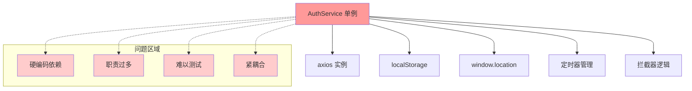
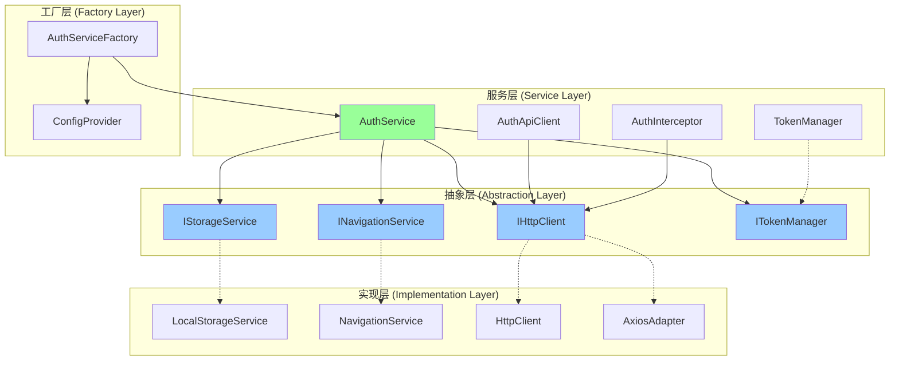
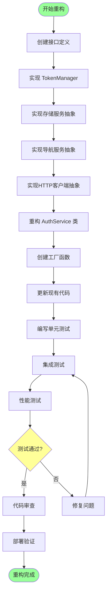
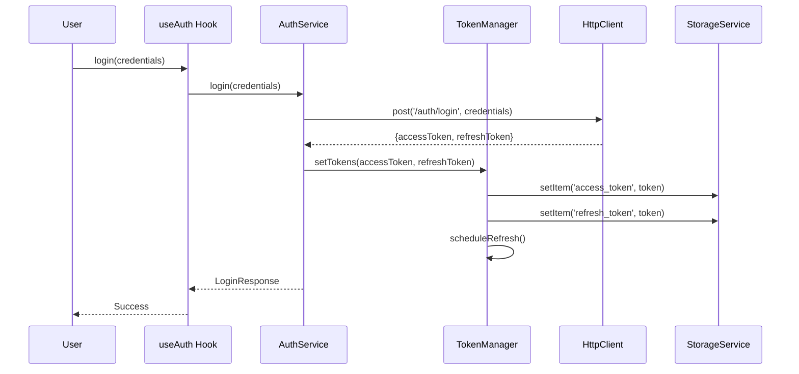
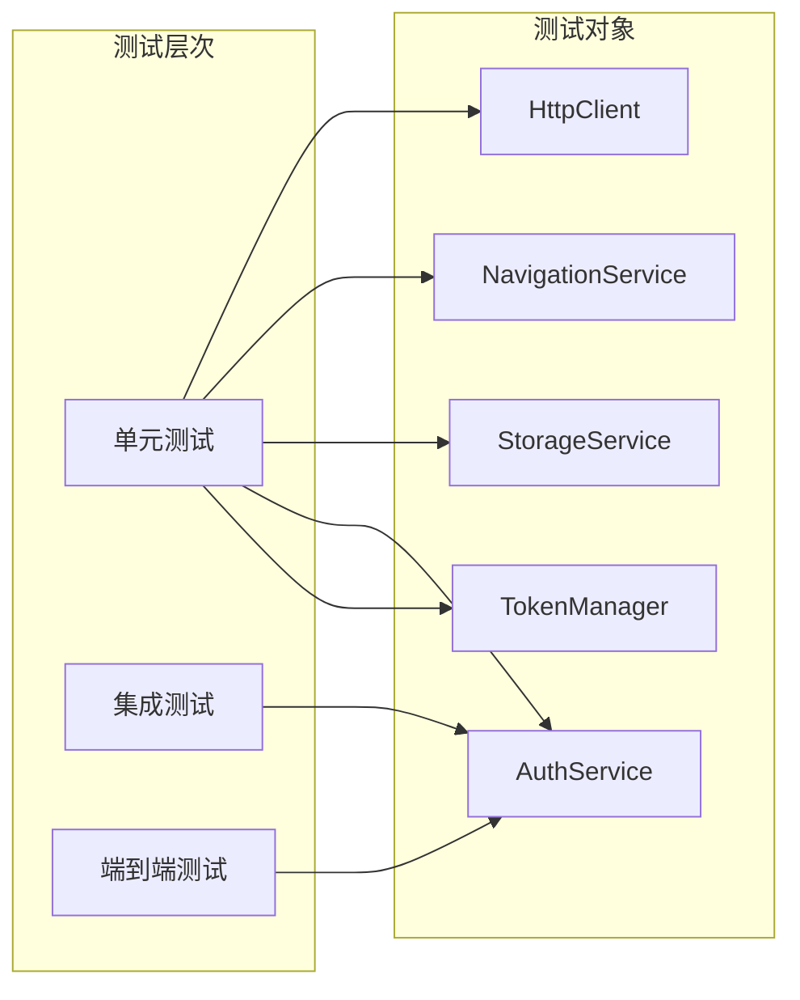

# AuthService 架构重构实现方案

## 技术方案

### 重构策略

采用**渐进式重构**策略，确保在重构过程中系统保持稳定，现有功能不受影响。

#### 重构原则
1. **单一职责原则 (SRP)**: 每个类只负责一个职责
2. **依赖倒置原则 (DIP)**: 依赖抽象而非具体实现
3. **接口隔离原则 (ISP)**: 使用小而专注的接口
4. **开闭原则 (OCP)**: 对扩展开放，对修改关闭

## 架构设计

### 当前架构问题分析

### 目标架构设计

### 类图设计

```mermaid
classDiagram
    class IStorageService {
        <<interface>>
        +getItem(key: string): string | null
        +setItem(key: string, value: string): void
        +removeItem(key: string): void
    }
    
    class ITokenManager {
        <<interface>>
        +getAccessToken(): string | null
        +getRefreshToken(): string | null
        +setTokens(access: string, refresh: string): void
        +clearTokens(): void
        +isTokenExpired(token: string): boolean
        +scheduleRefresh(): void
    }
    
    class INavigationService {
        <<interface>>
        +redirectTo(path: string): void
        +getCurrentPath(): string
    }
    
    class IHttpClient {
        <<interface>>
        +get(url: string, config?: any): Promise~any~
        +post(url: string, data?: any, config?: any): Promise~any~
        +put(url: string, data?: any, config?: any): Promise~any~
        +delete(url: string, config?: any): Promise~any~
    }
    
    class AuthService {
        -tokenManager: ITokenManager
        -storage: IStorageService
        -navigation: INavigationService
        -httpClient: IHttpClient
        +constructor(dependencies: AuthDependencies)
        +login(credentials: LoginCredentials): Promise~LoginResponse~
        +logout(): Promise~void~
        +refreshToken(): Promise~void~
        +getCurrentUser(): Promise~User~
        +isAuthenticated(): boolean
    }
    
    class TokenManager {
        -storage: IStorageService
        -refreshTimer: NodeJS.Timeout | null
        +getAccessToken(): string | null
        +getRefreshToken(): string | null
        +setTokens(access: string, refresh: string): void
        +clearTokens(): void
        +isTokenExpired(token: string): boolean
        +scheduleRefresh(): void
    }
    
    class LocalStorageService {
        +getItem(key: string): string | null
        +setItem(key: string, value: string): void
        +removeItem(key: string): void
    }
    
    class NavigationService {
        +redirectTo(path: string): void
        +getCurrentPath(): string
    }
    
    class HttpClient {
        -axiosInstance: AxiosInstance
        +get(url: string, config?: any): Promise~any~
        +post(url: string, data?: any, config?: any): Promise~any~
        +put(url: string, data?: any, config?: any): Promise~any~
        +delete(url: string, config?: any): Promise~any~
    }
    
    AuthService --> ITokenManager
    AuthService --> IStorageService
    AuthService --> INavigationService
    AuthService --> IHttpClient
    
    TokenManager ..|> ITokenManager
    TokenManager --> IStorageService
    
    LocalStorageService ..|> IStorageService
    NavigationService ..|> INavigationService
    HttpClient ..|> IHttpClient
```

### 重构流程图

### 数据流设计

## 风险评估

### 技术风险

| 风险 | 概率 | 影响 | 缓解措施 |
|------|------|------|----------|
| 重构破坏现有功能 | 中 | 高 | 完整的测试覆盖，渐进式重构 |
| 性能下降 | 低 | 中 | 性能基准测试，优化关键路径 |
| 团队学习成本 | 中 | 低 | 详细文档，代码审查 |
| 第三方依赖兼容性 | 低 | 中 | 适配器模式，版本锁定 |

### 实施风险

| 风险 | 概率 | 影响 | 缓解措施 |
|------|------|------|----------|
| 重构时间超期 | 中 | 中 | 分阶段实施，优先核心功能 |
| 测试覆盖不足 | 低 | 高 | 测试先行，代码覆盖率要求 |
| 团队抵触情绪 | 低 | 中 | 充分沟通，展示收益 |

## 测试计划

### 单元测试策略

### 测试覆盖要求

- **单元测试覆盖率**: ≥ 90%
- **集成测试覆盖率**: ≥ 80%
- **关键路径覆盖**: 100%

### 测试工具

- **单元测试**: Vitest + Testing Library
- **模拟工具**: vi.mock()
- **测试数据**: 工厂函数生成
- **覆盖率**: c8/istanbul

## 性能考虑

### 性能目标

- 登录响应时间: < 500ms
- Token 刷新时间: < 200ms
- 内存使用: 不超过当前版本的 110%
- 包大小: 不超过当前版本的 105%

### 优化策略

1. **懒加载**: 非核心服务按需加载
2. **缓存策略**: 合理缓存用户状态
3. **事件节流**: Token 刷新请求去重
4. **代码分割**: 按功能模块分割代码

## 实施时间线

### 第一阶段 (1-2天)
- 创建接口定义和类型
- 实现基础服务类
- 编写单元测试

### 第二阶段 (2-3天)
- 重构 AuthService 主类
- 创建工厂函数
- 更新现有集成点

### 第三阶段 (1-2天)
- 完整测试覆盖
- 性能测试和优化
- 文档更新

### 第四阶段 (1天)
- 代码审查
- 部署验证
- 监控设置

## 回滚计划

如果重构出现问题，准备以下回滚策略：

1. **保留原始代码**: 通过功能开关控制
2. **渐进切换**: 分模块切换到新实现
3. **快速回滚**: 一键切换回原始实现
4. **数据兼容**: 确保存储格式向后兼容