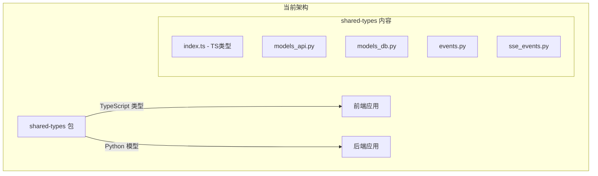
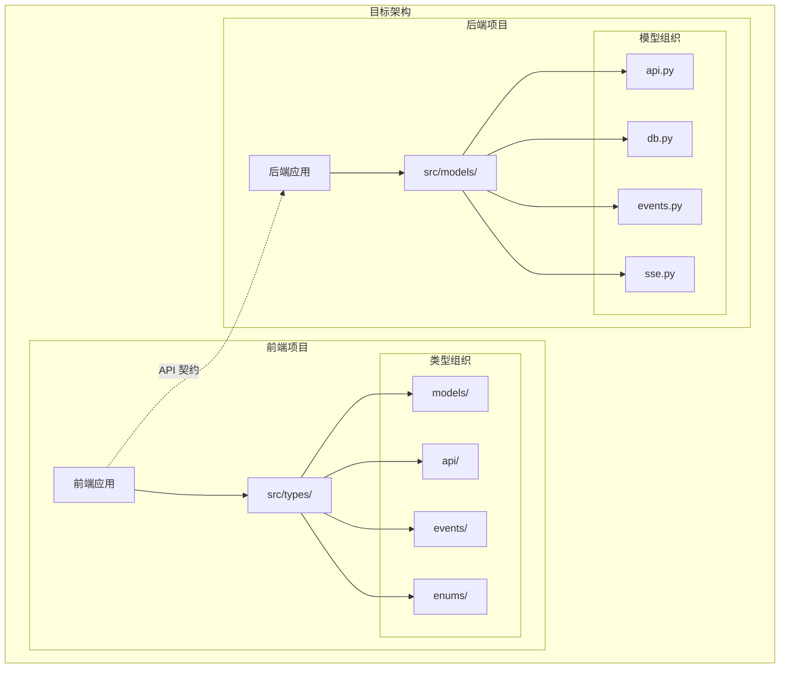
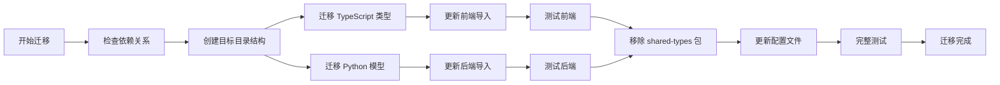
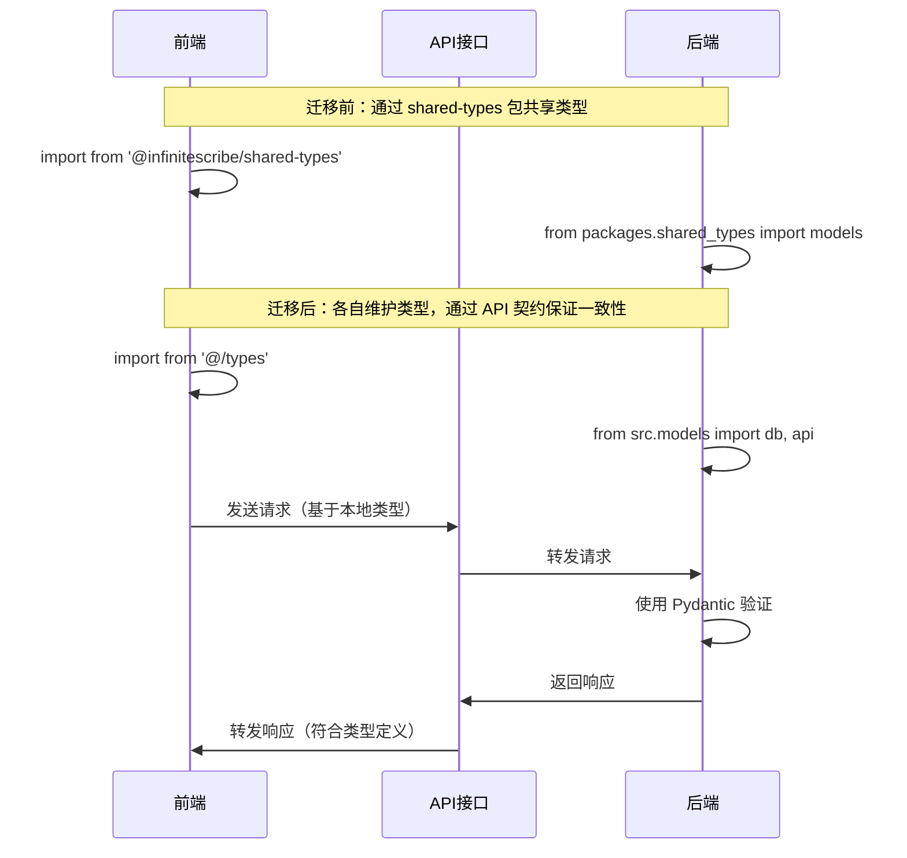

# 实现方案

## 技术方案

### 1. 类型定义迁移策略

#### 前端 TypeScript 类型
- 将 `packages/shared-types/src/index.ts` 中的所有类型定义移动到 `apps/frontend/src/types/` 目录
- 创建合适的目录结构来组织不同类型的定义：
  - `apps/frontend/src/types/models/` - 数据模型类型
  - `apps/frontend/src/types/api/` - API 请求/响应类型
  - `apps/frontend/src/types/events/` - 事件类型
  - `apps/frontend/src/types/enums/` - 枚举类型

#### 后端 Python 类型
- 将 Python 模型文件移动到 `apps/backend/src/models/` 目录
- 保持 Pydantic 模型的结构不变
- 更新所有导入路径

### 2. 依赖更新策略

1. 移除 pnpm workspace 中的 shared-types 引用
2. 更新前端的导入路径
3. 更新后端的导入路径
4. 清理构建脚本和配置

## 架构设计

### 当前架构

### 目标架构

### 迁移流程图

### 依赖关系变化

## 风险评估

### 潜在风险

1. **类型不一致风险**
   - 风险：前后端类型定义可能逐渐产生差异
   - 缓解：建立文档规范，定期审查 API 契约

2. **导入路径更新遗漏**
   - 风险：可能遗漏某些文件的导入更新
   - 缓解：使用全局搜索替换，并进行完整的编译检查

3. **构建流程中断**
   - 风险：移除包可能影响构建流程
   - 缓解：逐步迁移，先迁移内容再移除包

4. **类型安全性降低**
   - 风险：失去编译时的跨项目类型检查
   - 缓解：加强运行时验证和 API 测试

### 应对策略

1. 创建迁移分支，不在主分支直接操作
2. 分阶段进行迁移，每个阶段都进行测试
3. 保留原始文件的备份
4. 编写迁移脚本自动化部分工作
5. 增加 API 集成测试覆盖率

## 测试计划

### 单元测试
- 确保所有现有单元测试通过
- 验证类型导入正确

### 集成测试
- 测试前后端 API 通信
- 验证数据模型的序列化/反序列化

### 构建测试
- 前端构建：`pnpm build`
- 后端类型检查：`mypy`
- 确保 CI/CD 流程正常

### 手动测试
- 启动开发环境
- 测试主要功能流程
- 验证类型提示和自动补全功能

## 实施步骤详细说明

### 第一阶段：准备工作
1. 创建 feature 分支
2. 备份 shared-types 包
3. 创建目标目录结构

### 第二阶段：迁移 TypeScript 类型
1. 分析 index.ts 中的类型依赖关系
2. 按照依赖顺序迁移类型定义
3. 更新前端所有导入语句
4. 运行前端类型检查

### 第三阶段：迁移 Python 模型
1. 移动 Python 文件到后端项目
2. 更新模块结构和 __init__.py
3. 更新所有导入路径
4. 运行后端类型检查

### 第四阶段：清理和优化
1. 移除 shared-types 包目录
2. 更新 pnpm-workspace.yaml
3. 更新各项目的依赖配置
4. 清理无用的构建脚本

### 第五阶段：文档和规范
1. 创建 API 契约文档
2. 更新开发者指南
3. 建立类型一致性检查机制