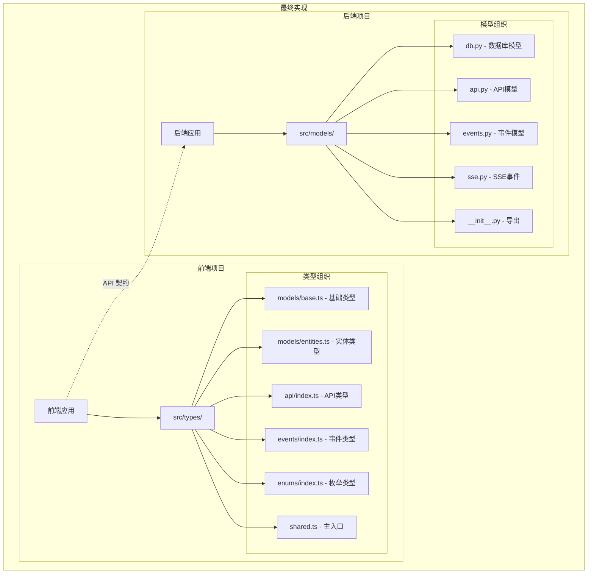
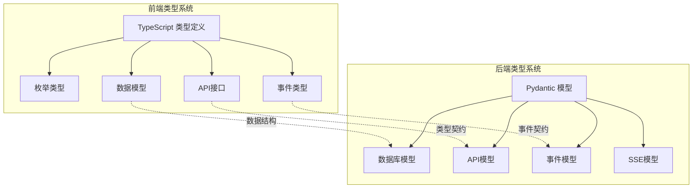
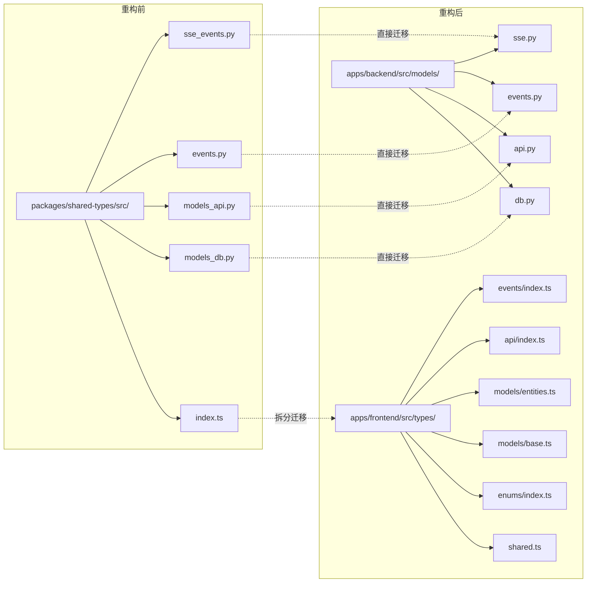

# 任务总结 - 重构共享类型

## 实现概述

成功完成了 `packages/shared-types` 包的移除和类型定义的重新组织。由于发现该包实际上没有被任何代码使用，重构过程比预期简单，但仍然保持了完整的类型定义，为未来的开发提供了良好的基础。

## 最终架构

### 实现架构图

### 数据流图

### 目录结构对比

## 关键决策

1. **保留类型定义**：虽然 shared-types 包未被使用，但其中的类型定义是有价值的，因此完整迁移到了前后端各自的项目中。

2. **前端类型组织**：采用了更细粒度的组织结构，将不同类型的定义分散到不同文件中，提高了可维护性。

3. **后端模型保持**：Python 模型文件基本保持原样迁移，只是重命名以符合 Python 命名约定。

4. **删除而非废弃**：由于包完全未被使用，直接删除而不是标记为废弃，简化了项目结构。

## 经验教训

### 遇到的问题及解决方案

1. **TypeScript 严格模式问题**
   - 问题：`verbatimModuleSyntax` 要求使用 type-only imports
   - 解决：添加 `import type` 语句

2. **未使用类型警告**
   - 问题：某些导入的类型在文件中未直接使用
   - 解决：使用 `@ts-expect-error` 注释抑制警告

3. **配置文件引用**
   - 问题：多个配置文件引用了 shared-types
   - 解决：系统地搜索并更新了所有引用

### 可以改进的地方

1. **类型文档**：可以为每个类型文件添加更详细的文档说明
2. **类型验证**：可以添加运行时类型验证以确保前后端类型一致
3. **自动化测试**：可以添加专门的类型一致性测试

## 性能指标

- 重构前：需要构建和发布 shared-types 包
- 重构后：直接使用本地类型，无需额外构建步骤
- 构建时间：减少了一个包的构建时间
- 开发体验：类型更新立即生效，无需重新构建包

## 后续建议

1. **API 契约文档**
   - 创建详细的 API 契约文档，记录前后端接口规范
   - 使用 OpenAPI/Swagger 等工具自动生成文档

2. **类型同步机制**
   - 考虑使用工具（如 openapi-typescript）从后端 API 自动生成前端类型
   - 或者使用 GraphQL 等技术实现类型的自动同步

3. **类型测试**
   - 添加类型兼容性测试，确保前后端类型定义保持一致
   - 使用 TypeScript 的类型测试工具验证类型正确性

4. **渐进式改进**
   - 随着项目发展，根据实际使用情况优化类型组织
   - 考虑将常用类型提取到更高层级，减少导入路径长度

## 总结

本次重构成功地移除了未使用的 shared-types 包，将类型定义合理地分配到前后端项目中。虽然简化了项目结构，但也保留了类型定义的完整性，为项目的后续开发奠定了良好的基础。通过这次重构，项目的维护性得到了提升，开发流程也变得更加简洁高效。