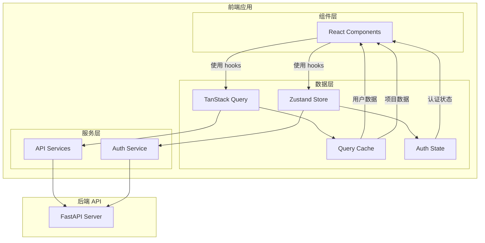
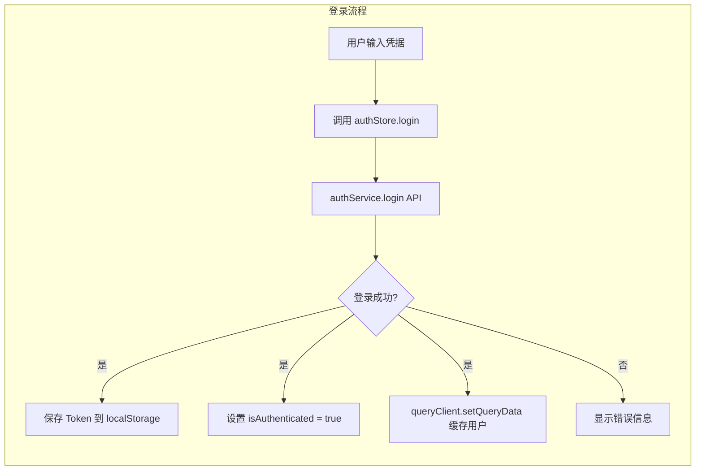
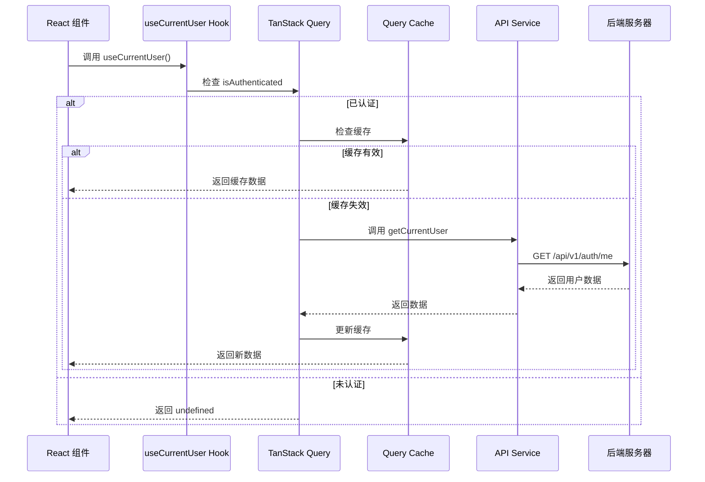
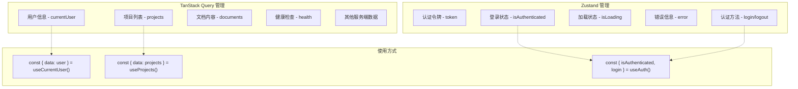

# 实现方案

## 技术方案

### 1. 核心概念
- **Server State**: 来自服务器的数据，由 TanStack Query 统一管理
- **Client State**: 客户端状态（认证令牌、登录状态），由 Zustand 管理
- **单一数据源**: 每种数据只在一个地方存储，避免同步问题

### 2. 实现步骤

#### 2.1 配置 QueryClient 和 Provider
```typescript
// src/lib/queryClient.ts
import { QueryClient } from '@tanstack/react-query'

export const queryClient = new QueryClient({
  defaultOptions: {
    queries: {
      // Token 过期时的默认行为
      retry: (failureCount, error: any) => {
        if (error?.status === 401) {
          // 401 错误不重试
          return false
        }
        return failureCount < 3
      },
      // 窗口聚焦时不自动重新获取（认证敏感）
      refetchOnWindowFocus: false,
      staleTime: 5 * 60 * 1000, // 5分钟
      gcTime: 10 * 60 * 1000,    // 10分钟垃圾回收（v5中 cacheTime 改为 gcTime）
    },
    mutations: {
      retry: 0, // mutations 不重试
      // 突变错误时的默认行为
      onError: (error: any) => {
        if (error?.status === 401) {
          // Token 过期，清理所有缓存
          queryClient.clear()
          // 跳转登录
          window.location.href = '/login'
        }
      }
    },
  },
})

// 查询键管理
export const queryKeys = {
  all: ['auth'] as const,
  user: () => [...queryKeys.all, 'user'] as const,
  currentUser: () => [...queryKeys.user(), 'current'] as const,
  permissions: () => [...queryKeys.all, 'permissions'] as const,
  sessions: () => [...queryKeys.all, 'sessions'] as const,
}
```

#### 2.2 创建核心查询 Hooks
```typescript
// src/hooks/useAuthQuery.ts
import { useQuery, useMutation, useQueryClient } from '@tanstack/react-query'
import { useAuthStore } from './useAuth'
import { queryKeys } from '@/lib/queryClient'

// 获取当前用户（单一数据源）
export function useCurrentUser() {
  const { isAuthenticated } = useAuthStore()
  
  return useQuery({
    queryKey: queryKeys.currentUser(),
    queryFn: () => authService.getCurrentUser(),
    enabled: isAuthenticated, // 仅在已认证时查询
    staleTime: 5 * 60 * 1000, // 5分钟内不重新请求
    gcTime: 10 * 60 * 1000,   // 10分钟垃圾回收
    retry: (failureCount, error: any) => {
      if (error.status === 401) return false // 401 不重试
      return failureCount < 3
    }
  })
}

// 获取用户权限（依赖查询）
export function usePermissions() {
  const { data: user } = useCurrentUser()
  
  return useQuery({
    queryKey: ['permissions', user?.role],
    queryFn: () => authService.getPermissionsByRole(user!.role),
    enabled: !!user?.role, // 仅在有角色时查询
    staleTime: 10 * 60 * 1000, // 权限数据缓存更久
  })
}
```

#### 2.3 改造 Auth Store（精简版）
```typescript
// src/hooks/useAuth.ts
import { create } from 'zustand'
import { persist } from 'zustand/middleware'

interface AuthStore {
  // 只保留认证标志
  isAuthenticated: boolean
  
  // 简单的状态设置方法
  setAuthenticated: (value: boolean) => void
  clearAuth: () => void
}

export const useAuthStore = create<AuthStore>()(
  persist(
    (set) => ({
      isAuthenticated: false,
      
      setAuthenticated: (value) => set({ isAuthenticated: value }),
      clearAuth: () => {
        authService.clearTokens()
        set({ isAuthenticated: false })
      },
    }),
    {
      name: 'auth-storage',
      partialize: (state) => ({ isAuthenticated: state.isAuthenticated }),
    }
  )
)

// 注意：不再存储 user、isLoading、error 等状态
// 这些都由 TanStack Query 管理
```

#### 2.4 创建 Mutation Hooks
```typescript
// src/hooks/useAuthMutations.ts
import { useMutation, useQueryClient } from '@tanstack/react-query'
import { useAuthStore } from './useAuth'
import { queryKeys } from '@/lib/queryClient'

// 登录 Mutation
export function useLogin() {
  const queryClient = useQueryClient()
  const { setAuthenticated } = useAuthStore()
  
  return useMutation({
    mutationFn: (credentials: LoginRequest) => authService.login(credentials),
    onSuccess: (data) => {
      // 1. 更新认证状态
      setAuthenticated(true)
      
      // 2. 设置用户数据到缓存
      queryClient.setQueryData(queryKeys.currentUser(), data.user)
      
      // 3. 预取相关数据
      queryClient.prefetchQuery({
        queryKey: queryKeys.permissions(),
        queryFn: () => authService.getPermissions()
      })
    },
    onError: (error) => {
      // 清理状态
      setAuthenticated(false)
      queryClient.clear() // 清除所有缓存
    }
  })
}

// 登出 Mutation
export function useLogout() {
  const queryClient = useQueryClient()
  const { clearAuth } = useAuthStore()
  
  return useMutation({
    mutationFn: () => authService.logout(),
    onSuccess: () => {
      // 1. 清理认证状态
      clearAuth()
      
      // 2. 清理所有缓存数据
      queryClient.clear()
      
      // 3. 取消所有进行中的请求
      queryClient.cancelQueries()
      
      // 4. 跳转到登录页
      window.location.href = '/login'
    }
  })
}

// 更新用户资料（带乐观更新）
export function useUpdateProfile() {
  const queryClient = useQueryClient()
  
  return useMutation({
    mutationFn: (data: UpdateProfileRequest) => authService.updateProfile(data),
    
    // 乐观更新
    onMutate: async (newData) => {
      // 取消进行中的请求
      await queryClient.cancelQueries({ queryKey: queryKeys.currentUser() })
      
      // 保存当前数据
      const previousUser = queryClient.getQueryData(queryKeys.currentUser())
      
      // 乐观更新
      queryClient.setQueryData(queryKeys.currentUser(), (old: User | undefined) => 
        old ? { ...old, ...newData } : old
      )
      
      return { previousUser }
    },
    
    // 错误回滚
    onError: (err, newData, context) => {
      queryClient.setQueryData(queryKeys.currentUser(), context?.previousUser)
    },
    
    // 成功后重新验证
    onSettled: () => {
      queryClient.invalidateQueries({ queryKey: queryKeys.currentUser() })
    }
  })
}
```

#### 2.5 Token 刷新与 API 拦截器
```typescript
// src/services/auth.ts - 更新拦截器部分
import axios from 'axios'
import { queryClient } from '@/lib/queryClient'

// API 拦截器中的 Token 刷新
axios.interceptors.response.use(
  response => response,
  async error => {
    if (error.response?.status === 401 && !error.config._retry) {
      error.config._retry = true
      
      try {
        await authService.refreshToken()
        
        // 刷新成功，使所有查询失效以获取新数据
        queryClient.invalidateQueries()
        
        return axios(error.config)
      } catch (refreshError) {
        // 刷新失败，清理缓存
        queryClient.clear()
        // 清理认证状态
        useAuthStore.getState().clearAuth()
        // 跳转登录
        window.location.href = '/login'
        throw refreshError
      }
    }
    return Promise.reject(error)
  }
)
```

#### 2.6 预取策略
```typescript
// src/hooks/usePrefetch.ts
import { useQueryClient } from '@tanstack/react-query'
import { useCallback } from 'react'

// 在路由加载前预取数据
export function usePrefetchDashboard() {
  const queryClient = useQueryClient()
  
  return useCallback(() => {
    // 批量预取
    Promise.all([
      queryClient.prefetchQuery({
        queryKey: ['dashboard-stats'],
        queryFn: fetchDashboardStats,
        staleTime: 10 * 60 * 1000, // 10分钟
      }),
      queryClient.prefetchQuery({
        queryKey: ['recent-activities'],
        queryFn: fetchRecentActivities,
      })
    ])
  }, [queryClient])
}
```

## 架构设计

### 系统架构图


### 数据流图


### 组件数据获取流程


### 状态管理职责划分


## 迁移策略

### 第一阶段：基础设施
1. 配置 QueryClient
2. 在 App.tsx 添加 QueryClientProvider
3. 创建 useCurrentUser hook

### 第二阶段：认证流程改造
1. 修改 login 方法，登录成功后设置 Query Cache
2. 修改 logout 方法，清理 Query Cache
3. 修改 useAuth hook，移除 user 状态

### 第三阶段：组件迁移（按风险从低到高）
1. **低风险组件**（先行验证）
   - 导航栏用户信息显示
   - Profile 页面（只读展示）
   - Dashboard 欢迎信息

2. **中风险组件**
   - RequireAuth 组件（核心但改动简单）
   - ChangePassword 页面（涉及状态更新）
   
3. **高风险组件**
   - 登录/注册流程
   - Token 刷新逻辑
   - 错误边界处理

4. **迁移模板**
   ```typescript
   // 旧代码
   const { user, isLoading } = useAuth()
   
   // 新代码
   const { data: user, isLoading, error } = useCurrentUser()
   ```

### 完整示例：登录和 Dashboard 实现
```typescript
// pages/Login.tsx
import { useNavigate } from 'react-router-dom'
import { useLogin } from '@/hooks/useAuthMutations'
import { usePrefetchDashboard } from '@/hooks/usePrefetch'

function LoginPage() {
  const navigate = useNavigate()
  const login = useLogin()
  const prefetchDashboard = usePrefetchDashboard()
  
  const handleLogin = async (credentials: LoginRequest) => {
    try {
      await login.mutateAsync(credentials)
      
      // 预取 Dashboard 数据
      await prefetchDashboard()
      
      // 导航到 Dashboard
      navigate('/dashboard')
    } catch (error) {
      // 错误已经在 mutation 中处理
    }
  }
  
  return (
    <form onSubmit={handleSubmit(handleLogin)}>
      {login.isError && (
        <div className="error">{login.error?.message}</div>
      )}
      {/* 表单内容 */}
    </form>
  )
}

// pages/Dashboard.tsx
import { Navigate } from 'react-router-dom'
import { useCurrentUser, usePermissions } from '@/hooks/useAuthQuery'

function Dashboard() {
  // 从 TanStack Query 获取用户数据
  const { data: user, isLoading } = useCurrentUser()
  const { data: permissions } = usePermissions()
  
  if (isLoading) return <LoadingSpinner />
  if (!user) return <Navigate to="/login" />
  
  return (
    <div>
      <h1>Welcome, {user.name}!</h1>
      {permissions && (
        <div>Your permissions: {permissions.join(', ')}</div>
      )}
      {/* Dashboard 内容 */}
    </div>
  )
}

// components/auth/RequireAuth.tsx
import { Navigate } from 'react-router-dom'
import { useAuthStore } from '@/hooks/useAuth'
import { useCurrentUser } from '@/hooks/useAuthQuery'

function RequireAuth({ children }: { children: React.ReactNode }) {
  const { isAuthenticated } = useAuthStore()
  const { data: user, isLoading } = useCurrentUser()
  
  // 未认证，直接跳转
  if (!isAuthenticated) {
    return <Navigate to="/login" replace />
  }
  
  // 认证但还在加载用户数据
  if (isLoading) {
    return <LoadingSpinner />
  }
  
  // 认证但获取用户失败（可能 token 无效）
  if (!user) {
    return <Navigate to="/login" replace />
  }
  
  return <>{children}</>
}
```

## 风险评估

### 技术风险
1. **缓存一致性**: 需要在适当时机使缓存失效
   - 缓解措施：使用 invalidateQueries 在关键操作后刷新
   
2. **性能影响**: 初次加载可能有额外请求
   - 缓解措施：合理设置 staleTime 和 cacheTime

3. **迁移复杂度**: 需要修改多个组件
   - 缓解措施：分阶段迁移，保持向后兼容

### 业务风险
1. **用户体验**: 迁移过程中可能出现数据不一致
   - 缓解措施：充分测试，分步上线

## 测试计划

### 测试覆盖率目标
- 单元测试覆盖率：≥ 85%
- 集成测试覆盖率：≥ 70%
- E2E 测试：覆盖所有关键用户流程

### 单元测试
- 测试 useCurrentUser hook 的各种场景
  - 未认证状态返回 undefined
  - 认证后正确获取数据
  - 缓存命中测试
  - 错误处理测试
- 测试认证流程的缓存设置
  - login 成功后缓存写入
  - token 过期后的处理
- 测试 logout 的缓存清理
- 测试 mutation hooks（乐观更新、错误回滚）

### 集成测试
- 测试完整的登录/登出流程
- 测试 token 刷新时的数据同步
- 测试多组件间的数据一致性
- 测试并发请求的缓存行为
- 测试网络错误的降级处理

### E2E 测试
- 确保现有的认证相关 E2E 测试通过
- 添加数据同步相关的测试场景
  - 多标签页数据同步
  - 离线/在线切换
  - Session 过期处理

### 手动测试清单
- [ ] 登录后用户信息正确显示
- [ ] 刷新页面后用户信息保持
- [ ] 修改个人资料后所有组件更新
- [ ] 登出后缓存正确清理
- [ ] Token 过期时的处理正确
- [ ] 网络断开重连后数据恢复
- [ ] 多标签页登出同步