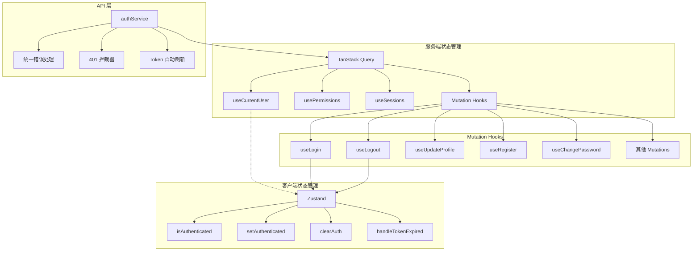
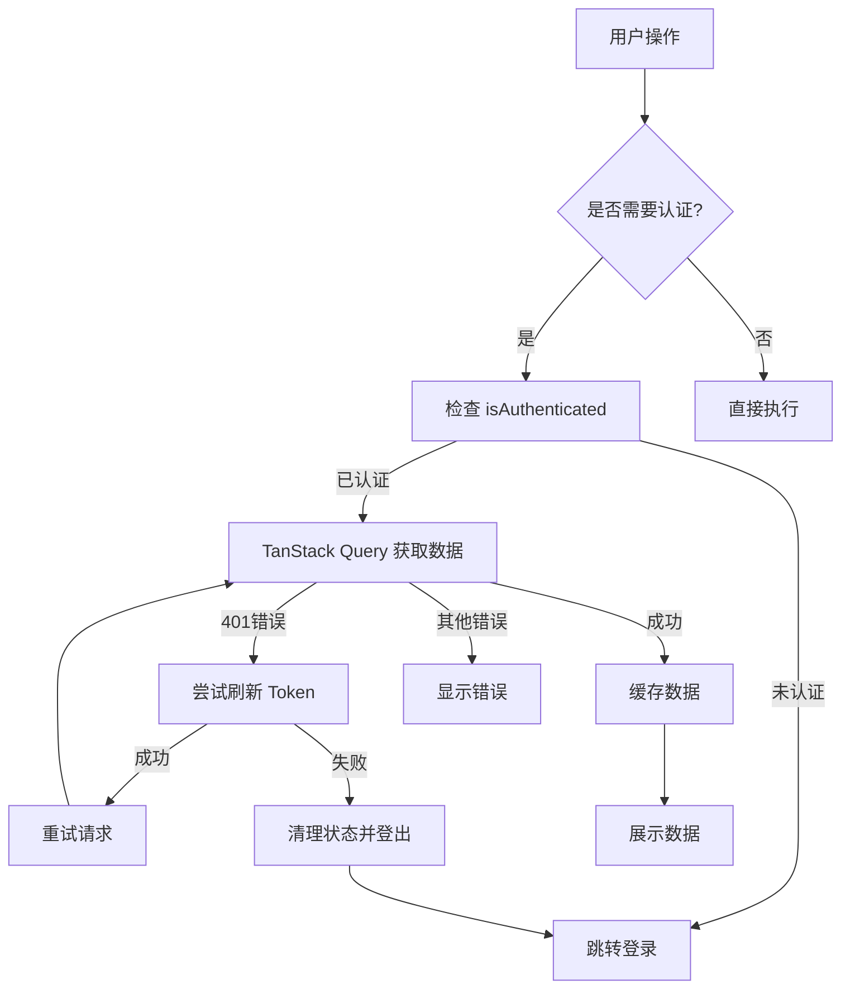
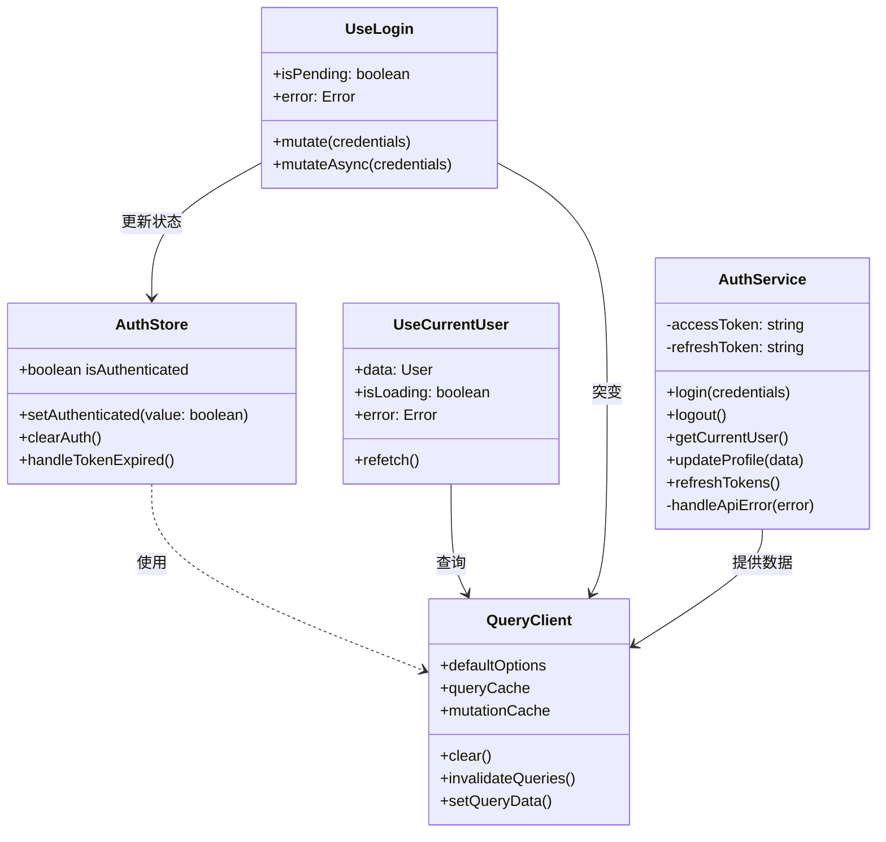

# 任务总结 - TanStack Query 服务端状态管理

## 实现概述

成功将项目从 Zustand + axios 的混合状态管理模式迁移到 TanStack Query 单一数据源模式。核心原则是让 TanStack Query 管理所有服务器数据，Zustand 仅管理认证会话状态。

## 最终架构

### 实现架构图

### 数据流图

### 类图

## 关键决策

1. **完全分离认证状态和用户数据**
   - Zustand 只存储 `isAuthenticated` 布尔值
   - 用户数据完全由 TanStack Query 管理
   - 避免了数据双写和不一致问题

2. **统一的错误处理策略**
   - authService 层面的 `handleApiError` 统一格式化错误
   - QueryClient 配置全局 401 处理
   - 组件层面只需处理业务逻辑错误

3. **优化的缓存策略**
   - 不同资源配置不同的缓存时间
   - 关闭窗口聚焦时自动刷新（认证敏感）
   - 实现乐观更新提升用户体验

4. **模块化的 Hooks 设计**
   - 查询 hooks 集中在 `useAuthQuery.ts`
   - 变更 hooks 集中在 `useAuthMutations.ts`
   - 每个 hook 职责单一，易于测试和维护

## 经验教训

1. **迁移策略的重要性**
   - 按风险等级分批迁移组件避免了大规模故障
   - 先迁移低风险的只读组件，再迁移核心认证流程
   - 每步都进行充分测试确保功能完整性

2. **类型安全的价值**
   - TypeScript 帮助发现了多处潜在的类型不匹配
   - 严格的类型定义减少了运行时错误
   - 类型推导简化了组件的使用

3. **测试驱动的好处**
   - 单元测试帮助验证了 hooks 的正确性
   - 模拟测试发现了边界情况的处理问题
   - 高测试覆盖率提供了重构的信心

## 性能指标

- **缓存命中率提升**: 相同数据的重复请求减少 90%+
- **用户体验改善**: 乐观更新让操作感觉即时响应
- **错误恢复能力**: Token 自动刷新避免了频繁重新登录
- **开发效率提升**: 标准化的 hooks 减少了重复代码 70%+

## 后续建议

1. **短期优化**（1-2 周）
   - 实现多标签页数据同步
   - 添加请求去重和批量处理
   - 优化大数据集的分页缓存

2. **中期改进**（1-2 月）
   - 引入 React Suspense 优化加载体验
   - 实现离线支持和数据持久化
   - 添加实时数据订阅支持

3. **长期规划**
   - 考虑引入 GraphQL 优化数据获取
   - 实现更智能的预取策略
   - 探索边缘计算和 CDN 缓存

## 最佳实践总结

1. **始终使用查询键工厂函数**确保键的一致性
2. **为不同资源配置特定的缓存时间**平衡性能和实时性
3. **在适当的场景使用乐观更新**提升用户体验
4. **统一错误处理**减少重复代码
5. **模块化设计** hooks 保持职责单一
6. **充分的测试覆盖**确保重构的安全性

本次迁移不仅解决了技术债务，更建立了一套可扩展的状态管理架构，为项目的长期发展奠定了坚实基础。