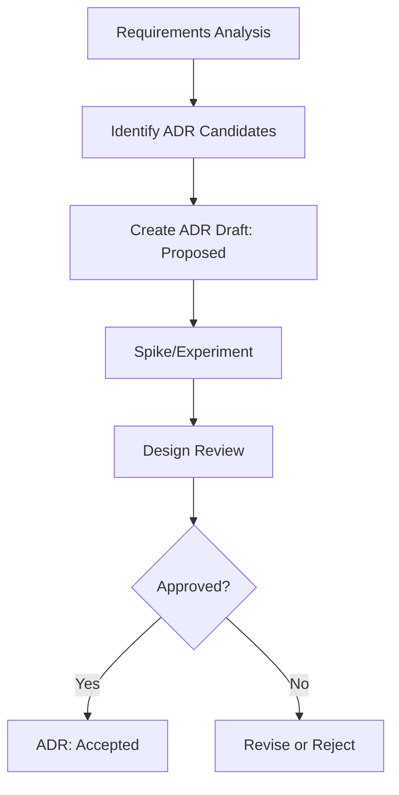

# Architecture Decision Records

## Overview
本目录包含 unified-backend-launcher 功能的所有架构决策记录（ADR）。

## Status Definition
- **Proposed**: 提议中，待评审
- **Accepted**: 已接受，指导实施
- **Rejected**: 已拒绝
- **Superseded**: 已被替代
- **Deprecated**: 已废弃

## ADR Index

| ID | Title | Status | Date | Related Requirements |
|----|-------|--------|------|---------------------|
| <!-- ADR 将在 /spec-task:adr-draft 阶段生成 --> |

## Decision Flow

## Related Documents
- [PRD](../prd.md)
- [Requirements](../requirements.md)
- [High-Level Design](../design-hld.md)
- [Low-Level Design](../design-lld.md)