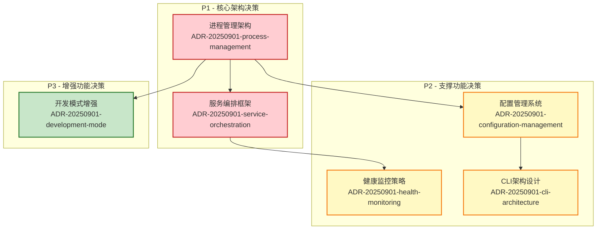
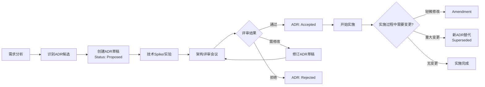

# Architecture Decision Records - 统一后端启动器

## 概述

本目录包含统一后端启动器功能的所有架构决策记录（ADR）。每个ADR记录了重要的架构决策及其理由，确保技术决策的透明度和可追溯性。

## ADR状态说明

- **Proposed**: 提议中，待技术评审和决策
- **Accepted**: 已接受，指导具体实施
- **Rejected**: 已拒绝，记录拒绝原因
- **Superseded**: 已被新的ADR替代
- **Deprecated**: 已废弃，不再适用

## 当前ADR列表

### P1 - 核心架构决策（优先级最高）

| ID | 标题 | 状态 | 相关需求 | 负责人 | 创建日期 |
|----|------|------|----------|--------|----------|
| [ADR-20250901-process-management-architecture](20250901-process-management-architecture.md) | 统一后端启动器进程管理架构选型 | Proposed | FR-001, NFR-001, NFR-004 | platform-arch, backend-lead | 2025-09-01 |
| [ADR-20250901-service-orchestration-framework](20250901-service-orchestration-framework.md) | 服务编排框架选型与依赖管理策略 | Proposed | FR-002, FR-004, NFR-002 | platform-arch, backend-lead, devops | 2025-09-01 |

### P2 - 支撑功能决策（依赖核心决策）

| ID | 标题 | 状态 | 相关需求 | 负责人 | 创建日期 |
|----|------|------|----------|--------|----------|
| [ADR-20250901-configuration-management-system](20250901-configuration-management-system.md) | 配置管理系统设计与模板化策略 | Proposed | FR-006, NFR-004, NFR-005 | backend-lead, platform-arch | 2025-09-01 |
| [ADR-20250901-health-monitoring-strategy](20250901-health-monitoring-strategy.md) | 健康监控策略与状态管理设计 | Proposed | FR-003, NFR-002, NFR-003 | platform-arch, backend-lead, sre | 2025-09-01 |
| [ADR-20250901-cli-architecture-design](20250901-cli-architecture-design.md) | CLI架构设计与用户交互模式 | Proposed | FR-007, NFR-003, NFR-004 | backend-lead, ux-lead | 2025-09-01 |

### P3 - 增强功能决策（可独立实施）

| ID | 标题 | 状态 | 相关需求 | 负责人 | 创建日期 |
|----|------|------|----------|--------|----------|
| [ADR-20250901-development-mode-enhancement](20250901-development-mode-enhancement.md) | 开发模式增强与热重载机制设计 | Proposed | FR-005, NFR-003, NFR-005 | backend-lead, devex-lead | 2025-09-01 |

## 决策依赖关系图

## 决策流程

## 使用指南

### 1. 阅读ADR
- 按照优先级顺序（P1 → P2 → P3）阅读ADR
- 重点关注Decision Drivers和Considered Options
- 查看相关需求的追踪关系

### 2. 参与决策流程
1. **技术Spike阶段**：对关键技术选项进行实验验证
2. **架构评审阶段**：参加评审会议，提供技术意见
3. **决策确认阶段**：基于评审结果更新ADR状态

### 3. 实施阶段
- 实施时严格按照已接受的ADR指导
- 遇到问题时优先考虑在ADR范围内解决
- 重大变更需要创建新的ADR

### 4. 维护ADR
- 定期回顾ADR的有效性
- 更新实施过程中的经验和教训
- 及时更新ADR状态和关联关系

## 质量检查清单

### 对于每个ADR草稿
- [ ] 明确关联的功能需求（FR）和非功能需求（NFR）
- [ ] 至少提供2-3个技术选项对比
- [ ] 包含与现有架构的一致性评估
- [ ] 定义可度量的验证指标
- [ ] 提供清晰的实施计划和回滚策略
- [ ] 指定明确的决策负责人

### 对于决策过程
- [ ] 所有P1级别的ADR必须在P2/P3级别ADR之前决策
- [ ] 关键技术选项通过Spike实验验证
- [ ] 架构评审会议有相关技术负责人参与
- [ ] 决策结果有明确的文档记录

## 相关文档

- **需求文档**: [../requirements.md](../requirements.md) - 完整的功能和非功能需求
- **产品需求**: [../prd.md](../prd.md) - 业务背景和用户故事
- **项目架构**: `docs/architecture/` - 现有系统架构文档
- **实施计划**: `../implementation-plan.md` - 将在ADR确认后创建

## 下一步行动

1. **立即行动** (本周内):
   - 组织P1级别ADR的技术评审会议
   - 为关键技术选项创建Spike任务

2. **短期计划** (2周内):
   - 完成P1级别ADR的决策
   - 开始P2级别ADR的评审流程

3. **中期计划** (1个月内):
   - 完成所有ADR的决策过程
   - 创建详细的实施计划

## 联系信息

- **架构相关问题**: platform-arch team
- **后端实现问题**: backend-lead team  
- **运维部署问题**: devops team
- **用户体验问题**: ux-lead team

---

*最后更新: 2025-09-01*
*ADR模板版本: v1.0*