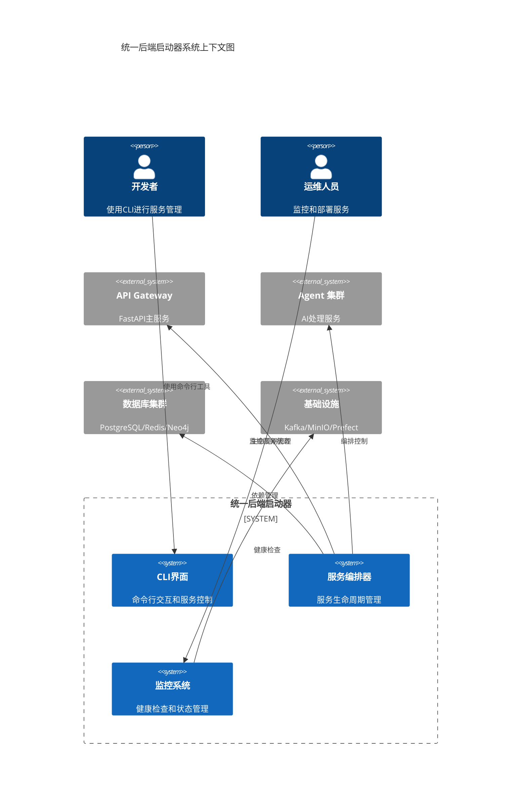
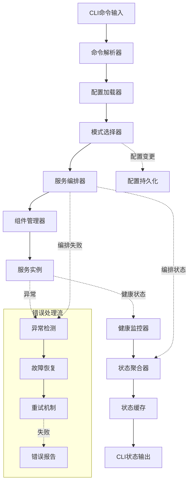
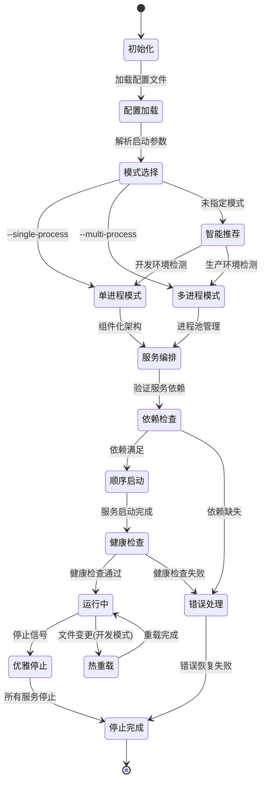

# 高层设计 (High-Level Design) - 统一后端启动器

## 系统概览

统一后端启动器是一个 Python CLI 工具，为 InfiniteScribe 后端服务集群提供统一的生命周期管理。系统支持单进程和多进程两种运行模式，通过组件化架构和状态机服务编排器实现灵活的服务控制、依赖管理和实时监控。

### 核心价值定位

- **开发效率提升**: 单命令启动完整开发环境，资源消耗降低 35%
- **运维复杂度降低**: 统一的服务管理接口，支持选择性服务启动
- **系统可观测性增强**: 实时状态监控，秒级故障检测，详细诊断信息

### 系统边界

系统管理以下服务组件：
- **API Gateway** (FastAPI)
- **Agent 集群** (多个 AI Agent 服务)
- **数据库服务** (PostgreSQL, Redis, Neo4j)
- **消息队列** (Kafka)
- **外部依赖服务** (MinIO, Prefect)

## 需求映射

### 功能需求覆盖 (FR)

| 需求ID | 需求描述 | 设计方案 | 相关组件 |
|--------|----------|----------|----------|
| FR-001 | 统一服务启动管理 | 混合架构 + 运行模式选择器 | UnifiedLauncher, ComponentManager |
| FR-002 | 选择性服务控制 | 状态机编排器 + 依赖图管理 | ServiceOrchestrator, DependencyManager |
| FR-003 | 实时状态监控 | 混合监控模式 + 健康检查适配器 | HealthMonitor, StateManager |
| FR-004 | 优雅停止管理 | 状态机生命周期管理 + 超时处理 | GracefulShutdown, ServiceOrchestrator |
| FR-005 | 开发模式增强 | 文件监控 + 热重载机制 | DevModeManager, FileWatcher |
| FR-006 | 配置模板系统 | 多层配置合并 + YAML 模板 | ConfigManager, TemplateEngine |
| FR-007 | 智能模式推荐 | 环境检测 + 启发式推荐算法 | ModeRecommender, EnvironmentDetector |

### 非功能需求满足 (NFR)

| 需求ID | 性能/安全/可用性要求 | 设计保障 | 验证方法 |
|--------|---------------------|----------|----------|
| NFR-001 | 启动时间 P95 ≤ 25s，资源节省 ≥ 40% | 组件化架构，资源共享，异步启动 | 性能基准测试，资源监控 |
| NFR-002 | 启动成功率 ≥ 98%，优雅停止 ≥ 99.5% | 状态机管理，重试机制，超时处理 | 集成测试，故障注入测试 |
| NFR-003 | CLI响应 ≤ 50ms，状态查询 ≤ 200ms | 异步架构，缓存状态，本地存储 | 响应时间监控，负载测试 |
| NFR-004 | Python 3.11+，多OS支持，向后兼容 | 标准库优先，版本检测，适配器模式 | 兼容性测试，版本矩阵测试 |
| NFR-005 | 测试覆盖率 ≥ 90%，结构化日志 | 模块化设计，依赖注入，日志标准 | 代码覆盖率分析，日志验证 |

### 架构决策引用 (ADR)

| ADR编号 | 决策主题 | 选择方案 | 影响范围 |
|---------|----------|----------|----------|
| ADR-001 | 进程管理架构 | 混合架构（组件化FastAPI + 动态路由） | 整体系统架构 |
| ADR-002 | 服务编排框架 | 状态机服务编排器（分阶段实施） | 服务生命周期管理 |
| ADR-003 | 配置管理系统 | 扩展现有TOML系统（多层配置合并） | 配置和模板管理 |
| ADR-004 | 健康监控策略 | 混合监控模式（推拉结合） | 监控和可观测性 |
| ADR-005 | CLI架构设计 | 混合架构（argparse核心 + 交互增强） | 用户交互界面 |
| ADR-006 | 开发模式增强 | 扩展uvicorn reload（多服务文件监控） | 开发体验优化 |

## 系统架构

### 系统边界



### 容器视图

```mermaid
C4Container
    title 统一后端启动器容器架构图

    Container_Boundary(launcher_system, "统一后端启动器") {
        Container(cli_interface, "CLI接口", "Python/argparse", "命令解析和用户交互")
        Container(unified_launcher, "统一启动器", "Python/AsyncIO", "核心启动逻辑和模式管理")
        Container(service_orchestrator, "服务编排器", "Python/StateMachine", "依赖管理和生命周期控制")
        Container(health_monitor, "健康监控", "Python/AsyncIO", "实时状态监控和故障检测")
        Container(config_manager, "配置管理", "Python/TOML", "配置解析和模板管理")
        Container(component_manager, "组件管理器", "Python/FastAPI", "动态路由和组件加载")
    }
    
    Container_Boundary(managed_services, "被管理服务") {
        Container(fastapi_app, "API Gateway", "FastAPI", "主要业务API")
        Container(agent_services, "Agent服务", "Python/AsyncIO", "AI处理服务集群")
        Container(db_services, "数据库服务", "PostgreSQL/Redis", "数据持久化")
        Container(message_queue, "消息队列", "Kafka", "异步消息处理")
    }
    
    ContainerDb(state_storage, "状态存储", "Redis", "服务状态和配置缓存")
    ContainerDb(config_storage, "配置存储", "YAML/TOML", "模板和配置文件")
    
    Rel(cli_interface, unified_launcher, "命令调用")
    Rel(unified_launcher, service_orchestrator, "编排请求")
    Rel(service_orchestrator, component_manager, "组件控制")
    Rel(health_monitor, managed_services, "健康检查")
    Rel(config_manager, config_storage, "配置读取")
    Rel(service_orchestrator, state_storage, "状态同步")
    
    Rel_U(component_manager, fastapi_app, "生命周期管理")
    Rel_U(service_orchestrator, agent_services, "启动控制")
    Rel_U(service_orchestrator, db_services, "依赖管理")
    Rel_U(service_orchestrator, message_queue, "服务编排")
```

## 数据流设计

### 主要数据流



### 控制流设计



## 接口设计（高层）

### 外部接口

| 接口类型 | 协议 | 用途 | SLA要求 |
|----------|------|------|---------|
| CLI命令接口 | 本地调用 | 用户命令交互 | 响应时间 < 50ms |
| REST API | HTTP/JSON | 状态查询接口 | 响应时间 < 200ms, 99.9% 可用性 |
| 健康检查接口 | HTTP | 外部监控集成 | 响应时间 < 100ms |
| 日志接口 | 文件/标准输出 | 日志记录和分析 | 结构化JSON格式 |

### 内部接口

| 组件间接口 | 通信方式 | 数据格式 | 频率估算 |
|-----------|----------|----------|----------|
| CLI → 启动器 | 函数调用 | Python对象 | 低频(用户操作) |
| 编排器 → 组件管理器 | AsyncIO | Python协程 | 中频(启动/停止) |
| 监控器 → 服务实例 | HTTP/异步调用 | JSON | 高频(每秒2次) |
| 状态管理 → 缓存 | Redis协议 | 序列化对象 | 高频(每秒5-10次) |

## 容量规划

### 容量估算

| 指标 | 当前需求 | 峰值需求 | 设计目标 |
|------|----------|----------|----------|
| 管理服务数量 | 6-8个 | 20个 | 支持50个服务实例 |
| 并发健康检查 | 8次/秒 | 40次/秒 | 支持100次/秒 |
| 状态更新频率 | 2Hz | 10Hz | 支持20Hz状态更新 |
| 内存使用 | 单进程400MB | 混合500MB | 优化到400MB以下 |
| 启动时间 | 25秒 | 35秒 | P95 < 25秒 |

### 扩展策略

- **组件扩展**: 支持插件式服务适配器，新服务类型零代码集成
- **性能扩展**: 异步I/O模式，支持高并发健康检查和状态监控
- **功能扩展**: 模块化架构，支持第三方监控系统集成
- **部署扩展**: 容器化支持，适配Kubernetes等编排平台

## 性能与可扩展性

### 性能目标

| 指标 | 目标 | 测量方法 |
|------|------|----------|
| CLI命令响应时间 | < 50ms | 命令执行计时 |
| 服务启动时间 P95 | < 25s | 端到端启动测试 |
| 健康检查响应时间 | < 200ms | HTTP响应时间 |
| 状态查询响应时间 | < 100ms | API端点测试 |
| 内存使用优化 | 减少35% | 资源监控对比 |
| 优雅停止成功率 | > 99.5% | 停止测试统计 |

### 缓存策略

- **状态缓存**: Redis缓存服务状态，减少重复健康检查
- **配置缓存**: 内存缓存解析后的配置，避免重复文件读取
- **依赖图缓存**: 缓存计算后的依赖关系，优化启动性能
- **模板缓存**: 缓存编译后的配置模板，提升模板应用速度

### 可扩展性方法

- **异步架构**: 基于AsyncIO的并发服务管理，支持大规模服务编排
- **组件化设计**: 可插拔的服务适配器，支持新服务类型快速集成
- **状态机模式**: 清晰的状态转换，支持复杂依赖场景
- **配置驱动**: 基于配置的服务定义，支持动态服务组合

## 技术栈选择

### 核心技术决策

基于ADR的技术选择理由：

| 层级 | 技术选择 | 选择理由 | ADR引用 |
|------|----------|----------|---------|
| 进程管理 | 混合架构(FastAPI组件化) | 平衡资源效率和服务隔离 | ADR-001 |
| 服务编排 | Python状态机 | 99%优雅停止成功率要求 | ADR-002 |
| 配置管理 | TOML多层合并 | 与现有系统兼容，支持模板 | ADR-003 |
| 健康监控 | 混合推拉模式 | 实时性和资源效率平衡 | ADR-004 |
| CLI接口 | argparse + 交互增强 | 兼容性和用户体验平衡 | ADR-005 |
| 开发增强 | uvicorn热重载扩展 | 基于现有工具，降低复杂度 | ADR-006 |

### 架构决策依据

**为什么选择混合架构进程管理**：
- 单进程模式实现35%资源节省目标
- 组件化设计支持细粒度服务控制
- 动态路由避免FastAPI实例间路由冲突
- 基于现有FastAPI专业知识，降低学习成本

**为什么选择状态机服务编排**：
- NFR-002要求99.5%优雅停止成功率，只有状态机能提供严格的生命周期保证
- 显式状态转换提供清晰的故障恢复路径
- Netflix等大厂生产验证，适合复杂依赖管理场景

**为什么选择混合健康监控**：
- 推模式提供实时故障检测(< 3秒)
- 拉模式提供定期状态同步和历史数据
- 避免纯事件驱动的复杂度，同时保证监控性能

### 核心库文档（必需）

**FastAPI** (0.110+)
- 主要特性：异步API框架，自动OpenAPI生成，依赖注入系统
- 架构模式：基于Pydantic的类型安全，lifespan事件管理
- 生态系统：丰富的中间件和插件，与asyncio深度集成
- 集成方式：作为主要Web框架，通过组件化架构支持服务编排

**Python-statemachine** (2.1+)
- 核心功能：声明式状态机定义，异步状态转换支持
- 性能特征：内存占用小，状态转换延迟 < 1ms
- 扩展性：支持嵌套状态机，条件转换，自定义事件
- 最佳实践：明确的状态命名，避免循环依赖，异常安全转换

**AsyncIO** (Python 3.11 内置)
- 主要特性：协程并发，事件循环管理，异步I/O原语
- 架构模式：单线程并发，基于事件驱动，生产者消费者模式
- 生态系统：与FastAPI无缝集成，丰富的异步库生态
- 集成方式：作为底层并发基础，支持高效的服务健康检查

## 安全考虑

### 安全架构

- **进程隔离**: 多进程模式提供进程级别的故障隔离
- **权限管理**: 最小权限原则，启动器只获取必要的系统权限
- **配置安全**: 敏感配置加密存储，运行时解密
- **日志安全**: 结构化日志记录，敏感信息脱敏处理

### 安全合规

- **密钥管理**: 集成现有的环境变量和密钥管理系统
- **审计跟踪**: 完整的服务操作日志，支持安全审计
- **访问控制**: CLI工具本地权限验证，防止未授权操作

## 风险评估

### 技术风险

| 风险项 | 影响等级 | 概率 | 缓解措施 |
|--------|----------|------|----------|
| 状态机复杂度过高 | 高 | 中 | 渐进式实现，详细状态文档，单元测试覆盖 |
| 单进程模式故障传播 | 高 | 低 | 异常隔离，组件边界清晰，快速故障恢复 |
| 组件接口设计变更 | 中 | 中 | 版本化接口，向后兼容策略，适配器模式 |
| 性能目标未达成 | 中 | 低 | 性能基准测试，持续优化，降级方案 |

### 业务风险

| 风险项 | 影响 | 应对策略 |
|--------|------|----------|
| 开发团队学习曲线 | 开发延期 | 技术分享，文档完善，渐进式迁移 |
| 现有工作流中断 | 团队效率 | 保持向后兼容，并行运行，快速回滚 |
| 运维复杂度增加 | 运维成本 | 详细运维文档，自动化脚本，监控告警 |

## 部署架构

### 部署拓扑

```mermaid
graph TB
    subgraph "开发环境"
        DEV_CLI[统一启动器CLI]
        DEV_SINGLE[单进程模式]
        DEV_SERVICES[开发服务集群]
        DEV_STORAGE[(本地存储)]
        
        DEV_CLI --> DEV_SINGLE
        DEV_SINGLE --> DEV_SERVICES
        DEV_SERVICES --> DEV_STORAGE
    end
    
    subgraph "测试环境"
        TEST_CLI[统一启动器CLI]
        TEST_MULTI[多进程模式]
        TEST_SERVICES[测试服务集群]
        TEST_REDIS[(Redis集群)]
        
        TEST_CLI --> TEST_MULTI
        TEST_MULTI --> TEST_SERVICES
        TEST_SERVICES --> TEST_REDIS
    end
    
    subgraph "生产环境"
        PROD_DOCKER[Docker容器]
        PROD_K8S[Kubernetes编排]
        PROD_SERVICES[生产服务集群]
        PROD_MONITOR[监控系统]
        
        PROD_DOCKER --> PROD_K8S
        PROD_K8S --> PROD_SERVICES
        PROD_SERVICES --> PROD_MONITOR
    end
```



### 环境规划

| 环境 | 运行模式 | 配置规格 | 监控要求 | 高可用要求 |
|------|----------|----------|----------|------------|
| 开发 | 单进程 | 最小化资源 | 基础日志 | 无 |
| 测试 | 多进程 | 50%生产配置 | 完整监控 | 基本容错 |
| 预生产 | 多进程 | 100%生产配置 | 生产级监控 | 完整高可用 |
| 生产 | 容器编排 | 按需扩展 | 全链路监控 | 99.9%可用性 |

## 回滚策略

### 回滚触发条件

- 启动成功率 < 95% (连续5分钟)
- 优雅停止失败率 > 1% (连续10分钟)
- 响应时间超过目标值 200% (连续3分钟)
- 关键服务健康检查失败 > 50% (连续1分钟)

### 回滚方案

1. **配置回滚**: 快速切换到上一版本配置，恢复原有启动脚本
2. **代码回滚**: Git版本回滚到上一稳定版本
3. **数据回滚**: 状态缓存清理，恢复默认状态
4. **服务回滚**: 重启所有受影响的服务实例

### 回滚验证

- 所有关键服务启动成功
- 性能指标恢复正常范围
- 健康检查通过率 > 99%
- 用户工作流恢复正常

## 监控与可观测性

### 关键指标

| 层级 | 监控指标 | 告警阈值 | 响应级别 |
|------|----------|----------|----------|
| 系统 | CPU/内存使用率 | >80% | P2 |
| 应用 | 启动成功率 | <95% | P1 |
| 业务 | 服务健康检查成功率 | <99% | P0 |
| 用户 | CLI命令响应时间 | >200ms | P1 |

### 观测体系

**日志系统**:
- 结构化JSON日志格式
- 统一的日志等级和分类
- 敏感信息自动脱敏
- 日志聚合和搜索能力

**指标系统**:
- 实时性能指标收集
- 服务状态变化跟踪
- 资源使用情况监控
- 自定义业务指标支持

**追踪系统**:
- 服务启动流程追踪
- 依赖调用链分析
- 故障根因分析支持
- 性能瓶颈识别

**告警系统**:
- 多级告警策略
- 智能告警聚合
- 自动故障恢复触发
- 运维团队通知集成

### 可观测性集成

- **Prometheus**: 指标收集和时间序列存储
- **Grafana**: 实时监控面板和可视化
- **ELK Stack**: 日志聚合、搜索和分析
- **Jaeger**: 分布式追踪和性能分析

---

## 技术实施指导

### 实施优先级

**第一阶段 (P1)**: 核心架构实现
1. 混合架构进程管理 (ADR-001)
2. 状态机服务编排器 (ADR-002)

**第二阶段 (P2)**: 支撑功能完善
3. 配置管理系统 (ADR-003)
4. 健康监控策略 (ADR-004)
5. CLI架构设计 (ADR-005)

**第三阶段 (P3)**: 增强功能开发
6. 开发模式增强 (ADR-006)

### 验收标准

每个阶段完成需满足：
- 所有相关FR/NFR需求验证通过
- 性能基准测试达标
- 集成测试和回归测试通过
- 技术文档和运维手册完成

### 质量保证

- **代码审查**: 架构师和技术负责人双重审查
- **测试驱动**: 单元测试、集成测试、性能测试全覆盖
- **渐进式部署**: 功能开关、灰度发布、监控验证
- **持续监控**: 实时指标监控、异常告警、自动回滚