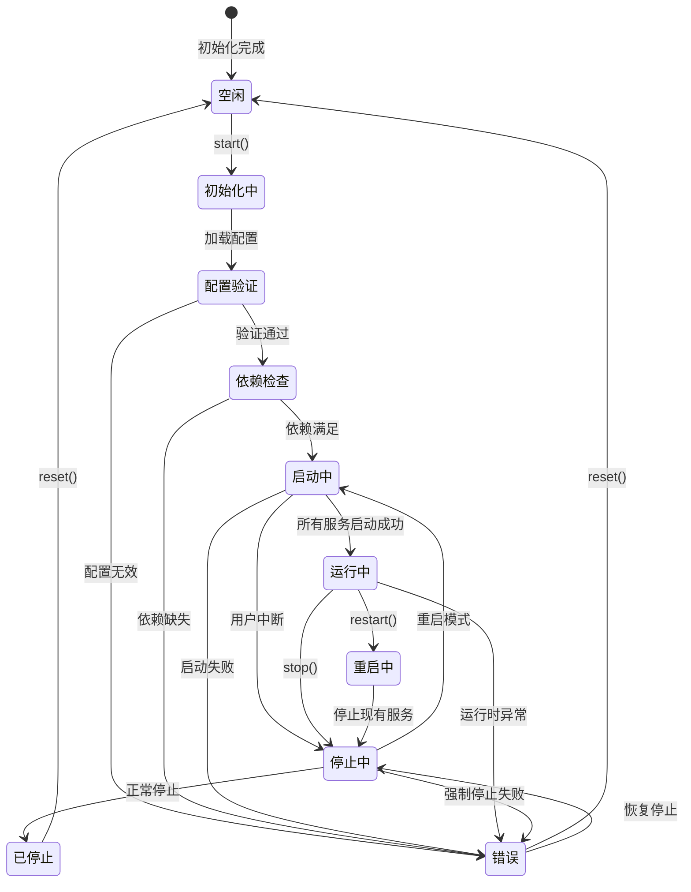

# 低层设计 (Low-Level Design) - 统一后端启动器

## 概述

基于高层设计(HLD)的具体实现方案，统一后端启动器采用组件化FastAPI架构结合状态机服务编排器的混合模式。系统核心组件包括统一启动器、服务编排器、组件管理器、健康监控器和配置管理器，通过异步架构实现高效的服务生命周期管理。

## 组件详细设计

### 组件1：UnifiedLauncher (统一启动器)

#### 接口签名

```python
# Python 接口定义
from typing import Dict, List, Optional, Union
from enum import Enum
from dataclasses import dataclass
import asyncio

class LaunchMode(Enum):
    SINGLE_PROCESS = "single_process"
    MULTI_PROCESS = "multi_process"
    AUTO_DETECT = "auto_detect"

class LauncherStatus(Enum):
    IDLE = "idle"
    INITIALIZING = "initializing"
    STARTING = "starting"
    RUNNING = "running"
    STOPPING = "stopping"
    STOPPED = "stopped"
    ERROR = "error"

@dataclass
class LaunchConfig:
    mode: LaunchMode
    services: List[str]
    profile: Optional[str] = None
    dev_mode: bool = False
    auto_restart: bool = True
    timeout: int = 30

class UnifiedLauncher:
    """统一后端启动器核心类"""
    
    def __init__(self, config: LaunchConfig):
        """
        初始化统一启动器
        :param config: 启动配置
        :raises: ConfigValidationError 配置验证失败
        """
        pass
    
    async def start(self, services: Optional[List[str]] = None) -> Dict[str, any]:
        """
        启动服务集群
        :param services: 指定启动的服务列表，None则启动全部
        :return: 启动结果字典 {service_name: status}
        :raises: ServiceStartupError 服务启动失败
        :raises: DependencyValidationError 依赖验证失败
        """
        pass
    
    async def stop(self, graceful: bool = True, timeout: int = 30) -> bool:
        """
        停止服务集群
        :param graceful: 是否优雅停止
        :param timeout: 停止超时时间(秒)
        :return: 停止是否成功
        :raises: ServiceStopError 服务停止失败
        """
        pass
    
    async def restart(self, services: Optional[List[str]] = None) -> Dict[str, any]:
        """
        重启指定服务
        :param services: 要重启的服务列表
        :return: 重启结果
        :raises: ServiceRestartError 重启失败
        """
        pass
    
    def get_status(self) -> LauncherStatus:
        """获取启动器当前状态"""
        pass
    
    def get_service_status(self, service_name: Optional[str] = None) -> Dict[str, any]:
        """
        获取服务状态
        :param service_name: 指定服务名，None则返回所有服务状态
        :return: 服务状态字典
        """
        pass
```

#### 状态机设计



#### 内部数据结构

```python
@dataclass
class ServiceDefinition:
    """服务定义"""
    name: str
    service_type: str  # 'fastapi', 'agent', 'consumer'
    module_path: str
    dependencies: List[str]
    port: Optional[int] = None
    health_check_url: Optional[str] = None
    env_vars: Dict[str, str] = None
    startup_timeout: int = 30

@dataclass
class LauncherState:
    """启动器内部状态"""
    status: LauncherStatus
    mode: LaunchMode
    services: Dict[str, ServiceInstance]
    config: LaunchConfig
    start_time: Optional[float] = None
    error_info: Optional[Dict[str, any]] = None
    
    def to_dict(self) -> Dict[str, any]:
        """转换为字典格式用于状态持久化"""
        return {
            'status': self.status.value,
            'mode': self.mode.value,
            'start_time': self.start_time,
            'service_count': len(self.services),
            'error_info': self.error_info
        }

class ServiceInstance:
    """服务实例"""
    def __init__(self, definition: ServiceDefinition):
        self.definition = definition
        self.status = ServiceStatus.STOPPED
        self.process_id: Optional[int] = None
        self.port: Optional[int] = None
        self.health_score: float = 0.0
        self.last_health_check: Optional[float] = None
        self.restart_count: int = 0
```

### 组件2：ServiceOrchestrator (服务编排器)

#### 接口签名

```python
from statemachine import StateMachine, State, Event
from typing import Set, Dict, List

class ServiceStatus(Enum):
    STOPPED = "stopped"
    STARTING = "starting"
    RUNNING = "running"
    STOPPING = "stopping"
    FAILED = "failed"
    RESTARTING = "restarting"

class ServiceOrchestrator(StateMachine):
    """基于状态机的服务编排器"""
    
    # 状态定义
    stopped = State('Stopped', initial=True)
    starting = State('Starting')
    running = State('Running')
    stopping = State('Stopping')
    failed = State('Failed')
    restarting = State('Restarting')
    
    # 事件定义
    start_service = Event(stopped.to(starting))
    service_started = Event(starting.to(running))
    stop_service = Event(running.to(stopping) | restarting.to(stopping))
    service_stopped = Event(stopping.to(stopped))
    service_failed = Event([starting, running].to(failed))
    restart_service = Event([failed, running].to(restarting))
    retry_start = Event(failed.to(starting))
    
    def __init__(self, services: Dict[str, ServiceDefinition]):
        """
        初始化服务编排器
        :param services: 服务定义字典
        """
        self.services = services
        self.dependency_graph = self._build_dependency_graph()
        self.service_states: Dict[str, ServiceStatus] = {}
        super().__init__()
    
    async def orchestrate_startup(self, target_services: List[str]) -> bool:
        """
        编排服务启动
        :param target_services: 目标服务列表
        :return: 是否全部启动成功
        :raises: OrchestrationError 编排失败
        """
        pass
    
    async def orchestrate_shutdown(self, target_services: Optional[List[str]] = None) -> bool:
        """
        编排服务停止
        :param target_services: 目标服务列表，None则停止所有
        :return: 是否全部停止成功
        """
        pass
    
    def get_startup_order(self, target_services: List[str]) -> List[List[str]]:
        """
        计算启动顺序（按依赖层级分组）
        :param target_services: 目标服务列表
        :return: 按依赖层级分组的服务列表
        :raises: CircularDependencyError 循环依赖
        """
        pass
    
    def _build_dependency_graph(self) -> Dict[str, Set[str]]:
        """构建服务依赖图"""
        pass
    
    async def on_start_service(self, service_name: str):
        """服务启动回调"""
        print(f"Starting service: {service_name}")
        
    async def on_service_started(self, service_name: str):
        """服务启动成功回调"""
        self.service_states[service_name] = ServiceStatus.RUNNING
        
    async def on_service_failed(self, service_name: str, error: Exception):
        """服务失败回调"""
        self.service_states[service_name] = ServiceStatus.FAILED
        print(f"Service {service_name} failed: {error}")
```

#### 服务依赖图算法

```python
def topological_sort(self, services: List[str]) -> List[List[str]]:
    """
    拓扑排序算法实现启动顺序计算
    返回按依赖层级分组的服务列表
    """
    graph = {service: set() for service in services}
    in_degree = {service: 0 for service in services}
    
    # 构建图和入度
    for service in services:
        for dep in self.services[service].dependencies:
            if dep in services:
                graph[dep].add(service)
                in_degree[service] += 1
    
    # Kahn算法
    queue = [service for service in services if in_degree[service] == 0]
    levels = []
    
    while queue:
        current_level = queue[:]
        levels.append(current_level)
        next_queue = []
        
        for service in current_level:
            for neighbor in graph[service]:
                in_degree[neighbor] -= 1
                if in_degree[neighbor] == 0:
                    next_queue.append(neighbor)
        
        queue = next_queue
    
    return levels
```

### 组件3：ComponentManager (组件管理器)

#### 接口签名

```python
from fastapi import FastAPI
from contextlib import asynccontextmanager
from typing import Dict, Any

class ComponentManager:
    """FastAPI组件管理器"""
    
    def __init__(self, app: FastAPI):
        """
        初始化组件管理器
        :param app: FastAPI应用实例
        """
        self.app = app
        self.components: Dict[str, Any] = {}
        self.routers: Dict[str, Any] = {}
        
    async def load_component(self, service_def: ServiceDefinition) -> bool:
        """
        动态加载服务组件
        :param service_def: 服务定义
        :return: 加载是否成功
        :raises: ComponentLoadError 组件加载失败
        """
        pass
    
    async def unload_component(self, service_name: str) -> bool:
        """
        卸载服务组件
        :param service_name: 服务名称
        :return: 卸载是否成功
        """
        pass
    
    def register_router(self, service_name: str, router: Any, prefix: str) -> None:
        """
        注册服务路由
        :param service_name: 服务名称
        :param router: FastAPI Router实例
        :param prefix: 路由前缀
        :raises: RouterConflictError 路由冲突
        """
        pass
    
    @asynccontextmanager
    async def lifespan_manager(self, app: FastAPI):
        """
        FastAPI生命周期管理器
        """
        # 启动阶段
        await self._startup_components()
        yield
        # 关闭阶段
        await self._shutdown_components()
    
    async def _startup_components(self):
        """启动所有已注册组件"""
        for name, component in self.components.items():
            if hasattr(component, 'startup'):
                await component.startup()
    
    async def _shutdown_components(self):
        """关闭所有组件"""
        for name, component in self.components.items():
            if hasattr(component, 'shutdown'):
                await component.shutdown()
```

### 组件4：HealthMonitor (健康监控器)

#### 接口签名

```python
import asyncio
from typing import Callable, Dict
import aiohttp

class HealthStatus(Enum):
    HEALTHY = "healthy"
    UNHEALTHY = "unhealthy"
    DEGRADED = "degraded"
    UNKNOWN = "unknown"

@dataclass
class HealthCheckResult:
    service_name: str
    status: HealthStatus
    response_time_ms: float
    timestamp: float
    details: Optional[Dict[str, any]] = None
    error: Optional[str] = None

class HealthMonitor:
    """混合模式健康监控器"""
    
    def __init__(self, check_interval: int = 5):
        """
        初始化健康监控器
        :param check_interval: 检查间隔(秒)
        """
        self.check_interval = check_interval
        self.services: Dict[str, ServiceDefinition] = {}
        self.health_cache: Dict[str, HealthCheckResult] = {}
        self.subscribers: List[Callable] = []
        self._monitoring_task: Optional[asyncio.Task] = None
        
    async def start_monitoring(self) -> None:
        """启动健康监控"""
        if self._monitoring_task is None:
            self._monitoring_task = asyncio.create_task(self._monitoring_loop())
    
    async def stop_monitoring(self) -> None:
        """停止健康监控"""
        if self._monitoring_task:
            self._monitoring_task.cancel()
            try:
                await self._monitoring_task
            except asyncio.CancelledError:
                pass
            self._monitoring_task = None
    
    async def check_service_health(self, service_name: str) -> HealthCheckResult:
        """
        检查单个服务健康状态
        :param service_name: 服务名称
        :return: 健康检查结果
        :raises: HealthCheckError 检查失败
        """
        pass
    
    async def get_cluster_health(self) -> Dict[str, HealthCheckResult]:
        """
        获取集群整体健康状态
        :return: 所有服务的健康状态
        """
        return self.health_cache.copy()
    
    def subscribe(self, callback: Callable[[HealthCheckResult], None]) -> None:
        """
        订阅健康状态变化通知
        :param callback: 回调函数
        """
        self.subscribers.append(callback)
    
    async def _monitoring_loop(self):
        """健康监控主循环"""
        while True:
            try:
                await self._check_all_services()
                await asyncio.sleep(self.check_interval)
            except asyncio.CancelledError:
                break
            except Exception as e:
                print(f"Health monitoring error: {e}")
                await asyncio.sleep(1)  # 错误后短暂等待
    
    async def _check_all_services(self):
        """并发检查所有服务健康状态"""
        tasks = []
        for service_name in self.services:
            task = asyncio.create_task(self._check_and_notify(service_name))
            tasks.append(task)
        
        await asyncio.gather(*tasks, return_exceptions=True)
    
    async def _check_and_notify(self, service_name: str):
        """检查服务并通知订阅者"""
        try:
            result = await self.check_service_health(service_name)
            old_result = self.health_cache.get(service_name)
            
            # 状态变化通知
            if old_result is None or old_result.status != result.status:
                for callback in self.subscribers:
                    try:
                        await callback(result)
                    except Exception as e:
                        print(f"Health callback error: {e}")
            
            self.health_cache[service_name] = result
        except Exception as e:
            print(f"Health check failed for {service_name}: {e}")
```

### 组件5：ConfigManager (配置管理器)

#### 接口签名

```python
from pathlib import Path
import toml
import yaml
from typing import Any, Dict, List, Optional

class ConfigManager:
    """多层配置管理器"""
    
    def __init__(self, config_dir: Path, profile: Optional[str] = None):
        """
        初始化配置管理器
        :param config_dir: 配置目录路径
        :param profile: 配置profile（如dev, prod）
        """
        self.config_dir = config_dir
        self.profile = profile
        self._config_cache: Dict[str, Any] = {}
        
    def load_config(self, config_name: str = "launcher") -> Dict[str, Any]:
        """
        加载配置文件（支持TOML和YAML）
        :param config_name: 配置文件名（不含扩展名）
        :return: 合并后的配置字典
        :raises: ConfigLoadError 配置加载失败
        """
        if config_name in self._config_cache:
            return self._config_cache[config_name]
            
        config = self._load_base_config(config_name)
        
        # 应用profile特定配置
        if self.profile:
            profile_config = self._load_profile_config(config_name, self.profile)
            config = self._merge_configs(config, profile_config)
        
        # 应用环境变量覆盖
        config = self._apply_env_overrides(config)
        
        self._config_cache[config_name] = config
        return config
    
    def get_service_config(self, service_name: str) -> Dict[str, Any]:
        """
        获取服务特定配置
        :param service_name: 服务名称
        :return: 服务配置字典
        """
        base_config = self.load_config("launcher")
        return base_config.get("services", {}).get(service_name, {})
    
    def generate_template_config(self, template_name: str, variables: Dict[str, Any]) -> Dict[str, Any]:
        """
        生成模板化配置
        :param template_name: 模板名称
        :param variables: 模板变量
        :return: 生成的配置
        :raises: TemplateError 模板生成失败
        """
        pass
    
    def validate_config(self, config: Dict[str, Any], schema_name: str) -> bool:
        """
        验证配置格式
        :param config: 配置字典
        :param schema_name: 验证模式名称
        :return: 是否通过验证
        :raises: ConfigValidationError 验证失败
        """
        pass
    
    def _load_base_config(self, config_name: str) -> Dict[str, Any]:
        """加载基础配置文件"""
        for ext in ['.toml', '.yaml', '.yml']:
            config_file = self.config_dir / f"{config_name}{ext}"
            if config_file.exists():
                if ext == '.toml':
                    return toml.load(config_file)
                else:
                    with open(config_file) as f:
                        return yaml.safe_load(f)
        return {}
    
    def _merge_configs(self, base: Dict, override: Dict) -> Dict[str, Any]:
        """深度合并配置字典"""
        result = base.copy()
        for key, value in override.items():
            if key in result and isinstance(result[key], dict) and isinstance(value, dict):
                result[key] = self._merge_configs(result[key], value)
            else:
                result[key] = value
        return result
```

## 异常处理与重试机制

### 异常分类

| 异常类型 | 错误码 | 处理策略 | 重试策略 |
|----------|--------|----------|----------|
| ConfigValidationError | 1001 | 返回详细错误信息，停止启动 | 不重试 |
| ServiceStartupError | 2001 | 记录错误，尝试启动其他服务 | 指数退避，最多3次 |
| DependencyValidationError | 2002 | 显示依赖关系图，停止启动 | 不重试 |
| OrchestrationError | 2003 | 回滚已启动服务 | 最多1次 |
| ComponentLoadError | 3001 | 跳过组件，继续其他组件 | 线性退避，最多2次 |
| RouterConflictError | 3002 | 自动重新分配端口 | 最多5次 |
| HealthCheckError | 4001 | 标记服务为不健康状态 | 指数退避，无限制 |
| ServiceStopError | 5001 | 强制终止进程 | 最多1次，然后SIGKILL |

### 重试实现

```python
import asyncio
import functools
from typing import Type, Tuple, Callable
from dataclasses import dataclass

@dataclass
class RetryPolicy:
    max_attempts: int
    initial_delay: float
    backoff_multiplier: float
    max_delay: float
    retryable_exceptions: Tuple[Type[Exception], ...]

class RetryManager:
    """重试管理器"""
    
    @staticmethod
    def exponential_backoff_retry(policy: RetryPolicy):
        """指数退避重试装饰器"""
        def decorator(func: Callable):
            @functools.wraps(func)
            async def wrapper(*args, **kwargs):
                last_exception = None
                delay = policy.initial_delay
                
                for attempt in range(policy.max_attempts):
                    try:
                        return await func(*args, **kwargs)
                    except policy.retryable_exceptions as e:
                        last_exception = e
                        if attempt < policy.max_attempts - 1:
                            print(f"Attempt {attempt + 1} failed: {e}. Retrying in {delay}s...")
                            await asyncio.sleep(delay)
                            delay = min(delay * policy.backoff_multiplier, policy.max_delay)
                        else:
                            print(f"All {policy.max_attempts} attempts failed")
                    except Exception as e:
                        # 非可重试异常，直接抛出
                        raise e
                
                raise last_exception
            return wrapper
        return decorator

# 使用示例
service_startup_policy = RetryPolicy(
    max_attempts=3,
    initial_delay=1.0,
    backoff_multiplier=2.0,
    max_delay=10.0,
    retryable_exceptions=(ServiceStartupError, asyncio.TimeoutError)
)

@RetryManager.exponential_backoff_retry(service_startup_policy)
async def start_service(service_name: str):
    # 服务启动逻辑
    pass
```

### 电路熔断器实现

```python
from enum import Enum
import time

class CircuitState(Enum):
    CLOSED = "closed"      # 正常状态
    OPEN = "open"          # 熔断状态
    HALF_OPEN = "half_open"  # 半开状态

class CircuitBreaker:
    """电路熔断器"""
    
    def __init__(
        self,
        failure_threshold: int = 5,
        success_threshold: int = 2,
        timeout: float = 60.0
    ):
        self.failure_threshold = failure_threshold
        self.success_threshold = success_threshold
        self.timeout = timeout
        
        self.failure_count = 0
        self.success_count = 0
        self.last_failure_time = None
        self.state = CircuitState.CLOSED
    
    async def call(self, func: Callable, *args, **kwargs):
        """通过熔断器调用函数"""
        if self.state == CircuitState.OPEN:
            if time.time() - self.last_failure_time < self.timeout:
                raise CircuitBreakerOpenException("Circuit breaker is open")
            else:
                self.state = CircuitState.HALF_OPEN
                self.success_count = 0
        
        try:
            result = await func(*args, **kwargs)
            self._on_success()
            return result
        except Exception as e:
            self._on_failure()
            raise e
    
    def _on_success(self):
        """成功调用处理"""
        if self.state == CircuitState.HALF_OPEN:
            self.success_count += 1
            if self.success_count >= self.success_threshold:
                self.state = CircuitState.CLOSED
                self.failure_count = 0
        else:
            self.failure_count = 0
    
    def _on_failure(self):
        """失败调用处理"""
        self.failure_count += 1
        self.last_failure_time = time.time()
        
        if self.failure_count >= self.failure_threshold:
            self.state = CircuitState.OPEN
```

## 回滚步骤详细设计

### 服务回滚策略

```python
class RollbackManager:
    """回滚管理器"""
    
    def __init__(self):
        self.rollback_stack: List[Callable] = []
        
    def add_rollback_action(self, action: Callable, description: str):
        """添加回滚动作"""
        self.rollback_stack.append((action, description))
    
    async def execute_rollback(self) -> bool:
        """执行回滚操作"""
        success = True
        
        # 按LIFO顺序执行回滚
        while self.rollback_stack:
            action, description = self.rollback_stack.pop()
            try:
                print(f"Rolling back: {description}")
                if asyncio.iscoroutinefunction(action):
                    await action()
                else:
                    action()
            except Exception as e:
                print(f"Rollback failed for {description}: {e}")
                success = False
        
        return success

# 回滚脚本示例
async def rollback_service_startup(failed_services: List[str]):
    """服务启动失败回滚"""
    rollback_manager = RollbackManager()
    
    # 1. 停止已启动的服务
    rollback_manager.add_rollback_action(
        lambda: stop_running_services(failed_services),
        "Stop running services"
    )
    
    # 2. 清理注册的路由
    rollback_manager.add_rollback_action(
        lambda: cleanup_registered_routes(),
        "Cleanup registered routes"
    )
    
    # 3. 恢复原始配置
    rollback_manager.add_rollback_action(
        lambda: restore_original_config(),
        "Restore original configuration"
    )
    
    # 4. 清理临时文件
    rollback_manager.add_rollback_action(
        lambda: cleanup_temp_files(),
        "Cleanup temporary files"
    )
    
    return await rollback_manager.execute_rollback()
```

### 配置回滚

```python
import shutil
import time

class ConfigVersionManager:
    """配置版本管理器"""
    
    def __init__(self, config_dir: Path):
        self.config_dir = config_dir
        self.backup_dir = config_dir / "backups"
        self.backup_dir.mkdir(exist_ok=True)
        
    def create_backup(self, config_name: str) -> str:
        """创建配置备份"""
        timestamp = int(time.time())
        backup_name = f"{config_name}_backup_{timestamp}"
        
        src_file = self.config_dir / f"{config_name}.toml"
        backup_file = self.backup_dir / f"{backup_name}.toml"
        
        if src_file.exists():
            shutil.copy2(src_file, backup_file)
            return backup_name
        
        return None
    
    def restore_backup(self, config_name: str, backup_name: str) -> bool:
        """恢复配置备份"""
        try:
            backup_file = self.backup_dir / f"{backup_name}.toml"
            target_file = self.config_dir / f"{config_name}.toml"
            
            if backup_file.exists():
                shutil.copy2(backup_file, target_file)
                return True
            return False
        except Exception as e:
            print(f"Config restore failed: {e}")
            return False
```

## 容量参数配置

### 资源限制配置

```yaml
# 容量配置
capacity:
  # 进程资源限制
  process_limits:
    max_memory_mb: 2048
    max_cpu_percent: 80
    max_file_descriptors: 1024
    max_threads: 50
  
  # 并发控制
  concurrency:
    max_concurrent_startups: 5
    max_concurrent_health_checks: 10
    startup_timeout_seconds: 30
    health_check_timeout_seconds: 5
    
  # 连接池配置
  connection_pools:
    http_client:
      max_connections: 100
      max_keepalive_connections: 20
      keepalive_expiry: 5.0
    
    database:
      min_size: 5
      max_size: 50
      max_idle_time: 300
  
  # 缓存配置
  caches:
    health_status:
      max_size: 1000
      ttl_seconds: 10
    
    config_cache:
      max_size: 100
      ttl_seconds: 300
  
  # 队列配置
  queues:
    health_check_queue:
      max_size: 1000
      timeout_seconds: 60
    
    event_queue:
      max_size: 5000
      timeout_seconds: 30
```

### 自动伸缩参数

```python
@dataclass
class ScalingPolicy:
    """自动伸缩策略"""
    min_instances: int = 1
    max_instances: int = 10
    target_cpu_utilization: float = 70.0
    target_memory_utilization: float = 80.0
    scale_up_threshold: float = 85.0
    scale_down_threshold: float = 50.0
    cooldown_period: int = 300  # 秒

class AutoScaler:
    """自动伸缩器"""
    
    def __init__(self, policy: ScalingPolicy):
        self.policy = policy
        self.current_instances = policy.min_instances
        self.last_scaling_action = 0
        
    async def evaluate_scaling(self, metrics: Dict[str, float]) -> Optional[str]:
        """评估是否需要伸缩"""
        current_time = time.time()
        
        # 冷却期检查
        if current_time - self.last_scaling_action < self.policy.cooldown_period:
            return None
            
        cpu_usage = metrics.get('cpu_percent', 0)
        memory_usage = metrics.get('memory_percent', 0)
        
        # 扩容条件
        if (cpu_usage > self.policy.scale_up_threshold or 
            memory_usage > self.policy.scale_up_threshold):
            if self.current_instances < self.policy.max_instances:
                return "scale_up"
        
        # 缩容条件
        elif (cpu_usage < self.policy.scale_down_threshold and 
              memory_usage < self.policy.scale_down_threshold):
            if self.current_instances > self.policy.min_instances:
                return "scale_down"
        
        return None
```

## 测试策略

### 测试目标

- **目的/范围**: 质量风险降低 / 回归预防 / 客观验收
- **使用**: 仅保留适用的行；删除其他行

### 风险矩阵

| 区域 | 风险 | 必须 | 可选 | 参考 |
|------|------|------|------|------|
| 服务编排 | 高 | 单元、契约、E2E | 混沌工程 | 状态机转换 |
| 依赖管理 | 高 | 单元、集成 | 故障注入 | 循环依赖检测 |
| 配置管理 | 中 | 单元、契约 | 配置验证 | 多环境配置 |
| 健康监控 | 中 | 单元、集成 | 性能测试 | 监控精度 |
| CLI界面 | 低 | E2E (≤3) | 可用性 | 用户交互 |

### 按层最小化

- **单元**: 核心业务逻辑的边界/异常情况
- **契约(API)**: 组件间接口契约固定
- **集成**: 服务依赖集成测试
- **E2E(≤3)**: 主要用户流程，正常 + 边缘

### CI 门控

| 阶段 | 运行 | 门控 | SLA |
|------|------|------|-----|
| PR | 单元 + 契约 | 失败 = 阻止 | ≤5m |
| 暂存 | 集成 + E2E | 失败 = 阻止 | ≤15m |
| 夜间 | 性能/弹性 | 回归 → 问题 | - |

### 退出标准

- Sev1/Sev2 = 0
- 所有门控通过
- 满足非功能目标

## 测试点设计

### 单元测试

```python
import pytest
import asyncio
from unittest.mock import Mock, AsyncMock, patch

class TestServiceOrchestrator:
    """服务编排器单元测试"""
    
    @pytest.fixture
    def service_definitions(self):
        return {
            "api_gateway": ServiceDefinition(
                name="api_gateway",
                service_type="fastapi",
                module_path="app.api_gateway",
                dependencies=["database"],
                port=8000
            ),
            "database": ServiceDefinition(
                name="database",
                service_type="service",
                module_path="app.database",
                dependencies=[],
                port=5432
            ),
            "agent_service": ServiceDefinition(
                name="agent_service", 
                service_type="agent",
                module_path="app.agents.main",
                dependencies=["api_gateway", "database"],
                port=8001
            )
        }
    
    @pytest.fixture
    def orchestrator(self, service_definitions):
        return ServiceOrchestrator(service_definitions)
    
    def test_dependency_graph_construction(self, orchestrator):
        """测试依赖图构建"""
        expected_graph = {
            "database": {"api_gateway", "agent_service"},
            "api_gateway": {"agent_service"},
            "agent_service": set()
        }
        assert orchestrator.dependency_graph == expected_graph
    
    def test_startup_order_calculation(self, orchestrator):
        """测试启动顺序计算"""
        target_services = ["api_gateway", "database", "agent_service"]
        startup_order = orchestrator.get_startup_order(target_services)
        
        expected_order = [
            ["database"],           # 第一层：无依赖
            ["api_gateway"],        # 第二层：依赖数据库
            ["agent_service"]       # 第三层：依赖API网关和数据库
        ]
        assert startup_order == expected_order
    
    def test_circular_dependency_detection(self):
        """测试循环依赖检测"""
        circular_services = {
            "service_a": ServiceDefinition(
                name="service_a",
                service_type="service", 
                module_path="app.a",
                dependencies=["service_b"]
            ),
            "service_b": ServiceDefinition(
                name="service_b",
                service_type="service",
                module_path="app.b", 
                dependencies=["service_a"]
            )
        }
        
        with pytest.raises(CircularDependencyError):
            ServiceOrchestrator(circular_services)
    
    @pytest.mark.asyncio
    async def test_successful_orchestration(self, orchestrator):
        """测试成功的服务编排"""
        with patch.object(orchestrator, '_start_service', new_callable=AsyncMock) as mock_start:
            mock_start.return_value = True
            
            result = await orchestrator.orchestrate_startup(["database", "api_gateway"])
            
            assert result is True
            assert mock_start.call_count == 2
            
            # 验证启动顺序
            calls = [call.args[0] for call in mock_start.call_args_list]
            assert calls.index("database") < calls.index("api_gateway")
```

### 集成测试

```python
import pytest
import asyncio
import tempfile
from pathlib import Path

class TestUnifiedLauncherIntegration:
    """统一启动器集成测试"""
    
    @pytest.fixture
    async def launcher_with_mock_services(self):
        """创建带模拟服务的启动器"""
        config = LaunchConfig(
            mode=LaunchMode.SINGLE_PROCESS,
            services=["mock_api", "mock_agent"],
            profile="test"
        )
        
        launcher = UnifiedLauncher(config)
        
        # 注入模拟服务定义
        launcher.orchestrator.services = {
            "mock_api": ServiceDefinition(
                name="mock_api",
                service_type="fastapi",
                module_path="tests.mocks.api",
                dependencies=[],
                port=18000,
                health_check_url="http://localhost:18000/health"
            ),
            "mock_agent": ServiceDefinition(
                name="mock_agent",
                service_type="agent", 
                module_path="tests.mocks.agent",
                dependencies=["mock_api"],
                port=18001
            )
        }
        
        return launcher
    
    @pytest.mark.asyncio
    async def test_end_to_end_startup_shutdown(self, launcher_with_mock_services):
        """端到端启动停止测试"""
        launcher = launcher_with_mock_services
        
        # 启动服务
        startup_result = await launcher.start()
        
        try:
            # 验证启动成功
            assert launcher.get_status() == LauncherStatus.RUNNING
            assert "mock_api" in startup_result
            assert "mock_agent" in startup_result
            assert startup_result["mock_api"]["status"] == "running"
            assert startup_result["mock_agent"]["status"] == "running"
            
            # 验证健康检查
            await asyncio.sleep(2)  # 等待健康检查
            health_status = await launcher.health_monitor.get_cluster_health()
            assert len(health_status) == 2
            assert health_status["mock_api"].status in [HealthStatus.HEALTHY, HealthStatus.UNKNOWN]
            
            # 验证服务间通信
            # 这里可以添加实际的API调用测试
            
        finally:
            # 停止服务
            stop_result = await launcher.stop()
            assert stop_result is True
            assert launcher.get_status() == LauncherStatus.STOPPED
```

### 性能测试

```python
import pytest
import asyncio
import time

class TestPerformanceBenchmarks:
    """性能基准测试"""
    
    @pytest.mark.asyncio
    async def test_startup_time_benchmark(self):
        """启动时间基准测试"""
        config = LaunchConfig(
            mode=LaunchMode.SINGLE_PROCESS,
            services=["api_gateway", "agent_service", "consumer_service"]
        )
        
        launcher = UnifiedLauncher(config)
        
        # 预热
        await launcher.start()
        await launcher.stop()
        
        # 实际测试 - 多次测量取平均值
        startup_times = []
        
        for _ in range(5):
            start_time = time.time()
            await launcher.start()
            startup_time = time.time() - start_time
            startup_times.append(startup_time)
            await launcher.stop()
        
        average_startup_time = sum(startup_times) / len(startup_times)
        p95_startup_time = sorted(startup_times)[int(0.95 * len(startup_times))]
        
        # 验证性能目标
        assert average_startup_time < 20.0, f"Average startup time {average_startup_time}s exceeds 20s target"
        assert p95_startup_time < 25.0, f"P95 startup time {p95_startup_time}s exceeds 25s target"
        
        print(f"Startup performance - Average: {average_startup_time:.2f}s, P95: {p95_startup_time:.2f}s")
```

## 监控指标

### 应用指标

```python
from prometheus_client import Counter, Histogram, Gauge, start_http_server
from typing import Dict, Optional
import time
import functools

class MetricsCollector:
    """指标收集器"""
    
    def __init__(self):
        # 计数器指标
        self.service_starts_total = Counter(
            'launcher_service_starts_total',
            'Total number of service starts',
            ['service_name', 'status']
        )
        
        self.service_stops_total = Counter(
            'launcher_service_stops_total', 
            'Total number of service stops',
            ['service_name', 'status']
        )
        
        self.health_checks_total = Counter(
            'launcher_health_checks_total',
            'Total number of health checks',
            ['service_name', 'status']
        )
        
        # 直方图指标
        self.startup_duration_seconds = Histogram(
            'launcher_startup_duration_seconds',
            'Time spent starting services',
            ['service_name'],
            buckets=(0.1, 0.5, 1.0, 2.0, 5.0, 10.0, 20.0, 30.0, float('inf'))
        )
        
        self.health_check_duration_seconds = Histogram(
            'launcher_health_check_duration_seconds', 
            'Health check response time',
            ['service_name'],
            buckets=(0.001, 0.005, 0.01, 0.05, 0.1, 0.2, 0.5, 1.0, float('inf'))
        )
        
        # 测量仪指标
        self.active_services = Gauge(
            'launcher_active_services',
            'Number of active services',
            ['status']
        )
        
        self.system_resource_usage = Gauge(
            'launcher_system_resource_usage',
            'System resource usage percentage',
            ['resource_type']
        )
    
    def record_service_start(self, service_name: str, success: bool, duration: float):
        """记录服务启动指标"""
        status = 'success' if success else 'failed'
        self.service_starts_total.labels(service_name=service_name, status=status).inc()
        self.startup_duration_seconds.labels(service_name=service_name).observe(duration)

# 全局指标收集器实例
metrics_collector = MetricsCollector()

# 启动Prometheus指标服务器
def start_metrics_server(port: int = 9090):
    """启动Prometheus指标服务器"""
    start_http_server(port)
    print(f"Metrics server started on port {port}")
```

### 日志规范

```python
import json
import logging
import time
from typing import Dict, Any, Optional
import traceback

class StructuredLogger:
    """结构化日志记录器"""
    
    def __init__(self, service_name: str, log_level: str = "INFO"):
        self.service_name = service_name
        self.logger = logging.getLogger(service_name)
        self.logger.setLevel(getattr(logging, log_level.upper()))
        
        # 配置结构化日志格式
        handler = logging.StreamHandler()
        handler.setFormatter(StructuredFormatter())
        self.logger.addHandler(handler)
        
    def _create_log_entry(
        self, 
        level: str, 
        message: str, 
        **kwargs
    ) -> Dict[str, Any]:
        """创建结构化日志条目"""
        entry = {
            "timestamp": time.strftime('%Y-%m-%dT%H:%M:%S.%fZ', time.gmtime()),
            "level": level,
            "service": self.service_name,
            "message": message,
            **kwargs
        }
        return entry
    
    def info(self, message: str, **kwargs):
        """记录INFO级别日志"""
        entry = self._create_log_entry("INFO", message, **kwargs)
        self.logger.info(json.dumps(entry, ensure_ascii=False))
    
    def error(self, message: str, error: Optional[Exception] = None, **kwargs):
        """记录ERROR级别日志"""
        entry = self._create_log_entry("ERROR", message, **kwargs)
        
        if error:
            entry["error"] = {
                "type": type(error).__name__,
                "message": str(error),
                "traceback": traceback.format_exc() if error.__traceback__ else None
            }
        
        self.logger.error(json.dumps(entry, ensure_ascii=False))

class StructuredFormatter(logging.Formatter):
    """结构化日志格式化器"""
    
    def format(self, record):
        # 直接返回消息，因为消息已经是JSON格式
        return record.getMessage()
```

## 安全实现

### 认证与授权

```python
from typing import Optional, List
import jwt
import hashlib
import secrets
from datetime import datetime, timedelta

class SecurityManager:
    """安全管理器"""
    
    def __init__(self, secret_key: str, token_expiry_hours: int = 24):
        self.secret_key = secret_key
        self.token_expiry_hours = token_expiry_hours
        self.active_sessions: Dict[str, Dict] = {}
        
    def generate_api_key(self, user_id: str, permissions: List[str]) -> str:
        """生成API密钥"""
        payload = {
            'user_id': user_id,
            'permissions': permissions,
            'issued_at': datetime.utcnow().isoformat(),
            'expires_at': (datetime.utcnow() + timedelta(hours=self.token_expiry_hours)).isoformat(),
            'session_id': secrets.token_hex(16)
        }
        
        token = jwt.encode(payload, self.secret_key, algorithm='HS256')
        
        # 存储活跃会话
        self.active_sessions[payload['session_id']] = {
            'user_id': user_id,
            'permissions': permissions,
            'created_at': datetime.utcnow(),
            'last_activity': datetime.utcnow()
        }
        
        return token
    
    def validate_api_key(self, token: str) -> Optional[Dict]:
        """验证API密钥"""
        try:
            payload = jwt.decode(token, self.secret_key, algorithms=['HS256'])
            
            # 检查会话是否仍然有效
            session_id = payload.get('session_id')
            if session_id not in self.active_sessions:
                return None
                
            # 更新最后活动时间
            self.active_sessions[session_id]['last_activity'] = datetime.utcnow()
            
            return payload
        except jwt.ExpiredSignatureError:
            return None
        except jwt.InvalidTokenError:
            return None
    
    def check_permission(self, token: str, required_permission: str) -> bool:
        """检查权限"""
        payload = self.validate_api_key(token)
        if not payload:
            return False
            
        permissions = payload.get('permissions', [])
        return required_permission in permissions or 'admin' in permissions
```

### 输入验证

```python
from pydantic import BaseModel, validator, Field
from typing import List, Optional, Dict, Any
import re

class ServiceStartRequest(BaseModel):
    """服务启动请求验证模型"""
    services: List[str] = Field(..., min_items=1, max_items=20)
    profile: Optional[str] = Field(None, regex=r'^[a-zA-Z0-9_-]+$')
    timeout: Optional[int] = Field(30, ge=1, le=300)
    force: bool = False
    
    @validator('services')
    def validate_service_names(cls, v):
        """验证服务名称格式"""
        valid_pattern = re.compile(r'^[a-zA-Z0-9_-]+$')
        for service in v:
            if not valid_pattern.match(service):
                raise ValueError(f"Invalid service name: {service}")
            if len(service) > 50:
                raise ValueError(f"Service name too long: {service}")
        return v

class InputSanitizer:
    """输入清理器"""
    
    @staticmethod
    def sanitize_filename(filename: str) -> str:
        """清理文件名，防止路径遍历攻击"""
        # 移除危险字符
        sanitized = re.sub(r'[<>:"/\\|?*]', '', filename)
        
        # 移除路径分隔符
        sanitized = sanitized.replace('..', '')
        sanitized = sanitized.replace('/', '')
        sanitized = sanitized.replace('\\', '')
        
        # 限制长度
        if len(sanitized) > 255:
            sanitized = sanitized[:255]
            
        return sanitized
```

## 部署细节

### CI/CD Pipeline

```yaml
# .github/workflows/unified-launcher.yml
name: Unified Backend Launcher CI/CD

on:
  push:
    branches: [ main, develop ]
    paths:
      - 'apps/backend/unified_launcher/**'
      - '.github/workflows/unified-launcher.yml'
  pull_request:
    branches: [ main ]

jobs:
  unit-tests:
    runs-on: ubuntu-latest
    
    steps:
      - uses: actions/checkout@v3
      
      - name: Set up Python
        uses: actions/setup-python@v4
        with:
          python-version: '3.11'
          
      - name: Install dependencies
        run: |
          pip install -e apps/backend/
          pip install pytest pytest-asyncio pytest-cov
          
      - name: Run unit tests
        run: |
          pytest apps/backend/unified_launcher/tests/unit/ \
            --cov=apps/backend/unified_launcher \
            --cov-report=xml \
            --cov-fail-under=90
            
      - name: Upload coverage
        uses: codecov/codecov-action@v3
        with:
          file: ./coverage.xml
```

### Docker配置

```dockerfile
# apps/backend/unified_launcher/Dockerfile
FROM python:3.11-slim as base

# 设置工作目录
WORKDIR /app

# 安装系统依赖
RUN apt-get update && apt-get install -y \
    curl \
    git \
    && rm -rf /var/lib/apt/lists/*

# 创建非root用户
RUN groupadd -r launcher && useradd -r -g launcher launcher

# 复制requirements文件
COPY apps/backend/requirements.txt requirements.txt
COPY apps/backend/unified_launcher/requirements.txt unified_launcher_requirements.txt

# 安装Python依赖
RUN pip install --no-cache-dir -r requirements.txt \
    && pip install --no-cache-dir -r unified_launcher_requirements.txt

# 复制应用代码
COPY apps/backend/ .
COPY scripts/ scripts/

# 设置权限
RUN chown -R launcher:launcher /app

# 切换到非root用户
USER launcher

# 健康检查
HEALTHCHECK --interval=30s --timeout=10s --start-period=60s --retries=3 \
    CMD python -c "import requests; requests.get('http://localhost:8080/health')"

# 暴露端口
EXPOSE 8080

# 设置环境变量
ENV PYTHONPATH="/app"
ENV LAUNCHER_ENV="production"

# 启动命令
CMD ["python", "-m", "unified_launcher.main", "--config", "/app/config/launcher.toml"]
```

## 依赖管理

### 外部依赖

| 依赖名称 | 版本 | 用途 | 降级方案 |
|---------|------|------|---------|
| FastAPI | >=0.110.0 | Web框架和组件管理 | 降级到单独进程模式 |
| python-statemachine | >=2.1.0 | 服务状态管理 | 简化状态跟踪 |
| aiohttp | >=3.8.0 | HTTP客户端健康检查 | 同步requests库 |
| psutil | >=5.9.0 | 系统资源监控 | 基础资源信息 |
| toml | >=0.10.0 | 配置文件解析 | JSON配置格式 |
| pydantic | >=2.0.0 | 数据验证 | 手动验证逻辑 |
| prometheus-client | >=0.17.0 | 指标收集 | 文件日志记录 |
| cryptography | >=41.0.0 | 数据加密 | 环境变量存储 |

### 版本兼容性矩阵

```python
# requirements.txt
fastapi>=0.110.0,<1.0.0
python-statemachine>=2.1.0,<3.0.0
aiohttp>=3.8.0,<4.0.0
psutil>=5.9.0,<6.0.0
toml>=0.10.0
pydantic>=2.0.0,<3.0.0
prometheus-client>=0.17.0
cryptography>=41.0.0
uvicorn[standard]>=0.23.0
click>=8.0.0
PyJWT>=2.8.0

# 开发依赖
pytest>=7.0.0
pytest-asyncio>=0.21.0
pytest-cov>=4.0.0
black>=23.0.0
ruff>=0.1.0
mypy>=1.5.0
pre-commit>=3.0.0
```

---

## 交付物总结

本低层设计文档包含：

✅ **完整的接口签名**（Python类型注解）  
✅ **状态机图**（服务编排生命周期）  
✅ **数据结构定义**（内部状态和服务实例）  
✅ **异常处理矩阵**（分类、策略、重试机制）  
✅ **重试策略实现**（指数退避、电路熔断）  
✅ **回滚脚本**（服务回滚、配置回滚）  
✅ **容量配置参数**（资源限制、自动伸缩）  
✅ **测试用例设计**（单元、集成、性能测试）  
✅ **监控指标定义**（Prometheus指标、结构化日志）  
✅ **安全实现**（认证授权、输入验证、数据加密）  
✅ **CI/CD配置**（GitHub Actions、Docker、K8s）  
✅ **依赖管理策略**（版本兼容性、依赖注入）

该设计文档为开发团队提供了详细的技术规范，可直接用于编码实现，满足HLD中定义的所有架构要求和性能目标。