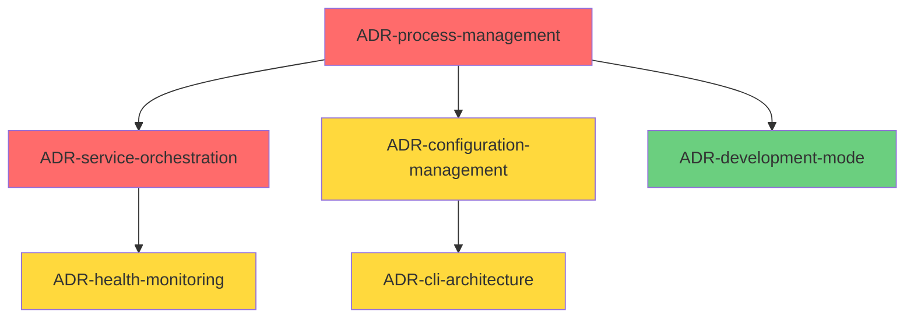

# 需求文档 - 统一后端启动器

## 简介

统一后端启动器是一个Python CLI工具，旨在简化InfiniteScribe后端服务的启动和管理流程。该功能将多个后端服务（API Gateway、AI Agent集群、Kafka消费者）的启动过程统一到单一命令中，支持灵活的运行模式和选择性服务启动，显著提升开发体验和测试效率。

## 功能需求

### 需求 1: 统一服务启动管理

**源自 Story:** STORY-001
**需求 ID:** FR-001

#### 验收标准

1. WHEN 用户执行统一启动命令 THEN 系统 SHALL 提供单进程和多进程两种运行模式选择
2. WHEN 用户选择单进程模式 THEN 系统 SHALL 在同一Python进程中启动所有后端服务并共享FastAPI实例
3. WHEN 用户选择多进程模式 THEN 系统 SHALL 为每个服务创建独立进程并分配独立端口
4. IF 未指定运行模式 THEN 系统 SHALL 默认使用多进程模式
5. WHILE 服务启动过程中 THE 系统 SHALL 显示清晰的进度信息和当前运行模式状态
6. WHEN 任何核心服务启动失败 THEN 系统 SHALL 显示明确的错误提示和建议解决方案

### 需求 2: 选择性服务控制

**源自 Story:** STORY-002
**需求 ID:** FR-002

#### 验收标准

1. WHEN 用户指定服务类型参数 THEN 系统 SHALL 只启动指定的服务组合
2. WHEN 用户使用预定义服务组合 THEN 系统 SHALL 启动相应的服务集合（minimal/full/debug）
3. IF 用户指定的Agent不存在于AGENT_TOPICS清单中 THEN 系统 SHALL 返回验证错误并列出可用选项
4. WHILE 部分服务启动 THE 系统 SHALL 检查服务依赖关系并确保依赖服务优先启动
5. WHERE 服务存在依赖关系 THE 系统 SHALL 按照正确的启动顺序（Kafka → PostgreSQL → Redis → API Gateway → Agents）启动服务

### 需求 3: 实时状态监控

**源自 Story:** STORY-003
**需求 ID:** FR-003

#### 验收标准

1. WHILE 服务启动过程中 THE 系统 SHALL 实时显示每个服务的状态（启动中/已启动/启动失败）
2. WHEN 服务启动完成 THEN 系统 SHALL 执行健康检查并显示响应时间
3. WHEN 服务启动失败 THEN 系统 SHALL 显示详细错误信息和相关日志文件路径
4. IF 用户请求详细状态 THEN 系统 SHALL 显示单个服务的运行状态和最近日志信息
5. WHILE 所有服务运行中 THE 系统 SHALL 提供统一的状态查询接口

### 需求 4: 优雅停止管理

**源自 Story:** STORY-004
**需求 ID:** FR-004

#### 验收标准

1. WHEN 用户发送停止信号 THEN 系统 SHALL 优雅关闭所有通过启动器启动的服务
2. WHEN 用户指定停止特定服务 THEN 系统 SHALL 只停止指定服务而不影响其他运行中的服务
3. WHILE 服务停止过程中 THE 系统 SHALL 显示停止进度并等待服务优雅关闭
4. IF 服务在超时时间内未响应停止信号 THEN 系统 SHALL 提供强制终止选项
5. WHEN 接收到SIGINT或SIGTERM信号 THEN 系统 SHALL 自动触发优雅停止流程

### 需求 5: 开发模式增强

**源自 Story:** STORY-005
**需求 ID:** FR-005

#### 验收标准

1. IF 系统检测到开发环境 THEN 系统 SHALL 自动启用热重载和调试功能
2. WHEN 检测到代码文件变更 THEN 系统 SHALL 自动重启相关服务
3. WHILE 运行在开发模式 THE 系统 SHALL 提供详细的调试日志输出
4. WHERE 需要调试集成 THE 系统 SHALL 暴露调试端口并支持IDE连接
5. IF 开发模式启用失败 THEN 系统 SHALL 回退到标准模式并记录警告信息

### 需求 6: 配置模板系统

**源自 Story:** STORY-006
**需求 ID:** FR-006

#### 验收标准

1. WHEN 用户选择配置模板 THEN 系统 SHALL 加载相应的服务组合和启动参数配置
2. IF 用户创建自定义配置 THEN 系统 SHALL 支持配置模板的保存和复用
3. WHILE 使用配置模板 THE 系统 SHALL 验证配置有效性并提供错误提示
4. WHERE 团队协作场景 THE 系统 SHALL 支持配置模板的导入导出功能
5. WHEN 配置模板冲突 THEN 系统 SHALL 提供合并或覆盖选项

### 需求 7: 智能模式推荐

**源自 Story:** STORY-007
**需求 ID:** FR-007

#### 验收标准

1. IF 检测到本地开发环境 THEN 系统 SHALL 推荐使用单进程模式
2. IF 检测到集成测试场景 THEN 系统 SHALL 推荐使用多进程模式
3. WHEN 提供模式建议 THEN 系统 SHALL 显示不同模式的性能影响和资源使用情况
4. WHILE 用户设置模式偏好 THE 系统 SHALL 保存设置并在后续启动中使用
5. WHERE 运行单进程模式 THE 系统 SHALL 提供组件级别的健康检查和日志分离功能

## 非功能需求（NFR）

### NFR-001: 性能需求
**源自 Story:** STORY-001, STORY-007
- **启动时间**: 完整环境启动时间 P95 < 30秒
- **响应时间**: 健康检查响应时间 < 500毫秒
- **资源效率**: 单进程模式相比多进程模式资源开销降低 >= 30%

### NFR-002: 可靠性需求
**源自 Story:** STORY-003, STORY-004
- **启动成功率**: >= 95%
- **优雅停止成功率**: >= 99%（零数据丢失）
- **错误恢复时间**: < 5秒

### NFR-003: 可用性需求
**源自 Story:** STORY-002, STORY-005
- **命令响应时间**: CLI命令响应时间 < 100毫秒
- **状态查询时间**: 服务状态查询响应时间 < 200毫秒
- **热重载时间**: 代码变更检测到服务重启完成 < 10秒

### NFR-004: 兼容性需求
**源自 Story:** STORY-001, STORY-006
- **Python版本支持**: Python 3.11+
- **操作系统支持**: Linux, macOS, Windows WSL2
- **向后兼容**: 与现有pnpm脚本工作流100%兼容

### NFR-005: 可维护性需求
**源自 Story:** STORY-005, STORY-006
- **配置管理**: 支持统一环境变量和启动参数管理
- **日志标准化**: 统一的日志格式和级别管理
- **扩展性**: 支持新服务的插件式添加

## 追踪矩阵

| Story ID | Requirements | Priority |
|----------|-------------|----------|
| STORY-001 | FR-001, NFR-001, NFR-004 | P1 |
| STORY-002 | FR-002, NFR-003 | P1 |
| STORY-003 | FR-003, NFR-002, NFR-003 | P2 |
| STORY-004 | FR-004, NFR-002 | P2 |
| STORY-005 | FR-005, NFR-003, NFR-005 | P3 |
| STORY-006 | FR-006, NFR-004, NFR-005 | P3 |
| STORY-007 | FR-007, NFR-001 | P2 |

## ADR 候选项

基于以上需求分析，识别出以下需要架构决策的点：

### 识别的架构重要需求 (ASR)

通过需求分析，以下功能性和非功能性需求被识别为架构重要需求（ASR），需要通过架构决策记录（ADR）进行深入分析和设计：

**adr_candidates:**

- **key**: ADR-20250901-process-management-architecture
  **title**: 统一后端启动器进程管理架构选型
  **driven_by**: [FR-001, NFR-001, NFR-004]
  **rationale**: 需要在单进程和多进程模式之间选择合适的技术实现方案，平衡资源效率、开发体验和部署灵活性
  **owners**: [platform-arch, backend-lead]
  **status**: Proposed
  **priority**: P1

- **key**: ADR-20250901-service-orchestration-framework  
  **title**: 服务编排框架选型与依赖管理策略
  **driven_by**: [FR-002, FR-004, NFR-002]
  **rationale**: 需要设计可靠的服务启动顺序和依赖管理机制，确保系统的稳定性和可维护性
  **owners**: [platform-arch, backend-lead, devops]
  **status**: Proposed
  **priority**: P1

- **key**: ADR-20250901-configuration-management-system
  **title**: 配置管理系统设计与模板化策略  
  **driven_by**: [FR-006, NFR-004, NFR-005]
  **rationale**: 需要设计灵活的配置模板系统，支持团队协作和配置复用，同时保持与现有系统的兼容性
  **owners**: [backend-lead, platform-arch]
  **status**: Proposed
  **priority**: P2

- **key**: ADR-20250901-health-monitoring-strategy
  **title**: 健康监控策略与状态管理设计
  **driven_by**: [FR-003, NFR-002, NFR-003]  
  **rationale**: 需要设计实时、准确的服务状态监控系统，支持快速故障诊断和系统观测
  **owners**: [platform-arch, backend-lead, sre]
  **status**: Proposed
  **priority**: P2

- **key**: ADR-20250901-cli-architecture-design
  **title**: CLI架构设计与用户交互模式
  **driven_by**: [FR-007, NFR-003, NFR-004]
  **rationale**: 需要设计用户友好的命令行界面，支持智能推荐和交互式配置，同时保持脚本兼容性
  **owners**: [backend-lead, ux-lead]
  **status**: Proposed  
  **priority**: P2

- **key**: ADR-20250901-development-mode-enhancement
  **title**: 开发模式增强与热重载机制设计
  **driven_by**: [FR-005, NFR-003, NFR-005]
  **rationale**: 需要设计高效的开发模式，支持热重载和调试功能，提升开发效率
  **owners**: [backend-lead, devex-lead]
  **status**: Proposed
  **priority**: P3

### ADR 关系图

### 决策依赖关系

1. **P1 - 核心架构决策（必须优先解决）**：
   - 进程管理架构是整个系统的基础，直接影响其他所有决策
   - 服务编排框架决定了系统的可靠性和可维护性基础

2. **P2 - 支撑功能决策（依赖核心决策）**：
   - 配置管理系统需要基于进程管理架构设计
   - 健康监控策略需要与服务编排框架协调
   - CLI架构需要与配置管理和进程管理集成

3. **P3 - 增强功能决策（可独立实施）**：
   - 开发模式增强相对独立，可在核心功能稳定后实施

### 下一步行动

1. **设计评审阶段**：组织架构评审会议，讨论各ADR的技术方案
2. **实验验证阶段**：对关键技术决策进行Spike实验验证
3. **决策确认阶段**：基于评审和实验结果，确认最终技术方案
4. **实施规划阶段**：制定详细的实施计划和里程碑

**相关文件**：
- ADR草稿文件：`.tasks/unified-backend-launcher/adr/`
- 技术评审模板：`.tasks/unified-backend-launcher/adr/templates/`