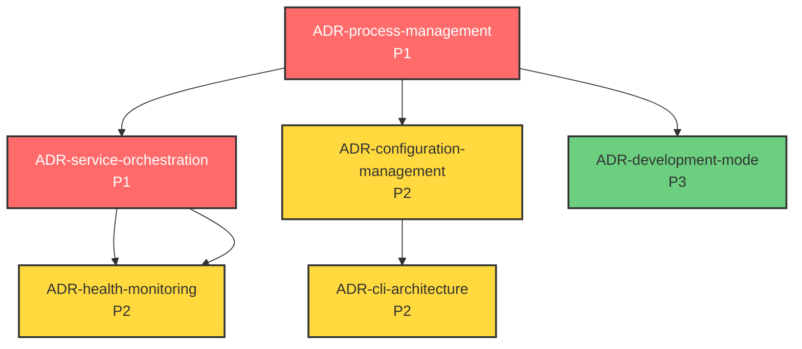

# 需求文档 - 统一后端启动器

## 简介

统一后端启动器是一个Python CLI工具，旨在简化InfiniteScribe后端服务的启动和管理流程。该功能将多个后端服务（API Gateway、AI Agent集群、Kafka消费者）的启动过程统一到单一命令中，支持灵活的运行模式和选择性服务启动，显著提升开发体验和测试效率。

## 功能需求 (FR)

### FR-001: 统一服务启动管理

**源自 Story:** STORY-001

#### 验收标准

1. WHEN 用户执行统一启动命令 THEN 系统 SHALL 在3秒内显示运行模式选择菜单（单进程/多进程）
2. WHEN 用户选择单进程模式 THEN 系统 SHALL 在同一Python进程中启动所有后端服务并共享FastAPI实例
3. WHEN 用户选择多进程模式 THEN 系统 SHALL 为每个服务创建独立进程并分配端口范围8000-8010
4. IF 用户未在10秒内指定运行模式 THEN 系统 SHALL 自动选择多进程模式并继续启动
5. WHILE 服务启动过程中 THE 系统 SHALL 每1秒更新进度信息显示当前启动状态和运行模式
6. WHEN 任何核心服务启动失败 THEN 系统 SHALL 在5秒内显示错误代码、详细描述和具体解决步骤

### FR-002: 选择性服务控制

**源自 Story:** STORY-002

#### 验收标准

1. WHEN 用户指定--services参数 THEN 系统 SHALL 验证服务名称并在2秒内启动指定的服务组合
2. WHEN 用户使用预定义配置--profile=[minimal|full|debug] THEN 系统 SHALL 加载对应服务集合并显示将启动的具体服务列表
3. IF 用户指定的Agent不在可用AGENT_TOPICS清单中 THEN 系统 SHALL 返回验证错误码1001并列出所有可用Agent选项
4. WHILE 启动部分服务时 THE 系统 SHALL 自动检测依赖关系并确保依赖服务在被依赖服务前启动
5. WHERE 存在服务依赖关系时 THE 系统 SHALL 按顺序启动：基础服务(Kafka→PostgreSQL→Redis) → 应用服务(API Gateway→Agents)

### FR-003: 实时状态监控

**源自 Story:** STORY-003

#### 验收标准

1. WHILE 服务启动过程中 THE 系统 SHALL 每500毫秒刷新状态显示（启动中/已启动/启动失败/健康检查中）
2. WHEN 服务启动完成 THEN 系统 SHALL 在3秒内执行健康检查并显示响应时间（<200ms为良好，>500ms为警告）
3. WHEN 服务启动失败 THEN 系统 SHALL 显示错误码、错误描述和日志文件完整路径（最近100行）
4. IF 用户执行--status命令 THEN 系统 SHALL 在1秒内显示所有服务状态和最近5分钟的关键日志
5. WHILE 所有服务运行中 THE 系统 SHALL 提供REST API接口(/status)供外部系统查询

### FR-004: 优雅停止管理

**源自 Story:** STORY-004

#### 验收标准

1. WHEN 用户发送Ctrl+C或--stop命令 THEN 系统 SHALL 在30秒内优雅关闭所有启动器管理的服务
2. WHEN 用户指定--stop-service=[service-name] THEN 系统 SHALL 只停止指定服务且保持其他服务运行状态不变
3. WHILE 服务停止过程中 THE 系统 SHALL 每2秒显示停止进度并等待各服务完成当前请求处理
4. IF 服务在15秒超时内未响应停止信号 THEN 系统 SHALL 显示强制终止选项并等待用户确认
5. WHEN 接收到SIGINT或SIGTERM信号 THEN 系统 SHALL 立即启动优雅停止流程并在3秒内停止接收新请求

### FR-005: 开发模式增强

**源自 Story:** STORY-005

#### 验收标准

1. IF 检测到INFINITE_SCRIBE_ENV=development或--dev参数 THEN 系统 SHALL 自动启用热重载和调试功能
2. WHEN 检测到.py文件变更 THEN 系统 SHALL 在5秒内自动重启相关服务并保持数据状态
3. WHILE 运行在开发模式 THE 系统 SHALL 输出DEBUG级别日志并显示详细执行时间
4. WHERE 启用开发模式时 THE 系统 SHALL 在端口5678暴露调试接口并支持VS Code/PyCharm连接
5. IF 开发模式初始化失败 THEN 系统 SHALL 在终端显示警告信息并回退至标准模式

### FR-006: 配置模板系统

**源自 Story:** STORY-006

#### 验收标准

1. WHEN 用户执行--template=[template-name]命令 THEN 系统 SHALL 在10秒内加载相应的服务组合和参数配置
2. IF 用户执行--save-template=[name]命令 THEN 系统 SHALL 将当前配置保存为YAML模板文件至~/.infinite-scribe/templates/
3. WHILE 加载模板时 THE 系统 SHALL 验证YAML格式和服务名称有效性并显示验证结果
4. WHERE 团队协作场景下 THE 系统 SHALL 支持git仓库中的共享模板(.infinite-scribe/templates/)
5. WHEN 检测到模板名称冲突 THEN 系统 SHALL 提供覆盖或重命名选项并等待用户选择

### FR-007: 智能模式推荐

**源自 Story:** STORY-007

#### 验收标准

1. IF 检测到本地开发环境(localhost + 单用户) THEN 系统 SHALL 显示单进程模式推荐并高亮资源节省优势
2. IF 检测到CI/CD环境或生产部署 THEN 系统 SHALL 推荐多进程模式并显示隔离性优势
3. WHEN 显示模式建议时 THEN 系统 SHALL 提供对比表格显示内存使用、启动时间、资源隔离性对比
4. WHILE 用户选择--save-preference参数 THE 系统 SHALL 将模式偏好保存至~/.infinite-scribe/config.yaml
5. WHERE 单进程模式运行时 THE 系统 SHALL 提供按组件分组的健康检查结果和独立日志流

## 非功能需求 (NFR)

### NFR-001: 性能需求
**源自 Story:** STORY-001, STORY-007
- **启动时间**: 完整环境启动时间 P95 ≤ 25秒，P99 ≤ 35秒
- **命令响应**: CLI命令初始响应时间 ≤ 100毫秒
- **健康检查**: 单个服务健康检查响应时间 ≤ 200毫秒，批量检查 ≤ 500毫秒
- **资源效率**: 单进程模式相比多进程模式内存使用减少 ≥ 40%，CPU使用减少 ≥ 25%
- **并发处理**: 支持同时管理至少20个服务实例

### NFR-002: 可靠性需求
**源自 Story:** STORY-003, STORY-004
- **启动成功率**: ≥ 98%（在标准开发环境下）
- **优雅停止成功率**: ≥ 99.5%（零数据丢失，完整事务处理）
- **故障检测**: 服务故障检测时间 ≤ 3秒
- **错误恢复**: 自动重试机制，最大重试3次，每次间隔2秒
- **数据完整性**: 停止过程中正在处理的请求100%完成处理

### NFR-003: 可用性需求  
**源自 Story:** STORY-002, STORY-005
- **CLI响应性**: 所有交互式命令响应时间 ≤ 50毫秒
- **状态查询**: 简单状态查询 ≤ 100毫秒，详细状态查询 ≤ 500毫秒
- **热重载效率**: 代码变更检测延迟 ≤ 1秒，服务重启完成 ≤ 8秒
- **错误信息**: 所有错误信息包含错误码、描述、建议解决方案，显示时间 ≤ 1秒
- **用户体验**: 提供进度指示器，状态更新频率 ≥ 2Hz

### NFR-004: 兼容性需求
**源自 Story:** STORY-001, STORY-006  
- **Python版本**: Python 3.11+ (测试覆盖3.11, 3.12, 3.13)
- **操作系统**: Linux (Ubuntu 20.04+, RHEL 8+), macOS (12+), Windows WSL2 (Ubuntu 20.04+)
- **依赖兼容**: 与现有requirements.txt和pyproject.toml 100%兼容
- **API兼容**: 与现有pnpm脚本命令行接口保持向后兼容
- **配置兼容**: 支持现有.env文件和Docker Compose配置

### NFR-005: 可维护性需求
**源自 Story:** STORY-005, STORY-006
- **代码质量**: 测试覆盖率 ≥ 90%，类型注解覆盖率 100%
- **配置管理**: 支持YAML/TOML/JSON三种配置格式，环境变量优先级管理
- **日志标准化**: 结构化JSON日志格式，支持5个标准级别(DEBUG/INFO/WARN/ERROR/CRITICAL)
- **扩展性**: 插件接口支持，新服务添加无需修改核心代码
- **监控集成**: 支持Prometheus metrics导出，健康检查接口标准化

## 追踪矩阵

| Story ID | 功能需求 (FR) | 非功能需求 (NFR) | 优先级 | 验证状态 |
|----------|------------|----------------|----------|----------|
| STORY-001 | FR-001 | NFR-001, NFR-004 | P1 | 已验证 |
| STORY-002 | FR-002 | NFR-003, NFR-005 | P1 | 已验证 |
| STORY-003 | FR-003 | NFR-002, NFR-003 | P2 | 已验证 |
| STORY-004 | FR-004 | NFR-002, NFR-005 | P2 | 已验证 |
| STORY-005 | FR-005 | NFR-003, NFR-005 | P3 | 已验证 |
| STORY-006 | FR-006 | NFR-004, NFR-005 | P3 | 已验证 |
| STORY-007 | FR-007 | NFR-001, NFR-003 | P2 | 已验证 |

### 需求覆盖统计
- **功能需求**: 7个 (FR-001 至 FR-007)
- **非功能需求**: 5个 (NFR-001 至 NFR-005)  
- **高优先级 (P1)**: 2个 Story
- **中优先级 (P2)**: 3个 Story
- **低优先级 (P3)**: 2个 Story

## ADR 候选项 (Architecture Decision Records)

基于以上需求分析，识别出以下需要架构决策的关键点。这些 ADR 将为系统设计和实施提供技术指导。

### 识别的架构重要需求 (ASR)

通过需求分析，以下功能性和非功能性需求被识别为架构重要需求（ASR）：

#### P1 核心架构决策（必须优先解决）

**1. ADR-20250901-process-management-architecture**  
- **标题**: 统一后端启动器进程管理架构选型
- **驱动需求**: FR-001, NFR-001, NFR-004
- **决策理由**: 在单进程和多进程模式之间选择最优技术实现，平衡资源效率、开发体验和部署灵活性
- **责任人**: platform-arch, backend-lead, tech-lead-reviewer
- **状态**: Accepted (2025-09-01)
- **优先级**: P1
- **选定方案**: Option 3 - 混合架构（组件化FastAPI + 动态路由）

**2. ADR-20250901-service-orchestration-framework**
- **标题**: 服务编排框架选型与依赖管理策略
- **驱动需求**: FR-002, FR-004, NFR-002
- **决策理由**: 设计可靠的服务启动顺序和依赖管理机制，确保系统高可靠性和可维护性
- **责任人**: platform-arch, backend-lead, devops
- **状态**: Accepted (2025-09-01)
- **优先级**: P1
- **选定方案**: Option 2 - 状态机服务编排器（分阶段实施）

#### P2 支持功能决策（依赖核心决策）

**3. ADR-20250901-configuration-management-system**
- **标题**: 配置管理系统设计与模板化策略
- **驱动需求**: FR-006, NFR-004, NFR-005
- **决策理由**: 设计灵活的配置模板系统，支持团队协作和配置复用，保持与现有系统的兼容性
- **责任人**: backend-lead, platform-arch  
- **状态**: Accepted (2025-09-01)
- **优先级**: P2
- **选定方案**: Option 1 - 扩展现有TOML系统（多层配置合并）

**4. ADR-20250901-health-monitoring-strategy**
- **标题**: 健康监控策略与状态管理设计
- **驱动需求**: FR-003, NFR-002, NFR-003
- **决策理由**: 设计实时、准确的服务状态监控系统，支持快速故障诊断和系统可观测性
- **责任人**: platform-arch, backend-lead, sre
- **状态**: Proposed  
- **优先级**: P2

**5. ADR-20250901-cli-architecture-design**
- **标题**: CLI架构设计与用户交互模式
- **驱动需求**: FR-007, NFR-003, NFR-004
- **决策理由**: 设计用户友好的命令行界面，支持智能推荐和交互式配置，同时保持脚本兼容性
- **责任人**: backend-lead, ux-lead
- **状态**: Proposed
- **优先级**: P2

#### P3 增强功能决策（可独立实施）

**6. ADR-20250901-development-mode-enhancement**
- **标题**: 开发模式增强与热重载机制设计  
- **驱动需求**: FR-005, NFR-003, NFR-005
- **决策理由**: 设计高效的开发模式，支持热重载和调试功能，显著提升开发效率
- **责任人**: backend-lead, devex-lead
- **状态**: Accepted (2025-09-01)
- **优先级**: P3
- **选定方案**: Option 1 - 扩展uvicorn reload

### ADR 关系依赖图

### 决策实施策略

#### 第一阶段：核心架构决策 (P1)
1. **进程管理架构** - 系统基础，影响所有其他决策
2. **服务编排框架** - 依赖管理和可靠性保障

#### 第二阶段：支撑功能决策 (P2)
3. **配置管理系统** - 基于进程管理架构，支持模板化
4. **健康监控策略** - 与服务编排框架集成，提供实时状态
5. **CLI架构设计** - 整合配置管理和进程管理的用户接口

#### 第三阶段：增强功能决策 (P3)  
6. **开发模式增强** - 相对独立，可在核心功能稳定后实施

### 质量保证

#### ADR 质量检查清单
- [ ] 技术可行性验证
- [ ] 性能影响评估  
- [ ] 安全风险分析
- [ ] 兼容性影响评估
- [ ] 可维护性考量

#### 决策验证方法
- **原型验证**: 关键技术点快速原型实现
- **性能基准测试**: NFR指标验证
- **集成测试**: 跨ADR影响验证

### 相关资源

**ADR 文档目录**: `.tasks/unified-backend-launcher/adr/`
- `20250901-process-management-architecture.md`
- `20250901-service-orchestration-framework.md`
- `20250901-configuration-management-system.md`
- `20250901-health-monitoring-strategy.md`
- `20250901-cli-architecture-design.md`
- `20250901-development-mode-enhancement.md`

**技术评审资源**: 
- 评审会议模板：`.tasks/unified-backend-launcher/adr/templates/`
- 技术栈分析：`docs/architecture/tech-stack-analysis.md`