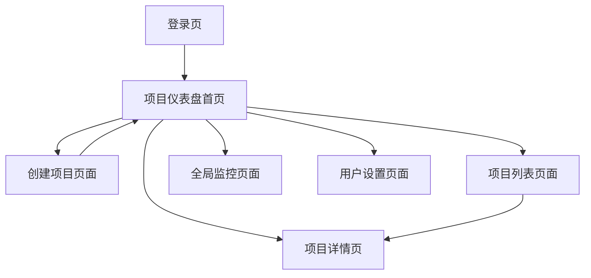

# Dashboard首页产品需求文档

## 1. 产品概述

Dashboard首页是用户登录后的默认着陆页，作为整个小说创作系统的核心入口。它为用户提供项目管理、系统监控和快速操作的统一界面，帮助用户高效管理多个小说创作项目。

## 2. 核心功能

### 2.1 用户角色

| 角色 | 注册方式 | 核心权限 |
|------|----------|----------|
| 普通用户 | 邮箱注册 | 可创建和管理个人小说项目，查看项目状态 |
| 高级用户 | 邀请码升级 | 可访问高级功能，查看详细分析数据 |

### 2.2 功能模块

我们的dashboard首页包含以下核心页面：
1. **项目仪表盘首页**：项目概览卡片、快速操作面板、系统状态指示器
2. **项目列表页面**：所有项目的详细列表视图，支持搜索和筛选
3. **创建项目页面**：新建小说项目的引导流程
4. **全局监控页面**：系统健康状态和性能指标
5. **用户设置页面**：账户管理和偏好设置

### 2.3 页面详情

| 页面名称 | 模块名称 | 功能描述 |
|----------|----------|----------|
| 项目仪表盘首页 | 欢迎横幅 | 显示用户欢迎信息和当前时间，提供个性化问候 |
| 项目仪表盘首页 | 项目概览卡片 | 展示用户最近的3-5个项目，包括项目名称、状态、最后更新时间 |
| 项目仪表盘首页 | 快速操作面板 | 提供创建新项目、查看所有项目、访问帮助文档的快捷入口 |
| 项目仪表盘首页 | 系统状态指示器 | 显示API网关健康状态、服务可用性等系统信息 |
| 项目仪表盘首页 | 统计数据卡片 | 展示用户总项目数、已完成章节数、创作天数等统计信息 |
| 项目列表页面 | 项目列表 | 显示所有项目的表格视图，支持按状态、创建时间等排序 |
| 项目列表页面 | 搜索筛选 | 提供项目名称搜索和状态筛选功能 |
| 创建项目页面 | 项目创建表单 | 收集项目基本信息：标题、类型、简介等 |
| 创建项目页面 | 模板选择 | 提供预设的小说类型模板供用户选择 |
| 全局监控页面 | 系统健康监控 | 显示各个微服务的运行状态和性能指标 |
| 用户设置页面 | 账户信息管理 | 用户个人信息编辑和密码修改功能 |

## 3. 核心流程

**主要用户操作流程：**
用户登录后首先进入项目仪表盘首页，可以查看项目概览和系统状态。如果没有项目，系统会引导用户创建新项目。有项目的用户可以点击项目卡片进入项目详情，或通过快速操作面板访问其他功能。

**页面导航流程图：**

## 4. 用户界面设计

### 4.1 设计风格

- **主色调**：蓝色系（#3B82F6）和灰色系（#6B7280）
- **按钮样式**：圆角矩形，支持主要、次要、轮廓三种样式
- **字体**：Inter字体，标题16-24px，正文14-16px
- **布局风格**：卡片式布局，顶部导航栏设计
- **图标风格**：使用Lucide图标库，简洁线性风格

### 4.2 页面设计概览

| 页面名称 | 模块名称 | UI元素 |
|----------|----------|--------|
| 项目仪表盘首页 | 顶部导航栏 | 包含logo、主导航菜单、用户头像下拉菜单，背景色白色，阴影效果 |
| 项目仪表盘首页 | 欢迎横幅 | 渐变背景，大标题欢迎文字，当前日期时间显示 |
| 项目仪表盘首页 | 项目概览区域 | 3列网格布局，每个项目卡片包含缩略图、标题、状态标签、操作按钮 |
| 项目仪表盘首页 | 快速操作面板 | 水平排列的操作按钮，主要按钮使用品牌色，次要按钮使用轮廓样式 |
| 项目仪表盘首页 | 系统状态区域 | 状态指示灯和文字说明，绿色表示正常，红色表示异常 |
| 项目列表页面 | 搜索筛选栏 | 搜索输入框和下拉筛选器，固定在页面顶部 |
| 创建项目页面 | 表单区域 | 分步骤的表单设计，进度指示器，输入验证提示 |

### 4.3 响应式设计

产品采用桌面优先的响应式设计，在移动设备上自适应布局，支持触摸交互优化。