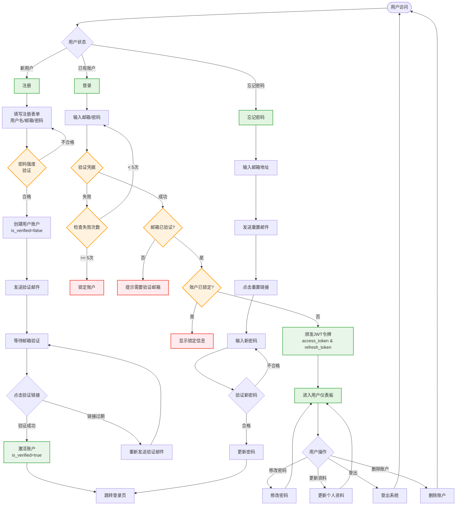
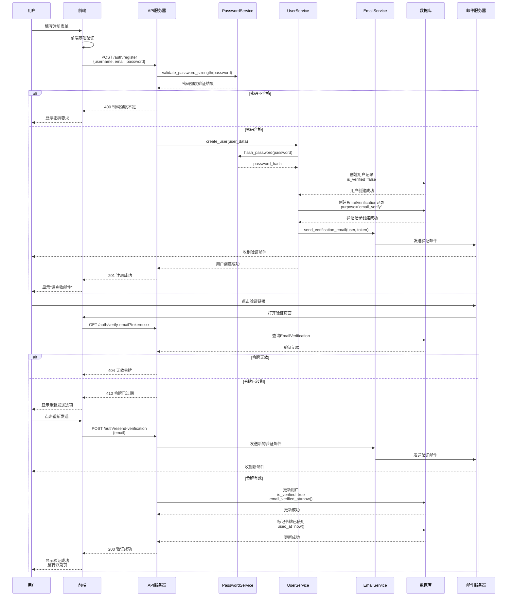
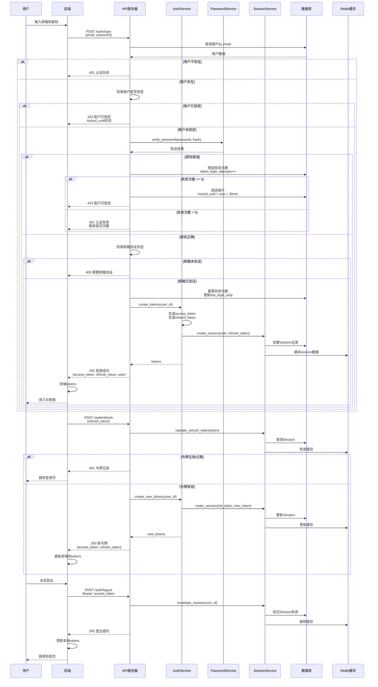
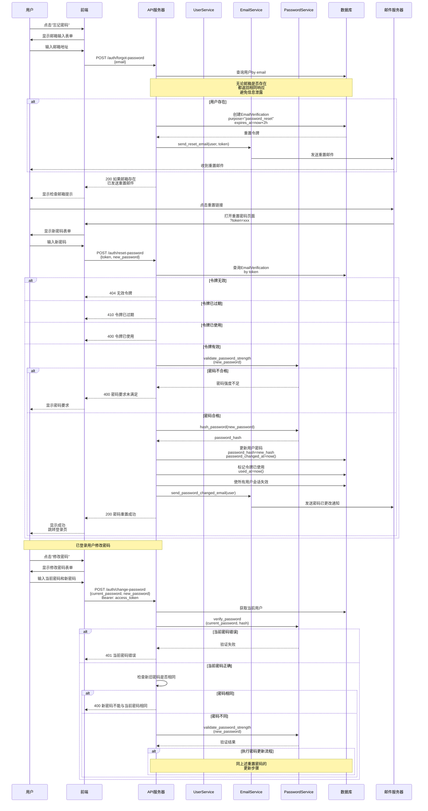
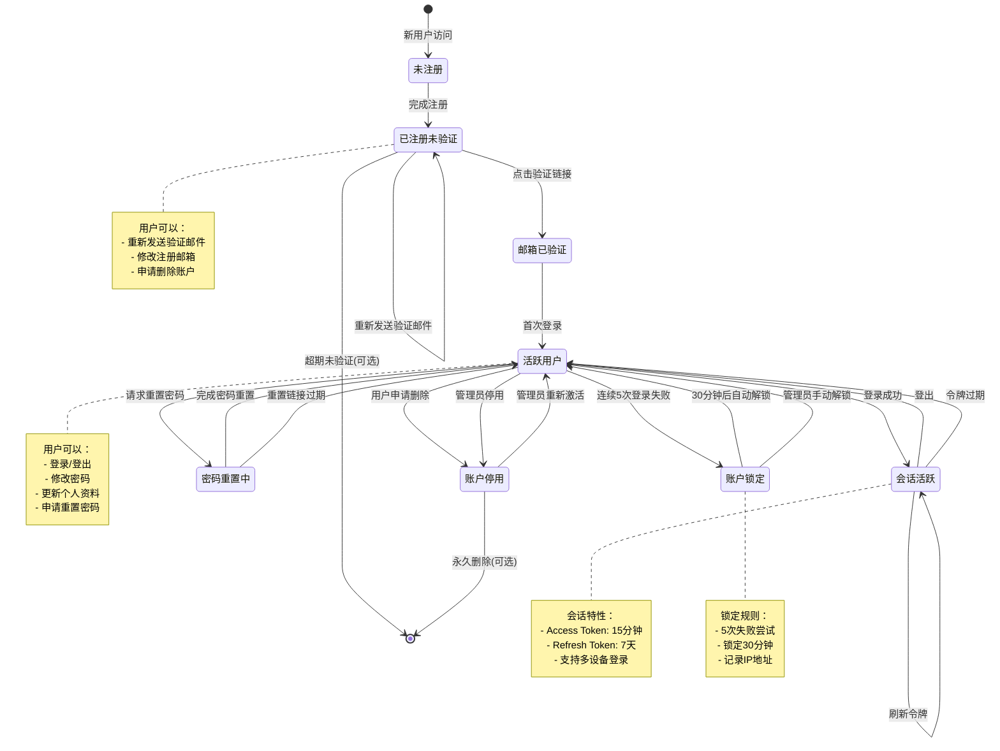
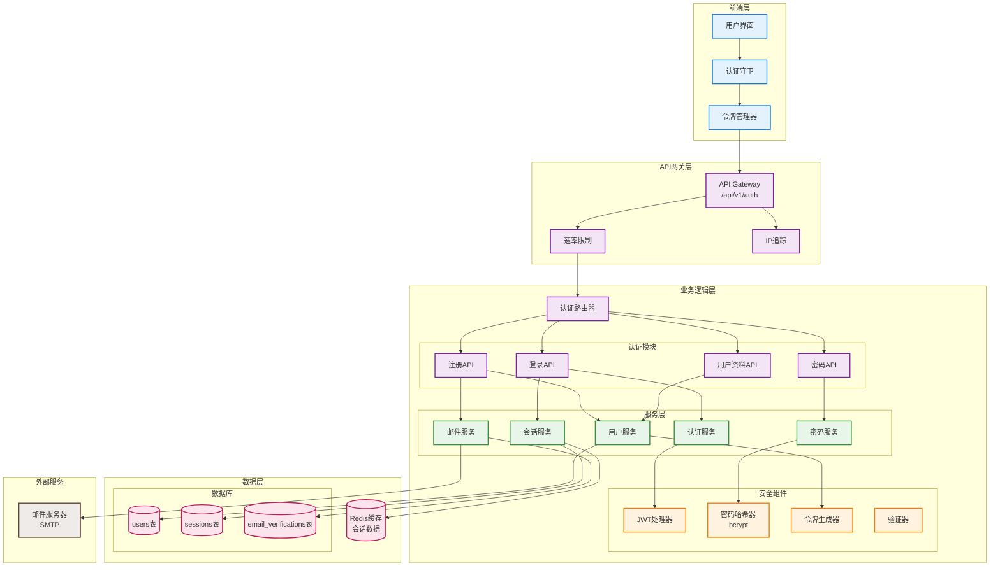

# 认证系统流程文档

本文档详细描述了 Infinite Scribe 认证系统的完整流程，包括用户注册、登录、密码管理等功能的设计和实现。

## 目录

1. [认证系统总体流程图](#1-认证系统总体流程图)
2. [用户注册与邮箱验证时序图](#2-用户注册与邮箱验证时序图)
3. [用户登录与会话管理时序图](#3-用户登录与会话管理时序图)
4. [密码重置流程时序图](#4-密码重置流程时序图)
5. [用户账户状态图](#5-用户账户状态图)
6. [认证系统组件架构图](#6-认证系统组件架构图)
7. [API 端点列表](#7-api-端点列表)
8. [安全特性说明](#8-安全特性说明)

## 1. 认证系统总体流程图

## 2. 用户注册与邮箱验证时序图

## 3. 用户登录与会话管理时序图

## 4. 密码重置流程时序图

## 5. 用户账户状态图

## 6. 认证系统组件架构图

## 7. API 端点列表

### 认证相关端点

| 端点 | 方法 | 功能 | 需要认证 | 状态 |
|------|------|------|----------|------|
| `/api/v1/auth/register` | POST | 用户注册 | ❌ | ✅ 已实现 |
| `/api/v1/auth/verify-email` | GET | 验证邮箱 | ❌ | ✅ 已实现 |
| `/api/v1/auth/resend-verification` | POST | 重发验证邮件 | ❌ | ✅ 已实现 |
| `/api/v1/auth/login` | POST | 用户登录 | ❌ | ✅ 已实现 |
| `/api/v1/auth/refresh` | POST | 刷新令牌 | ❌ | ✅ 已实现 |
| `/api/v1/auth/logout` | POST | 用户登出 | ✅ | ✅ 已实现 |
| `/api/v1/auth/forgot-password` | POST | 忘记密码 | ❌ | ⚠️ 部分实现 |
| `/api/v1/auth/reset-password` | POST | 重置密码 | ❌ | ❌ 待实现 |
| `/api/v1/auth/change-password` | POST | 修改密码 | ✅ | ❌ 待实现 |
| `/api/v1/auth/validate-password` | POST | 验证密码强度 | ❌ | ✅ 已实现 |
| `/api/v1/auth/me` | GET | 获取当前用户信息 | ✅ | ✅ 已实现 |
| `/api/v1/auth/me` | PUT | 更新用户资料 | ✅ | ❌ 待实现 |
| `/api/v1/auth/me` | DELETE | 删除账户 | ✅ | ❌ 待实现 |

## 8. 安全特性说明

### 密码安全
- **bcrypt 哈希**：自动生成随机盐值，每次哈希结果不同
- **密码强度验证**：
  - 最小长度要求（可配置，默认 8 字符）
  - 必须包含大写字母、小写字母和数字
  - 检测常见弱密码
  - 防止使用连续字符（如 123、abc）
  - 密码强度评分（0-5 分）

### 账户安全
- **账户锁定机制**：
  - 连续 5 次登录失败后锁定账户
  - 锁定时间 30 分钟
  - 记录失败尝试的 IP 地址
- **邮箱验证**：
  - 注册后必须验证邮箱才能登录
  - 验证令牌有效期 24 小时
  - 支持重新发送验证邮件

### 会话安全
- **JWT 双令牌机制**：
  - Access Token：短期令牌（15 分钟）
  - Refresh Token：长期令牌（7 天）
  - 支持令牌轮换（每次刷新生成新的 refresh token）
- **会话管理**：
  - 支持多设备同时登录
  - 记录登录 IP 和设备信息
  - 可以主动使会话失效

### 隐私保护
- **信息不泄露原则**：
  - 登录失败不区分"用户不存在"和"密码错误"
  - 忘记密码功能不透露邮箱是否注册
  - 所有敏感操作返回统一的成功响应

### 通信安全
- **HTTPS 强制**：生产环境必须使用 HTTPS
- **CORS 配置**：限制允许的来源域名
- **速率限制**：防止暴力破解和 DDoS 攻击

### 数据安全
- **敏感数据加密**：密码等敏感信息加密存储
- **SQL 注入防护**：使用 ORM 和参数化查询
- **XSS 防护**：输入验证和输出编码

## 更新历史

- 2024-01-10：初始版本，记录现有认证系统设计
- 待完成：实现剩余的 API 端点功能