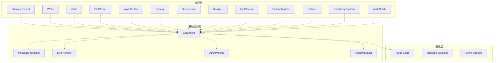
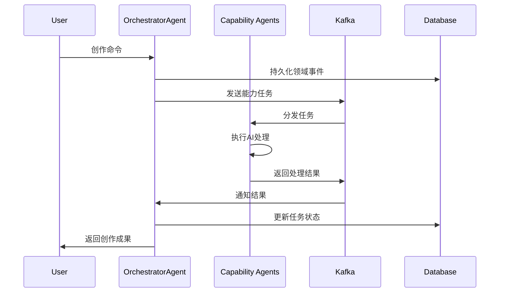
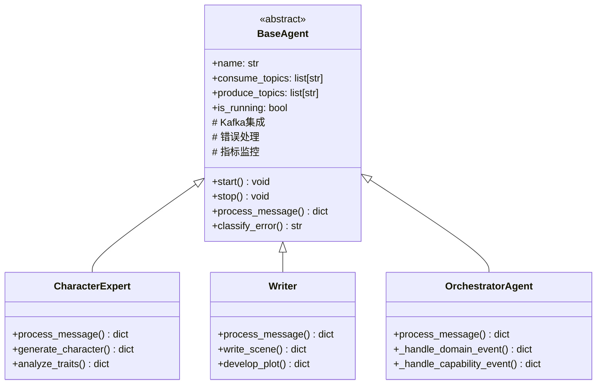
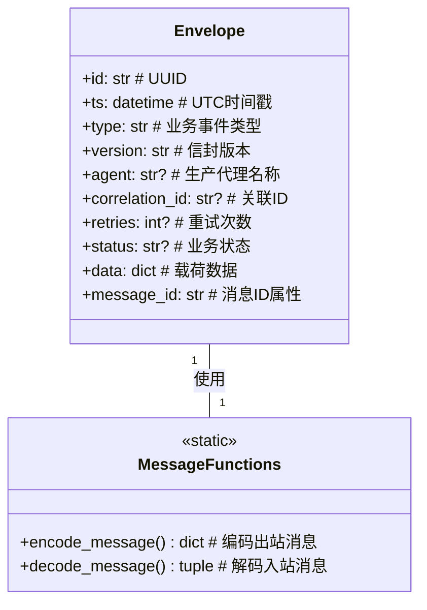
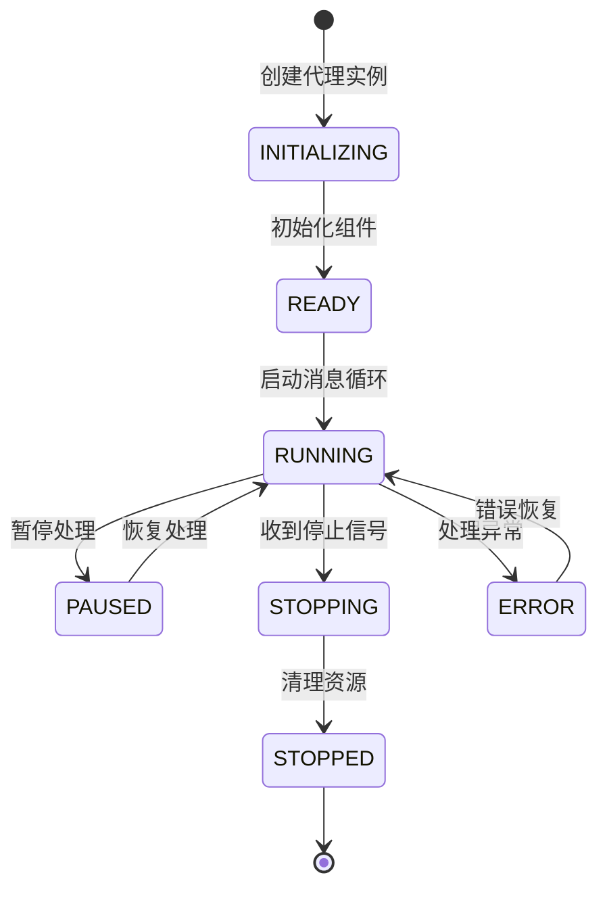
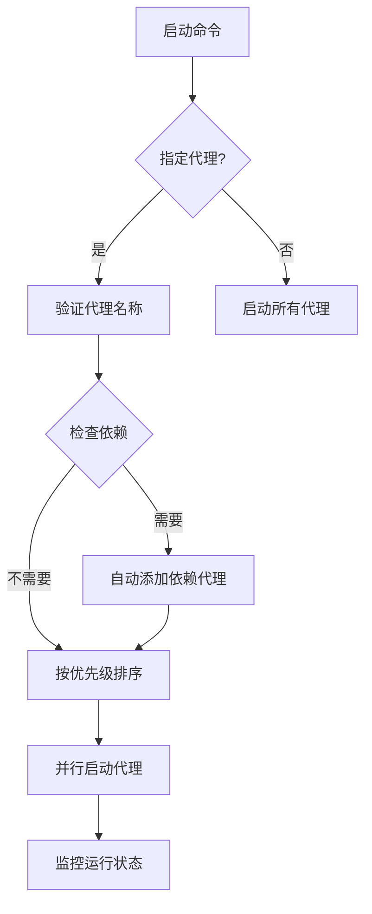
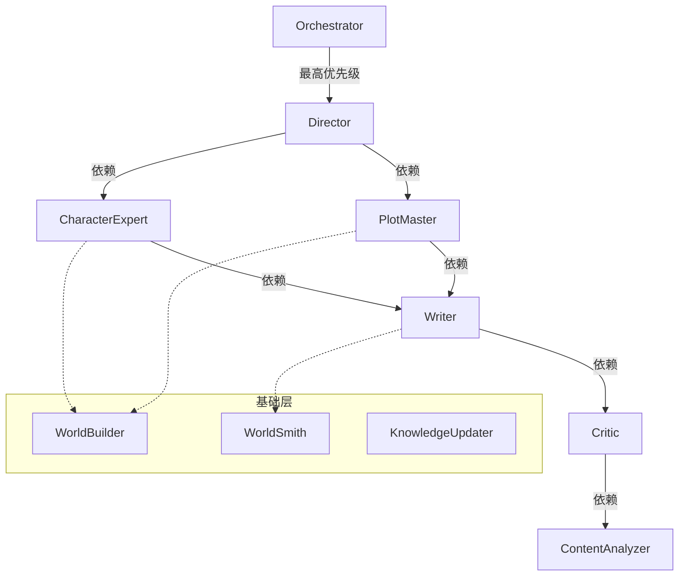
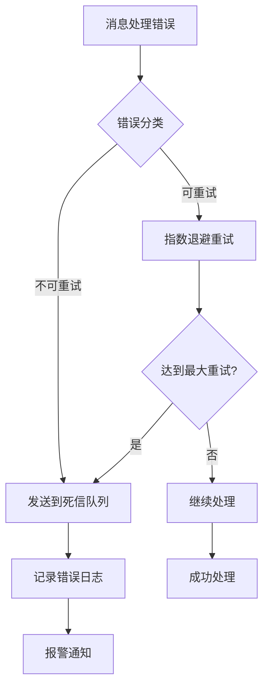
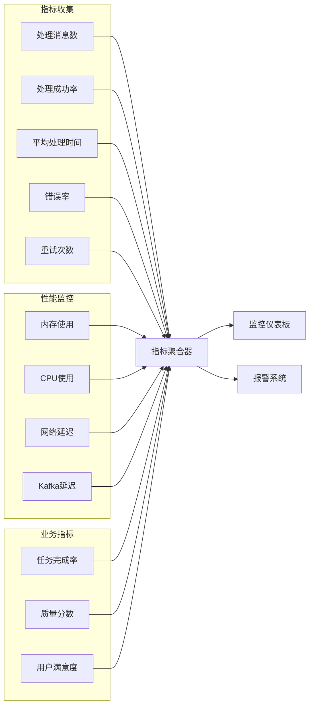
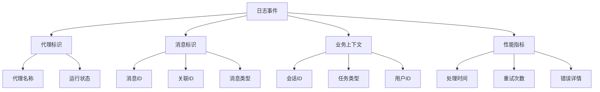

# 智能代理系统 (Agents System)

InfiniteScribe 的智能代理系统，基于事件驱动架构实现多个专业 AI 代理的协同工作，为小说创作提供端到端的智能化支持。

## 🏗️ 架构概览

### 系统架构



### 消息流转架构



## 📁 目录结构

```
agents/
├── __init__.py                # 代理注册和导出
├── main.py                    # 代理系统主入口
├── base.py                    # 代理基类
├── message.py                 # 消息封装模型 ✨
├── agent_config.py            # 代理配置管理
├── agent_metrics.py           # 代理监控指标
├── agent_template.py          # 代理模板
├── error_handler.py           # 错误处理器
├── errors.py                  # 错误定义
├── launcher.py                # 代理启动器
├── message_processor.py       # 消息处理器
├── metrics.py                 # 指标收集
├── offset_manager.py          # Kafka偏移管理
├── registry.py                # 代理注册表
├── orchestrator/              # 编排器代理 ✨
│   ├── __init__.py
│   ├── agent.py               # 主编排器 ✨
│   ├── command_strategies.py  # 命令处理策略
│   ├── event_handlers.py      # 事件处理器
│   ├── message_factory.py     # 消息工厂
│   └── README.md
├── characterexpert/           # 角色专家代理
├── content_analyzer/         # 内容分析代理
├── critic/                    # 评论家代理
├── director/                  # 导演代理
├── factchecker/               # 事实核查代理
├── knowledge_updater/        # 知识更新代理
├── outliner/                  # 大纲生成代理
├── plotmaster/                # 情节大师代理
├── rewriter/                  # 重写代理
├── worldbuilder/              # 世界构建代理
├── worldsmith/                # 世界锻造代理
└── writer/                    # 写作代理
```

## 🎯 核心组件

### BaseAgent 代理基类

所有专业代理的基类，提供统一的 Kafka 集成、错误处理和监控能力：



### Message 消息系统

统一的消息封装和处理系统，支持强类型、版本化和关联追踪：



### 代理生命周期管理



## 🔧 功能特性

### 1. 消息编码与解码

**encode_message** 函数将业务结果编码为标准信封格式：

```python
# 编码出站消息
envelope_dict = encode_message(
    agent="character_expert",
    result={"type": "Character.Generated", "character": {...}},
    correlation_id="req-123",
    retries=0
)

# 结果包含完整消息元数据
{
    "id": "uuid-generated",
    "ts": "2025-09-20T14:03:00Z",
    "type": "Character.Generated",
    "version": "v1",
    "agent": "character_expert",
    "correlation_id": "req-123",
    "retries": 0,
    "status": "ok",
    "data": {"character": {...}}
}
```

**decode_message** 函数将入站消息解码为载荷和元数据：

```python
# 解码入站消息
payload, meta = decode_message(incoming_message)

# 返回分离的业务数据和元数据
# payload: {"character": {...}, "session_id": "session-456"}
# meta: {"id": "msg-uuid", "type": "Character.Generated", ...}
```

### 2. 代理管理系统

#### 代理启动器


#### 代理优先级和依赖


### 3. 错误处理机制



### 4. 监控指标系统



## 🚀 使用指南

### 启动代理系统

```bash
# 启动所有代理
python -m src.agents.main

# 启动指定代理
python -m src.agents.main writer critic

# 列出所有可用代理
python -m src.agents.main --list

# 启动代理及其依赖
python -m src.agents.main --with-deps writer
```

### 自定义代理开发

```python
from src.agents.base import BaseAgent
from src.agents.message import encode_message, decode_message

class CustomAgent(BaseAgent):
    async def process_message(self, message: dict, context: dict = None) -> dict:
        """处理消息"""
        payload, meta = decode_message(message)
        
        # 执行业务逻辑
        result = await self.process_business_logic(payload)
        
        # 返回编码后的消息
        return encode_message(
            agent=self.name,
            result=result,
            correlation_id=meta.get("correlation_id"),
            retries=meta.get("retries", 0)
        )
    
    async def process_business_logic(self, payload: dict) -> dict:
        """自定义业务逻辑"""
        # 实现具体的AI处理逻辑
        return {
            "type": "Custom.Processed",
            "result": "处理完成",
            "data": payload
        }
```

### 消息处理示例

```python
# 发送角色生成请求
request = {
    "type": "Character.Generate.Requested",
    "session_id": "session-123",
    "character_type": "protagonist",
    "traits": ["brave", "intelligent"],
    "background": "medieval knight"
}

# 接收角色生成结果
response = {
    "id": "msg-uuid-456",
    "ts": "2025-09-20T14:03:00Z",
    "type": "Character.Generated",
    "version": "v1",
    "agent": "character_expert",
    "correlation_id": "req-123",
    "retries": 0,
    "status": "ok",
    "data": {
        "character": {
            "name": "Sir Arthur",
            "age": 35,
            "personality": "勇敢智慧的骑士",
            "backstory": "出身贵族，受过良好教育..."
        }
    }
}
```

## 🔧 配置管理

### 代理配置

```yaml
# agent_config.py
AGENT_PRIORITY:
  orchestrator: 1
  director: 2
  characterexpert: 3
  plotmaster: 4
  writer: 5
  critic: 6

AGENT_DEPENDENCIES:
  writer: ["characterexpert", "plotmaster"]
  critic: ["writer"]
  director: ["characterexpert", "plotmaster"]
  orchestrator: ["director"]
```

### Kafka 主题配置

```yaml
KAFKA_TOPICS:
  domain_events: "genesis.domain.events"
  capability_events: "genesis.capability.events"
  character_events: "genesis.character.events"
  plot_events: "genesis.plot.events"
  quality_events: "genesis.quality.events"
```

## 📊 监控和调试

### 关键监控指标

- **消息吞吐量**：每秒处理的消息数量
- **处理延迟**：消息从接收到处理的平均时间
- **错误率**：分类统计各类错误的发生频率
- **重试率**：消息重试的比例和分布
- **代理健康度**：各代理的运行状态和资源使用情况

### 日志结构



### 调试命令

```bash
# 查看代理状态
python -m src.agents.main --list

# 检查 Kafka 连接
python -c "from src.core.kafka.client import KafkaClientManager; print('Kafka OK')"

# 监控消息处理
tail -f logs/is-launcher_*.log | grep "process_message"
```

## 🔗 相关模块

- **事件系统**: `src.common.events` - 事件定义和映射
- **Kafka 客户端**: `src.core.kafka` - 消息队列集成
- **数据模型**: `src.models` - 业务数据模型
- **配置管理**: `src.core.config` - 系统配置
- **日志系统**: `src.core.logging` - 结构化日志

## 📝 最佳实践

### 1. 消息设计原则

- **强类型**: 使用 Pydantic 模型确保数据类型安全
- **版本化**: 通过 `version` 字段支持消息格式演进
- **关联追踪**: 使用 `correlation_id` 追踪请求链路
- **幂等性**: 设计可重试的消息处理逻辑

### 2. 代理开发规范

- **单一职责**: 每个代理专注于特定领域的AI能力
- **错误隔离**: 代理间的错误不应影响其他代理
- **状态管理**: 避免代理内部状态，优先使用数据库
- **监控集成**: 所有代理都应上报标准化的监控指标

### 3. 性能优化

- **批量处理**: 合并多个消息批量处理以提高效率
- **异步处理**: 使用 async/await 避免阻塞
- **资源管理**: 合理使用数据库连接和内存
- **超时控制**: 为外部调用设置合理的超时时间

## 🔍 故障排查

### 常见问题

1. **代理启动失败**
   - 检查 Kafka 连接状态
   - 验证代理配置格式
   - 确认依赖服务可用性

2. **消息处理延迟**
   - 检查代理负载情况
   - 分析数据库查询性能
   - 监控网络延迟

3. **消息丢失**
   - 验证 Kafka 配置
   - 检查偏移量管理
   - 确认错误处理逻辑

### 调试工具

```bash
# 查看代理日志
grep "agent_name" logs/is-launcher_*.log

# 监控Kafka消息
kafka-console-consumer --topic genesis.domain.events --from-beginning

# 检查数据库状态
psql -h localhost -U postgres -d infinite_scribe
```

## 📚 扩展指南

### 添加新代理

1. 继承 `BaseAgent` 类
2. 实现 `process_message` 方法
3. 在 `agent_config.py` 中注册
4. 添加相应的 Kafka 主题配置
5. 编写单元测试和集成测试

### 添加新的消息类型

1. 在 `message.py` 中定义新的消息结构
2. 更新事件映射配置
3. 在相关代理中实现处理逻辑
4. 添加消息验证和测试用例

### 性能调优

1. 调整批处理大小和频率
2. 优化数据库查询和索引
3. 配置合适的重试策略
4. 监控资源使用情况

---

*此文档描述了 InfiniteScribe 智能代理系统的核心架构和使用方法。系统采用事件驱动架构，通过多个专业AI代理的协同工作，为小说创作提供端到端的智能化支持。*