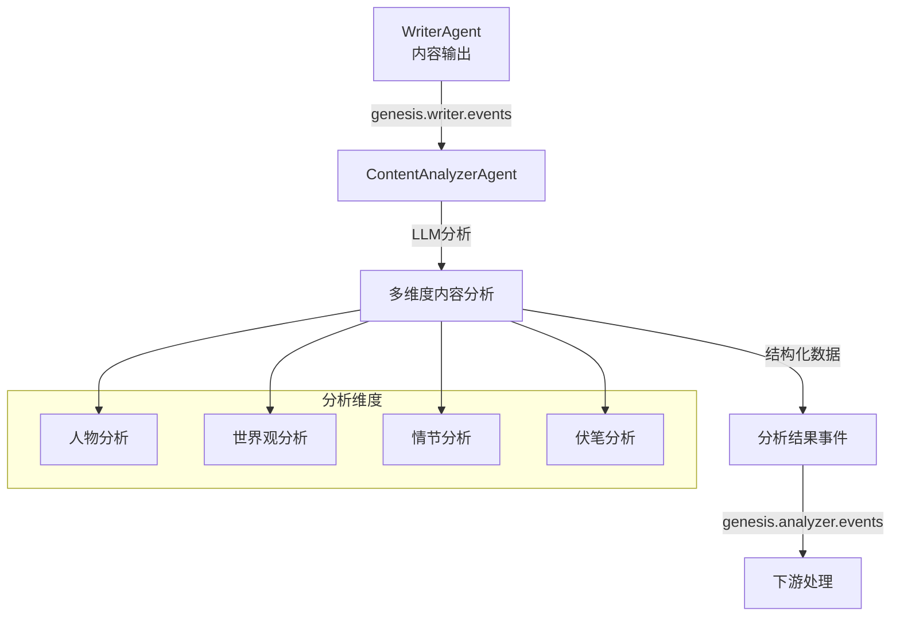
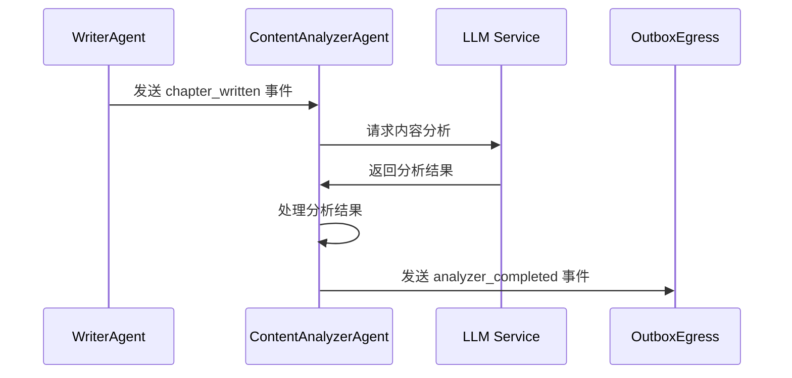

# Content Analyzer Agent

## 概述

Content Analyzer Agent 是一个基于 LLM 的智能内容分析代理，负责对生成的小说内容进行结构化分析与信息抽取。

## 核心功能

### 主要职责

- **内容消费**：消费 WriterAgent 输出的内容事件（`genesis.writer.events`）
- **多维度分析**：通过 LLM 对章节/场景内容进行深度分析，包括：
  - 人物角色分析
  - 世界观设定分析
  - 情节发展分析
  - 伏笔线索分析
- **结果产出**：生成标准化的分析结果事件到 `genesis.analyzer.events`

### 技术架构



### 依赖关系

- **外部依赖**：
  - `external.clients.llm`: LLM 客户端服务
  - `src.services.llm`: LLM 服务工厂
  - `src.services.outbox.egress`: 事件输出管理

- **内部依赖**：
  - `src.agents.base`: 基础代理类
  - `src.agents.agent_config`: 代理配置管理

### 事件处理流程



## 配置说明

### 主题配置

代理通过 `get_agent_topics("content_analyzer")` 自动获取消费和生产主题：

- **消费主题**：`genesis.writer.events`
- **生产主题**：`genesis.analyzer.events`

### LLM 服务配置

支持通过依赖注入或工厂模式创建 LLM 服务：

```python
# 通过依赖注入
llm_service = LLMServiceFactory().create_service()
agent = ContentAnalyzerAgent(llm_service=llm_service)

# 使用默认配置
agent = ContentAnalyzerAgent()
```

## 开发指南

### 扩展分析维度

1. 在 `_analyze_chapter` 方法中添加新的分析逻辑
2. 定义对应的分析结果数据结构
3. 更新事件输出格式

### 自定义 LLM 提示

通过修改 `_build_analysis_prompt` 方法调整分析提示词，以获得更好的分析结果。

### 性能优化

- 考虑批量处理多个章节内容
- 实现分析结果缓存机制
- 优化 LLM 调用频率

## 监控与调试

### 关键指标

- **处理延迟**：从接收到完成分析的时间
- **分析准确率**：分析结果的质量评估
- **错误率**：LLM 调用失败率

### 日志记录

- 记录输入内容的摘要信息
- 跟踪 LLM 调用状态和结果
- 记录分析结果的关键指标

---

*该代理是 InfiniteScribe 内容生态系统的核心组件，为后续的内容优化和质量控制提供数据支持。*