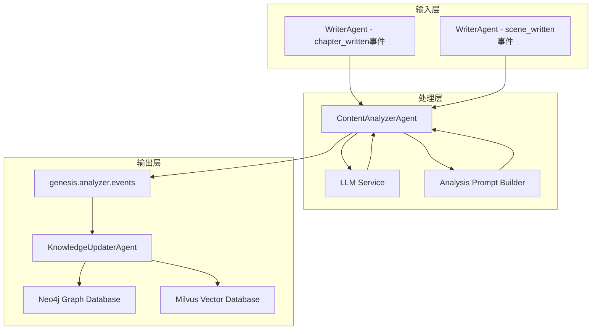
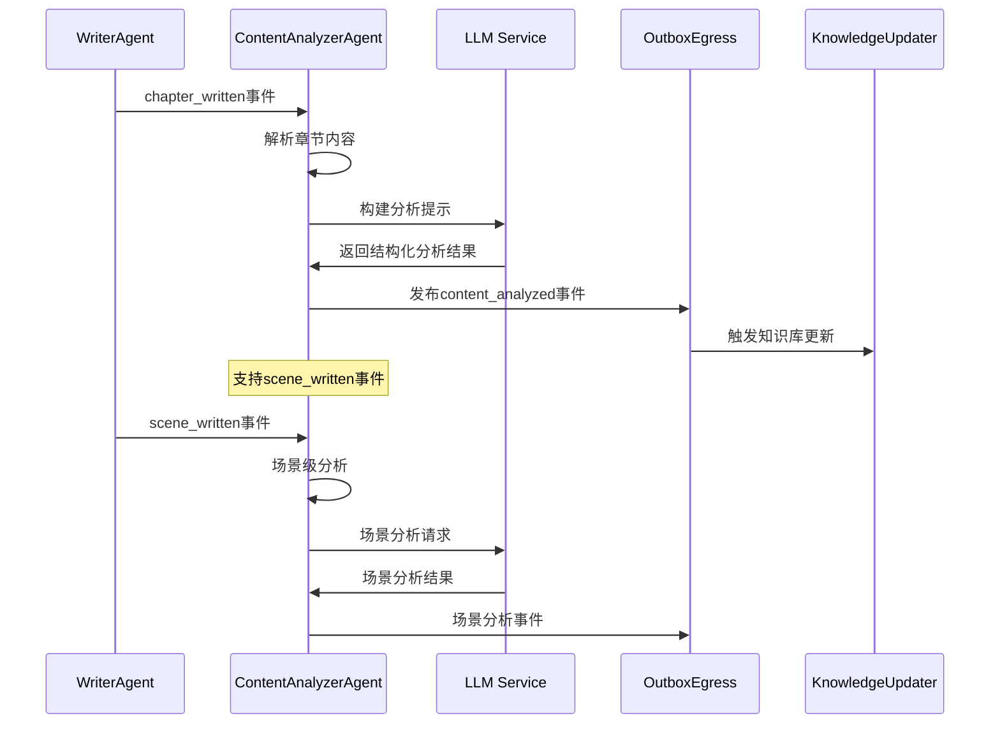
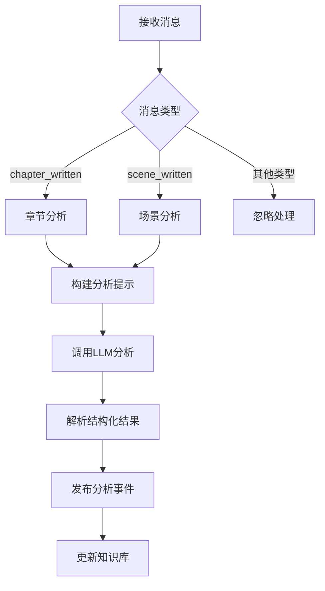
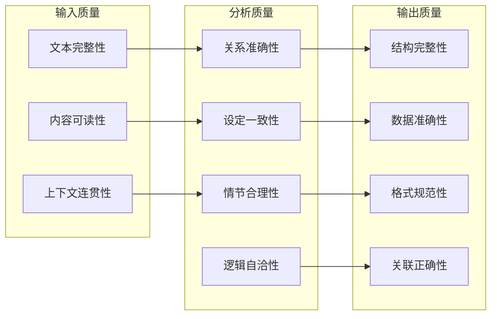
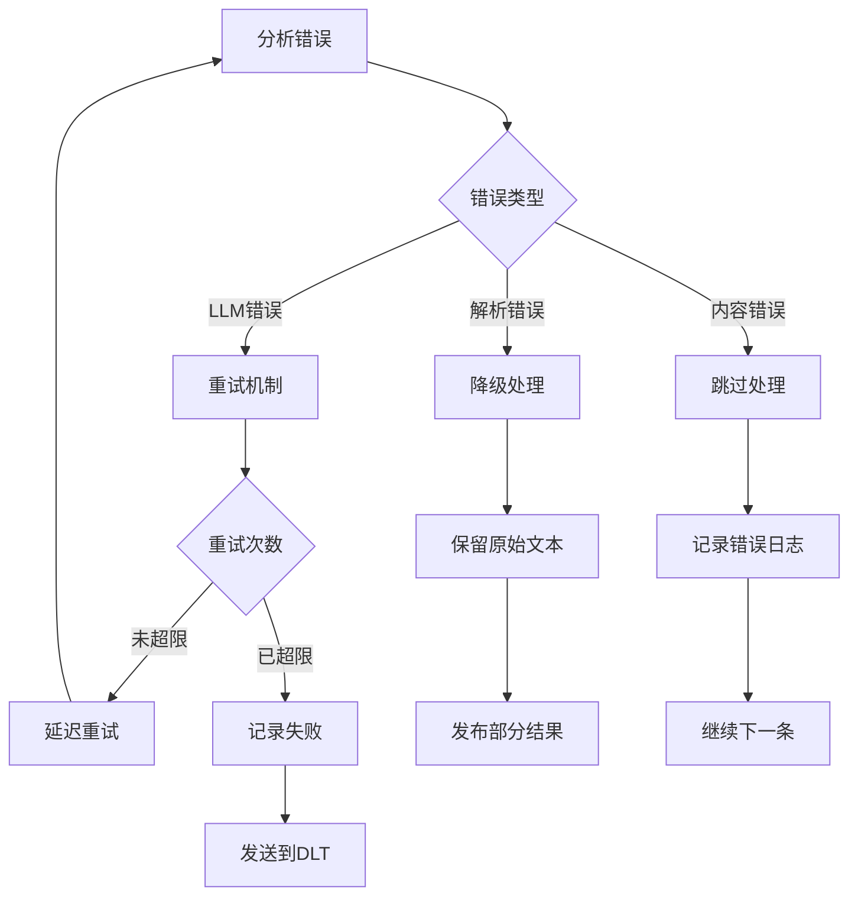

# 内容分析代理 (Content Analyzer Agent)

基于 LLM 驱动的内容分析智能体，负责对小说内容进行深度分析和结构化信息抽取。

## 🎯 核心功能

ContentAnalyzerAgent 是 InfiniteScribe 系统中的核心分析组件，专门处理 WriterAgent 输出的内容事件，通过 LLM 对章节和场景内容进行多维度智能分析。

### 分析维度

- **人物关系分析** (`character_relationships`): 分析角色间的关系网络和强度
- **世界观构建** (`world_building`): 提取世界观规则和设定
- **情节发展** (`plot_developments`): 识别关键情节转折点
- **伏笔设置** (`foreshadowing`): 检测前后呼应的伏笔线索
- **场景细节** (`location_details`): 地理位置和空间关系分析
- **时间线事件** (`timeline_events`): 故事时间序列梳理
- **角色发展** (`character_development`): 角色成长轨迹分析
- **冲突张力** (`conflicts_tensions`): 故事冲突和张力点识别

## 🏗️ 架构设计

### 系统架构图



### 消息处理流程



## 📁 目录结构

```
content_analyzer/
├── __init__.py           # 模块初始化
├── agent.py             # 主代理实现
└── README.md            # 本文档
```

## 🔧 核心实现

### ContentAnalyzerAgent 类

```python
class ContentAnalyzerAgent(BaseAgent):
    """内容分析 Agent（LLM 驱动）。"""
    
    def __init__(
        self,
        name: str | None = None,
        consume_topics: list[str] | None = None,
        produce_topics: list[str] | None = None,
        *,
        llm_service: LLMService | None = None,
        egress: OutboxEgress | None = None,
    ) -> None
```

### 消息处理机制



## 📊 分析结果结构

### JSON Schema 示例

```json
{
  "character_relationships": [
    {
      "from_character": "主角",
      "to_character": "导师", 
      "relationship_type": "师生",
      "strength": 8
    }
  ],
  "world_building": [
    {
      "rule_id": "magic_system_001",
      "dimension": "魔法体系",
      "description": "元素魔法需要咒语和手势配合"
    }
  ],
  "location_details": [
    {
      "location_id": "academy_main_hall",
      "name": "学院大厅",
      "x": 100,
      "y": 200
    }
  ],
  "timeline_events": [
    {
      "ts": "第1章",
      "summary": "主角初入魔法学院"
    }
  ],
  "foreshadowing": [
    {
      "id": "prophecy_001",
      "hint": "古老的预言提及特殊血脉",
      "payoff_window": "第5-10章"
    }
  ],
  "character_development": [
    {
      "character": "主角",
      "arc": "从懵懂到觉醒",
      "stage": "初期成长"
    }
  ],
  "plot_developments": [
    {
      "summary": "发现隐藏的魔法天赋",
      "impact": "推动主线发展"
    }
  ],
  "conflicts_tensions": [
    {
      "parties": ["主角", "学院守则"],
      "type": "规则冲突",
      "level": 7
    }
  ]
}
```

## 🚀 使用示例

### 章节分析

```python
# 输入消息示例
chapter_message = {
    "type": "chapter_written",
    "chapter_id": "chapter_001",
    "content": "这是一个关于魔法学院的故事章节...",
    "word_count": 2500
}

# 处理结果
result = await content_analyzer.process_message(chapter_message)

# 输出事件
analysis_event = {
    "type": "content_analyzed",
    "scope": "chapter", 
    "chapter_id": "chapter_001",
    "analysis": {
        "character_relationships": [...],
        "world_building": [...],
        # ... 其他分析维度
    }
}
```

### 场景分析

```python
# 输入消息示例
scene_message = {
    "type": "scene_written",
    "scene_id": "scene_001",
    "content": "主角在图书馆发现古老书籍的具体场景...",
    "scene_context": {
        "location": "学院图书馆",
        "characters": ["主角", "图书管理员"]
    }
}
```

## ⚙️ 配置说明

### 主题配置

代理通过 `get_agent_topics("content_analyzer")` 自动获取消费和生产主题：

- **消费主题**：`genesis.writer.events`
- **生产主题**：`genesis.analyzer.events`

### LLM 服务配置

支持通过依赖注入或工厂模式创建 LLM 服务：

```python
# 通过依赖注入
llm_service = LLMServiceFactory().create_service()
agent = ContentAnalyzerAgent(llm_service=llm_service)

# 使用默认配置
agent = ContentAnalyzerAgent()
```

### LLM 配置

```python
# 默认模型配置
DEFAULT_MODEL = "gpt-4o-mini"

# 分析提示词模板
SYSTEM_PROMPT = (
    "You are a senior story analyst. "
    "Extract key structured facts in strict JSON. "
    "Use concise fields and stable identifiers when possible."
)
```

## 🔍 监控与调试

### 关键指标

- **处理延迟**：从接收到完成分析的时间
- **分析准确率**：分析结果的质量评估
- **错误率**：LLM 调用失败率
- **分析维度覆盖**：各个分析维度的提取完整性
- **知识库更新频率**：触发知识库更新的频率

### 日志记录

- 记录输入内容的摘要信息
- 跟踪 LLM 调用状态和结果
- 记录分析结果的关键指标

### 质量指标



## 🐛 错误处理

### 常见错误场景

1. **LLM服务不可用**
   - 降级策略：返回空分析结果
   - 重试机制：指数退避重试
   - 监控告警：LLM服务状态监控

2. **JSON解析失败**
   - 容错处理：使用raw字段保存原始结果
   - 日志记录：详细的解析错误日志
   - 数据恢复：手动解析关键信息

3. **内容质量问题**
   - 内容验证：最小文本长度检查
   - 编码处理：UTF-8编码问题修复
   - 格式清理：去除特殊字符

### 错误恢复策略



## 🔗 依赖关系

### 上游依赖

- **WriterAgent**: 提供需要分析的内容（章节/场景）
- **LLM Service**: 提供智能分析能力
- **Kafka**: 消息队列基础设施

### 下游消费

- **KnowledgeUpdaterAgent**: 消费分析结果更新知识库
- **Neo4j**: 存储人物关系和世界观图谱
- **Milvus**: 存储内容的向量表示

### 模块依赖

```python
from src.agents.base import BaseAgent
from src.agents.agent_config import get_agent_topics
from src.services.llm import LLMService, LLMServiceFactory
from src.services.outbox.egress import OutboxEgress
from src.external.clients.llm import ChatMessage, LLMRequest
```

## 📈 性能优化

### 批处理优化

- **批量分析**: 支持多个场景批量分析
- **并发处理**: 异步处理多个分析请求
- **缓存策略**: 相似内容分析结果缓存

### LLM调用优化

- **提示词优化**: 精简有效的提示词设计
- **模型选择**: 根据分析复杂度选择合适模型
- **Token管理**: 控制输入输出Token数量

## 🧪 测试策略

### 单元测试

```python
async def test_analyze_chapter():
    """测试章节分析功能"""
    agent = ContentAnalyzerAgent()
    message = {
        "type": "chapter_written",
        "chapter_id": "test_001", 
        "content": "测试章节内容..."
    }
    
    result = await agent.process_message(message)
    assert result is None  # 通过Outbox发布
    # 验证Outbox中是否有正确的分析事件
```

### 集成测试

- **端到端测试**: 从WriterAgent到KnowledgeUpdater的完整流程
- **LLM集成测试**: 验证LLM服务调用的正确性
- **错误注入测试**: 模拟各种错误场景

## 📝 开发指南

### 扩展分析维度

1. 在 `_analyze_chapter` 方法中添加新的分析逻辑
2. 定义对应的分析结果数据结构
3. 更新事件输出格式
4. 更新测试用例和文档

### 自定义 LLM 提示

通过修改 `_build_analysis_prompt` 方法调整分析提示词，以获得更好的分析结果。

### 性能优化

- 考虑批量处理多个章节内容
- 实现分析结果缓存机制
- 优化 LLM 调用频率

---

*ContentAnalyzerAgent 是 InfiniteScribe 内容分析管道的核心组件，通过 LLM 驱动的智能分析，将原始文本内容转化为结构化的知识图谱数据，为下游的智能创作提供坚实的数据基础。*