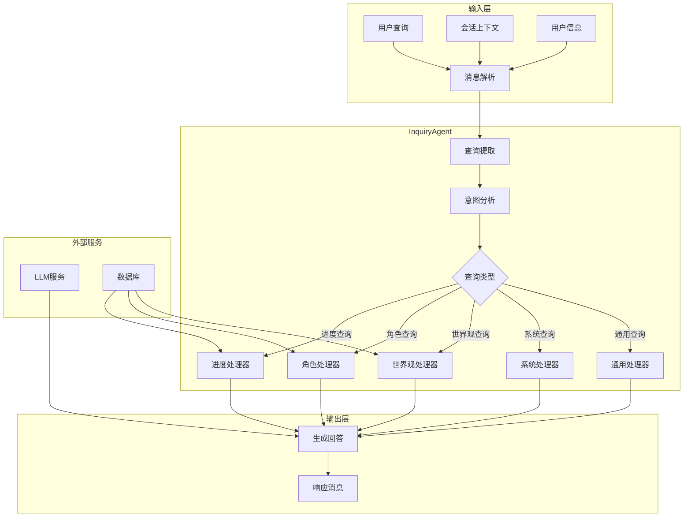
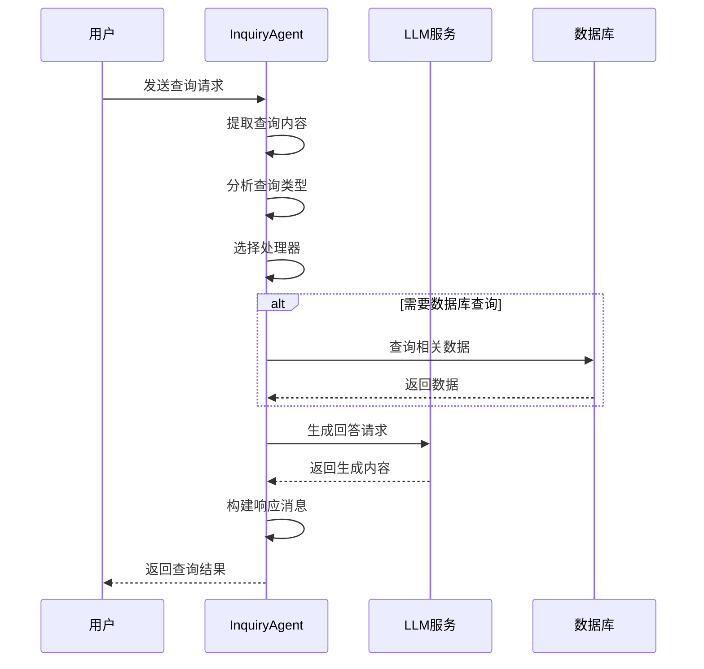
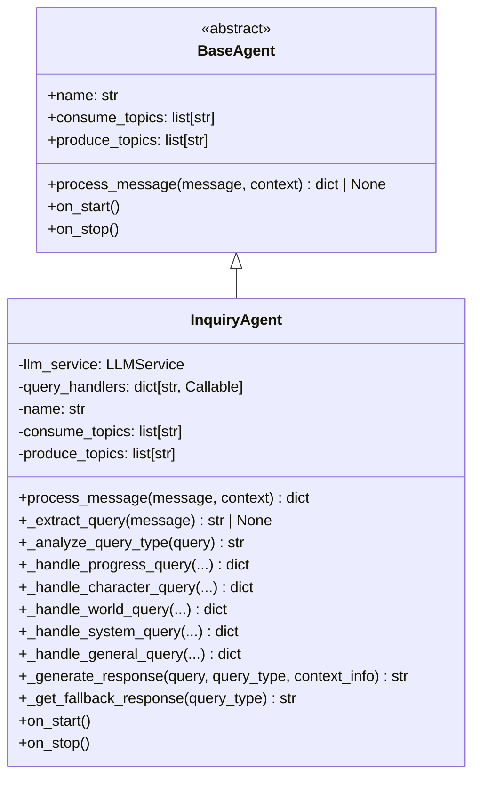

# Inquiry Agent - 智能询问代理

## 🎯 概述

Inquiry Agent 是 InfiniteScribe 平台中的智能询问处理代理，专门负责处理用户的各类查询请求。该代理能够理解并回答关于小说创作进度、角色信息、世界观设定以及系统功能等方面的问题。

## 🏗️ 架构设计

### 核心职责

- **查询处理**: 处理用户的各类查询请求
- **意图识别**: 自动识别查询类型并路由到相应的处理器
- **智能回答**: 基于LLM生成准确、有用的回答
- **上下文管理**: 维护会话上下文，提供连贯的对话体验

### 架构图



## 📁 目录结构

```
inquiry/
├── __init__.py           # 代理模块导出
└── agent.py             # InquiryAgent 主实现
```

## 🚀 核心功能

### 1. 查询类型识别

代理能够自动识别以下类型的查询：

```mermaid
stateDiagram-v2
    [*] --> 接收查询
    接收查询 --> 关键词分析
    关键词分析 --> {查询类型判断}
    
    {查询类型判断} --> 进度查询: progress/status
    {查询类型判断} --> 角色查询: character/protagonist/hero
    {查询类型判断} --> 世界观查询: world/setting/universe
    {查询类型判断} --> 系统查询: system/function/how/work
    {查询类型判断} --> 通用查询: 其他
    
    进度查询 --> 生成回答
    角色查询 --> 生成回答
    世界观查询 --> 生成回答
    系统查询 --> 生成回答
    通用查询 --> 生成回答
    
    生成回答 --> [*]
```

### 2. 专业化查询处理器

#### 进度查询处理器
- **功能**: 查询小说创作进度和状态
- **数据来源**: 创作进度数据库
- **返回信息**: 当前阶段、完成度、章节数量、角色数量等

#### 角色查询处理器
- **功能**: 查询角色信息和设定
- **数据来源**: 角色知识库
- **返回信息**: 角色详情、关系网络、发展轨迹等

#### 世界观查询处理器
- **功能**: 查询世界观设定和背景信息
- **数据来源**: 世界观知识库
- **返回信息**: 地理信息、历史背景、规则体系等

#### 系统查询处理器
- **功能**: 查询系统功能和使用方法
- **数据来源**: 系统配置和文档
- **返回信息**: 功能介绍、使用指南、最佳实践等

#### 通用查询处理器
- **功能**: 处理其他类型的查询
- **数据来源**: 通用知识库和LLM
- **返回信息**: 基于查询内容的智能回答

### 3. 消息处理流程



## 📊 消息格式

### 输入消息格式

```json
{
    "type": "inquiry.query",
    "query": "用户查询内容",
    "session_id": "会话标识",
    "context": {
        "user_id": "用户ID",
        "novel_id": "小说ID"
    }
}
```

### 输出消息格式

```json
{
    "type": "Inquiry.Response",
    "status": "success",
    "agent": "inquiry",
    "query_type": "progress|character|world|system|general",
    "query": "原始查询内容",
    "response": "生成的回答内容",
    "session_id": "会话标识",
    "metadata": {
        "user_id": "用户ID",
        "novel_id": "小说ID",
        "timestamp": "2024-01-01T00:00:00Z"
    }
}
```

## 🔧 技术实现

### 核心类设计



### 关键技术特性

1. **关键词匹配算法**: 使用简单高效的关键词匹配进行查询类型识别
2. **上下文感知**: 结合会话ID和用户信息提供个性化回答
3. **容错机制**: 提供fallback响应，确保系统稳定性
4. **异步处理**: 支持高并发的查询请求处理
5. **可扩展性**: 易于添加新的查询类型和处理器

## 🎯 使用示例

### 基本查询处理

```python
# 初始化代理
agent = InquiryAgent()

# 处理进度查询
message = {
    "query": "当前小说创作进度如何？",
    "session_id": "session-123",
    "context": {
        "user_id": "user-456",
        "novel_id": "novel-789"
    }
}

response = await agent.process_message(message)
print(response["response"])  # 输出: 当前创作处于角色设计阶段，完成度30%...
```

### 查询类型路由

```python
# 自动识别查询类型
query_type = await agent._analyze_query_type("主角的性格特点是什么？")
# 返回: "character"

# 路由到对应处理器
handler = agent.query_handlers[query_type]
result = await handler(
    query="主角的性格特点是什么？",
    session_id="session-123",
    user_id="user-456", 
    novel_id="novel-789",
    context={}
)
```

## 🔍 监控和日志

### 关键日志事件

- `inquiry_message_received`: 接收到查询消息
- `inquiry_query_extracted`: 查询内容提取完成
- `inquiry_query_type_analyzed`: 查询类型分析完成
- `inquiry_handler_selected`: 处理器选择完成
- `inquiry_response_generated`: 回答生成完成
- `inquiry_message_processed`: 消息处理完成

### 性能指标

- **查询处理延迟**: 从接收请求到生成回答的时间
- **查询类型分布**: 各类查询的比例统计
- **LLM调用成功率**: LLM服务的成功率统计
- **用户满意度**: 基于用户反馈的满意度指标

## 🚀 配置说明

### 主题配置

```yaml
# 消费主题
consume_topics:
  - "inquiry"           # 通用查询主题
  - "inquiry.query"     # 特定查询主题

# 生产主题  
produce_topics:
  - "inquiry.response"  # 查询响应主题
```

### LLM配置

```python
# LLM服务配置
llm_config = {
    "model": "gpt-3.5-turbo",
    "temperature": 0.7,
    "max_tokens": 500,
    "timeout": 30
}
```

## 🔮 未来规划

### 功能增强

1. **智能推荐**: 基于查询历史主动推荐相关内容
2. **多轮对话**: 支持上下文相关的多轮对话
3. **个性化**: 基于用户偏好的个性化回答
4. **多语言**: 支持多语言查询和回答

### 性能优化

1. **缓存机制**: 缓存常见问题的回答
2. **批处理**: 支持批量查询处理
3. **负载均衡**: 支持多实例部署和负载均衡
4. **模型优化**: 优化LLM调用策略

### 集成扩展

1. **知识图谱**: 集成结构化知识图谱
2. **搜索引擎**: 集成外部搜索引擎
3. **专家系统**: 集成领域专家系统
4. **多媒体**: 支持图像、音频等多媒体查询

## 📝 注意事项

1. **数据安全**: 查询日志和用户数据需要妥善保护
2. **内容质量**: 定期审查和优化回答质量
3. **性能监控**: 持续监控系统性能和用户体验
4. **版本管理**: 支持模型和配置的版本管理
5. **容灾备份**: 确保服务的高可用性

## 🔗 相关模块

- **基础代理**: `src.agents.base` - 代理基类
- **LLM服务**: `src.services.llm` - 语言模型服务
- **消息处理**: `src.common.messaging` - 消息处理框架
- **数据库**: `src.db` - 数据访问层

这个 Inquiry Agent 为 InfiniteScribe 平台提供了强大的智能问答能力，帮助用户快速获取所需信息，提升创作体验。