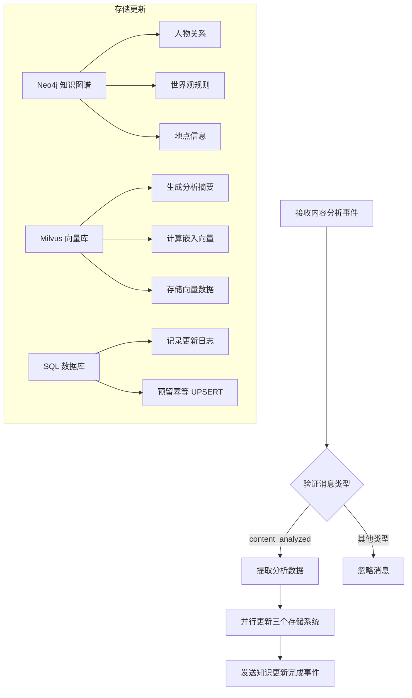

# 知识更新代理 (Knowledge Updater Agent)

负责将内容分析结果同步更新到多个持久化存储的智能代理，采用事件驱动架构和异步并发处理确保高效的知识库更新。

## 🎯 核心功能

KnowledgeUpdateAgent 是 InfiniteScribe 系统中的知识持久化组件，专门将 ContentAnalyzerAgent 输出的分析结果同步到多个存储系统，构建完整的知识图谱。

### 核心职责

- **知识图谱更新**：将人物关系、世界观规则、地点信息同步到 Neo4j 图数据库
- **向量存储更新**：生成分析摘要的嵌入向量并存储到 Milvus 向量数据库
- **关系数据库更新**：预留 SQL 数据库更新接口（占位实现）
- **容错处理**：采用尽力而为（best-effort）策略，单个存储失败不影响其他操作
- **异步并发**：多个存储系统并行更新，提高处理效率

## 📁 目录结构

```
knowledge_updater/
├── __init__.py          # 模块初始化
└── agent.py            # KnowledgeUpdateAgent 主实现
```

## 🔄 工作流程



## 🗃️ 支持的数据类型

### 知识图谱（Neo4j）
- **人物关系**：角色间的关系类型和强度
- **世界观规则**：小说世界的设定和规则
- **地点信息**：场景位置及其坐标

### 向量存储（Milvus）
- **分析摘要**：结构化分析的文本表示
- **元数据**：来源类型和内容分类

### 关系数据库（预留）
- **幂等操作**：确保重复更新不会产生副作用
- **结构化存储**：关键事实的持久化

## 🔧 技术特性

### 异步并发处理
```python
await asyncio.gather(
    self._update_knowledge_graph(novel_id, chapter_id, analysis),
    self._update_vector_store(novel_id, chapter_id, analysis),
    self._update_sql_database(novel_id, chapter_id, analysis),
)
```

### 容错机制
- 单个存储系统失败不影响其他系统
- 记录详细的错误日志用于调试
- 采用警告级别记录失败，不中断主流程

### 事件驱动架构
- 监听 `content_analyzed` 事件
- 发送 `knowledge_updated` 事件
- 支持关联 ID 追踪

## 📡 消息处理

### 输入消息格式
```json
{
  "type": "content_analyzed",
  "analysis": {
    "novel_id": "string",
    "character_relationships": [...],
    "world_building": [...],
    "location_details": [...],
    "plot_developments": [...]
  },
  "chapter_id": "string|number",
  "novel_id": "string"
}
```

### 输出事件格式
```json
{
  "type": "knowledge_updated",
  "chapter_id": "string",
  "novel_id": "string",
  "update_timestamp": "ISO 8601 timestamp"
}
```

## 🚀 部署配置

### 依赖服务
- **Neo4j**: 知识图谱存储
- **Milvus**: 向量数据库
- **PostgreSQL**: 关系型数据库（预留）
- **嵌入服务**: 文本向量化服务

### 主题配置
- **消费主题**: 通过 `get_agent_topics("knowledge_updater")` 动态获取
- **生产主题**: `genesis.knowledge.events`

## 🛠️ 开发指南

### 扩展存储支持
1. 在 `_update_*` 方法系列中添加新的存储更新逻辑
2. 在 `asyncio.gather` 中添加对应的异步调用
3. 实现适当的错误处理和日志记录

### 调试建议
- 观察各个存储更新的警告日志
- 检查事件关联 ID 的传递链路
- 验证数据在各存储系统的一致性

## 🔍 监控指标

### 业务指标
- 知识更新成功率
- 各存储系统响应时间
- 分析数据覆盖率

### 技术指标
- 异步任务执行时间
- 错误率和重试次数
- 事件处理吞吐量