# 领域代理编排器 (Orchestrator Agent)

负责协调和管理领域事件与能力任务之间的流转，是整个事件驱动架构的核心协调组件。

## 🏗️ 架构概览

### 核心职责

- **事件处理**：消费领域总线和能力事件
- **命令映射**：将触发类领域事件投影为领域事实
- **任务分发**：向对应的能力主题发送能力任务
- **结果投影**：将能力结果投影为领域事实

### 架构图

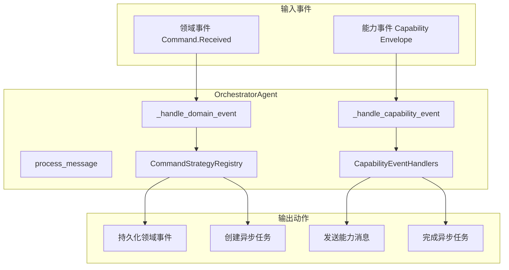

## 📁 目录结构

```
orchestrator/
├── __init__.py                # 代理注册和导出
├── agent.py                   # 主编排代理类
├── capability_event_processor.py  # 能力事件处理模块
├── command_strategies.py      # 命令处理策略
├── domain_event_processor.py     # 领域事件处理模块
├── event_handlers.py          # 能力事件处理器
├── message_factory.py         # 消息工厂
├── outbox_manager.py         # Outbox管理模块
└── task_manager.py           # 任务管理模块
```

## 🎯 核心组件

### 🏗️ 模块化架构设计

编排器采用了清晰的模块化设计，将复杂的事件处理逻辑分解为专门的处理器和管理器：

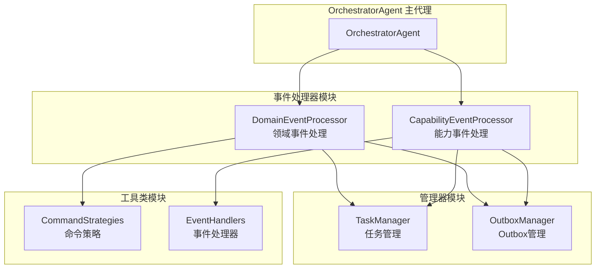

### 📊 领域事件处理器 (DomainEventProcessor)

专门负责处理领域事件的模块，采用策略模式实现清晰的职责分离：

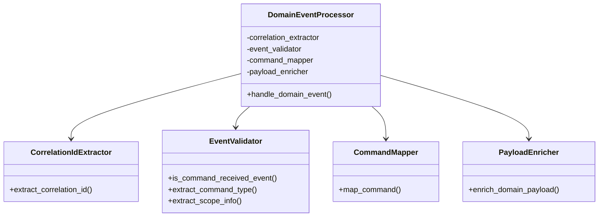

**核心功能**：
- **关联ID提取**: 从多来源（context.meta、headers、事件元数据）提取correlation_id
- **事件验证**: 验证事件类型是否为Command.Received
- **命令映射**: 将命令映射到领域事件和能力任务
- **负载丰富**: 用会话上下文和用户信息丰富有效负载

### 🔧 能力事件处理器 (CapabilityEventProcessor)

专门负责处理能力事件的模块，采用提取器-匹配器模式：

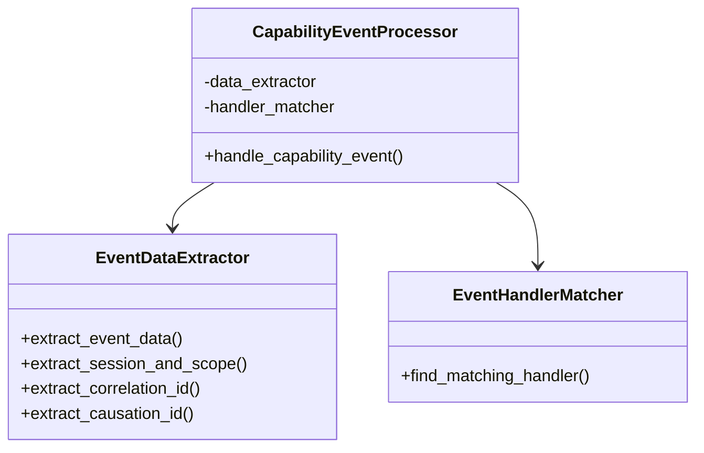

**核心功能**：
- **数据提取**: 从消息中提取事件数据和上下文信息
- **会话和作用域识别**: 从主题和数据中推断作用域类型
- **处理器匹配**: 按顺序尝试不同的处理器直到找到匹配项
- **关联ID管理**: 提取和管理correlation_id和causation_id

### 🎯 任务管理器 (TaskManager)

负责异步任务生命周期管理的统一接口：

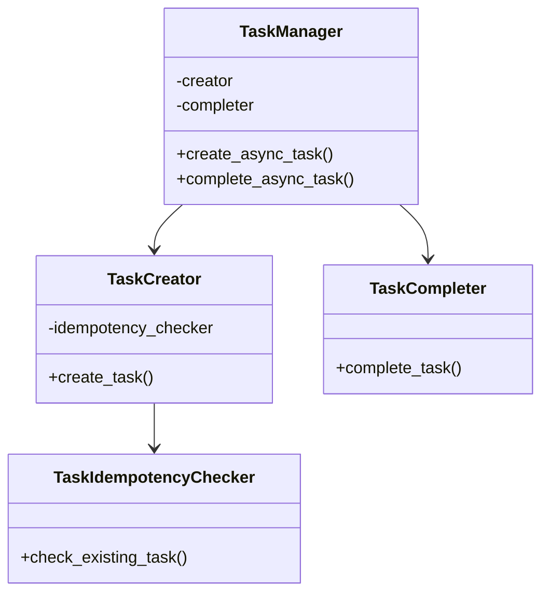

**核心特性**：
- **幂等性保护**: 防止重复创建RUNNING/PENDING状态的任务
- **关联ID解析**: 支持UUID格式的correlation_id解析
- **任务完成**: 通过correlation_id和任务前缀匹配完成对应任务
- **状态管理**: 完整的任务生命周期状态跟踪

### 📬 Outbox管理器 (OutboxManager)

统一的领域事件持久化和能力任务入队管理接口：

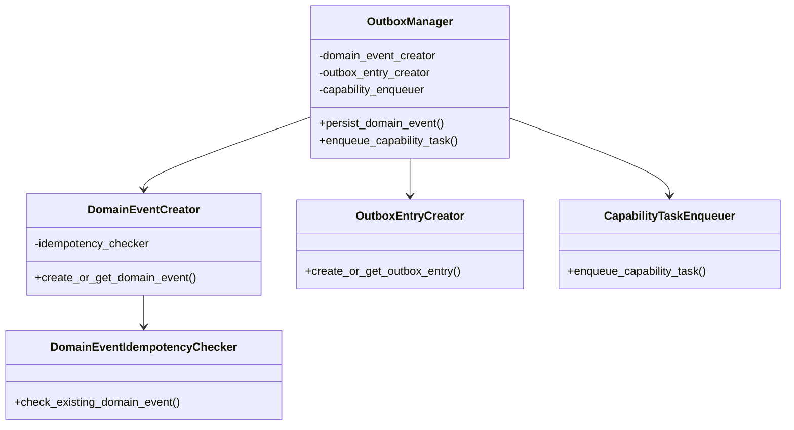

**核心特性**：
- **领域事件幂等性**: 通过correlation_id + event_type确保唯一性
- **Outbox条目管理**: 基于领域事件ID的幂等性检查
- **能力任务入队**: 统一的能力任务消息封装和路由
- **事务一致性**: 领域事件和Outbox条目在同一个事务中创建

### OrchestratorAgent

主编排代理类，继承自 `BaseAgent`，负责处理两种类型的事件，并增强关联ID追踪能力：

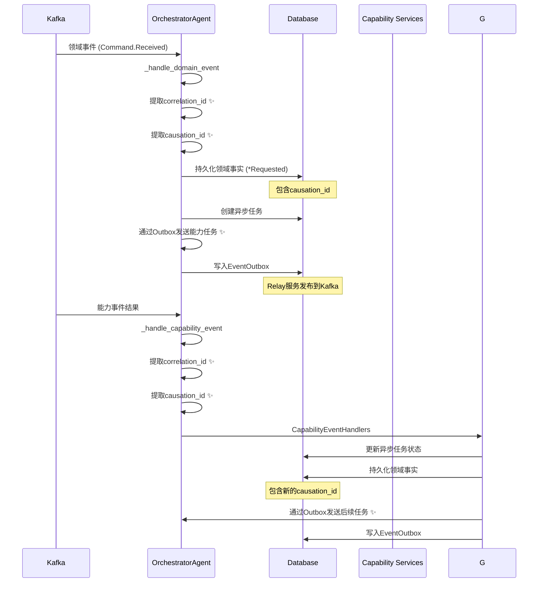

### 事件处理流程

编排器作为领域事件的总枢纽，处理两种类型的事件：

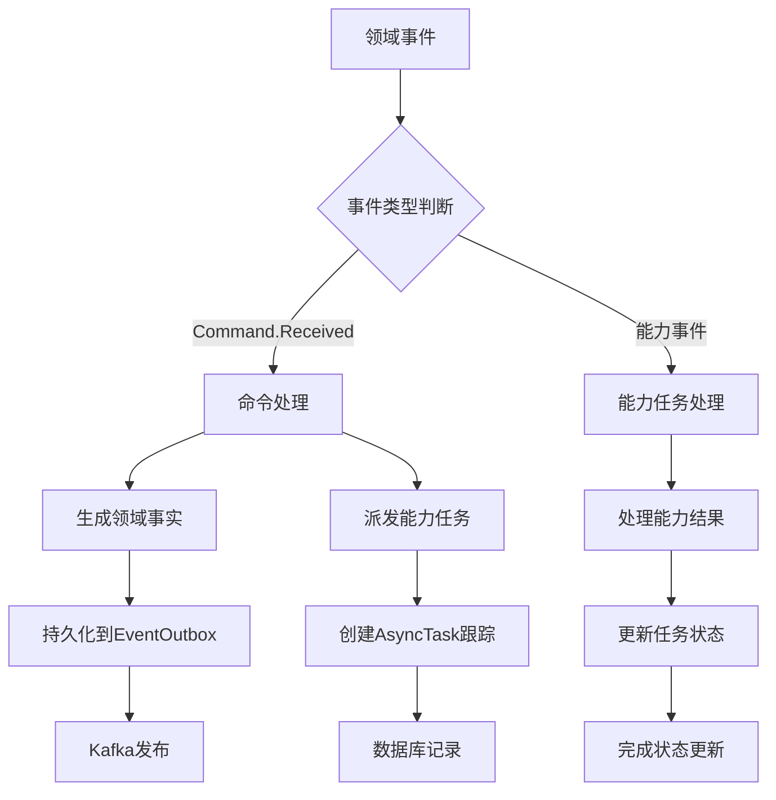

### 🔗 关联ID (Correlation ID) 追踪与因果关系 (Causation ID) ✨

为了实现端到端的请求追踪和调试能力，编排器增强了关联ID的提取和处理逻辑，并新增了因果关系追踪：

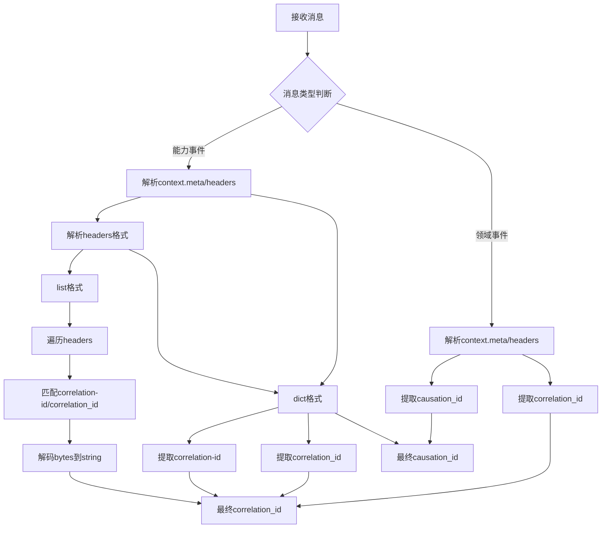

#### 关联ID提取优先级

1. **Context.meta.correlation_id** - 消息处理器元数据中的关联ID
2. **Context.headers.correlation_id** - 消息头中的关联ID（字典格式）
3. **Context.headers.correlation-id** - 消息头中的关联ID（连字符格式）
4. **Headers列表遍历** - 支持元组列表格式的headers解析
5. **Event.metadata.correlation_id** - 事件元数据中的关联ID
6. **Event.correlation_id** - 事件本体中的关联ID

#### 因果关系ID (Causation ID) 追踪 ✨

为了建立完整的事件链路追踪，编排器支持因果关系ID：

- **领域事件处理**: 从 `evt.get("event_id")` 提取作为后续domain event的causation_id
- **能力事件处理**: 从 `context.get("meta", {}).get("event_id")` 或 `data.get("event_id")` 提取
- **事件持久化**: 在 `_persist_domain_event` 方法中支持causation_id参数
- **链路追踪**: 通过causation_id可以追踪事件之间的因果依赖关系

#### 实现特性

- **多格式支持**: 支持 dict 和 list[tuple] 两种 headers 格式
- **编码处理**: 自动解码 bytes 类型的 header 值为 UTF-8 字符串
- **容错机制**: 解析失败时回退到下一优先级，不影响主流程
- **灵活匹配**: 支持 `correlation_id` 和 `correlation-id` 两种命名格式
- **因果关系追踪**: 完整的事件链路依赖关系追踪

### CommandStrategyRegistry

命令策略注册表，使用策略模式实现不同命令类型的处理逻辑。最近更新增强了命令映射配置，支持配置优先的映射策略：

```mermaid
classDiagram
    class CommandStrategyRegistry {
        +process_command()
        +register()
        -_strategies
        -_register_default_strategies()
    }
    
    class CommandStrategy {
        <<abstract>>
        +get_aliases() set[str]
        +process() CommandMapping
        +_build_topic() str
    }
    
    class CharacterRequestStrategy {
        +get_aliases() set[str]
        +process() CommandMapping
    }
    
    class ThemeRequestStrategy {
        +get_aliases() set[str]
        +process() CommandMapping
    }
    
    class SeedRequestStrategy {
        +get_aliases() set[str]
        +process() CommandMapping
    }
    
    class WorldRequestStrategy {
        +get_aliases() set[str]
        +process() CommandMapping
    }
    
    class PlotRequestStrategy {
        +get_aliases() set[str]
        +process() CommandMapping
    }
    
    class DetailsRequestStrategy {
        +get_aliases() set[str]
        +process() CommandMapping
    }
    
    class StageValidationStrategy {
        +get_aliases() set[str]
        +process() CommandMapping
    }
    
    class StageLockStrategy {
        +get_aliases() set[str]
        +process() CommandMapping
    }
    
    CommandStrategyRegistry --> CommandStrategy
    CharacterRequestStrategy --|> CommandStrategy
    ThemeRequestStrategy --|> CommandStrategy
    SeedRequestStrategy --|> CommandStrategy
    WorldRequestStrategy --|> CommandStrategy
    PlotRequestStrategy --|> CommandStrategy
    DetailsRequestStrategy --|> CommandStrategy
    StageValidationStrategy --|> CommandStrategy
    StageLockStrategy --|> CommandStrategy
```

### CapabilityEventHandlers

能力事件处理器集合，处理不同类型的能力完成事件：

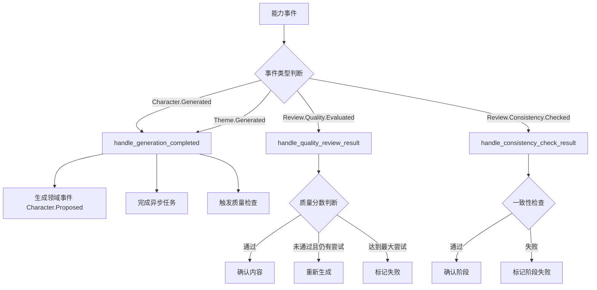

## 🔧 命令处理流程

### 1. 命令到事件的映射

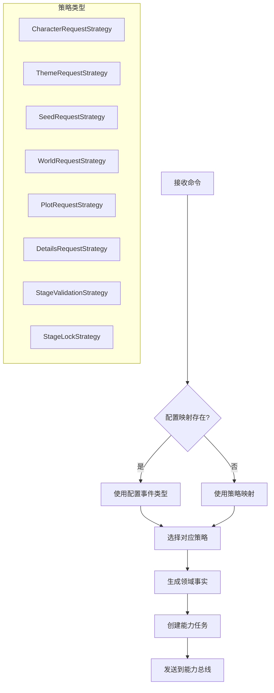

### 2. 幂等性保证

- **领域事件**：通过 `correlation_id + event_type` 确保唯一性
- **异步任务**：检查已有 `RUNNING/PENDING` 状态的任务
- **EventOutbox**：基于domain event ID的upsert操作

### 3. 任务状态管理

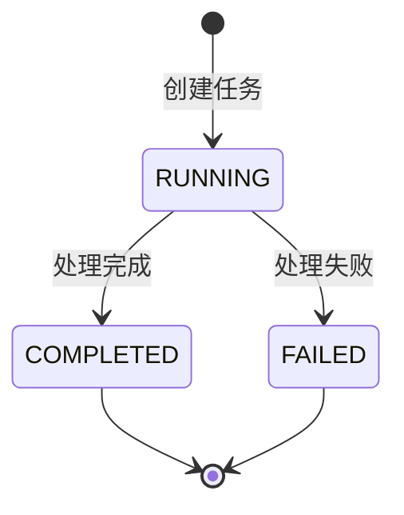

### 4. Outbox模式统一消息发送 ✨

为了确保消息发送的一致性和可靠性，编排器统一使用EventOutbox模式发送消息：

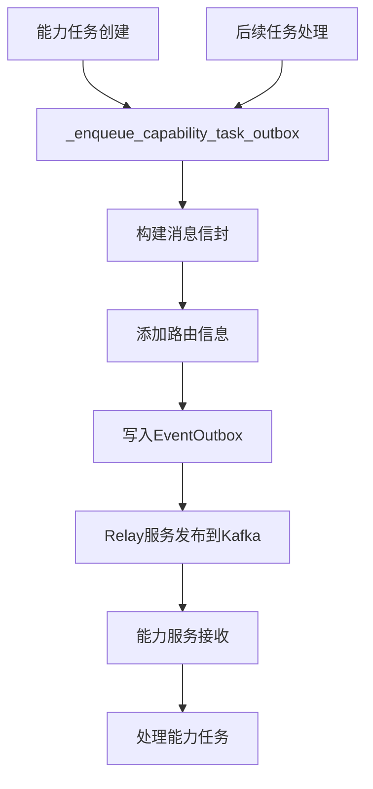

#### Outbox模式优势

- **一致性保证**: 消息发送与数据库操作在同一个事务中完成
- **可靠性**: 即使应用崩溃，Relay服务也能确保消息被投递
- **可观测性**: 消息发送状态可以在数据库中追踪
- **重试机制**: Relay服务支持失败重试和死信队列

### 5. 事务一致性

```python
async with create_sql_session() as db:
    # 原子性操作：DomainEvent + EventOutbox + AsyncTask
    dom_evt = DomainEvent(...)
    db.add(dom_evt)
    
    outbox = EventOutbox(...)
    db.add(outbox)
    
    task = AsyncTask(...)
    db.add(task)
    
    await db.commit()  # 全部成功或全部失败
```

## 🔄 重构优势与设计改进

### 架构清晰度提升

#### 单一职责原则 (SRP)
- **DomainEventProcessor**: 专门处理领域事件相关逻辑
- **CapabilityEventProcessor**: 专门处理能力事件相关逻辑  
- **TaskManager**: 专门管理异步任务生命周期
- **OutboxManager**: 专门管理事件持久化和消息入队

#### 依赖倒置原则 (DIP)
- 通过依赖注入实现模块间的松耦合
- 接口定义清晰，便于测试和扩展
- 各模块可以独立进行单元测试

#### 开闭原则 (OCP)
- 新增事件类型无需修改现有处理器
- 通过策略模式支持新命令类型的扩展
- 处理器匹配机制支持灵活的事件处理

### 代码质量改进

#### 可读性增强
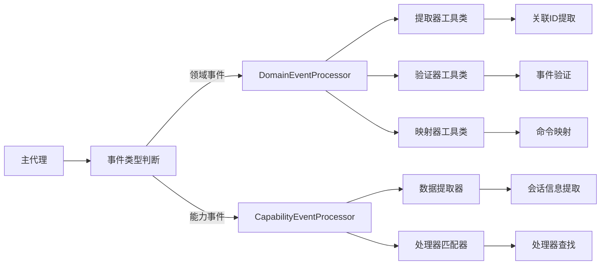

#### 可维护性提升
- **模块边界清晰**: 每个模块有明确的职责边界
- **代码复用**: 工具类可以在不同处理器间复用
- **错误隔离**: 单个模块的错误不会影响其他模块
- **测试友好**: 每个模块可以独立进行单元测试

#### 可扩展性设计
- **插件式架构**: 新的事件处理器可以轻松添加
- **配置驱动**: 命令映射和事件处理可通过配置扩展
- **策略模式**: 支持不同的处理策略和算法

### 性能优化

#### 异步处理优化
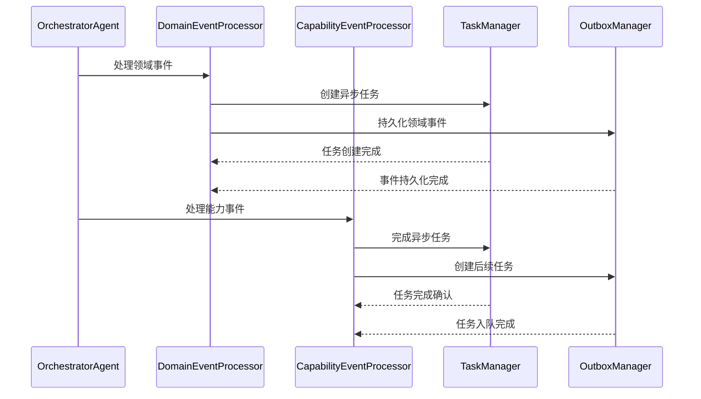

#### 资源管理改进
- **数据库连接池**: 统一的数据库会话管理
- **幂等性检查**: 避免重复操作和资源浪费
- **批量处理**: 支持批量事件处理以提高性能

### 监控和调试增强

#### 日志结构化
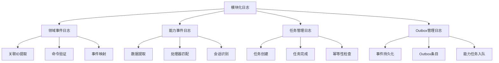

#### 调试能力提升
- **模块级追踪**: 可以追踪每个处理器的执行状态
- **详细日志**: 每个模块提供详细的处理日志
- **错误定位**: 错误可以快速定位到具体模块
- **性能分析**: 可以分析每个模块的处理时间

## 🚀 使用示例

### 注册命令策略

```python
# 注册自定义命令策略
class CustomCommandStrategy(CommandStrategy):
    def get_aliases(self) -> set[str]:
        return {"Custom.Command"}
    
    def process(self, scope_type: str, scope_prefix: str, aggregate_id: str, payload: dict[str, Any]) -> CommandMapping:
        return CommandMapping(
            requested_action="Custom.Requested",
            capability_message={
                "type": "Custom.Process.Requested",
                "session_id": aggregate_id,
                "input": payload.get("payload", {}),
            }
        )

# 注册到全局注册表
command_registry.register(CustomCommandStrategy())
```

### 处理能力事件

```python
# 扩展事件处理器
class CustomEventHandler:
    @staticmethod
    def handle_custom_event(msg_type: str, session_id: str, data: dict[str, Any]) -> EventAction | None:
        if msg_type == "Custom.Process.Completed":
            return EventAction(
                domain_event={
                    "scope_type": "GENESIS",
                    "session_id": session_id,
                    "event_action": "Custom.Completed",
                    "payload": data,
                },
                task_completion={
                    "correlation_id": data.get("correlation_id"),
                    "expect_task_prefix": "Custom.Process",
                    "result_data": data,
                }
            )
        return None
```

## 📊 监控和调试

### 关键日志点

#### 消息处理日志
- `orchestrator_message_received`: 接收消息时的基本信息
- `orchestrator_processing_domain_event`: 开始处理领域事件
- `orchestrator_processing_capability_event`: 开始处理能力事件
- `orchestrator_ignored_message`: 忽略未知格式的消息

#### 领域事件处理日志
- `orchestrator_domain_event_details`: 领域事件详细信息 ✨ (包含correlation_id和causation_id)
- `orchestrator_domain_event_ignored`: 忽略非命令类领域事件
- `orchestrator_domain_event_missing_command_type`: 缺少命令类型
- `orchestrator_processing_command`: 开始处理命令
- `orchestrator_command_mapped`: 命令映射成功
- `orchestrator_command_mapping_failed`: 命令映射失败
- `orchestrator_domain_event_persisted`: 领域事件持久化成功
- `orchestrator_domain_event_persist_failed`: 领域事件持久化失败
- `orchestrator_domain_event_processed`: 领域事件处理完成
- `orchestrator_capability_task_enqueued`: 能力任务通过Outbox入队 ✨
- `orchestrator_followup_task_enqueued`: 后续任务通过Outbox入队 ✨

#### 能力事件处理日志
- `orchestrator_capability_event_details`: 能力事件详细信息
- `orchestrator_trying_handler`: 尝试事件处理器
- `orchestrator_handler_matched`: 匹配到处理器
- `orchestrator_no_handler_matched`: 无匹配处理器
- `orchestrator_executing_event_action`: 执行事件动作
- `orchestrator_persisting_domain_event`: 持久化领域事件
- `orchestrator_completing_async_task`: 完成异步任务
- `orchestrator_returning_capability_message`: 返回能力消息

#### 异步任务管理日志
- `orchestrator_creating_async_task`: 创建异步任务
- `orchestrator_async_task_skipped`: 跳过异步任务创建
- `orchestrator_async_task_correlation_parsed`: 解析关联ID
- `orchestrator_async_task_correlation_parse_failed`: 关联ID解析失败
- `orchestrator_checking_existing_task`: 检查现有任务
- `orchestrator_async_task_already_exists`: 检测到重复任务
- `orchestrator_creating_new_async_task`: 创建新任务
- `orchestrator_async_task_created_success`: 任务创建成功
- `orchestrator_completing_async_task`: 完成异步任务
- `orchestrator_async_task_complete_skipped`: 跳过任务完成
- `orchestrator_async_task_complete_correlation_parsed`: 解析完成关联ID
- `orchestrator_async_task_complete_correlation_parse_failed`: 完成关联ID解析失败
- `orchestrator_searching_async_task_to_complete`: 查找待完成任务
- `orchestrator_async_task_not_found_for_completion`: 未找到待完成任务
- `orchestrator_async_task_found_for_completion`: 找到待完成任务
- `orchestrator_async_task_completed_success`: 任务完成成功

#### 领域事件持久化日志
- `orchestrator_persisting_domain_event`: 持久化领域事件
- `orchestrator_checking_existing_domain_event`: 检查现有领域事件
- `orchestrator_domain_event_already_exists`: 检测到重复领域事件
- `orchestrator_no_existing_domain_event_found`: 未找到现有领域事件
- `orchestrator_existing_domain_event_check_failed`: 现有领域事件检查失败
- `orchestrator_creating_new_domain_event`: 创建新领域事件
- `orchestrator_domain_event_created`: 领域事件创建成功
- `orchestrator_using_existing_domain_event`: 使用现有领域事件
- `orchestrator_checking_outbox_entry`: 检查Outbox条目
- `orchestrator_creating_outbox_entry`: 创建Outbox条目
- `orchestrator_outbox_entry_created`: Outbox条目创建成功
- `orchestrator_outbox_entry_already_exists`: Outbox条目已存在
- `orchestrator_domain_event_persist_completed`: 领域事件持久化完成

### 日志结构化信息

每个日志事件都包含相关的上下文信息，便于追踪和调试：

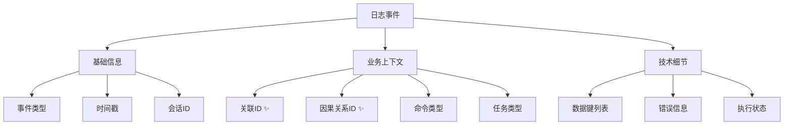

**关联ID和因果关系ID追踪增强** ✨

通过增强的correlation_id和causation_id提取机制，所有关键日志事件现在都包含完整的追踪标识，支持：

- **端到端追踪**: 从用户请求到最终响应的完整链路追踪
- **因果关系分析**: 通过causation_id追踪事件之间的依赖关系
- **问题定位**: 快速定位特定请求在分布式系统中的执行路径
- **性能分析**: 分析请求在各个组件间的处理时间
- **错误关联**: 将相关的错误和警告消息关联到同一请求
- **事件链路重建**: 基于correlation_id和causation_id重建完整的事件处理链路

### 性能考虑

- 使用数据库连接池管理会话
- 批量处理领域事件持久化
- 异步任务状态更新采用乐观锁
- 详细日志记录可能影响性能，生产环境可调整日志级别

### 调试建议

1. **追踪消息流向**: 使用 `orchestrator_message_received` 和相关处理日志
2. **监控异步任务**: 关注任务创建和完成的日志序列
3. **排查持久化问题**: 查看 `orchestrator_domain_event_persist_*` 系列日志
4. **分析性能瓶颈**: 结合时间戳和执行状态日志

## 🔗 相关模块

- **事件映射**: `src.common.events.mapping` - 统一事件映射配置
- **领域模型**: `src.models.event` - 领域事件模型
- **工作流模型**: `src.models.workflow` - 异步任务模型
- **基础代理**: `src.agents.base` - 代理基类

## 📝 注意事项

1. **幂等性**：所有关键操作都需要考虑幂等性保护
2. **错误处理**：能力任务创建失败时只记录警告，不中断主流程
3. **事件溯源**：领域事件通过 EventOutbox 模式确保可靠投递
4. **任务追踪**：每个能力任务都创建对应的 AsyncTask 记录用于追踪

## 🔍 扩展指南

### 架构模式说明

#### 提取器模式 (Extractor Pattern)
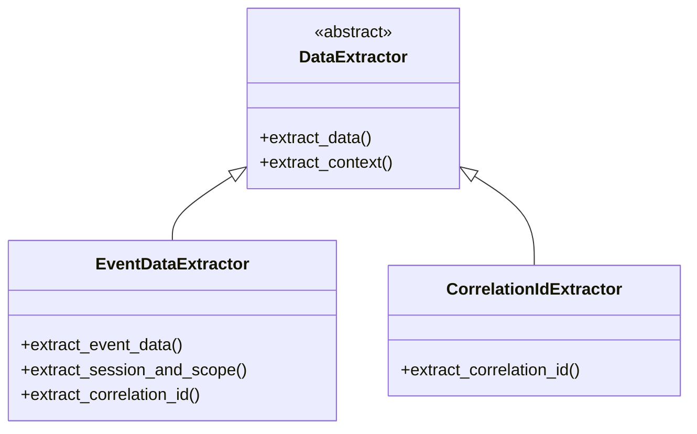

**优势**：
- 数据提取逻辑集中管理
- 支持多种数据源和格式
- 便于测试和维护
- 遵循单一职责原则

#### 匹配器模式 (Matcher Pattern)
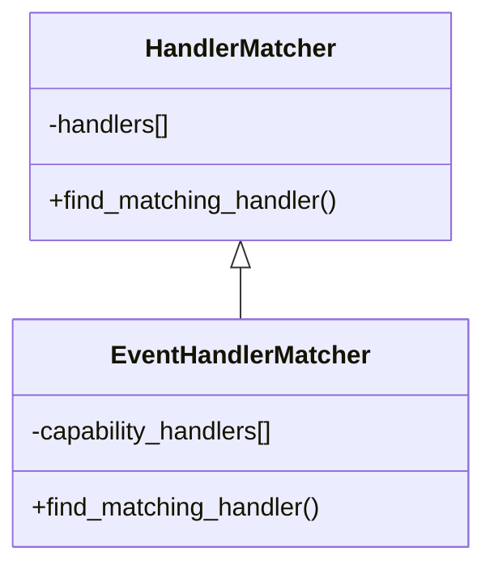

**优势**：
- 处理器查找逻辑统一管理
- 支持优先级和回退机制
- 便于添加新的处理器
- 处理逻辑与匹配逻辑分离

#### 管理器模式 (Manager Pattern)
```mermaid
classDiagram
    class BaseManager {
        <<abstract>>
        +initialize()
        +process()
    }
    
    class TaskManager {
        +create_async_task()
        +complete_async_task()
        -creator
        -completer
    }
    
    class OutboxManager {
        +persist_domain_event()
        +enqueue_capability_task()
        -domain_creator
        -outbox_creator
        -capability_enqueuer
    }
    
    BaseManager <|-- TaskManager
    BaseManager <|-- OutboxManager
```

**优势**：
- 统一的管理接口
- 复杂操作封装
- 依赖注入和生命周期管理
- 便于监控和调试

### 添加新的命令类型

1. 在`command_strategies.py`中注册新的命令映射
2. 更新`CapabilityEventHandlers`添加对应的事件处理器
3. 在测试中验证端到端流程

### 添加新的能力事件

1. 在`event_handlers.py`中实现新的处理方法
2. 更新处理器列表和匹配逻辑
3. 添加相应的异步任务状态管理

### 添加新的数据提取器

```python
# 自定义数据提取器示例
class CustomDataExtractor:
    @staticmethod
    def extract_custom_data(message: dict[str, Any]) -> dict[str, Any]:
        """提取自定义数据字段"""
        return {
            "custom_field": message.get("custom_field"),
            "metadata": message.get("metadata", {}),
        }
    
    @staticmethod
    def validate_custom_data(data: dict[str, Any]) -> bool:
        """验证自定义数据格式"""
        return "custom_field" in data
```

### 添加新的管理器

```python
# 自定义管理器示例
class CustomManager:
    def __init__(self, logger):
        self.log = logger
        self.extractor = CustomDataExtractor()
    
    async def process_custom_operation(self, data: dict[str, Any]) -> dict[str, Any]:
        """处理自定义操作"""
        extracted_data = self.extractor.extract_custom_data(data)
        if not self.extractor.validate_custom_data(extracted_data):
            raise ValueError("Invalid custom data format")
        
        # 处理逻辑...
        return {"result": "success", "data": extracted_data}
```

## 🧪 测试策略

### 模块化测试方法

#### 单元测试架构
```mermaid
graph TD
    A[测试架构] --> B[Mock依赖]
    A --> C[隔离测试]
    A --> D[断言验证]
    
    B --> B1[数据库Mock]
    B --> B2[日志Mock]
    B --> B3[外部服务Mock]
    
    C --> C1[DomainEventProcessor测试]
    C --> C2[CapabilityEventProcessor测试]
    C --> C3[TaskManager测试]
    C --> C4[OutboxManager测试]
    
    D --> D1[功能正确性]
    D --> D2[边界条件]
    D --> D3[错误处理]
    D --> D4[性能指标]
```

#### 提取器测试
```python
# CorrelationIdExtractor测试示例
class TestCorrelationIdExtractor:
    def test_extract_from_context_meta(self):
        """测试从context.meta提取correlation_id"""
        context = {"meta": {"correlation_id": "test-id"}}
        result = CorrelationIdExtractor.extract_correlation_id({}, context)
        assert result == "test-id"
    
    def test_extract_from_headers_dict(self):
        """测试从headers字典提取correlation_id"""
        context = {"headers": {"correlation_id": "test-id"}}
        result = CorrelationIdExtractor.extract_correlation_id({}, context)
        assert result == "test-id"
    
    def test_extract_from_headers_list(self):
        """测试从headers列表提取correlation_id"""
        context = {"headers": [("correlation-id", b"test-id")]}
        result = CorrelationIdExtractor.extract_correlation_id({}, context)
        assert result == "test-id"
    
    def test_fallback_to_event_metadata(self):
        """测试回退到事件元数据"""
        evt = {"metadata": {"correlation_id": "test-id"}}
        result = CorrelationIdExtractor.extract_correlation_id(evt, None)
        assert result == "test-id"
```

#### 匹配器测试
```python
# EventHandlerMatcher测试示例
class TestEventHandlerMatcher:
    def test_find_matching_handler_success(self):
        """测试成功匹配处理器"""
        matcher = EventHandlerMatcher(mock_logger)
        action = matcher.find_matching_handler(
            msg_type="Character.Generated",
            session_id="test-session",
            data={},
            correlation_id="test-id",
            scope_info={"scope_type": "GENESIS"},
            causation_id="cause-id"
        )
        assert action is not None
        assert action.domain_event is not None
    
    def test_no_matching_handler(self):
        """测试无匹配处理器的情况"""
        matcher = EventHandlerMatcher(mock_logger)
        action = matcher.find_matching_handler(
            msg_type="Unknown.Event",
            session_id="test-session",
            data={},
            correlation_id="test-id",
            scope_info={"scope_type": "GENESIS"},
            causation_id="cause-id"
        )
        assert action is None
```

#### 管理器测试
```python
# TaskManager测试示例
class TestTaskManager:
    def test_create_async_task_success(self):
        """测试成功创建异步任务"""
        manager = TaskManager(mock_logger)
        with patch('src.db.sql.session.create_sql_session') as mock_session:
            await manager.create_async_task(
                correlation_id="test-id",
                session_id="test-session",
                task_type="Character.Design.Generation",
                input_data={"prompt": "test"}
            )
            mock_session.assert_called_once()
    
    def test_complete_async_task_success(self):
        """测试成功完成异步任务"""
        manager = TaskManager(mock_logger)
        with patch('src.db.sql.session.create_sql_session') as mock_session:
            await manager.complete_async_task(
                correlation_id="test-id",
                expect_task_prefix="Character.Design",
                result_data={"character": "test"}
            )
            mock_session.assert_called_once()
```

#### 集成测试
```python
# OrchestratorAgent集成测试示例
class TestOrchestratorAgent:
    def test_handle_domain_event_integration(self):
        """测试领域事件处理的完整集成"""
        agent = OrchestratorAgent(
            name="test-agent",
            consume_topics=["test.topic"],
            produce_topics=["test.output"]
        )
        
        message = {
            "event_type": "Genesis.Character.Command.Received",
            "aggregate_id": "test-session",
            "payload": {
                "command_type": "Character.Request",
                "input": {"prompt": "test"}
            }
        }
        
        result = await agent.process_message(message)
        assert result is None  # 异步处理完成
        
        # 验证数据库状态
        async with create_sql_session() as db:
            domain_event = await db.scalar(
                select(DomainEvent).where(
                    DomainEvent.correlation_id == UUID("test-id")
                )
            )
            assert domain_event is not None
    
    def test_handle_capability_event_integration(self):
        """测试能力事件处理的完整集成"""
        agent = OrchestratorAgent(
            name="test-agent",
            consume_topics=["test.topic"],
            produce_topics=["test.output"]
        )
        
        message = {"data": {"result": "test"}}
        context = {
            "meta": {
                "type": "Character.Generated",
                "correlation_id": "test-id",
                "event_id": "cause-id"
            },
            "topic": "genesis.character.events"
        }
        
        result = await agent.process_message(message, context)
        assert result is None  # 异步处理完成
```

### 性能测试

#### 基准测试
```python
# 性能测试示例
class TestOrchestratorPerformance:
    def test_domain_event_processing_throughput(self):
        """测试领域事件处理吞吐量"""
        import time
        agent = OrchestratorAgent(
            name="perf-test-agent",
            consume_topics=["test.topic"],
            produce_topics=["test.output"]
        )
        
        # 准备测试数据
        events = []
        for i in range(1000):
            events.append({
                "event_type": "Genesis.Character.Command.Received",
                "aggregate_id": f"session-{i}",
                "payload": {
                    "command_type": "Character.Request",
                    "input": {"prompt": f"test-{i}"}
                }
            })
        
        # 测量处理时间
        start_time = time.time()
        for event in events:
            await agent.process_message(event)
        end_time = time.time()
        
        processing_time = end_time - start_time
        throughput = len(events) / processing_time
        
        print(f"Processing time: {processing_time:.2f} seconds")
        print(f"Throughput: {throughput:.2f} events/second")
        
        # 性能断言
        assert throughput > 100  # 每秒处理超过100个事件
        assert processing_time < 10  # 总处理时间少于10秒
```

### 错误处理测试

#### 异常场景测试
```python
# 错误处理测试示例
class TestOrchestratorErrorHandling:
    def test_database_connection_failure(self):
        """测试数据库连接失败的场景"""
        with patch('src.db.sql.session.create_sql_session') as mock_session:
            mock_session.side_effect = Exception("Database connection failed")
            
            manager = TaskManager(mock_logger)
            
            # 应该记录错误但不抛出异常
            await manager.create_async_task(
                correlation_id="test-id",
                session_id="test-session",
                task_type="Character.Design.Generation",
                input_data={"prompt": "test"}
            )
            
            # 验证错误被正确记录
            mock_logger.error.assert_called()
    
    def test_invalid_correlation_id(self):
        """测试无效correlation_id的处理"""
        manager = TaskManager(mock_logger)
        
        # 应该记录警告但不中断处理
        await manager.create_async_task(
            correlation_id="invalid-uuid",
            session_id="test-session",
            task_type="Character.Design.Generation",
            input_data={"prompt": "test"}
        )
        
        # 验证警告被正确记录
        mock_logger.warning.assert_called()
```

### 测试覆盖率要求

- **单元测试覆盖率**: 每个模块 > 90%
- **集成测试覆盖率**: 关键路径 > 80%
- **错误处理测试**: 所有异常场景
- **边界条件测试**: 输入验证和边界值
- **性能测试**: 关键路径性能基准

## 📊 监控指标

- **事件处理吞吐量**：每秒处理的领域事件数量
- **任务创建成功率**：AsyncTask创建的成功率
- **端到端延迟**：从命令接收到结果返回的总时间
- **错误率**：各类处理错误的分类统计

## 🔧 配置要求

### 依赖服务
- **Kafka**：领域事件总线和能力任务队列
- **PostgreSQL**：领域事件和任务状态持久化
- **Redis**：可选的缓存和会话管理

### 环境配置
```yaml
orchestrator:
  consume_topics:
    - "genesis.domain.events"
    - "genesis.capability.events"
  produce_topics:
    - "genesis.character.events"
    - "genesis.plot.events"
    - "genesis.quality.events"
```