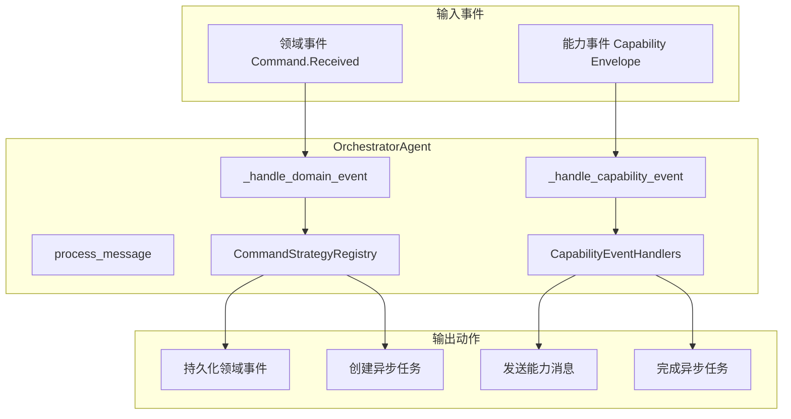
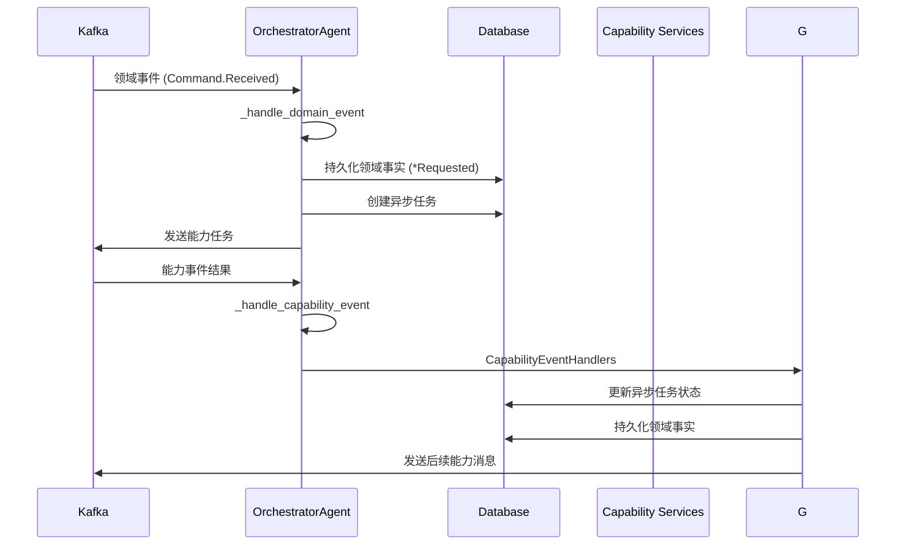
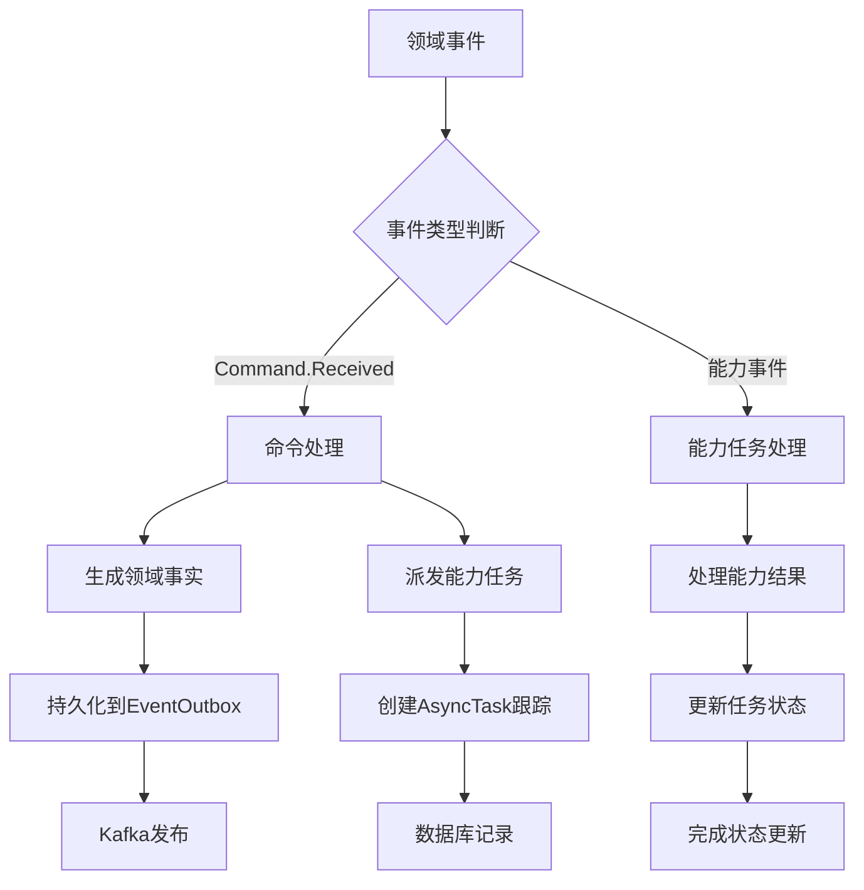
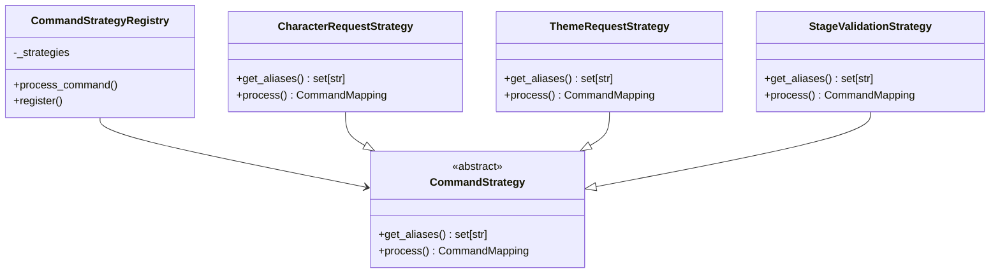
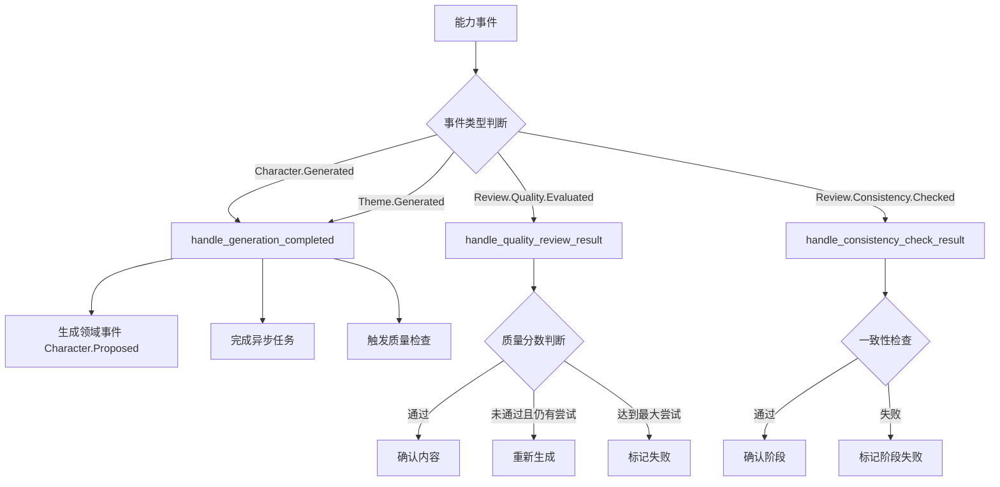
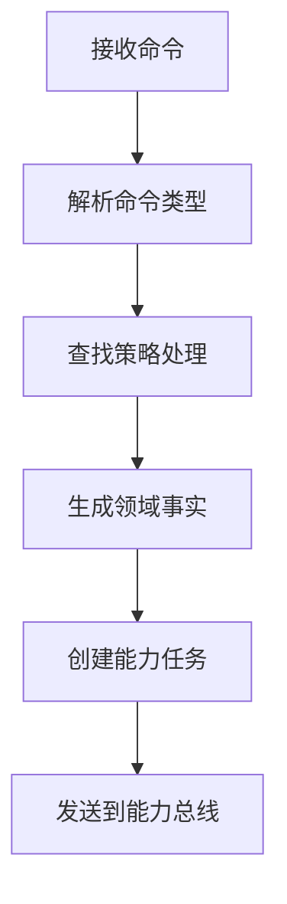
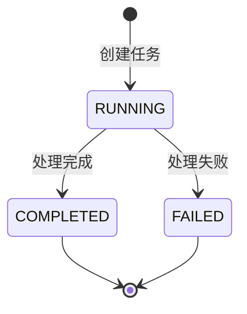
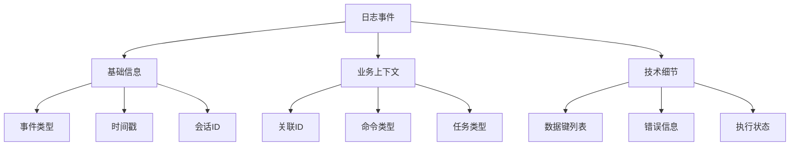

# 领域代理编排器 (Orchestrator Agent)

负责协调和管理领域事件与能力任务之间的流转，是整个事件驱动架构的核心协调组件。

## 🏗️ 架构概览

### 核心职责

- **事件处理**：消费领域总线和能力事件
- **命令映射**：将触发类领域事件投影为领域事实
- **任务分发**：向对应的能力主题发送能力任务
- **结果投影**：将能力结果投影为领域事实

### 架构图



## 📁 目录结构

```
orchestrator/
├── __init__.py           # 代理注册和导出
├── agent.py              # 主编排代理类
├── command_strategies.py # 命令处理策略
├── event_handlers.py     # 能力事件处理器
└── message_factory.py    # 消息工厂
```

## 🎯 核心组件

### OrchestratorAgent

主编排代理类，继承自 `BaseAgent`，负责处理两种类型的事件：



### 事件处理流程

编排器作为领域事件的总枢纽，处理两种类型的事件：



### CommandStrategyRegistry

命令策略注册表，使用策略模式实现不同命令类型的处理逻辑：



### CapabilityEventHandlers

能力事件处理器集合，处理不同类型的能力完成事件：



## 🔧 命令处理流程

### 1. 命令到事件的映射



### 2. 幂等性保证

- **领域事件**：通过 `correlation_id + event_type` 确保唯一性
- **异步任务**：检查已有 `RUNNING/PENDING` 状态的任务
- **EventOutbox**：基于domain event ID的upsert操作

### 3. 任务状态管理



### 4. 事务一致性

```python
async with create_sql_session() as db:
    # 原子性操作：DomainEvent + EventOutbox + AsyncTask
    dom_evt = DomainEvent(...)
    db.add(dom_evt)
    
    outbox = EventOutbox(...)
    db.add(outbox)
    
    task = AsyncTask(...)
    db.add(task)
    
    await db.commit()  # 全部成功或全部失败
```

## 🚀 使用示例

### 注册命令策略

```python
# 注册自定义命令策略
class CustomCommandStrategy(CommandStrategy):
    def get_aliases(self) -> set[str]:
        return {"Custom.Command"}
    
    def process(self, scope_type: str, scope_prefix: str, aggregate_id: str, payload: dict[str, Any]) -> CommandMapping:
        return CommandMapping(
            requested_action="Custom.Requested",
            capability_message={
                "type": "Custom.Process.Requested",
                "session_id": aggregate_id,
                "input": payload.get("payload", {}),
            }
        )

# 注册到全局注册表
command_registry.register(CustomCommandStrategy())
```

### 处理能力事件

```python
# 扩展事件处理器
class CustomEventHandler:
    @staticmethod
    def handle_custom_event(msg_type: str, session_id: str, data: dict[str, Any]) -> EventAction | None:
        if msg_type == "Custom.Process.Completed":
            return EventAction(
                domain_event={
                    "scope_type": "GENESIS",
                    "session_id": session_id,
                    "event_action": "Custom.Completed",
                    "payload": data,
                },
                task_completion={
                    "correlation_id": data.get("correlation_id"),
                    "expect_task_prefix": "Custom.Process",
                    "result_data": data,
                }
            )
        return None
```

## 📊 监控和调试

### 关键日志点

#### 消息处理日志
- `orchestrator_message_received`: 接收消息时的基本信息
- `orchestrator_processing_domain_event`: 开始处理领域事件
- `orchestrator_processing_capability_event`: 开始处理能力事件
- `orchestrator_ignored_message`: 忽略未知格式的消息

#### 领域事件处理日志
- `orchestrator_domain_event_details`: 领域事件详细信息
- `orchestrator_domain_event_ignored`: 忽略非命令类领域事件
- `orchestrator_domain_event_missing_command_type`: 缺少命令类型
- `orchestrator_processing_command`: 开始处理命令
- `orchestrator_command_mapped`: 命令映射成功
- `orchestrator_command_mapping_failed`: 命令映射失败
- `orchestrator_domain_event_persisted`: 领域事件持久化成功
- `orchestrator_domain_event_persist_failed`: 领域事件持久化失败
- `orchestrator_domain_event_processed`: 领域事件处理完成

#### 能力事件处理日志
- `orchestrator_capability_event_details`: 能力事件详细信息
- `orchestrator_trying_handler`: 尝试事件处理器
- `orchestrator_handler_matched`: 匹配到处理器
- `orchestrator_no_handler_matched`: 无匹配处理器
- `orchestrator_executing_event_action`: 执行事件动作
- `orchestrator_persisting_domain_event`: 持久化领域事件
- `orchestrator_completing_async_task`: 完成异步任务
- `orchestrator_returning_capability_message`: 返回能力消息

#### 异步任务管理日志
- `orchestrator_creating_async_task`: 创建异步任务
- `orchestrator_async_task_skipped`: 跳过异步任务创建
- `orchestrator_async_task_correlation_parsed`: 解析关联ID
- `orchestrator_async_task_correlation_parse_failed`: 关联ID解析失败
- `orchestrator_checking_existing_task`: 检查现有任务
- `orchestrator_async_task_already_exists`: 检测到重复任务
- `orchestrator_creating_new_async_task`: 创建新任务
- `orchestrator_async_task_created_success`: 任务创建成功
- `orchestrator_completing_async_task`: 完成异步任务
- `orchestrator_async_task_complete_skipped`: 跳过任务完成
- `orchestrator_async_task_complete_correlation_parsed`: 解析完成关联ID
- `orchestrator_async_task_complete_correlation_parse_failed`: 完成关联ID解析失败
- `orchestrator_searching_async_task_to_complete`: 查找待完成任务
- `orchestrator_async_task_not_found_for_completion`: 未找到待完成任务
- `orchestrator_async_task_found_for_completion`: 找到待完成任务
- `orchestrator_async_task_completed_success`: 任务完成成功

#### 领域事件持久化日志
- `orchestrator_persisting_domain_event`: 持久化领域事件
- `orchestrator_checking_existing_domain_event`: 检查现有领域事件
- `orchestrator_domain_event_already_exists`: 检测到重复领域事件
- `orchestrator_no_existing_domain_event_found`: 未找到现有领域事件
- `orchestrator_existing_domain_event_check_failed`: 现有领域事件检查失败
- `orchestrator_creating_new_domain_event`: 创建新领域事件
- `orchestrator_domain_event_created`: 领域事件创建成功
- `orchestrator_using_existing_domain_event`: 使用现有领域事件
- `orchestrator_checking_outbox_entry`: 检查Outbox条目
- `orchestrator_creating_outbox_entry`: 创建Outbox条目
- `orchestrator_outbox_entry_created`: Outbox条目创建成功
- `orchestrator_outbox_entry_already_exists`: Outbox条目已存在
- `orchestrator_domain_event_persist_completed`: 领域事件持久化完成

### 日志结构化信息

每个日志事件都包含相关的上下文信息，便于追踪和调试：



### 性能考虑

- 使用数据库连接池管理会话
- 批量处理领域事件持久化
- 异步任务状态更新采用乐观锁
- 详细日志记录可能影响性能，生产环境可调整日志级别

### 调试建议

1. **追踪消息流向**: 使用 `orchestrator_message_received` 和相关处理日志
2. **监控异步任务**: 关注任务创建和完成的日志序列
3. **排查持久化问题**: 查看 `orchestrator_domain_event_persist_*` 系列日志
4. **分析性能瓶颈**: 结合时间戳和执行状态日志

## 🔗 相关模块

- **事件映射**: `src.common.events.mapping` - 统一事件映射配置
- **领域模型**: `src.models.event` - 领域事件模型
- **工作流模型**: `src.models.workflow` - 异步任务模型
- **基础代理**: `src.agents.base` - 代理基类

## 📝 注意事项

1. **幂等性**：所有关键操作都需要考虑幂等性保护
2. **错误处理**：能力任务创建失败时只记录警告，不中断主流程
3. **事件溯源**：领域事件通过 EventOutbox 模式确保可靠投递
4. **任务追踪**：每个能力任务都创建对应的 AsyncTask 记录用于追踪

## 🔍 扩展指南

### 添加新的命令类型

1. 在`command_strategies.py`中注册新的命令映射
2. 更新`CapabilityEventHandlers`添加对应的事件处理器
3. 在测试中验证端到端流程

### 添加新的能力事件

1. 在`event_handlers.py`中实现新的处理方法
2. 更新处理器列表和匹配逻辑
3. 添加相应的异步任务状态管理

## 📊 监控指标

- **事件处理吞吐量**：每秒处理的领域事件数量
- **任务创建成功率**：AsyncTask创建的成功率
- **端到端延迟**：从命令接收到结果返回的总时间
- **错误率**：各类处理错误的分类统计

## 🔧 配置要求

### 依赖服务
- **Kafka**：领域事件总线和能力任务队列
- **PostgreSQL**：领域事件和任务状态持久化
- **Redis**：可选的缓存和会话管理

### 环境配置
```yaml
orchestrator:
  consume_topics:
    - "genesis.domain.events"
    - "genesis.capability.events"
  produce_topics:
    - "genesis.character.events"
    - "genesis.plot.events"
    - "genesis.quality.events"
```